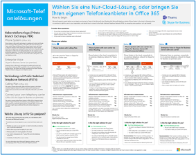

# Ressourcen zur Cloud-IT-Architektur von MicrosoftMicrosoft cloud IT architecture resources

 **Zusammenfassung:** Erfahren Sie mehr über die Hauptkonzepte der Cloudarchitektur für Microsoft-Identitäts-, -Sicherheits-, -Netzwerk- und Hybridlösungen. Sehen Sie sich Empfehlungen zum Schützen von Dateien, Identitäten und Geräten bei Verwendung der Microsoft-Cloud an. Erfahren Sie, wie ein moderner und sicherer Desktop mit Windows 10 und Office ProPlus bereitgestellt wird.**Summary:** Learn core cloud architecture concepts for Microsoft identity, security, networking, and hybrid. Review prescriptive recommendations for protecting files, identities, and devices when using Microsoft's cloud. Learn how to deploy a modern and secure desktop with Windows 10 and Office ProPlus.
  
In diesen Architekturtools- und -postern finden Sie Informationen zu Microsoft-Cloud-Diensten und -Plattformen wie Office 365, Windows 10, Azure Active Directory, Microsoft Intune, Microsoft Dynamics 365 sowie hybride lokale und Cloud-Lösungen. IT-Entscheidungsträger und Architekten können diese Ressourcen verwenden, um die optimalen Lösungen für ihre Arbeitsauslastungen zu bestimmen und Entscheidungen zu Kerninfrastrukturkomponenten wie Identität und Sicherheit zu treffen.These architecture tools and posters give you information about Microsoft cloud services, including Office 365, Windows 10, Azure Active Directory, Microsoft Intune, Microsoft Dynamics 365, and hybrid on-premises and cloud solutions. IT decision makers and architects can use these resources to determine the ideal solutions for their workloads and to make decisions about core infrastructure components such as identity and security. 
  
<!--**[Microsoft's Enterprise Cloud Roadmap](microsoft-cloud-it-architecture-resources.md#roadmap)** (Sway) -->
    
- **[Ressourcen zu Microsoft Cloud für Enterprise-ArchitektenMicrosoft cloud for enterprise architects series](microsoft-cloud-it-architecture-resources.md#cloudarch)** 
    <!-- [Microsoft Cloud Services and Platform Options](microsoft-cloud-it-architecture-resources.md#platformoptions) -->
    - [Microsoft-Cloud-Identität für Enterprise-ArchitektenMicrosoft cloud identity for enterprise architects](microsoft-cloud-it-architecture-resources.md#identity)
    - [Microsoft-Cloud-Sicherheit für Enterprise-ArchitektenMicrosoft cloud security for enterprise architects](microsoft-cloud-it-architecture-resources.md#security)
    - [Microsoft-Cloudnetzwerke für Enterprise-ArchitektenMicrosoft cloud networking for enterprise architects](microsoft-cloud-it-architecture-resources.md#networking)
    - [Microsoft Hybrid Cloud für Enterprise-ArchitektenMicrosoft hybrid cloud for enterprise architects](microsoft-cloud-it-architecture-resources.md#hybrid)
    - [Häufige Angriffe und Microsoft-Funktionen zum Schutz Ihrer OrganisationCommon attacks and Microsoft capabilities that protect your organization](#common-attacks-and-microsoft-capabilities-that-protect-your-organization)
    
- **[Reihe: Microsoft 365 Enterprise-Lösungen](microsoft-cloud-it-architecture-resources.md#BKMK_o365solutions)**:**[Microsoft 365 enterprise solution series](microsoft-cloud-it-architecture-resources.md#BKMK_o365solutions)**:
    - [Identität- und Geräteschutz für Office 365Identity and device protection for Office 365](microsoft-cloud-it-architecture-resources.md#BKMK_O365IDP)
    - [Lösungen zum Schutz von Dateien in Office 365File protection solutions in Office 365](microsoft-cloud-it-architecture-resources.md#BKMK_O365fileprotect)
    - [Schutz von Informationen in Office 365 für die DSGVOOffice 365 Information Protection for GDPR](#office-365-information-protection-for-gdpr)
    - [Microsoft-Sicherheitsleitfaden für politische Kampagnen, gemeinnützigen Organisationen und andere agile OrganisationenMicrosoft Security Guidance for Political Campaigns, Nonprofits, and Other Agile Organizations](#microsoft-security-guidance-for-political-campaigns-nonprofits-and-other-agile-organizations)
    - [Microsoft-TelefonielösungenMicrosoft Telephony Solutions](#microsoft-telephony-solutions) 
    - [Bereitstellen eines modernen und sicheren Desktops mit MicrosoftDeploy a modern and secure desktop with Microsoft](microsoft-cloud-it-architecture-resources.md#msd)
    

  
Teilen Sie uns Ihre Meinung mit! Senden Sie eine E-Mail an [cloudadopt@microsoft.com](mailto:cloudadopt@microsoft.com).Let us know what you think! Send us email at cloudadopt@microsoft.com. 

<!--

## Microsoft's Enterprise Cloud Roadmap

See the posters, icon sets, community venues, and other resources that describe the industry's most complete cloud solution.
  
|**Item**|**Description**|
|:-----|:-----|
|[          ](https://aka.ms/cloudarchitecture)   [Microsoft's Enterprise Cloud Roadmap](https://aka.ms/cloudarchitecture) (https://aka.ms/cloudarchitecture)   |Swipe through this Sway experience for the resources that describe the industry's most complete cloud solution.    |
-->
  

## Reihe: Microsoft Cloud für Enterprise-Architekten
## Microsoft cloud for enterprise architects series

In diesen Postern zur Cloudarchitektur finden Sie Informationen zu Microsoft-Cloud-Diensten und -Plattformen wie Office 365, Azure Active Directory, Microsoft Intune, Microsoft Dynamics CRM Online sowie hybride lokale und Cloud-Lösungen. IT-Entscheidungsträger und Architekten können diese Ressourcen verwenden, um die optimalen Lösungen für ihre Arbeitsauslastungen zu bestimmen und Entscheidungen zu Kerninfrastrukturkomponenten wie Identität und Sicherheit zu treffen.These cloud architecture posters give you information about Microsoft cloud services, including Office 365, Azure Active Directory, Microsoft Intune, Microsoft Dynamics CRM Online, and hybrid on-premises and cloud solutions. IT decision makers and architects can use these resources to determine the ideal solutions for their workloads and to make decisions about core infrastructure components such as identity and security.

<!--  

### Microsoft Cloud Services and Platform Options

Learn key differences between Microsoft cloud services and platform offerings. Find the best fit for your solution.
  
|**Item**|**Description**|
|:-----|:-----|
|[          ](https://www.microsoft.com/download/details.aspx?id=54432)   [PDF](https://go.microsoft.com/fwlink/p/?LinkId=524731)  \| [Visio](https://go.microsoft.com/fwlink/p/?LinkId=524732)  \| [More languages](https://www.microsoft.com/download/details.aspx?id=54432)   | This model describes: <ul><li>  Software as a Service (SaaS) offerings, including Office 365 </li><li>  Platform as a Service (PaaS) features in Microsoft Azure </li><li>  Infrastructure as a Service (IaaS) features in Microsoft Azure </li><li>  Private cloud datacenter capabilities using Windows Server and System Center </li><li>  Learn how Microsoft's own IT department is migrating to these cloud services and building its hybrid cloud. </li></ul> |
-->

   

### Microsoft-Cloudidentität für Enterprise-Architekten
### Microsoft cloud identity for enterprise architects

Was IT-Architekten über das Entwerfen der Identität für Organisationen wissen müssen, die Microsoft-Cloud-Dienste und -Plattformen verwenden.What IT architects need to know about designing identity for organizations using Microsoft cloud services and platforms.
  
|**ElementItem**|**BeschreibungDescription**|
|:-----|:-----|
|[          ](https://www.microsoft.com/download/details.aspx?id=54431)   [PDF](https://go.microsoft.com/fwlink/p/?LinkId=524586)  \| [Visio](https://download.microsoft.com/download/2/3/8/238228E6-9017-4F6C-BD3C-5559E6708F82/MSFT_cloud_architecture_identity.vsd)           \| [Weitere Sprachen](https://www.microsoft.com/download/details.aspx?id=54431)[PDF](https://go.microsoft.com/fwlink/p/?LinkId=524586)  \| [Visio](https://download.microsoft.com/download/2/3/8/238228E6-9017-4F6C-BD3C-5559E6708F82/MSFT_cloud_architecture_identity.vsd)           \| [More languages](https://www.microsoft.com/download/details.aspx?id=54431)   | Dieses Modell enthält Folgendes:This model contains: <ul><li>Einführung in die Identität mit der Cloud von MicrosoftIntroduction to identity with Microsoft’s cloud </li><li>Azure AD-IDaaS-FunktionenAzure AD IDaaS capabilities </li><li>Integrieren von lokalen Active Directory-Domain Services-Konten in Microsoft Azure Active DirectoryIntegrating on-premises Active Directory Domain Services accounts with Microsoft Azure Active Directory </li><li>Einfügen von Verzeichniskomponenten in AzurePutting directory components in Azure </li><li>Domänendienstoptionen für Arbeitslasten in Azure IaaSDomain services options for workloads in Azure IaaS </li></ul> |
   

### Microsoft-Cloud-Sicherheit für Enterprise-ArchitektenMicrosoft cloud security for enterprise architects

Was IT-Architekten über die Sicherheit in Microsoft-Cloud-Diensten und -Plattformen wissen müssen.What IT architects need to know about security in Microsoft cloud services and platforms.
  
|**ElementItem**|**BeschreibungDescription**|
|:-----|:-----|
|[          ](https://www.microsoft.com/download/details.aspx?id=48121)   [PDF](https://go.microsoft.com/fwlink/p/?linkid=842070)  \| [Visio](https://go.microsoft.com/fwlink/p/?LinkId=842071)  \| [Weitere Sprachen](https://www.microsoft.com/download/details.aspx?id=48121)[PDF](https://go.microsoft.com/fwlink/p/?linkid=842070)  \| [Visio](https://go.microsoft.com/fwlink/p/?LinkId=842071)  \| [More languages](https://www.microsoft.com/download/details.aspx?id=48121)   | Dieses Modell enthält Folgendes:This model contains: <ul><li>Die Rolle von Microsoft bei der Bereitstellung sicherer Dienste und PlattformenMicrosoft's role in providing secure services and platforms</li><li>Die Verantwortung des Kunden, Sicherheitsrisiken zu minimierenCustomer responsibilities to mitigate security risks</li><li>Zertifizierungen der höchsten SicherheitTop security certifications </li><li>Sicherheitsangebote, die von Microsoft Consulting Services bereitgestellt werdenSecurity offerings provided by Microsoft consulting services </ul> |
   

### Microsoft-Cloudnetzwerke für Enterprise-ArchitektenMicrosoft cloud networking for enterprise architects

Was IT-Architekten über Netzwerke für Microsoft-Cloud-Dienste und -Plattformen wissen müssen.What IT architects need to know about networking for Microsoft cloud services and platforms.
  
|**ElementItem**|**BeschreibungDescription**|
|:-----|:-----|
|[          ](https://www.microsoft.com/download/details.aspx?id=54425)   [PDF](https://go.microsoft.com/fwlink/p/?linkid=842073)  \| [Visio](https://go.microsoft.com/fwlink/p/?linkid=842074)           \| [Artikel](https://technet.microsoft.com/library/mt733214.aspx)[PDF](https://go.microsoft.com/fwlink/p/?linkid=842073)  \| [Visio](https://go.microsoft.com/fwlink/p/?linkid=842074)           \| [Article](https://technet.microsoft.com/library/mt733214.aspx)  [Weitere SprachenMore languages](https://www.microsoft.com/download/details.aspx?id=54425)   | Dieses Modell enthält die folgenden Inhalte:This model contains the following pages: <ul><li> **Weiterentwicklung Ihres Netzwerks für Cloud-Konnektivität** Cloudmigration ändert das Volumen und die Art des Datenverkehrs innerhalb und außerhalb eines Unternehmensnetzwerks. Sie hat ebenfalls Auswirkungen auf Ansätze zur Reduzierung von Sicherheitsrisiken.**Evolving your network for cloud connectivity** Cloud migration changes the volume and nature of traffic flows within and outside a corporate network. It also affects approaches to mitigating security risk. </li><li> **Gemeinsame Elemente der Microsoft Cloudkonnektivität** Die Integration Ihres Netzwerk in Microsoft-Cloud bietet optimalen Zugriff auf eine Vielzahl von Diensten.**Common elements of Microsoft cloud connectivity** Integrating your networking with the Microsoft cloud provides optimal access to a broad range of services. </li><li> **ExpressRoute für Microsoft Cloud-Konnektivität** ExpressRoute bietet eine private, dedizierte Netzwerkverbindung mit hohem Durchsatz mit der Microsoft Cloud.**ExpressRoute for Microsoft cloud connectivity** ExpressRoute provides a private, dedicated, high-throughput network connection to Microsoft's cloud. </li><li> **Entwerfen von Netzwerken für Microsoft SaaS (Office 365, Microsoft Intune und Dynamics CRM Online)** Für die Optimierung Ihres Netzwerks für Microsoft SaaS-Dienste ist eine sorgfältige Analyse von Internet-Edge, Ihrer Clientgeräte und IT-Standardvorgänge erforderlich.**Designing networking for Microsoft SaaS (Office 365, Microsoft Intune, and Dynamics CRM Online)** Optimizing your network for Microsoft SaaS services requires careful analysis of your Internet edge, your client devices, and typical IT operations. </li><li> **Entwerfen von Netzwerken für Azure PaaS** Für die Optimierung Ihrer Netzwerke für Azure PaaS-Apps ist eine ausreichende Internetbandbreite und möglicherweise die Verteilung des Netzwerkdatenverkehrs auf mehrere Websites oder Apps erforderlich.**Designing networking for Azure PaaS** Optimizing networking for Azure PaaS apps requires adequate Internet bandwidth and can require the distribution of network traffic across multiple sites or apps. </li><li> **Entwerfen von Netzwerken für Azure IaaS** Durchlaufen Sie schrittweise den Entwurfsprozess zum Erstellen eines optimalen virtuellen Azure-Netzwerks (VNet) für das Hosting von serverbasierten IT-Arbeitslasten, einschließlich Subnetzen, Adressräumen, Routing, DNS, Lastenausgleich und der Verbindung zu Ihrem lokalen Netzwerk, anderen VNets und dem Internet.**Designing networking for Azure IaaS** Step through the design process to create an optimal Azure virtual network (VNet) for hosting server-based IT workloads, including subnets, address spaces, routing, DNS, load balancing, and connectivity to your on-premises network, other VNets, and the Internet. </li></ul>    |
   
   

### Microsoft Hybrid Cloud für Enterprise-ArchitektenMicrosoft hybrid cloud for enterprise architects

Was IT-Architekten über Hybrid Cloud für Microsoft-Dienste und -Plattformen wissen müssen.What IT architects need to know about hybrid cloud for Microsoft services and platforms.
  
|**ElementItem**|**BeschreibungDescription**|
|:-----|:-----|
|[          ](https://www.microsoft.com/download/details.aspx?id=54424)   [PDF](https://go.microsoft.com/fwlink/p/?linkid=842082)  \| [Visio](https://go.microsoft.com/fwlink/p/?linkid=842083)           \| [Artikel](https://technet.microsoft.com/library/mt750500.aspx)[PDF](https://go.microsoft.com/fwlink/p/?linkid=842082)  \| [Visio](https://go.microsoft.com/fwlink/p/?linkid=842083)           \| [Article](https://technet.microsoft.com/library/mt750500.aspx)  [Weitere SprachenMore languages](https://www.microsoft.com/download/details.aspx?id=54424)   | Dieses Modell enthält die folgenden Inhalte:This model contains the following pages: <ul><li> **Hybrid-Cloud-Übersicht** Cloud-Angebote von Microsoft (SaaS, Azure PaaS und Azure IaaS) und deren gemeinsame Elemente.**Hybrid cloud overview** Microsoft's cloud offerings (SaaS, Azure PaaS, and Azure IaaS) and their common elements. </li><li> **Architektur von Microsoft Hybrid-Cloud-Szenarien** Architektonisches Diagramm der hybriden Cloud für die Cloud-Angebote von Microsoft, in dem die gemeinsamen Ebenen von lokaler Infrastruktur, Netzwerken und Identität gezeigt werden.**Architecture of Microsoft hybrid cloud scenarios** An architectural diagram of hybrid cloud for Microsoft's cloud offerings, showing the common layers of on-premises infrastructure, networking, and identity. </li><li> **Hybrid-Cloud-Szenarien für Microsoft SaaS (Office 365)** Architektur des SaaS-Hybrid-Szenarios und Beschreibungen der wichtigsten Hybridkonfigurationen für Skype for Business, SharePoint Server und Exchange Server.**Hybrid cloud scenarios for Microsoft SaaS (Office 365)** The SaaS hybrid scenario architecture and descriptions of key hybrid configurations for Skype for Business, SharePoint Server, and Exchange Server. </li><li> **Szenarien für die hybride Cloud für Azure PaaS** Architektur des Azure PaaS Hybrid-Szenarios, Beschreibung einer Azure PaaS-Hybridanwendung anhand eines Beispiels und Beschreibung einer SQL Server 2016 Stretch-Datenbank**Hybrid cloud scenarios for Azure PaaS** The Azure PaaS hybrid scenario architecture, the description of an Azure PaaS hybrid application with an example, and the description of SQL Server 2016 Stretch Database. </li><li> **Szenarien für die hybride Cloud für Azure IaaS** Architektur des Azure IaaS Hybrid-Szenarios und Beschreibung einer in Azure IaaS gehosteten Line of Business-(LOB-)Anwendung.**Hybrid cloud scenarios for Azure IaaS** The Azure IaaS hybrid scenario architecture and the description of a line of business (LOB) application hosted in Azure IaaS. </li></ul> |
   

### Häufige Angriffe und Microsoft-Funktionen zum Schutz Ihrer OrganisationCommon attacks and Microsoft capabilities that protect your organization
Erfahren Sie mehr über die häufigsten Cyberangriffe und wie Microsoft Ihrer Organisation in jeder Phase des Angriffs helfen kann.Learn about the most common cyber attacks and how Microsoft can help your organization at every stage of an attack. 

|**ElementItem**|**BeschreibungDescription**|
|:-----|:-----|
|[   [PDF](http://download.microsoft.com/download/F/A/C/FACFC1E9-FA35-4DF1-943C-8D4237B4275B/MSFT_Cloud_architecture_security_commonattacks.pdf) \| [Visio](http://download.microsoft.com/download/F/A/C/FACFC1E9-FA35-4DF1-943C-8D4237B4275B/MSFT_Cloud_architecture_security_commonattacks.vsdx)[PDF](http://download.microsoft.com/download/F/A/C/FACFC1E9-FA35-4DF1-943C-8D4237B4275B/MSFT_Cloud_architecture_security_commonattacks.pdf) \| [Visio](http://download.microsoft.com/download/F/A/C/FACFC1E9-FA35-4DF1-943C-8D4237B4275B/MSFT_Cloud_architecture_security_commonattacks.vsdx)   | Dieses Poster veranschaulicht den Weg häufiger Angriffe und beschreibt, welche Funktionen dabei helfen können, Angreifer in jeder Phase des Angriffs zu stoppen.This poster illustrates the path of common attacks and describes which capabilities help stop attackers at each stage of an attack.  |

<!--
### The Santa cloud

How Santa and his elves use Microsoft's cloud offerings to make their annual deliveries.
  
|**Item**|**Description**|
|:-----|:-----|
|   [View online](https://onedrive.live.com/?authkey=%21ANT1PMgxEdniCyY&cid=8A8EC4F6612625E0&id=8A8EC4F6612625E0%21440&parId=8A8EC4F6612625E0%21218&o=OneUp) \| [PDF](https://go.microsoft.com/fwlink/p/?linkid=842088)   |To determine who is naughty or nice and the presents to deliver on December 24, Santa Claus and his elfish IT department use Office 365, Azure, Dynamics 365, and Intune.   | -->
   

## Reihe: Microsoft 365 Enterprise-Lösungen
## Microsoft 365 enterprise solution series

Die Reihe der Microsoft 365 Enterprise-Lösungen bietet Hilfestellung zum Implementieren von Microsoft 365-Funktionen, insbesondere bei technologieübergreifenden Funktionen.The Microsoft 365 enterprise solution series provides guidance for implementing Microsoft 365 capabilities, especially where capabilities cross technologies.

<!--  

### Information Protection for Office 365

Capabilities for enterprise organizations to protect corporate assets.
  
|**Item**|**Description**|
|:-----|:-----|
|[          ](https://www.microsoft.com/download/details.aspx?id=54429)   [PDF](http://download.microsoft.com/download/2/3/D/23D91386-8349-4F7A-9470-FD5AED861F16/MSFT_cloud_architecture_informationprotection.pdf)  \| [Visio](http://download.microsoft.com/download/2/3/D/23D91386-8349-4F7A-9470-FD5AED861F16/MSFT_cloud_architecture_informationprotection.vsd)  \| [More languages](https://www.microsoft.com/download/details.aspx?id=54429)   |Microsoft provides the most complete set of capabilities to protect your corporate assets. This model helps organizations take a methodical approach when planning which capabilities to implement.   |
-->
   

### Identitäts- und Geräteschutz für Office 365
### Identity and device protection for Office 365

Empfohlene Funktionen zum Schutz von Identitäten und Geräten, die auf Office 365, andere SaaS-Dienste und lokale Anwendungen zugreifen, die mit dem Azure AD-Anwendungsproxy veröffentlicht werden.Recommended capabilities for protecting identities and devices that access Office 365, other SaaS services, and on-premises applications published with Azure AD Application Proxy.
  
|**ElementItem**|**BeschreibungDescription**|
|:-----|:-----|
|[          ](https://www.microsoft.com/download/details.aspx?id=55032)   [PDF](https://go.microsoft.com/fwlink/p/?linkid=841656)  \| [Visio](https://go.microsoft.com/fwlink/p/?linkid=841657)  \| [Weitere Sprachen](https://www.microsoft.com/download/details.aspx?id=55032)[PDF](https://go.microsoft.com/fwlink/p/?linkid=841656)  \| [Visio](https://go.microsoft.com/fwlink/p/?linkid=841657)  \| [More languages](https://www.microsoft.com/download/details.aspx?id=55032)   |Es ist wichtig, konsistente Schutzebenen für Daten, Identitäten und Geräte zu verwenden. In diesem Dokument wird gezeigt, welche Funktionen mit weiteren Informationen über die Funktionen zum Schutz von Identitäten und Geräten vergleichbar sind.It's important to use consistent levels of protection across your data, identities, and devices. This document shows you which capabilities are comparable with more information on capabilities to protect identities and devices.    |
   

### Lösungen zum Schutz von Dateien in Office 365File protection solutions in Office 365

Empfohlene Funktionen zum Schutz von Dateien in Office 365 basierend auf drei unterschiedlichen Vertraulichkeitsstufen.Recommended capabilities for protecting files in Office 365 based on three different sensitivity levels.
  
|**ElementItem**|**BeschreibungDescription**|
|:-----|:-----|
|[          ](https://www.microsoft.com/download/details.aspx?id=55523)   [PDF](https://go.microsoft.com/fwlink/?linkid=2004320)  \| [Visio](http://download.microsoft.com/download/7/8/9/789645A5-BD10-4541-BC33-F8D1EFF5E911/MSFT_cloud_architecture_O365%20file%20protection.vsdx)[PDF](https://go.microsoft.com/fwlink/?linkid=2004320)  \| [Visio](http://download.microsoft.com/download/7/8/9/789645A5-BD10-4541-BC33-F8D1EFF5E911/MSFT_cloud_architecture_O365%20file%20protection.vsdx)   |Es ist wichtig, konsistente Schutzebenen für Daten, Identitäten und Geräte zu verwenden. In diesem Dokument wird gezeigt, welche Funktionen mit weiteren Informationen über die Funktionen zum Schutz von Dateien in Office 365 vergleichbar sind.It's important to use consistent levels of protection across your data, identities, and devices. This document shows you which capabilities are comparable with more information on capabilities to protect files in Office 365.    |
   

### Schutz von Informationen in Office 365 für die DSGVOOffice 365 Information Protection for GDPR

Empfehlungen zum Ermitteln, Klassifizieren, Schützen und Überwachen von personenbezogenen Daten. Dabei wird die Datenschutz-Grundverordnung (DSGVO) als Beispiel verwendet, Sie können das Verfahren jedoch auch für die Einhaltung vieler anderer Bestimmungen nutzen.Prescriptive recommendations for discovering, classifying, protecting, and monitoring personal data. This solution uses General Data Protection Regulation (GDPR) as an example, but you can apply the same process to achieve compliance with many other regulations.

|**ElementItem**|**BeschreibungDescription**|
|:-----|:-----|
|    [PDF](http://download.microsoft.com/download/E/C/D/ECD5A339-EF10-4420-B3A9-99098884D716/MSFT_Cloud_architecture_information%20protection%20for%20GDPR.pdf) \| [Visio](http://download.microsoft.com/download/E/C/D/ECD5A339-EF10-4420-B3A9-99098884D716/MSFT_Cloud_architecture_information%20protection%20for%20GDPR.vsdx)[PDF](http://download.microsoft.com/download/E/C/D/ECD5A339-EF10-4420-B3A9-99098884D716/MSFT_Cloud_architecture_information%20protection%20for%20GDPR.pdf) \| [Visio](http://download.microsoft.com/download/E/C/D/ECD5A339-EF10-4420-B3A9-99098884D716/MSFT_Cloud_architecture_information%20protection%20for%20GDPR.vsdx)    |Um diesen Inhalt im Artikelformat anzuzeigen, siehe [Office 365 Information Protection für die DSGVO](https://docs.microsoft.com/de-DE/Office365/SecurityCompliance/office-365-information-protection-for-gdpr).To see this content in article format, see [Office 365 Information Protection for GDPR](https://docs.microsoft.com/de-DE/Office365/SecurityCompliance/office-365-information-protection-for-gdpr).      |

### Microsoft-Sicherheitsleitfaden für politische Kampagnen, gemeinnützigen Organisationen und andere agile OrganisationenMicrosoft Security Guidance for Political Campaigns, Nonprofits, and Other Agile Organizations 

In diesem Leitfaden wird die Implementierung einer sicheren Cloudumgebung beschrieben. Der Leitfaden für die Lösung kann von jeder beliebigen Organisation verwendet werden. Er umfasst zusätzliche Hilfe für agile Organisationen mit BYOD-Zugriff und Gastkonten. Sie können diesen Leitfaden als Grundlage zum Planen Ihrer eigenen Umgebung verwenden.This guidance describes how to implement a secure cloud environment. The solution guidance can be used by any organization. It includes extra help for agile organizations with BYOD access and guest accounts. You can use this guidance as a starting-point for designing your own environment.

|**ElementItem**|**BeschreibungDescription**|
|:-----|:-----|
|**Microsoft-Sicherheitsanleitungen von Microsoft für politische KampagnenMicrosoft Security Guidance for Political Campaigns**   [   [PDF](http://download.microsoft.com/download/B/4/D/B4D520C3-4D0C-4B4D-BFB9-09F0651C2775/MSFT_Cloud_architecture_security%20for%20political%20campaigns.pdf)  \| [Visio](http://download.microsoft.com/download/B/4/D/B4D520C3-4D0C-4B4D-BFB9-09F0651C2775/MSFT_Cloud_architecture_security%20for%20political%20campaigns.vsdx)[PDF](http://download.microsoft.com/download/B/4/D/B4D520C3-4D0C-4B4D-BFB9-09F0651C2775/MSFT_Cloud_architecture_security%20for%20political%20campaigns.pdf)  \| [Visio](http://download.microsoft.com/download/B/4/D/B4D520C3-4D0C-4B4D-BFB9-09F0651C2775/MSFT_Cloud_architecture_security%20for%20political%20campaigns.vsdx)   |Dieser Leitfaden verwendet eine Organisation für politische Kampagnen als Beispiel. Verwenden Sie diesen Leitfaden als Grundlage für eine beliebige Umgebung.This guidance uses a political campaign organization as an example. Use this guidance as a starting point for any environment.    |
|**Sicherheitsanleitungen von Microsoft für gemeinnützige OrganisationenMicrosoft Security Guidance for Nonprofits**   [          ](http://download.microsoft.com/download/9/4/3/94389612-C679-4061-8DF2-D9A15D72B65F/Microsoft_Cloud%20Architecture_Security%20for%20Nonprofits.pdf)   [PDF](http://download.microsoft.com/download/9/4/3/94389612-C679-4061-8DF2-D9A15D72B65F/Microsoft_Cloud%20Architecture_Security%20for%20Nonprofits.pdf)  \| [Visio](http://download.microsoft.com/download/9/4/3/94389612-C679-4061-8DF2-D9A15D72B65F/Microsoft_Cloud%20Architecture_Security%20for%20Nonprofits.vsdx)[PDF](http://download.microsoft.com/download/9/4/3/94389612-C679-4061-8DF2-D9A15D72B65F/Microsoft_Cloud%20Architecture_Security%20for%20Nonprofits.pdf)  \| [Visio](http://download.microsoft.com/download/9/4/3/94389612-C679-4061-8DF2-D9A15D72B65F/Microsoft_Cloud%20Architecture_Security%20for%20Nonprofits.vsdx)   |Dieser Leitfaden wurde für gemeinnützige Organisationen geringfügig überarbeitet. Er verweist beispielsweise auf Office 365-Pläne für gemeinnützige Organisation. Die technische Anleitung ist identisch wie im Leitfaden für politische Kampagnen.This guide is slightly revised for nonprofit organizations. For example, it references Office 365 Nonprofit plans. The technical guidance is the same as the political campaign solution guide.    |

Dieser Leitfaden enthält Testumgebungsanleitungen. Weitere Informationen finden Sie unter [Microsoft-Sicherheitsleitfaden für politische Kampagnen, gemeinnützigen Organisationen und andere agile Organisationen](https://docs.microsoft.com/de-DE/Office365/SecurityCompliance/microsoft-security-guidance-for-political-campaigns-nonprofits-and-other-agile-o).This guidance includes Test Lab Guides. For more information, see [Microsoft Security Guidance for Political Campaigns, Nonprofits, and Other Agile Organizations](https://docs.microsoft.com/de-DE/Office365/SecurityCompliance/microsoft-security-guidance-for-political-campaigns-nonprofits-and-other-agile-o).

### Microsoft-TelefonielösungenMicrosoft Telephony Solutions

Microsoft unterstützt mehrere Optionen, wenn Sie mit der Einführung von Teams in der Microsoft-Cloud beginnen. Dieses Poster hilft Ihnen zu entscheiden, welche Microsoft-Telefonielösung (Telefonsystem in der Cloud oder Enterprise-VoIP, lokal) für die Benutzer in Ihrer Organisation geeignet ist und wie Ihre Organisation die Telefonfestnetzanbindung (Public Switched Telephone Network, PSTN) herstellen kann.Microsoft supports several options as you begin your journey to Teams in the Microsoft cloud. This poster helps you decide which Microsoft telephony solution (Phone System in the cloud or Enterprise Voice on-premises) is right for users in your organization, and how your organization can connect to the Public Switched Telephone Network (PSTN).

  
[PDF](https://github.com/MicrosoftDocs/OfficeDocs-SkypeForBusiness/blob/live/Teams/downloads/telephony-solutions/microsoft-telephony-solutions-12-18.pdf) | [Visio](https://github.com/MicrosoftDocs/OfficeDocs-SkypeForBusiness/blob/live/Teams/downloads/telephony-solutions/microsoft-telephony-solutions-12-18.vsdx)[PDF](https://github.com/MicrosoftDocs/OfficeDocs-SkypeForBusiness/blob/live/Teams/downloads/telephony-solutions/microsoft-telephony-solutions-12-18.pdf) | [Visio](https://github.com/MicrosoftDocs/OfficeDocs-SkypeForBusiness/blob/live/Teams/downloads/telephony-solutions/microsoft-telephony-solutions-12-18.vsdx) 

Weitere Informationen finden Sie im Artikel zu diesem Poster: [Microsoft-Telefonielösungen](https://docs.microsoft.com/de-DE/SkypeForBusiness/hybrid/msft-telephony-solutions).For more information, see the article for this poster: [Microsoft Telephony Solutions](https://docs.microsoft.com/de-DE/SkypeForBusiness/hybrid/msft-telephony-solutions).
  

### Bereitstellen eines modernen und sicheren Desktops mit MicrosoftDeploy a modern and secure desktop with Microsoft

Informationen für IT-Architekten über das Bereitstellen und Verwalten von Updates für Office 365 ProPlus unter Windows 10What IT architects need to know about deploying and managing updates for Office 365 ProPlus on Windows 10.
  
|**ElementItem**|**BeschreibungDescription**|
|:-----|:-----|
|[          ](https://www.microsoft.com/download/details.aspx?id=55987)   [PDF](http://download.microsoft.com/download/4/E/9/4E90E227-770A-41D1-99FE-925A64D81A55/MSFT_modern_secure_desktop.pdf)  \| [Visio](http://download.microsoft.com/download/4/E/9/4E90E227-770A-41D1-99FE-925A64D81A55/MSFT_modern_secure_desktop.vsdx)[PDF](http://download.microsoft.com/download/4/E/9/4E90E227-770A-41D1-99FE-925A64D81A55/MSFT_modern_secure_desktop.pdf)  \| [Visio](http://download.microsoft.com/download/4/E/9/4E90E227-770A-41D1-99FE-925A64D81A55/MSFT_modern_secure_desktop.vsdx)   | Dieses Modell enthält Folgendes:This model contains: <ul><li>  Bereitstellen von Windows 10 und Office ProPlus aus der Microsoft-CloudDeploying Windows 10 and Office ProPlus from the Microsoft cloud </li><li>  Bereitstellen von Windows 10 und Office ProPlus mithilfe von System Center Configuration ManagerDeploying Windows 10 and Office ProPlus with System Center Configuration Manager </li><li>  Verwalten von Updates für Windows 10 und Office ProPlus aus der Microsoft-CloudManaging updates for Windows 10 and Office ProPlus from the Microsoft cloud </li><li>  Verwalten von Updates für Windows 10 und Office ProPlus mithilfe von System Center Configuration ManagerManaging updates for Windows 10 and Office ProPlus with System Center Configuration Manager </li><li>  Out-of-Box- und zusätzliche Schutzfunktionen von Windows 10Out-of-the-box and additional protection capabilities of Windows 10 </li></ul>  |
   
## Siehe auchSee Also

[Architekturmodelle für SharePoint, Exchange, Skype for Business und LyncArchitectural models for SharePoint, Exchange, Skype for Business, and Lync](architectural-models-for-sharepoint-exchange-skype-for-business-and-lync.md)
  
[Testumgebungsanleitungen (TLGs) zur CloudakzeptanzCloud adoption Test Lab Guides (TLGs)](cloud-adoption-test-lab-guides-tlgs.md)
  
[SicherheitslösungenSecurity solutions](security-solutions.md)
  
[HybridlösungenHybrid solutions](hybrid-solutions.md)

