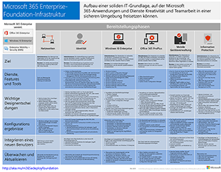
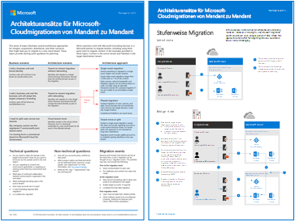
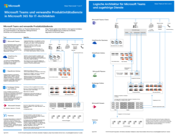
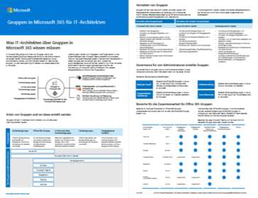

# Ressourcen zur Cloud-IT-Architektur von Microsoft

 **Zusammenfassung:** Erfahren Sie mehr über die Hauptkonzepte der Cloudarchitektur für Microsoft-Identitäts-, -Sicherheits-, -Netzwerk- und Hybridlösungen. Sehen Sie sich Empfehlungen zum Schützen von Dateien, Identitäten und Geräten bei Verwendung der Microsoft-Cloud an. Erfahren Sie, wie ein moderner und sicherer Desktop mit Windows 10 und Office ProPlus bereitgestellt wird.
  
In diesen Architekturtools- und -postern finden Sie Informationen zu Microsoft-Cloud-Diensten und -Plattformen wie Office 365, Windows 10, Azure Active Directory, Microsoft Intune, Microsoft Dynamics 365 sowie hybride lokale und Cloud-Lösungen. IT-Entscheidungsträger und Architekten können diese Ressourcen verwenden, um die optimalen Lösungen für ihre Arbeitsauslastungen zu bestimmen und Entscheidungen zu Kerninfrastrukturkomponenten wie Identität und Sicherheit zu treffen. 
  
<!--**[Microsoft's Enterprise Cloud Roadmap](microsoft-cloud-it-architecture-resources.md#roadmap)** (Sway) -->
    
- **[Ressourcen zu Microsoft Cloud für Enterprise-Architekten](microsoft-cloud-it-architecture-resources.md#cloudarch)** 
    <!-- [Microsoft Cloud Services and Platform Options](microsoft-cloud-it-architecture-resources.md#platformoptions) -->
    - [Microsoft-Cloud-Identität für Enterprise-Architekten](microsoft-cloud-it-architecture-resources.md#identity)
    - [Microsoft-Cloud-Sicherheit für Enterprise-Architekten](microsoft-cloud-it-architecture-resources.md#security)
    - [Microsoft-Cloudnetzwerke für Enterprise-Architekten](microsoft-cloud-it-architecture-resources.md#networking)
    - [Microsoft Hybrid Cloud für Enterprise-Architekten](microsoft-cloud-it-architecture-resources.md#hybrid)
    - [Häufige Angriffe und Microsoft-Funktionen zum Schutz Ihrer Organisation](#common-attacks-and-microsoft-capabilities-that-protect-your-organization)
    - [Microsoft 365 Enterprise-Foundation-Infrastruktur](#m365foundationinfra)
    - [Architekturansätze für die Microsoft-Cloudmigration von Mandanten zu Mandanten](#architecture-approaches-for-microsoft-cloud-tenant-to-tenant-migrations)
    
- **[Reihe: Microsoft 365 Enterprise-Lösungen](microsoft-cloud-it-architecture-resources.md#BKMK_o365solutions)**:
    - [Microsoft Teams und verwandte Produktivitätsdienste in Microsoft 365 für IT-Architekten](#microsoft-teams-and-related-productivity-services-in-microsoft-365-for-it-architects)
    - [Gruppen in Microsoft 365 für IT-Architekten](#groups-in-microsoft-365-for-it-architects)
    - [Identität- und Geräteschutz für Office 365](microsoft-cloud-it-architecture-resources.md#BKMK_O365IDP)
    - [Lösungen zum Schutz von Dateien in Office 365](microsoft-cloud-it-architecture-resources.md#BKMK_O365fileprotect)
    - [Schutz von Informationen in Office 365 für die DSGVO](#office-365-information-protection-for-gdpr)
    - [Microsoft-Sicherheitsleitfaden für politische Kampagnen, gemeinnützigen Organisationen und andere agile Organisationen](#microsoft-security-guidance-for-political-campaigns-nonprofits-and-other-agile-organizations)
    - [Microsoft-Telefonielösungen](#microsoft-telephony-solutions) 
    - [Bereitstellen eines modernen und sicheren Desktops mit Microsoft](microsoft-cloud-it-architecture-resources.md#msd)
    
Geben Sie uns Feedback, indem Sie eine E-Mail an [cloudadopt@microsoft.com](mailto:cloudadopt@microsoft.com) senden. 

<!--

## Microsoft's Enterprise Cloud Roadmap

See the posters, icon sets, community venues, and other resources that describe the industry's most complete cloud solution.
  
|**Item**|**Description**|
|:-----|:-----|
|[          ](https://aka.ms/cloudarchitecture)   [Microsoft's Enterprise Cloud Roadmap](https://aka.ms/cloudarchitecture) (https://aka.ms/cloudarchitecture)   |Swipe through this Sway experience for the resources that describe the industry's most complete cloud solution.    |
-->
  

## Reihe: Microsoft Cloud für Enterprise-Architekten

In diesen Postern zur Cloudarchitektur finden Sie Informationen zu Microsoft-Cloud-Diensten und -Plattformen wie Office 365, Azure Active Directory, Microsoft Intune, Microsoft Dynamics CRM Online sowie hybride lokale und Cloud-Lösungen. IT-Entscheidungsträger und Architekten können diese Ressourcen verwenden, um die optimalen Lösungen für ihre Arbeitsauslastungen zu bestimmen und Entscheidungen zu Kerninfrastrukturkomponenten wie Identität und Sicherheit zu treffen.

<!--  

### Microsoft Cloud Services and Platform Options

Learn key differences between Microsoft cloud services and platform offerings. Find the best fit for your solution.
  
|**Item**|**Description**|
|:-----|:-----|
|[          ](https://www.microsoft.com/download/details.aspx?id=54432)   [PDF](https://go.microsoft.com/fwlink/p/?LinkId=524731)  \| [Visio](https://go.microsoft.com/fwlink/p/?LinkId=524732)  \| [More languages](https://www.microsoft.com/download/details.aspx?id=54432)   | This model describes: <ul><li>  Software as a Service (SaaS) offerings, including Office 365 </li><li>  Platform as a Service (PaaS) features in Microsoft Azure </li><li>  Infrastructure as a Service (IaaS) features in Microsoft Azure </li><li>  Private cloud datacenter capabilities using Windows Server and System Center </li><li>  Learn how Microsoft's own IT department is migrating to these cloud services and building its hybrid cloud. </li></ul> |
-->

   

### Microsoft-Cloudidentität für Enterprise-Architekten

Was IT-Architekten über das Entwerfen der Identität für Organisationen wissen müssen, die Microsoft-Cloud-Dienste und -Plattformen verwenden.
  
|**Element**|**Beschreibung**|
|:-----|:-----|
|[          ](https://www.microsoft.com/download/details.aspx?id=54431)   [PDF](https://go.microsoft.com/fwlink/p/?LinkId=524586)  \| [Visio](https://download.microsoft.com/download/2/3/8/238228E6-9017-4F6C-BD3C-5559E6708F82/MSFT_cloud_architecture_identity.vsd)           \| [Weitere Sprachen](https://www.microsoft.com/download/details.aspx?id=54431)   | Dieses Modell enthält Folgendes: <ul><li>Einführung in die Identität mit der Cloud von Microsoft </li><li>Azure AD-IDaaS-Funktionen </li><li>Integrieren von lokalen Active Directory-Domain Services-Konten in Microsoft Azure Active Directory </li><li>Einfügen von Verzeichniskomponenten in Azure </li><li>Domänendienstoptionen für Arbeitslasten in Azure IaaS </li></ul> |
   

### Microsoft-Cloud-Sicherheit für Enterprise-Architekten

Was IT-Architekten über die Sicherheit in Microsoft-Cloud-Diensten und -Plattformen wissen müssen.
  
|**Element**|**Beschreibung**|
|:-----|:-----|
|[          ](https://www.microsoft.com/download/details.aspx?id=48121)   [PDF](https://go.microsoft.com/fwlink/p/?linkid=842070)  \| [Visio](https://go.microsoft.com/fwlink/p/?LinkId=842071)  \| [Weitere Sprachen](https://www.microsoft.com/download/details.aspx?id=48121)   | Dieses Modell enthält Folgendes: <ul><li>Die Rolle von Microsoft bei der Bereitstellung sicherer Dienste und Plattformen</li><li>Die Verantwortung des Kunden, Sicherheitsrisiken zu minimieren</li><li>Zertifizierungen der höchsten Sicherheit </li><li>Sicherheitsangebote, die von Microsoft Consulting Services bereitgestellt werden </ul> |
   

### Microsoft-Cloudnetzwerke für Enterprise-Architekten

Was IT-Architekten über Netzwerke für Microsoft-Cloud-Dienste und -Plattformen wissen müssen.
  
|**Element**|**Beschreibung**|
|:-----|:-----|
|   [PDF](media/Network-Poster/MSFT_cloud_architecture_networking.pdf)  \| [Visio](https://github.com/MicrosoftDocs/OfficeDocs-Enterprise/raw/live/Enterprise/media/Network-Poster/MSFT_cloud_architecture_networking.vsdx)   | Dieses Modell enthält Folgendes: <ul><li> Weiterentwicklung Ihres Netzwerks für Cloudkonnektivität </li><li> Allgemeine Elemente der Microsoft-Cloudkonnektivität </li><li> ExpressRoute für Microsoft-Cloudkonnektivität </li><li> Entwerfen von Netzwerken für Microsoft SaaS, Azure PaaS und Azure IaaS </li></ul>    |

### Microsoft Hybrid Cloud für Enterprise-Architekten

Was IT-Architekten über Hybrid Cloud für Microsoft-Dienste und -Plattformen wissen müssen.
  
|**Element**|**Beschreibung**|
|:-----|:-----|
|   [PDF](media/Hybrid-Poster/MSFT_cloud_architecture_hybrid.pdf)  \| [Visio](https://github.com/MicrosoftDocs/OfficeDocs-Enterprise/raw/live/Enterprise/media/Hybrid-Poster/MSFT_cloud_architecture_hybrid.vsdx)  | Dieses Modell enthält Folgendes: <ul><li> Cloudangebote von Microsoft (SaaS, Azure PaaS und Azure IaaS) und deren gemeinsame Elemente </li><li> Hybrid Cloud-Architektur für Cloudangebote von Microsoft </li><li> Hybrid Cloud-Szenarien für Microsoft SaaS (Office 365), Azure PaaS und Azure IaaS </li></ul> |
   

### Häufige Angriffe und Microsoft-Funktionen zum Schutz Ihrer Organisation
Erfahren Sie mehr über die häufigsten Cyberangriffe und wie Microsoft Ihrer Organisation in jeder Phase des Angriffs helfen kann. 

|**Element**|**Beschreibung**|
|:-----|:-----|
|   [PDF](https://download.microsoft.com/download/F/A/C/FACFC1E9-FA35-4DF1-943C-8D4237B4275B/MSFT_Cloud_architecture_security_commonattacks.pdf) \| [Visio](https://download.microsoft.com/download/F/A/C/FACFC1E9-FA35-4DF1-943C-8D4237B4275B/MSFT_Cloud_architecture_security_commonattacks.vsdx)   | Dieses Poster veranschaulicht den Weg häufiger Angriffe und beschreibt, welche Funktionen dabei helfen können, Angreifer in jeder Phase des Angriffs zu stoppen.  |

### Microsoft 365 Enterprise-Foundation-Infrastruktur

Sie erhalten einen Überblick über die [grundlegende Infrastruktur](https://docs.microsoft.com/microsoft-365/enterprise/deploy-foundation-infrastructure) für Microsoft 365 Enterprise, um mit der Bereitstellung zu beginnen.
  
|**Item**|**Beschreibung**|
|:-----|:-----|
|   [Online anzeigen](https://aka.ms/m365efoundinfraposter) \| [PDF](https://github.com/MicrosoftDocs/microsoft-365-docs/raw/public/microsoft-365/enterprise/media/deploy-foundation-infrastructure/Microsoft365EnterpriseFoundInfra.pdf)   | Dieses Poster fasst alle Phasen der Basisinfrastruktur hinsichtlich der Ziele, Features und Werkzeuge, Design-Entscheidungen, Konfigurationsergebnisse, Onboarding sowie laufende Überwachung und Updates zusammen.  | 

### Architekturansätze für Microsoft-Cloudmigrationen von Mandant zu Mandant 
Diese Themenreihe illustriert mehrere Architekturansätze für Fusionen, Übernahmen, Veräußerungen und andere Szenarien, die möglicherweise eine Migration zu einem neuen Cloudmandanten notwendig machen. Diese Themen dienen als Ausgangspunkt mit Leitlinien für die Planung.

|**Item**|**Beschreibung**|
|:-----|:-----|
|   [PDF](downloads/Microsoft-365-tenant-to-tenant-migration.pdf) \| [Visio](https://github.com/MicrosoftDocs/OfficeDocs-Enterprise/raw/live/Enterprise/downloads/Microsoft-365-tenant-to-tenant-migration.vsdx)     |Dieses Modell enthält Folgendes: <ul><li>Eine Zuordnung von Geschäftsszenarien zu Architekturansätzen</li><li>Überlegungen zum Entwurf</li><li>Ablauf einer Einzelereignismigration</li><li>Ablauf einer stufenweisen Migration</li><li>Ablauf einer Mandantenverschiebung oder -aufteilung</li></ul>|

## Reihe von Microsoft 365 Enterprise-Lösungen

Die Reihe der Microsoft 365 Enterprise-Lösungen bietet Hilfestellung zum Implementieren von Microsoft 365-Funktionen, insbesondere bei technologieübergreifenden Funktionen.

### Microsoft Teams und verwandte Produktivitätsdienste in Microsoft 365 für IT-Architekten
Die logische Architektur von Produktivitätsdiensten in Microsoft 365, beginnend mit Microsoft Teams.

|**Item**|**Beschreibung**|
|:-----|:-----|
|   [PDF](downloads/msft-m365-teams-logical-architecture.pdf) \| [Visio](https://github.com/MicrosoftDocs/OfficeDocs-Enterprise/raw/live/Enterprise/downloads/msft-m365-teams-logical-architecture.vsdx)     |Microsoft bietet eine Reihe von Produktivitätsdiensten für die Zusammenarbeit in den Bereichen Datengovernance, Sicherheit und Compliancefunktionen.    Diese Illustrationen geben einen Einblick in die logische Architektur der Produktivitätsdienste für Enterprise Architekten, beginnend mit Microsoft Teams.|

### Gruppen in Microsoft 365 für IT-Architekten
Was IT-Architekten über Gruppen in Microsoft 365 wissen müssen

|**Item**|**Beschreibung**|
|:-----|:-----|
|   [PDF](downloads/msft-m365-groups.pdf) \| [Visio](https://github.com/MicrosoftDocs/OfficeDocs-Enterprise/raw/live/Enterprise/downloads/msft-m365-groups.vsdx) |Diese Illustrationen erläutern die unterschiedlichen Arten von Gruppen, erklären, wie diese erstellt und verwaltet werden, und bieten einige Vorschläge für Governance.|

   

### Identität- und Geräteschutz für Office 365

Empfohlene Funktionen zum Schutz von Identitäten und Geräten, die auf Office 365, andere SaaS-Dienste und lokale Anwendungen zugreifen, die mit dem Azure AD-Anwendungsproxy veröffentlicht werden.
  
|**Element**|**Beschreibung**|
|:-----|:-----|
|[          ](https://www.microsoft.com/download/details.aspx?id=55032)   [PDF](https://go.microsoft.com/fwlink/p/?linkid=841656)  \| [Visio](https://go.microsoft.com/fwlink/p/?linkid=841657)  \| [Weitere Sprachen](https://www.microsoft.com/download/details.aspx?id=55032)   |Es ist wichtig, konsistente Schutzebenen für Daten, Identitäten und Geräte zu verwenden. In diesem Dokument wird gezeigt, welche Funktionen mit weiteren Informationen über die Funktionen zum Schutz von Identitäten und Geräten vergleichbar sind.    |
   

### Lösungen zum Schutz von Dateien in Office 365

Empfohlene Funktionen zum Schutz von Dateien in Office 365 basierend auf drei unterschiedlichen Vertraulichkeitsstufen.
  
|**Element**|**Beschreibung**|
|:-----|:-----|
|[          ](https://www.microsoft.com/download/details.aspx?id=55523)   [PDF](https://go.microsoft.com/fwlink/?linkid=2004320)  \| [Visio](https://download.microsoft.com/download/7/8/9/789645A5-BD10-4541-BC33-F8D1EFF5E911/MSFT_cloud_architecture_O365%20file%20protection.vsdx)   |Es ist wichtig, konsistente Schutzebenen für Daten, Identitäten und Geräte zu verwenden. In diesem Dokument wird gezeigt, welche Funktionen mit weiteren Informationen über die Funktionen zum Schutz von Dateien in Office 365 vergleichbar sind.    |
   

### Schutz von Informationen in Office 365 für die DSGVO

Empfehlungen zum Ermitteln, Klassifizieren, Schützen und Überwachen von personenbezogenen Daten. Dabei wird die Datenschutz-Grundverordnung (DSGVO) als Beispiel verwendet, Sie können das Verfahren jedoch auch für die Einhaltung vieler anderer Bestimmungen nutzen.

|**Aspekt**|**Beschreibung**|
|:-----|:-----|
|    [PDF](https://download.microsoft.com/download/E/C/D/ECD5A339-EF10-4420-B3A9-99098884D716/MSFT_Cloud_architecture_information%20protection%20for%20GDPR.pdf) \| [Visio](https://download.microsoft.com/download/E/C/D/ECD5A339-EF10-4420-B3A9-99098884D716/MSFT_Cloud_architecture_information%20protection%20for%20GDPR.vsdx)    |Um diesen Inhalt im Artikelformat anzuzeigen, siehe [Office 365 Information Protection für die DSGVO](https://docs.microsoft.com/Office365/SecurityCompliance/office-365-information-protection-for-gdpr).      |

### Microsoft-Sicherheitsleitfaden für politische Kampagnen, gemeinnützigen Organisationen und andere agile Organisationen 

In diesem Leitfaden wird die Implementierung einer sicheren Cloudumgebung beschrieben. Der Leitfaden für die Lösung kann von jeder beliebigen Organisation verwendet werden. Er umfasst zusätzliche Hilfe für agile Organisationen mit BYOD-Zugriff und Gastkonten. Sie können diesen Leitfaden als Grundlage zum Planen Ihrer eigenen Umgebung verwenden.

|**Aspekt**|**Beschreibung**|
|:-----|:-----|
|**Microsoft-Sicherheitsanleitungen von Microsoft für politische Kampagnen**   [          ](https://download.microsoft.com/download/B/4/D/B4D520C3-4D0C-4B4D-BFB9-09F0651C2775/MSFT_Cloud_architecture_security%20for%20political%20campaigns.pdf)   [PDF](https://download.microsoft.com/download/B/4/D/B4D520C3-4D0C-4B4D-BFB9-09F0651C2775/MSFT_Cloud_architecture_security%20for%20political%20campaigns.pdf)  \| [Visio](https://download.microsoft.com/download/B/4/D/B4D520C3-4D0C-4B4D-BFB9-09F0651C2775/MSFT_Cloud_architecture_security%20for%20political%20campaigns.vsdx)   |Dieser Leitfaden verwendet eine Organisation für politische Kampagnen als Beispiel. Verwenden Sie diesen Leitfaden als Grundlage für eine beliebige Umgebung.    |
|**Sicherheitsanleitungen von Microsoft für gemeinnützige Organisationen**   [          ](https://download.microsoft.com/download/9/4/3/94389612-C679-4061-8DF2-D9A15D72B65F/Microsoft_Cloud%20Architecture_Security%20for%20Nonprofits.pdf)   [PDF](https://download.microsoft.com/download/9/4/3/94389612-C679-4061-8DF2-D9A15D72B65F/Microsoft_Cloud%20Architecture_Security%20for%20Nonprofits.pdf)  \| [Visio](https://download.microsoft.com/download/9/4/3/94389612-C679-4061-8DF2-D9A15D72B65F/Microsoft_Cloud%20Architecture_Security%20for%20Nonprofits.vsdx)   |Dieser Leitfaden wurde für gemeinnützige Organisationen geringfügig überarbeitet. Er verweist beispielsweise auf Office 365-Pläne für gemeinnützige Organisation. Die technische Anleitung ist identisch wie im Leitfaden für politische Kampagnen.    |

Dieser Leitfaden enthält Testumgebungsanleitungen. Weitere Informationen finden Sie unter [Microsoft-Sicherheitsleitfaden für politische Kampagnen, gemeinnützigen Organisationen und andere agile Organisationen](https://docs.microsoft.com/Office365/SecurityCompliance/microsoft-security-guidance-for-political-campaigns-nonprofits-and-other-agile-o).

### Microsoft-Telefonielösungen

Microsoft unterstützt mehrere Optionen, wenn Sie mit der Einführung von Teams in der Microsoft-Cloud beginnen. Dieses Poster hilft Ihnen zu entscheiden, welche Microsoft-Telefonielösung (Telefonsystem in der Cloud oder Enterprise-VoIP, lokal) für die Benutzer in Ihrer Organisation geeignet ist und wie Ihre Organisation die Telefonfestnetzanbindung (Public Switched Telephone Network, PSTN) herstellen kann.

  
[PDF](https://github.com/MicrosoftDocs/OfficeDocs-SkypeForBusiness/blob/live/Teams/downloads/telephony-solutions/microsoft-telephony-solutions-12-18.pdf) | [Visio](https://github.com/MicrosoftDocs/OfficeDocs-SkypeForBusiness/blob/live/Teams/downloads/telephony-solutions/microsoft-telephony-solutions-12-18.vsdx) 

Weitere Informationen finden Sie im Artikel zu diesem Poster: [Microsoft-Telefonielösungen](https://docs.microsoft.com/SkypeForBusiness/hybrid/msft-telephony-solutions).
  

### Bereitstellen eines modernen und sicheren Desktops mit Microsoft

Informationen für IT-Architekten über das Bereitstellen und Verwalten von Updates für Office 365 ProPlus unter Windows 10
  
|**Element**|**Beschreibung**|
|:-----|:-----|
|[          ](https://www.microsoft.com/download/details.aspx?id=55987)   [PDF](https://download.microsoft.com/download/4/E/9/4E90E227-770A-41D1-99FE-925A64D81A55/MSFT_modern_secure_desktop.pdf)  \| [Visio](https://download.microsoft.com/download/4/E/9/4E90E227-770A-41D1-99FE-925A64D81A55/MSFT_modern_secure_desktop.vsdx)   | Dieses Modell enthält Folgendes: <ul><li>  Bereitstellen von Windows 10 und Office ProPlus aus der Microsoft-Cloud </li><li>  Bereitstellen von Windows 10 und Office ProPlus mithilfe von Microsoft Endpoint Configuration Manager </li><li>  Verwalten von Updates für Windows 10 und Office ProPlus aus der Microsoft-Cloud </li><li>  Verwalten von Updates für Windows 10 und Office ProPlus mithilfe von Microsoft Endpoint Configuration Manager </li><li>  Out-of-Box- und zusätzliche Schutzfunktionen von Windows 10 </li></ul>  |
   
## Siehe auch

[Architekturmodelle für SharePoint, Exchange, Skype for Business und Lync](architectural-models-for-sharepoint-exchange-skype-for-business-and-lync.md)
  
[Testumgebungsanleitungen (TLGs) zur Cloudakzeptanz](cloud-adoption-test-lab-guides-tlgs.md)
  
[Sicherheitslösungen](security-solutions.md)
  
[Hybridlösungen](hybrid-solutions.md)

