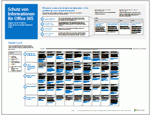

# Ressourcen zur Cloud-IT-Architektur von Microsoft

 **Zusammenfassung:** Informationen zu Microsoft-Clouddiensten und -Plattformen. Lesen Sie unsere Enterprise-Cloud-Roadmap, erkunden Sie unsere Cloud-Architekturreihe usw.
  
In diesen Architekturtools- und -postern finden Sie Informationen zu Microsoft-Cloud-Diensten und -Plattformen wie Office 365, Microsoft Azure, Microsoft Intune, Microsoft Dynamics 365, private Cloud-Rechenzentren sowie hybride lokale und Cloud-Lösungen. IT-Entscheidungsträger und Architekten können diese Ressourcen verwenden, um die optimalen Lösungen für ihre Arbeitsauslastungen zu bestimmen und Entscheidungen zu Kerninfrastrukturkomponenten wie Identität und Sicherheit zu treffen.
  
- **[Enterprise-Cloud-Roadmap von Microsoft](microsoft-cloud-it-architecture-resources.md#roadmap)** (Sway)
    
- **[Ressourcen zu Microsoft Cloud für Enterprise-Architekten](microsoft-cloud-it-architecture-resources.md#cloudarch)**, die Poster zu[Optionen für Microsoft-Cloud-Dienste und -Plattformen](microsoft-cloud-it-architecture-resources.md#platformoptions), [Microsoft-Cloud-Identität für Enterprise-Architekten](microsoft-cloud-it-architecture-resources.md#identity), [Microsoft-Cloud-Sicherheit für Enterprise-Architekten](microsoft-cloud-it-architecture-resources.md#security), [Microsoft-Cloudnetzwerke für Enterprise-Architekten](microsoft-cloud-it-architecture-resources.md#networking), [Microsoft-Mobilität und -Sicherheit für Enterprise-Architekten](microsoft-cloud-it-architecture-resources.md#mobility), [Microsoft-Cloud-Speicher für Enterprise-Architekten](microsoft-cloud-it-architecture-resources.md#storage), [Microsoft Hybrid Cloud für Enterprise-Architekten](microsoft-cloud-it-architecture-resources.md#hybrid) und[Contoso in der Microsoft-Cloud](microsoft-cloud-it-architecture-resources.md#contoso) umfassen.
    
- **[Reihe: Office 365 Enterprise-Lösungen](microsoft-cloud-it-architecture-resources.md#BKMK_o365solutions)**, die[Schutz von Informationen für Office 365](microsoft-cloud-it-architecture-resources.md#BKMK_infoprotect), [Identität- und Geräteschutz für Office 365](microsoft-cloud-it-architecture-resources.md#BKMK_O365IDP) und[Lösungen zum Schutz von Dateien in Office 365](microsoft-cloud-it-architecture-resources.md#BKMK_O365fileprotect), [Änderungsverwaltung für Office 365-Clients](microsoft-cloud-it-architecture-resources.md#changemgmt) und[Bereitstellen eines modernen und sicheren Desktops mit Microsoft](microsoft-cloud-it-architecture-resources.md#msd) umfasst.
    
> [!TIP]
> Die meisten der Poster auf dieser Seite sind in mehreren Sprachen erhältlich, darunter Chinesisch, Englisch, Französisch, Deutsch, Italienisch, Japanisch, Koreanisch, Portugiesisch, Russisch und Spanisch. Um ein Poster in einer dieser Sprachen herunterzuladen, klicken Sie auf den Link **Weitere Sprachen** für dieses Poster.
  
Teilen Sie uns Ihre Meinung mit! Senden Sie uns eine E-Mail an [cloudadopt@microsoft.com](mailto:cloudadopt@microsoft.com). 
  
## Enterprise-Cloud-Roadmap von Microsoft

Hier finden Sie Poster, Symbolsätze, Community-Ressourcen und andere Ressourcen, die die umfassendste Cloudlösung der Branche beschreiben.
  
|**Element**|**Beschreibung**|
|:-----|:-----|
|[          ](https://aka.ms/cloudarchitecture)   [Microsoft's Enterprise Cloud Roadmap](https://aka.ms/cloudarchitecture) (https://aka.ms/cloudarchitecture)   |Blättern Sie durch die einzelnen Sway-Anzeigen, um auf Ressourcen zuzugreifen, die die umfassendste Cloudlösung der Branche beschreiben.    |
   
## Ressourcen zu Microsoft Cloud für Enterprise-Architekten

In diesen Cloud-Architekturpostern finden Sie Informationen zu Microsoft-Clouddiensten und -Plattformen wie Office 365, Microsoft Azure, Microsoft Intune, Microsoft Dynamics CRM Online, private Cloud-Rechenzentren sowie hybride lokale und Cloud-Lösungen. IT-Entscheidungsträger und Architekten können diese Ressourcen verwenden, um die optimalen Lösungen für ihre Arbeitsauslastungen zu bestimmen und Entscheidungen zu Kerninfrastrukturkomponenten wie Identität und Sicherheit zu treffen.
  
### Optionen für Microsoft-Cloud-Dienste und -Plattformen

Erfahren Sie mehr über die Hauptunterschiede zwischen Cloud-Dienst- und Plattformangeboten von Microsoft. Entscheiden Sie, was für Ihre Lösung am besten geeignet ist.
  
|**Element**|**Beschreibung**|
|:-----|:-----|
|[          ](https://www.microsoft.com/download/details.aspx?id=54432)   [PDF](https://go.microsoft.com/fwlink/p/?LinkId=524731) |[Visio](https://go.microsoft.com/fwlink/p/?LinkId=524732) |[Weitere Sprachen](https://www.microsoft.com/download/details.aspx?id=54432)   | Dieses Modell beschreibt Folgendes:    SaaS-Angebote (Software-as-a-Service), einschließlich Office 365    PaaS-Features (Platform as a Service) in Microsoft Azure    IaaS-Features (Infrastructure-as-a-Service) in Microsoft Azure    Funktionen für ein privates Cloud-Rechenzentrum mithilfe von Windows Server und System Center    Erfahren Sie, wie die IT-Abteilung von Microsoft zu diesen Cloud-Diensten migriert und eine eigene Hybrid Cloud aufbaut.   |
   
### Microsoft-Cloud-Identität für Enterprise-Architekten

Was IT-Architekten über das Entwerfen der Identität für Organisationen wissen müssen, die Microsoft-Cloud-Dienste und -Plattformen verwenden
  
|**Element**|**Beschreibung**|
|:-----|:-----|
|[          ](https://www.microsoft.com/download/details.aspx?id=54431)   [PDF](https://go.microsoft.com/fwlink/p/?LinkId=524586) |[Visio](https://download.microsoft.com/download/2/3/8/238228E6-9017-4F6C-BD3C-5559E6708F82/MSFT_cloud_architecture_identity.vsd)          [Artikel](https://technet.microsoft.com/library/mt613459.aspx) |[Weitere Sprachen](https://www.microsoft.com/download/details.aspx?id=54431)   | Dieses Modell enthält Folgendes:    Verwenden von Azure AD als Ihren Identity as a Service-(IDaaS-)Anbieter    IDaaS-Funktionen von Azure AD    Integrieren von lokalen Active Directory-Domänendienste-Konten in Microsoft Azure Active Directory    Einfügen von Verzeichniskomponenten in Azure    Domänendienstoptionen für Arbeitslasten in Azure IaaS    Hier finden Sie die Informationen in Form eines Artikels:[Microsoft-Cloud-Identität für Enterprise-Architekten](microsoft-cloud-identity-for-enterprise-architects.md)   |
   
### Microsoft-Cloud-Sicherheit für Enterprise-Architekten

Was IT-Architekten über die Sicherheit in Microsoft-Cloud-Diensten und -Plattformen wissen müssen
  
|**Element**|**Beschreibung**|
|:-----|:-----|
|[          ](https://www.microsoft.com/download/details.aspx?id=48121)   [PDF](https://go.microsoft.com/fwlink/p/?linkid=842070) |[Visio](https://go.microsoft.com/fwlink/p/?LinkId=842071) |[Weitere Sprachen](https://www.microsoft.com/download/details.aspx?id=48121)   | Dieses Modell enthält Folgendes:    Die Rolle von Microsoft bei der Bereitstellung von sicheren Diensten und Plattformen    Verantwortlichkeiten des Kunden zum Verringern von Sicherheitsrisiken    Die wichtigsten Sicherheitszertifizierungen    Sicherheitsangebote, die von Microsoft Consulting Services bereitgestellt werden    Arbeiten Sie den Kurs[Sicherheit in einer cloudfähigen Welt](https://aka.ms/securecustomermva) durch, einen Kurs der Microsoft Virtual Academy, der auf diesem Architekturposter basiert.   |
   
### Microsoft-Cloudnetzwerke für Enterprise-Architekten

Was IT-Architekten über Netzwerke für Microsoft-Cloud-Dienste und -Plattformen wissen müssen
  
|**Element**|**Beschreibung**|
|:-----|:-----|
|[          ](https://www.microsoft.com/download/details.aspx?id=54425)   [PDF](https://go.microsoft.com/fwlink/p/?linkid=842073) |[Visio](https://go.microsoft.com/fwlink/p/?linkid=842074)          [Artikel](https://technet.microsoft.com/library/mt733214.aspx) |[Weitere Sprachen](https://www.microsoft.com/download/details.aspx?id=54425)   | Dieses Modell enthält die folgenden Inhalte:   **Weiterentwicklung Ihres Netzwerks für Cloud-Konnektivität** Cloudmigration ändert das Volumen und die Art des Datenverkehrs innerhalb und außerhalb eines Unternehmensnetzwerks. Sie hat ebenfalls Auswirkungen auf Ansätze zur Reduzierung von Sicherheitsrisiken.   **Gemeinsame Elemente der Microsoft Cloudkonnektivität** Die Integration Ihres Netzwerk in Microsoft-Cloud bietet optimalen Zugriff auf eine Vielzahl von Diensten.   **ExpressRoute für Microsoft Cloud-Konnektivität** ExpressRoute bietet eine private, dedizierte Netzwerkverbindung mit hohem Durchsatz mit der Microsoft Cloud.   **Entwerfen von Netzwerken für Microsoft SaaS (Office 365, Microsoft Intune und Dynamics CRM Online)** Für die Optimierung Ihres Netzwerks für Microsoft SaaS-Dienste ist eine sorgfältige Analyse von Internet-Edge, Ihrer Clientgeräte und IT-Standardvorgänge erforderlich.   **Entwerfen von Netzwerken für Azure PaaS** Für die Optimierung Ihrer Netzwerke für Azure PaaS-Apps ist eine ausreichende Internetbandbreite und möglicherweise die Verteilung des Netzwerkdatenverkehrs auf mehrere Websites oder Apps erforderlich.   **Entwerfen von Netzwerken für Azure IaaS** Durchlaufen Sie schrittweise den Entwurfsprozess zum Erstellen eines optimalen virtuellen Azure-Netzwerks (VNet) für das Hosting von serverbasierten IT-Arbeitslasten, einschließlich Subnetzen, Adressräumen, Routing, DNS, Lastenausgleich und der Verbindung zu Ihrem lokalen Netzwerk, anderen VNets und dem Internet.    Arbeiten Sie den Kurs[Optimieren des Netzwerks für Microsoft-Cloudangebote](https://aka.ms/optimizecloudnetworkingmva) durch, einen neuen Kurs der Microsoft Virtual Academy, der auf diesem Architekturposter basiert.   |
   
### Microsoft-Mobilität und -Sicherheit für Enterprise-Architekten

Was IT-Architekten über die Mobilität in Microsoft-Cloud-Diensten und -Plattformen wissen müssen
  
|**Element**|**Beschreibung**|
|:-----|:-----|
|[          ](https://www.microsoft.com/download/details.aspx?id=55023)   [PDF](https://go.microsoft.com/fwlink/p/?linkid=842076) |[Visio](https://go.microsoft.com/fwlink/p/?linkid=842077) |[Weitere Sprachen](https://www.microsoft.com/download/details.aspx?id=55023)   | Microsoft bietet umfangreiche Unterstützung für mobile Produktivität mit Steuerelementen zur Verwaltung zum Schutz von Daten und Anwendungen.    Mobile Apps von Microsoft für Unternehmen.    Plattform, Dienste und Ressourcen für die Entwicklung mobiler Apps.    Verwalten des Zugriffs auf cloudbasierte Anwendungen und Daten von mobilen Geräten.    Vergleich der Funktions- und Plattformunterstützung für Office 365 MDM, Azure Active Directory Premium und Intune.   |
   
### Microsoft-Cloud-Speicher für Enterprise-Architekten

Was IT-Architekten über Speicheroptionen in Microsoft-Cloud-Diensten und -Plattformen von Microsoft
  
|**Element**|**Beschreibung**|
|:-----|:-----|
|[          ](https://www.microsoft.com/download/details.aspx?id=49552)   [PDF](https://go.microsoft.com/fwlink/p/?linkid=842079) |[Visio](https://go.microsoft.com/fwlink/p/?linkid=842080)          [Artikel](hhttps://technet.microsoft.com/library/mt842597.aspx) |[Weitere Sprachen](https://www.microsoft.com/download/details.aspx?id=49552)   | Dieses Modell enthält Folgendes:    Gründe für die Verwendung eines Cloudspeichers und wichtige Szenarien.    „Sofort einsatzbereite" Cloudspeicheroptionen, die mit vorhandenen Diensten gebündelt sind und direkt und nach minimaler Konfiguration verwendet werden können.    Speicheroptionen, die noch „eine gewisse Einrichtung erfordern"; diese können Sie als Ausgangspunkt für die Speicherung Ihrer Lösung verwenden und durch zusätzliche Konfiguration oder Codierung individuell anpassen.    „Grundlegende Neuerstellung" eigener Speicherlösungen oder Speicher für Apps mithilfe von Speicherbausteinen.   |
   
### Microsoft Hybrid Cloud für Enterprise-Architekten

Was IT-Architekten über Hybrid Cloud für Microsoft-Dienste und -Plattformen wissen müssen
  
|**Element**|**Beschreibung**|
|:-----|:-----|
|[          ](https://www.microsoft.com/download/details.aspx?id=54424)   [PDF](https://go.microsoft.com/fwlink/p/?linkid=842082) |[Visio](https://go.microsoft.com/fwlink/p/?linkid=842083)          [Artikel](https://technet.microsoft.com/library/mt750500.aspx) |[Weitere Sprachen](https://www.microsoft.com/download/details.aspx?id=54424)   | Dieses Modell enthält die folgenden Inhalte:   **Hybrid-Cloud-Übersicht** Cloud-Angebote von Microsoft (SaaS, Azure PaaS und Azure IaaS) und deren gemeinsame Elemente.   **Architektur von Microsoft Hybrid-Cloud-Szenarien** Architektonisches Diagramm der hybriden Cloud für die Cloud-Angebote von Microsoft, in dem die gemeinsamen Ebenen von lokaler Infrastruktur, Netzwerken und Identität gezeigt werden.   **Hybrid-Cloud-Szenarien für Microsoft SaaS (Office 365)** Architektur des SaaS-Hybrid-Szenarios und Beschreibungen der wichtigsten Hybridkonfigurationen für Skype for Business, SharePoint Server und Exchange Server.   **Szenarien für die hybride Cloud für Azure PaaS** Architektur des Azure PaaS Hybrid-Szenarios, Beschreibung einer Azure PaaS-Hybridanwendung anhand eines Beispiels und Beschreibung einer SQL Server 2016 Stretch-Datenbank   **Szenarien für die hybride Cloud für Azure IaaS** Architektur des Azure IaaS Hybrid-Szenarios und Beschreibung einer in Azure IaaS gehosteten Line of Business-(LOB-)Anwendung.   |
   
### Contoso in der Microsoft-Cloud

Wie ein fiktives, aber repräsentatives globales Unternehmen die Microsoft-Cloudangebote, einschließlich Office 365, Azure, Dynamics 365 und Intune, implementiert hat.
  
|**Element**|**Beschreibung**|
|:-----|:-----|
|[          ](https://www.microsoft.com/download/details.aspx?id=54427)   [PDF](https://go.microsoft.com/fwlink/p/?linkid=842085) |[Visio](https://go.microsoft.com/fwlink/p/?linkid=842086)          [Artikel](https://technet.microsoft.com/library/mt775341.aspx) |[Weitere Sprachen](https://www.microsoft.com/download/details.aspx?id=54427)   |Sehen Sie sich an, wie die Contoso Corporation, ein globaler Mischkonzern mit Firmensitz in Paris, eine IT-Infrastruktur, einschließlich Cloud, umsetzt und einige große Entwurfsentscheidungen für Netzwerk, Identität und Sicherheit angeht.    |
   
### Die Weihnachtsmann-Cloud

Wie der Weihnachtsmann und seine Elfen die Cloud-Angebote von Microsoft nutzen, um ihre jährlichen Lieferungen zu bewerkstelligen.
  
|**Element**|**Beschreibung**|
|:-----|:-----|
|[          ](https://www.microsoft.com/download/details.aspx?id=55039)   [PDF](https://go.microsoft.com/fwlink/p/?linkid=842088)   |Um zu bestimmen, wer brav und wer böse war und welche Geschenke am 24. Dezember auszuliefern sind, verwenden der Weihnachtsmann und seine elfische IT-Abteilung Office 365, Azure, Dynamics 365 und Intune.    |
   
## Reihe: Office 365 Enterprise-Lösungen

Die Reihe der Office 365 Enterprise-Lösungen bietet Hilfestellung zum Implementieren von Office 365-Funktionen, insbesondere bei technologieübergreifenden Funktionen.
  
### Schutz von Informationen für Office 365

Funktionen für Unternehmensorganisationen zum Schutz von Unternehmensressourcen.
  
|**Element**|**Beschreibung**|
|:-----|:-----|
|[          ](https://www.microsoft.com/download/details.aspx?id=54429)   [PDF](http://download.microsoft.com/download/2/3/D/23D91386-8349-4F7A-9470-FD5AED861F16/MSFT_cloud_architecture_informationprotection.pdf) |[Visio](http://download.microsoft.com/download/2/3/D/23D91386-8349-4F7A-9470-FD5AED861F16/MSFT_cloud_architecture_informationprotection.vsd) |[Weitere Sprachen](https://www.microsoft.com/download/details.aspx?id=54429)   |Microsoft bietet die umfassendsten Funktionen zum Schützen Ihrer Unternehmensressourcen. Dieses Modell hilft Organisationen, bei der Planung der zu implementierenden Funktionen einen methodischen Ansatz zu verfolgen.    |
   
### Identität- und Geräteschutz für Office 365

Empfohlene Funktionen zum Schutz von Identitäten und Geräten, die auf Office 365, andere SaaS-Dienste und lokale Anwendungen zugreifen, die mit dem Azure AD-Anwendungsproxy veröffentlicht werden.
  
|**Element**|**Beschreibung**|
|:-----|:-----|
|[          ](https://www.microsoft.com/download/details.aspx?id=55032)   [PDF](https://go.microsoft.com/fwlink/p/?linkid=841656) |[Visio](https://go.microsoft.com/fwlink/p/?linkid=841657) |[Weitere Sprachen](https://www.microsoft.com/download/details.aspx?id=55032)   |Es ist wichtig, konsistente Schutzebenen für Daten, Identitäten und Geräte zu verwenden. In diesem Dokument wird gezeigt, welche Funktionen mit weiteren Informationen über die Funktionen zum Schutz von Identitäten und Geräten vergleichbar sind.    |
   
### Lösungen zum Schutz von Dateien in Office 365

Empfohlene Funktionen zum Schutz von Dateien in Office 365 basierend auf drei unterschiedlichen Vertraulichkeitsstufen.
  
|**Element**|**Beschreibung**|
|:-----|:-----|
|[          ](https://www.microsoft.com/download/details.aspx?id=55523)   [PDF](http://download.microsoft.com/download/7/8/9/789645A5-BD10-4541-BC33-F8D1EFF5E911/MSFT_cloud_architecture_O365 file protection.pdf) |[Visio](http://download.microsoft.com/download/7/8/9/789645A5-BD10-4541-BC33-F8D1EFF5E911/MSFT_cloud_architecture_O365%20file%20protection.vsdx)   |Es ist wichtig, konsistente Schutzebenen für Daten, Identitäten und Geräte zu verwenden. In diesem Dokument wird gezeigt, welche Funktionen mit weiteren Informationen über die Funktionen zum Schutz von Dateien in Office 365 vergleichbar sind.    |
   
### Änderungsverwaltung für Office 365-Clients

Was IT-Architekten über die Verwaltung von Verzweigungsversionen für die Office 365-Clientanwendungen und Windows 10 wissen müssen 
  
|**Element**|**Beschreibung**|
|:-----|:-----|
|[          ](https://www.microsoft.com/download/details.aspx?id=49141)   [PDF](https://go.microsoft.com/fwlink/p/?LinkId=626681) |[Visio](https://go.microsoft.com/fwlink/p/?LinkId=626680)          [Artikel](https://technet.microsoft.com/library/mt584223.aspx) |[Weitere Sprachen](https://www.microsoft.com/download/details.aspx?id=49141)   | Wartungsmodell für Windows 10 und Office 365-Clientanwendungen    Veröffentlichungsoptionen    Versionswechsel    Typen von Änderungen    Rollen und Verantwortlichkeiten    Verwalten von Updatebereitstellungen    Hier finden Sie die Informationen in Form eines Artikels:[Change management for Office 365 clients](http://technet.microsoft.com/library/815fa1aa-0355-40b5-b7bc-cdf7d4610062.aspx)   |
