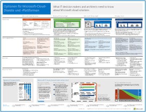
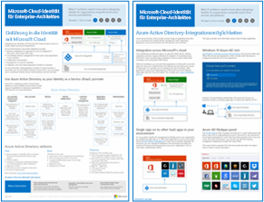
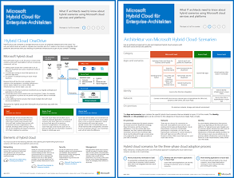
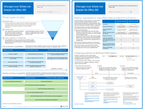
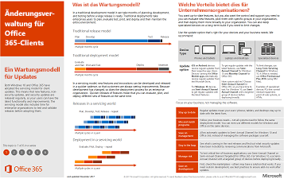

# Ressourcen zur Cloud-IT-Architektur von MicrosoftMicrosoft Cloud IT architecture resources

 **Zusammenfassung:** Informationen zu Microsoft-Clouddiensten und -Plattformen. Lesen Sie unsere Enterprise-Cloud-Roadmap, erkunden Sie unsere Cloud-Architekturreihe usw.**Summary:** Learn about Microsoft cloud services and platforms. Review our enterprise cloud roadmap, explore our cloud architecture series, and more.
  
In diesen Architekturtools- und -postern finden Sie Informationen zu Microsoft-Cloud-Diensten und -Plattformen wie Office 365, Microsoft Azure, Microsoft Intune, Microsoft Dynamics 365, private Cloud-Rechenzentren sowie hybride lokale und Cloud-Lösungen. IT-Entscheidungsträger und Architekten können diese Ressourcen verwenden, um die optimalen Lösungen für ihre Arbeitsauslastungen zu bestimmen und Entscheidungen zu Kerninfrastrukturkomponenten wie Identität und Sicherheit zu treffen.These architecture tools and posters give you information about Microsoft cloud services and platforms, including Office 365, Microsoft Azure, Microsoft Intune, Microsoft Dynamics 365, private cloud datacenter, and hybrid on-premises and cloud solutions. IT decision makers and architects can use these resources to determine the ideal solutions for their workloads and to make decisions about core infrastructure components such as identity and security. 
  
- **[Enterprise-Cloud-Roadmap von Microsoft](microsoft-cloud-it-architecture-resources.md#roadmap)** (Sway)**[Microsoft's Enterprise Cloud Roadmap](microsoft-cloud-it-architecture-resources.md#roadmap)** (Sway)
    
- **[Ressourcen zu Microsoft Cloud für Enterprise-Architekten](microsoft-cloud-it-architecture-resources.md#cloudarch)****[Microsoft Cloud for Enterprise Architects Series](microsoft-cloud-it-architecture-resources.md#cloudarch)** 
    - [Optionen für Microsoft-Cloud-Dienste und -PlattformenMicrosoft Cloud Services and Platform Options](microsoft-cloud-it-architecture-resources.md#platformoptions)
    - [Microsoft-Cloud-Identität für Enterprise-ArchitektenMicrosoft Cloud Identity for Enterprise Architects](microsoft-cloud-it-architecture-resources.md#identity)
    - [Microsoft-Cloud-Sicherheit für Enterprise-ArchitektenMicrosoft Cloud Security for Enterprise Architects](microsoft-cloud-it-architecture-resources.md#security)
    - [Microsoft-Cloudnetzwerke für Enterprise-ArchitektenMicrosoft Cloud Networking for Enterprise Architects](microsoft-cloud-it-architecture-resources.md#networking)
    - [Microsoft-Mobilität und -Sicherheit für Enterprise-ArchitektenMicrosoft Mobility and Security for Enterprise Architects](microsoft-cloud-it-architecture-resources.md#mobility)
    - [Microsoft-Cloud-Speicher für Enterprise-ArchitektenMicrosoft Cloud Storage for Enterprise Architects](microsoft-cloud-it-architecture-resources.md#storage)
    - [Microsoft Hybrid Cloud für Enterprise-ArchitektenMicrosoft Hybrid Cloud for Enterprise Architects](microsoft-cloud-it-architecture-resources.md#hybrid)
    - [Contoso in der Microsoft-CloudContoso in the Microsoft Cloud](microsoft-cloud-it-architecture-resources.md#contoso)
    - [Häufige Angriffe und Microsoft-Funktionen zum Schutz Ihrer OrganisationCommon attacks and Microsoft capabilities that protect your organizaion](#common-attacks-and-microsoft-capabilities-that-protect-your-organization)
    
- **[Reihe: Office 365 Enterprise-Lösungen](microsoft-cloud-it-architecture-resources.md#BKMK_o365solutions)**:**[Office 365 Enterprise Solution Series](microsoft-cloud-it-architecture-resources.md#BKMK_o365solutions)**:
    - [Schutz von Informationen für Office 365Information Protection for Office 365](microsoft-cloud-it-architecture-resources.md#BKMK_infoprotect)
    - [Identität- und Geräteschutz für Office 365Identity and Device Protection for Office 365](microsoft-cloud-it-architecture-resources.md#BKMK_O365IDP)
    - [Lösungen zum Schutz von Dateien in Office 365File Protection Solutions in Office 365](microsoft-cloud-it-architecture-resources.md#BKMK_O365fileprotect)
    - [Änderungsverwaltung für Office 365-ClientsChange Management for Office 365 Clients](microsoft-cloud-it-architecture-resources.md#changemgmt)
    - [Bereitstellen eines modernen und sicheren Desktops mit MicrosoftDeploy a modern and secure desktop with Microsoft](microsoft-cloud-it-architecture-resources.md#msd)
    
> [!TIP]
> Die meisten der Poster auf dieser Seite sind in mehreren Sprachen erhältlich, darunter Chinesisch, Englisch, Französisch, Deutsch, Italienisch, Japanisch, Koreanisch, Portugiesisch, Russisch und Spanisch. Um ein Poster in einer dieser Sprachen herunterzuladen, klicken Sie auf den Link **Weitere Sprachen** für dieses Poster.Most of the posters on this page are available in multiple languages, including Chinese, English, French, German, Italian, Japanese, Korean, Portuguese, Russian, and Spanish. To download a poster in one of these languages, click the **More languages** link for that poster.
  
Geben Sie uns Feedback, indem Sie eine E-Mail senden an [cloudadopt@microsoft.com](mailto:cloudadopt@microsoft.com).Let us know what you think! Send us email at [cloudadopt@microsoft.com](mailto:cloudadopt@microsoft.com). 
  

## Enterprise-Cloud-Roadmap von MicrosoftMicrosoft's Enterprise Cloud Roadmap

Hier finden Sie Poster, Symbolsätze, Community-Ressourcen und andere Ressourcen, die die umfassendste Cloudlösung der Branche beschreiben.See the posters, icon sets, community venues, and other resources that describe the industry's most complete cloud solution.
  
|**Element****Item**|**Beschreibung****Description**|
|:-----|:-----|
|[          ](https://aka.ms/cloudarchitecture)[          ](https://aka.ms/cloudarchitecture)   [Microsoft's Enterprise Cloud Roadmap](https://aka.ms/cloudarchitecture) (https://aka.ms/cloudarchitecture)[Microsoft's Enterprise Cloud Roadmap](https://aka.ms/cloudarchitecture) (https://aka.ms/cloudarchitecture)   |Blättern Sie durch die einzelnen Sway-Anzeigen, um auf Ressourcen zuzugreifen, die die umfassendste Cloudlösung der Branche beschreiben.Swipe through this Sway experience for the resources that describe the industry's most complete cloud solution.    |
   

## Ressourcen zu Microsoft Cloud für Enterprise-ArchitektenMicrosoft Cloud for Enterprise Architects Series

In diesen Cloud-Architekturpostern finden Sie Informationen zu Microsoft-Clouddiensten und -Plattformen wie Office 365, Microsoft Azure, Microsoft Intune, Microsoft Dynamics CRM Online, private Cloud-Rechenzentren sowie hybride lokale und Cloud-Lösungen. IT-Entscheidungsträger und Architekten können diese Ressourcen verwenden, um die optimalen Lösungen für ihre Arbeitsauslastungen zu bestimmen und Entscheidungen zu Kerninfrastrukturkomponenten wie Identität und Sicherheit zu treffen.These cloud architecture posters give you information about Microsoft cloud services and platforms, including Office 365, Microsoft Azure, Microsoft Intune, Microsoft Dynamics CRM Online, private cloud datacenter, and hybrid on-premises and cloud solutions. IT decision makers and architects can use these resources to determine the ideal solutions for their workloads and to make decisions about core infrastructure components such as identity and security.
  

### Optionen für Microsoft-Cloud-Dienste und -PlattformenMicrosoft Cloud Services and Platform Options

Erfahren Sie mehr über die Hauptunterschiede zwischen Cloud-Dienst- und Plattformangeboten von Microsoft. Entscheiden Sie, was für Ihre Lösung am besten geeignet ist.Learn key differences between Microsoft cloud services and platform offerings. Find the best fit for your solution.
  
|**Element****Item**|**Beschreibung****Description**|
|:-----|:-----|
|[          ](https://www.microsoft.com/download/details.aspx?id=54432)[          ](https://www.microsoft.com/download/details.aspx?id=54432)   [PDF](https://go.microsoft.com/fwlink/p/?LinkId=524731)  \| [Visio](https://go.microsoft.com/fwlink/p/?LinkId=524732)  \| [Weitere Sprachen](https://www.microsoft.com/download/details.aspx?id=54432)[PDF](https://go.microsoft.com/fwlink/p/?LinkId=524731)  \| [Visio](https://go.microsoft.com/fwlink/p/?LinkId=524732)  \| [More languages](https://www.microsoft.com/download/details.aspx?id=54432)   | Dieses Modell beschreibt Folgendes:This model describes: <ul><li>  SaaS-Angebote (Software-as-a-Service), einschließlich Office 365Software as a Service (SaaS) offerings, including Office 365 </li><li>  PaaS-Features (Platform as a Service) in Microsoft AzurePlatform as a Service (PaaS) features in Microsoft Azure </li><li>  IaaS-Features (Infrastructure-as-a-Service) in Microsoft AzureInfrastructure as a Service (IaaS) features in Microsoft Azure </li><li>  Funktionen für ein privates Cloud-Rechenzentrum mithilfe von Windows Server und System CenterPrivate cloud datacenter capabilities using Windows Server and System Center </li><li>  Erfahren Sie, wie die IT-Abteilung von Microsoft zu diesen Cloud-Diensten migriert und eine eigene Hybrid Cloud aufbaut.Learn how Microsoft's own IT department is migrating to these cloud services and building its hybrid cloud. </li></ul> |
   

### Microsoft-Cloud-Identität für Enterprise-ArchitektenMicrosoft Cloud Identity for Enterprise Architects

Was IT-Architekten über das Entwerfen der Identität für Organisationen wissen müssen, die Microsoft-Cloud-Dienste und -Plattformen verwendenWhat IT architects need to know about designing identity for organizations using Microsoft cloud services and platforms.
  
|**Element****Item**|**Beschreibung****Description**|
|:-----|:-----|
|[          ](https://www.microsoft.com/download/details.aspx?id=54431)[          ](https://www.microsoft.com/download/details.aspx?id=54431)   [PDF](https://go.microsoft.com/fwlink/p/?LinkId=524586)  \| [Visio](https://download.microsoft.com/download/2/3/8/238228E6-9017-4F6C-BD3C-5559E6708F82/MSFT_cloud_architecture_identity.vsd)           \| [Artikel](https://technet.microsoft.com/library/mt613459.aspx)[PDF](https://go.microsoft.com/fwlink/p/?LinkId=524586)  \| [Visio](https://download.microsoft.com/download/2/3/8/238228E6-9017-4F6C-BD3C-5559E6708F82/MSFT_cloud_architecture_identity.vsd)           \| [Article](https://technet.microsoft.com/library/mt613459.aspx)   [Weitere Sprachen](https://www.microsoft.com/download/details.aspx?id=54431)[More languages](https://www.microsoft.com/download/details.aspx?id=54431)   | Dieses Modell enthält Folgendes:This model contains: <ul><li>Einführung in die Identität mit der Cloud von MicrosoftIntroduction to identity with Microsoft’s cloud </li> <li>Azure AD-IDaaS-FunktionenAzure AD IDaaS capabilities </li><li>Integrieren von lokalen Active Directory-Domain Services-Konten in Microsoft Azure Active DirectoryIntegrating on-premises Active Directory Domain Services accounts with Microsoft Azure Active Directory </li> <li>Einfügen von Verzeichniskomponenten in AzurePutting directory components in Azure </li><li>Domänendienstoptionen für Arbeitslasten in Azure IaaSDomain services options for workloads in Azure IaaS </li></ul>  |
   

### Microsoft-Cloud-Sicherheit für Enterprise-ArchitektenMicrosoft Cloud Security for Enterprise Architects

Was IT-Architekten über die Sicherheit in Microsoft-Cloud-Diensten und -Plattformen wissen müssenWhat IT architects need to know about security in Microsoft cloud services and platforms.
  
|**Element****Item**|**Beschreibung****Description**|
|:-----|:-----|
|[          ](https://www.microsoft.com/download/details.aspx?id=48121)[          ](https://www.microsoft.com/download/details.aspx?id=48121)   [PDF](https://go.microsoft.com/fwlink/p/?linkid=842070)  \| [Visio](https://go.microsoft.com/fwlink/p/?LinkId=842071)  \| [Weitere Sprachen](https://www.microsoft.com/download/details.aspx?id=48121)[PDF](https://go.microsoft.com/fwlink/p/?linkid=842070)  \| [Visio](https://go.microsoft.com/fwlink/p/?LinkId=842071)  \| [More languages](https://www.microsoft.com/download/details.aspx?id=48121)   | Dieses Modell enthält Folgendes:This model contains: <ul><li>Die Rolle von Microsoft bei der Bereitstellung sicherer Dienste und PlattformenMicrosoft's role in providing secure services and platforms</li><li>Die Verantwortung des Kunden, Sicherheitsrisiken zu minimierenCustomer responsibilities to mitigate security risks</li><li>Zertifizierungen der höchsten SicherheitTop security certifications </li><li>Sicherheitsangebote, die von Microsoft Consulting Services bereitgestellt werdenSecurity offerings provided by Microsoft consulting services </ul></li>Arbeiten Sie den Kurs [Sicherheit in einer cloudfähigen Welt](https://mva.microsoft.com/training-courses/security-in-a-cloudenabled-world-12725?l=CfLHobAcB_3904300474) durch, ein Kurs der Microsoft Virtual Academy, der auf diesem Architekturposter basiert.Take [Security in a Cloud-Enabled World](https://mva.microsoft.com/training-courses/security-in-a-cloudenabled-world-12725?l=CfLHobAcB_3904300474), a Microsoft Virtual Academy course based on this architecture poster.  |
   

### Microsoft-Cloudnetzwerke für Enterprise-ArchitektenMicrosoft Cloud Networking for Enterprise Architects

Was IT-Architekten über Netzwerke für Microsoft-Cloud-Dienste und -Plattformen wissen müssenWhat IT architects need to know about networking for Microsoft cloud services and platforms.
  
|**Element****Item**|**Beschreibung****Description**|
|:-----|:-----|
|[          ](https://www.microsoft.com/download/details.aspx?id=54425)[          ](https://www.microsoft.com/download/details.aspx?id=54425)   [PDF](https://go.microsoft.com/fwlink/p/?linkid=842073)  \| [Visio](https://go.microsoft.com/fwlink/p/?linkid=842074)           \| [Artikel](https://technet.microsoft.com/library/mt733214.aspx)[PDF](https://go.microsoft.com/fwlink/p/?linkid=842073)  \| [Visio](https://go.microsoft.com/fwlink/p/?linkid=842074)           \| [Article](https://technet.microsoft.com/library/mt733214.aspx)  [Weitere Sprachen](https://www.microsoft.com/download/details.aspx?id=54425)[More languages](https://www.microsoft.com/download/details.aspx?id=54425)   | Dieses Modell enthält die folgenden Inhalte:This model contains the following pages: <ul><li> **Weiterentwicklung Ihres Netzwerks für Cloud-Konnektivität** Cloudmigration ändert das Volumen und die Art des Datenverkehrs innerhalb und außerhalb eines Unternehmensnetzwerks. Sie hat ebenfalls Auswirkungen auf Ansätze zur Reduzierung von Sicherheitsrisiken.**Evolving your network for cloud connectivity** Cloud migration changes the volume and nature of traffic flows within and outside a corporate network. It also affects approaches to mitigating security risk. </li><li> **Gemeinsame Elemente der Microsoft Cloudkonnektivität** Die Integration Ihres Netzwerk in Microsoft-Cloud bietet optimalen Zugriff auf eine Vielzahl von Diensten.**Common elements of Microsoft cloud connectivity** Integrating your networking with the Microsoft cloud provides optimal access to a broad range of services. </li><li> **ExpressRoute für Microsoft Cloud-Konnektivität** ExpressRoute bietet eine private, dedizierte Netzwerkverbindung mit hohem Durchsatz mit der Microsoft Cloud.**ExpressRoute for Microsoft cloud connectivity** ExpressRoute provides a private, dedicated, high-throughput network connection to Microsoft's cloud. </li><li> **Entwerfen von Netzwerken für Microsoft SaaS (Office 365, Microsoft Intune und Dynamics CRM Online)** Für die Optimierung Ihres Netzwerks für Microsoft SaaS-Dienste ist eine sorgfältige Analyse von Internet-Edge, Ihrer Clientgeräte und IT-Standardvorgänge erforderlich.**Designing networking for Microsoft SaaS (Office 365, Microsoft Intune, and Dynamics CRM Online)** Optimizing your network for Microsoft SaaS services requires careful analysis of your Internet edge, your client devices, and typical IT operations. </li><li> **Entwerfen von Netzwerken für Azure PaaS** Für die Optimierung Ihrer Netzwerke für Azure PaaS-Apps ist eine ausreichende Internetbandbreite und möglicherweise die Verteilung des Netzwerkdatenverkehrs auf mehrere Websites oder Apps erforderlich.**Designing networking for Azure PaaS** Optimizing networking for Azure PaaS apps requires adequate Internet bandwidth and can require the distribution of network traffic across multiple sites or apps. </li><li> **Entwerfen von Netzwerken für Azure IaaS** Durchlaufen Sie schrittweise den Entwurfsprozess zum Erstellen eines optimalen virtuellen Azure-Netzwerks (VNet) für das Hosting von serverbasierten IT-Arbeitslasten, einschließlich Subnetzen, Adressräumen, Routing, DNS, Lastenausgleich und der Verbindung zu Ihrem lokalen Netzwerk, anderen VNets und dem Internet.**Designing networking for Azure IaaS** Step through the design process to create an optimal Azure virtual network (VNet) for hosting server-based IT workloads, including subnets, address spaces, routing, DNS, load balancing, and connectivity to your on-premises network, other VNets, and the Internet. </li></ul>   Arbeiten Sie [Optimieren des Netzwerks für Microsoft-Cloudangebote](https://aka.ms/optimizecloudnetworkingmva) durch, ein neuen Kurs der Microsoft Virtual Academy, der auf diesem Architekturposter basiert.Take [Optimize Your Network for Microsoft Cloud Offerings](https://aka.ms/optimizecloudnetworkingmva), a new Microsoft Virtual Academy course based on this architecture poster.   |
   

### Microsoft-Mobilität und -Sicherheit für Enterprise-ArchitektenMicrosoft Mobility and Security for Enterprise Architects

Was IT-Architekten über die Mobilität in Microsoft-Cloud-Diensten und -Plattformen wissen müssenWhat IT architects need to know about mobility with Microsoft cloud services and platforms.
  
|**Element****Item**|**Beschreibung****Description**|
|:-----|:-----|
|[          ](https://www.microsoft.com/download/details.aspx?id=55023)[          ](https://www.microsoft.com/download/details.aspx?id=55023)   [PDF](https://go.microsoft.com/fwlink/p/?linkid=842076)  \| [Visio](https://go.microsoft.com/fwlink/p/?linkid=842077)  \| [Weitere Sprachen](https://www.microsoft.com/download/details.aspx?id=55023)[PDF](https://go.microsoft.com/fwlink/p/?linkid=842076)  \| [Visio](https://go.microsoft.com/fwlink/p/?linkid=842077)  \| [More languages](https://www.microsoft.com/download/details.aspx?id=55023)   | Dieses Modell enthält Folgendes:This model contains: <ul><li>Top Mobile Apps für UnternehmenTop mobile apps for business </li><li>Plattform, Dienste und Ressourcen für die Entwicklung von Mobile AppsPlatform, services, and resources for developing mobile apps </li><li>Verwalten des Zugriffs auf cloudbasierte Anwendungen und Daten von mobilen GerätenManaging access to cloud-based applications and data from mobile devices </li><li>Vergleich der Funktions- und Plattformunterstützung für Office 365 MDM, Azure Active Directory Premium und Intune.Comparison of capabilities and platform support for Office 365 MDM, Azure Active Directory Premium, and Intune </li></ul>  |
   

### Microsoft-Cloud-Speicher für Enterprise-ArchitektenMicrosoft Cloud Storage for Enterprise Architects

Was IT-Architekten über Speicheroptionen in Microsoft-Cloud-Diensten und -Plattformen von MicrosoftWhat IT architects need to know about storage options in Microsoft cloud services and platforms.
  
|**Element****Item**|**Beschreibung****Description**|
|:-----|:-----|
|[          ](https://www.microsoft.com/download/details.aspx?id=49552)[          ](https://www.microsoft.com/download/details.aspx?id=49552)   [PDF](https://go.microsoft.com/fwlink/p/?linkid=842079)  \| [Visio](https://go.microsoft.com/fwlink/p/?linkid=842080)           \| [Artikel](hhttps://technet.microsoft.com/library/mt842597.aspx)[PDF](https://go.microsoft.com/fwlink/p/?linkid=842079)  \| [Visio](https://go.microsoft.com/fwlink/p/?linkid=842080)           \| [Article](hhttps://technet.microsoft.com/library/mt842597.aspx)  [Weitere Sprachen](https://www.microsoft.com/download/details.aspx?id=49552)[More languages](https://www.microsoft.com/download/details.aspx?id=49552)   | Dieses Modell enthält Folgendes:This model contains: <ul><li>Gründe für die Verwendung von Cloudspeichern und die wichtigsten SzenariosReasons for using cloud storage and the key scenarios </li><li>Cloudspeicheroptionen, die mit vorhandenen Diensten gebündelt sind.Cloud storage options that are bundled with existing services </li><li>Speicheroptionen, die Sie als Einstiegspunkt für Ihre Speicherlösung verwenden können.Storage options that you can use as a starting point for your storage solution </li><li>Speicherbausteine zum Erstellen eigener Speicherlösungen oder Speicher für Apps.Storage building blocks to create your own storage solution or storage for your apps</li></ul> |
   

### Microsoft Hybrid Cloud für Enterprise-ArchitektenMicrosoft Hybrid Cloud for Enterprise Architects

Was IT-Architekten über Hybrid Cloud für Microsoft-Dienste und -Plattformen wissen müssenWhat IT architects need to know about hybrid cloud for Microsoft services and platforms.
  
|**Element****Item**|**Beschreibung****Description**|
|:-----|:-----|
|[          ](https://www.microsoft.com/download/details.aspx?id=54424)[          ](https://www.microsoft.com/download/details.aspx?id=54424)   [PDF](https://go.microsoft.com/fwlink/p/?linkid=842082)  \| [Visio](https://go.microsoft.com/fwlink/p/?linkid=842083)           \| [Artikel](https://technet.microsoft.com/library/mt750500.aspx)[PDF](https://go.microsoft.com/fwlink/p/?linkid=842082)  \| [Visio](https://go.microsoft.com/fwlink/p/?linkid=842083)           \| [Article](https://technet.microsoft.com/library/mt750500.aspx)  [Weitere Sprachen](https://www.microsoft.com/download/details.aspx?id=54424)[More languages](https://www.microsoft.com/download/details.aspx?id=54424)   | Dieses Modell enthält die folgenden Inhalte:This model contains the following pages: <ul><li> **Hybrid-Cloud-Übersicht** Cloud-Angebote von Microsoft (SaaS, Azure PaaS und Azure IaaS) und deren gemeinsame Elemente.**Hybrid cloud overview** Microsoft's cloud offerings (SaaS, Azure PaaS, and Azure IaaS) and their common elements. </li><li> **Architektur von Microsoft Hybrid-Cloud-Szenarien** Architektonisches Diagramm der hybriden Cloud für die Cloud-Angebote von Microsoft, in dem die gemeinsamen Ebenen von lokaler Infrastruktur, Netzwerken und Identität gezeigt werden.**Architecture of Microsoft hybrid cloud scenarios** An architectural diagram of hybrid cloud for Microsoft's cloud offerings, showing the common layers of on-premises infrastructure, networking, and identity. </li><li> **Hybrid-Cloud-Szenarien für Microsoft SaaS (Office 365)** Architektur des SaaS-Hybrid-Szenarios und Beschreibungen der wichtigsten Hybridkonfigurationen für Skype for Business, SharePoint Server und Exchange Server.**Hybrid cloud scenarios for Microsoft SaaS (Office 365)** The SaaS hybrid scenario architecture and descriptions of key hybrid configurations for Skype for Business, SharePoint Server, and Exchange Server. </li><li> **Szenarien für die hybride Cloud für Azure PaaS** Architektur des Azure PaaS Hybrid-Szenarios, Beschreibung einer Azure PaaS-Hybridanwendung anhand eines Beispiels und Beschreibung einer SQL Server 2016 Stretch-Datenbank**Hybrid cloud scenarios for Azure PaaS** The Azure PaaS hybrid scenario architecture, the description of an Azure PaaS hybrid application with an example, and the description of SQL Server 2016 Stretch Database. </li><li> **Szenarien für die hybride Cloud für Azure IaaS** Architektur des Azure IaaS Hybrid-Szenarios und Beschreibung einer in Azure IaaS gehosteten Line of Business-(LOB-)Anwendung.**Hybrid cloud scenarios for Azure IaaS** The Azure IaaS hybrid scenario architecture and the description of a line of business (LOB) application hosted in Azure IaaS. </li></ul> |
   

### Contoso in der Microsoft-CloudContoso in the Microsoft Cloud

Wie ein fiktives, aber repräsentatives globales Unternehmen die Microsoft-Cloudangebote, einschließlich Office 365, Azure, Dynamics 365 und Intune, implementiert hat.How a fictional but representative global organization has implemented Microsoft's cloud offerings, including Office 365, Azure, Dynamics 365, and Intune.
  
|**Element****Item**|**Beschreibung****Description**|
|:-----|:-----|
|[          ](https://www.microsoft.com/download/details.aspx?id=54427)[          ](https://www.microsoft.com/download/details.aspx?id=54427)   [PDF](https://go.microsoft.com/fwlink/p/?linkid=842085)  \| [Visio](https://go.microsoft.com/fwlink/p/?linkid=842086)           \| [Artikel](https://technet.microsoft.com/library/mt775341.aspx)[PDF](https://go.microsoft.com/fwlink/p/?linkid=842085)  \| [Visio](https://go.microsoft.com/fwlink/p/?linkid=842086)           \| [Article](https://technet.microsoft.com/library/mt775341.aspx)  [Weitere Sprachen](https://www.microsoft.com/download/details.aspx?id=54427)[More languages](https://www.microsoft.com/download/details.aspx?id=54427)   |Dieses Modell enthält Folgendes:This model contains: <ul><li>Übersicht über die Contoso CorporationOverview of the Contoso Corporation </li><li>Contosos IT-Infrastruktur und -Anforderungen
Contoso's IT infrastructure and needs </li><li>Cloudnetzwerke bei ContosoCloud networking for Contoso</li><li>Cloudidentität für ContosoCloud identity for Contoso</li><li>Abonnements, Lizenzen und Benutzerkonten bei Contoso
Contoso's subscriptions, licenses, and user accounts</li><li>Cloudsicherheit für ContosoCloud security for Contoso</li><li>Unternehmenscloudszenarien bei ContosoEnterprise cloud scenarios for Contoso</li></ul>  |
   

### Häufige Angriffe und Microsoft-Funktionen zum Schutz Ihrer OrganisationCommon attacks and Microsoft capabilities that protect your organization
Erfahren Sie mehr über die häufigsten Cyberangriffe und wie Microsoft Ihrer Organisation in jeder Phase des Angriffs helfen kann.Learn about the most common cyber attacks and how Microsoft can help your organization at every stage of an attack. 

|**Element****Item**|**Beschreibung****Description**|
|:-----|:-----|
|   [PDF](http://download.microsoft.com/download/F/A/C/FACFC1E9-FA35-4DF1-943C-8D4237B4275B/MSFT_Cloud_architecture_security_commonattacks.pdf) \| [Visio](http://download.microsoft.com/download/F/A/C/FACFC1E9-FA35-4DF1-943C-8D4237B4275B/MSFT_Cloud_architecture_security_commonattacks.vsdx)[PDF](http://download.microsoft.com/download/F/A/C/FACFC1E9-FA35-4DF1-943C-8D4237B4275B/MSFT_Cloud_architecture_security_commonattacks.pdf) \| [Visio](http://download.microsoft.com/download/F/A/C/FACFC1E9-FA35-4DF1-943C-8D4237B4275B/MSFT_Cloud_architecture_security_commonattacks.vsdx)   | Dieses Poster veranschaulicht den Weg häufiger Angriffe und beschreibt, welche Funktionen dabei helfen können, Angreifer in jeder Phase des Angriffs zu stoppen.This poster illustrates the path of common attacks and describes which capabilities help stop attackers at each stage of an attack.  |

### Die Weihnachtsmann-CloudThe Santa Cloud

Wie der Weihnachtsmann und seine Elfen die Cloud-Angebote von Microsoft nutzen, um ihre jährlichen Lieferungen zu bewerkstelligen.How Santa and his elves use Microsoft's cloud offerings to make their annual deliveries.
  
|**Element****Item**|**Beschreibung****Description**|
|:-----|:-----|
|[          ](https://www.microsoft.com/download/details.aspx?id=55039)[          ](https://www.microsoft.com/download/details.aspx?id=55039)   [PDF](https://go.microsoft.com/fwlink/p/?linkid=842088)[PDF](https://go.microsoft.com/fwlink/p/?linkid=842088)   |Um zu bestimmen, wer brav und wer böse war und welche Geschenke am 24. Dezember auszuliefern sind, verwenden der Weihnachtsmann und seine elfische IT-Abteilung Office 365, Azure, Dynamics 365 und Intune.To determine who is naughty and nice and the presents to deliver on December 24, Santa Claus and his elfin IT department use Office 365, Azure, Dynamics 365, and Intune.   |
   

## Reihe: Office 365 Enterprise-LösungenOffice 365 Enterprise Solution Series

Die Reihe der Office 365 Enterprise-Lösungen bietet Hilfestellung zum Implementieren von Office 365-Funktionen, insbesondere bei technologieübergreifenden Funktionen.The Office 365 enterprise solution series provides guidance for implementing Office 365 capabilities, especially where capabilities cross technologies.
  

### Schutz von Informationen für Office 365Information Protection for Office 365

Funktionen für Unternehmensorganisationen zum Schutz von Unternehmensressourcen.Capabilities for enterprise organizations to protect corporate assets.
  
|**Element****Item**|**Beschreibung****Description**|
|:-----|:-----|
|[          ](https://www.microsoft.com/download/details.aspx?id=54429)[          ](https://www.microsoft.com/download/details.aspx?id=54429)   [PDF](http://download.microsoft.com/download/2/3/D/23D91386-8349-4F7A-9470-FD5AED861F16/MSFT_cloud_architecture_informationprotection.pdf)  \| [Visio](http://download.microsoft.com/download/2/3/D/23D91386-8349-4F7A-9470-FD5AED861F16/MSFT_cloud_architecture_informationprotection.vsd)  \| [Weitere Sprachen](https://www.microsoft.com/download/details.aspx?id=54429)[PDF](http://download.microsoft.com/download/2/3/D/23D91386-8349-4F7A-9470-FD5AED861F16/MSFT_cloud_architecture_informationprotection.pdf)  \| [Visio](http://download.microsoft.com/download/2/3/D/23D91386-8349-4F7A-9470-FD5AED861F16/MSFT_cloud_architecture_informationprotection.vsd)  \| [More languages](https://www.microsoft.com/download/details.aspx?id=54429)   |Microsoft bietet die umfassendsten Funktionen zum Schützen Ihrer Unternehmensressourcen. Dieses Modell hilft Organisationen, bei der Planung der zu implementierenden Funktionen einen methodischen Ansatz zu verfolgen.Microsoft provides the most complete set of capabilities to protect your corporate assets. This model helps organizations take a methodical approach when planning which capabilities to implement.   |
   

### Identität- und Geräteschutz für Office 365Identity and Device Protection for Office 365

Empfohlene Funktionen zum Schutz von Identitäten und Geräten, die auf Office 365, andere SaaS-Dienste und lokale Anwendungen zugreifen, die mit dem Azure AD-Anwendungsproxy veröffentlicht werden.Recommended capabilities for protecting identities and devices that access Office 365, other SaaS services, and on-premises applications published with Azure AD Application Proxy.
  
|**Element****Item**|**Beschreibung****Description**|
|:-----|:-----|
|[          ](https://www.microsoft.com/download/details.aspx?id=55032)[          ](https://www.microsoft.com/download/details.aspx?id=55032)   [PDF](https://go.microsoft.com/fwlink/p/?linkid=841656)  \| [Visio](https://go.microsoft.com/fwlink/p/?linkid=841657)  \| [Weitere Sprachen](https://www.microsoft.com/download/details.aspx?id=55032)[PDF](https://go.microsoft.com/fwlink/p/?linkid=841656)  \| [Visio](https://go.microsoft.com/fwlink/p/?linkid=841657)  \| [More languages](https://www.microsoft.com/download/details.aspx?id=55032)   |Es ist wichtig, konsistente Schutzebenen für Daten, Identitäten und Geräte zu verwenden. In diesem Dokument wird gezeigt, welche Funktionen mit weiteren Informationen über die Funktionen zum Schutz von Identitäten und Geräten vergleichbar sind.It's important to use consistent levels of protection across your data, identities, and devices. This document shows you which capabilities are comparable with more information on capabilities to protect identities and devices.    |
   

### Lösungen zum Schutz von Dateien in Office 365File Protection Solutions in Office 365

Empfohlene Funktionen zum Schutz von Dateien in Office 365 basierend auf drei unterschiedlichen Vertraulichkeitsstufen.Recommended capabilities for protecting files in Office 365 based on three different sensitivity levels.
  
|**Element****Item**|**Beschreibung****Description**|
|:-----|:-----|
|[          ](https://www.microsoft.com/download/details.aspx?id=55523)[          ](https://www.microsoft.com/download/details.aspx?id=55523)   [PDF](http://download.microsoft.com/download/7/8/9/789645A5-BD10-4541-BC33-F8D1EFF5E911/MSFT_cloud_architecture_O365 file protection.pdf)  \| [Visio](http://download.microsoft.com/download/7/8/9/789645A5-BD10-4541-BC33-F8D1EFF5E911/MSFT_cloud_architecture_O365%20file%20protection.vsdx)[PDF](http://download.microsoft.com/download/7/8/9/789645A5-BD10-4541-BC33-F8D1EFF5E911/MSFT_cloud_architecture_O365 file protection.pdf)  \| [Visio](http://download.microsoft.com/download/7/8/9/789645A5-BD10-4541-BC33-F8D1EFF5E911/MSFT_cloud_architecture_O365%20file%20protection.vsdx)   |Es ist wichtig, konsistente Schutzebenen für Daten, Identitäten und Geräte zu verwenden. In diesem Dokument wird gezeigt, welche Funktionen mit weiteren Informationen über die Funktionen zum Schutz von Dateien in Office 365 vergleichbar sind.It's important to use consistent levels of protection across your data, identities, and devices. This document shows you which capabilities are comparable with more information on capabilities to protect files in Office 365.    |
   

### Änderungsverwaltung für Office 365-ClientsChange Management for Office 365 Clients

Was IT-Architekten über die Verwaltung von Versionen für die Office 365-Clientanwendungen und Windows 10 wissen müssen What IT architects need to know about managing releases for the Office 365 client applications and Windows 10. 
  
|**Element****Item**|**Beschreibung****Description**|
|:-----|:-----|
|[          ](https://www.microsoft.com/download/details.aspx?id=49141)[          ](https://www.microsoft.com/download/details.aspx?id=49141)   [PDF](https://go.microsoft.com/fwlink/p/?LinkId=626681)  \| [Visio](https://go.microsoft.com/fwlink/p/?LinkId=626680)           \| [Artikel](https://technet.microsoft.com/library/mt584223.aspx)[PDF](https://go.microsoft.com/fwlink/p/?LinkId=626681)  \| [Visio](https://go.microsoft.com/fwlink/p/?LinkId=626680)           \| [Article](https://technet.microsoft.com/library/mt584223.aspx)  [Weitere Sprachen](https://www.microsoft.com/download/details.aspx?id=49141)[More languages](https://www.microsoft.com/download/details.aspx?id=49141)   | Dieses Modell enthält Folgendes:This model contains: <ul><li>Wartungsmodell für Windows 10 und Office 365-ClientanwendungenThe servicing model for Windows 10 and the Office 365 client applications </li><li>  VeröffentlichungsoptionenRelease Options </li><li>  VersionswechselRelease Cadences </li><li>  Typen von ÄnderungenTypes of Changes </li><li>  Rollen und VerantwortlichkeitenRoles and Responsibilities </li><li>  Verwalten von UpdatebereitstellungenManage Update Deployments </li></ul>   Lesen Sie die Informationen im folgenden Artikel: [Änderungsverwaltung für Office 365-Clients](http://technet.microsoft.com/library/815fa1aa-0355-40b5-b7bc-cdf7d4610062.aspx).View the information in article form: [Change management for Office 365 clients](http://technet.microsoft.com/library/815fa1aa-0355-40b5-b7bc-cdf7d4610062.aspx).    |
   

### Bereitstellen eines modernen und sicheren Desktops mit MicrosoftDeploy a modern and secure desktop with Microsoft

Informationen für IT-Architekten über das Bereitstellen und Verwalten von Updates für Office 365 ProPlus unter Windows 10What IT architects need to know about deploying and managing updates for Office 365 ProPlus on Windows 10.
  
|**Element****Item**|**Beschreibung****Description**|
|:-----|:-----|
|[          ](https://www.microsoft.com/download/details.aspx?id=55987)[          ](https://www.microsoft.com/download/details.aspx?id=55987)   [PDF](http://download.microsoft.com/download/4/E/9/4E90E227-770A-41D1-99FE-925A64D81A55/MSFT_modern_secure_desktop.pdf)  \| [Visio](http://download.microsoft.com/download/4/E/9/4E90E227-770A-41D1-99FE-925A64D81A55/MSFT_modern_secure_desktop.vsdx)[PDF](http://download.microsoft.com/download/4/E/9/4E90E227-770A-41D1-99FE-925A64D81A55/MSFT_modern_secure_desktop.pdf)  \| [Visio](http://download.microsoft.com/download/4/E/9/4E90E227-770A-41D1-99FE-925A64D81A55/MSFT_modern_secure_desktop.vsdx)   | Dieses Modell enthält Folgendes:This model contains: <ul><li>  Bereitstellen von Windows 10 und Office ProPlus aus der Microsoft-CloudDeploying Windows 10 and Office ProPlus from the Microsoft cloud </li><li>  Bereitstellen von Windows 10 und Office ProPlus mithilfe von System Center Configuration ManagerDeploying Windows 10 and Office ProPlus with System Center Configuration Manager </li><li>  Verwalten von Updates für Windows 10 und Office ProPlus aus der Microsoft-CloudManaging updates for Windows 10 and Office ProPlus from the Microsoft cloud </li><li>  Verwalten von Updates für Windows 10 und Office ProPlus mithilfe von System Center Configuration ManagerManaging updates for Windows 10 and Office ProPlus with System Center Configuration Manager </li><li>  Out-of-Box- und zusätzliche Schutzfunktionen von Windows 10Out-of-the-box and additional protection capabilities of Windows 10 </li></ul>  |
   
## Weitere ArtikelSee Also

[Architekturmodelle für SharePoint, Exchange, Skype for Business und LyncArchitectural models for SharePoint, Exchange, Skype for Business, and Lync](architectural-models-for-sharepoint-exchange-skype-for-business-and-lync.md)
  
[Testumgebungsanleitungen (TLGs) zur CloudakzeptanzCloud adoption Test Lab Guides (TLGs)](cloud-adoption-test-lab-guides-tlgs.md)
  
[SicherheitslösungenSecurity solutions](security-solutions.md)
  
[HybridlösungenHybrid solutions](hybrid-solutions.md)

