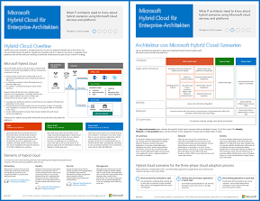

# Microsoft Hybrid Cloud für Enterprise-ArchitektenMicrosoft Hybrid Cloud for Enterprise Architects

 **Zusammenfassung:** Was IT-Architekten über Hybridszenarien wissen müssen, in denen Microsoft-Clouddienste und -plattformen verwendet werden.**Summary:** What IT architects need to know about hybrid scenarios using Microsoft cloud services and platforms.
  
Dieser Artikel enthält einige Artikel, die beschreiben, was IT-Architekten über Hybridarchitekturen und Konfigurationen mit Microsoft-Clouddiensten und -Plattformen wissen müssen. Sie können diesen Artikel auch als 7-seitiges Poster anzeigen und im Tabloid-Format (auch bekannt als Ledger, 11 x 17 oder A3) drucken.This article links you to a set of articles that describe what IT architects need to know about hybrid architecture and configurations with Microsoft cloud services and platforms. You can also view this article as a 7-page poster and print it in tabloid format (also known as ledger, 11 x 17, or A3).
  

  
[PDF](https://go.microsoft.com/fwlink/p/?linkid=842082) | [Visio](https://go.microsoft.com/fwlink/p/?linkid=842083) | 
[Weitere Sprachen](https://www.microsoft.com/download/details.aspx?id=54424)PDF filePDF  Visio fileVisio  See a page with versions in additional languagesMore languages
  
Sie sehen auch alle Modelle der [Ressourcen zur Cloud-IT-Architektur von Microsoft](microsoft-cloud-it-architecture-resources.md) und können[Microsoft Enterprise Cloud Roadmap: Resources for IT Decision Makers]((https://aka.ms/cloudarchitecture)) durchsuchen.You can also see all of the models in the [Microsoft Cloud IT architecture resources](microsoft-cloud-it-architecture-resources.md) and swipe through[Microsoft's Enterprise Cloud Roadmap: Resources for IT Decision Makers]((https://aka.ms/cloudarchitecture)).
  
Lesen Sie die folgenden Abschnitte:See the following sections:
  
- [Hybrid Cloud-ÜbersichtHybrid cloud overview](hybrid-cloud-overview.md)
    
    Cloud-Angebote von Microsoft (SaaS, Azure PaaS und Azure IaaS) und deren gemeinsame Elemente.Microsoft's cloud offerings (SaaS, Azure PaaS, and Azure IaaS) and their common elements.
    
- [Architektur von Microsoft Hybrid Cloud-SzenarienArchitecture of Microsoft hybrid cloud scenarios](architecture-of-microsoft-hybrid-cloud-scenarios.md)
    
    Architektonisches Diagramm der Hybridcloud für die Cloudangebote von Microsoft, in dem die gemeinsamen Schichten von lokaler Infrastruktur, Netzwerken und Identität gezeigt werden.An architectural diagram of hybrid cloud for Microsoft's cloud offerings, showing the common layers of on-premises infrastructure, networking, and identity.
    
- [Hybrid Cloud-Szenarien für Microsoft SaaS (Office 365)Hybrid cloud scenarios for Microsoft SaaS (Office 365)](hybrid-cloud-scenarios-for-microsoft-saas-office-365.md)
    
    Architektur des SaaS-Hybridszenarios und Beschreibungen der wichtigsten Hybridkonfigurationen für Skype for Business, SharePoint Server und Exchange Server.The SaaS hybrid scenario architecture and descriptions of key hybrid configurations for Skype for Business, SharePoint Server, and Exchange Server.
    
- [Hybrid Cloud-Szenarien für Azure PaaSHybrid cloud scenarios for Azure PaaS](hybrid-cloud-scenarios-for-azure-paas.md)
    
    Architektur des Azure PaaS-Hybridszenarios, Beschreibung einer Azure PaaS-Hybridanwendung anhand eines Beispiels und Beschreibung einer SQL Server 2016 Stretch-DatenbankThe Azure PaaS hybrid scenario architecture, the description of an Azure PaaS hybrid application with an example, and the description of SQL Server 2016 Stretch Database.
    
- [Hybrid Cloud-Szenarien für Azure IaaSHybrid cloud scenarios for Azure IaaS](hybrid-cloud-scenarios-for-azure-iaas.md)
    
    Architektur des Azure IaaS-Hybridszenarios und Beschreibung einer in Azure IaaS gehosteten Branchenanwendung.The Azure IaaS hybrid scenario architecture and the description of a line of business (LOB) application hosted in Azure IaaS.
    
> [!NOTE]
> Diese Artikel beziehen sich auf die **Juni 2017-Version** des Posters „Microsoft Hybrid Cloud für Enterprise-Architekten".These articles reflect the **June 2017** release of the Microsoft Hybrid Cloud for Enterprise Architects poster.
  
## Weitere ArtikelSee Also

[Ressourcen zur Cloud-IT-Architektur von MicrosoftMicrosoft Cloud IT architecture resources](microsoft-cloud-it-architecture-resources.md)

[Enterprise-Cloud-Roadmap von Microsoft: Ressourcen für IT-Entscheidungsträger]((https://sway.com/FJ2xsyWtkJc2taRD))[Microsoft's Enterprise Cloud Roadmap: Resources for IT Decision Makers]((https://sway.com/FJ2xsyWtkJc2taRD))

