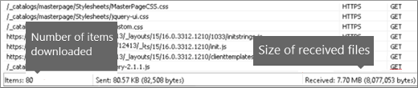

# Minimierung und Bündelung in SharePoint OnlineMinification and bundling in SharePoint Online

In diesem Artikel wird beschrieben, wie Sie bei einer Verkleinerung und Techniken mit Web Essentials bündeln zur Reduzierung der Anzahl der HTTP-Anfragen und zu den Zeitraum zu verkürzen, die zum Laden von Seiten in SharePoint Online benötigt wird.This article describes how to use minification and bundling techniques with Web Essentials to reduce the number of HTTP requests and to reduce the time it takes to load pages in SharePoint Online.
  
Es kann sein, dass Sie beim Anpassen Ihrer Website eine große Anzahl zusätzlicher Dateien zum Server hinzufügen müssen, um die Anpassung zu unterstützen. Durch Hinzufügen von zusätzlichen JavaScript-, CSS- und Bilddateien erhöht sich die Anzahl der HTTP-Anforderungen an den Server, was wiederum die Anzeige einer Webseite verlangsamt. Wenn Sie über mehrere Dateien desselben Typs verfügen, können Sie diese Dateien bündeln bzw. in einem Paket zusammenfassen, um das Herunterladen dieser Dateien zu beschleunigen.When you customize your website you can end up adding a large number of extra files to the server to support the customization. Adding extra JavaScript, CSS, and images increases the number of HTTP requests to the server which in turn increases the time it takes to display a web page. If you have multiple files of the same type, you can bundle these files to make downloading these files faster.
  
Für JavaScript und CSS-Dateien können Sie auch einen Ansatz Verkleinerung, aufgerufen, in dem Sie reduzieren der Gesamtgröße von Dateien durch Entfernen von Leerzeichen und Sonderzeichen, die nicht erforderlich sind.For JavaScript and CSS files, you can also use an approach called minification, where you reduce the total size of files by removing whitespace and other characters that aren't necessary.
  
## Minimierung und Bündelung von JavaScript- und CSS-Dateien mit Web EssentialsMinification and bundling JavaScript and CSS files with Web Essentials

Sie können eine Drittanbietersoftware verwenden, z. B. Web Essentials, um CSS- und JavaScript-Dateien zu bündeln.You can use third-party software such as Web Essentials to bundle CSS and JavaScript files.
  
> [!IMPORTANT]
> Web Essentials ist ein Drittanbieter-, Open Source, Community-basierte Projekt. Die Software ist eine Erweiterung für Visual Studio 2012 und Visual Studio 2013 und wird von Microsoft nicht unterstützt. Informationen zum Herunterladen von Web Essentials finden Sie auf der Website unter [http://vswebessentials.com/download](https://go.microsoft.com/fwlink/p/?LinkId=525629).Web Essentials is a third-party, open-source, community-based project. The software is an extension to Visual Studio 2012 and Visual Studio 2013 and is not supported by Microsoft. To download Web Essentials, visit the website at [http://vswebessentials.com/download](https://go.microsoft.com/fwlink/p/?LinkId=525629). 
  
Web Essentials bietet zwei Arten der Bündelung an:Web Essentials offers two forms of bundling:
  
- BUNDLE: für CSS- und JavaScript-Dateien.bundle: for CSS and JavaScript files
    
- SPRITE: für Bilder (nur verfügbar in Visual Studio 2013).sprite: for images (only available in Visual Studio 2013)
    
Sie können Web Essentials verwenden, wenn Sie über ein vorhandenes Feature mit Brandingelementen verfügen, auf die innerhalb einer benutzerdefinierten Masterseite verwiesen wird, zum Beispiel:You can use Web Essentials if you have an existing feature with some branding elements that are referenced inside a custom master page, such as:
  

  
 **Zum Erstellen einer TE000127218 und CSS-Bundle in Web Essentials****To create a TE000127218 and CSS bundle in Web Essentials**
  
1. Wählen Sie in Visual Studio im Projektmappen-Explorer die Dateien aus, die im Paket enthalten sein sollen.In Visual Studio, in Solution Explorer, select the files that you want to include in the bundle.
    
2. Mit der rechten Maustaste der ausgewählten Dateien, und wählen Sie **Web Essentials** \> **JavaScript erstellen Bundle-Datei** aus dem Kontextmenü. Zum Beispiel:Right-click the selected files and then select **Web Essentials** \> **Create JavaScript bundle file** from the context menu. For example: 
    
    
  
## Anzeigen der Ergebnisse der Bündelung von JavaScript- und CSS-DateienViewing the results of bundling JavaScript and CSS files

Bei der Erstellung eines JavaScript- und CSS-Pakets erstellt Web Essentials eine XML-Datei, die als Rezeptdatei bezeichnet wird. Sie gibt die JavaScript- und CSS-Dateien und weitere Konfigurationsinformationen an:When you create a JavaScript and CSS bundle, Web Essentials creates an XML file called a recipe file that identifies the JavaScript and CSS files as well as some other configuration information: 
  

  
Wenn das Kennzeichen für die Minimierung im Bündelungsrezept auf "wahr" gesetzt ist, werden die Dateien größenmäßig reduziert und zu einem Paket zusammengefasst. Auf diese Weise werden neue, verkleinerte Versionen der JavaScript-Dateien erstellt, auf die Sie in Ihrer Masterseite verweisen können.In addition, if the minify flag is set to true in the bundling recipe the files are reduced in size as well as bundled together. This means that new, minified versions of the JavaScript files were created that you can reference in your master page.
  

  
Wenn Sie eine Seite von Ihrer Website laden, können Sie die Entwicklertools Ihres Webbrowsers, z. B. Internet Explorer 11, verwenden, um die Anzahl der Anforderungen an den Server anzuzeigen und einzusehen, wie lange jede Datei zum Laden gebraucht hat.When you load a page from your web site, you can use the developer tools from your web browser, such as Internet Explorer 11, to see the number of requests sent to the server and how long each file took to load.
  
Die folgende Abbildung zeigt das Ergebnis des Ladens der JavaScript- und CSS-Dateien vor der Minimierung.The following figure is the result of loading the JavaScript and CSS files before minification.
  

  
Nach Bündelung der CSS- und JavaScript-Dateien hat sich die Anzahl der Anforderungen auf 74 verringert, und jede Datei brauchte nur geringfügig länger als die ursprünglichen Dateien beim einzelnen Herunterladen:After bundling the CSS and JavaScript files together, the number of requests dropped to 74 and each file took only slightly longer than the original files to download individually:
  

  
Nach der Bündelung hat sich die JavaScript-Paketdatei deutlich von 815 KB auf 365 KB reduziert:After bundling, the JavaScript bundle file is reduced significantly from 815KB to 365KB:
  

  
## Bündelung von Bildern durch Erstellen eines Image SpriteBundling images by creating an image sprite

Ähnlich wie Sie JavaScript und CSS-Dateien verpacken, können viele kleine Symbole und andere allgemeine Bilder in einem größeren Sprite Blatt kombinieren und dann CSS verwenden, um die einzelnen Bilder anzuzeigen. Nicht auf jedes einzelne Bild herunterladen, Webbrowser des Benutzers das Blatt Sprite einmal downloads und speichert es auf dem lokalen Computer. Dadurch wird die seitenladeleistung durch verringert die Anzahl der Downloads und Roundtrips an den Webserver verbessert.Similar to how you bundle JavaScript and CSS files, you can combine many small icons and other common images into a larger sprite sheet and then use CSS to reveal the individual images. Instead of downloading each individual image, the user's web browser downloads the sprite sheet once and then caches it on the local computer. This improves page load performance by cutting down on the number of downloads and round trips to the web server.
  
 **So erstellen Sie ein Image Sprite in Web Essentials****To create an image sprite in Web Essentials**
  
1. Wählen Sie in Visual Studio im Projektmappen-Explorer die Dateien aus, die im Paket enthalten sein sollen.In Visual Studio, in Solution Explorer, select the files that you want to include in the bundle.
    
2. Mit der rechten Maustaste der ausgewählten Dateien, und wählen Sie **Web Essentials** \> **erstellen Bild Sprite** im Kontextmenü aus. Zum Beispiel:Right-click the selected files and then select **Web Essentials** \> **Create image sprite** from the context menu. For example: 
    
    
  
3. Wählen Sie einen Speicherort für die Sprite-Datei aus. Bei der Sprite-Datei handelt es sich um eine XML-Datei, die die Einstellungen und Dateien im Sprite beschreibt. Die folgenden Abbildungen zeigen ein Beispiel für eine Sprite-PNG-Datei und die zugehörige Sprite-XML-Datei.Choose a location to save the sprite file. The .sprite file is an XML file that describes the settings and files in the sprite. The following figures show an example of a sprite PNG file and its corresponding .sprite XML file.
    
    
  
    
  

