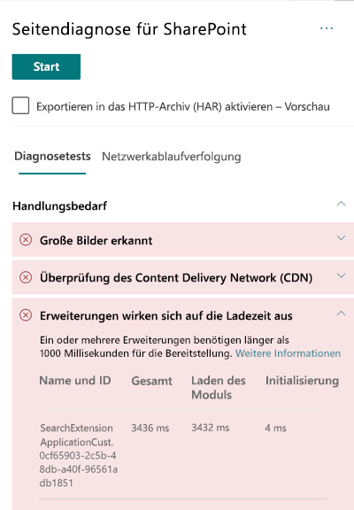

# Optimieren der Leistung benutzerdefinierter Erweiterungen in modernen SharePoint Online-WebseitenOptimize custom extension performance in SharePoint Online modern site pages

In diesem Artikel erfahren Sie, wie Sie die Auswirkungen benutzerdefinierter Erweiterungen auf die vom Benutzer empfundene Latenz bestimmen und häufig auftretende Probleme beheben können.This article will help you understand how to determine how custom extensions affect user perceived latency, and how to remediate common issues.

## Verwenden Sie das Tool „Seitendiagnose für SharePoint“, um benutzerdefinierte Erweiterungen zu analysierenUse the Page Diagnostics for SharePoint tool to analyze custom extensions

Das Tool "Seitendiagnose für SharePoint" ist eine Browsererweiterung für den neuen Microsoft Edge (https://www.microsoft.com/edge) und Chrome, mit denen Sie SharePoint Online-Seiten sowohl in modernen Portal- als auch in klassischen Veröffentlichungs-Websites analysieren können.The Page Diagnostics for SharePoint tool is a browser extension for the new Microsoft Edge (https://www.microsoft.com/edge) and Chrome browsers that analyzes both SharePoint Online modern portal and classic publishing site pages. Das Tool stellt für jede analysierte Seite einen Bericht bereit, in dem die Leistung der Seite anhand einer definierten Gruppe von Leistungskriterien dargestellt wird.The tool provides a report for each analyzed page showing how the page performs against a defined set of performance criteria. Wenn Sie das Tool "Seitendiagnose für SharePoint" installieren und mehr darüber erfahren möchten, besuchen Sie [Verwenden des Seitendiagnose-Tools für SharePoint Online](page-diagnostics-for-spo.md).To install and learn about the Page Diagnostics for SharePoint tool, visit [Use the Page Diagnostics tool for SharePoint Online](page-diagnostics-for-spo.md).

>[!NOTE]
>Das Seitendiagnose-Tool funktioniert nur für SharePoint Online und kann nicht auf einer SharePoint-Systemseite verwendet werden.The Page Diagnostics tool only works for SharePoint Online, and cannot be used on a SharePoint system page.

Wenn Sie eine Seite einer SharePoint-Website mit dem Tool "Seitendiagnose für SharePoint" analysieren, werden im Ergebnis **Erweiterungen, die sich auf die Ladezeit auswirken** im Bereich _Diagnosetests_ Informationen über benutzerdefinierte Erweiterungen angezeigt, die die Baselinemetrik überschreiten.When you analyze a SharePoint site page with the Page Diagnostics for SharePoint tool, you can see information about custom extensions that exceed the baseline metric in the **Extensions are impacting load time** result in the _Diagnostic tests_ pane.

Mögliche Ergebnisse sind:Possible results include:

- **Handlungsbedarf** (rot): eine _benutzerdefinierte_ Erweiterung, bei der der Ladevorgang länger als **eine** Sekunde dauert.**Attention required** (red): Any _custom_ extension that takes longer than **one** second to load. Die in den Testergebnissen angezeigte Gesamtladezeit wird nach "Modul laden" und "Initialisieren" unterteilt.Total load time as displayed in test results is broken down by module load and init.
- **Keine Aktion erforderlich** (grün): Keine Erweiterung benötigt länger als eine Sekunde zum Laden.**No action required** (green): No extension is taking longer than one second to load.

Wirkt sich eine Erweiterung auf die Ladezeit von Seiten aus, wird das Ergebnis im Abschnitt **Aktion erforderlich** der Ergebnisse angezeigt.If an extension is impacting page load time, the result appears in the **Attention required** section of the results. Klicken Sie auf das Ergebnis, um Einzelheiten zu sehen, welche Erweiterung langsam geladen wird.Click the result to see details about which extension is loading slowly. Zukünftige Updates des Tools "Seitendiagnose für SharePoint" können Aktualisierungen der Analyseregeln enthalten. Stellen Sie daher sicher, dass Sie immer über die neueste Version des Tools verfügen.Future updates to the Page Diagnostics for SharePoint tool may include updates to analysis rules, so please ensure you always have the latest version of the tool.

Die verfügbaren Informationen in den Ergebnissen umfassen:Information available in the results includes:

- **Name und ID** zeigt identifizierende Informationen an, die Ihnen beim Auffinden der Erweiterung auf der Seite helfen können.**Name and ID** shows identifying information that can help you find the extension on the page
- **Gesamt** zeigt die Gesamtzeit an, in der die Erweiterung initialisiert und geladen wird.**Total** shows the total time for the extension to initialize and load
- **Modul laden** zeigt die Zeit an, die zum Abrufen und Laden der Erweiterung benötigt wird.**Module Load** shows the time taken to fetch and load the extension
- **Initialisieren** zeigt die Zeit an, die für das Initialisieren einer Erweiterung benötigt wird.**Init** shows the time taken for the extension to initialize

Diese Informationen dienen Designern und Entwicklern zum Beheben von Problemen.This information is provided to help designers and developers troubleshoot issues. Diese Informationen sollten Ihrem Entwurfs- und Entwicklungsteam bereitgestellt werden.This information should be provided to your design and development team.

## Übersicht über ErweiterungenOverview of extensions

Mit SharePoint-Framework(SPFx)-Erweiterungen können Sie die SharePoint-Benutzeroberfläche erweitern.SharePoint Framework (SPFx) Extensions can be used to extend the SharePoint user experience. Mit SharePoint-Framework-Erweiterungen können Sie weitere Facetten der SharePoint-Benutzeroberfläche anpassen, u. a. Benachrichtigungsbereiche, Symbolleisten und Listendatenansichten.With SharePoint Framework Extensions, you can customize more facets of the SharePoint experience, including notification areas, toolbars, and list data views.

Erweiterungen können sich auf die Leistung einer SharePoint-Seite negativ auswirken, da außerdem CPU- und Netzwerkressourcen arbeiten müssen.Extensions can have a bad influence on the performance of a SharePoint page as it also takes CPU and network resources to do required work.

Es gibt vier Typen von Erweiterungen:There are four types of extensions:

- **Anwendungscustomizer** fügen der Seite Skripts hinzu, greifen auf bekannte HTML-Element-Platzhalter zu und erweitern sie um benutzerdefinierte Renderings.**Application Customizers** adds scripts to the page, and accesses well-known HTML element placeholders and extends them with custom renderings.
- **Feldcustomizer** stellen modifizierte Datenansichten für Felder in einer Liste bereit.**Field Customizers** provides modified views to data for fields within a list.
- **Befehlssätze** erweitern die SharePoint-Befehlsoberfläche um neue Aktionen und stellen clientseitigen Code bereit, mit dessen Hilfe Sie Verhaltensweisen implementieren können.**Command Sets** extend the SharePoint command surfaces to add new actions, and provides client-side code that you can use to implement behaviors.
- **Suchabfrage-Modifizierer (nur Vorschau)** werden unmittelbar vor der Suchabfrage aufgerufen.**Search Query Modifier (preview only)** are invoked just before the search query is executed.

## Beheben von Problemen mit der Leistung von ErweiterungenRemediate extension performance issues

Befolgen Sie die Anweisungen in diesem Abschnitt, um Leistungsprobleme mit Erweiterungen zu erkennen und zu beheben, die in den Ergebnissen **Erweiterungen, die sich auf die Seitenladezeit auswirken** aufgelistet werden.Follow the guidance in this section to identify and remediate performance issues with extensions listed in the **Extensions are impacting page load time** results.

>[!NOTE]
>Anwendungscustomizer können in der Frühphase des Lebenszyklus einer Seite ausgeführt werden und die Leistung anderer Erweiterungen auf der Seite beeinflussen.Application customizers may be executed in the early stage during the lifecycle of a page and it may influence the performance of other extensions on the page.

Die Überwachungsergebnisse im Seitendiagnosetool zeigen zwei Phasen der Ausführung einer Erweiterung an, um die potenziellen Auswirkungen auf die Leistung zu erkennen.The audit results in the Page Diagnostic Tool will display two stages of executing an extension in order to help identify the potential performance impact.

- **Modul laden** ist die Dauer des Ladens der Erweiterung, was von der Größe einer Erweiterung beeinflusst wird. Deshalb empfiehlt es sich, nur die erforderlichen Bibliotheken in der Erweiterung zu bündeln und auch kleinere Bibliotheken auszuwählen.**Module load** is how long it takes to load the extension, which is impacted by the size of an extension so it is a good idea to only bundle the necessary libraries in the extension and to also choose lighter libraries.
- **Initialisieren** ist die Initialisierungszeit der Erweiterung, und Erweiterungsentwickler sollten überlegen, ob die Erweiterung unnötig arbeitet oder während der Initialisierungsphase zu viele Befehle ausführt.**Init** is the initialization time of the extension and extension developers should consider whether the extension is doing unnecessary work or executing too many commands during the initializing stage.

Seitenautoren können das Überwachungsergebnis auch verwenden, um festzustellen, ob eine Seite zu viele Erweiterungen hat, da sich dies negativ auf die Leistung einer Seite auswirkt.Page authors can also use the audit result to see whether a page has too many extensions as too many extensions will negatively impact the performance of a page.

- **Erweiterungsgröße und Abhängigkeiten****Extension size and dependencies**
  - Die Verwendung von Office 365 CDN ist für den optimalen statischen Ressourcendownload erforderlich.Use of the Office 365 CDN is required for optimal static resource download. Öffentliche CDN-Quellen sind für _js/css_-Dateien vorzuziehen.Public CDN origins are preferable for _js/css_ files. Weitere Informationen zur Verwendung von Office 365 CDN finden Sie unter [Verwendung von Office 365 Content Delivery Network (CDN) mit SharePoint Online](use-office-365-cdn-with-spo.md).For more information about using the Office 365 CDN, see [Use the Office 365 Content Delivery Network (CDN) with SharePoint Online](use-office-365-cdn-with-spo.md).
  - Verwenden Sie Frameworks wie _React_ und _Fabric-Importe_, die Bestandteil des SharePoint-Frameworks (SPFx) sind.Reuse frameworks like _React_ and _Fabric imports_ that come as part of the SharePoint Framework (SPFx). Weitere Informationen finden Sie unter [Übersicht über das SharePoint-Framework](https://docs.microsoft.com/sharepoint/dev/spfx/sharepoint-framework-overview).For more information, see [Overview of the SharePoint Framework](https://docs.microsoft.com/sharepoint/dev/spfx/sharepoint-framework-overview).
  - Stellen Sie sicher, dass Sie die neueste Version des SharePoint-Frameworks verwenden, und führen Sie stets Aktualisierungen auf neue Versionen durch, sobald diese verfügbar sind.Ensure that you are using the latest version of the SharePoint Framework, and upgrade to new versions as they become available.
- **Datenabruf/-zwischenspeicherung****Data fetching/caching**
  - Wenn sich die Erweiterung auf zusätzliche Serveraufrufe stützt, um Daten für die Anzeige abzurufen, stellen Sie sicher, dass diese Server-APIs schnell sind und/oder clientseitige Zwischenspeicherung implementieren (z. B. die Verwendung von _localStorage_ oder _IndexDB_ für größere Sets).If the extension relies on extra server calls to fetch data for display, ensure those server APIs are fast and/or implement client side caching (such as using _localStorage_ or _IndexDB_ for larger sets).
  - Wenn zum Rendern wichtiger Daten mehrere Aufrufe erforderlich sind, sollten Sie die Batchverarbeitung auf dem Server oder andere Methoden zum Konsolidieren von Anforderungen in einen einzigen Anruf erwägen.If multiple calls are required to render critical data, consider batching on the server or other methods of consolidating requests to a single call.
  - Wenn bestimmte Datenelemente eine langsamere API benötigen, für das anfängliche Rendern aber nicht kritisch sind, entkoppeln Sie diese mit einem separaten Aufruf, der nach dem Rendern kritischer Daten ausgeführt wird.Alternatively, if some elements of data require a slower API, but are not critical to initial rendering, decouple these to a separate call that is executed after critical data is rendered.
  - Wenn mehrere Webparts dieselben Daten nutzen, verwenden Sie eine gemeinsame Datenschicht, um doppelte Aufrufe zu vermeiden.If multiple parts use the same data, utilize a common data layer to avoid duplicate calls.
- **Renderingzeit****Rendering time**
  - Alle Medienquellen wie Bilder und Videos sollten an die Grenzen des Containers, Geräts und/oder Netzwerks angepasst sein, um das Herunterladen unnötig großer Anlagen zu vermeiden.Any media sources like images and videos should be sized to the limits of the container, device and/or network to avoid downloading unnecessary large assets. Weitere Informationen zu Inhaltsabhängigkeiten finden Sie unter [Verwendung von Office 365 Content Delivery Network (CDN) mit SharePoint Online](use-office-365-cdn-with-spo.md).For more information about content dependencies, see [Use the Office 365 Content Delivery Network (CDN) with SharePoint Online](use-office-365-cdn-with-spo.md).
  - Vermeiden Sie API-Aufrufe, die einen Umbruch, komplexe CSS-Regeln oder komplizierte Animationen verursachen.Avoid API calls that cause re-flow, complex CSS rules or complicated animations. Weitere Informationen finden Sie unter [Minimizing browser reflow](https://developers.google.com/speed/docs/insights/browser-reflow) (Minimieren von Browserumbrüchen).For more information, see [Minimizing browser reflow](https://developers.google.com/speed/docs/insights/browser-reflow).
  - Vermeiden Sie die Verwendung von verketteten Aufgaben mit langen Ausführungszeiten.Avoid use of chained long running tasks. Verteilen Sie Aufgaben mit langen Ausführungszeiten stattdessen auf separate Warteschlangen.Instead, break long running tasks apart into separate queues. Weitere Informationen finden Sie unter [Optimize JavaScript Execution](https://developers.google.com/web/fundamentals/performance/rendering/optimize-javascript-execution) (Optimieren der JavaScript-Ausführung).For more information, see [Optimize JavaScript Execution](https://developers.google.com/web/fundamentals/performance/rendering/optimize-javascript-execution).
  - Reservieren Sie entsprechenden Speicherplatz für asynchrones Rendern von Medien oder visuellen Elementen, um übersprungene Frames und Stottern zu vermeiden (auch als _Jank_ bezeichnet).Reserve corresponding space for asynchronously rendering media or visual elements to avoid skipped frames and stuttering (also known as _jank_).
  - Wenn ein bestimmter Browser ein für das Rendern verwendetes Feature nicht unterstützt, laden Sie ein Polyfill, oder schließen Sie die Ausführung von abhängigem Code aus.If a certain browser doesn't support a feature used in rendering, either load a polyfill or exclude running dependent code. Wenn das Feature nicht kritisch ist, entfernen Sie Ressourcen wie Ereignishandler, um Speicherlecks zu vermeiden.If the feature is not critical, dispose resources such as event handlers to avoid memory leaks.

Bevor Sie Seitenrevisionen zur Behebung von Leistungsproblemen durchführen, notieren Sie sich die Ladezeit der Seite in den Analyseergebnissen.Before you make page revisions to remediate performance issues, make a note of the page load time in the analysis results. Führen Sie das Tool nach Ihrer Revision erneut aus, um zu sehen, ob das neue Ergebnis innerhalb des Grenzwertes liegt, und überprüfen Sie die Ladezeit der neuen Seite, um festzustellen, ob eine Verbesserung vorliegt.Run the tool again after your revision to see if the new result is within the baseline standard, and check the new page load time to see if there was an improvement.

>[!NOTE]
>Die Seitenladezeit kann aufgrund einer Vielzahl von Faktoren wie Netzwerklast, Tageszeit und anderen vorübergehenden Schwierigkeiten variieren.Page load time can vary based on a variety of factors such as network load, time of day, and other transient conditions. Sie sollten die Seitenladezeit einige Male vor und nach der Durchführung von Änderungen testen, um einen Mittelwert zu berechnen.You should test page load time a few times before and after making changes to help you average the results.

## Verwandte ThemenRelated topics

[Optimieren der Leistung von SharePoint OnlineTune SharePoint Online performance](tune-sharepoint-online-performance.md)

[Optimieren der Leistung von Office 365Tune Office 365 performance](tune-office-365-performance.md)

[Leistung in der modernen SharePoint-OberflächePerformance in the modern SharePoint experience](https://docs.microsoft.com/sharepoint/modern-experience-performance)

[Netzwerke für die InhaltsübermittlungContent delivery networks](content-delivery-networks.md)

[Verwenden des Office 365 Content Delivery Network (CDN) mit SharePoint OnlineUse the Office 365 Content Delivery Network (CDN) with SharePoint Online](use-office-365-cdn-with-spo.md)