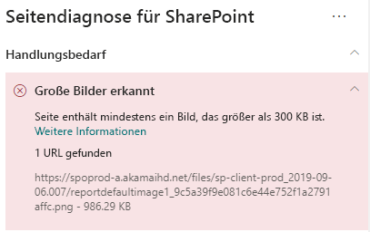

# Optimieren von Bilder in modernen SharePoint Online-WebsitesOptimize images in SharePoint Online modern site pages

In diesem Artikel erfahren Sie, wie Sie Bilder in modernen SharePoint Online-Websites optimieren.This article will help you understand how to optimize images in SharePoint Online modern site pages.

Informationen zum Optimieren von Bildern in klassischen Veröffentlichungswebsites finden Sie unter [Bildoptimierung für SharePoint Online](image-optimization-for-sharepoint-online.md).For information about optimizing images in classic publishing sites, see [Image optimization for SharePoint Online](image-optimization-for-sharepoint-online.md)..

>[!NOTE]
>Weitere Informationen zur Leistung in modernen SharePoint Online-Portalen finden Sie unter [Leistung in der modernen SharePoint-Umgebung](https://docs.microsoft.com/sharepoint/modern-experience-performance).For more information about performance in SharePoint Online modern portals, see [Performance in the modern SharePoint experience](https://docs.microsoft.com/sharepoint/modern-experience-performance).

## Verwenden des Tools "Seitendiagnose für SharePoint" zum Analysieren der BildoptimierungUse the Page Diagnostics for SharePoint tool to analyze image optimization

Das **Tool "Seitendiagnose für SharePoint"** ist eine Browsererweiterung für Chrome und [Microsoft Edge ab Version 77](https://www.microsoftedgeinsider.com/download?form=MI13E8&OCID=MI13E8), mit der Sie Seiten in modernen und klassischen SharePoint-Veröffentlichungswebsites analysieren können.The **Page Diagnostics for SharePoint tool** is a browser extension for Chrome and [Microsoft Edge version 77 or later](https://www.microsoftedgeinsider.com/download?form=MI13E8&OCID=MI13E8) you can use to analyze SharePoint both modern and classic publishing site pages. Das Tool stellt für jede analysierte Seite einen Bericht bereit, in dem die Leistung der Seite anhand einer definierten Gruppe von Leistungskriterien dargestellt wird.The tool provides a report for each analyzed page showing how the page performs against a defined set of performance criteria. Wenn Sie das Tool "Seitendiagnose für SharePoint" installieren und mehr darüber erfahren möchten, besuchen Sie [Verwenden des Seitendiagnose-Tools für SharePoint Online](page-diagnostics-for-spo.md).To install and learn about the Page Diagnostics for SharePoint tool, visit [Use the Page Diagnostics tool for SharePoint Online](page-diagnostics-for-spo.md).

Wenn Sie eine moderne SharePoint-Website mit dem Tool "Seitendiagnose für SharePoint" analysieren, werden Informationen über große Bilder im Bereich _Diagnosetests_ angezeigt.When you analyze a SharePoint modern site with the Page Diagnostics for SharePoint tool, you can see information about large images in the _Diagnostic tests_ pane.

Mögliche Ergebnisse sind:Possible results include:

- **Handlungsbedarf** (rot): Die Seite enthält **mindestens ein** Bild mit einer Größe von über 300 KB.**Attention required** (red): The page contains **one or more** images over 300KB in size
- **Keine Aktion erforderlich** (grün): Die Seite enthält keine Bilder mit einer Größe von über 300 KB.**No action required** (green): The page contains no images over 300KB in size

Wenn das Ergebnis **Große Bilder erkannt** in den Ergebnissen im Abschnitt **Handlungsbedarf** angezeigt wird, können Sie darauf klicken, um weitere Details anzuzeigen.If the **Large images detected** result appears in the **Attention required** section of the results, you can click the result to see additional details.

## Beheben von Problemen mit großen BildernRemediate large image issues

Wenn eine Seite Bilder mit einer Größe von über 300 KB enthält, wählen Sie das Ergebnis **Große Bilder erkannt** aus, um anzuzeigen, welche Bilder zu groß sind.If a page contains images over 300KB in size, select the **Large images detected** result to see which images are too large. Auf modernen SharePoint Online-Seiten erfolgt die Wiedergabe von Bildern, und die Bilder werden an die Größe des Browserfensters und die Auflösung des Clientmonitors angepasst.In modern SharePoint Online pages, renditions of images are automatically provided and sized depending on the size of the browser window and the resolution of the client monitor. Sie sollten Bilder immer für die Webverwendung optimieren, bevor Sie sie in SharePoint Online hochladen.You should always optimize images for web use prior to upload to SharePoint Online. Sehr große Bilder werden automatisch in Größe und Auflösung reduziert, was zu unerwarteten Ergebnissen bei der Wiedergabe führen kann.Very large images will be automatically reduced in size and resolution which can result in unexpected rendering characteristics.

Bevor Sie Seitenrevisionen zur Behebung von Leistungsproblemen durchführen, notieren Sie sich die Ladezeit der Seite in den Analyseergebnissen.Before you make page revisions to remediate performance issues, make a note of the page load time in the analysis results. Führen Sie das Tool nach Ihrer Revision erneut aus, um zu sehen, ob das neue Ergebnis innerhalb des Grenzwertes liegt, und überprüfen Sie die Ladezeit der neuen Seite, um festzustellen, ob eine Verbesserung vorliegt.Run the tool again after your revision to see if the new result is within the baseline standard, and check the new page load time to see if there was an improvement.

>[!NOTE]
>Die Seitenladezeit kann aufgrund einer Vielzahl von Faktoren wie Netzwerklast, Tageszeit und anderen vorübergehenden Schwierigkeiten variieren.Page load time can vary based on a variety of factors such as network load, time of day, and other transient conditions. Sie sollten die Seitenladezeit einige Male vor und nach der Durchführung von Änderungen testen, um einen Mittelwert zu berechnen.You should test page load time a few times before and after making changes to help you average the results.

## Verwandte ThemenRelated topics

[Optimieren der Leistung von SharePoint OnlineTune SharePoint Online performance](tune-sharepoint-online-performance.md)

[Optimieren der Leistung von Office 365Tune Office 365 performance](tune-office-365-performance.md)

[Leistung in der modernen SharePoint-OberflächePerformance in the modern SharePoint experience](https://docs.microsoft.com/sharepoint/modern-experience-performance)

[Netzwerke für die InhaltsübermittlungContent delivery networks](content-delivery-networks.md)

[Verwenden des Office 365 Content Delivery Network (CDN) mit SharePoint OnlineUse the Office 365 Content Delivery Network (CDN) with SharePoint Online](use-office-365-cdn-with-spo.md)
