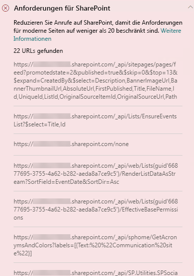

# Das Optimieren von Seiten ruft moderne und klassische Veröffentlichungswebsiteseiten von SharePoint Online aufOptimize page calls in SharePoint Online modern and classic publishing site pages

Sowohl moderne als auch klassische SharePoint Online VVeröffentlichungswebsiteseiten enthalten Links, die Daten von SharePoint-Funktionen und CDNs laden (oder anrufen).Both SharePoint Online modern and classic publishing sites contain links that load data from (or make calls to) SharePoint features and CDNs. Je mehr Aufrufe von einer Seite gemacht werden, desto länger dauert das Laden der Seite.The more calls made by a page, the longer the page takes to load. Dies wird als **vom Endverbraucher wahrgenommene Latenzzeit** oder **EUPL** bezeichnet.This is known as **end user perceived latency** or **EUPL**.

Dieser Artikel beschreibt, wie Sie die Anzahl und Auswirkung von Aufrufen auf externe Endpunkte von Ihren modernen und klassischen Veröffentlichungswebsiteseiten bestimmen und wie Sie deren Auswirkungen auf die vom Endbenutzer wahrgenommene Latenzzeit begrenzen können.This article will help you understand how to determine the number and impact of calls to external endpoints from your modern and classic publishing site pages and how to limit their effect on end user perceived latency.

>[!NOTE]
>Weitere Informationen zur Leistung in modernen SharePoint Online-Portalen finden Sie unter [Leistung in der modernen SharePoint-Umgebung](https://docs.microsoft.com/sharepoint/modern-experience-performance).For more information about performance in SharePoint Online modern portals, see [Performance in the modern SharePoint experience](https://docs.microsoft.com/sharepoint/modern-experience-performance).

## Verwenden Sie das Tool „Seitendiagnose für SharePoint“, um die Seitenaufrufe zu analysierenUse the Page Diagnostics for SharePoint tool to analyze page calls

Das **Tool für die Seitendiagnose für SharePoint** ist eine Browser-Erweiterung für Chrome und [Microsoft Edge Version 77 oder höher](https://www.microsoftedgeinsider.com/download?form=MI13E8&OCID=MI13E8), mit denen Sie SharePoint sowohl moderne als auch klassische Veröffentlichungswebsiteseiten analysieren können.The **Page Diagnostics for SharePoint tool** is a browser extension for Chrome and [Microsoft Edge version 77 or later](https://www.microsoftedgeinsider.com/download?form=MI13E8&OCID=MI13E8) you can use to analyze SharePoint both modern and classic publishing site pages. Das Tool stellt für jede analysierte Seite einen Bericht bereit, in dem die Leistung der Seite anhand einer definierten Gruppe von Leistungskriterien dargestellt wird.The tool provides a report for each analyzed page showing how the page performs against a defined set of performance criteria. Für Informationen und zur Installation der Seitendiagnose für SharePoint-Tools, besuchen Sie[Verwenden des Seitendiagnose-Tools für SharePoint Online](page-diagnostics-for-spo.md).To install and learn about the Page Diagnostics for SharePoint tool, visit [Use the Page Diagnostics tool for SharePoint Online](page-diagnostics-for-spo.md).

Wenn Sie eine SharePoint-Website Seite mit dem Tool „Seitendiagnose für SharePoint“ analysieren, finden Sie Informationen zu externen Aufrufen im **Anforderungen für SharePoint** Ergebnis im Bereich_Diagnosetests_.When you analyze a SharePoint site page with the Page Diagnostics for SharePoint tool, you can see information about external calls in the **Requests to SharePoint** result in the _Diagnostic tests_ pane. Die Zeile wird grün angezeigt, wenn die Standortseite weniger als die Grundwert-Nummer der Aufrufe enthält, und rot, wenn die Seite die Grundwert-Nummer überschreitet.The line will appear in green if the site page contains fewer than the baseline number of calls, and red if the page exceeds the baseline number. Die Grundwert-Nummer ist für moderne und klassische Seiten unterschiedlich, da klassische Seiten HTTP1.1 und moderne Seiten HTTP2.0 verwenden:The baseline number is different for modern and classic pages because classic site pages use HTTP1.1 and modern pages use HTTP2.0:

- Moderne Seiten der Website sollten nicht mehr als **25** Aufrufe enthalten.Modern site pages should contain no more than **25** calls
- Klassische Veröffentlichungsseiten sollten nicht mehr als **6** Aufrufe enthalten.Classic publishing pages should contain no more than **6** calls

Mögliche Ergebnisse beinhalten:Possible results include:

- **Aktion erforderlich** (rot): Die Seite überschreitet den Grundwert der Anfragen.**Attention required** (red): The page exceeds the baseline number of calls
- **Keine Aktion erforderlich** (grün): Die Seite enthält weniger als den Grundwert der Anfragen.**No action required** (green): The page contains fewer than the baseline number of calls

Wenn das Ergebnis **Anforderungen für SharePoint** im Abschnitt **Aktion erforderlich** erscheint, können Sie auf das Ergebnis klicken, um Details zu erhalten, einschließlich der Gesamtzahl der Aufrufe auf der Seite und einer Liste der URLs.If the **Requests to SharePoint** result appears in the **Attention required** section, you can click the result for details, including the total number of calls on the page and a list of the URLs.

## Beheben von Leistungsproblemen im Zusammenhang mit zu vielen Aufrufen auf einer SeiteRemediate performance issues related to too many calls on a page

Wenn eine Seite zu viele Aufrufe enthält, können Sie anhand der Liste der URLs in den Ergebnissen der **Anforderungen für Sharepoint** feststellen, ob es sich um wiederholte Aufrufe, Aufrufe, die gebündelt werden sollen, oder Aufrufe handelt, die Daten zurückgeben, die zwischengespeichert werden sollen.If a page contains too many calls, you can use the list of URLs in the **Requests to Sharepoint** results to determine whether there are any repeated calls, calls that should be batched, or calls that return data that should be cached.

**Die Batchverarbeitung von REST-Aufrufen** kann dazu beitragen, den Verwaltungsaufwand zu verringern.**Batching REST calls** can help to reduce performance overhead. Weitere Informationen über die Batchverarbeitung von API-Aufrufen finden Sie unter [Erstellen von Batchanforderungen mit den REST-APIs](https://docs.microsoft.com/sharepoint/dev/sp-add-ins/make-batch-requests-with-the-rest-apis).For more information about API call batching, see [Make batch requests with the REST APIs](https://docs.microsoft.com/sharepoint/dev/sp-add-ins/make-batch-requests-with-the-rest-apis).

**Die Verwendung eines Caches** zum Speichern der Ergebnisse eines API-Aufrufs kann die Leistung einer warmen Anforderung verbessern, indem der Client die zwischengespeicherten Daten verwenden kann, anstatt für jeden nachfolgenden Seitenaufruf einen zusätzlichen Aufruf zu tätigen.**Using a cache** to store the results of an API call can improve the performance of a warm request by allowing the client to use the cached data instead of making an additional call for each subsequent page load. Je nach Geschäftsanforderung gibt es verschiedene Möglichkeiten, diese Lösung anzugehen.There are multiple ways to approach this solution depending on the business requirement. Wenn die Daten für alle Benutzer gleich sind, ist die Verwendung eines Middle-Tier-Caching-Dienstes wie [_Azure Redis_Cache](https://azure.microsoft.com/services/cache/) eine gute Option, um den API-Verkehr mit einer Website deutlich zu reduzieren, da die Benutzer die Daten vom Caching-Dienst statt direkt vom SPO anfordern würden.Typically if the data will be the same for all users, using a middle-tier caching service like [_Azure Redis_ cache](https://azure.microsoft.com/services/cache/) is a great option to significantly reduce API traffic against a site, as the users would request the data from the caching service instead of directly from SPO. Die einzigen SPO-Aufrufe, die benötigt werden, sind das Aktualisieren des Middle-Tier-Cache.The only SPO calls needed would be to refresh the middle-tier's cache. Wenn die Daten je nach Benutzer variieren, kann es sinnvoll sein, einen clientseitigen Cache wie LocalStorage oder sogar ein Cookie zu implementieren.If the data will fluctuate on an individual user basis, it may be best to implement a client side cache, like LocalStorage or even a Cookie. Dies reduziert dennoch das Anrufvolumen, indem nachfolgende Anforderungen durch den gleichen Benutzer für die Cachedauer beseitigt werden, ist aber weniger effizient als ein spezieller Caching-Dienst.This will still reduce call volumes by eliminating subsequent requests made by the same user for the cache duration, but will be less efficient than a dedicated caching service. PnP ermöglicht es Ihnen, LocalStorage mit geringem Entwicklungsaufwand zu nutzen.PnP allows you to use LocalStorage with little additional development required.

Bevor Sie Seitenrevisionen zur Behebung von Leistungsproblemen durchführen, notieren Sie sich die Ladezeit der Seite in den Analyseergebnissen.Before you make page revisions to remediate performance issues, make a note of the page load time in the analysis results. Führen Sie das Tool nach Ihrer Revision erneut aus, um zu sehen, ob das neue Ergebnis innerhalb des Grenzwertes liegt, und überprüfen Sie die Ladezeit der neuen Seite, um festzustellen, ob eine Verbesserung vorliegt.Run the tool again after your revision to see if the new result is within the baseline standard, and check the new page load time to see if there was an improvement.

>[!NOTE]
>Die Seitenladezeit kann aufgrund einer Vielzahl von Faktoren wie Netzwerklast, Tageszeit und anderen vorübergehenden Schwierigkeiten variieren.Page load time can vary based on a variety of factors such as network load, time of day, and other transient conditions. Sie sollten die Seitenladezeit einige Male vor und nach der Durchführung von Änderungen testen, um einen Mittelwert zu berechnen.You should test page load time a few times before and after making changes to help you average the results.

## Verwandte ThemenRelated topics

[Optimieren der Leistung von SharePoint OnlineTune SharePoint Online performance](tune-sharepoint-online-performance.md)

[Optimieren der Leistung von Office 365Tune Office 365 performance](tune-office-365-performance.md)

[Leistung in der modernen SharePoint-OberflächePerformance in the modern SharePoint experience](https://docs.microsoft.com/sharepoint/modern-experience-performance)

[Netzwerke für die InhaltsübermittlungContent delivery networks](content-delivery-networks.md)

[Verwenden des Office 365 Content Delivery Network (CDN) mit SharePoint OnlineUse the Office 365 Content Delivery Network (CDN) with SharePoint Online](use-office-365-cdn-with-spo.md)
