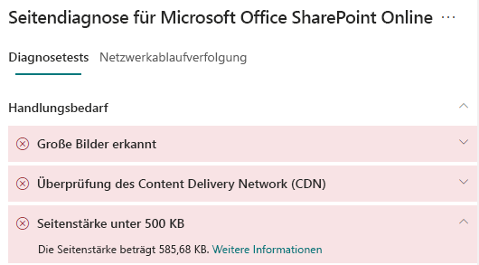

# Optimieren Sie die Seitenstärke von modernen Websiteseiten in SharePoint Online

Die modernen Websiteseiten von SharePoint Online enthalten serialisierten Code, der erforderlich ist, um den Seiteninhalt der Seite darzustellen, einschließlich Bilder, Text, Objekte im Inhaltsbereich unter der Navigations-/Befehlsleiste und anderen HTML-Code, der den Rahmen der Seite bildet. Die Seitenstärke ist eine Maßeinheit für diesen HTML-Code und sollte begrenzt sein, um optimale Seitenladezeiten sicherzustellen.

Dieser Artikel wird Ihnen helfen zu verstehen, wie Sie die Seitenstärke in Ihren modernen Websiteseiten reduzieren können.

>[!NOTE]
>Weitere Informationen zur Leistung in modernen SharePoint Online-Portalen finden Sie unter [Leistung in der modernen SharePoint-Umgebung](https://docs.microsoft.com/sharepoint/modern-experience-performance).

## Verwenden Sie das Tool „Seitendiagnose für SharePoint“, um die Seitenstärke zu analysieren

Das **Tool für die Seitendiagnose für SharePoint** ist eine Browser-Erweiterung für Chrome und [Microsoft Edge Version 77 oder höher](https://www.microsoftedgeinsider.com/download?form=MI13E8&OCID=MI13E8), mit denen Sie SharePoint sowohl moderne als auch klassische Veröffentlichungswebsiteseiten analysieren können. Das Tool stellt für jede analysierte Seite einen Bericht bereit, in dem die Leistung der Seite anhand einer definierten Gruppe von Leistungskriterien dargestellt wird. Um das Tool für die Seitendiagnose für SharePoint zu installieren und kennenzulernen, besuchen Sie das [Tool Seitendiagnose für SharePoint Online verwenden](page-diagnostics-for-spo.md).

Wenn Sie eine SharePoint-Websiteseite mit dem Tool für die Seitendiagnose für SharePoint analysieren, sehen Sie Informationen über die Seite im Ergebnis **Seitenstärke unter 500 KB** des Bereichs _Diagnosetests_. Das Ergebnis wird grün angezeigt, wenn die Seitenstärke unter dem Basiswert liegt, und rot, wenn die Seitenstärke den Basiswert überschreitet.

Mögliche Ergebnisse beinhalten:

- **Aufmerksamkeit erforderlich** (rot): Die Seitenstärke überschreitet 500 KB
- **Keine Aktion erforderlich** (grün): Die Seitenstärke liegt unter 500 KB

Wenn das Ergebnis **Seitenstärke unter 500 KB** im Abschnitt **Aufmerksamkeit erforderlich** angezeigt wird, können Sie auf das Ergebnis klicken, um Details anzuzeigen.

## Beheben von Problemen mit der Seitenstärke

Wenn die Seitenstärke 500 KB überschreitet, können Sie die Gesamtladezeit der Seite verbessern, indem Sie die Anzahl der Webparts reduzieren und den Seiteninhalt auf ein angemessenes Maß beschränken.

Allgemeine Anleitungen zum Reduzieren der Seitenstärke umfassen:

- Beschränken Sie den Seiteninhalt auf eine angemessene Menge und verwenden Sie mehrere Seiten für verwandte Inhalte.
- Minimieren Sie den Einsatz von Webparts mit großen Eigenschaftenbehälter.
- Verwenden Sie nach Möglichkeit nicht interaktive Rollup-Ansichten.
- Optimieren Sie die Bildgrößen, indem Sie die Bilder entsprechend dimensionieren, komprimierte Bildformate verwenden und sicherstellen, dass sie von einem CDN heruntergeladen werden.

Weitere Anleitungen zum Einschränken der Seitenstärke finden Sie im folgenden Artikel:

- [Optimieren der Seitenleistung in SharePoint](https://docs.microsoft.com/sharepoint/dev/general-development/optimize-page-performance-in-sharepoint)

Bevor Sie Seitenrevisionen zur Behebung von Leistungsproblemen durchführen, notieren Sie sich die Ladezeit der Seite in den Analyseergebnissen. Führen Sie das Tool nach Ihrer Revision erneut aus, um zu sehen, ob das neue Ergebnis innerhalb des Grenzwertes liegt, und überprüfen Sie die Ladezeit der neuen Seite, um festzustellen, ob eine Verbesserung vorliegt.

>[!NOTE]
>Die Seitenladezeit kann aufgrund einer Vielzahl von Faktoren wie Netzwerklast, Tageszeit und anderen vorübergehenden Schwierigkeiten variieren. Sie sollten die Seitenladezeit einige Male vor und nach der Durchführung von Änderungen testen, um einen Mittelwert zu berechnen.

## Verwandte Themen

[Optimieren der Leistung von SharePoint Online](tune-sharepoint-online-performance.md)

[Optimieren der Leistung von Office 365](tune-office-365-performance.md)

[Leistung in der modernen SharePoint-Oberfläche](https://docs.microsoft.com/sharepoint/modern-experience-performance)

[Netzwerke für die Inhaltsübermittlung](content-delivery-networks.md)

[Verwenden des Office 365 Content Delivery Network (CDN) mit SharePoint Online](use-office-365-cdn-with-spo.md)
