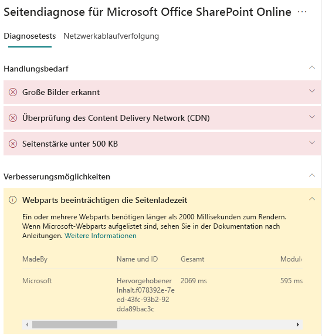

# Optimieren der Leistung von Webparts in modernen SharePoint Online-WebsitesOptimize web part performance in SharePoint Online modern site pages

Die Seiten von modernen SharePoint Online-Website enthalten Webparts, die sich auf die allgemeinen Seitenladezeiten auswirken können.SharePoint Online modern site pages contain web parts that can contribute to overall page load times. In diesem Artikel erfahren Sie, wie Sie die Auswirkungen von Webparts auf Ihren Seiten auf die vom Benutzer empfundene Latenz bestimmen und häufig auftretende Probleme beheben können.This article will help you understand how to determine how web parts in your pages affect user perceived latency, and how to remediate common issues.

>[!NOTE]
>Weitere Informationen zur Leistung in modernen SharePoint Online-Portalen finden Sie unter [Leistung in der modernen SharePoint-Umgebung](https://docs.microsoft.com/sharepoint/modern-experience-performance).For more information about performance in SharePoint Online modern portals, see [Performance in the modern SharePoint experience](https://docs.microsoft.com/sharepoint/modern-experience-performance).

## Verwenden des Tools "Seitendiagnose für SharePoint" zum Analysieren von WebpartsUse the Page Diagnostics for SharePoint tool to analyze web parts

Das **Tool "Seitendiagnose für SharePoint"** ist eine Browsererweiterung für Chrome und [Microsoft Edge ab Version 77](https://www.microsoftedgeinsider.com/download?form=MI13E8&OCID=MI13E8), mit der Sie Seiten in modernen und klassischen SharePoint-Veröffentlichungswebsites analysieren können.The **Page Diagnostics for SharePoint tool** is a browser extension for Chrome and [Microsoft Edge version 77 or later](https://www.microsoftedgeinsider.com/download?form=MI13E8&OCID=MI13E8) you can use to analyze SharePoint both modern and classic publishing site pages. Das Tool stellt für jede analysierte Seite einen Bericht bereit, in dem die Leistung der Seite anhand einer definierten Gruppe von Leistungskriterien dargestellt wird.The tool provides a report for each analyzed page showing how the page performs against a defined set of performance criteria. Wenn Sie das Tool "Seitendiagnose für SharePoint" installieren und mehr darüber erfahren möchten, besuchen Sie [Verwenden des Seitendiagnose-Tools für SharePoint Online](page-diagnostics-for-spo.md).To install and learn about the Page Diagnostics for SharePoint tool, visit [Use the Page Diagnostics tool for SharePoint Online](page-diagnostics-for-spo.md).

Wenn Sie eine Seite einer SharePoint-Website mit dem Tool "Seitendiagnose für SharePoint" analysieren, werden im Ergebnis **Webparts, die sich auf die Seitenladezeit auswirken** im Bereich _Diagnosetests_ Informationen über Webparts angezeigt, die die Baselinemetrik überschreiten.When you analyze a SharePoint site page with the Page Diagnostics for SharePoint tool, you can see information about web parts that exceed the baseline metric in the **Web parts are impacting page load time** result in the _Diagnostic tests_ pane.

Mögliche Ergebnisse sind:Possible results include:

- **Handlungsbedarf** (rot): Ein _benutzerdefiniertes_ Webpart, bei dem der Ladevorgang länger als **zwei** Sekunden dauert.**Attention required** (red): Any _custom_ web part that takes longer than **two** seconds to load. Die in den Testergebnissen angezeigte Gesamtladezeit wird nach "Modul laden", "Lazy Load", "Initialisieren" und "Rendern" unterteilt.Total load time as displayed in test results is broken down by module load, lazy load, init and render.
- **Verbesserung möglich** (gelb): Elemente, die sich möglicherweise auf die Seitenladezeit auswirken, werden in diesem Abschnitt angezeigt und sollten überprüft und überwacht werden.**Improvement opportunities** (yellow): Items that may be impacting page load time are shown in this section and should be reviewed and monitored. Dazu können Microsoft-"Out-of-Box"-Webparts (OOTB) gehören.This may include "out of the box" (OOTB) Microsoft web parts. Die Ergebnisse für alle in diesem Abschnitt angezeigten Microsoft-Webparts werden automatisch an Microsoft gemeldet, daher **sind keine Maßnahmen erforderlich**.Results for any Microsoft web parts shown in this section are automatically reported to Microsoft, so **no action is required**. Sie sollten nur dann ein Supportticket für die Untersuchung öffnen, wenn die Leistung auf der Seite sehr schlecht ist und **alle Microsoft-Webparts** auf der Seite in den Ergebnissen im Abschnitt **Verbesserung möglich** angezeigt werden.You should only log a support ticket for investigation if you are experiencing very slow performance on the page and **all Microsoft web parts** on the page appear in the results in the **Improvement opportunities** section. Beachten Sie, dass die Ergebnisse in einem künftigen Update des Seitendiagnosetools auf Grundlage der spezifischen Konfiguration des Microsoft-Webparts weiter aufgeschlüsselt werden.Note that a future Page Diagnostics tool update will further break down the results based on the specific configuration of the Microsoft web part.
- **Keine Aktion erforderlich** (grün): Kein Webpart braucht länger als **zwei** Sekunden, um Daten zurückzugeben.**No action required** (green): No web part is taking longer than **two** seconds to return data.

Wenn das Ergebnis **Webparts, die sich auf die Seitenladezeit auswirken** entweder im Abschnitt **Handlungsbedarf** oder im Abschnitt **Verbesserung möglich** angezeigt wird, klicken Sie auf das Ergebnis, um Details zu den Webparts anzuzeigen, die langsam geladen werden.If the **Web parts are impacting page load time** result appears in either the **Attention required** or **Improvement opportunities** section of the results, click the result to see details about which web parts are loading slowly. Zukünftige Updates des Tools "Seitendiagnose für SharePoint" können Aktualisierungen der Analyseregeln enthalten. Stellen Sie daher sicher, dass Sie immer über die neueste Version des Tools verfügen.Future updates to the Page Diagnostics for SharePoint tool may include updates to analysis rules, so please ensure you always have the latest version of the tool.

Die verfügbaren Informationen in den Ergebnissen umfassen:Information available in the results includes:

- **Erstellt von** zeigt an, ob es sich bei dem Webpart um ein benutzerdefiniertes oder ein Microsoft-OOTB-Webpart handelt.**Made by** shows whether the web part is custom or Microsoft OOTB
- **Name und ID** zeigt identifizierende Informationen an, die Ihnen beim Auffinden des Webparts auf der Seite helfen können.**Name and ID** shows identifying information that can help you find the web part on the page
- **Gesamt** zeigt die Gesamtzeit für das Laden des Webparts an.**Total** shows the total time for the web part to load
- **Modul laden** zeigt die Zeit an, die zum Abrufen und Laden der Webpartkomponenten benötigt wird.**Module Load** shows the time taken to fetch and load the web part components
- **Lazy Load** zeigt die Zeit für das verzögerte Laden von Webparts an, die im Hauptabschnitt der Seite nicht angezeigt werden.**Lazy Load** shows the time for deferred loading of web parts not seen in the main section of the page
- **Initialisieren** zeigt die Zeit an, die für das Initialisieren eines Webparts benötigt wird.**Init** shows the time taken for web part initialization
- **Rendern** zeigt die Zeit an, die das Webpart zum Abrufen und Rendern von Ergebnissen benötigt.**Render** shows the time taken for the web part to fetch and render results

Diese Informationen dienen Designern und Entwicklern zum Beheben von Problemen.This information is provided to help designers and developers troubleshoot issues. Diese Informationen sollten Ihrem Entwurfs- und Entwicklungsteam bereitgestellt werden.This information should be provided to your design and development team.

## Beheben von Problemen mit der Leistung von WebpartsRemediate web part performance issues

Befolgen Sie die Anweisungen in diesem Abschnitt, um Leistungsprobleme mit Webparts zu erkennen und zu beheben, die in den Ergebnissen **Webparts, die sich auf die Seitenladezeit auswirken** angezeigt werden.Follow the guidance in this section to identify and remediate performance issues with web parts listed in the **Web parts are impacting page load time** results.

Es gibt drei Kategorien möglicher Ursachen für eine schlechte Webpartleistung.There are three categories of possible causes for poor web part performance. Verwenden Sie die folgenden Informationen, um zu bestimmen, welche Probleme auf Ihr Szenario zutreffen, und um diese zu beheben.Use the information below to determine which issues apply to your scenario and remediate them.

- Skriptgröße und Abhängigkeiten von WebpartsWeb part script size and dependencies
  - Optimieren des anfänglichen Skripts, mit dem das Hauptszenario für _Nur Ansichtsmodus_ gerendert wird.Optimize the initial script that renders the mainline scenario for _view mode only_.
  - Verschieben Sie die weniger häufigen Szenarien und den Code für den Bearbeitungsmodus (z. B. den Eigenschaftenbereich) mithilfe der _import()_-Anweisung in separate Abschnitte.Move the less frequent scenarios and edit mode code (like the property pane) to separate chunks using the _import()_ statement.
  - Überprüfen Sie die Abhängigkeiten der Datei _package.json_, um sämtlichen ungenutzten Code vollständig zu entfernen.Review dependencies of the _package.json_ file to remove any dead code completely. Verschieben Sie alle nur auf Test/Build-Versionen bezogenen Abhängigkeiten nach "devDependencies".Move any test/build only dependencies to devDependencies.
  - Die Verwendung von Office 365 CDN ist für den optimalen statischen Ressourcendownload erforderlich.Use of the Office 365 CDN is required for optimal static resource download. Öffentliche CDN-Quellen sind für _js/css_-Dateien vorzuziehen.Public CDN origins are preferable for _js/css_ files. Weitere Informationen zur Verwendung von Office 365 CDN finden Sie unter [Verwendung von Office 365 Content Delivery Network (CDN) mit SharePoint Online](use-office-365-cdn-with-spo.md).For more information about using the Office 365 CDN, see [Use the Office 365 Content Delivery Network (CDN) with SharePoint Online](use-office-365-cdn-with-spo.md).
  - Verwenden Sie Frameworks wie _React_ und _Fabric-Importe_, die Bestandteil des SharePoint-Frameworks (SPFx) sind.Reuse frameworks like _React_ and _Fabric imports_ that come as part of the SharePoint Framework (SPFx). Weitere Informationen finden Sie unter [Übersicht über das SharePoint-Framework](https://docs.microsoft.com/sharepoint/dev/spfx/sharepoint-framework-overview).For more information, see [Overview of the SharePoint Framework](https://docs.microsoft.com/sharepoint/dev/spfx/sharepoint-framework-overview).
  - Stellen Sie sicher, dass Sie die neueste Version des SharePoint-Frameworks verwenden, und führen Sie stets Aktualisierungen auf neue Versionen durch, sobald diese verfügbar sind.Ensure that you are using the latest version of the SharePoint Framework, and upgrade to new versions as they become available.
- Datenabruf/-zwischenspeicherungData fetching/caching
  - Wenn sich das Webpart auf zusätzliche Serveraufrufe stützt, um Daten für die Anzeige abzurufen, stellen Sie sicher, dass diese Server-APIs schnell sind und/oder clientseitige Zwischenspeicherung implementieren ( z. B. die Verwendung von _localStorage_ oder _IndexDB_ für größere Datenmengen).If the web part relies on extra server calls to fetch data for display, ensure those server APIs are fast and/or implement client side caching (such as using _localStorage_ or _IndexDB_ for larger sets).
  - Wenn zum Rendern wichtiger Daten mehrere Aufrufe erforderlich sind, sollten Sie die Batchverarbeitung auf dem Server oder andere Methoden zum Konsolidieren von Anforderungen in einen einzigen Anruf erwägen.If multiple calls are required to render critical data, consider batching on the server or other methods of consolidating requests to a single call.
  - Wenn bestimmte Datenelemente eine langsamere API benötigen, für das anfängliche Rendern aber nicht kritisch sind, entkoppeln Sie diese mit einem separaten Aufruf, der nach dem Rendern kritischer Daten ausgeführt wird.Alternatively, if some elements of data require a slower API, but are not critical to initial rendering, decouple these to a separate call that is executed after critical data is rendered.
  - Wenn mehrere Webparts dieselben Daten nutzen, verwenden Sie eine gemeinsame Datenschicht, um doppelte Aufrufe zu vermeiden.If multiple parts use the same data, utilize a common data layer to avoid duplicate calls.
- RenderingzeitRendering time
  - Alle Medienquellen wie Bilder und Videos sollten an die Grenzen des Containers, Geräts und/oder Netzwerks angepasst sein, um das Herunterladen unnötig großer Anlagen zu vermeiden.Any media sources like images and videos should be sized to the limits of the container, device and/or network to avoid downloading unnecessary large assets. Weitere Informationen zu Inhaltsabhängigkeiten finden Sie unter [Verwendung von Office 365 Content Delivery Network (CDN) mit SharePoint Online](use-office-365-cdn-with-spo.md).For more information about content dependencies, see [Use the Office 365 Content Delivery Network (CDN) with SharePoint Online](use-office-365-cdn-with-spo.md).
  - Vermeiden Sie API-Aufrufe, die einen Umbruch, komplexe CSS-Regeln oder komplizierte Animationen verursachen.Avoid API calls that cause re-flow, complex CSS rules or complicated animations. Weitere Informationen finden Sie unter [Minimizing browser reflow](https://developers.google.com/speed/docs/insights/browser-reflow) (Minimieren von Browserumbrüchen).For more information, see [Minimizing browser reflow](https://developers.google.com/speed/docs/insights/browser-reflow).
  - Vermeiden Sie die Verwendung von verketteten Aufgaben mit langen Ausführungszeiten.Avoid use of chained long running tasks. Verteilen Sie Aufgaben mit langen Ausführungszeiten stattdessen auf separate Warteschlangen.Instead, break long running tasks apart into separate queues. Weitere Informationen finden Sie unter [Optimize JavaScript Execution](https://developers.google.com/web/fundamentals/performance/rendering/optimize-javascript-execution) (Optimieren der JavaScript-Ausführung).For more information, see [Optimize JavaScript Execution](https://developers.google.com/web/fundamentals/performance/rendering/optimize-javascript-execution).
  - Reservieren Sie entsprechenden Speicherplatz für asynchrones Rendern von Medien oder visuellen Elementen, um übersprungene Frames und Stottern zu vermeiden (auch als _Jank_ bezeichnet).Reserve corresponding space for asynchronously rendering media or visual elements to avoid skipped frames and stuttering (also known as _jank_).
  - Wenn ein bestimmter Browser ein für das Rendern verwendetes Feature nicht unterstützt, laden Sie ein Polyfill, oder schließen Sie die Ausführung von abhängigem Code aus.If a certain browser doesn't support a feature used in rendering, either load a polyfill or exclude running dependent code. Wenn das Feature nicht kritisch ist, entfernen Sie Ressourcen wie Ereignishandler, um Speicherlecks zu vermeiden.If the feature is not critical, dispose resources such as event handlers to avoid memory leaks.

Bevor Sie Seitenrevisionen zur Behebung von Leistungsproblemen durchführen, notieren Sie sich die Ladezeit der Seite in den Analyseergebnissen.Before you make page revisions to remediate performance issues, make a note of the page load time in the analysis results. Führen Sie das Tool nach Ihrer Revision erneut aus, um zu sehen, ob das neue Ergebnis innerhalb des Grenzwertes liegt, und überprüfen Sie die Ladezeit der neuen Seite, um festzustellen, ob eine Verbesserung vorliegt.Run the tool again after your revision to see if the new result is within the baseline standard, and check the new page load time to see if there was an improvement.

>[!NOTE]
>Die Seitenladezeit kann aufgrund einer Vielzahl von Faktoren wie Netzwerklast, Tageszeit und anderen vorübergehenden Schwierigkeiten variieren.Page load time can vary based on a variety of factors such as network load, time of day, and other transient conditions. Sie sollten die Seitenladezeit einige Male vor und nach der Durchführung von Änderungen testen, um einen Mittelwert zu berechnen.You should test page load time a few times before and after making changes to help you average the results.

## Verwandte ThemenRelated topics

[Optimieren der Leistung von SharePoint OnlineTune SharePoint Online performance](tune-sharepoint-online-performance.md)

[Optimieren der Leistung von Office 365Tune Office 365 performance](tune-office-365-performance.md)

[Leistung in der modernen SharePoint-OberflächePerformance in the modern SharePoint experience](https://docs.microsoft.com/sharepoint/modern-experience-performance)

[Netzwerke für die InhaltsübermittlungContent delivery networks](content-delivery-networks.md)

[Verwenden des Office 365 Content Delivery Network (CDN) mit SharePoint OnlineUse the Office 365 Content Delivery Network (CDN) with SharePoint Online](use-office-365-cdn-with-spo.md)
