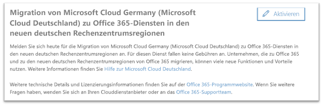

# Anmelden für die Migration von Microsoft Cloud Germany (Microsoft Cloud Deutschland) zu Office 365-Diensten in den neuen deutschen RechenzentrumsregionenHow to opt-In for migration from Microsoft Cloud Germany (Microsoft Cloud Deutschland) to Office 365 services in the new German datacenter regions

>[!Note]
>Dieser Artikel gilt nur für berechtigte Kunden von Microsoft Cloud Germany/Deutschland.This article only applies to eligible Microsoft Cloud Germany/Deutschland customers.
>

## So fordern Sie die Migration anHow to request migration

Für berechtigte Kunden mit in Microsoft Cloud Germany bereitgestellten Diensten wird eine Seite im Microsoft 365 Admin Center angezeigt, über die sich ein Mandantenadministrator des Kunden für die Migration anmelden kann.Eligible customers with service provisioned in Microsoft Cloud Germany will see a page in the Microsoft 365 admin center that will allow a customer tenant administrator to opt-in for migration.

Um auf die Seite im Microsoft 365 Admin Center zuzugreifen, erweitern Sie im Navigationsbereich auf der linken Seite **Einstellungen**, und klicken Sie dann auf **Organisationsprofil**.To access the page in the Microsoft 365 admin center, in the navigation pane on the left, expand **Settings** and then click **Organization Profile**.

Scrollen Sie auf der Seite **Organisationsprofil** nach unten zum Abschnitt **Migration von Microsoft Cloud Germany (Microsoft Cloud Deutschland) zu Office 365-Diensten in den neuen deutschen Rechenzentrumsregionen**.On the **Organization Profile** page, scroll down to the **Migrate from Microsoft Cloud Germany (Microsoft Cloud Deutschland) to Office 365 services in the new German datacenter regions** section.

Wenn Ihre Organisation Ihren Dienst von Microsoft Cloud Germany (Microsoft Cloud Deutschland) zu Office 365-Diensten in den neuen deutschen Rechenzentrumsregionen migrieren möchte, klicken Sie auf **Anmelden**.If your organization wishes to migrate your service from Microsoft Cloud Germany (Microsoft Cloud Deutschland) to Office 365 services in the new German datacenter regions, click **Opt-in**.
 

Auf der rechten Seite des Bildschirms wird ein neuer Abschnitt angezeigt, in dem Sie Ihre Aktivierung bestätigen können.A new section will appear on the right side of your screen to accept your confirmation. Wechseln Sie die Umschaltfläche auf **Ja**, und klicken Sie dann auf **Speichern**.Select the toggle button to **Yes**, and then click **Save**.
 

Sobald ein Administrator im Namen Ihres Mandanten die Aktivierung vorgenommen hat, wird die Bestätigung im Abschnitt **Migration von Microsoft Cloud Germany (Microsoft Cloud Deutschland) zu Office 365-Diensten in den neuen deutschen Rechenzentrumsregionen**, einschließlich des Datums der Anmeldung, angezeigt.Once an administrator has opted-in on behalf of your tenant then all administrators will see the confirmation in **Migrate from Microsoft Cloud Germany (Microsoft Cloud Deutschland) to Office 365 services in the new German datacenter regions** section, including the date of opt-in. Administratoren erhalten außerdem eine Bestätigung im Nachrichtencenter des Microsoft 365 Admin Centers.Administrators will also have a confirmation in Message Center of the Microsoft 365 admin center. 
 

## Was geschieht, nachdem ich die Migration aktiviert habe?What happens after opting-in for migration?

Die Migrationen für Organisationen, die sich für den von Microsoft geleiteten Ansatz anmelden, werden voraussichtlich in 2020 durchgeführt.Migrations are expected to take place in 2020 for organizations that opt-in to the Microsoft-driven approach.  Als Ergebnis der Migration werden die wichtigsten Kundendaten und -abonnements in die neuen deutschen Regionen verschoben.As a result of the migration, core customer data and subscriptions are moved to the new German regions.  Microsoft sendet während des gesamten Migrationsprozesses Updates im Nachrichtencenter.Microsoft will send updates throughout the migration process in Message Center.

## Weitere InformationenMore information

- Hilfe zur Microsoft Cloud Deutschland-Migration Assistance: [https://aka.ms/germanymigrateassist](https://aka.ms/germanymigrateassist)Microsoft Cloud Deutschland Migration Assistance at [https://aka.ms/germanymigrateassist](https://aka.ms/germanymigrateassist)
- Migration von Office 365: [https://aka.ms/office365germanymove](https://aka.ms/office365germanymove)Office 365 migration at [https://aka.ms/office365germanymove](https://aka.ms/office365germanymove)
- Migration von Dynamics 365: [https://aka.ms/d365ceoptin](https://aka.ms/d365ceoptin)Dynamics 365 migration at [https://aka.ms/d365ceoptin](https://aka.ms/d365ceoptin)
- Migration von Power BI: [https://aka.ms/pbioptin](https://aka.ms/pbioptin)Power BI migration at [https://aka.ms/pbioptin](https://aka.ms/pbioptin)
- Übermitteln Sie uns Ihre Fragen über den Link "Benötigen Sie Hilfe?"Submit questions using the “Need Help?” im [Microsoft 365 Admin Center](https://portal.office.de/).link of the [Microsoft 365 admin center](https://portal.office.de/)
