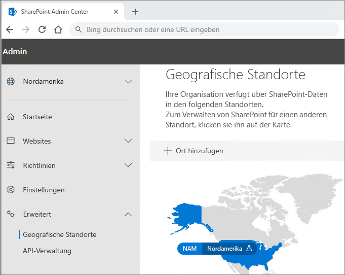

# Office 365 Multi-Geo-Mandantenkonfiguration

Bevor Sie Ihren Mandanten für Office 365 Multi-Geo konfigurieren, stellen Sie sicher, dass Sie [Plan für Office 365 Multi-Geo](plan-for-multi-geo.md) gelesen haben. Um die Schritte in diesem Artikel auszuführen, benötigen Sie eine Liste der geografischen Standorte, die Sie als Satellitenstandorte aktivieren möchten, und der Testbenutzer, die Sie für diese Standorte bereitstellen möchten.

## Hinzufügen des Plans für Multi-Geo-Funktionen in Office 365 zu Ihrem Mandanten

Wenn Sie Office 365 Multi-Geo verwenden möchten, benötigen Sie den Plan _Multi-Geo Capabilities in Office 365_. Arbeiten Sie mit Ihrem Kontoteam, um diesen Plan zu Ihrem Mandanten hinzuzufügen. Ihr Kontoteam setzt Sie mit dem entsprechenden Lizenzierungsexperten in Verbindung und konfiguriert Ihren Mandanten für Sie.

Beachten Sie, dass der Plan für _Multi-Geo-Funktionen in Office 365_ ein Serviceplan auf Benutzerebene ist. Sie benötigen eine Lizenz für jeden Benutzer, der an einem Satellitenstandort gehostet werden soll. Sie können mit der Zeit weitere Lizenzen hinzufügen, wenn Sie Benutzer in Ihrem Satellitenstandort hinzufügen.

Nachdem der Plan _Multi-Geo Capabilities in Office 365_ Ihrem Mandanten bereitgestellt wurde, steht die Registerkarte **Geografische Standorte** im Admin Center von OneDrive sowie SharePoint zur Verfügung.

## Hinzufügen von Satellitenstandorten zu Ihrem Mandanten

Sie müssen für jeden geografischen Standort, an dem Sie Daten speichern möchten, einen Satellitenstandort hinzufügen. In der folgenden Tabelle werden verfügbare geografische Standorte angezeigt:

[!INCLUDE [Office 365 Multi-Geo locations](includes/office-365-multi-geo-locations.md)]

So fügen Sie einen Satellitenstandort hinzu

1. Öffnen Sie das SharePoint Admin Center.

2. Navigieren Sie zu der Registerkarte **Geografische Standorte**.

3. Klicken Sie auf **Ort hinzufügen**.

4. Wählen Sie den Standort aus, den Sie hinzufügen möchten, und klicken Sie auf **Weiter**.

5. Geben Sie die Domäne ein, die Sie mit dem geografischen Standort verwenden möchten, und klicken Sie dann auf **Hinzufügen**.

6. Klicken Sie auf **Schließen**.

Die Bereitstellung kann je nach Größe des Mandanten bis zu 72 Stunden dauern. Sobald die Bereitstellung für einen Satellitenstandort abgeschlossen ist, erhalten Sie eine E-Mail-Bestätigung. Wenn der neue geografische Standort blau auf der Karte auf der Registerkarte **Geografische Standorte** im OneDrive Admin Center angezeigt wird, können Sie mit dem Festlegen der bevorzugten Datenspeicherorte für die Benutzer für diesen geografischen Standort fortfahren. 

> [!IMPORTANT]
> Ihr neuer Satellitenstandort wird mit Standardeinstellungen eingerichtet. Sie können diesen Satellitenstandort entsprechend den lokalen Complianceanforderungen konfigurieren.

## Festlegen des bevorzugten Datenspeicherorts für Benutzer
 

Nachdem Sie die erforderlichen Satellitenstandorte aktiviert haben, können Sie Ihre Benutzerkonten für die Verwendung des bevorzugten Datenspeicherorts aktualisieren. Es wird empfohlen, auch dann einen bevorzugten Datenspeicherort für jeden Benutzer festzulegen, wenn dieser Benutzer am zentralen Datenspeicherort verbleibt.

> [!IMPORTANT]
> Wenn ein Standort, der noch nicht als Satellitenspeicherort oder zentraler Standort konfiguriert wurde, als bevorzugter Datenspeicherort eines Benutzers festgelegt wird, verwendet das System bei der Bereitstellung von OneDrive- und SharePoint-Websites sowie Gruppenpostfächern standardmäßig den zentralen Standort.

> [!TIP]
> Es wird empfohlen, die Prüfungen mit einem Testbenutzer oder einer kleinen Gruppe von Benutzern durchzuführen, bevor die Multi-Geo-Funktionen für Ihre Organisation bereitgestellt werden.

In Azure Active Directory gibt es zwei Arten von Benutzerobjekten: Nur-Cloud-Benutzer und synchronisierte Benutzer. Bitte befolgen Sie die Anweisungen für die entsprechende Benutzerart.

### Synchronisieren des bevorzugten Datenspeicherorts von Benutzen mit Azure Active Directory Connect 

Wenn für Benutzer in Ihrem Unternehmen eine Synchronisierung zwischen dem lokalen Active Directory-System und Azure Active Directory durchgeführt wird, muss PreferredDataLocation in AD aufgefüllt werden und mit AAD synchronisiert werden. Befolgen Sie den Prozess unter [Azure Active Directory Connect-Synchronisierung: Konfigurieren des bevorzugten Datenspeicherorts für Office 365-Ressourcen](/azure/active-directory/hybrid/how-to-connect-sync-feature-preferreddatalocation), um die Synchronisierung der bevorzugten Datenspeicherorte zwischen lokalem Active Directory und Azure Active Directory zu konfigurieren.

Wir empfehlen, die Einstellung des bevorzugten Datenspeicherorts des Benutzers im Rahmen des Standardworkflows für das Erstellen von Benutzern hinzuzufügen.

> [!IMPORTANT]
> Im Falle von Benutzern ohne bereitgestellte OneDrive-Umgebung sollten Sie nach der Synchronisierung des bevorzugten Datenspeicherortes mit Azure Active Directory mindestens 24 Stunden warten, damit die Änderungen in Kraft treten, bevor sich die Benutzer bei OneDrive for Business anmelden. (Durch Festlegen des bevorzugten Datenspeicherorts vor der Anmeldung des Benutzers für die Bereitstellung von OneDrive for Business wird sichergestellt, dass die neue OneDrive-Umgebung an dem richtigen Ort bereitgestellt wird.)

### Festlegen des bevorzugten Datenspeicherorts für Nur-Cloud-Benutzer 

Wenn die Benutzer Ihres Unternehmens über ein lokales Active Directory-System mit Azure Active Directory synchronisiert werden (d. h. wenn sie in Office 365 oder Azure Active Directory erstellt werden), muss der PDL über Azure Active Directory PowerShell festgelegt verwenden.

Für die Vorgehensweisen in diesem Abschnitt ist das [Microsoft Azure Active Directory-Modul für Windows PowerShell](https://www.powershellgallery.com/packages/MSOnline/1.1.166.0) erforderlich. Wenn Azure Active Directory PowerShell bereits installiert ist, stellen Sie sicher, dass Sie ein Update auf die neueste Version durchführen.

1.  Öffnen Sie das Microsoft Azure Active Directory-Modul für Windows PowerShell.

2.  Führen Sie `Connect-MsolService` aus, und geben Sie die Anmeldeinformationen des globalen Administrators für Ihren Mandanten ein.

3.  Verwenden Sie das [Set-MsolUser](https://docs.microsoft.com/powershell/msonline/v1/set-msoluser)-Cmdlet zum Festlegen des bevorzugten Datenspeicherorts für jeden Benutzer. Zum Beispiel:

    `Set-MsolUser -userprincipalName Robyn.Buckley@Contoso.com -PreferredDatalocation EUR`

    Sie können mithilfe des Get-MsolUser-Cmdlets prüfen, ob der bevorzugte Datenspeicherort korrekt festgelegt wurde. Zum Beispiel:

    `(Get-MsolUser -userprincipalName Robyn.Buckley@Contoso.com).PreferredDatalocation`

Wir empfehlen, die Einstellung des bevorzugten Datenspeicherorts von Benutzern im Rahmen des Standardworkflows für das Erstellen von Benutzern vorzunehmen.

> [!IMPORTANT]
> Im Falle von neuen Benutzern ohne bereitgestellte OneDrive-Umgebung sollten Sie nach der Einstellung des bevorzugten Datenspeicherortes mindestens 24 Stunden warten, damit die Änderungen in Kraft treten, bevor sich die Benutzer bei OneDrive for Business anmelden. (Durch Festlegen des bevorzugten Datenspeicherorts vor der Anmeldung des Benutzers für die Bereitstellung von OneDrive for Business wird sichergestellt, dass die neue OneDrive-Umgebung an dem richtigen Ort bereitgestellt wird.)

## Bereitstellung von OneDrive und Auswirkungen auf den bevorzugten Datenspeicherort

Wenn für einen Benutzer bereits eine OneDrive-Website im Mandanten erstellt wurde, wird beim Festlegen des bevorzugten Speicherorts die vorhandene OneDrive-Bereitstellung nicht automatisch verschoben. Informationen zum Migrieren der OneDrive-Umgebung eines Benutzers finden Sie unter [Verschieben von One Drive for Business](move-onedrive-between-geo-locations.md). Befolgen Sie die Anweisungen zum Migrieren von OneDrive zwischen geografischen Standorten. (Bitte beachten Sie, dass Exchange-Postfächer automatisch migriert werden, wenn Sie den PDL eines Benutzers festlegen.)

Wenn ein Benutzer nicht über eine OneDrive-Website innerhalb des Mandanten verfügt, wird OneDrive in Übereinstimmung mit den jeweiligen PDL-Einstellungen bereitgestellt, sofern der PDL des Benutzers einem der Satellitenstandorte des Unternehmens entspricht.

## Konfigurieren der Multi-Geo-Suche

Der Multi-Geo-Mandant verfügt über aggregierte Suchfunktionen, mit denen eine Suchabfrage Ergebnisse von allen Orten innerhalb des Mandanten zurückgibt.

Standardmäßig geben Suchen von diesen Einstiegspunkten aggregierte Ergebnisse zurück, auch wenn sich jeder Suchindex an dem jeweiligen relevanten geografischen Standort befindet:

- OneDrive for Business

- Delve

- SharePoint-Homepage

- Suchcenter

Darüber hinaus können Multi-Geo-Suchfunktionen für Ihre benutzerdefinierte Suchanwendung konfiguriert werden, die die SharePoint-Suche-API verwendet.

Anweisungen, einschließlich Einschränkungen und Unterschiede, finden Sie unter [Konfigurieren der Suche für Multi-Geo in OneDrive for Business](configure-search-for-multi-geo.md).

## Überprüfen der Office 365 Multi-Geo-Konfiguration

Im Folgenden finden Sie einige grundlegende Anwendungsfälle, in denen eine Überprüfung vor dem Rollout von Office 365 Multi-Geo im Unternehmen möglicherweise sinnvoll ist. Nach Abschluss dieser Tests und zusätzlicher Anwendungsfälle, die für Ihr Unternehmen relevant sind, können Sie der ursprünglichen Pilotgruppe bei Bedarf weitere Benutzer hinzufügen.

**OneDrive for Business**

Wählen Sie OneDrive im Office 365-Startprogramm aus und bestätigen Sie, dass Sie automatisch an den entsprechenden geografischen Standort des Benutzers (gemäß dessen PDL) weitergeleitet werden. OneDrive for Business sollte jetzt an diesem Standort bereitgestellt werden. Versuchen Sie nach der Bereitstellung, einige Dokumente hoch- und herunterzuladen.

**Mobile OneDrive-App**

Melden Sie sich bei Ihrer mobilen OneDrive-App mit den Anmeldeinformationen Ihres Testkontos an. Stellen Sie sicher, dass Ihre OneDrive for Business-Dateien angezeigt werden und mit denjenigen auf Ihrem Mobilgerät interagieren können.

**OneDrive-Synchronisierungsclient**

Vergewissern Sie sich, dass der OneDrive-Synchronisierungsclient den geografischen Standort für OneDrive for Business nach Anmeldung automatisch erkennt. Wenn Sie den Synchronisierungsclient herunterladen müssen, klicken Sie in der OneDrive-Bibliothek auf **Synchronisieren**.

**Office-Anwendungen**

Vergewissern Sie sich, dass Sie auf OneDrive for Business zugreifen können, indem Sie sich von einer Office-Anwendung wie Word aus anmelden. Öffnen Sie die Office-Anwendung, und wählen Sie „OneDrive – <TenantName>„. Office erkennt Ihren OneDrive-Ort und zeigt die Dateien, die Sie öffnen können.

**Freigabe**

Testen Sie die Freigabe von OneDrive-Dateien. Vergewissern Sie sich, dass die Personenauswahl alle SharePoint-Onlinebenutzer unabhängig vom geografischen Standort anzeigt.
