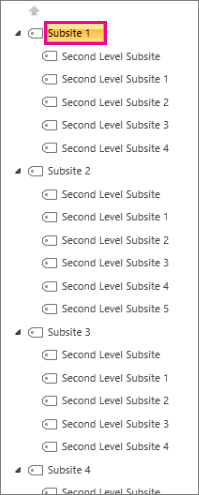
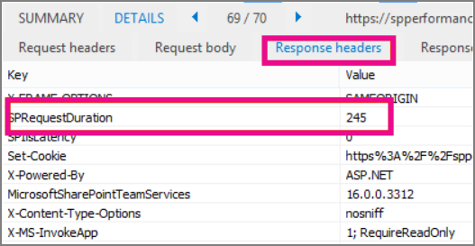

# <a name="navigation-options-for-sharepoint-online"></a><span data-ttu-id="0626b-105">Navigationsoptionen für SharePoint Online</span><span class="sxs-lookup"><span data-stu-id="0626b-105">Navigation options for SharePoint Online</span></span>

<span data-ttu-id="0626b-106">In diesem Artikel werden Navigations Options Websites mit aktivierter SharePoint-Veröffentlichung in SharePoint Online beschrieben.</span><span class="sxs-lookup"><span data-stu-id="0626b-106">This article describes navigation options sites with SharePoint Publishing enabled in SharePoint Online.</span></span> <span data-ttu-id="0626b-107">Die Auswahl und Konfiguration der Navigation wirkt sich erheblich auf die Leistung und Skalierbarkeit von Websites in SharePoint Online aus.</span><span class="sxs-lookup"><span data-stu-id="0626b-107">The choice and configuration of navigation significantly impacts the performance and scalability of sites in SharePoint Online.</span></span>

## <a name="overview"></a><span data-ttu-id="0626b-108">Übersicht</span><span class="sxs-lookup"><span data-stu-id="0626b-108">Overview</span></span>

<span data-ttu-id="0626b-109">Die Konfiguration des Navigations Anbieters kann die Leistung für den gesamten Standort erheblich beeinträchtigen, und es ist sorgfältig darauf zu achten, dass Sie einen Navigationsanbieter und eine Konfiguration auswählen, die für die Anforderungen einer SharePoint-Website effektiv skaliert wird.</span><span class="sxs-lookup"><span data-stu-id="0626b-109">Navigation provider configuration can significantly impact performance for the entire site, and careful consideration must be taken to pick a navigation provider and configuration that scales effectively for the requirements of a SharePoint site.</span></span> <span data-ttu-id="0626b-110">Es gibt zwei out-of-the-Box-Navigationsanbieter sowie benutzerdefinierte Navigations Implementierungen.</span><span class="sxs-lookup"><span data-stu-id="0626b-110">There are two out-of-the-box navigation providers, as well as custom navigation implementations.</span></span>

<span data-ttu-id="0626b-111">Die erste Option, [**verwaltete (Metadaten) Navigation**](#using-managed-navigation-and-metadata-in-sharepoint-online), wird empfohlen und ist eine der Standardoptionen in SharePoint Online; Es wird jedoch empfohlen, die Einschränkung der Sicherheit zu deaktivieren, sofern nicht erforderlich.</span><span class="sxs-lookup"><span data-stu-id="0626b-111">The first option, [**Managed (Metadata) navigation**](#using-managed-navigation-and-metadata-in-sharepoint-online), is recommended, and is one of the default options in SharePoint Online; however, we recommend that security trimming be disabled unless required.</span></span> <span data-ttu-id="0626b-112">Das Trimmen von Sicherheitsgründen ist als sichere Standardeinstellung für diesen Navigationsanbieter aktiviert. für viele Websites ist jedoch der Aufwand der Sicherheits Kürzung nicht erforderlich, da Navigationselemente häufig für alle Benutzer der Website konsistent sind.</span><span class="sxs-lookup"><span data-stu-id="0626b-112">Security trimming is enabled as a secure-by-default setting for this navigation provider; however, many sites do not require the overhead of security trimming since navigation elements often are consistent for all users of the site.</span></span> <span data-ttu-id="0626b-113">Mit der empfohlenen Konfiguration zum Deaktivieren der Einschränkung der Sicherheit erfordert dieser Navigationsanbieter keine Aufzählung der Websitestruktur und ist hochgradig skalierbar mit akzeptabler Leistungsbeeinträchtigung.</span><span class="sxs-lookup"><span data-stu-id="0626b-113">With the recommended configuration to disable security trimming, this navigation provider does not require enumerating site structure and is highly scalable with acceptable performance impact.</span></span>

<span data-ttu-id="0626b-114">Die zweite Option, die [**strukturelle Navigation**](#using-structural-navigation-in-sharepoint-online), **ist in SharePoint Online keine empfohlene Navigationsoption**.</span><span class="sxs-lookup"><span data-stu-id="0626b-114">The second option, [**Structural navigation**](#using-structural-navigation-in-sharepoint-online), **is NOT a recommended navigation option in SharePoint Online**.</span></span> <span data-ttu-id="0626b-115">Dieser Navigationsanbieter wurde für eine lokale Topologie entwickelt und hat in SharePoint Online nur eine beschränkte Unterstützung.</span><span class="sxs-lookup"><span data-stu-id="0626b-115">This navigation provider was designed for an on-premises topology has limited support in SharePoint Online.</span></span> <span data-ttu-id="0626b-116">Zwar bietet es einige zusätzliche Funktionen im Vergleich zu anderen Navigationsoptionen, aber diese Features, einschließlich Sicherheits Kürzung und Aufzählung der Websitestruktur, sind kostenintensiver Serveraufrufe und haben Auswirkungen auf die Skalierbarkeit und Leistung bei der Verwendung.</span><span class="sxs-lookup"><span data-stu-id="0626b-116">While it provides some additional set of capabilities versus other navigation options, these features, including security trimming and site structure enumeration, comes at a cost of excessive server calls and impacts scalability and performance when it is used.</span></span> <span data-ttu-id="0626b-117">Websites, die eine strukturierte Navigation verwenden und übermäßige Ressourcen verbrauchen, unterliegen möglicherweise einer Einschränkung.</span><span class="sxs-lookup"><span data-stu-id="0626b-117">Sites using structured navigation that consume excessive resources may be subject to throttling.</span></span>

<span data-ttu-id="0626b-118">Neben den standardmäßigen Navigations Anbietern haben viele Kunden erfolgreich Alternative benutzerdefinierte Navigations Implementierungen implementiert.</span><span class="sxs-lookup"><span data-stu-id="0626b-118">In addition to the out-of-the-box navigation providers, many customers have successfully implemented alternative custom navigation implementations.</span></span> <span data-ttu-id="0626b-119">Eine allgemeine Klasse von Implementierungen für benutzerdefinierte Navigation umfasst Client gerenderte Entwurfsmuster, die einen lokalen Cache von Navigationsknoten speichern.</span><span class="sxs-lookup"><span data-stu-id="0626b-119">One common class of custom navigation implementations embraces client-rendered design patterns that store a local cache of navigation nodes.</span></span> <span data-ttu-id="0626b-120">(Weitere Informationen finden Sie in diesem Artikel unter **[Such gesteuerte clientseitige Skripts](#using-search-driven-client-side-scripting)** .)</span><span class="sxs-lookup"><span data-stu-id="0626b-120">(See **[Search-driven client-side scripting](#using-search-driven-client-side-scripting)** in this article.)</span></span>

<span data-ttu-id="0626b-121">Diese Navigationsanbieter haben einige wichtige Vorteile:</span><span class="sxs-lookup"><span data-stu-id="0626b-121">These navigation providers have a couple of key advantages:</span></span> 
- <span data-ttu-id="0626b-122">Sie funktionieren im Allgemeinen gut mit reaktionsschnellen Seitendesigns.</span><span class="sxs-lookup"><span data-stu-id="0626b-122">They generally work well with responsive page designs.</span></span>
- <span data-ttu-id="0626b-123">Sie sind extrem skalierbar und leistungsfähig, da Sie ohne Ressourcenkosten Rendern können (und nach einem Timeout im Hintergrund aktualisieren).</span><span class="sxs-lookup"><span data-stu-id="0626b-123">They are extremely scalable and performant because they can render with no resource cost (and refresh in the background after a timeout).</span></span> 
- <span data-ttu-id="0626b-124">Diese Navigationsanbieter können Navigationsdaten mithilfe verschiedener Strategien abrufen, von einfachen statischen Konfigurationen bis hin zu verschiedenen dynamischen Datenanbietern.</span><span class="sxs-lookup"><span data-stu-id="0626b-124">These navigation providers can retrieve navigation data using various strategies, ranging from simple static configurations to various dynamic data providers.</span></span> 

<span data-ttu-id="0626b-125">Ein Beispiel für einen Datenanbieter ist die Verwendung einer **Such gesteuerten Navigation**, die Flexibilität beim Aufzählen von Navigationsknoten und der effizienten Handhabung von Sicherheits Trimmungen ermöglicht.</span><span class="sxs-lookup"><span data-stu-id="0626b-125">An example of a data provider is to use a **Search-driven navigation**, which allows flexibility for enumerating navigation nodes and handling security trimming efficiently.</span></span> 

<span data-ttu-id="0626b-126">Es gibt andere beliebte Optionen zum Erstellen **benutzerdefinierter Navigationsanbieter**.</span><span class="sxs-lookup"><span data-stu-id="0626b-126">There are other popular options to build **Custom navigation providers**.</span></span> <span data-ttu-id="0626b-127">Weitere Anleitungen zum Erstellen eines benutzerdefinierten Navigations Anbieters finden Sie unter [Navigationslösungen für SharePoint Online-Portale](https://docs.microsoft.com/sharepoint/dev/solution-guidance/portal-navigation) .</span><span class="sxs-lookup"><span data-stu-id="0626b-127">Please review [Navigation solutions for SharePoint Online portals](https://docs.microsoft.com/sharepoint/dev/solution-guidance/portal-navigation) for further guidance on building a Custom navigation provider.</span></span>
  
## <a name="pros-and-cons-of-sharepoint-online-navigation-options"></a><span data-ttu-id="0626b-128">Vorteile und Nachteile von SharePoint Online Navigationsoptionen</span><span class="sxs-lookup"><span data-stu-id="0626b-128">Pros and Cons of SharePoint Online navigation options</span></span>

<span data-ttu-id="0626b-129">In der folgenden Tabelle sind die vor-und Nachteile der einzelnen Optionen zusammengefasst.</span><span class="sxs-lookup"><span data-stu-id="0626b-129">The following table summarizes the pros and cons of each option.</span></span> 


|<span data-ttu-id="0626b-130">Verwaltete Navigation</span><span class="sxs-lookup"><span data-stu-id="0626b-130">Managed navigation</span></span>  |<span data-ttu-id="0626b-131">Strukturelle Navigation</span><span class="sxs-lookup"><span data-stu-id="0626b-131">Structural navigation</span></span>  |<span data-ttu-id="0626b-132">Such gesteuerte Navigation</span><span class="sxs-lookup"><span data-stu-id="0626b-132">Search-driven navigation</span></span>  |<span data-ttu-id="0626b-133">Benutzerdefinierter Navigationsanbieter</span><span class="sxs-lookup"><span data-stu-id="0626b-133">Custom-navigation provider</span></span>  |
|---------|---------|---------|---------|
|<span data-ttu-id="0626b-134">Experten</span><span class="sxs-lookup"><span data-stu-id="0626b-134">Pros:</span></span><br/><br/><span data-ttu-id="0626b-135">Einfache Wartung</span><span class="sxs-lookup"><span data-stu-id="0626b-135">Easy to maintain</span></span><br/><span data-ttu-id="0626b-136">Empfohlene Option</span><span class="sxs-lookup"><span data-stu-id="0626b-136">Recommended option</span></span><br/>     |<span data-ttu-id="0626b-137">Experten</span><span class="sxs-lookup"><span data-stu-id="0626b-137">Pros:</span></span><br/><br/><span data-ttu-id="0626b-138">Einfache Konfiguration</span><span class="sxs-lookup"><span data-stu-id="0626b-138">Easy to configure</span></span><br/><span data-ttu-id="0626b-139">Getrimmte Sicherheit</span><span class="sxs-lookup"><span data-stu-id="0626b-139">Security trimmed</span></span><br/><span data-ttu-id="0626b-140">Automatisch aktualisieren, wenn Inhalte hinzugefügt werden</span><span class="sxs-lookup"><span data-stu-id="0626b-140">Automatically updates as content is added</span></span><br/>|<span data-ttu-id="0626b-141">Experten</span><span class="sxs-lookup"><span data-stu-id="0626b-141">Pros:</span></span><br/><br/><span data-ttu-id="0626b-142">Getrimmte Sicherheit</span><span class="sxs-lookup"><span data-stu-id="0626b-142">Security trimmed</span></span><br/><span data-ttu-id="0626b-143">Automatisch aktualisieren, wenn Websites hinzugefügt werden</span><span class="sxs-lookup"><span data-stu-id="0626b-143">Automatically updates as sites are added</span></span><br/><span data-ttu-id="0626b-144">Schnelle Ladezeit und lokal zwischengespeicherte Navigationsstruktur</span><span class="sxs-lookup"><span data-stu-id="0626b-144">Fast loading time and locally cached navigation structure</span></span><br/>|<span data-ttu-id="0626b-145">Experten</span><span class="sxs-lookup"><span data-stu-id="0626b-145">Pros:</span></span><br/><br/><span data-ttu-id="0626b-146">Breitere Auswahl von verfügbaren Optionen</span><span class="sxs-lookup"><span data-stu-id="0626b-146">Wider choice of options available</span></span><br/><span data-ttu-id="0626b-147">Schnelles Laden, wenn die Zwischenspeicherung ordnungsgemäß verwendet wird</span><span class="sxs-lookup"><span data-stu-id="0626b-147">Fast loading when caching is used correctly</span></span><br/><span data-ttu-id="0626b-148">Viele Optionen funktionieren mit dem reaktionsschnellen Seitenentwurf gut</span><span class="sxs-lookup"><span data-stu-id="0626b-148">Many options work well with responsive page design</span></span><br/>|
|<span data-ttu-id="0626b-149">Nachteile</span><span class="sxs-lookup"><span data-stu-id="0626b-149">Cons:</span></span><br/><br/><span data-ttu-id="0626b-150">Nicht automatisch aktualisiert, um die Websitestruktur widerzuspiegeln</span><span class="sxs-lookup"><span data-stu-id="0626b-150">Not automatically updated to reflect site structure</span></span><br/><span data-ttu-id="0626b-151">Auswirkungen auf die Leistung, wenn Sicherheits Kürzung aktiviert ist</span><span class="sxs-lookup"><span data-stu-id="0626b-151">Impacts performance if security trimming is enabled</span></span><br/>|<span data-ttu-id="0626b-152">Nachteile</span><span class="sxs-lookup"><span data-stu-id="0626b-152">Cons:</span></span><br/><br/><span data-ttu-id="0626b-153">**Nicht empfohlen**</span><span class="sxs-lookup"><span data-stu-id="0626b-153">**Not recommended**</span></span><br/><span data-ttu-id="0626b-154">**Auswirkungen auf Leistung und Skalierbarkeit**</span><span class="sxs-lookup"><span data-stu-id="0626b-154">**Impacts performance and scalability**</span></span><br/><span data-ttu-id="0626b-155">**Einschränkungen unterliegen**</span><span class="sxs-lookup"><span data-stu-id="0626b-155">**Subject to throttling**</span></span><br/>|<span data-ttu-id="0626b-156">Nachteile</span><span class="sxs-lookup"><span data-stu-id="0626b-156">Cons:</span></span><br/><br/><span data-ttu-id="0626b-157">Keine Möglichkeit, Websites problemlos zu bestellen</span><span class="sxs-lookup"><span data-stu-id="0626b-157">No ability to easily order sites</span></span><br/><span data-ttu-id="0626b-158">Erfordert die Anpassung der Gestaltungsvorlage (erforderliche technische Kenntnisse)</span><span class="sxs-lookup"><span data-stu-id="0626b-158">Requires customization of the master page (technical skills required)</span></span><br/>|<span data-ttu-id="0626b-159">Nachteile</span><span class="sxs-lookup"><span data-stu-id="0626b-159">Cons:</span></span><br/><br/><span data-ttu-id="0626b-160">Benutzerdefinierte Entwicklung ist erforderlich</span><span class="sxs-lookup"><span data-stu-id="0626b-160">Custom development is required</span></span><br/><span data-ttu-id="0626b-161">Externe Datenquelle/Cachespeicherung erforderlich, beispielsweise Azure</span><span class="sxs-lookup"><span data-stu-id="0626b-161">External data source / cache stored is needed e.g. Azure</span></span><br/>|

<span data-ttu-id="0626b-162">Die am besten geeignete Option für Ihre Website hängt von den Anforderungen Ihrer Website und ihrer technischen Leistungsfähigkeit ab.</span><span class="sxs-lookup"><span data-stu-id="0626b-162">The most appropriate option for your site will depend on your site requirements and on your technical capability.</span></span> <span data-ttu-id="0626b-163">Wenn Sie einen skalierbaren Out-of-the-Box-Navigationsanbieter benötigen, ist die verwaltete Navigation mit deaktivierter Sicherheits Kürzung eine sehr gute Option.</span><span class="sxs-lookup"><span data-stu-id="0626b-163">If you want a scalable out-of-the-box navigation provider, then Managed navigation with security trimming disabled is a very good option.</span></span>

<span data-ttu-id="0626b-164">Die Option "verwaltete Navigation" kann über die Konfiguration verwaltet werden, umfasst keine Code Anpassungsdateien und ist wesentlich schneller als die strukturelle Navigation.</span><span class="sxs-lookup"><span data-stu-id="0626b-164">The Managed navigation option can be maintained through configuration, does not involve code customization files, and it is significantly faster than structural navigation.</span></span> <span data-ttu-id="0626b-165">Wenn Sie eine Sicherheits Kürzung benötigen und mit einer benutzerdefinierten Gestaltungsvorlage vertraut sind und die Möglichkeit haben, die Änderungen beizubehalten, die in der standardgestaltungsvorlage für SharePoint Online auftreten können, kann die Such gesteuerte Option eine bessere Benutzeroberfläche.</span><span class="sxs-lookup"><span data-stu-id="0626b-165">If you require security trimming and are comfortable using a custom master page and have some capability in the organization to maintain the changes that may occur in the default master page for SharePoint Online, then the Search-driven option may produce a better user experience.</span></span> <span data-ttu-id="0626b-166">Wenn Sie komplexere Anforderungen haben, ist möglicherweise ein benutzerdefinierter Navigationsanbieter die richtige Wahl.</span><span class="sxs-lookup"><span data-stu-id="0626b-166">If you have more complex requirements, then a custom navigation provider may be the right choice.</span></span> <span data-ttu-id="0626b-167">Die strukturelle Navigation wird nicht empfohlen.</span><span class="sxs-lookup"><span data-stu-id="0626b-167">Structural navigation is NOT recommended.</span></span>

<span data-ttu-id="0626b-168">Schließlich ist es wichtig zu beachten, dass SharePoint zusätzliche Navigationsanbieter und Funktionen für moderne SharePoint-Website Architekturen hinzufügen, die eine vereinfachte Websitehierarchie und ein Hub-and-Spoke-Modell mit SharePoint-Hub-Websites nutzen.</span><span class="sxs-lookup"><span data-stu-id="0626b-168">Finally, it’s important to note that SharePoint is adding additional navigation providers and functionality for modern SharePoint site architectures leveraging a more flattened site hierarchy and a hub-and-spoke model with SharePoint hub sites.</span></span> <span data-ttu-id="0626b-169">Auf diese Weise können viele Szenarien erreicht werden, für die die Verwendung des SharePoint-Veröffentlichungsfeatures nicht erforderlich ist, und diese Navigations Konfigurationen sind für die Skalierbarkeit und Latenz in SharePoint Online optimiert.</span><span class="sxs-lookup"><span data-stu-id="0626b-169">This allows many scenarios to be achieved that do NOT require the use of SharePoint Publishing feature, and these navigation configurations are optimized for scalability and latency within SharePoint Online.</span></span> <span data-ttu-id="0626b-170">Beachten Sie, dass die Anwendung des gleichen Prinzips-das Vereinfachen der Gesamtstruktur Ihrer SharePoint-Veröffentlichungswebsite auf eine flache Struktur-häufig auch die Gesamtleistung und die Skalierung unterstützt.</span><span class="sxs-lookup"><span data-stu-id="0626b-170">Note that applying the same principle - simplifying the overall structure of your SharePoint Publishing site to a flatter structure, often helps with overall performance and scale as well.</span></span> <span data-ttu-id="0626b-171">Dies bedeutet, dass statt einer einzelnen Websitesammlung mit Hunderten von Websites (Unterwebs) ein besserer Ansatz darin besteht, viele Websitesammlungen mit sehr wenigen Unterwebsites (Unterwebs) zu haben.</span><span class="sxs-lookup"><span data-stu-id="0626b-171">What this means is that instead of having a single Site Collection with hundreds of sites (subwebs), a better approach is to have many site collections with very few subsites (subwebs).</span></span>


## <a name="using-managed-navigation-and-metadata-in-sharepoint-online"></a><span data-ttu-id="0626b-172">Verwenden der verwalteten Navigation und der Metadaten in SharePoint Online</span><span class="sxs-lookup"><span data-stu-id="0626b-172">Using managed navigation and metadata in SharePoint Online</span></span>

<span data-ttu-id="0626b-173">Die verwaltete Navigation ist eine weitere out-of-the-Box-Option, die Sie verwenden können, um die meisten der gleichen Funktionen wie die strukturelle Navigation neu zu erstellen.</span><span class="sxs-lookup"><span data-stu-id="0626b-173">Managed navigation is another out-of-the-box option that you can use to recreate most of the same functionality as structural navigation.</span></span> <span data-ttu-id="0626b-174">Verwaltete Metadaten können so konfiguriert werden, dass die Sicherheits Kürzung aktiviert oder deaktiviert wird.</span><span class="sxs-lookup"><span data-stu-id="0626b-174">Managed metadata can be configured to have security trimming enabled or disabled.</span></span> <span data-ttu-id="0626b-175">Bei deaktivierter Sicherheits Kürzung ist die verwaltete Navigation relativ effizient, da alle Navigationslinks mit einer Konstanten Anzahl von Server aufrufen geladen werden.</span><span class="sxs-lookup"><span data-stu-id="0626b-175">When configured with security trimming disabled, managed navigation is fairly efficient as it loads all the navigation links with a constant number of server calls.</span></span> <span data-ttu-id="0626b-176">Durch das Aktivieren der Sicherheits Kürzung werden jedoch einige Vorteile der verwalteten Navigation negiert, und Kunden können sich für eine der benutzerdefinierten Navigationslösungen für eine optimale Leistung und Skalierbarkeit entscheiden.</span><span class="sxs-lookup"><span data-stu-id="0626b-176">Enabling security trimming, however, negates some of the advantages of managed navigation, and customers may choose to explore one of the custom navigation solutions for optimal performance and scalability.</span></span>

<span data-ttu-id="0626b-177">Für viele Websites ist keine Sicherheits Kürzung erforderlich, da die Navigationsstruktur häufig für alle Benutzer der Website konsistent ist.</span><span class="sxs-lookup"><span data-stu-id="0626b-177">Many sites do not require security trimming, as the navigation structure is often consistent for all users of the site.</span></span> <span data-ttu-id="0626b-178">Wenn die Sicherheits Kürzung deaktiviert ist und der Navigation ein Link hinzugefügt wird, auf den nicht alle Benutzer Zugriff haben, wird der Link weiterhin angezeigt, führt jedoch zu einer Meldung mit Zugriff verweigert.</span><span class="sxs-lookup"><span data-stu-id="0626b-178">If security trimming is disabled and a link is added to navigation that not all users have access to, the link will still show but will lead to an access denied message.</span></span> <span data-ttu-id="0626b-179">Es besteht keine Gefahr eines versehentlichen Zugriffs auf den Inhalt.</span><span class="sxs-lookup"><span data-stu-id="0626b-179">There is no risk of inadvertent access to the content.</span></span>

### <a name="how-to-implement-managed-navigation-and-the-results"></a><span data-ttu-id="0626b-180">Implementieren der verwalteten Navigation und der Ergebnisse</span><span class="sxs-lookup"><span data-stu-id="0626b-180">How to implement managed navigation and the results</span></span>

<span data-ttu-id="0626b-181">Es gibt mehrere Artikel über docs.Microsoft.com zu den Details der verwalteten Navigation, beispielsweise unter [Übersicht über die verwaltete Navigation in SharePoint Server](https://docs.microsoft.com/sharepoint/administration/overview-of-managed-navigation).</span><span class="sxs-lookup"><span data-stu-id="0626b-181">There are several articles on Docs.Microsoft.com about the details of managed navigation, for example, see [Overview of managed navigation in SharePoint Server](https://docs.microsoft.com/sharepoint/administration/overview-of-managed-navigation).</span></span>

<span data-ttu-id="0626b-182">Um die verwaltete Navigation zu implementieren, richten Sie Begriffe mit URLs ein, die der Navigationsstruktur der Website entsprechen.</span><span class="sxs-lookup"><span data-stu-id="0626b-182">In order to implement managed navigation, you set up terms with URLs corresponding to the navigation structure of  the site.</span></span> <span data-ttu-id="0626b-183">Die verwaltete Navigation kann sogar manuell kuratiert werden, um die Struktur Navigation in vielen Fällen zu ersetzen.</span><span class="sxs-lookup"><span data-stu-id="0626b-183">Managed navigation can even be manually curated to replace structural navigation in many cases.</span></span> <span data-ttu-id="0626b-184">Beispiel:</span><span class="sxs-lookup"><span data-stu-id="0626b-184">For example:</span></span>



<span data-ttu-id="0626b-186">Im folgenden Beispiel wird die Leistung der komplexen Navigation mithilfe der verwalteten Navigation veranschaulicht.</span><span class="sxs-lookup"><span data-stu-id="0626b-186">The following example shows the performance of the complex navigation using managed navigation.</span></span>


<span data-ttu-id="0626b-188">Die Verwendung der verwalteten Navigation verbessert die Leistung im Vergleich zum Struktur Navigations Ansatz kontinuierlich.</span><span class="sxs-lookup"><span data-stu-id="0626b-188">Using managed navigation consistently improves performance compared to the structural navigation approach.</span></span>
  
## <a name="using-structural-navigation-in-sharepoint-online"></a><span data-ttu-id="0626b-189">Verwenden der Struktur Navigation in SharePoint Online</span><span class="sxs-lookup"><span data-stu-id="0626b-189">Using structural navigation in SharePoint Online</span></span>

<span data-ttu-id="0626b-190">Dies ist die standardmäßig verwendete Navigation, die die einfachste Lösung ist, die jedoch einen kostspieligen Leistungskompromiss aufweist.</span><span class="sxs-lookup"><span data-stu-id="0626b-190">This is the out-of-the-box navigation used by default and is the most straightforward solution but as such has an expensive performance trade-off.</span></span> <span data-ttu-id="0626b-191">Es ist keine Anpassung erforderlich, und ein nicht technischer Benutzer kann auch auf einfache Weise Elemente hinzufügen, Elemente ausblenden und die Navigation auf der Seite "Einstellungen" verwalten.</span><span class="sxs-lookup"><span data-stu-id="0626b-191">It does not require any customization and a non-technical user can also easily add items, hide items, and manage the navigation from the settings page.</span></span> <span data-ttu-id="0626b-192">Dies gilt jedoch auch für die verwaltete Navigation, daher empfiehlt es sich, die verwaltete Navigation zu verwenden, da dies ebenfalls problemlos mit einer verbesserten Leistung verwaltet und gesteuert werden kann.</span><span class="sxs-lookup"><span data-stu-id="0626b-192">This is however also true for Managed Navigation so it is recommended to use Managed Navigation as that can also be easily managed and controlled as well with improved performance.</span></span>


  
### <a name="turning-on-structural-navigation-in-sharepoint-online"></a><span data-ttu-id="0626b-194">Aktivieren der Struktur Navigation in SharePoint Online</span><span class="sxs-lookup"><span data-stu-id="0626b-194">Turning on structural navigation in SharePoint Online</span></span>

<span data-ttu-id="0626b-195">Veranschaulichen Sie, wie die Leistung in einer Standard SharePoint Online Lösung mit Struktur Navigation und der Option Unterwebsites anzeigen aktiviert ist.</span><span class="sxs-lookup"><span data-stu-id="0626b-195">To illustrate how the performance in a standard SharePoint Online solution with structural navigation and the show subsites option turned on.</span></span> <span data-ttu-id="0626b-196">Unten sehen Sie einen Screenshot der Einstellungen, die auf der **Navigations**Seite **Websiteeinstellungen** \> gefunden wurden.</span><span class="sxs-lookup"><span data-stu-id="0626b-196">Below is a screenshot of settings found on the page **Site Settings** \> **Navigation**.</span></span>
  

  
### <a name="analyzing-structural-navigation-performance-in-sharepoint-online"></a><span data-ttu-id="0626b-198">Analysieren der Leistungsfähigkeit der Struktur Navigation in SharePoint Online</span><span class="sxs-lookup"><span data-stu-id="0626b-198">Analyzing structural navigation performance in SharePoint Online</span></span>

<span data-ttu-id="0626b-199">Um die Leistung einer SharePoint-Seite zu analysieren, verwenden Sie die Registerkarte **Netzwerk** der F12-Entwicklertools in Internet Explorer.</span><span class="sxs-lookup"><span data-stu-id="0626b-199">To analyze the performance of a SharePoint page, use the **Network** tab of the F12 developer tools in Internet Explorer.</span></span> 
  

  
1. <span data-ttu-id="0626b-201">Klicken Sie auf der Registerkarte **Netzwerk** auf die ASPX-Seite, die geladen wird, und klicken Sie dann auf die Registerkarte **Details** .</span><span class="sxs-lookup"><span data-stu-id="0626b-201">On the **Network** tab, click on the .aspx page that is being loaded and then click on the **Details** tab.</span></span><br/> <span data-ttu-id="0626b-202"></span><span class="sxs-lookup"><span data-stu-id="0626b-202"></span></span><br/>
2. <span data-ttu-id="0626b-203">Klicken Sie auf **Antwortheader**.</span><span class="sxs-lookup"><span data-stu-id="0626b-203">Click **Response headers**.</span></span> <br/><span data-ttu-id="0626b-204"></span><span class="sxs-lookup"><span data-stu-id="0626b-204"></span></span><br/><span data-ttu-id="0626b-205">SharePoint gibt einige nützliche Diagnoseinformationen in den Antwortheadern zurück.</span><span class="sxs-lookup"><span data-stu-id="0626b-205">SharePoint returns some useful diagnostic information in its response headers.</span></span> 
3. <span data-ttu-id="0626b-206">Einer der nützlichsten Informationen ist **SPRequestDuration** , bei dem es sich um den Wert in Millisekunden handelt, der angibt, wie lange eine Anforderung auf dem Server verarbeitet wurde.</span><span class="sxs-lookup"><span data-stu-id="0626b-206">One of the most useful pieces of information is **SPRequestDuration** which is the value, in milliseconds, of how long a request took to process on the server.</span></span> <span data-ttu-id="0626b-207">Im folgenden Screenshot wird **gezeigt** , dass Unterwebsites für die strukturelle Navigation deaktiviert sind.</span><span class="sxs-lookup"><span data-stu-id="0626b-207">In the following screenshot **show subsites** is unchecked for the structural navigation.</span></span> <span data-ttu-id="0626b-208">Dies bedeutet, dass in der globalen Navigation nur der Link zur Websitesammlung vorhanden ist:</span><span class="sxs-lookup"><span data-stu-id="0626b-208">This means that there is only the site collection link in the global navigation:</span></span><br/><span data-ttu-id="0626b-209"></span><span class="sxs-lookup"><span data-stu-id="0626b-209"></span></span><br/>
4. <span data-ttu-id="0626b-210">Der **SPRequestDuration** -Schlüssel hat einen Wert von 245 Millisekunden.</span><span class="sxs-lookup"><span data-stu-id="0626b-210">The **SPRequestDuration** key has a value of 245 milliseconds.</span></span> <span data-ttu-id="0626b-211">Dies stellt die Zeit dar, die zum Zurückgeben der Anforderung benötigt wird.</span><span class="sxs-lookup"><span data-stu-id="0626b-211">This represents the time it took to return the request.</span></span> <span data-ttu-id="0626b-212">Da es nur ein Navigationselement auf der Website gibt, ist dies ein guter Anhaltspunkt dafür, wie SharePoint Online ohne starke Navigation ausgeführt wird.</span><span class="sxs-lookup"><span data-stu-id="0626b-212">Since there is only one navigation item on the site, this is a good benchmark for how SharePoint Online performs without heavy navigation.</span></span> <span data-ttu-id="0626b-213">Der nächste Screenshot zeigt, wie sich das Hinzufügen in den Unterwebsites auf diesen Schlüssel auswirkt.</span><span class="sxs-lookup"><span data-stu-id="0626b-213">The next screen shot shows how adding in the subsites affects this key.</span></span><br/><span data-ttu-id="0626b-214"></span><span class="sxs-lookup"><span data-stu-id="0626b-214"></span></span><br/>
  
<span data-ttu-id="0626b-215">Durch das Hinzufügen der Unterwebsites ist die Zeit, die zum Zurückgeben der Seitenanforderung für diese relativ einfache Beispielwebsite benötigt wird, erheblich gestiegen.</span><span class="sxs-lookup"><span data-stu-id="0626b-215">Adding the subsites has significantly increased the time it takes to return the page request for this relatively simple sample site.</span></span> <span data-ttu-id="0626b-216">Komplexe Websitehierarchien, einschließlich Seiten in der Navigation und andere Konfigurations-und Topologie-Optionen können diese Auswirkungen noch weiter erheblich erhöhen.</span><span class="sxs-lookup"><span data-stu-id="0626b-216">Complex site hierarchies, including pages in navigation, and other configuration and topology options can dramatically increase this impact even further.</span></span>

## <a name="using-search-driven-client-side-scripting"></a><span data-ttu-id="0626b-217">Verwenden von Such gesteuerten clientseitigen Skripts</span><span class="sxs-lookup"><span data-stu-id="0626b-217">Using Search-driven client-side scripting</span></span>

<span data-ttu-id="0626b-218">Mithilfe der Suche können Sie die Indizes nutzen, die im Hintergrund mithilfe der kontinuierlichen Durchforstung aufgebaut werden.</span><span class="sxs-lookup"><span data-stu-id="0626b-218">Using search you can leverage the indexes that are built up in the background using continuous crawl.</span></span> <span data-ttu-id="0626b-219">Die Suchergebnisse werden aus dem Suchindex abgerufen, und die Ergebnisse werden Sicherheits getrimmt.</span><span class="sxs-lookup"><span data-stu-id="0626b-219">The search results are pulled from the search index and the results are security-trimmed.</span></span> <span data-ttu-id="0626b-220">Dies ist im Allgemeinen schneller als bei der vordefinierten Navigation, wenn Sicherheits Kürzung erforderlich ist.</span><span class="sxs-lookup"><span data-stu-id="0626b-220">This is generally faster than out-of-the-box navigation providers when security trimming is required.</span></span> <span data-ttu-id="0626b-221">Die Verwendung der Suche für die strukturelle Navigation, insbesondere wenn Sie über eine komplexe Websitestruktur verfügen, beschleunigt die Ladezeit der Seite erheblich.</span><span class="sxs-lookup"><span data-stu-id="0626b-221">Using search for structural navigation, especially if you have a complex site structure, will speed up page loading time considerably.</span></span> <span data-ttu-id="0626b-222">Der Hauptvorteil dieser über die verwaltete Navigation ist, dass Sie von Sicherheit Trimmen profitieren.</span><span class="sxs-lookup"><span data-stu-id="0626b-222">The main advantage of this over managed navigation is that you benefit from security trimming.</span></span>

<span data-ttu-id="0626b-223">Dieser Ansatz umfasst das Erstellen einer benutzerdefinierten Gestaltungsvorlage und das Ersetzen des vordefinierten Navigations Codes durch benutzerdefinierten HTML-Code.</span><span class="sxs-lookup"><span data-stu-id="0626b-223">This approach involves creating a custom master page and replacing the out-of-the-box navigation code with custom HTML.</span></span> <span data-ttu-id="0626b-224">Gehen Sie wie im folgenden Beispiel beschrieben vor, um den Navigationscode in der Datei `seattle.html`zu ersetzen.</span><span class="sxs-lookup"><span data-stu-id="0626b-224">Follow this procedure outlined in the following example to replace the navigation code in the file `seattle.html`.</span></span> <span data-ttu-id="0626b-225">In diesem Beispiel werden Sie die `seattle.html` Datei öffnen und das gesamte-Element `id=”DeltaTopNavigation”` durch benutzerdefinierten HTML-Code ersetzen.</span><span class="sxs-lookup"><span data-stu-id="0626b-225">In this example, you will open the `seattle.html` file and replace the whole element `id=”DeltaTopNavigation”` with custom HTML code.</span></span>

### <a name="example-replace-the-out-of-the-box-navigation-code-in-a-master-page"></a><span data-ttu-id="0626b-226">Beispiel: Ersetzen des Standard Navigations Codes in einer Gestaltungsvorlage</span><span class="sxs-lookup"><span data-stu-id="0626b-226">Example: Replace the out-of-the-box navigation code in a master page</span></span>

1.  <span data-ttu-id="0626b-227">Navigieren Sie zur Seite Websiteeinstellungen.</span><span class="sxs-lookup"><span data-stu-id="0626b-227">Navigate to the Site Settings page.</span></span>
2.  <span data-ttu-id="0626b-228">Öffnen Sie den gestaltungsvorlagenkatalog, indem Sie auf **Masterseiten**klicken.</span><span class="sxs-lookup"><span data-stu-id="0626b-228">Open the master page gallery by clicking **Master Pages**.</span></span>
3.  <span data-ttu-id="0626b-229">Von hier aus können Sie durch die Bibliothek navigieren und die Datei `seattle.master`herunterladen.</span><span class="sxs-lookup"><span data-stu-id="0626b-229">From here you can navigate through the library and download the file `seattle.master`.</span></span>
4.  <span data-ttu-id="0626b-230">Bearbeiten Sie den Code mit einem Text-Editor, und löschen Sie den Codeblock im folgenden Screenshot.</span><span class="sxs-lookup"><span data-stu-id="0626b-230">Edit the code using a text editor and delete the code block in the following screen shot.</span></span><br/><br/>
5. <span data-ttu-id="0626b-232">Entfernen Sie den Code zwischen `<SharePoint:AjaxDelta id=”DeltaTopNavigation”>` den `<\SharePoint:AjaxDelta>` und-Tags, und ersetzen Sie ihn durch den folgenden Codeausschnitt:</span><span class="sxs-lookup"><span data-stu-id="0626b-232">Remove the code between the `<SharePoint:AjaxDelta id=”DeltaTopNavigation”>` and `<\SharePoint:AjaxDelta>` tags and replace it with the following snippet:</span></span><br/>

```
<div id="loading">
  <!--Replace with path to loading image.-->
  <div style="background-image: url(''); height: 22px; width: 22px; ">
  </div>
</div>
<!-- Main Content-->
<div id="navContainer" style="display:none">
    <div data-bind="foreach: hierarchy" class="noindex ms-core-listMenu-horizontalBox">
        <a class="dynamic menu-item ms-core-listMenu-item ms-displayInline ms-navedit-linkNode" data-bind="attr: { href: item.Url, title: item.Title }">
            <span class="menu-item-text" data-bind="text: item.Title">
            </span>
        </a>
        <ul id="menu" data-bind="foreach: $data.children" style="padding-left:20px">
            <li class="static dynamic-children level1">
                <a class="static dynamic-children menu-item ms-core-listMenu-item ms-displayInline ms-navedit-linkNode" data-bind="attr: { href: item.Url, title: item.Title }">
               
                 <!-- ko if: children.length > 0-->
                    <span aria-haspopup="true" class="additional-background ms-navedit-flyoutArrow dynamic-children">
                        <span class="menu-item-text" data-bind="text: item.Title">
                        </span>
                    </span>
                <!-- /ko -->
                <!-- ko if: children.length == 0-->   
                    <span aria-haspopup="true" class="ms-navedit-flyoutArrow dynamic-children">
                        <span class="menu-item-text" data-bind="text: item.Title">
                        </span>
                    </span>
                <!-- /ko -->   
                </a>
               
                <!-- ko if: children.length > 0-->                                                       
                <ul id="menu"  data-bind="foreach: children;" class="dynamic  level2" >
                    <li class="dynamic level2">
                        <a class="dynamic menu-item ms-core-listMenu-item ms-displayInline  ms-navedit-linkNode" data-bind="attr: { href: item.Url, title: item.Title }">
         
          <!-- ko if: children.length > 0-->
          <span aria-haspopup="true" class="additional-background ms-navedit-flyoutArrow dynamic-children">
           <span class="menu-item-text" data-bind="text: item.Title">
           </span>
          </span>
           <!-- /ko -->
          <!-- ko if: children.length == 0-->
          <span aria-haspopup="true" class="ms-navedit-flyoutArrow dynamic-children">
           <span class="menu-item-text" data-bind="text: item.Title">
           </span>
          </span>                 
          <!-- /ko -->   
                        </a>
          <!-- ko if: children.length > 0-->
         <ul id="menu" data-bind="foreach: children;" class="dynamic level3" >
          <li class="dynamic level3">
           <a class="dynamic menu-item ms-core-listMenu-item ms-displayInline ms-navedit-linkNode" data-bind="attr: { href: item.Url, title: item.Title }">
            <span class="menu-item-text" data-bind="text: item.Title">
            </span>
           </a>
          </li>
         </ul>
           <!-- /ko -->
                    </li>
                </ul>
                <!-- /ko -->
            </li>
        </ul>
    </div>
</div>
```
<br/>
6. <span data-ttu-id="0626b-233">Ersetzen Sie die URL im Tag Loading Image Anchor am Anfang durch einen Link zu einem Bild laden in Ihrer Websitesammlung.</span><span class="sxs-lookup"><span data-stu-id="0626b-233">Replace the URL in the loading image anchor tag at the beginning, with a link to a loading image in your site collection.</span></span> <span data-ttu-id="0626b-234">Nachdem Sie die Änderungen vorgenommen haben, benennen Sie die Datei um, und laden Sie Sie dann in den gestaltungsvorlagenkatalog hoch.</span><span class="sxs-lookup"><span data-stu-id="0626b-234">After you have made the changes, rename the file and then upload it to the master page gallery.</span></span> <span data-ttu-id="0626b-235">Dadurch wird eine neue Masterdatei generiert.</span><span class="sxs-lookup"><span data-stu-id="0626b-235">This generates a new .master file.</span></span><br/>
7. <span data-ttu-id="0626b-236">Dieser HTML-Code ist das grundlegende Markup, das von den Suchergebnissen aufgefüllt wird, die von JavaScript-Code zurückgegeben werden.</span><span class="sxs-lookup"><span data-stu-id="0626b-236">This HTML is the basic markup that will be populated by the search results returned from JavaScript code.</span></span> <span data-ttu-id="0626b-237">Sie müssen den Code so bearbeiten, dass der Wert für var root = "Website Sammlungs-URL" geändert wird, wie im folgenden Codeausschnitt gezeigt:</span><span class="sxs-lookup"><span data-stu-id="0626b-237">You will need to edit the code to change the value for var root = “site collection URL” as demonstrated in the following snippet:</span></span><br/>

```
var root = “https://spperformance.sharepoint.com/sites/NavigationBySearch”;
```
<br/>
8. <span data-ttu-id="0626b-238">Die Ergebnisse werden dem Self. Nodes-Array zugewiesen, und eine Hierarchie wird aus den Objekten mithilfe von LINQ. js erstellt, die die Ausgabe einem Array Self. Hierarchy zuordnet.</span><span class="sxs-lookup"><span data-stu-id="0626b-238">The results are assigned to the self.nodes array and a hierarchy is built out of the objects using linq.js assigning the output to an array self.hierarchy.</span></span> <span data-ttu-id="0626b-239">Dieses Array ist das Objekt, das an den HTML-Code gebunden ist.</span><span class="sxs-lookup"><span data-stu-id="0626b-239">This array is the object that is bound to the HTML.</span></span> <span data-ttu-id="0626b-240">Dies erfolgt in der toggleView ()-Funktion, indem das Self-Objekt an die ko. applyBinding ()-Funktion übergeben wird.</span><span class="sxs-lookup"><span data-stu-id="0626b-240">This is done in the toggleView() function by passing the self object to the ko.applyBinding() function.</span></span><br/><span data-ttu-id="0626b-241">Dadurch wird das Hierarchie Array an den folgenden HTML-Code gebunden:</span><span class="sxs-lookup"><span data-stu-id="0626b-241">This then causes the hierarchy array to be bound to the following HTML:</span></span><br/>

```
<div data-bind=”foreach: hierarchy” class=”noindex ms-core-listMenu-horizontalBox”>
```

<span data-ttu-id="0626b-242">Die Ereignishandler für `mouseenter` und `mouseexit` werden zur Navigation auf oberster Ebene hinzugefügt, um die Unterwebsite-Dropdownmenüs zu verarbeiten, die in `addEventsToElements()` der-Funktion ausgeführt werden.</span><span class="sxs-lookup"><span data-stu-id="0626b-242">The event handlers for `mouseenter` and `mouseexit` are added to the top-level navigation to handle the subsite drop-down menus which is done in the `addEventsToElements()` function.</span></span>

<span data-ttu-id="0626b-243">In unserem komplexen Navigations Beispiel zeigt eine neue Seitenauslastung ohne lokale Zwischenspeicherung, dass die Zeit, die auf dem Server aufgewendet wurde, aus der Benchmark-Struktur Navigation reduziert wurde, um ein ähnliches Ergebnis wie beim verwalteten Navigations Ansatz zu erhalten.</span><span class="sxs-lookup"><span data-stu-id="0626b-243">In our complex navigation example, a fresh page load without the local caching shows the time spent on the server has been cut down from the benchmark structural navigation to get a similar result as the managed navigation approach.</span></span>

### <a name="about-the-javascript-file"></a><span data-ttu-id="0626b-244">Informationen zur JavaScript-Datei...</span><span class="sxs-lookup"><span data-stu-id="0626b-244">About the JavaScript file...</span></span>

<span data-ttu-id="0626b-245">Die gesamte JavaScript-Datei lautet wie folgt:</span><span class="sxs-lookup"><span data-stu-id="0626b-245">The entire JavaScript file is as follows:</span></span>

```
//Models and Namespaces
var SPOCustom = SPOCustom || {};
SPOCustom.Models = SPOCustom.Models || {}
SPOCustom.Models.NavigationNode = function () {

    this.Url = ko.observable("");
    this.Title = ko.observable("");
    this.Parent = ko.observable("");

};

var root = "https://spperformance.sharepoint.com/sites/NavigationBySearch";
var baseUrl = root + "/_api/search/query?querytext=";
var query = baseUrl + "'contentClass=\"STS_Web\"+path:" + root + "'&trimduplicates=false&rowlimit=300";

var baseRequest = {
    url: "",
    type: ""
};


//Parses a local object from JSON search result.
function getNavigationFromDto(dto) {
    var item = new SPOCustom.Models.NavigationNode();
    if (dto != undefined) {

        var webTemplate = getSearchResultsValue(dto.Cells.results, 'WebTemplate');

        if (webTemplate != "APP") {
            item.Title(getSearchResultsValue(dto.Cells.results, 'Title')); //Key = Title
            item.Url(getSearchResultsValue(dto.Cells.results, 'Path')); //Key = Path
            item.Parent(getSearchResultsValue(dto.Cells.results, 'ParentLink')); //Key = ParentLink
        }

    }
    return item;
}

function getSearchResultsValue(results, key) {

    for (i = 0; i < results.length; i++) {
        if (results[i].Key == key) {
            return results[i].Value;
        }
    }
    return null;
}

//Parse a local object from the serialized cache.
function getNavigationFromCache(dto) {
    var item = new SPOCustom.Models.NavigationNode();

    if (dto != undefined) {

        item.Title(dto.Title);
        item.Url(dto.Url);
        item.Parent(dto.Parent);
    }

    return item;
}

/* create a new OData request for JSON response */
function getRequest(endpoint) {
    var request = baseRequest;
    request.type = "GET";
    request.url = endpoint;
    request.headers = { ACCEPT: "application/json;odata=verbose" };
    return request;
};

/* Navigation Module*/
function NavigationViewModel() {
    "use strict";
    var self = this;
    self.nodes = ko.observableArray([]);
    self.hierarchy = ko.observableArray([]);;
    self.loadNavigatioNodes = function () {
        //Check local storage for cached navigation datasource.
        var fromStorage = localStorage["nodesCache"];
        if (false) {
            var cachedNodes = JSON.parse(localStorage["nodesCache"]);

            if (cachedNodes && timeStamp) {
                //Check for cache expiration. Currently set to 3 hrs.
                var now = new Date();
                var diff = now.getTime() - timeStamp;
                if (Math.round(diff / (1000 * 60 * 60)) < 3) {

                    //return from cache.
                    var cacheResults = [];
                    $.each(cachedNodes, function (i, item) {
                        var nodeitem = getNavigationFromCache(item, true);
                        cacheResults.push(nodeitem);
                    });

                    self.buildHierarchy(cacheResults);
                    self.toggleView();
                    addEventsToElements();
                    return;
                }
            }
        }
        //No cache hit, REST call required.
        self.queryRemoteInterface();
    };

    //Executes a REST call and builds the navigation hierarchy.
    self.queryRemoteInterface = function () {
        var oDataRequest = getRequest(query);
        $.ajax(oDataRequest).done(function (data) {
            var results = [];
            $.each(data.d.query.PrimaryQueryResult.RelevantResults.Table.Rows.results, function (i, item) {

                if (i == 0) {
                    //Add root element.
                    var rootItem = new SPOCustom.Models.NavigationNode();
                    rootItem.Title("Root");
                    rootItem.Url(root);
                    rootItem.Parent(null);
                    results.push(rootItem);
                }
                var navItem = getNavigationFromDto(item);
                results.push(navItem);
            });
            //Add to local cache
            localStorage["nodesCache"] = ko.toJSON(results);

            localStorage["nodesCachedAt"] = new Date().getTime();
            self.nodes(results);
            if (self.nodes().length > 0) {
                var unsortedArray = self.nodes();
                var sortedArray = unsortedArray.sort(self.sortObjectsInArray);

                self.buildHierarchy(sortedArray);
                self.toggleView();
                addEventsToElements();
            }
        }).fail(function () {
            //Handle error here!!
            $("#loading").hide();
            $("#error").show();
        });
    };
    self.toggleView = function () {
        var navContainer = document.getElementById("navContainer");
        ko.applyBindings(self, navContainer);
        $("#loading").hide();
        $("#navContainer").show();

    };
    //Uses linq.js to build the navigation tree.
    self.buildHierarchy = function (enumerable) {
        self.hierarchy(Enumerable.From(enumerable).ByHierarchy(function (d) {
            return d.Parent() == null;
        }, function (parent, child) {
            if (parent.Url() == null || child.Parent() == null)
                return false;
            return parent.Url().toUpperCase() == child.Parent().toUpperCase();
        }).ToArray());

        self.sortChildren(self.hierarchy()[0]);
    };


    self.sortChildren = function (parent) {

        // sjip processing if no children
        if (!parent || !parent.children || parent.children.length === 0) {
            return;
        }

        parent.children = parent.children.sort(self.sortObjectsInArray2);

        for (var i = 0; i < parent.children.length; i++) {
            var elem = parent.children[i];

            if (elem.children && elem.children.length > 0) {
                self.sortChildren(elem);
            }
        }
    };

    // ByHierarchy method breaks the sorting in chrome and firefix 
    // we need to resort  as ascending
    self.sortObjectsInArray2 = function (a, b) {
        if (a.item.Title() > b.item.Title())
            return 1;
        if (a.item.Title() < b.item.Title())
            return -1;
        return 0;
    };


    self.sortObjectsInArray = function (a, b) {
        if (a.Title() > b.Title())
            return -1;
        if (a.Title() < b.Title())
            return 1;
        return 0;
    }
}

//Loads the navigation on load and binds the event handlers for mouse interaction.
function InitCustomNav() {
    var viewModel = new NavigationViewModel();
    viewModel.loadNavigatioNodes();
}

function addEventsToElements() {
    //events.
      $("li.level1").mouseover(function () {
          var position = $(this).position();
          $(this).find("ul.level2").css({ width: 100, left: position.left + 10, top: 50 });
      })
   .mouseout(function () {
     $(this).find("ul.level2").css({  left: -99999, top: 0 });
   
    });
   
     $("li.level2").mouseover(function () {
          var position = $(this).position();
          console.log(JSON.stringify(position));
          $(this).find("ul.level3").css({ width: 100, left: position.left + 95, top:  position.top});
      })
   .mouseout(function () {
     $(this).find("ul.level3").css({  left: -99999, top: 0 });
    });
} _spBodyOnLoadFunctionNames.push("InitCustomNav");

``` 

<span data-ttu-id="0626b-246">Um den oben gezeigten Code in der `jQuery $(document).ready` Funktion zusammenzufassen, `viewModel object` gibt es eine erstellte `loadNavigationNodes()` und dann die-Funktion für dieses Objekt wird aufgerufen.</span><span class="sxs-lookup"><span data-stu-id="0626b-246">To summarize the code shown above in the `jQuery $(document).ready` function there is a `viewModel object` created and then the `loadNavigationNodes()` function on that object is called.</span></span> <span data-ttu-id="0626b-247">Diese Funktion lädt entweder die zuvor erstellte Navigationshierarchie, die im lokalen HTML5-Speicher des Clientbrowsers gespeichert ist, oder Sie `queryRemoteInterface()`Ruft die Funktion auf.</span><span class="sxs-lookup"><span data-stu-id="0626b-247">This function either loads the previously built navigation hierarchy stored in the HTML5 local storage of the client browser or it calls the function `queryRemoteInterface()`.</span></span>

<span data-ttu-id="0626b-248">`QueryRemoteInterface()`erstellt eine Anforderung mithilfe der `getRequest()` Funktion mit dem zuvor im Skript definierten Abfrageparameter und gibt dann Daten vom Server zurück.</span><span class="sxs-lookup"><span data-stu-id="0626b-248">`QueryRemoteInterface()` builds a request using the `getRequest()` function with the query parameter defined earlier in the script and then returns data from the server.</span></span> <span data-ttu-id="0626b-249">Diese Daten sind im Wesentlichen ein Array aller Websites in der Websitesammlung, die als Daten Übertragungsobjekte mit verschiedenen Eigenschaften dargestellt werden.</span><span class="sxs-lookup"><span data-stu-id="0626b-249">This data is essentially an array of all the sites in the site collection represented as data transfer objects with various properties.</span></span> 

<span data-ttu-id="0626b-250">Diese Daten werden dann in die zuvor definierten `SPO.Models.NavigationNode` Objekte analysiert, die `Knockout.js` zum Erstellen beobachtbarer Eigenschaften für die Verwendung durch Datenbindung der Werte in den HTML-Code verwenden, den wir zuvor definiert haben.</span><span class="sxs-lookup"><span data-stu-id="0626b-250">This data is then parsed into the previously defined `SPO.Models.NavigationNode` objects which use `Knockout.js` to create observable properties for use by data binding the values into the HTML that we defined earlier.</span></span> 

<span data-ttu-id="0626b-251">Die Objekte werden dann in ein Ergebnisarray eingefügt.</span><span class="sxs-lookup"><span data-stu-id="0626b-251">The objects are then put into a results array.</span></span> <span data-ttu-id="0626b-252">Dieses Array wird mithilfe von Knockout in JSON analysiert und im lokalen Browser Speicher gespeichert, um die Leistung bei zukünftigen Seitenlasten zu verbessern.</span><span class="sxs-lookup"><span data-stu-id="0626b-252">This array is parsed into JSON using Knockout and stored in the local browser storage for improved performance on future page loads.</span></span>

### <a name="benefits-of-this-approach"></a><span data-ttu-id="0626b-253">Vorteile dieses Ansatzes</span><span class="sxs-lookup"><span data-stu-id="0626b-253">Benefits of this approach</span></span>

<span data-ttu-id="0626b-254">Ein wesentlicher Vorteil [dieses Ansatzes](#example-replace-the-out-of-the-box-navigation-code-in-a-master-page) ist, dass die Navigation bei Verwendung des lokalen HTML5-Speichers lokal für den Benutzer gespeichert wird, wenn Sie das nächste Mal die Seite laden.</span><span class="sxs-lookup"><span data-stu-id="0626b-254">One major benefit of [this approach](#example-replace-the-out-of-the-box-navigation-code-in-a-master-page) is that by using HTML5 local storage, the navigation is stored locally for the user the next time they load the page.</span></span> <span data-ttu-id="0626b-255">Bei der Verwendung der Such-API für die strukturelle Navigation erhalten wir deutliche Leistungsverbesserungen. Es erfordert jedoch einige technische Funktionen zum Ausführen und Anpassen dieser Funktionalität.</span><span class="sxs-lookup"><span data-stu-id="0626b-255">We get major performance improvements from using the search API for structural navigation; however, it takes some technical capability to execute and customize this functionality.</span></span> 

<span data-ttu-id="0626b-256">In der [Beispielimplementierung](#example-replace-the-out-of-the-box-navigation-code-in-a-master-page)werden die Websites auf die gleiche Weise wie die standardmäßige Struktur Navigation sortiert. alphabetische Reihenfolge.</span><span class="sxs-lookup"><span data-stu-id="0626b-256">In the [example implementation](#example-replace-the-out-of-the-box-navigation-code-in-a-master-page), the sites are ordered in the same way as the out-of-the-box structural navigation; alphabetical order.</span></span> <span data-ttu-id="0626b-257">Wenn Sie von dieser Reihenfolge abweichen möchten, wäre es komplizierter zu entwickeln und zu warten.</span><span class="sxs-lookup"><span data-stu-id="0626b-257">If you wanted to deviate from this order, it would be more complicated to develop and maintain.</span></span> <span data-ttu-id="0626b-258">Bei dieser Vorgehensweise müssen Sie auch von den unterstützten Masterseiten abweichen.</span><span class="sxs-lookup"><span data-stu-id="0626b-258">Also, this approach requires you to deviate from the supported master pages.</span></span> <span data-ttu-id="0626b-259">Wenn die benutzerdefinierte Gestaltungsvorlage nicht beibehalten wird, verpasst ihre Website Updates und Verbesserungen, die Microsoft an den Gestaltungsvorlagen vornimmt.</span><span class="sxs-lookup"><span data-stu-id="0626b-259">If the custom master page is not maintained, your site will miss out on updates and improvements that Microsoft makes to the master pages.</span></span>

<span data-ttu-id="0626b-260">Der [obige Code](#about-the-javascript-file) hat die folgenden Abhängigkeiten:</span><span class="sxs-lookup"><span data-stu-id="0626b-260">The [above code](#about-the-javascript-file) has the following dependencies:</span></span>

- <span data-ttu-id="0626b-261">jQueryhttps://jquery.com/</span><span class="sxs-lookup"><span data-stu-id="0626b-261">jQuery - https://jquery.com/</span></span>
- <span data-ttu-id="0626b-262">KnockoutJS -https://knockoutjs.com/</span><span class="sxs-lookup"><span data-stu-id="0626b-262">KnockoutJS - https://knockoutjs.com/</span></span>
- <span data-ttu-id="0626b-263">LINQ. js- https://linqjs.codeplex.com/oder GitHub.com/neuecc/LINQ.js</span><span class="sxs-lookup"><span data-stu-id="0626b-263">Linq.js - https://linqjs.codeplex.com/, or github.com/neuecc/linq.js</span></span>

<span data-ttu-id="0626b-264">Die aktuelle Version von LinqJS enthält nicht die ByHierarchy-Methode, die im obigen Code verwendet wird, und der Navigationscode wird unterbrochen.</span><span class="sxs-lookup"><span data-stu-id="0626b-264">The current version of LinqJS does not contain the ByHierarchy method used in the above code and will break the navigation code.</span></span> <span data-ttu-id="0626b-265">Um dies zu beheben, fügen Sie die folgende Methode zur Datei LINQ. js vor der `Flatten: function ()`-Verbindung hinzu.</span><span class="sxs-lookup"><span data-stu-id="0626b-265">To fix this, add the following method to the Linq.js file before the line `Flatten: function ()`.</span></span>

```
ByHierarchy: function(firstLevel, connectBy, orderBy, ascending, parent) {
     ascending = ascending == undefined ? true : ascending;
     var orderMethod = ascending == true ? 'OrderBy' : 'OrderByDescending';
     var source = this;
     firstLevel = Utils.CreateLambda(firstLevel);
     connectBy = Utils.CreateLambda(connectBy);
     orderBy = Utils.CreateLambda(orderBy);
    
     //Initiate or increase level
     var level = parent === undefined ? 1 : parent.level + 1;

    return new Enumerable(function() {
         var enumerator;
         var index = 0;

        var createLevel = function() {
                 var obj = {
                     item: enumerator.Current(),
                     level : level
                 };
                 obj.children = Enumerable.From(source).ByHierarchy(firstLevel, connectBy, orderBy, ascending, obj);
                 if (orderBy !== undefined) {
                     obj.children = obj.children[orderMethod](function(d) {
                         return orderBy(d.item); //unwrap the actual item for sort to work
                     });
                 }
                 obj.children = obj.children.ToArray();
                 Enumerable.From(obj.children).ForEach(function(child) {
                     child.getParent = function() {
                         return obj;
                     };
                 });
                 return obj;
             };

        return new IEnumerator(

        function() {
             enumerator = source.GetEnumerator();
         }, function() {
             while (enumerator.MoveNext()) {
                 var returnArr;
                 if (!parent) {
                     if (firstLevel(enumerator.Current(), index++)) {
                         return this.Yield(createLevel());
                     }

                } else {
                     if (connectBy(parent.item, enumerator.Current(), index++)) {
                         return this.Yield(createLevel());
                     }
                 }
             }
             return false;
         }, function() {
             Utils.Dispose(enumerator);
         })
     });
 },

```
  
## <a name="related-topics"></a><span data-ttu-id="0626b-266">Verwandte Themen</span><span class="sxs-lookup"><span data-stu-id="0626b-266">Related topics</span></span>

[<span data-ttu-id="0626b-267">Übersicht über die verwaltete Navigation in SharePoint Server</span><span class="sxs-lookup"><span data-stu-id="0626b-267">Overview of managed navigation in SharePoint Server</span></span>](https://docs.microsoft.com/sharepoint/administration/overview-of-managed-navigation)

