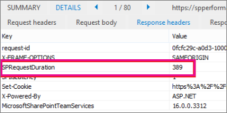

# <a name="navigation-options-for-sharepoint-online"></a><span data-ttu-id="382c1-104">Navigationsoptionen für SharePoint Online</span><span class="sxs-lookup"><span data-stu-id="382c1-104">Navigation options for SharePoint Online</span></span>

<span data-ttu-id="382c1-p102">Dieser Artikel beschreibt die Navigation Optionen Websites mit SharePoint-Veröffentlichung in SharePoint Online aktiviert. Die Auswahl und Konfiguration der Navigation erheblich beeinträchtigt die Leistung und Skalierbarkeit von Websites in SharePoint Online.</span><span class="sxs-lookup"><span data-stu-id="382c1-p102">This article describes navigation options sites with SharePoint Publishing enabled in SharePoint Online. The choice and configuration of navigation significantly impacts the performance and scalability of sites in SharePoint Online.</span></span>

## <a name="overview"></a><span data-ttu-id="382c1-107">Übersicht</span><span class="sxs-lookup"><span data-stu-id="382c1-107">Overview</span></span>

<span data-ttu-id="382c1-p103">Navigation Anbieterkonfiguration kann die Leistung für die gesamte Website erheblich beeinträchtigen und sorgfältige auswählen eine Navigationsanbieter und die Konfiguration, die für die Anforderungen der SharePoint-Website effektiv skaliert geschaltet werden muss. Es gibt zwei Out-of-Box-Navigationsanbieter als auch benutzerdefinierte Navigation Implementierungen.</span><span class="sxs-lookup"><span data-stu-id="382c1-p103">Navigation provider configuration can significantly impact performance for the entire site, and careful consideration must be taken to pick a navigation provider and configuration that scales effectively for the requirements of a SharePoint site. There are two out-of-the-box navigation providers, as well as custom navigation implementations.</span></span>

<span data-ttu-id="382c1-p104">Die erste Option [**(Metadaten) verwaltete Navigation**](#using-managed-navigation-and-metadata-in-sharepoint-online), wird empfohlen und ist eine der Standardoptionen in SharePoint Online. jedoch wird empfohlen, dass die Einschränkung aus Sicherheitsgründen deaktiviert werden, sofern nicht erforderlich. Aus Sicherheitsgründen ist für diesen Navigationsanbieter als Einstellung secure standardmäßig aktiviert. Viele Websites ist jedoch nicht erforderlich des Verarbeitungsaufwands Security trimming, da Navigationselemente häufig für alle Benutzer der Website sind. Mit der empfohlenen Konfiguration aus Sicherheitsgründen deaktivieren diese Navigationsanbieter erfordert keine Aufzählen der Websitestruktur und hochskalierbare akzeptable Leistung beeinträchtigt wird.</span><span class="sxs-lookup"><span data-stu-id="382c1-p104">The first option, [**Managed (Metadata) navigation**](#using-managed-navigation-and-metadata-in-sharepoint-online), is recommended, and is one of the default options in SharePoint Online; however, we recommend that security trimming be disabled unless required. Security trimming is enabled as a secure-by-default setting for this navigation provider; however, many sites do not require the overhead of security trimming since navigation elements often are consistent for all users of the site. With the recommended configuration to disable security trimming, this navigation provider does not require enumerating site structure and is highly scalable with acceptable performance impact.</span></span>

<span data-ttu-id="382c1-p105">Die zweite Option [**strukturelle Navigation**](#using-structural-navigation-in-sharepoint-online), **nicht die Navigationsoption empfohlene in SharePoint Online ist**. Diese Navigationsanbieter wurde entwickelt, für eine lokale-Topologie nur unterstützt in SharePoint Online eingeschränkt. Während sie einige zusätzliche Funktionen im Vergleich zu anderen Navigationsoptionen bietet, diese Features, einschließlich der Einschränkung aus Sicherheitsgründen und Website-Struktur-Aufzählung, Ihren Preis aufgrund einer Anrufe und Auswirkungen Skalierbarkeit und Leistung bei Verwendung. Websites mit Structed Navigation, die übermäßig viele Ressourcen beanspruchen können Drosselung werden.</span><span class="sxs-lookup"><span data-stu-id="382c1-p105">The second option, [**Structural navigation**](#using-structural-navigation-in-sharepoint-online), **is NOT a recommended navigation option in SharePoint Online**. This navigation provider was designed for an on-premises topology has limited support in SharePoint Online. While it provides some additional set of capabilities versus other navigation options, these features, including security trimming and site structure enumeration, comes at a cost of excessive server calls and impacts scalability and performance when it is used. Sites using structed navigation that consume excessive resources may be subject to throttling.</span></span>

<span data-ttu-id="382c1-p106">Zusätzlich zu den Out-of-Box-Navigationsanbieter haben viele Kunden alternative benutzerdefinierte Navigation Implementierungen erfolgreich implementiert. Eine allgemeine Klasse der benutzerdefinierten Navigation Implementierungen standardbasierten Client gerendert Entwurfsmuster, die einen lokalen Cache der Navigationsknoten zu speichern. (Siehe **[suchbasierte clientseitiges Skripting](#using-search-driven-client-side-scripting)** in diesem Artikel.)</span><span class="sxs-lookup"><span data-stu-id="382c1-p106">In addition to the out-of-the-box navigation providers, many customers have successfully implemented alternative custom navigation implementations. One common class of custom navigation implementations embraces client-rendered design patterns that store a local cache of navigation nodes. (See **[Search-driven client-side scripting](#using-search-driven-client-side-scripting)** in this article.)</span></span>

<span data-ttu-id="382c1-120">Diese Navigationsanbieter gibt es mehrere wichtige Vorteile:</span><span class="sxs-lookup"><span data-stu-id="382c1-120">These navigation providers have a couple of key advantages:</span></span> 
- <span data-ttu-id="382c1-121">Sie können im Allgemeinen auch mit Entwürfe schnell Seite.</span><span class="sxs-lookup"><span data-stu-id="382c1-121">They generally work well with responsive page designs.</span></span>
- <span data-ttu-id="382c1-122">Sie sind äußerst skalierbar und leistungsfähige, da gerendert werden können ohne die Kosten Ressource (und die Aktualisierung im Hintergrund nach einem Timeout).</span><span class="sxs-lookup"><span data-stu-id="382c1-122">They are extremely scalable and performant because they can render with no resource cost (and refresh in the background after a timeout).</span></span> 
- <span data-ttu-id="382c1-123">Diese Navigationsanbieter können mit verschiedenen Strategien, zwischen verschiedenen dynamic Data-Anbieter-einfache statische Konfigurationen Navigationsdaten abrufen.</span><span class="sxs-lookup"><span data-stu-id="382c1-123">These navigation providers can retrieve navigation data using various strategies, ranging from simple static configurations to various dynamic data providers.</span></span> 

<span data-ttu-id="382c1-124">Ein Beispiel eines Datenanbieters ist eine **suchgesteuerte Navigation**, mit dessen Hilfe Sie Flexibilität für Navigationsknoten aufzählen und Einschränkung aus Sicherheitsgründen effizient behandeln können.</span><span class="sxs-lookup"><span data-stu-id="382c1-124">An example of a data provider is to use a **Search-driven navigation**, which allows flexibility for enumerating navigation nodes and handling security trimming efficiently.</span></span> 

<span data-ttu-id="382c1-p107">Andere beliebten Optionen zum Erstellen von **benutzerdefinierten Navigationsanbieter**sind vorhanden. Überprüfen Sie [Lösungen für SharePoint Online-Portale Navigation](https://docs.microsoft.com/sharepoint/dev/solution-guidance/portal-navigation) zu weiteren Anleitung zum Erstellen einer benutzerdefinierten Navigationsanbieter.</span><span class="sxs-lookup"><span data-stu-id="382c1-p107">There are other popular options to build **Custom navigation providers**. Please review [Navigation solutions for SharePoint Online portals](https://docs.microsoft.com/sharepoint/dev/solution-guidance/portal-navigation) for further guidance on building a Custom navigation provider.</span></span>
  
## <a name="pros-and-cons-of-sharepoint-online-navigation-options"></a><span data-ttu-id="382c1-127">Vor- und von SharePoint Online Nachteile Navigationsoptionen</span><span class="sxs-lookup"><span data-stu-id="382c1-127">Pros and Cons of SharePoint Online navigation options</span></span>

<span data-ttu-id="382c1-128">In der folgenden Tabelle werden die vor- und Nachteile jeder Option zusammengefasst.</span><span class="sxs-lookup"><span data-stu-id="382c1-128">The following table summarizes the pros and cons of each option.</span></span> 


|<span data-ttu-id="382c1-129">Verwaltete Navigation</span><span class="sxs-lookup"><span data-stu-id="382c1-129">Managed navigation</span></span>  |<span data-ttu-id="382c1-130">Strukturelle Navigation</span><span class="sxs-lookup"><span data-stu-id="382c1-130">Structural navigation</span></span>  |<span data-ttu-id="382c1-131">Suchgesteuerte Navigation</span><span class="sxs-lookup"><span data-stu-id="382c1-131">Search-driven navigation</span></span>  |<span data-ttu-id="382c1-132">Benutzerdefinierte Navigation-Anbieter</span><span class="sxs-lookup"><span data-stu-id="382c1-132">Custom-navigation provider</span></span>  |
|---------|---------|---------|---------|
|<span data-ttu-id="382c1-133">Vorteile:</span><span class="sxs-lookup"><span data-stu-id="382c1-133">Pros:</span></span><br/><br/><span data-ttu-id="382c1-134">Einfach zu verwalten</span><span class="sxs-lookup"><span data-stu-id="382c1-134">Easy to maintain</span></span><br/><span data-ttu-id="382c1-135">Empfohlene option</span><span class="sxs-lookup"><span data-stu-id="382c1-135">Recommended option</span></span><br/>     |<span data-ttu-id="382c1-136">Vorteile:</span><span class="sxs-lookup"><span data-stu-id="382c1-136">Pros:</span></span><br/><br/><span data-ttu-id="382c1-137">Einfach zu konfigurieren</span><span class="sxs-lookup"><span data-stu-id="382c1-137">Easy to configure</span></span><br/><span data-ttu-id="382c1-138">Sicherheitsoptimiert</span><span class="sxs-lookup"><span data-stu-id="382c1-138">Security trimmed</span></span><br/><span data-ttu-id="382c1-139">Automatisch aktualisiert, sobald Inhalt hinzugefügt wird</span><span class="sxs-lookup"><span data-stu-id="382c1-139">Automatically updates as content is added</span></span><br/>|<span data-ttu-id="382c1-140">Vorteile</span><span class="sxs-lookup"><span data-stu-id="382c1-140">Pros:</span></span><br/><br/><span data-ttu-id="382c1-141">Sicherheitsoptimiert</span><span class="sxs-lookup"><span data-stu-id="382c1-141">Security trimmed</span></span><br/><span data-ttu-id="382c1-142">Automatische Aktualisierung beim Hinzufügen von Websites</span><span class="sxs-lookup"><span data-stu-id="382c1-142">Automatically updates as sites are added</span></span><br/><span data-ttu-id="382c1-143">Schnelle Ladezeiten und lokal zwischengespeicherte Navigationsstruktur</span><span class="sxs-lookup"><span data-stu-id="382c1-143">Fast loading time and locally cached navigation structure</span></span><br/>|<span data-ttu-id="382c1-144">Vorteile</span><span class="sxs-lookup"><span data-stu-id="382c1-144">Pros:</span></span><br/><br/><span data-ttu-id="382c1-145">Größere Auswahl bei der verfügbaren Optionen</span><span class="sxs-lookup"><span data-stu-id="382c1-145">Wider choice of options available</span></span><br/><span data-ttu-id="382c1-146">Laden von fast beim Zwischenspeichern wird ordnungsgemäß verwendet.</span><span class="sxs-lookup"><span data-stu-id="382c1-146">Fast loading when caching is used correctly</span></span><br/><span data-ttu-id="382c1-147">Viele Optionen können auch mit schnell Seitenentwurf</span><span class="sxs-lookup"><span data-stu-id="382c1-147">Many options work well with responsive page design</span></span><br/>|
|<span data-ttu-id="382c1-148">Nachteile:</span><span class="sxs-lookup"><span data-stu-id="382c1-148">Cons:</span></span><br/><br/><span data-ttu-id="382c1-149">Keine automatische Aktualisierung zur Abbildung der Websitestruktur</span><span class="sxs-lookup"><span data-stu-id="382c1-149">Not automatically updated to reflect site structure</span></span><br/><span data-ttu-id="382c1-150">Leistung auswirkt, wenn die Einschränkung aus Sicherheitsgründen aktiviert ist</span><span class="sxs-lookup"><span data-stu-id="382c1-150">Impacts performance if security trimming is enabled</span></span><br/>|<span data-ttu-id="382c1-151">Nachteile:</span><span class="sxs-lookup"><span data-stu-id="382c1-151">Cons:</span></span><br/><br/><span data-ttu-id="382c1-152">**Nicht empfohlen**</span><span class="sxs-lookup"><span data-stu-id="382c1-152">**Not recommended**</span></span><br/><span data-ttu-id="382c1-153">**Wirkt sich auf Leistung und Skalierbarkeit**</span><span class="sxs-lookup"><span data-stu-id="382c1-153">**Impacts performance and scalability**</span></span><br/><span data-ttu-id="382c1-154">**Unterliegen-Einschränkung**</span><span class="sxs-lookup"><span data-stu-id="382c1-154">**Subject to throttling**</span></span><br/>|<span data-ttu-id="382c1-155">Nachteile:</span><span class="sxs-lookup"><span data-stu-id="382c1-155">Cons:</span></span><br/><br/><span data-ttu-id="382c1-156">Keine Möglichkeit, Websites einfach anzuordnen</span><span class="sxs-lookup"><span data-stu-id="382c1-156">No ability to easily order sites</span></span><br/><span data-ttu-id="382c1-157">Erfordert die Anpassung der Masterseite (technische Kenntnisse erforderlich)</span><span class="sxs-lookup"><span data-stu-id="382c1-157">Requires customization of the master page (technical skills required)</span></span><br/>|<span data-ttu-id="382c1-158">Nachteile:</span><span class="sxs-lookup"><span data-stu-id="382c1-158">Cons:</span></span><br/><br/><span data-ttu-id="382c1-159">Benutzerdefinierte Entwicklung ist erforderlich</span><span class="sxs-lookup"><span data-stu-id="382c1-159">Custom development is required</span></span><br/><span data-ttu-id="382c1-160">Externe Datenquelle / Cache gespeichert ist erforderlich, z. B. Azure</span><span class="sxs-lookup"><span data-stu-id="382c1-160">External data source / cache stored is needed e.g. Azure</span></span><br/>|

<span data-ttu-id="382c1-p108">Die am besten geeignete Option für Ihre Website hängen auf Ihren Anforderungen Website und auf Ihrer Eignung. Wenn Sie eine skalierbare Out-of-Box-Navigationsanbieter möchten, ist verwaltete Navigation mit Einschränkung aus Sicherheitsgründen deaktiviert eine sehr gute Wahl.</span><span class="sxs-lookup"><span data-stu-id="382c1-p108">The most appropriate option for your site will depend on your site requirements and on your technical capability. If you want a scalable out-of-the-box navigation provider, then Managed navigation with security trimming disabled is a very good option.</span></span> 

<span data-ttu-id="382c1-p109">Die verwaltete Navigationsoption verwaltet werden kann Konfiguration umfassen nicht Anpassungsdateien Code, und es ist wesentlich schneller als strukturelle Navigation. Wenn Sie aus Sicherheitsgründen erfordern und mit einer benutzerdefinierten Gestaltungsvorlage vertraut sind und einige Funktionen in der Organisation, um die Änderungen zu verwalten, die in der Standardmasterseite für SharePoint Online auftreten können, kann dann die Option suchbasierte als bessere liefern Benutzer wünschen. Wenn Sie komplexere Bestimmungen unterliegen, möglicherweise eine benutzerdefinierte Navigationsanbieter die richtige Wahl. Strukturelle Navigation wird nicht empfohlen.</span><span class="sxs-lookup"><span data-stu-id="382c1-p109">The Managed navigation option can be maintained through configuration, does not involve code customization files, and it is significantly faster than structural navigation. If you require security trimming and are comfortable using a custom master page and have some capability in the organization to maintain the changes that may occur in the default master page for SharePoint Online, then the Search-driven option may produce a better user experience. If you have more complex requirements, then a custom navigation provider may be the right choice. Structural navigation is NOT recommended.</span></span>

<span data-ttu-id="382c1-p110">Schließlich ist es wichtig zu beachten, dass SharePoint Hinzufügen von zusätzlichen Navigationsanbieter und Funktionen für moderne SharePoint-websitearchitekturen einer Hierarchie von mehr vereinfachte und einem Hub-and-Spoke-Modell mit SharePoint Hubstandorte nutzen. Auf diese Weise können viele Szenarien erzielt werden muss, die keine die Verwendung des Features für SharePoint-Veröffentlichung erfordern, und diese Navigation Konfigurationen für Skalierbarkeit und Wartezeit in SharePoint Online optimiert sind. Beachten Sie, dass dasselbe Prinzip - vereinfachen die allgemeine Struktur Ihrer Website SharePoint-Veröffentlichung auf eine flacher Struktur, anwenden häufig mit Leistungseinbußen hilft und sowie skaliert werden. Dies bedeutet, dass anstelle einer einzelnen Websitesammlung mit Hunderten von Websites (Unterwebsites) ein besserer Ansatz ist viele Websitesammlungen mit sehr wenige Unterwebsites (Unterwebsites).</span><span class="sxs-lookup"><span data-stu-id="382c1-p110">Finally, it’s important to note that SharePoint is adding additional navigation providers and functionality for modern SharePoint site architectures leveraging a more flattened site hierarchy and a hub-and-spoke model with SharePoint hub sites. This allows many scenarios to be achieved that do NOT require the use of SharePoint Publishing feature, and these navigation configurations are optimized for scalability and latency within SharePoint Online. Note that applying the same principle - simplifying the overall structure of your SharePoint Publishing site to a flatter structure, often helps with overall performance and scale as well. What this means is that instead of having a single Site Collection with hundreds of sites (subwebs), a better approach is to have many site collections with very few subsites (subwebs).</span></span>


## <a name="using-managed-navigation-and-metadata-in-sharepoint-online"></a><span data-ttu-id="382c1-171">Verwenden von verwalteten Navigation und Metadaten in SharePoint Online</span><span class="sxs-lookup"><span data-stu-id="382c1-171">Using managed navigation and metadata in SharePoint Online</span></span>

<span data-ttu-id="382c1-p111">Verwalteter Navigation ist eine andere Out-of-Box-Option, mit denen Sie die meisten dieselbe Funktionalität wie strukturelle Navigation neu erstellen. Verwalteter Metadaten kann konfiguriert werden, um die Einschränkung aus Sicherheitsgründen aktiviert oder deaktiviert haben. Bei der Konfiguration mit Einschränkung aus Sicherheitsgründen deaktiviert, ist verwalteter Navigation relativ effizient wie die Navigationslinks mit einer Konstante Anzahl von Serveranrufen geladen. Aktivieren der Security trimming, jedoch einige der Vorteile der verwalteten Navigation negiert und Kunden können auswählen, um eine benutzerdefinierte Navigation Lösungen für eine optimale Leistung und Skalierbarkeit zu erkunden.</span><span class="sxs-lookup"><span data-stu-id="382c1-p111">Managed navigation is another out-of-the-box option that you can use to recreate most of the same functionality as structural navigation. Managed metadata can be configured to have security trimming enabled or disabled. When configured with security trimming disabled, managed navigation is fairly efficient as it loads all the navigation links with a constant number of server calls. Enabling security trimming, however, negates some of the advantages of managed navigation, and customers may choose to explore one of the custom navigation solutions for optimal performance and scalability.</span></span>

<span data-ttu-id="382c1-p112">Viele Websites erfordern keinen aus Sicherheitsgründen, wie oft die Navigationsstruktur für alle Benutzer der Website konsistent ist. Wenn die Einschränkung aus Sicherheitsgründen ist deaktiviert, und eine Verknüpfung zur Navigation, die nicht alle Benutzer Zugriff haben hinzugefügt wird, der Link zeigt immer noch jedoch führt zum Zugriff verweigert. Es ist kein Risiko des unbeabsichtigten Zugriff auf die Inhalte.</span><span class="sxs-lookup"><span data-stu-id="382c1-p112">Many sites do not require security trimming, as the navigation structure is often consistent for all users of the site. If security trimming is disabled and a link is added to navigation that not all users have access to, the link will still show but will lead to an access denied message. There is no risk of inadvertent access to the content.</span></span>

### <a name="how-to-implement-managed-navigation-and-the-results"></a><span data-ttu-id="382c1-179">So implementieren Sie die verwaltete Navigation und die Ergebnisse</span><span class="sxs-lookup"><span data-stu-id="382c1-179">How to implement managed navigation and the results</span></span>

<span data-ttu-id="382c1-180">Es gibt mehrere Artikel auf Docs.Microsoft.com zu den Details der verwalteten Navigation, zum Beispiel, finden Sie unter [Übersicht über die verwaltete Navigation in SharePoint Server](https://docs.microsoft.com/sharepoint/administration/overview-of-managed-navigation).</span><span class="sxs-lookup"><span data-stu-id="382c1-180">There are several articles on Docs.Microsoft.com about the details of managed navigation, for example, see [Overview of managed navigation in SharePoint Server](https://docs.microsoft.com/sharepoint/administration/overview-of-managed-navigation).</span></span>

<span data-ttu-id="382c1-p113">Um die verwalteten Navigation zu implementieren, richten Sie Begriffe mit URLs, die die Navigationsstruktur der Website entspricht. Verwalteter Navigation kann auch manuell curated werden, um strukturelle Navigation in vielen Fällen zu ersetzen. Zum Beispiel:</span><span class="sxs-lookup"><span data-stu-id="382c1-p113">In order to implement managed navigation, you set up terms with URLs corresponding to the navigation structure of  the site. Managed navigation can even be manually curated to replace structural navigation in many cases. For example:</span></span>


<span data-ttu-id="382c1-185">Das folgende Beispiel zeigt die Leistung der komplexen Navigation bei Verwendung der verwalteten Navigation.</span><span class="sxs-lookup"><span data-stu-id="382c1-185">The following example shows the performance of the complex navigation using managed navigation.</span></span>



<span data-ttu-id="382c1-187">Verwalteten Navigation konsistent verwenden verbessert die Leistung im Vergleich zu den Ansatz strukturelle Navigation.</span><span class="sxs-lookup"><span data-stu-id="382c1-187">Using managed navigation consistently improves performance compared to the structural navigation approach.</span></span>
  
## <a name="using-structural-navigation-in-sharepoint-online"></a><span data-ttu-id="382c1-188">Verwenden der strukturellen Navigation in SharePoint Online</span><span class="sxs-lookup"><span data-stu-id="382c1-188">Using structural navigation in SharePoint Online</span></span>

<span data-ttu-id="382c1-p114">Die Out-of-Box-Navigation standardmäßig verwendet und ist die einfachste Lösung Dies ist ein Kompromiss teurer Leistung als solche hat. Es muss keine Anpassung und einen technischen Benutzer kann auch problemlos Elemente hinzufügen, Ausblenden von Elementen und verwalten die Navigation auf der Seite Einstellungen. Dies ist jedoch auch True für die verwaltete Navigation, empfiehlt es verwaltete Navigation als verwenden, die auch auf einfache Weise verwaltet und gesteuert werden kann auch mit die Leistung verbessert.</span><span class="sxs-lookup"><span data-stu-id="382c1-p114">This is the out-of-the-box navigation used by default and is the most straightforward solution but as such has an expensive performance trade-off. It does not require any customization and a non-technical user can also easily add items, hide items, and manage the navigation from the settings page. This is however also true for Managed Navigation so it is recommended to use Managed Navigation as that can also be easily managed and controlled as well with improved performance.</span></span>


  
### <a name="turning-on-structural-navigation-in-sharepoint-online"></a><span data-ttu-id="382c1-193">Aktivieren der strukturellen Navigation in SharePoint Online</span><span class="sxs-lookup"><span data-stu-id="382c1-193">Turning on structural navigation in SharePoint Online</span></span>

<span data-ttu-id="382c1-p115">Erläutern, wie die Leistung in einer standard-SharePoint Online-Lösung mit strukturellen Navigation und anzeigen die Option Unterwebsites aktiviert. Es folgt ein Screenshot des Einstellungen finden Sie auf der Seite **Websiteeinstellungen** \> **Navigation**.</span><span class="sxs-lookup"><span data-stu-id="382c1-p115">To illustrate how the performance in a standard SharePoint Online solution with structural navigation and the show subsites option turned on. Below is a screenshot of settings found on the page **Site Settings** \> **Navigation**.</span></span>
  

  
### <a name="analyzing-structural-navigation-performance-in-sharepoint-online"></a><span data-ttu-id="382c1-197">Analysieren der Leistung der strukturellen Navigation in SharePoint Online</span><span class="sxs-lookup"><span data-stu-id="382c1-197">Analyzing structural navigation performance in SharePoint Online</span></span>

<span data-ttu-id="382c1-198">Verwenden Sie die Leistung einer SharePoint-Seite zu analysieren, der Registerkarte **Netzwerks** die F12-Entwicklertools in Internet Explorer.</span><span class="sxs-lookup"><span data-stu-id="382c1-198">To analyze the performance of a SharePoint page, use the **Network** tab of the F12 developer tools in Internet Explorer.</span></span> 
  

  
1. <span data-ttu-id="382c1-200">Klicken Sie auf der Registerkarte **Netzwerk** auf die ASPX-Seite, die geladen wird, und klicken Sie dann auf die Registerkarte **Details**.</span><span class="sxs-lookup"><span data-stu-id="382c1-200">On the **Network** tab, click on the .aspx page that is being loaded and then click on the **Details** tab.</span></span><br/> <span data-ttu-id="382c1-201"></span><span class="sxs-lookup"><span data-stu-id="382c1-201"></span></span><br/>
2. <span data-ttu-id="382c1-202">Klicken Sie auf **Antwortheader**.</span><span class="sxs-lookup"><span data-stu-id="382c1-202">Click **Response headers**.</span></span> <br/><span data-ttu-id="382c1-203"></span><span class="sxs-lookup"><span data-stu-id="382c1-203"></span></span><br/><span data-ttu-id="382c1-204">SharePoint gibt einige nützliche Diagnoseinformationen in seiner Antwortheader zurück.</span><span class="sxs-lookup"><span data-stu-id="382c1-204">SharePoint returns some useful diagnostic information in its response headers.</span></span> 
3. <span data-ttu-id="382c1-p116">Eine der nützlichsten Teile der Informationen ist **SPRequestDuration** , der Wert ist, der eine Anforderung an den Prozess auf dem Server die Zeitdauer in Millisekunden. Im folgenden Screenshot ist die **Unterwebsites anzeigen** für die strukturelle Navigation nicht aktiviert. Dies bedeutet, dass nur die Site Collection Verknüpfung in der globalen Navigation vorhanden ist:</span><span class="sxs-lookup"><span data-stu-id="382c1-p116">One of the most useful pieces of information is **SPRequestDuration** which is the value, in milliseconds, of how long a request took to process on the server. In the following screenshot **show subsites** is unchecked for the structural navigation. This means that there is only the site collection link in the global navigation:</span></span><br/><span data-ttu-id="382c1-208"></span><span class="sxs-lookup"><span data-stu-id="382c1-208"></span></span><br/>
4. <span data-ttu-id="382c1-p117">Der Schlüssel für **SPRequestDuration** hat einen Wert von 245 Millisekunden. Dies ist die Zeit die Anforderung zurückgegeben. Da nur ein Navigationselement auf der Website vorhanden ist, ist dies eine gute Richtlinie für ohne extra fette Navigation wie SharePoint Online ausführt. Der nächste Screenshot zeigt, wie in Unterwebsites Hinzufügen dieser Schlüssel auswirkt.</span><span class="sxs-lookup"><span data-stu-id="382c1-p117">The **SPRequestDuration** key has a value of 245 milliseconds. This represents the time it took to return the request. Since there is only one navigation item on the site, this is a good benchmark for how SharePoint Online performs without heavy navigation. The next screen shot shows how adding in the subsites affects this key.</span></span><br/><span data-ttu-id="382c1-213"></span><span class="sxs-lookup"><span data-stu-id="382c1-213"></span></span><br/>
  
<span data-ttu-id="382c1-p118">Hinzufügen von Unterwebsites wurde die Zeit Zeitaufwand für die angeforderte Seite für dieses Beispiel relativ einfach zurückzugebenden stark erweitert. Komplexe websitehierarchien, einschließlich der Seiten im Navigationsbereich und andere Konfiguration und Topologieoptionen können diese Auswirkung noch weiter drastisch erhöhen.</span><span class="sxs-lookup"><span data-stu-id="382c1-p118">Adding the subsites has significantly increased the time it takes to return the page request for this relatively simple sample site. Complex site hierarchies, including pages in navigation, and other configuration and topology options can dramatically increase this impact even further.</span></span>

## <a name="using-search-driven-client-side-scripting"></a><span data-ttu-id="382c1-216">Verwenden einer suchbasierten, clientseitigen Skripterstellung</span><span class="sxs-lookup"><span data-stu-id="382c1-216">Using Search-driven client-side scripting</span></span>

<span data-ttu-id="382c1-p119">Verwenden der Suchfunktion von können Sie die Indizes nutzen, die in den Hintergrund mit kontinuierliche Durchforstung basieren. Die Suchergebnisse werden aus dem Suchindex abgerufen, und die Ergebnisse sind Sicherheit gekürzt. Dies ist im Allgemeinen schneller als Out-of-Box Navigationsanbieter, wenn aus Sicherheitsgründen erforderlich ist. Mithilfe der Suche für die strukturelle Navigation, insbesondere dann, wenn eine komplexe Websitestruktur beschleunigt Seite Ladezeit erheblich. Der Hauptvorteil dieses über verwaltete Navigation ist, dass Sie aus Sicherheitsgründen profitieren.</span><span class="sxs-lookup"><span data-stu-id="382c1-p119">Using search you can leverage the indexes that are built up in the background using continuous crawl. The search results are pulled from the search index and the results are security-trimmed. This is generally faster than out-of-the-box navigation providers when security trimming is required. Using search for structural navigation, especially if you have a complex site structure, will speed up page loading time considerably. The main advantage of this over managed navigation is that you benefit from security trimming.</span></span>

<span data-ttu-id="382c1-p120">Dieser Ansatz umfasst das Erstellen einer benutzerdefinierten Gestaltungsvorlage und ersetzen den Navigationscode Out-of-Box-mit benutzerdefinierten HTML-Code. Folgen Sie dieses Verfahren im folgenden Beispiel ersetzen den Navigationscode in der Datei `seattle.html`. In diesem Beispiel wird, öffnen Sie die `seattle.html` Datei, und Ersetzen Sie das ganze Element `id=”DeltaTopNavigation”` mit benutzerdefiniertem HTML-Code.</span><span class="sxs-lookup"><span data-stu-id="382c1-p120">This approach involves creating a custom master page and replacing the out-of-the-box navigation code with custom HTML. Follow this procedure outlined in the following example to replace the navigation code in the file `seattle.html`. In this example, you will open the `seattle.html` file and replace the whole element `id=”DeltaTopNavigation”` with custom HTML code.</span></span>

### <a name="example-replace-the-out-of-the-box-navigation-code-in-a-master-page"></a><span data-ttu-id="382c1-225">Beispiel: Ersetzen Sie den Out-of-Box-Navigationscode in eine Gestaltungsvorlage</span><span class="sxs-lookup"><span data-stu-id="382c1-225">Example: Replace the out-of-the-box navigation code in a master page</span></span>

1.  <span data-ttu-id="382c1-226">Navigieren Sie zur Seite Websiteeinstellungen.</span><span class="sxs-lookup"><span data-stu-id="382c1-226">Navigate to the Site Settings page.</span></span>
2.  <span data-ttu-id="382c1-227">Öffnen Sie durch Klicken auf **Masterseiten** den Masterseitenkatalog.</span><span class="sxs-lookup"><span data-stu-id="382c1-227">Open the master page gallery by clicking **Master Pages**.</span></span>
3.  <span data-ttu-id="382c1-228">Von hier aus können Sie über die Bibliotheks-navigieren und Laden Sie die Datei `seattle.master`.</span><span class="sxs-lookup"><span data-stu-id="382c1-228">From here you can navigate through the library and download the file `seattle.master`.</span></span>
4.  <span data-ttu-id="382c1-229">Bearbeiten Sie den Code mit einem Texteditor, und löschen Sie den Codeblock im folgenden Screenshot.</span><span class="sxs-lookup"><span data-stu-id="382c1-229">Edit the code using a text editor and delete the code block in the following screen shot.</span></span><br/><br/>
5. <span data-ttu-id="382c1-231">Entfernen Sie den Code zwischen den `<SharePoint:AjaxDelta id=”DeltaTopNavigation”>` und `<\SharePoint:AjaxDelta>` tags und ersetzt ihn durch den folgenden Codeausschnitt:</span><span class="sxs-lookup"><span data-stu-id="382c1-231">Remove the code between the `<SharePoint:AjaxDelta id=”DeltaTopNavigation”>` and `<\SharePoint:AjaxDelta>` tags and replace it with the following snippet:</span></span><br/>

```
<div id="loading">
  <!--Replace with path to loading image.-->
  <div style="background-image: url(''); height: 22px; width: 22px; ">
  </div>
</div>
<!-- Main Content-->
<div id="navContainer" style="display:none">
    <div data-bind="foreach: hierarchy" class="noindex ms-core-listMenu-horizontalBox">
        <a class="dynamic menu-item ms-core-listMenu-item ms-displayInline ms-navedit-linkNode" data-bind="attr: { href: item.Url, title: item.Title }">
            <span class="menu-item-text" data-bind="text: item.Title">
            </span>
        </a>
        <ul id="menu" data-bind="foreach: $data.children" style="padding-left:20px">
            <li class="static dynamic-children level1">
                <a class="static dynamic-children menu-item ms-core-listMenu-item ms-displayInline ms-navedit-linkNode" data-bind="attr: { href: item.Url, title: item.Title }">
               
                 <!-- ko if: children.length > 0-->
                    <span aria-haspopup="true" class="additional-background ms-navedit-flyoutArrow dynamic-children">
                        <span class="menu-item-text" data-bind="text: item.Title">
                        </span>
                    </span>
                <!-- /ko -->
                <!-- ko if: children.length == 0-->   
                    <span aria-haspopup="true" class="ms-navedit-flyoutArrow dynamic-children">
                        <span class="menu-item-text" data-bind="text: item.Title">
                        </span>
                    </span>
                <!-- /ko -->   
                </a>
               
                <!-- ko if: children.length > 0-->                                                       
                <ul id="menu"  data-bind="foreach: children;" class="dynamic  level2" >
                    <li class="dynamic level2">
                        <a class="dynamic menu-item ms-core-listMenu-item ms-displayInline  ms-navedit-linkNode" data-bind="attr: { href: item.Url, title: item.Title }">
         
          <!-- ko if: children.length > 0-->
          <span aria-haspopup="true" class="additional-background ms-navedit-flyoutArrow dynamic-children">
           <span class="menu-item-text" data-bind="text: item.Title">
           </span>
          </span>
           <!-- /ko -->
          <!-- ko if: children.length == 0-->
          <span aria-haspopup="true" class="ms-navedit-flyoutArrow dynamic-children">
           <span class="menu-item-text" data-bind="text: item.Title">
           </span>
          </span>                 
          <!-- /ko -->   
                        </a>
          <!-- ko if: children.length > 0-->
         <ul id="menu" data-bind="foreach: children;" class="dynamic level3" >
          <li class="dynamic level3">
           <a class="dynamic menu-item ms-core-listMenu-item ms-displayInline ms-navedit-linkNode" data-bind="attr: { href: item.Url, title: item.Title }">
            <span class="menu-item-text" data-bind="text: item.Title">
            </span>
           </a>
          </li>
         </ul>
           <!-- /ko -->
                    </li>
                </ul>
                <!-- /ko -->
            </li>
        </ul>
    </div>
</div>
```
<br/>
6. <span data-ttu-id="382c1-p121">Ersetzen Sie die URL in das Laden image Anchortag am Anfang, mit einem Link zu einem Bild laden in Ihrer Websitesammlung. Nachdem Sie die Änderungen vorgenommen haben, benennen Sie die Datei, und klicken Sie dann auf den Gestaltungsvorlagenkatalog hochladen. Dadurch wird eine neue Master-Datei generiert.</span><span class="sxs-lookup"><span data-stu-id="382c1-p121">Replace the URL in the loading image anchor tag at the beginning, with a link to a loading image in your site collection. After you have made the changes, rename the file and then upload it to the master page gallery. This generates a new .master file.</span></span><br/>
7. <span data-ttu-id="382c1-p122">Dieser HTML-Code wird die grundlegende Markup, das von der Suchergebnisse aus JavaScript-Code aufgefüllt wird. Sie müssen den Code zum Ändern des Werts für Var Stamm bearbeiten = "site Websitesammlungs-URL", wie im folgenden Codeausschnitt veranschaulicht:</span><span class="sxs-lookup"><span data-stu-id="382c1-p122">This HTML is the basic markup that will be populated by the search results returned from JavaScript code. You will need to edit the code to change the value for var root = “site collection URL” as demonstrated in the following snippet:</span></span><br/>

```
var root = “https://spperformance.sharepoint.com/sites/NavigationBySearch”;
```
<br/>
8. <span data-ttu-id="382c1-p123">Die Ergebnisse werden in das Array self.nodes zugewiesen und eine Hierarchie der Objekte mit linq.js zuweisen die Ausgabe zu einem Array self.heirarchy basiert. Dieses Array ist das Objekt, das an den HTML-Code gebunden ist. Dies in der Funktion toggleView() erfolgt, indem Sie das Self-Objekt an die Funktion ko.applyBinding() übergeben.</span><span class="sxs-lookup"><span data-stu-id="382c1-p123">The results are assigned to the self.nodes array and a hierarchy is built out of the objects using linq.js assigning the output to an array self.heirarchy. This array is the object that is bound to the HTML. This is done in the toggleView() function by passing the self object to the ko.applyBinding() function.</span></span><br/><span data-ttu-id="382c1-240">Dies führt dann Hierarchie Array folgenden HTML-Code gebunden werden:</span><span class="sxs-lookup"><span data-stu-id="382c1-240">This then causes the hierarchy array to be bound to the following HTML:</span></span><br/>

```
<div data-bind=”foreach: hierarchy” class=”noindex ms-core-listMenu-horizontalBox”>
```

<span data-ttu-id="382c1-241">Der Ereignishandler für `mouseenter` und `mouseexit` werden hinzugefügt, um die Navigation auf oberster Ebene zum Verarbeiten der Unterwebsite Dropdownmenüs ausgeführt wird, in der `addEventsToElements()` Funktion.</span><span class="sxs-lookup"><span data-stu-id="382c1-241">The event handlers for `mouseenter` and `mouseexit` are added to the top-level navigation to handle the subsite drop-down menus which is done in the `addEventsToElements()` function.</span></span>

<span data-ttu-id="382c1-242">In unserem Beispiel komplexen Navigation eine leere Seite laden, ohne das lokale Zwischenspeichern zeigt der Zeitaufwand für den Server aus der Vergleichstest strukturelle Navigation ein ähnliches Ergebnis als die verwaltete Navigation Ansatz abzurufenden verringern wurde.</span><span class="sxs-lookup"><span data-stu-id="382c1-242">In our complex navigation example, a fresh page load without the local caching shows the time spent on the server has been cut down from the benchmark structural navigation to get a similar result as the managed navigation approach.</span></span>

### <a name="about-the-javascript-file"></a><span data-ttu-id="382c1-243">Über die JavaScript-Datei...</span><span class="sxs-lookup"><span data-stu-id="382c1-243">About the JavaScript file...</span></span>

<span data-ttu-id="382c1-244">Die gesamte JavaScript-Datei sieht wie folgt aus:</span><span class="sxs-lookup"><span data-stu-id="382c1-244">The entire JavaScript file is as follows:</span></span>

```
//Models and Namespaces
var SPOCustom = SPOCustom || {};
SPOCustom.Models = SPOCustom.Models || {}
SPOCustom.Models.NavigationNode = function () {

    this.Url = ko.observable("");
    this.Title = ko.observable("");
    this.Parent = ko.observable("");

};

var root = "https://spperformance.sharepoint.com/sites/NavigationBySearch";
var baseUrl = root + "/_api/search/query?querytext=";
var query = baseUrl + "'contentClass=\"STS_Web\"+path:" + root + "'&trimduplicates=false&rowlimit=300";

var baseRequest = {
    url: "",
    type: ""
};


//Parses a local object from JSON search result.
function getNavigationFromDto(dto) {
    var item = new SPOCustom.Models.NavigationNode();
    if (dto != undefined) {

        var webTemplate = getSearchResultsValue(dto.Cells.results, 'WebTemplate');

        if (webTemplate != "APP") {
            item.Title(getSearchResultsValue(dto.Cells.results, 'Title')); //Key = Title
            item.Url(getSearchResultsValue(dto.Cells.results, 'Path')); //Key = Path
            item.Parent(getSearchResultsValue(dto.Cells.results, 'ParentLink')); //Key = ParentLink
        }

    }
    return item;
}

function getSearchResultsValue(results, key) {

    for (i = 0; i < results.length; i++) {
        if (results[i].Key == key) {
            return results[i].Value;
        }
    }
    return null;
}

//Parse a local object from the serialized cache.
function getNavigationFromCache(dto) {
    var item = new SPOCustom.Models.NavigationNode();

    if (dto != undefined) {

        item.Title(dto.Title);
        item.Url(dto.Url);
        item.Parent(dto.Parent);
    }

    return item;
}

/* create a new OData request for JSON response */
function getRequest(endpoint) {
    var request = baseRequest;
    request.type = "GET";
    request.url = endpoint;
    request.headers = { ACCEPT: "application/json;odata=verbose" };
    return request;
};

/* Navigation Module*/
function NavigationViewModel() {
    "use strict";
    var self = this;
    self.nodes = ko.observableArray([]);
    self.hierarchy = ko.observableArray([]);;
    self.loadNavigatioNodes = function () {
        //Check local storage for cached navigation datasource.
        var fromStorage = localStorage["nodesCache"];
        if (false) {
            var cachedNodes = JSON.parse(localStorage["nodesCache"]);

            if (cachedNodes && timeStamp) {
                //Check for cache expiration. Currently set to 3 hrs.
                var now = new Date();
                var diff = now.getTime() - timeStamp;
                if (Math.round(diff / (1000 * 60 * 60)) < 3) {

                    //return from cache.
                    var cacheResults = [];
                    $.each(cachedNodes, function (i, item) {
                        var nodeitem = getNavigationFromCache(item, true);
                        cacheResults.push(nodeitem);
                    });

                    self.buildHierarchy(cacheResults);
                    self.toggleView();
                    addEventsToElements();
                    return;
                }
            }
        }
        //No cache hit, REST call required.
        self.queryRemoteInterface();
    };

    //Executes a REST call and builds the navigation hierarchy.
    self.queryRemoteInterface = function () {
        var oDataRequest = getRequest(query);
        $.ajax(oDataRequest).done(function (data) {
            var results = [];
            $.each(data.d.query.PrimaryQueryResult.RelevantResults.Table.Rows.results, function (i, item) {

                if (i == 0) {
                    //Add root element.
                    var rootItem = new SPOCustom.Models.NavigationNode();
                    rootItem.Title("Root");
                    rootItem.Url(root);
                    rootItem.Parent(null);
                    results.push(rootItem);
                }
                var navItem = getNavigationFromDto(item);
                results.push(navItem);
            });
            //Add to local cache
            localStorage["nodesCache"] = ko.toJSON(results);

            localStorage["nodesCachedAt"] = new Date().getTime();
            self.nodes(results);
            if (self.nodes().length > 0) {
                var unsortedArray = self.nodes();
                var sortedArray = unsortedArray.sort(self.sortObjectsInArray);

                self.buildHierarchy(sortedArray);
                self.toggleView();
                addEventsToElements();
            }
        }).fail(function () {
            //Handle error here!!
            $("#loading").hide();
            $("#error").show();
        });
    };
    self.toggleView = function () {
        var navContainer = document.getElementById("navContainer");
        ko.applyBindings(self, navContainer);
        $("#loading").hide();
        $("#navContainer").show();

    };
    //Uses linq.js to build the navigation tree.
    self.buildHierarchy = function (enumerable) {
        self.hierarchy(Enumerable.From(enumerable).ByHierarchy(function (d) {
            return d.Parent() == null;
        }, function (parent, child) {
            if (parent.Url() == null || child.Parent() == null)
                return false;
            return parent.Url().toUpperCase() == child.Parent().toUpperCase();
        }).ToArray());

        self.sortChildren(self.hierarchy()[0]);
    };


    self.sortChildren = function (parent) {

        // sjip processing if no children
        if (!parent || !parent.children || parent.children.length === 0) {
            return;
        }

        parent.children = parent.children.sort(self.sortObjectsInArray2);

        for (var i = 0; i < parent.children.length; i++) {
            var elem = parent.children[i];

            if (elem.children && elem.children.length > 0) {
                self.sortChildren(elem);
            }
        }
    };

    // ByHierarchy method breaks the sorting in chrome and firefix 
    // we need to resort  as ascending
    self.sortObjectsInArray2 = function (a, b) {
        if (a.item.Title() > b.item.Title())
            return 1;
        if (a.item.Title() < b.item.Title())
            return -1;
        return 0;
    };


    self.sortObjectsInArray = function (a, b) {
        if (a.Title() > b.Title())
            return -1;
        if (a.Title() < b.Title())
            return 1;
        return 0;
    }
}

//Loads the navigation on load and binds the event handlers for mouse interaction.
function InitCustomNav() {
    var viewModel = new NavigationViewModel();
    viewModel.loadNavigatioNodes();
}

function addEventsToElements() {
    //events.
      $("li.level1").mouseover(function () {
          var position = $(this).position();
          $(this).find("ul.level2").css({ width: 100, left: position.left + 10, top: 50 });
      })
   .mouseout(function () {
     $(this).find("ul.level2").css({  left: -99999, top: 0 });
   
    });
   
     $("li.level2").mouseover(function () {
          var position = $(this).position();
          console.log(JSON.stringify(position));
          $(this).find("ul.level3").css({ width: 100, left: position.left + 95, top:  position.top});
      })
   .mouseout(function () {
     $(this).find("ul.level3").css({  left: -99999, top: 0 });
    });
} _spBodyOnLoadFunctionNames.push("InitCustomNav");

``` 

<span data-ttu-id="382c1-p124">Den oben aufgeführten Code Zusammenfassen der `jQuery $(document).ready` Funktion vorhanden ist ein `viewModel object` erstellt und dann die `loadNavigationNodes()` Funktion für dieses Objekt aufgerufen wird. Diese Funktion lädt entweder der zuvor erstellten Navigationshierarchie im lokalen Speicher des Clientbrowsers HTML5 gespeichert oder die Funktion ruft `queryRemoteInterface()`.</span><span class="sxs-lookup"><span data-stu-id="382c1-p124">To summarize the code shown above in the `jQuery $(document).ready` function there is a `viewModel object` created and then the `loadNavigationNodes()` function on that object is called. This function either loads the previously built navigation hierarchy stored in the HTML5 local storage of the client browser or it calls the function `queryRemoteInterface()`.</span></span>

<span data-ttu-id="382c1-p125">`QueryRemoteInterface()`erstellt eine Anforderung mithilfe der `getRequest()` -Funktion mit dem Abfragezeichenfolgen-Parameter weiter oben in das Skript definiert, und klicken Sie dann die Daten vom Server zurückgegeben. Diese Daten ist im Wesentlichen ein Array aller Websites in der Websitesammlung als Objekte zum Übertragen von Daten mit verschiedenen Eigenschaften dargestellt.</span><span class="sxs-lookup"><span data-stu-id="382c1-p125">`QueryRemoteInterface()` builds a request using the `getRequest()` function with the query parameter defined earlier in the script and then returns data from the server. This data is essentially an array of all the sites in the site collection represented as data transfer objects with various properties.</span></span> 

<span data-ttu-id="382c1-249">Werden diese Daten analysiert in der zuvor definierten `SPO.Models.NavigationNode` Objekte, die verwenden `Knockout.js` sichtbare Eigenschaften für die Verwendung durch die Werte in der HTML-Code, die wir zuvor definierten Binden von Daten erstellen.</span><span class="sxs-lookup"><span data-stu-id="382c1-249">This data is then parsed into the previously defined `SPO.Models.NavigationNode` objects which use `Knockout.js` to create observable properties for use by data binding the values into the HTML that we defined earlier.</span></span> 

<span data-ttu-id="382c1-p126">Die Objekte sind, platzieren Sie dann in ein Ergebnisarray. Dieses Array wird in JSON mit Knockout analysiert und in den lokalen Browser Speicher für verbesserte Leistung auf zukünftige Seite Lasten gespeichert.</span><span class="sxs-lookup"><span data-stu-id="382c1-p126">The objects are then put into a results array. This array is parsed into JSON using Knockout and stored in the local browser storage for improved performance on future page loads.</span></span>

### <a name="benefits-of-this-approach"></a><span data-ttu-id="382c1-252">Vorteile dieses Ansatzes</span><span class="sxs-lookup"><span data-stu-id="382c1-252">Benefits of this approach</span></span>

<span data-ttu-id="382c1-p127">Ein wesentlicher Nutzen von [diesem Ansatz](#example-replace-the-out-of-the-box-navigation-code-in-a-master-page) ist mithilfe von HTML5 lokalen Speicher, die Navigation lokal für den Benutzer das nächste Mal gespeichert wird die Seite zu laden. Wir erhalten Haupt-Leistungssteigerungen aus mithilfe der API für die Suche für die strukturelle Navigation. Allerdings dauert es einige Eignung ausführen und diese Funktionalität anpassen.</span><span class="sxs-lookup"><span data-stu-id="382c1-p127">One major benefit of [this approach](#example-replace-the-out-of-the-box-navigation-code-in-a-master-page) is that by using HTML5 local storage, the navigation is stored locally for the user the next time they load the page. We get major performance improvements from using the search API for structural navigation; however, it takes some technical capability to execute and customize this functionality.</span></span> 

<span data-ttu-id="382c1-p128">In der [Beispiel-Implementierung](#example-replace-the-out-of-the-box-navigation-code-in-a-master-page)werden die Websites in die gleiche Weise wie die strukturelle Out-of-Box-Navigation geordnet; alphabetischer Reihenfolge. Wenn Sie von dieser Reihenfolge abweichen, wäre es schwieriger zu entwickeln und zu verwalten. Darüber hinaus müssen diesem Ansatz Sie von der unterstützten Gestaltungsvorlagen abweichen. Wenn die benutzerdefinierte Gestaltungsvorlage nicht verwaltet werden, Ihrer Website wird verpassen out auf der Updates und Verbesserungen, die Microsoft die Gestaltungsvorlagen gemacht werden.</span><span class="sxs-lookup"><span data-stu-id="382c1-p128">In the [example implementation](#example-replace-the-out-of-the-box-navigation-code-in-a-master-page), the sites are ordered in the same way as the out-of-the-box structural navigation; alphabetical order. If you wanted to deviate from this order, it would be more complicated to develop and maintain. Also, this approach requires you to deviate from the supported master pages. If the custom master page is not maintained, your site will miss out on updates and improvements that Microsoft makes to the master pages.</span></span>

<span data-ttu-id="382c1-259">Die [über Code](#about-the-javascript-file) gelten die folgenden Abhängigkeiten:</span><span class="sxs-lookup"><span data-stu-id="382c1-259">The [above code](#about-the-javascript-file) has the following dependencies:</span></span>

- <span data-ttu-id="382c1-260">jQuery-http://jquery.com/</span><span class="sxs-lookup"><span data-stu-id="382c1-260">jQuery - http://jquery.com/</span></span>
- <span data-ttu-id="382c1-261">KnockoutJS-http://knockoutjs.com/</span><span class="sxs-lookup"><span data-stu-id="382c1-261">KnockoutJS - http://knockoutjs.com/</span></span>
- <span data-ttu-id="382c1-262">Linq.js - http://linqjs.codeplex.com/, oder github.com/neuecc/linq.js</span><span class="sxs-lookup"><span data-stu-id="382c1-262">Linq.js - http://linqjs.codeplex.com/, or github.com/neuecc/linq.js</span></span>

<span data-ttu-id="382c1-p129">Die aktuelle Version von LinqJS enthält nicht die ByHierarchy-Methode verwendet, die im obigen Code und unterbricht den Navigationscode. Um dieses Problem zu beheben, fügen Sie die folgende Methode zur Datei Linq.js vor der Zeile `Flatten: function ()`.</span><span class="sxs-lookup"><span data-stu-id="382c1-p129">The current version of LinqJS does not contain the ByHierarchy method used in the above code and will break the navigation code. To fix this, add the following method to the Linq.js file before the line `Flatten: function ()`.</span></span>

```
ByHierarchy: function(firstLevel, connectBy, orderBy, ascending, parent) {
     ascending = ascending == undefined ? true : ascending;
     var orderMethod = ascending == true ? 'OrderBy' : 'OrderByDescending';
     var source = this;
     firstLevel = Utils.CreateLambda(firstLevel);
     connectBy = Utils.CreateLambda(connectBy);
     orderBy = Utils.CreateLambda(orderBy);
    
     //Initiate or increase level
     var level = parent === undefined ? 1 : parent.level + 1;

    return new Enumerable(function() {
         var enumerator;
         var index = 0;

        var createLevel = function() {
                 var obj = {
                     item: enumerator.Current(),
                     level : level
                 };
                 obj.children = Enumerable.From(source).ByHierarchy(firstLevel, connectBy, orderBy, ascending, obj);
                 if (orderBy !== undefined) {
                     obj.children = obj.children[orderMethod](function(d) {
                         return orderBy(d.item); //unwrap the actual item for sort to work
                     });
                 }
                 obj.children = obj.children.ToArray();
                 Enumerable.From(obj.children).ForEach(function(child) {
                     child.getParent = function() {
                         return obj;
                     };
                 });
                 return obj;
             };

        return new IEnumerator(

        function() {
             enumerator = source.GetEnumerator();
         }, function() {
             while (enumerator.MoveNext()) {
                 var returnArr;
                 if (!parent) {
                     if (firstLevel(enumerator.Current(), index++)) {
                         return this.Yield(createLevel());
                     }

                } else {
                     if (connectBy(parent.item, enumerator.Current(), index++)) {
                         return this.Yield(createLevel());
                     }
                 }
             }
             return false;
         }, function() {
             Utils.Dispose(enumerator);
         })
     });
 },

```
  
## <a name="related-topics"></a><span data-ttu-id="382c1-265">Verwandte Themen</span><span class="sxs-lookup"><span data-stu-id="382c1-265">Related topics</span></span>

[<span data-ttu-id="382c1-266">Übersicht über die verwaltete Navigation in SharePoint Server</span><span class="sxs-lookup"><span data-stu-id="382c1-266">Overview of managed navigation in SharePoint Server</span></span>](https://docs.microsoft.com/sharepoint/administration/overview-of-managed-navigation)

