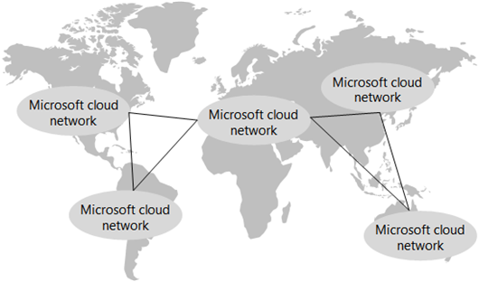

# Netzwerkfunktionen für die Contoso Corporation

 **Zusammenfassung:** Grundlegendes zur Definition und Elementen der Microsoft Hybrid Cloud.
  
Wenn Sie eine Cloud-inklusive Infrastruktur einführen, realisiert Netzwerktechniker Contoso die Verschiebung in die Möglichkeit, die Netzwerkverkehr zu cloudbasierten Diensten Reisen. Anstatt nur optimieren Datenverkehr auf lokalen Servern und Rechenzentren, muss gleich Aufmerksamkeit für die Optimierung der Datenverkehr von der Kante Internet und über das Internet.
  
## Contoso Netzwerkinfrastruktur

Contoso hat die folgende Netzwerkinfrastruktur, die in Abbildung 1 dargestellt ist.

  
**Abbildung 1: Contoso WAN-Infrastruktur**

  
Abbildung 1 zeigt die weltweiten Contoso-Niederlassungen sowie die WAN-Verbindungen der Regional- und Zweigstellen dazwischen.
  
Weitere Elemente des Netzwerks sind wie folgt:
  
- Lokales Netzwerk
    
    WAN-Verbindungen verbinden die zentrale Paris mit regionalen Standorten und regionale Büros und Zweigstellen in einer sternförmigen Konfiguration. Innerhalb jeder Office liefern Router Datenverkehr an Hosts oder drahtlose Zugriffspunkte auf Subnetze, die private IP-Adressbereichs verwenden.
    
- Internetverbindung
    
    Jede Niederlassung verfügt über eine eigene Internetkonnektivität über einen Proxyserver. Dies wird in der Regel als ein WAN implementiert Link zu einem lokalen ISP, die auch öffentliche IP-Adressen für den Proxyserver bereitstellt.
    
- Internetauftritt
    
    Contoso besitzt den öffentlichen Domänennamen "contoso.com". Die öffentliche Contoso-Website zum Bestellen von Produkten ist eine Gruppe von Servern in einer Internet verbundenen Datencenter in der Paris Campus. Contoso verwendet eine/24 bis / öffentliche IP-Adressbereich im Internet.
    
## Contoso app-Infrastruktur

Contoso wurde so konzipiert, die Anwendung und Server-Infrastruktur für Folgendes:
  
**Abbildung 2: Contoso Infrastruktur für interne Anwendungen**

  
- Zweigstellen verwenden lokale Cacheserver, um Dokumente und interne Websites zu speichern, auf die häufig zugegriffen wird.
    
- Regionale Hubs verwenden regionale Anwendungsserver für die Regions- und Zweigstellen. Diese Server synchronisieren mit Servern in der Unternehmenszentrale Paris.
    
- Auf dem Pariser Campus befinden sich die Rechenzentren mit den zentralen-Anwendungsservern, die das gesamte Unternehmen bedienen.
    
Für Benutzer in Zweigstellen- oder Regionalbüros können 60 % der von ihnen benötigten Ressourcen von den Zweigstellen- oder Regionalbüroservern bereitgestellt werden.
 Die weiteren 40 % der Ressourcenanforderungen werden über die WAN-Verbindung mit dem Pariser Campus abgedeckt.
  
## Contoso Netzwerk-Analyse

Hier sind die Ergebnisse der Contoso Analyse der Änderungen in ihrem Netzwerk soll, um die verschiedenen Arten von Microsoft Cloud-angeboten, benötigt:
  
|**SaaS cloud-angeboten: Office 365 und zur Abstimmung Dynamics 365**|**Azure PaaS: Mobile Anwendungen**|**Azure IaaS: Serverbasierte Arbeitslasten**|
|:-----|:-----|:-----|
|Erfolgreiche Akzeptanz SaaS-Dienste durch Benutzer hängt von hoher Verfügbarkeit und leistungsfähige Konnektivität mit dem Internet oder direkt an Microsoft Cloud Services.    Für mobile Benutzer wird angenommen, dass ihre aktuellen Internetzugang ausreichen.    Für Benutzer im Intranet Contoso muss jede Niederlassung analysiert und für den Durchsatz, mit dem Internet und Zeitangaben in Europa-Rechenzentrum von Microsoft Office 365 und zur Abstimmung Dynamics 365-Mandanten hosten optimiert werden.    |Damit Contoso seine Mobil- und Remotemitarbeiter besser unterstützen kann, werden Legacy-Apps und einige Dateifreigabewebsites überarbeitet und als Azure PaaS-Apps bereitgestellt. Für eine optimale Leistung plant Contoso die Bereitstellung der neuen Apps auf mehreren Azure-Rechenzentren weltweit. Azure Traffic Manager zum Senden von Client-App-Anforderungen (unabhängig davon, ob diese von einem mobilen Benutzer oder einem Computer in dem Büro stammen) an das nächste Azure-Rechenzentrum, das die App hostet.     Die IT-Abteilung müssen ihre Netzwerk Health monitoring-Lösung PaaS Anwendung Leistung und der Datenverkehr Verteilergruppe hinzufügen.   |Zum Verschieben einige Server Archivierung und der Vorversion aus den Datencentern Paris Campus und Hinzufügen von Servern zur Verarbeitung Ende Quartals nach Bedarf, plant Contoso virtuellen Maschinen mit in Azure Infrastructure Services verwenden.    Der Azure-virtuelle Netzwerke, die diesen Servern enthalten müssen für nicht überlappende Adressräume, DNS-routing und integrierte konzipiert.    Die IT-Abteilung muss diese neuen Server in ihr Netzwerkverwaltungs- und -überwachungssystem einbeziehen.
    |
   
## Contoso Verwendung von ExpressRoute

ExpressRoute ist eine dedizierte WAN-Verbindung von Ihrem Standort an einen Microsoft Speicherort Peers, der Ihr Netzwerk mit dem Microsoft-Cloud-Netzwerk verbindet. ExpressRoute Verbindungen bieten vorhersehbare Leistung und einer Betriebszeit von 99,9 % Vereinbarung zum SERVICELEVEL. .
  
Sie sind mit einer ExpressRoute-Verbindung mit dem Microsoft-Cloud-Netzwerk und allen Microsoft Datacenter Speicherorten in der gleichen Kontinent verbunden. Der Datenverkehr zwischen den Peers Cloud-Speicherort und dem Ziel-Microsoft-Rechenzentrum wird über das Microsoft Cloud-Netzwerk übertragen.
  
**Abbildung 3: Microsoft Cloud Network weltweit**

  
Abbildung 3 zeigt das miteinander verbundene Microsoft Cloud-Netzwerk für die unterschiedlichen Regionen weltweit. 
  
Mit ExpressRoute Premium können Sie alle Microsoft-Rechenzentren auf allen Kontinenten von einem beliebigen Microsoft-Peeringstandort auf einem beliebigen Kontinent erreichen. Der Datenverkehr zwischen Kontinenten erfolgt über das Microsoft Cloud-Netzwerk.
  
Basierend auf der Analyse der aktuellen und zukünftigen Datenverkehr zu Microsoft Cloud-angeboten, hat Contoso eine Bewertung Netzwerk ausgeführt und implementiert eine n: n-ExpressRoute (MPLS-basiert) Verbindung für den Zugriff auf Azure Ressourcen, mit privaten und öffentlichen peering Beziehungen, aus der zentrale Paris zum Microsoft Peers Speicherort in Europa.
  
Diese Verbindung bedeutet für die IT-Abteilung von Contoso:
  
- Gleichbleibende Leistung für die Verwaltung von verteilten Azure PaaS-Apps

    
    Alle von Contoso Anwendungsentwickler und Hauptinfrastruktur IT Administratoren sind in der Paris Campus. Mit Azure PaaS-apps in verschiedenen Azure Rechenzentren auf der ganzen Welt verteilten benötigt Contoso konsistente Leistung aus dem Paris Campus zum Verwalten der apps und ihre Speicherressourcen, die von TB von Dokumenten bestehen.
    
- Gleichbleibende Leistung für die Verwaltung von Servern in Azure IaaS

    
    Die Administratoren von Contoso Rechenzentrum befinden sich in der Paris Campus und die Servern im Azure bereitgestellt werden sind eine Erweiterung des Datencenters Paris. Contoso benötigt konsistente Leistung auf diese neuen Server für den Zugriff auf ältere apps und Archivspeicher und für die Verarbeitung von Ende des Quartals.
    
## Contoso Pfad zur cloud-Netzwerke Bereitschaft

Contoso verwendet die folgenden Schritte, um sein Netzwerk für die Microsoft-Cloud vorzubereiten:
  
1. Optimieren der Computer der Mitarbeiter für den Internetzugriff
    
    Einzelne Computer werden überprüft werden, um sicherzustellen, dass Folgendes in neuester Version installiert ist: TCP/IP-Stapel, Browser, NIC-Treiber sowie Sicherheits- und Betriebssystemupdates.

    
2. Analysieren der Internetnutzung in jedem Büro und ggf. mehr Bandbreite
    
    Jeder Office wird für die aktuelle Internet-Nutzung analysiert werden und Bandbreite der WAN-Verbindung wird erhöht, wenn 70 % oder höher Auslastung betrieben.
    
3. Analysieren der DMZ Systeme unter jedem Office für eine optimale Leistung
    
    Firewalls, Angriffserkennungssysteme und andere Systeme im Internetpfad werden hinsichtlich optimaler Leistung analysiert.
 Proxyserver werden nach Bedarf aktualisiert (Update oder Upgrade).
    
4. Hinzufügen von ExpressRoute Premium für den Pariser Campus
    
    Bietet einheitlichen Zugriff auf Azure-Ressourcen für die Verwaltung von Azure PaaS- und IaaS-Arbeitslasten.
    
5. Erstellen und Testen eines Azure Traffic Manager-Profils für Azure PaaS-Apps
    
    Es wird ein Azure Traffic Manager-Profil getestet, in dem die Leistungsroutingmethode verwendet wird, um Kenntnisse zur Verteilung von Internetdatenverkehr an regionale Standorte zu erlangen.

    
6. Reservieren von privaten Adressraum für Azure VNets
    
    Reservieren Sie entsprechend der Anzahl von prognostizierten kurz- und langfristigen Servern in Azure IaaS privaten Adressraum für virtuelle Azure-Netzwerke und deren Subnetze.

    
## See Also

[Contoso in der Microsoft-Cloud](contoso-in-the-microsoft-cloud.md)
  
[Ressourcen zur Cloud-IT-Architektur von Microsoft](microsoft-cloud-it-architecture-resources.md)

[Enterprise-Cloud-Roadmap von Microsoft: Ressourcen für IT-Entscheidungsträger](https://sway.com/FJ2xsyWtkJc2taRD)

