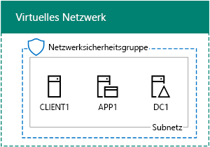

# <a name="office-365-devtest-environment"></a>Office 365-Entwicklungs-/Testumgebung

 **Zusammenfassung:** Verwenden Sie diese Test Lab Guide, um ein trial Office 365-Abonnement für Test- oder Test-/erstellen.
  
Sie können ein Office 365-Testabonnement verwenden und eine Office 365-Entwicklungs-/Testumgebung für Anwendungen erstellen oder Features und Funktionen von Office 365 demonstrieren. Es gibt zwei Versionen:
  
- Die einfache Office 365-Entwicklungs-/Testumgebung besteht aus einem Office 365-Testabonnement, auf das Sie von Ihrem Hauptcomputer aus zugreifen.
    
    Verwenden Sie diese Umgebung, wenn Sie schnell eine Funktion demonstrieren möchten. Führen Sie für die einfache Office 365 Test-/Umgebung nur Phasen 2 und 3 dieses Artikels.
    
- Die simulierte Office 365-Entwicklungs-/Testunternehmensumgebung besteht aus einem Office 365-Testabonnement und einem vereinfachtem Organisationsintranet mit Internetverbindung, das in Microsoft Azure-Infrastrukturdiensten gehostet wird. Sie können diese Konfiguration vollständig in der Microsoft-Cloud erstellen.
    
    Verwenden Sie diese Umgebung, wenn Sie ein Feature oder eine App in einer Umgebung demonstrieren möchten,die einem gewöhnlichen Organisationsnetzwerk mit Internetverbindung ähnelt, oder für Features, für die diese Art von Umgebung erforderlich ist. Führen Sie für die simulierte Office 365-Entwicklungs-/Testunternehmensumgebung die Schritte in Phasen 1, 2 und 3 dieses Artikels durch.
    
> [!NOTE]
> Sie können diesen Artikel auch ausdrucken, um die bestimmten Werte zu notieren, die Sie für diese Umgebung in den kommenden 30 Tage des Office 365-Testabonnements benötigen. Sie können das Testabonnement einfach um weitere 30 Tage verlängern. Für eine dauerhafte Entwicklungs-/Testumgebung erstellen Sie ein neues bezahltes Abonnement mit einer kleinen Anzahl von Lizenzen. 
  

  
> [!TIP]
> Klicken Sie [hier](http://aka.ms/catlgstack), um eine visuelle Darstellung aller Artikel im Stapel der Testumgebungsanleitungen in der Microsoft Cloud zu erhalten.
  
## <a name="phase-1-create-the-base-configuration-in-azure"></a>Phase 1: Erstellen der Basiskonfiguration in Azure

Befolgen Sie die Anweisungen in [Basiskonfiguration Test-/Umgebung](base-configuration-dev-test-environment.md)aus.
  
Sie benötigen ein Azure-Abonnement. Sie können die [Kostenlose Testversion von Azure](https://azure.microsoft.com/pricing/free-trial/) für diese Konfiguration verwenden. Wenn Sie ein MSDN oder Visual Studio-Abonnement haben, finden Sie unter [monatliche Azure Credit für Abonnenten von Visual Studio](https://azure.microsoft.com/pricing/member-offers/msdn-benefits-details/).
  
Nachfolgend sehen Sie die daraus resultierende Konfiguration.
  

  
Diese Konfiguration besteht aus virtuellen DC1-, APP1- und CLIENT1-Computern in einem Subnetz eines virtuellen Azure-Netzwerks.
  
## <a name="phase-2-create-an-office-365-trial-subscription"></a>Phase 2: Erstellen eines Office 365-Testabonnements

Für das Office 365 E5-Testabonnement benötigen Sie zunächst einen fiktiven Unternehmensnamen und ein neues Microsoft-Konto.
  
1. Es wird empfohlen, dass Sie einen Variant-Wert des Unternehmens namens "Contoso" für den Namen Ihres Unternehmens, die ein fiktives Unternehmen verwenden, die in Microsoft Beispielinhalte verwendet wird, aber es ist nicht erforderlich. Tragen Sie den Namen Ihres fiktiven Unternehmens hier:
    
2. Um für ein neues Microsoft-Konto anmelden, wechseln Sie zur [https://outlook.com](https://outlook.com) und erstellen Sie ein Konto mit einer neuen e-Mail-Konto und die Adresse. Sie verwenden dieses Konto für Office 365 anmelden.
    
  - Zeichnen Sie den ersten und letzten Namen Ihres neuen Kontos hier:
    
  - Zeichnen Sie die neue e-Mail-Kontoadresse hier: @outlook.com
    
### <a name="sign-up-for-an-office-365-e5-trial-subscription"></a>Registrieren für ein Office 365 E5-Testabonnement

1. Für die einfache Office 365 Dev/Test-Umgebung, öffnen Sie auf Ihrem Computer den Internetbrowser, und wechseln Sie zum [https://aka.ms/e5trial](https://aka.ms/e5trial). 
    
    Für die Test-/simulierten Enterprise Office 365-Umgebung:
    
  - Über das [Portal Azure](https://portal.azure.com)Herstellen einer Verbindung mit der CORP CLIENT1 mit\\Konto User1 an.
    
  - Öffnen Sie eine Windows PowerShell-Eingabeaufforderung auf Administratorebene, und führen Sie die folgenden Befehle aus:
    
  ```
  Set-ItemProperty -Path "HKLM:\\SOFTWARE\\Microsoft\\Active Setup\\Installed Components\\{A509B1A7-37EF-4b3f-8CFC-4F3A74704073}" -Name "IsInstalled" -Value 0
Set-ItemProperty -Path "HKLM:\\SOFTWARE\\Microsoft\\Active Setup\\Installed Components\\{A509B1A8-37EF-4b3f-8CFC-4F3A74704073}" -Name "IsInstalled" -Value 0
Stop-Process -Name Explorer -Force
  ```

    > [!TIP]
    > Klicken Sie auf [hier](https://gallery.technet.microsoft.com/PowerShell-commands-for-fe3d7a34) eine Textdatei ab, die PowerShell-Befehle in diesem Artikel enthält.
  
  - Klicken Sie auf der Startseite, klicken Sie auf **Internet Explorer** , und gehen Sie zu [https://aka.ms/e5trial](https://aka.ms/e5trial).
    
2. Geben Sie auf der Seite **Willkommen, fangen Sie wissen** :
    
  - Tatsächlicher Standort
    
  - Vor- und Nachname des neuen Microsoft-Kontos
    
  - Die neue E-Mail-Kontoadresse
    
  - Telefonnummer geschäftlich
    
  - Fiktiver Unternehmensname
    
  - Unternehmensgröße zwischen 250-999 Mitarbeitern
    
3. Klicken Sie auf **nur eine weitere Schritt**.
    
4. Geben Sie auf der Seite **Erstellen Ihrer Benutzer-ID** einen Benutzernamen, basierend auf Ihrer neuen e-Mail-Adresse, fiktiven Unternehmens nach dem @-Zeichen (Entfernen Sie alle Leerzeichen in den Namen), und klicken Sie dann ein Kennwort (zweimal) diese neue Office 365 berücksichtigt werden.
    
    Notieren Sie das verwendete Kennwort, und bewahren Sie es an einem sicheren Ort auf.
    
    Tragen Sie Ihre fiktiven Firmennamen an, die als **Name der Organisation**, hier verwiesen werden:
    
5. Klicken Sie auf **Mein Konto erstellen**.
    
6. Klicken Sie auf der **nachweisen. Sie sind. Nicht. A. Robot.** Seite, geben Sie die Telefonnummer des Text-fähigen Telefons ein und klicken Sie dann auf **Text mich**.
    
7. Geben Sie den Überprüfungscode aus der der empfangenen Textnachricht ein, und klicken Sie dann auf **Weiter**.
    
8. Tragen Sie die Anmeldeseite URL hier (auswählen und kopieren):
    
9. Notieren Sie die Benutzer-ID hier (aktivieren und Kopie): . onmicrosoft.com
    
    Dieser Wert wird als der **Office 365 globaler Administratornamen**bezeichnet werden.
    
10. Wenn **Sie bereit sind**angezeigt wird, klicken Sie darauf.
    
11. Klicken Sie auf der nächsten Seite warten Sie, bis Office 365 Einstellung einrichten Abschluss und alle Kacheln verfügbar sind.
    
Nun sollte die Hauptseite des Office 365-Portals angezeigt werden, über die Sie auf Office Online-Dienste und das Office 365 Admin Center zugreifen können.
  
So sieht die resultierende Konfiguration für die simulierte Office 365-Entwicklungs-/Testunternehmensumgebung aus.
  

  
Diese Konfiguration besteht aus:  
  
- Den virtuellen DC1-, APP1- und CLIENT1-Computern in einem Subnetz eines virtuellen Azure-Netzwerks
    
- Einem Office 365 E5-Testabonnement
    
## <a name="phase-3-configure-your-office-365-trial-subscription"></a>Phase 3: Konfigurieren des Office 365-Testabonnements

In dieser Phase konfigurieren Sie das Office 365-Abonnement mit zusätzlichen Benutzern und SharePoint Online-Teamwebsites.
  
Fügen Sie zunächst vier neue Benutzer hinzu, und weisen Sie ihnen E5-Lizenzen zu.
  
Verwenden Sie die Anweisungen in [Verbindung mit Office 365 PowerShell herstellen](https://technet.microsoft.com/library/dn975125.aspx) , installieren Sie die PowerShell-Module und eine Verbindung herstellen, um das neue Office 365-Abonnement aus:
  
- Ihrem Computer aus (für die einfache Office 365-Entwicklungs-/Testunternehmensumgebung).
    
- Dem virtuellen Computer CLIENT1 aus (für die simulierte Office 365-Entwicklungs-/Testumgebung).
    
 Geben Sie im Dialogfeld Windows PowerShell anmelden den Namen der Office 365 globaler Administrator (Beispiel: jdoe@contosotoycompany.onmicrosoft.com) und das Kennwort ein.
  
Geben Sie den Namen Ihrer Organisation (z. B. „contosotoycompany“) und den zweistelligen Ländercode für Ihren Standort ein. Führen Sie dann über die Eingabeaufforderung des Windows Azure Active Directory-Moduls für Windows PowerShell die folgenden Befehle aus:
  
```
$orgName="<organization name>"
$loc="<two-character country code, such as US>"
$licAssignment= $orgName + ":ENTERPRISEPREMIUM"
$userName= "user2@" + $orgName + ".onmicrosoft.com"
New-MsolUser -DisplayName "User 2" -FirstName User -LastName 2 -UserPrincipalName $userName -UsageLocation $loc -LicenseAssignment $licAssignment
```

Beachten Sie aus der Anzeige des Befehls **New-MsolUser** das generierte Kennwort für das Konto des Benutzers 2, und tragen sie Sie an einem sicheren Ort.
  
Führen Sie über die „Windows Azure Active Directory-Modul für Windows PowerShell“-Eingabeaufforderung die folgenden Befehle aus:
  
```
$userName= "user3@" + $orgName + ".onmicrosoft.com"
New-MsolUser -DisplayName "User 3" -FirstName User -LastName 3 -UserPrincipalName $userName -UsageLocation $loc -LicenseAssignment $licAssignment
```

Beachten Sie aus der Anzeige des Befehls **New-MsolUser** das generierte Kennwort für das Konto des Benutzers 3, und tragen sie Sie an einem sicheren Ort.
  
Führen Sie über die „Windows Azure Active Directory-Modul für Windows PowerShell“-Eingabeaufforderung die folgenden Befehle aus:
  
```
$userName= "user4@" + $orgName + ".onmicrosoft.com"
New-MsolUser -DisplayName "User 4" -FirstName User -LastName 4 -UserPrincipalName $userName -UsageLocation $loc -LicenseAssignment $licAssignment
```

Beachten Sie aus der Anzeige des Befehls **New-MsolUser** das generierte Kennwort für das Konto des Benutzers 4, und tragen sie Sie an einem sicheren Ort.
  
Führen Sie über die „Windows Azure Active Directory-Modul für Windows PowerShell“-Eingabeaufforderung die folgenden Befehle aus:
  
```
$userName= "user5@" + $orgName + ".onmicrosoft.com"
New-MsolUser -DisplayName "User 5" -FirstName User -LastName 5 -UserPrincipalName $userName -UsageLocation $loc -LicenseAssignment $licAssignment
```

Beachten Sie aus der Anzeige des Befehls **New-MsolUser** das generierte Kennwort für das Konto des Benutzers 5, und tragen sie Sie an einem sicheren Ort.
  
Im nächsten Schritt erstellen Sie drei neue SharePoint Online-Teamwebsites für die Abteilungen Sales, Produktion und Support.
  
### <a name="create-three-new-sharepoint-online-team-sites"></a>Erstellen von drei neuen SharePoint Online-Teamwebsites

1. Installieren Sie die [SharePoint Online-Verwaltungsshell](https://go.microsoft.com/fwlink/p/?LinkId=255251) (die X64 Version).
    
2. Klicken Sie auf **Start**, geben Sie **Sharepoint**, und klicken Sie dann auf **SharePoint Online-Verwaltungsshell**.
    
3. Geben Sie den Namen Ihrer Organisation ein (Beispiel: contosotoycompany), und führen Sie dann über die Eingabeaufforderung der SharePoint Online-Verwaltungsshell die folgenden Befehle aus, um eine Verbindung mit dem SharePoint Online-Dienst herzustellen.
```
$orgName="<organization name>"
$spURL="https://" + $orgName + "-admin.sharepoint.com"
Connect-SPOService -Url $spURL
```

4. Geben Sie im Dialogfeld **Microsoft SharePoint Online-Verwaltungsshell** den Namen der Office 365 globaler Administrator (Beispiel: jdoe@contosotoycompany.onmicrosoft.com) und das Kennwort ein, und klicken Sie dann auf **Anmelden**.
    
5. Drei neue Teamwebsites erstellen (Vertrieb, Produktions- und Support), geben Sie den Namen der Office 365 globaler Administrator, und führen Sie die folgenden Befehle aus der SharePoint Online-Verwaltungsshell Aufforderung:
    
  ```
  $owner = "<global administrator account name>"
$siteURL = "https://" + $orgName + ".sharepoint.com/sites/sales"
New-SPOSite -Url $siteURL -Owner $owner -StorageQuota 1000 -Title "Sales site collection" -Template "STS#0"
$siteURL = "https://" + $orgName + ".sharepoint.com/sites/production"
New-SPOSite -Url $siteURL -Owner $owner -StorageQuota 1000 -Title "Production site collection" -Template "STS#0"
$siteURL = "https://" + $orgName + ".sharepoint.com/sites/support"
New-SPOSite -Url $siteURL -Owner $owner -StorageQuota 1000 -Title "Support site collection" -Template "STS#0"
  ```

6. Führen Sie diesen Befehl aus, um die URLs der neuen Websites abzurufen:
    
  ```
  Get-SPOSite | Where URL -like "*/sites/*" | Sort URL | Select URL
  ```

7. Geben Sie im Internet Explorer die URL der Website „Produktion“ ein, um die standardmäßige SharePoint Online-Teamwebsite für die Abteilung „Produktion“ anzuzeigen.
    
## <a name="record-values-for-future-reference"></a>Notieren von Werten für zukünftige Verwendung

Notieren Sie die folgenden Werte für die Arbeit mit oder Bereitstellen von zusätzlichen Leitfäden für Test Lab in dieser Testumgebung:
  
- Office 365 globaler Administratorname: . onmicrosoft.com (aus Schritt 9 von Phase 2)
    
    Notieren Sie auch das Kennwort für dieses Konto, und bewahren Sie es an einem sicheren Ort auf.
    
- Der Name der Organisation Ihre Testversion:  (aus Schritt 4 von Phase 2)
    
- Führen Sie über die „Windows Azure Active Directory-Modul für Windows PowerShell“-Eingabeaufforderung den folgenden Befehl aus, um die Konten für Benutzer 2, Benutzer 3, Benutzer 4 und Benutzer 5 anzuzeigen:
    
  ```
  Get-MSolUser | Sort UserPrincipalName | Select UserPrincipalName
  ```

    Notieren Sie hier die Kontonamen:
    
  - Benutzerkontonamen 2: Benutzer2 @. onmicrosoft.com
    
  - Benutzerkontonamen 3: user3 @. onmicrosoft.com
    
  - Benutzerkontonamen 4: user4 @. onmicrosoft.com
    
  - Benutzerkontonamen 5: user5 @. onmicrosoft.com
    
    Notieren Sie auch die Kennwörter für diese Konten, und bewahren Sie sie an einem sicheren Ort auf.
    
- Führen Sie über die Eingabeaufforderung der SharePoint Online-Verwaltungsshell den folgenden Befehl aus, um die URLs für die Teamwebsites „Sales“, „Produktion“ und „Support“ anzuzeigen:
    
  ```
  Get-SPOSite | Where URL -like "*/sites/*" | Sort URL | Select URL
  ```

  - Produktions-Website-URL: https://.sharepoint.com/sites/production
    
  - Sales Website-URL: https://.sharepoint.com/sites/sales
    
  - Unterstützung von Website-URL: https://.sharepoint.com/sites/support
    
## <a name="next-steps"></a>Nächste Schritte

Verwenden Sie die folgenden zusätzlichen Artikel in Ihrer Office 365-Entwicklungs-/Testumgebung:
  
- [Directory-Synchronisierung für Ihre Office 365 Dev/Test-Umgebung](dirsync-for-your-office-365-dev-test-environment.md)
    
- [Multi-Factor Authentication für die Office 365-Entwicklungs-/Testumgebung](multi-factor-authentication-for-your-office-365-dev-test-environment.md)
    
- [Verbundidentität für Ihre Office 365-Entwicklungs-/Testumgebung](federated-identity-for-your-office-365-dev-test-environment.md)
    
- [Cloud App Security für Ihre Office 365-Entwicklungs-/Testumgebung](cloud-app-security-for-your-office-365-dev-test-environment.md)
    
- [Advanced Threat Protection für die Office 365-Entwicklungs-/Testumgebung](advanced-threat-protection-for-your-office-365-dev-test-environment.md)
    
- [Advanced eDiscovery für die Office 365-Entwicklungs-/Testumgebung](advanced-ediscovery-for-your-office-365-dev-test-environment.md)
    
- [Schutz vertraulicher Dateien in Office 365-Entwicklungs-/-Testumgebungen](sensitive-file-protection-in-the-office-365-dev-test-environment.md)
    
- [Isolierte SharePoint Online-Teamwebsite in Ihrer Office 365-Entwicklungs-/Testumgebung](isolated-sharepoint-online-team-site-dev-test-environment.md)
    
- [Datenklassifizierung und -kennzeichnung in Office 365-Entwicklungs-/-Testumgebungen](data-classification-and-labeling-in-the-office-365-dev-test-environment.md)
    
Erweitern Sie Ihre Office 365-Entwicklungs-/Testumgebung um zusätzliche Microsoft-Cloudangebote:
  
- [Die Microsoft 365 Enterprise-Entwicklungs-/Testumgebung](the-microsoft-365-enterprise-dev-test-environment.md)
    
- [Office 365- und Dynamics 365-Entwicklungs-/Testumgebung](office-365-and-dynamics-365-dev-test-environment.md)
    
## <a name="see-also"></a>Siehe auch

- [Testumgebungsanleitungen (TLGs) zur Cloudakzeptanz](cloud-adoption-test-lab-guides-tlgs.md)
  
- [Office 365- und Dynamics 365-Entwicklungs-/Testumgebung](office-365-and-dynamics-365-dev-test-environment.md)
  
 - [Cloudakzeptanz und Hybridlösungen](cloud-adoption-and-hybrid-solutions.md)


