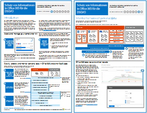

# Schutz von Informationen in Office 365 für die DSGVO

 **Zusammenfassung:** Diese Lösung veranschaulicht, wie vertrauliche Daten, die in Office 365-Diensten gespeichert sind, geschützt werden können.
  
Diese bietet Empfehlungen zum Ermitteln, Klassifizieren, Schützen und Überwachen von personenbezogenen Daten. Dabei wird die Datenschutz-Grundverordnung (DSGVO) als Beispiel verwendet, Sie können das Verfahren jedoch auch für die Einhaltung vieler anderer Bestimmungen nutzen.

  
[PDF](http://download.microsoft.com/download/E/C/D/ECD5A339-EF10-4420-B3A9-99098884D716/MSFT_Cloud_architecture_information protection for GDPR.pdf)  | [Visio](http://download.microsoft.com/download/E/C/D/ECD5A339-EF10-4420-B3A9-99098884D716/MSFT_Cloud_architecture_information protection for GDPR.vsdx)
  

## Siehe auch

[Sicherheitslösungen](security-solutions.md)
  
[Microsoft-Sicherheitsleitfaden für politische Kampagnen, gemeinnützigen Organisationen und andere agile Organisationen](microsoft-security-guidance-for-political-campaigns-nonprofits-and-other-agile-o.md)

