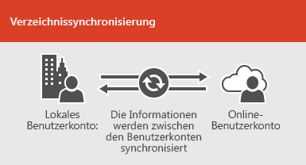
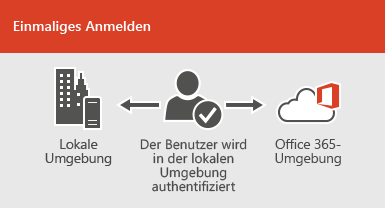

# Microsoft 365-Integration in lokale UmgebungenMicrosoft 365 integration with on-premises environments

*Dieser Artikel bezieht sich sowohl auf Microsoft 365 Enterprise als auch auf Office 365 Enterprise.**This article applies to both Microsoft 365 Enterprise and Office 365 Enterprise.*

Sie können Microsoft 365 mit Ihren vorhandenen Verzeichnisdiensten und mit einer lokalen Installation von Exchange Server, Skype for Business Server 2015 oder SharePoint Server integrieren.You can integrate Microsoft 365 with your existing directory services and with an on-premises installation of Exchange Server, Skype for Business Server 2015, or SharePoint Server.
  
 - Wenn Sie die Integration in die Verzeichnisdienste durchführen, können Sie Benutzerkonten für beide Umgebungen synchronisieren und verwalten.When you integrate with directory services, you can synchronize and manage user accounts for both environments. Sie können auch die Kennworthashsynchronisierung oder das einmalige Anmelden (Single Sign-on, SSO) hinzufügen, damit sich die Benutzer mit Ihren lokalen Anmeldeinformationen bei beiden Umgebungen anmelden können.You can also add password hash synchronization or single sign-on (SSO) so users can log on to both environments with their on-premises credentials.
 - Bei der Integration in lokale Serverprodukte erstellen Sie eine Hybridumgebung.When you integrate with on-premises server products, you create a hybrid environment. Eine Hybridumgebung kann bei der Migration von Benutzern oder Informationen zu Microsoft 365 helfen, oder Sie können weiterhin einige Benutzer oder einige lokale Informationen und einige in der Cloud haben.A hybrid environment can help as you migrate users or information to Microsoft 365, or you can continue to have some users or some information on-premises and some in the cloud. Weitere Informationen zu Hybridumgebungen finden Sie unter [Übersicht über die Hybridcloud](https://docs.microsoft.com/Office365/Enterprise/hybrid-cloud-overview).For more information about hybrid environments, see [Hybrid cloud overview](https://docs.microsoft.com/Office365/Enterprise/hybrid-cloud-overview).

Sie können auch die Azure Active Directory (Azure AD)-Ratgeber für angepasste Setup Anleitungen verwenden (Sie müssen bei Microsoft 365 angemeldet sein):You can also use the Azure Active Directory (Azure AD) advisors for customized setup guidance (you must be signed in to Microsoft 365):

- [Synchronisieren von Benutzern aus dem Verzeichnis Ihrer OrganisationSync users from your org's directory](https://aka.ms/aadconnectpwsync)
- [Bereitstellungsratgeber für AD FSAD FS deployment advisor](https://aka.ms/adfsguidance)
- [Azure AD-InstallationshandbuchAzure AD setup guide](https://aka.ms/aadpguidance)
   
## Bevor Sie beginnenBefore you begin

Bevor Sie Microsoft 365 und eine lokale Umgebung integrieren, müssen Sie auch an der [Netzwerkplanung und der Leistungsoptimierung](network-planning-and-performance.md)teilnehmen.Before you integrate Microsoft 365 and an on-premises environment, you also need to attend to [network planning and performance tuning](network-planning-and-performance.md). Außerdem ist es wichtig, dass Sie die verfügbaren [Identitätsmodelle](about-office-365-identity.md) verstehen.You will also want to understand the available [identity models](about-office-365-identity.md). 

Eine Liste der Tools, die Sie zum Verwalten von Microsoft 365-Benutzern und-Konten verwenden können, finden Sie unter [Verwalten von Microsoft 365-Konten](manage-office-365-accounts.md) .See [where to manage Microsoft 365 accounts](manage-office-365-accounts.md) for a list of tools you can use to manage Microsoft 365 users and accounts. 
  
## Integrieren von Microsoft 365 mit VerzeichnisdienstenIntegrate Microsoft 365 with directory services
Wenn Sie über vorhandene Benutzerkonten in einem lokalen Verzeichnis verfügen, möchten Sie nicht alle diese Konten in Microsoft 365 neu erstellen und möglicherweise Unterschiede oder Fehler zwischen den Umgebungen einführen.If you have existing user accounts in an on-premises directory, you don't want to re-create all of those accounts in Microsoft 365 and risk introducing differences or errors between the environments. Mithilfe der Verzeichnissynchronisierung können Sie diese Konten zwischen der Onlineumgebung und der lokalen Umgebung spiegeln.Directory synchronization helps you mirror those accounts between your online and on-premises environments. Bei der Verzeichnissynchronisierung müssen sich die Benutzer nicht neue Informationen zu jeder Umgebung merken, und Sie brauchen die Konten nicht zweimal zu erstellen oder zu aktualisieren.With directory synchronization, your users don't have to remember new information for each environment, and you don't have to create or update accounts twice. Sie müssen [Ihr lokales Verzeichnis für die Verzeichnissynchronisierung vorbereiten](prepare-for-directory-synchronization.md). Sie können dies manuell tun oder das [IdFix-Tool](install-and-run-idfix.md) verwenden (das IdFix-Tool funktioniert nur mit Active Directory Domain Services [AD DS]).You will need to [prepare your on-premises directory](prepare-for-directory-synchronization.md) for directory synchronization, you can do this manually or use the [IdFix tool](install-and-run-idfix.md) (IdFix tool only works with Active Directory Domain Services [AD DS]). 
  

  
Wenn Sie möchten, dass sich Benutzer bei Microsoft 365 mit Ihren lokalen Anmeldeinformationen anmelden können, können Sie auch SSO konfigurieren.If you want users to be able to log on to Microsoft 365 with their on-premises credentials, you can also configure SSO. Mit SSO wird Microsoft 365 so konfiguriert, dass die lokale Umgebung für die Benutzerauthentifizierung vertrauenswürdig ist.With SSO, Microsoft 365 is configured to trust the on-premises environment for user authentication.
  

  
Unterschiedliche Techniken der Benutzerkontenverwaltung bieten Ihren Benutzern unterschiedliche Erfahrungen, wie in der nachstehenden Tabelle gezeigt wird.Different user account management techniques provide different experiences for your users, as shown in the following table.
 
### Verzeichnissynchronisierung mit oder ohne Kennworthashsynchronisierung oder Passthrough-AuthentifizierungDirectory synchronization with or without password hash synchronization or pass-through authentication

Ein Benutzer meldet sich mit seinem Benutzerkonto (domäne\benutzername) bei seiner lokalen Umgebung an.A user logs on to their on-premises environment with their user account (domain\username). Wenn Sie zu Microsoft 365 wechseln, müssen Sie sich mit Ihrem Arbeits-oder Schulkonto (User@Domain.com) erneut anmelden.When they go to Microsoft 365, they must log on again with their work or school account (user@domain.com). Der Benutzername ist in beiden Umgebungen identisch.The user name is the same in both environments. Wenn Sie Kennworthash Synchronisierung oder Pass-Through-Authentifizierung hinzufügen, verfügt der Benutzer über dasselbe Kennwort für beide Umgebungen, muss diese Anmeldeinformationen jedoch erneut bereitstellen, wenn er sich bei Microsoft 365 anmeldet.When you add password hash sync or pass-through authentication, the user has the same password for both environments, but will have to provide those credentials again when logging on to Microsoft 365. Verzeichnissynchronisierung mit Kennworthashsynchronisierung ist das am häufigsten verwendete Szenario der Verzeichnissynchronisierung.Directory synchronization with password hash sync is the most commonly used directory sync scenario.

Verwenden Sie Azure Active Directory Connect, um die Verzeichnissynchronisierung einzurichten.To set up directory synchronization, use Azure Active Directory Connect. Anweisungen finden Sie unter [Einrichten der Verzeichnissynchronisierung für Microsoft 365](set-up-directory-synchronization.md)und [Azure AD Verbindung mit Express-Einstellungen](https://go.microsoft.com/fwlink/p/?LinkId=698537).For instructions, read [Set up directory synchronization for Microsoft 365](set-up-directory-synchronization.md), and [Azure AD Connect with express settings](https://go.microsoft.com/fwlink/p/?LinkId=698537).

Erfahren Sie mehr über die [Vorbereitung der Verzeichnissynchronisierung auf Microsoft 365](prepare-for-directory-synchronization.md) und [die Integration Ihrer lokalen identifiziert sich mit Azure Active Directory](https://go.microsoft.com/fwlink/?LinkId=518101).Learn more about [preparing for directory synchronization to Microsoft 365](prepare-for-directory-synchronization.md) and [integrating your on-premises identifies with Azure Active Directory](https://go.microsoft.com/fwlink/?LinkId=518101).

### Verzeichnissynchronisierung mit SSODirectory synchronization with SSO

Ein Benutzer meldet sich mit seinem Benutzerkonto bei seiner lokalen Umgebung an.A user logs on to their on-premises environment with their user account. Wenn Sie zu Microsoft 365 wechseln, werden Sie entweder automatisch angemeldet, oder Sie melden sich mit den gleichen Anmeldeinformationen an, die Sie für Ihre lokale Umgebung verwenden (Domäne \ Benutzername).When they go to Microsoft 365, they are either logged on automatically, or they log on using the same credentials they use for their on-premises environment (domain\username).

Zum Einrichten von SSO verwenden Sie ebenfalls Azure Active Directory Connect.To set up SSO you also use Azure AD Connect. Anweisungen finden Sie unter [Benutzerdefinierte Installation von Azure AD Connect](https://go.microsoft.com/fwlink/p/?LinkID=698430).For instructions, read [Custom installation of Azure AD Connect](https://go.microsoft.com/fwlink/p/?LinkID=698430).

Weitere Informationen zum [einmaligen Anmelden bei Anwendungen in Azure Active Directory](https://go.microsoft.com/fwlink/p/?LinkId=698604).Learn more about [single sign-on to applications in Azure Active Directory](https://go.microsoft.com/fwlink/p/?LinkId=698604).

## Azure AD ConnectAzure AD Connect

Azure AD Connect ersetzt ältere Versionen von Identitätsintegrationstools wie DirSync und Azure AD Sync. Weitere Informationen finden Sie unter [Was bedeutet Hybrididentität in Azure Active Directory?](https://go.microsoft.com/fwlink/p/?LinkId=527969).Azure AD Connect replaces older versions of identity integration tools such as DirSync and Azure AD Sync. For more information, see [What is hybrid identity with Azure Active Directory?](https://go.microsoft.com/fwlink/p/?LinkId=527969). Informationen zum Aktualisieren von Azure AD Sync auf Azure AD Connect finden Sie in den [Aktualisierungsanweisungen](https://go.microsoft.com/fwlink/p/?LinkId=733240).If you want to update from Azure Active Directory Sync to Azure AD Connect, see [the upgrade instructions](https://go.microsoft.com/fwlink/p/?LinkId=733240). 

Siehe auch [Bereitstellen der Microsoft 365-Verzeichnissynchronisierung in Microsoft Azure](https://go.microsoft.com/fwlink/?LinkId=517887).Also see [Deploy Microsoft 365 Directory Synchronization in Microsoft Azure](https://go.microsoft.com/fwlink/?LinkId=517887).

## Siehe auchSee also

[Übersicht zu Microsoft 365 EnterpriseMicrosoft 365 Enterprise overview](https://docs.microsoft.com/microsoft-365/enterprise/microsoft-365-overview)
