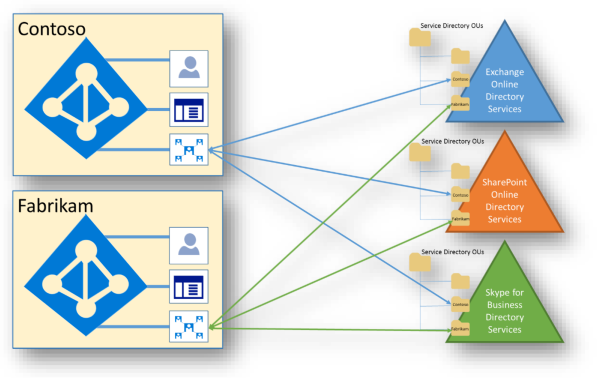

# Isolierung und Zugriffskontrolle in Office 365Isolation and Access Control in Office 365

Azure Active Directory und Office 365 verwenden ein hoch komplexes Datenmodell, das Dutzende von Diensten, Hunderte von Entitäten, Tausende von Beziehungen und Zehntausende von Attributen umfasst.Azure Active Directory and Office 365 use a highly complex data model that includes tens of services, hundreds of entities, thousands of relationships, and tens of thousands of attributes. Auf hoher Ebene sind Azure Active Directory und die Dienst Verzeichnisse die Container von Mandanten und Empfängern, die mithilfe von statusbasierten Replikationsprotokollen synchron gehalten werden.At a high level, Azure Active Directory and the service directories are the containers of tenants and recipients kept in sync using state-based replication protocols. Zusätzlich zu den Verzeichnisinformationen, die in Azure Active Directory aufbewahrt werden, verfügen alle Dienst Arbeitslasten über eine eigene Verzeichnisdienst-Infrastruktur.In addition to the directory information held within Azure Active Directory, each of the service workloads have their own directory services infrastructure.
 

In diesem Modell gibt es keine einzelne Quelle für Verzeichnisdaten.Within this model, there is no single source of directory data. Bestimmte Systeme besitzen einzelne Daten, aber kein einzelnes System besitzt alle Daten.Specific systems own individual pieces of data, but no single system holds all the data. Office 365 Dienste kooperieren mit Azure Active Directory in diesem Datenmodell.Office 365 services cooperate with Azure Active Directory in this data model. Azure Active Directory ist das "System der Wahrheit" für freigegebene Daten, bei dem es sich typischerweise um kleine und statische Daten handelt, die von jedem Dienst verwendet werden.Azure Active Directory is the "system of truth" for shared data, which is typically small and static data used by every service. Das in Office 365 und Azure Active Directory verwendete Verbundmodell stellt die freigegebene Ansicht der Daten bereit.The federated model used within Office 365 and Azure Active Directory provides the shared view of the data.

Office 365 verwendet sowohl physischen Speicher als auch Azure-Cloud-Speicher.Office 365 uses both physical storage and Azure cloud storage. Exchange Online (einschließlich Exchange Online Schutz) und Skype for Business ihren eigenen Speicher für Kundendaten verwenden.Exchange Online (including Exchange Online Protection) and Skype for Business use their own storage for customer data. SharePoint Online verwendet sowohl SQL Server Speicher als auch Azure-Speicher, daher ist die zusätzliche Isolierung von Kundendaten auf Speicherebene erforderlich.SharePoint Online uses both SQL Server storage and Azure Storage, hence the need for additional isolation of customer data at the storage level.

## Exchange OnlineExchange Online

Exchange Online speichert Kundendaten in Postfächern.Exchange Online stores customer data within mailboxes. Postfächer werden in ESE-Datenbanken (Extensible Storage Engine) als Postfachdatenbanken gehostet.Mailboxes are hosted within Extensible Storage Engine (ESE) databases called mailbox databases. Dies umfasst Benutzerpostfächer, verknüpfte Postfächer, freigegebene Postfächer und Postfächer für Öffentliche Ordner.This includes user mailboxes, linked mailboxes, shared mailboxes, and public folder mailboxes. Zu den Benutzerpostfächern gehören gespeicherte Skype for Business Inhalte wie Unterhaltungs Verläufe.User mailboxes include saved Skype for Business content, such as conversation histories.

Der Inhalt des Benutzerpostfachs umfasst Folgendes:User mailbox content includes:

- E-Mails und e-Mail-AnhängeEmails and email attachments
- Kalender-und Frei/Gebucht-InformationenCalendaring and free/busy information
- KontakteContacts
- AufgabenTasks
- NotesNotes
- GruppenGroups
- Rückschluss DatenInference data

Jede Postfachdatenbank in Exchange Online enthält Postfächer von mehreren Mandanten.Each mailbox database within Exchange Online contains mailboxes from multiple tenants. Ein Autorisierungscode sichert jedes Postfach, auch innerhalb eines Mandanten.An authorization code secures each mailbox, including within a tenancy. Standardmäßig hat nur der zugewiesene Benutzer Zugriff auf ein Postfach.By default, only the assigned user has access to a mailbox. Die Zugriffssteuerungsliste (Access Control List, ACL), die ein Postfach sichert, enthält eine von Azure Active Directory auf Mandantenebene authentifizierte Identität.The access control list (ACL) that secures a mailbox contains an identity authenticated by Azure Active Directory at the tenant level. Die Postfächer für jeden Mandanten sind auf Identitäten beschränkt, die für den Authentifizierungsanbieter des Mandanten authentifiziert wurden, der nur Benutzer von diesem Mandanten enthält.The mailboxes for each tenant are limited to identities authenticated against the tenant's authentication provider, which includes only users from that tenant. Inhalte in Mandant a können von Benutzern in Mandant B nicht in irgendeiner Weise abgerufen werden, es sei denn, Sie werden von Mandanten a ausdrücklich genehmigt.Content in tenant A cannot in any way be obtained by users in tenant B, unless explicitly approved by tenant A.

## Skype for BusinessSkype for Business

Skype for Business speichert Daten an verschiedenen Stellen:Skype for Business stores data in various places:

- Benutzer-und Kontoinformationen, einschließlich Verbindungs Endpunkten, Mandanten-IDs, Wähleinstellungen, Roamingeinstellungen, Anwesenheitsstatus, Kontaktlisten usw., werden auf den Skype for Business Active Directory Servern und in verschiedenen Skype for Business Datenbankservern gespeichert.User and account information, which includes connection endpoints, tenant IDs, dial plans, roaming settings, presence state, contact lists, etc., is stored in the Skype for Business Active Directory servers, and in various Skype for Business database servers. Kontaktlisten werden im Exchange Online Postfach des Benutzers gespeichert, wenn der Benutzer für beide Produkte aktiviert ist, oder auf Skype for Business Servern, wenn der Benutzer dies nicht tut.Contact lists are stored in the user's Exchange Online mailbox if the user is enabled for both products, or on Skype for Business servers if the user is not. Skype for Business Datenbankserver sind nicht partitioniert pro Mandanten, aber die mehrinstanzenfähige Isolierung von Daten wird über die rollenbasierte Zugriffssteuerung (Role-Based Access Control, RBAC) erzwungen.Skype for Business database servers are not partitioned per-tenant, but multi-tenancy isolation of data is enforced through role-based access control (RBAC).
- Besprechungsinhalte und hochgeladene Daten werden auf DFS-Freigaben (Distributed File System) gespeichert.Meeting content and uploaded data is stored on Distributed File System (DFS) shares. Dieser Inhalt kann auch in Exchange Online archiviert werden, wenn dieser aktiviert ist.This content can also be archived in Exchange Online if enabled. Die DFS-Freigaben werden nicht pro Mandant partitioniert.The DFS shares are not partitioned per-tenant. der Inhalt ist mit ACLs gesichert, und Mehrmandantenfähigkeit wird über RBAC erzwungen.the content is secured with ACLs and multi-tenancy is enforced through RBAC.
- Anruf Detaildatensätze, bei denen es sich um den Aktivitätsverlauf handelt, wie Anrufverlauf, Chatsitzungen, Anwendungsfreigabe, Chatverlauf usw., können auch in Exchange Online gespeichert werden, aber die meisten Anruf Detaildatensätze werden temporär auf KDS-Servern (Call Detail Record) gespeichert.Call detail records, which are the activity history, such as call history, IM sessions, application sharing, IM history, etc., can also be stored in Exchange Online, but most call detail records are temporarily stored on call detail record (CDR) servers. Inhalt wird nicht pro Mandant partitioniert, aber Mehrmandantenfähigkeit wird über RBAC erzwungen.Content is not partitioned per tenant, but multi-tenancy is enforced through RBAC.

## SharePoint OnlineSharePoint Online

SharePoint Online verfügt über mehrere unabhängige Mechanismen zur Datenisolierung.SharePoint Online has several independent mechanisms that provide data isolation. Sie speichert Objekte als abstrahierten Code in Anwendungsdatenbanken.It stores objects as abstracted code within application databases. Wenn ein Benutzer beispielsweise eine Datei in SharePoint Online hochlädt, wird die Datei zerlegt, in Anwendungscode übersetzt und in mehreren Tabellen über mehrere Datenbanken gespeichert.For example, when a user uploads a file to SharePoint Online, the file is disassembled, translated into application code, and stored in multiple tables across multiple databases.

Wenn ein Benutzer direkten Zugriff auf den Speicher erhält, der die Daten enthält, kann der Inhalt nicht für einen Menschen oder ein anderes System als SharePoint Online interpretiert werden.If a user could gain direct access to the storage containing the data, the content is not interpretable to a human or any system other than SharePoint Online. Diese Mechanismen umfassen Sicherheitszugriffssteuerung und Eigenschaften.These mechanisms include security access control and properties. Alle SharePoint Online Ressourcen werden durch den Autorisierungscode und die RBAC-Richtlinie gesichert, einschließlich innerhalb eines Mandanten.All SharePoint Online resources are secured by the authorization code and RBAC policy, including within a tenancy. Die Zugriffssteuerungsliste (Access Control List, ACL), die eine Ressource sichert, enthält eine auf Mandantenebene authentifizierte Identität.The access control list (ACL) that secures a resource contains an identity authenticated at the tenant level. SharePoint Online Daten für einen Mandanten sind auf vom Authentifizierungsanbieter für den Mandanten authentifizierte Identitäten limitiert.SharePoint Online data for a tenant is limited to identities authenticated by the authentication provider for the tenant.

Zusätzlich zu den ACLs wird eine Eigenschaft auf Mandantenebene, die den Authentifizierungsanbieter angibt (Dies ist die mandantenspezifische Azure-Active Directory), einmal geschrieben und kann nicht mehr geändert werden, nachdem Sie festgelegt wurde.In addition to the ACLs, a tenant level property that specifies the authentication provider (which is the tenant-specific Azure Active Directory), is written once and cannot be changed once set. Nachdem die Mandanten Eigenschaft des Authentifizierungsanbieters für einen Mandanten festgelegt wurde, kann Sie nicht mithilfe aller für einen Mandanten verfügbar gemachten APIs geändert werden.Once the authentication provider tenant property has been set for a tenant, it cannot be changed using any APIs exposed to a tenant.

Für jeden Mandanten wird eine eindeutige *Abonnement* -Nr verwendet.A unique *SubscriptionId* is used for each tenant. Alle Kunden Standorte befinden sich im Besitz eines Mandanten und weisen dem Mandanten eine eindeutige *Abonnement* -Nummer zu.All customer sites are owned by a tenant and assigned a *SubscriptionId* unique to the tenant. Die *Subscription* -Eigenschaft für eine Website wird einmal geschrieben und ist dauerhaft.The *SubscriptionId* property on a site is written once and is permanent. Nachdem eine Website einem Mandanten zugewiesen wurde, kann Sie nicht zu einem anderen Mandanten verschoben werden.Once assigned to a tenant, a site cannot be moved to a different tenant. Die *Abonnement* -Nr ist der Schlüssel, der zum Erstellen des Sicherheitsbereichs für den Authentifizierungsanbieter verwendet wird und an den Mandanten gebunden ist.The *SubscriptionId* is the key used to create the security scope for the authentication provider and is tied to the tenant.

SharePoint Online verwendet SQL Server und Azure-Speicher für die Speicherung von Inhaltsmetadaten.SharePoint Online uses SQL Server and Azure Storage for content metadata storage. Der Partitionsschlüssel für den Inhaltsspeicher lautet *Site* -Nr in SQL.The partition key for the content store is *SiteId* in SQL. Bei der Ausführung einer SQL-Abfrage verwendet SharePoint Online eine *Website* -Überprüfung, die als Teil einer *Abonnement* -Bestätigung auf Mandantenebene überprüft wurde.When running a SQL query, SharePoint Online uses a *SiteId* verified as part of a tenant-level *SubscriptionId* check.

SharePoint Online speichert verschlüsselte Dateiinhalte in Microsoft Azure BLOBs.SharePoint Online stores encrypted file content in Microsoft Azure blobs. Jede SharePoint Online Farm verfügt über ein eigenes Microsoft Azure Konto, und alle in Azure gespeicherten BLOBs werden einzeln mit einem Schlüssel verschlüsselt, der im SQL-Inhaltsspeicher gespeichert ist.Each SharePoint Online farm has its own Microsoft Azure account and all the blobs saved in Azure are encrypted individually with a key stored in the SQL content store. Der Verschlüsselungsschlüssel, der in Code von der Autorisierungs Schicht geschützt wird und nicht direkt für den Endbenutzer verfügbar gemacht wird.The encryption key protected in code by the authorization layer and not exposed directly to the end user. SharePoint Online verfügt über eine Echtzeitüberwachung, um zu erkennen, wann eine HTTP-Anforderung Daten für mehr als einen Mandanten liest oder schreibt.SharePoint Online has real-time monitoring to detect when an HTTP request reads or writes data for more than one tenant. Die Anforderungs-ID- *Abonnement* -ID wird anhand der *Abonnement* -ID der aufgerufenen Ressource nachverfolgt.The request identity *SubscriptionId* is tracked against the *SubscriptionId* of the accessed resource. Anforderungen für den Zugriff auf Ressourcen von mehr als einem Mandanten sollten niemals durch Endbenutzer geschehen.Requests to access resources of more than one tenant should never happen by end users. Dienstanforderungen in einer Umgebung mit mehreren Mandanten sind die einzige Ausnahme.Service requests in a multi-tenant environment are the only exception. Der Suchcrawler zieht beispielsweise Inhaltsänderungen für eine gesamte Datenbank gleichzeitig durch.For example, the search crawler pulls content changes for an entire database all at once. Dies umfasst normalerweise das Abfragen von Websites von mehr als einem Mandanten in einer einzelnen Dienstanforderung, was aus Effizienzgründen geschieht.This usually involves querying sites of more than one tenant in a single service request, which is done for efficiency reasons.
