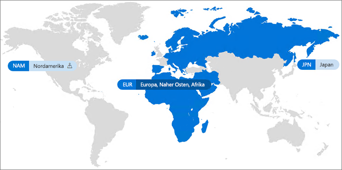

# Office 365 Multi-Geo

Mit Office 365 Multi-Geo kann Ihr Unternehmen seine Office 365-Präsenz auf mehrere geografische Regionen und/oder Länder innerhalb des vorhandenen Mandanten erweitern. Wenden Sie sich an Ihr Microsoft-Kontoteam, um Ihr multinationales Unternehmen für Office 365 Multi-Geo anzumelden.
  
Mit Office 365 Multi-Geo können Sie ruhende Daten an den Datenresistenz-Anforderungen entsprechenden geografischen Speicherorten bereitstellen und speichern und gleichzeitig die globale Bereitstellung moderner Produktivitätserfahrungen für Ihre Mitarbeiter in Gang setzen.

#### Video: Einführung in Multi-Geo in Office 365

> [!VIDEO https://www.microsoft.com/en-us/videoplayer/embed/RE1Yk6B?autoplay=false]

In einer Multi-Geo-Umgebung verfügt Ihr Office 365-Mandant über einen zentralen Standort (an dem Ihr Office 365-Abonnement ursprünglich bereitgestellt wurde) und über einen oder mehrere Satellitenstandort(e). Die Informationen über geografische Standorte, Gruppen und Benutzer eines Multi-Geo-Mandanten werden in Azure Active Directory (AAD) verwaltet. Da Ihre Mandanteninformationen zentral verwaltet und an jedem geografischen Speicherort synchronisiert werden, wird das globale Bewusstsein durch das Teilen von Informationen und Erfahrungen im gesamten Unternehmen erhöht.

Beachten Sie, dass Office 365 Multi-Geo nicht in erster Linie zur Leistungsoptimierung entwickelt wurde, sondern zur Einhaltung von Datenaufbewahrungsrichtlinien. Informationen zur Leistungsoptimierung vom Office 365 finden Sie unter [Netzwerkplanung und Leistungsoptimierung für Office 365](https://support.office.com/article/e5f1228c-da3c-4654-bf16-d163daee8848) oder kontaktieren Sie Ihre Supportgruppe.

## Terminologie

Dies sind die wichtigsten Begriffe für die Beschreibung von Office 365 Multi-Geo:

- **Zentraler Standort** – Der geografische Standort, an dem Ihr Mandant ursprünglich bereitgestellt wurde.
- **Geo-Administrator** – Ein Administrator, der einen oder mehrere der angegebenen Satellitenstandorte verwalten kann.
- **Geo-Code** – Eine Code aus drei Buchstaben für einen bestimmten Geo-Standort.
- **Geo-Standort** – Ein geografischer Standort, der in einem Multi-Geo-Mandanten verwendet werden kann, um Daten zu hosten, einschließlich Exchange-Postfächer und OneDrive- und SharePoint-Seiten.
- **Bevorzugter Datenspeicherort (PLD)** – Eine vom Administrator festgelegte Benutzereigenschaft, die angibt, an welchem geographischen Standort das Exchange-Postfach des Benutzers und OneDrive bereitgestellt werden sollen. Der PLD gibt außerdem an, wo vom Benutzer erstellte SharePoint-Seiten bereitgestellt werden.
- **Satelliten-Standort** – Der geographische Standort, an dem die Geo-fähigen Office 365-Arbeitslasten (SharePoint, OneDrive und Exchange) in einem Multi-Geo-Mandanten aktiviert sind.
- **Mandant** – Darstellung einer Organisation in der Office 365-Cloud, mit der in der Regel eine oder mehrere Domäne(n) verknüpft ist/sind (zum Beispiel contoso.com).

## Verfügbarkeit von Office 365 Multi-Geo

Office 365 Multi-Geo wird derzeit in diesen Regionen und Ländern angeboten:

[!INCLUDE [Office 365 Multi-Geo locations](includes/office-365-multi-geo-locations.md)]

## Erste Schritte

Gehen Sie folgendermaßen vor, um mit Multi-Geo loszulegen:

1. Arbeiten Sie mit Ihrem Kontoteam, um den Serviceplan für _Multi-Geo-Funktionen in Office 365_ hinzuzufügen. Sie werden angeleitet, die benötigten Lizenzen hinzuzufügen. Multi-Geo ist für Kunden mit mindestens 500 Office 365-Abonnements verfügbar.

   Bevor Sie mit der Verwendung von Office 365 Muli-Geo beginnen können, muss Ihr Exchange Online-Mandant durch Microsoft für die Unterstützung von Multi-Geo konfiguriert werden. Dieser einmalige Konfigurationsprozess wird ausgelöst, nach dem Sie den Service-Plan für *Multi-Geo Capabilities in Office 365* bestellt haben und die Lizenzen in Ihrem Mandanten angezeigt werden. Sie erhalten im [Office 365-Nachrichtencenter](https://support.office.com/article/38FB3333-BFCC-4340-A37B-DEDA509C2093) Benachrichtigungen, sobald Ihre Multi-Geo-Lizenzen angewendet werden und können dann mit dem Konfigurieren und Verwenden Ihrer Office 365 Multi-Geo-Funktionen beginnen.

2. Lesen Sie den Abschnitt [Planen Ihrer Multi-Geo-Umgebung](plan-for-multi-geo.md).

3. Erfahren Sie mehr über das [Verwalten einer Multi-Geo-Umgebung](administering-a-multi-geo-environment.md) und darüber, [wie Ihre Benutzer die Umgebung erleben](multi-geo-user-experience.md).

4. Wenn Sie für die Einrichtung von Office 365 Multi-Geo bereit sind, [konfigurieren Sie Ihren Mandanten für Multi-Geo](multi-geo-tenant-configuration.md).

5. [Einrichten der Suche](configure-search-for-multi-geo.md).

## Siehe auch

[Multi-Geo in Exchange Online und OneDrive](https://Aka.ms/GoMultiGeo)

[Multi-Geo-Funktionen in OneDrive und SharePoint Online](https://docs.microsoft.com/office365/enterprise/multi-geo-capabilities-in-onedrive-and-sharepoint-online-in-office-365)

[Multi-Geo-Funktionen in Exchange Online](https://docs.microsoft.com/office365/enterprise/multi-geo-capabilities-in-exchange-online)
