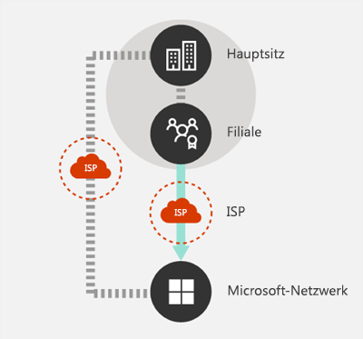
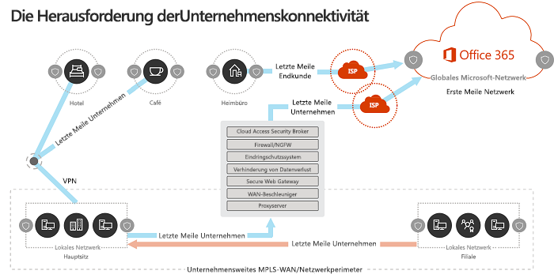
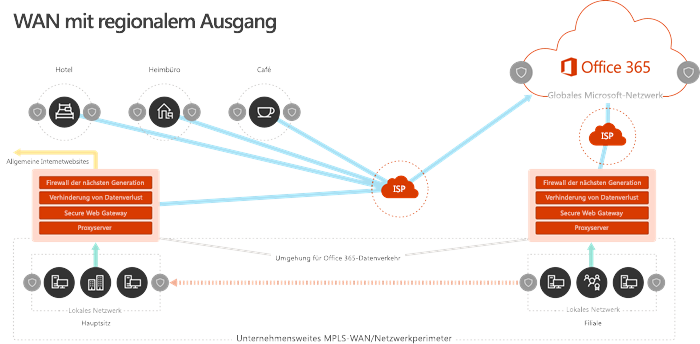
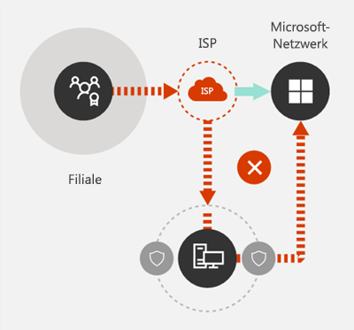
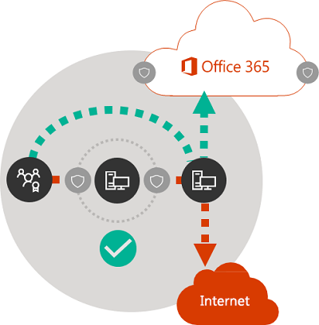

# Prinzipien von Office 365-NetzwerkverbindungenOffice 365 Network Connectivity Principles

Bevor Sie mit der Planung Ihres Netzwerks für die Netzwerkkonnektivität von Office 365 beginnen, sollten Sie sich mit den grundlegenden Prinzipien für die sichere Verwaltung von Office 365-Datenverkehr und optimale Leistung vertraut machen.Before you begin planning your network for Office 365 network connectivity, it is important to understand the connectivity principles for securely managing Office 365 traffic and getting the best possible performance. Dieser Artikel hilft Ihnen, die neuesten Richtlinien für die sichere Optimierung der Office 365-Netzwerkkonnektivität zu verstehen.This article will help you understand the most recent guidance for securely optimizing Office 365 network connectivity.
  
Herkömmliche Unternehmensnetzwerke sollen Benutzern den Zugriff auf Anwendungen und Daten ermöglichen, die in Unternehmen betrieben werden, die über eine starke Perimeter-Sicherheit verfügen.Traditional enterprise networks are designed primarily to provide users access to applications and data hosted in company operated datacenters with strong perimeter security. Das herkömmliche Modell geht davon aus, dass Benutzer auf Anwendungen und Daten innerhalb des Unternehmensnetzwerk Perimeters, über WAN-Verbindungen von Zweigstellen oder Remote über VPN-Verbindungen zugreifen.The traditional model assumes that users will access applications and data from inside the corporate network perimeter, over WAN links from branch offices, or remotely over VPN connections. 
  
Die Einführung von SaaS-Anwendungen wie Office 365 verschiebt eine Kombination aus Diensten und Daten außerhalb des Netzwerkperimeters.Adoption of SaaS applications like Office 365 moves some combination of services and data outside the network perimeter. Ohne Optimierung kann der Datenverkehr zwischen Benutzern und SaaS-Anwendungen durch eine Paketprüfung, Netzwerk Haarnadeln, versehentliche Verbindungen zu geografisch entfernten Endpunkten und anderen Faktoren beeinträchtigt werden.Without optimization, traffic between users and SaaS applications is subject to latency introduced by packet inspection, network hairpins, inadvertent connections to geographically distant endpoints and other factors. Sie können die beste Leistung und Zuverlässigkeit von Office 365 sicherstellen, indem Sie wichtige Optimierungsrichtlinien verstehen und implementieren.You can ensure the best Office 365 performance and reliability by understanding and implementing key optimization guidelines.
  
In diesem Artikel erfahren Sie mehr über:In this article, you will learn about:
  
- [Office 365-Architektur](office-365-network-connectivity-principles.md#BKMK_Architecture) für die Kundenanbindung an die Cloud[Office 365 architecture](office-365-network-connectivity-principles.md#BKMK_Architecture) as it applies to customer connectivity to the cloud
- Aktualisierte [Office 365](office-365-network-connectivity-principles.md#BKMK_Principles) -Konnektivitäts-Prinzipien und Strategien zur Optimierung des Netzwerkdatenverkehrs und der EndbenutzerumgebungUpdated [Office 365 connectivity principles](office-365-network-connectivity-principles.md#BKMK_Principles) and strategies for optimizing network traffic and the end user experience
- Der [Office 365-Endpunkte-Webdienst](office-365-network-connectivity-principles.md#BKMK_WebSvc), mit dem Netzwerkadministratoren eine strukturierte Liste von Endpunkten für die Netzwerkoptimierung nutzen könnenThe [Office 365 Endpoints web service](office-365-network-connectivity-principles.md#BKMK_WebSvc), which allows network administrators to consume a structured list of endpoints for use in network optimization
- [Neue Office 365-Endpunkt Kategorien](office-365-network-connectivity-principles.md#BKMK_Categories) und Optimierungsrichtlinien[New Office 365 endpoint categories](office-365-network-connectivity-principles.md#BKMK_Categories) and optimization guidance
- [Vergleichen der Netzwerkperimeter-Sicherheit mit der EndpunktsicherheitComparing network perimeter security with endpoint security](office-365-network-connectivity-principles.md#BKMK_SecurityComparison)
- [Inkrementelle Optimierungs](office-365-network-connectivity-principles.md#BKMK_IncOpt) Optionen für Office 365-Datenverkehr[Incremental optimization](office-365-network-connectivity-principles.md#BKMK_IncOpt) options for Office 365 traffic

## Office 365-ArchitekturOffice 365 architecture

Office 365 ist eine verteilte SaaS-Wolke (Software-as-a-Service), die Produktivitäts-und Zusammenarbeitsszenarien mithilfe einer Vielzahl von Mikro Diensten und Anwendungen wie Exchange Online, SharePoint Online, Skype for Business Online, Microsoft Teams, Exchange Online Protection, Office Online und viele andere.Office 365 is a distributed Software-as-a-Service (SaaS) cloud that provides productivity and collaboration scenarios through a diverse set of micro-services and applications, such as Exchange Online, SharePoint Online, Skype for Business Online, Microsoft Teams, Exchange Online Protection, Office Online and many others. Während bestimmte Office 365-Anwendungen Ihre eindeutigen Features aufweisen können, wie Sie für das Kundennetzwerk und die Konnektivität mit der Cloud gelten, teilen Sie alle die wichtigsten Prinzipale, Ziele und Architekturmuster.While specific Office 365 applications may have their unique features as it applies to customer network and connectivity to the cloud, they all share some key principals, goals and architecture patterns. Diese Prinzipale und Architekturmuster für die Konnektivität sind typisch für viele andere SaaS-Clouds und unterscheiden sich gleichzeitig von den typischen Bereitstellungsmodellen von Platt Form-as-a-Service-und Infrastruktur-as-a-Service-Clouds wie Microsoft Azure.These principals and architecture patterns for connectivity are typical for many other SaaS clouds and at the same time being quite different from the typical deployment models of Platform-as-a-Service and Infrastructure-as-a-Service clouds, such as Microsoft Azure.
  
Eines der bedeutendsten Architekturfeatures von Office 365 (das von Netzwerk Planern oft verfehlt oder falsch interpretiert wird) besteht darin, dass es sich um einen wirklich globalen, verteilten Dienst handelt, der im Kontext der Verbindung von Benutzern mit der Anwendung besteht.One of the most significant architectural features of Office 365 (that is often missed or misinterpreted by network planners) is that it is a truly global distributed service, in the context of how users connect to it. Der Speicherort des Ziel-Office 365-Mandanten ist wichtig, um zu verstehen, wo Kundendaten in der Cloud gespeichert sind, aber die Benutzererfahrung mit Office 365 beinhaltet nicht die direkte Verbindung mit Datenträgern, die mit diesen Informationen verbunden sind.The location of the target Office 365 tenant is important to understand the locality of where customer data is stored within the cloud, but the user experience with Office 365 doesn't involve connecting directly to disks containing the data. Die Benutzererfahrung mit Office 365 (einschließlich Leistung, Zuverlässigkeit und anderen wichtigen Qualitätsmerkmalen) umfasst die Konnektivität über eine hoch verteilte Dienst Front, die an Hunderten von Microsoft-Standorten weltweit skaliert wird.The user experience with Office 365 (including performance, reliability and other important quality characteristics) involves connectivity through a highly distributed service front doors that are scaled out across hundreds of Microsoft locations worldwide. In den meisten Fällen wird die beste Benutzererfahrung erreicht, indem dem Kundennetzwerk ermöglicht wird, Benutzeranforderungen an den nächstgelegenen Office 365-Dienst Einstiegspunkt weiterzuleiten, statt eine Verbindung zu Office 365 über einen Ausgangspunkt an einem zentralen Standort oder einer Region herzustellen.In the majority of cases, the best user experience is achieved by allowing the customer network to route user requests to the closest Office 365 service entry point, rather than connecting to Office 365 through an egress point in a central location or region.
  
Für die meisten Kunden werden Office 365-Benutzer über viele Standorte verteilt.For most customers, Office 365 users are distributed across many locations. Um die besten Ergebnisse zu erzielen, sollten die in diesem Dokument beschriebenen Grundsätze unter dem Gesichtspunkt Scale-Out (not Scale-up) betrachtet werden, wobei der Fokus auf der Optimierung der Konnektivität zum nächstgelegenen Punkt der Anwesenheit im globalen Netzwerk von Microsoft liegt, nicht auf dem geographischen Speicherort des Office 365-Mandanten.To achieve the best results, the principles outlined in this document should be looked at from the scale-out (not scale-up) point of view, focusing on optimizing connectivity to the nearest point of presence in the Microsoft Global Network, not to the geographic location of the Office 365 tenant. Dies führt im Wesentlichen dazu, dass Office 365-Mandantendaten zwar an einem bestimmten geografischen Standort gespeichert werden können, die Office 365-Umgebung für diesen Mandanten jedoch weiterhin verteilt ist und sich in sehr naher (Netzwerk-) Nähe zu jedem Endbenutzer Standort befinden kann, den der Mandant hat. .In essence, this means that even though Office 365 tenant data may be stored in a specific geographic location, Office 365 experience for that tenant remains distributed and can be present in very close (network) proximity to every end user location that the tenant has.
  
## Office 365-Konnektivitäts-PrinzipienOffice 365 connectivity principles

Microsoft empfiehlt die folgenden Prinzipien, um eine optimale Konnektivität und Leistung von Office 365 zu erreichen.Microsoft recommends the following principles to achieve optimal Office 365 connectivity and performance. Verwenden Sie diese Office 365-Konnektivitäts-Prinzipien, um Ihren Datenverkehr zu verwalten und die optimale Leistung beim Herstellen einer Verbindung mit Office 365 zu erzielen.Use these Office 365 connectivity principles to manage your traffic and get the best performance when connecting to Office 365.
  
Das primäre Ziel des Netzwerkentwurfs sollte es sein, die Wartezeit zu minimieren, indem die Roundtripzeit (Round-Trip Time, RTT) von Ihrem Netzwerk in das globale Microsoft-Netzwerk reduziert wird, das Microsoft-Backbone für öffentliche Netzwerke, das alle Microsoft-Rechenzentren mit niedriger Latenz verbindet. und Cloud-Anwendungs Einstiegspunkte weltweit.The primary goal in the network design should be to minimize latency by reducing the round-trip time (RTT) from your network into the Microsoft Global Network, Microsoft's public network backbone that interconnects all of Microsoft's datacenters with low latency and cloud application entry points spread around the world. Weitere Informationen zum globalen Netzwerk von Microsoft finden Sie unter [How Microsoft baut sein schnelles und zuverlässiges globales Netzwerk](https://azure.microsoft.com/en-us/blog/how-microsoft-builds-its-fast-and-reliable-global-network/).You can learn more about the Microsoft Global Network at [How Microsoft builds its fast and reliable global network](https://azure.microsoft.com/en-us/blog/how-microsoft-builds-its-fast-and-reliable-global-network/).
  

### Identifizieren und unterscheiden von Office 365-DatenverkehrIdentify and differentiate Office 365 traffic

  
Die Identifizierung von Office 365-Netzwerkdatenverkehr ist der erste Schritt, um diesen Datenverkehr vom allgemeinen Internet gebundenen Netzwerkdatenverkehr zu unterscheiden.Identifying Office 365 network traffic is the first step in being able to differentiate that traffic from generic Internet-bound network traffic. Office 365-Konnektivität kann optimiert werden, indem eine Kombination von Methoden wie Netzwerkrouten Optimierung, Firewallregeln, Browser Proxyeinstellungen und Umgehung von Netzwerk Inspektionsgeräten für bestimmte Endpunkte implementiert wird.Office 365 connectivity can be optimized by implementing a combination of approaches like network route optimization, firewall rules, browser proxy settings, and bypass of network inspection devices for certain endpoints.
  
Frühere Office 365-Optimierungs Leitlinien teilten Office 365-Endpunkte in zwei Kategorien: **erforderlich** und **optional**.Previous Office 365 optimization guidance divided Office 365 endpoints into two categories, **Required** and **Optional**. Da Endpunkte zur Unterstützung neuer Office 365-Dienste und-Features hinzugefügt wurden, haben wir Office 365-Endpunkte in drei Kategorien umgegliedert: **optimize**, **Allow** und **default**.As endpoints have been added to support new Office 365 services and features, we have reorganized Office 365 endpoints into three categories: **Optimize**, **Allow** and **Default**. Die Richtlinien für die einzelnen Kategorien gelten für alle Endpunkte in der Kategorie, sodass Optimierungen einfacher zu verstehen und zu implementieren sind.Guidelines for each category applies to all endpoints in the category, making optimizations easier to understand and implement. 
  
Weitere Informationen zu Office 365-Endpunkt Kategorien und Optimierungsmethoden finden Sie im Abschnitt [neue office 365-Endpunkt Kategorien](office-365-network-connectivity-principles.md#BKMK_Categories) .For more details on Office 365 endpoint categories and optimization methods, see the [New Office 365 endpoint categories](office-365-network-connectivity-principles.md#BKMK_Categories) section.
  
Microsoft veröffentlicht jetzt alle Office 365-Endpunkte als Webdienst und bietet Anleitungen zur optimalen Verwendung dieser Daten.Microsoft now publishes all Office 365 endpoints as a web service and provides guidance on how best to use this data. Weitere Informationen zum Abrufen und arbeiten mit Office 365-Endpunkten finden Sie im Artikel [office 365-URLs und IP-Adressbereiche](https://support.office.com/en-us/article/office-365-urls-and-ip-address-ranges-8548a211-3fe7-47cb-abb1-355ea5aa88a2?ui=en-US&amp;rs=en-US&amp;ad=US).For more information on how to fetch and work with Office 365 endpoints, see the article [Office 365 URLs and IP address ranges](https://support.office.com/en-us/article/office-365-urls-and-ip-address-ranges-8548a211-3fe7-47cb-abb1-355ea5aa88a2?ui=en-US&amp;rs=en-US&amp;ad=US).
  

### Lokaler Ausgang von NetzwerkverbindungenEgress network connections locally

  
Lokale DNS-und Internet Ausgänge sind von entscheidender Bedeutung, um die Verbindungswartezeit zu verringern und sicherzustellen, dass Benutzer Verbindungen zum nächstgelegenen Einstiegspunkt zu Office 365-Diensten hergestellt werden.Local DNS and Internet egress is of critical importance for reducing connection latency and ensuring that user connections are made to the nearest point of entry to Office 365 services. In einer komplexen Netzwerktopologie ist es wichtig, sowohl lokale DNS-als auch lokale Internet Ausgänge zusammen zu implementieren.In a complex network topology, it is important to implement both local DNS and local Internet egress together. Weitere Informationen dazu, wie Office 365 Clientverbindungen an den nächstgelegenen Einstiegspunkt weiterleitet, finden Sie im Artikel [Client Connectivity](https://support.office.com/en-us/article/client-connectivity-4232abcf-4ae5-43aa-bfa1-9a078a99c78b).For more information about how Office 365 routes client connections to the nearest point of entry, see the article [Client Connectivity](https://support.office.com/en-us/article/client-connectivity-4232abcf-4ae5-43aa-bfa1-9a078a99c78b).
  
Vor der Einführung von Cloud-Diensten wie Office 365 war die Endbenutzer-Internet Verbindung als Design Faktor in der Netzwerkarchitektur relativ einfach.Prior to the advent of cloud services such as Office 365, end user Internet connectivity as a design factor in network architecture was relatively simple. Wenn Internet Dienste und Websites rund um den Globus verteilt werden, ist die Wartezeit zwischen den Ausgeh Punkten des Unternehmens und einem beliebigen Zielendpunkt weitgehend eine Funktion des geographischen Abstands.When Internet services and web sites are distributed around the globe, latency between corporate egress points and any given destination endpoint is largely a function of geographical distance.
  
In einer herkömmlichen Netzwerkarchitektur werden alle ausgehenden Internet Verbindungen über das Unternehmensnetzwerk übertragen und von einem zentralen Standort aus ausgehen.In a traditional network architecture, all outbound Internet connections traverse the corporate network, and egress from a central location. Da die Cloud-Angebote von Microsoft ausgereift sind, ist eine verteilte, mit dem Internet verbundene Netzwerkarchitektur für die Unterstützung von Latenz sensiblen Cloud-Diensten entscheidend.As Microsoft's cloud offerings have matured, a distributed Internet-facing network architecture has become critical for supporting latency-sensitive cloud services. Das globale Microsoft-Netzwerk wurde entwickelt, um die Latenz Anforderungen mit der Infrastruktur für verteilte Dienste zu erfüllen, eine dynamische Struktur globaler Einstiegspunkte, die eingehende Cloud-Dienstverbindungen an den nächstgelegenen Einstiegspunkt weiterleitet.The Microsoft Global Network was designed to accommodate latency requirements with the Distributed Service Front Door infrastructure, a dynamic fabric of global entry points that routes incoming cloud service connections to the closest entry point. Dies soll die Länge der letzten Meile für Microsoft Cloud-Kunden reduzieren, indem die Route zwischen dem Kunden und der Cloud effektiv verkürzt wird.This is intended to reduce the length of the "last mile" for Microsoft cloud customers by effectively shortening the route between the customer and the cloud.
  
Unternehmens-WANs sind häufig für die Backhaul des Netzwerkdatenverkehrs an eine zentrale Unternehmensleitung vorgesehen, um vor dem Ausstieg ins Internet, in der Regel über einen oder mehrere Proxy Server, zu prüfen.Enterprise WANs are often designed to backhaul network traffic to a central company head office for inspection before egress to the Internet, usually through one or more proxy servers. Das folgende Diagramm veranschaulicht eine solche Netzwerktopologie.The diagram below illustrates such a network topology.
  

  
Da Office 365 im globalen Microsoft-Netzwerk ausgeführt wird, das Front-End-Server in der ganzen Welt umfasst, ist häufig ein Front-End-Server in der Nähe des Standorts des Benutzers vorhanden.Because Office 365 runs on the Microsoft Global Network, which includes front end servers around the world, there will often be a front-end server close to the user's location. Durch die Bereitstellung des lokalen Internet Ausstiegs und durch die Konfiguration interner DNS-Server zur Bereitstellung der lokalen Namensauflösung für Office 365-Endpunkte kann der Netzwerkdatenverkehr für Office 365 eine Verbindung zu Office 365-Front-End-Servern so weit wie möglich für den Benutzer herstellen.By providing local Internet egress and by configuring internal DNS servers to provide local name resolution for Office 365 endpoints, network traffic destined for Office 365 can connect to Office 365 front end servers as close as possible to the user. Das folgende Diagramm zeigt ein Beispiel für eine Netzwerktopologie, die es Benutzern ermöglicht, eine Verbindung vom Hauptsitz, von der Zweigstelle und von Remotestandorten aus durchführen zu können, um die kürzeste Route zum nächstgelegenen Office 365-Einstiegspunkt zu erhalten.The diagram below shows an example of a network topology that allows users connecting from main office, branch office and remote locations to follow the shortest route to the closest Office 365 entry point.
  

  
Eine verKürzung des Netzwerkpfads zu Office 365-Einstiegspunkten auf diese Weise kann die Konnektivitäts-und Endbenutzerfreundlichkeit in Office 365 verbessern und auch dazu beitragen, die Auswirkungen zukünftiger Änderungen an der Netzwerkarchitektur auf die Leistung von Office 365 zu verringern und Zuverlässigkeit.Shortening the network path to Office 365 entry points in this way can improve connectivity performance and the end user experience in Office 365, and can also help to reduce the impact of future changes to the network architecture on Office 365 performance and reliability.
  
Außerdem können DNS-Anforderungen eine Wartezeit einführen, wenn der antwortende DNS-serverweit entfernt oder besetzt ist.Also, DNS requests can introduce latency if the responding DNS server is distant or busy. Sie können die Wartezeit bei der Namensauflösung minimieren, indem Sie lokale DNS-Server an Zweigstellen konfigurieren und sicherstellen, dass Sie für die richtige Cache-DNS-Einträge konfiguriert sind.You can minimize name resolution latency by provisioning local DNS servers in branch locations and making sure they are configured to cache DNS records appropriately.
  
Während das regionale Ausstiegs Ziel für Office 365 gut funktionieren kann, wäre das optimale Verbindungsmodell immer das Austreten des Netzwerks am Standort des Benutzers, unabhängig davon, ob sich dieser im Unternehmensnetzwerk oder an Remotestandorten wie Home, Hotels, Coffee Shops und Flughäfen.While regional egress can work well for Office 365, the optimum connectivity model would be to always provide network egress at the user's location, regardless of whether this is on the corporate network or remote locations such as home, hotels, coffee shops and airports. Dieses lokale Direktausgangs Modell wird in der folgenden Abbildung dargestellt.This local direct egress model is represented in the diagram below.
  

  
Unternehmen, die Office 365 eingeführt haben, können die Vorteile der Front-Door-Architektur des Microsoft Global Network nutzen, indem Sie sicherstellen, dass Benutzer Verbindungen mit Office 365 die kürzeste Route zum nächstgelegenen Microsoft Global Network-Eintrag verwenden. Punkt.Enterprises who have adopted Office 365 can take advantage of the Microsoft Global Network's Distributed Service Front Door architecture by ensuring that user connections to Office 365 take the shortest possible route to the nearest Microsoft Global Network entry point. Die Architektur des lokalen Ausgangs Netzwerks ermöglicht, dass der Office 365-Datenverkehr über den nächsten Ausgang geroutet werden kann, unabhängig vom Benutzerstandort.The local egress network architecture does this by allowing Office 365 traffic to be routed over the nearest egress, regardless of user location.
  
Die lokale Ausgangsarchitektur bietet die folgenden Vorteile gegenüber dem herkömmlichen Modell:The local egress architecture has the following benefits over the traditional model:
  
- Bietet optimale Leistung für Office 365 durch Optimierung der Routenlänge.Provides optimal Office 365 performance by optimizing route length. Endbenutzer Verbindungen werden dynamisch an den nächstgelegenen Office 365-Einstiegspunkt von der Infrastruktur für den verTeilten Dienst Haustür weitergeleitet.End user connections are dynamically routed to the nearest Office 365 entry point by the Distributed Service Front Door infrastructure.
- Reduziert die Auslastung der Netzwerkinfrastruktur des Unternehmens, indem lokale Ausgänge zugelassen werden.Reduces the load on corporate network infrastructure by allowing local egress.
- Sichert Verbindungen an beiden Enden durch Nutzung der Client-Endpunktsicherheit und Cloud-Sicherheitsfunktionen.Secures connections on both ends by leveraging client endpoint security and cloud security features.

### Vermeiden von Spitzkehren für NetzwerkeAvoid network hairpins

  
Als Faustregelgilt, dass die kürzeste, direkteste Route zwischen dem Benutzer und dem nächsten Office 365-Endpunkt die beste Leistung bieten wird.As a general rule of thumb, the shortest, most direct route between user and closest Office 365 endpoint will offer the best performance. Eine Netzwerk-Haarnadel geschieht, wenn der WAN-oder VPN-Datenverkehr, der für ein bestimmtes Ziel gebunden ist, zuerst an einen anderen Zwischenspeicherort geleitet wird (beispielsweise Sicherheits Stapel, Cloud-Zugriffs Broker, Cloud-basiertes Web-Gateway), wobei Latenz und potenzielle Umleitung zu einer geografisch entfernter Endpunkt.A network hairpin happens when WAN or VPN traffic bound for a particular destination is first directed to another intermediate location (such as security stack, cloud access broker, of cloud based web gateway), introducing latency and potential redirection to a geographically distant endpoint. Netzwerk-Haarnadeln können auch durch Routing/Peering-Ineffizienzen oder suboptimale (Remote-) DNS-Lookups verursacht werden.Network hairpins can also be caused by routing/peering inefficiencies or suboptimal (remote) DNS lookups.
  
Wenn Sie sicherstellen möchten, dass die Office 365-Konnektivität auch im lokalen Ausgangsfall keinen Netzwerk-Haarnadeln unterliegt, überprüfen Sie, ob der ISP, der zum Bereitstellen des Internet Ausstiegs für den Benutzerstandort verwendet wird, eine direkte Peering-Beziehung mit dem globalen Microsoft-Netzwerk in der Nähe hat. Nähe zu diesem Speicherort.To ensure that Office 365 connectivity is not subject to network hairpins even in the local egress case, check whether the ISP that is used to provide Internet egress for the user location has a direct peering relationship with the Microsoft Global Network in close proximity to that location. Sie können auch das Ausstiegs Routing konfigurieren, um vertrauenswürdigen Office 365-Datenverkehr direkt zu senden, im Gegensatz zu Proxy-oder Tunnel Vorgängen über einen Drittanbieter-Cloud-oder Cloud-basierten Netzwerk Sicherheitsanbieter, der Ihren Internet Datenverkehr verarbeitet.You may also want to configure egress routing to send trusted Office 365 traffic directly, as opposed to proxying or tunneling through a third-party cloud or cloud-based network security vendor that processes your Internet-bound traffic. Die lokale DNS-Namensauflösung von Office 365-Endpunkten hilft sicherzustellen, dass neben dem direkten Routing die nächsten Office 365-Einstiegspunkte für Benutzer Verbindungen verwendet werden.Local DNS name resolution of Office 365 endpoints helps to ensure that in addition to direct routing, the closest Office 365 entry points are being used for user connections.
  
Wenn Sie Cloud-basierte Netzwerk-oder Sicherheitsdienste für Ihren Office 365-Datenverkehr verwenden, stellen Sie sicher, dass der hairpinning-Effekt ausgewertet wird und seine Auswirkungen auf die Leistung von Office 365 verstanden werden.If you use cloud-based network or security services for your Office 365 traffic, ensure that the hairpinning effect is evaluated and its impact on Office 365 performance is understood. Dies kann durch die Untersuchung der Anzahl und der Standorte von Dienstanbieter Standorten erfolgen, über die der Datenverkehr in Beziehung zur Anzahl ihrer Zweigstellen und Microsoft Global Network-Peering-Punkte weitergeleitet wird, Qualität der Netzwerk-Peering-Beziehung von der Dienstanbieter mit Ihrem INTERNETdienstanbieter und Microsoft und die Leistungsbeeinträchtigung durch das rückschleppen in der Service Provider-Infrastruktur.This can be done by examining the number and locations of service provider locations through which the traffic is forwarded in relationship to number of your branch offices and Microsoft Global Network peering points, quality of the network peering relationship of the service provider with your ISP and Microsoft, and the performance impact of backhauling in the service provider infrastructure.
  
Aufgrund der hohen Anzahl an verteilten Standorten mit Office 365-Einstiegspunkten und der Nähe zu Endbenutzern kann das Routing von Office 365-Datenverkehr zu einem beliebigen Netzwerk-oder Sicherheitsanbieter von Drittanbietern negative Auswirkungen auf die Office 365-Verbindungen haben, wenn das Anbieter Netzwerk nicht konfiguriert für optimales Office 365-Peering.Due to the large number of distributed locations with Office 365 entry points and their proximity to end users, routing Office 365 traffic to any third party network or security provider can have an adverse impact on Office 365 connections if the provider network is not configured for optimal Office 365 peering.
  

### Bewerten von Umgehungs Proxys, Datenverkehrs Überprüfungs Geräten und doppelten SicherheitstechnologienAssess bypassing proxies, traffic inspection devices and duplicate security technologies

  
Unternehmenskunden sollten Ihre Netzwerksicherheit und Risiko Minderungs Methoden speziell für den Office 365-gebundenen Datenverkehr überwachen und die Sicherheitsfunktionen von Office 365 verwenden, um ihre Abhängigkeit von intrusive, Leistungseinbußen und teurer Netzwerksicherheit zu reduzieren. Technologien für Office 365-Netzwerkdatenverkehr.Enterprise customers should review their network security and risk reduction methods specifically for Office 365 bound traffic and use Office 365 security features to reduce their reliance on intrusive, performance impacting, and expensive network security technologies for Office 365 network traffic.
  
Die meisten Unternehmensnetzwerke erzwingen Netzwerksicherheit für Internet Datenverkehr mithilfe von Technologien wie Proxys, SSL-Inspektionen, Paket Inspektionen und Datenverlust-Verhinderung.Most enterprise networks enforce network security for Internet traffic using technologies like proxies, SSL inspection, packet inspection, and data loss prevention systems. Diese Technologien bieten wichtige Risikominimierung für generische Internet Anforderungen, können jedoch die Leistung, die Skalierbarkeit und die Qualität der Endbenutzerfreundlichkeit bei der Anwendung auf Office 365-Endpunkte erheblich reduzieren.These technologies provide important risk mitigation for generic Internet requests but can dramatically reduce performance, scalability and the quality of end user experience when applied to Office 365 endpoints.
  

#### Office 365-endPunkte-WebdienstOffice 365 Endpoints web service

Office 365-Administratoren können ein Skript oder einen REST-Aufruf verwenden, um eine strukturierte Liste von Endpunkten vom Office 365-endPunkte-Webdienst zu nutzen und die Konfigurationen der Umkreisfirewalls und anderer Netzwerkgeräte zu aktualisieren.Office 365 administrators can use a script or REST call to consume a structured list of endpoints from the Office 365 Endpoints web service and update the configurations of perimeter firewalls and other network devices. Dadurch wird sichergestellt, dass der für Office 365 gebundene Datenverkehr für generische und oft unbekannte Internet Websites identifiziert, angemessen behandelt und anders verwaltet wird als der Netzwerkdatenverkehr.This will ensure that traffic bound for Office 365 is identified, treated appropriately and managed differently from network traffic bound for generic and often unknown Internet web sites. Weitere Informationen zur Verwendung des Office 365-endPunkts-Webdiensts finden Sie im Artikel [office 365-URLs und IP-Adressbereiche](https://support.office.com/en-us/article/office-365-urls-and-ip-address-ranges-8548a211-3fe7-47cb-abb1-355ea5aa88a2?ui=en-US&amp;rs=en-US&amp;ad=US).For more information on how to use the Office 365 Endpoints web service, see the article [Office 365 URLs and IP address ranges](https://support.office.com/en-us/article/office-365-urls-and-ip-address-ranges-8548a211-3fe7-47cb-abb1-355ea5aa88a2?ui=en-US&amp;rs=en-US&amp;ad=US).
  
#### PAC (Proxy Automatic Configuration)-SkriptsPAC (Proxy Automatic Configuration) scripts

Office 365 Administratoren können PAC (Proxy Automatic Configuration)-Skripts erstellen, die über WPAD oder GPO an Benutzer Computer übermittelt werden können.Office 365 administrators can create PAC (Proxy Automatic Configuration) scripts that can be delivered to user computers via WPAD or GPO. PAC-Skripts können zum Umgehen von Proxys für Office 365-Anforderungen von WAN-oder VPN-Benutzern verwendet werden, sodass der Office 365-Datenverkehr direkte Internet Verbindungen verwenden kann, statt das Unternehmensnetzwerk zu durchlaufen.PAC scripts can be used to bypass proxies for Office 365 requests from WAN or VPN users, allowing Office 365 traffic to use direct Internet connections rather than traversing the corporate network.
  
#### Office 365-SicherheitsfeaturesOffice 365 security features

Microsoft ist für die Datencenter Sicherheit, die Betriebssicherheit und die Risikominderung um Office 365-Server und die Netzwerkendpunkte, die Sie darstellen, transparent.Microsoft is transparent about datacenter security, operational security and risk reduction around Office 365 servers and the network endpoints that they represent. Office 365 integrierte Sicherheitsfunktionen stehen zur Verfügung, um das Netzwerk Sicherheitsrisiko zu verringern, wie beispielsweise verHinderung von Datenverlust, virenSchutz, mehrstufige Authentifizierung, Kundensperre, erweiterter BedrohungsSchutz, Office 365 Threat Intelligence, Office 365 Secure Score, Exchange Online Protection und Network DDOS-Sicherheit.Office 365 built-in security features are available for reducing network security risk, such as Data Loss Prevention, Anti-Virus, Multi-Factor Authentication, Customer Lock Box, Advanced Threat Protection, Office 365 Threat Intelligence, Office 365 Secure Score, Exchange Online Protection, and Network DDOS Security.
  
Weitere Informationen zu Microsoft Datacenter und zur globalen Netzwerksicherheit finden Sie im [Microsoft Trust Center](https://www.microsoft.com/en-us/trustcenter/security).For more information on Microsoft datacenter and Global Network security, see the [Microsoft Trust Center](https://www.microsoft.com/en-us/trustcenter/security).
  
## Neue Office 365-Endpunkt KategorienNew Office 365 endpoint categories

Office 365-Endpunkte stellen eine vielfältige Gruppe von Netzwerkadressen und Subnetzen dar.Office 365 endpoints represent a varied set of network addresses and subnets. EndPunkte können URLs, IP-Adressen oder IP-Bereiche sein, und einige Endpunkte werden mit bestimmten TCP/UDP-Ports aufgelistet.Endpoints may be URLs, IP addresses or IP ranges, and some endpoints are listed with specific TCP/UDP ports. URLs können entweder ein FQDN wie *account.office.net* oder eine platzhalter-URL wie \* \*. office365.com\*sein.URLs can either be a FQDN like  *account.office.net*  , or a wildcard URL like  *\*.office365.com*.
  
> [!NOTE]
> Die Speicherorte von Office 365-Endpunkten innerhalb des Netzwerks beziehen sich nicht direkt auf den Speicherort der Office 365-Mandantendaten.The locations of Office 365 endpoints within the network are not directly related to the location of the Office 365 tenant data. Aus diesem Grund sollten Kunden Office 365 als einen verteilten und globalen Dienst betrachten und nicht versuchen, Netzwerkverbindungen zu Office 365-Endpunkten basierend auf geographischen Kriterien zu blockieren.For this reason, customers should look at Office 365 as a distributed and global service and should not attempt to block network connections to Office 365 endpoints based on geographical criteria.
  
In unserem vorherigen Handbuch zur Verwaltung von Office 365-Datenverkehr wurden Endpunkte in zwei Kategorien unterteilt: **erforderlich** und **optional**.In our previous guidance for managing Office 365 traffic, endpoints were organized into two categories, **Required** and **Optional**. EndPunkte innerhalb der einzelnen Kategorien erforderten abhängig von der Wichtigkeit des Diensts unterschiedliche Optimierungen, und viele Kunden hatten Schwierigkeiten, die Anwendung derselben Netzwerkoptimierungen auf die vollständige Liste der Office 365-URLs und IP-Adressen zu rechtfertigen.Endpoints within each category required different optimizations depending on the criticality of the service, and many customers faced challenges in justifying the application of the same network optimizations to the full list of Office 365 URLs and IP addresses. 
  
Im neuen Modell werden Endpunkte in drei Kategorien unterteilt: **optimize**, **Allow** und **default**, wobei ein Prioritätsbasiertes Pivot für die Ausrichtung der Netzwerk Optimierungsbemühungen zur Realisierung der besten Leistungsverbesserungen und der Rückgabe Investitionen.In the new model, endpoints are segregated into three categories, **Optimize**, **Allow** and **Default**, providing a priority-based pivot on where to focus network optimization efforts to realize the best performance improvements and return on investment. Die Endpunkte werden in den obigen Kategorien basierend auf der Vertraulichkeit der effektiven Benutzerfreundlichkeit für Netzwerkqualität, Volumen und Leistungs Umschlag von Szenarien und einfache Implementierung konsolidiert.The endpoints are consolidated in the above categories based on the sensitivity of the effective user experience to network quality, volume and performance envelope of scenarios and ease of implementation. Empfohlene Optimierungen können auf die gleiche Weise auf alle Endpunkte in einer bestimmten Kategorie angewendet werden.Recommended optimizations can be applied the same way to all endpoints in a given category.
  
- \*\*\*\* Endpunkte werden für die Konnektivität mit jedem Office 365-Dienst benötigt und stellen über 75% der Office 365-Bandbreite,-Verbindungen und-Datenmenge dar.**Optimize** endpoints are required for connectivity to every Office 365 service and represent over 75% of Office 365 bandwidth, connections and volume of data. Diese Endpunkte stellen Office 365-Szenarien dar, die am sensibelsten für Netzwerkleistung, Wartezeit und Verfügbarkeit sind.These endpoints represent Office 365 scenarios that are the most sensitive to network performance, latency and availability. Alle Endpunkte werden in Microsoft-Datencentern gehostet.All endpoints are hosted in Microsoft datacenters. Die Rate der Änderungen an den Endpunkten in dieser Kategorie ist sehr viel niedriger als bei den Endpunkten in den beiden anderen Kategorien.The rate of change to the endpoints in this category is expected to be much lower than for the endpoints in the other two categories. Diese Kategorie enthält eine sehr kleine Gruppe von Schlüssel-URLs (in der Reihenfolge von ~ 10) und eine definierte Gruppe von IP-Subnetzen für die wichtigsten Office 365-Arbeitsauslastungen wie Exchange Online, SharePoint Online, Skype for Business Online und Microsoft Teams.This category includes a very small (on the order of ~10) set of key URLs and a defined set of IP subnets dedicated to core Office 365 workloads such as Exchange Online, SharePoint Online, Skype for Business Online and Microsoft Teams.

    Eine komprimierte Liste mit gut definierten kritischen Endpunkten soll Ihnen helfen, hochwertige Netzwerkoptimierungen für diese Ziele schneller und einfacher zu planen und zu implementieren.A condensed list of well defined critical endpoints should help you to plan and implement high value network optimizations for these destinations faster and easier.

    beispiele für *optimierungs* endpunkte sind *https://outlook.office365.com* *https://\<-mandanten\>. sharepoint.com* und *https://\<-mandanten\>-my.sharepoint.com* .Examples of  *Optimize*  endpoints include  *https://outlook.office365.com*  ,  *https://\<tenant\>.sharepoint.com*  and  *https://\<tenant\>-my.sharepoint.com*  .

    Zu den Optimierungsmethoden gehört Folgendes:Optimization methods include:

  - Bypass oder Whitelist *optimieren* Sie Endpunkte auf Netzwerkgeräten und Diensten, die Datenverkehr abfangen, SSL-Entschlüsselung, Tiefe Paketprüfung und Inhaltsfilterung ausführen.Bypass or whitelist  *Optimize*  endpoints on network devices and services that perform traffic interception, SSL decryption, deep packet inspection and content filtering.
  - Umgehen Sie lokale Proxy Geräte und Cloud-basierte Proxydienste, die häufig für generisches Internet browsen verwendet werden.Bypass on-premises proxy devices and cloud-based proxy services commonly used for generic Internet browsing.
  - Priorisieren der Bewertung dieser Endpunkte als voll vertrauenswürdig durch Ihre Netzwerkinfrastruktur und ihre Umkreis Systeme.Prioritize the evaluation of these endpoints as fully trusted by your network infrastructure and perimeter systems.
  - Priorisieren Sie die Reduzierung oder Eliminierung des WAN-Rücktransports, und vereinfachen Sie den direkten verteilten Internet basierten Ausstieg für diese Endpunkte so weit wie möglich an Benutzer/Zweigstellenstandorten.Prioritize reduction or elimination of WAN backhauling, and facilitate direct distributed Internet based egress for these endpoints as close to users/branch locations as possible.
  - Erleichtern Sie die direkte Anbindung dieser Cloud-Endpunkte für VPN-Benutzer, indem Sie Split-Tunneling implementieren.Facilitate direct connectivity to these cloud endpoints for VPN users by implementing split tunneling.
  - Stellen Sie sicher, dass die bei der DNS-Namensauflösung zurückgegebenen IP-Adressen mit dem Ausgangspfad für diese Endpunkte übereinstimmen.Ensure that IP addresses returned by DNS name resolution match the routing egress path for these endpoints.
  - Priorisieren Sie diese Endpunkte für die SD-WAN-Integration für das direkte, minimale Latenz Routing in den nächstgelegenen Internet-peeringpunkt des globalen Microsoft-Netzwerks.Prioritize these endpoints for SD-WAN integration for direct, minimal latency routing into the nearest Internet peering point of the Microsoft global network.

- \*\*\*\* Endpunkte sind für die Konnektivität mit bestimmten Office 365-Diensten und-Features erforderlich, sind jedoch nicht so anfällig für Netzwerkleistung und Latenz wie die in der Kategorie *optimieren* .**Allow** endpoints are required for connectivity to specific Office 365 services and features, but are not as sensitive to network performance and latency as those in the  *Optimize*  category. Der allgemeine Netzwerk Footprint dieser Endpunkte aus der Sicht der Bandbreite und der Verbindungsanzahl ist ebenfalls erheblich kleiner.The overall network footprint of these endpoints from the standpoint of bandwidth and connection count is also significantly smaller. Diese Endpunkte sind für Office 365 dediziert und werden in Microsoft-Rechenzentren gehostet.These endpoints are dedicated to Office 365 and are hosted in Microsoft datacenters. Sie stellen eine breite Palette von Office 365-Micro-Services und ihre Abhängigkeiten (in der Reihenfolge von ~ 100-URLs) dar und werden mit höherer Geschwindigkeit als die in der Kategorie *optimieren* geändert.They represent a broad set of Office 365 micro-services and their dependencies (on the order of ~100 URLs) and are expected to change at a higher rate than those in the  *Optimize*  category. Nicht alle Endpunkte in dieser Kategorie sind definierten dedizierten IP-Subnetzen zugeordnet.Not all endpoints in this category are associated with defined dedicated IP subnets.

    Netzwerkoptimierungen für *Allow* -Endpunkte können die Office 365-Benutzerfreundlichkeit verbessern, aber einige Kunden können diese Optimierungen enger eingrenzen, um Änderungen am Netzwerk zu minimieren.Network optimizations for  *Allow*  endpoints can improve the Office 365 user experience, but some customers may choose to scope those optimizations more narrowly to minimize changes to their network.

    Beispiele für *zulässige* Endpunkte sind *https://\*. Protection.Outlook.com* und. *https://accounts.accesscontrol.windows.net*Examples of  *Allow*  endpoints include  *https://\*.protection.outlook.com*  and  *https://accounts.accesscontrol.windows.net*.

    Zu den Optimierungsmethoden gehört Folgendes:Optimization methods include:

  - Bypass oder Whitelist *lassen* Endpunkte auf Netzwerkgeräten und-Diensten zu, die Datenverkehr, SSL-Entschlüsselung, Tiefe Paketprüfung und Inhaltsfilterung ausführen.Bypass or whitelist  *Allow*  endpoints on network devices and services that perform traffic interception, SSL decryption, deep packet inspection and content filtering.
  - Priorisieren der Bewertung dieser Endpunkte als voll vertrauenswürdig durch Ihre Netzwerkinfrastruktur und ihre Umkreis Systeme.Prioritize the evaluation of these endpoints as fully trusted by your network infrastructure and perimeter systems.
  - Priorisieren Sie die Reduzierung oder Eliminierung des WAN-Rücktransports, und vereinfachen Sie den direkten verteilten Internet basierten Ausstieg für diese Endpunkte so weit wie möglich an Benutzer/Zweigstellenstandorten.Prioritize reduction or elimination of WAN backhauling, and facilitate direct distributed Internet based egress for these endpoints as close to users/branch locations as possible.
  - Stellen Sie sicher, dass die bei der DNS-Namensauflösung zurückgegebenen IP-Adressen mit dem Ausgangspfad für diese Endpunkte übereinstimmen.Ensure that IP addresses returned by DNS name resolution match the routing egress path for these endpoints.
  - Priorisieren Sie diese Endpunkte für die SD-WAN-Integration für das direkte, minimale Latenz Routing in den nächstgelegenen Internet-peeringpunkt des globalen Microsoft-Netzwerks.Prioritize these endpoints for SD-WAN integration for direct, minimal latency routing into the nearest Internet peering point of the Microsoft global network.

- **Standard** Endpunkte stellen Office 365-Dienste und Abhängigkeiten dar, die keine Optimierung erfordern und von Kundennetzwerken als normaler Internet gebundener Datenverkehr behandelt werden können.**Default** endpoints represent Office 365 services and dependencies that do not require any optimization, and can be treated by customer networks as normal Internet bound traffic. Beachten Sie, dass einige Endpunkte in dieser Kategorie möglicherweise nicht in Microsoft-Datencentern gehostet werden.Note that some endpoints in this category may not be hosted in Microsoft datacenters. Beispiele: *https://odc.officeapps.live.com* und *https://appexsin.stb.s-msn.com*.Examples include  *https://odc.officeapps.live.com*  and  *https://appexsin.stb.s-msn.com*.

Weitere Informationen zu Office 365-Netzwerk Optimierungstechniken finden Sie im Artikel [Managing office 365 Endpoint](https://support.office.com/en-us/article/managing-office-365-endpoints-99cab9d4-ef59-4207-9f2b-3728eb46bf9a#ID0EAEAAA=0._Overview).For more information about Office 365 network optimization techniques, see the article [Managing Office 365 endpoints](https://support.office.com/en-us/article/managing-office-365-endpoints-99cab9d4-ef59-4207-9f2b-3728eb46bf9a#ID0EAEAAA=0._Overview).
  
## Vergleichen der Netzwerkperimeter-Sicherheit mit der EndpunktsicherheitComparing network perimeter security with endpoint security

Das Ziel herkömmlicher Netzwerksicherheit besteht darin, den Umkreis des Unternehmensnetzwerks gegen Intrusions-und böswillige Angriffe zu schützen.The goal of traditional network security is to harden the corporate network perimeter against intrusion and malicious exploits. Bei der Einführung von Office 365 werden einige Netzwerkdienste und-Daten teilweise oder vollständig in die Cloud migriert.As organizations adopt Office 365, some network services and data are partly or completely migrated to the cloud. Ebenso wie grundlegende Änderungen an der Netzwerkarchitektur erfordert dieser Prozess eine Neubewertung der Netzwerksicherheit, bei der neue Faktoren berücksichtigt werden:As does any fundamental change to network architecture, this process requires a reevaluation of network security that takes emerging factors into account:
  
- Wenn Cloud-Dienste angenommen werden, werden Netzwerkdienste und-Daten zwischen lokalen Rechenzentren und der Cloud verteilt, und die Perimeter-Sicherheit ist nicht länger ausreichend.As cloud services are adopted, network services and data are distributed between on-premises datacenters and the cloud, and perimeter security is no longer adequate on its own.
- Remote Benutzer verbinden sich mit Unternehmensressourcen sowohl in lokalen Rechenzentren als auch in der Cloud von unkontrollierten Standorten wie Wohnungen, Hotels und Cafés.Remote users connect to corporate resources both in on-premises datacenters and in the cloud from uncontrolled locations such as homes, hotels and coffee shops.
- Speziell entwickelte Sicherheitsfeatures werden zunehmend in Cloud-Dienste integriert und können vorhandene Sicherheitssysteme potenziell ergänzen oder ersetzen.Purpose-built security features are increasingly built into cloud services and can potentially supplement or replace existing security systems.

Microsoft bietet eine breite Palette von Office 365-Sicherheitsfeatures und bietet ausführliche Anleitungen für die Verwendung bewährter Sicherheitsmethoden, mit denen Sie die Daten-und Netzwerksicherheit für Office 365 sicherstellen können.Microsoft offers a wide range of Office 365 security features and provides prescriptive guidance for employing security best practices that can help you to ensure data and network security for Office 365. Empfohlene bewährte Methoden:Recommended best practices include the following:
  
- **Mehrstufige Authentifizierung (MFA)** MFA fügt eine zusätzliche Schutzebene für eine starke Kenn Wort Strategie hinzu, indem Benutzer aufgefordert werden, einen Telefonanruf, eine Textnachricht oder eine APP-Benachrichtigung auf Ihrem Smartphone zu bestätigen, nachdem Sie das Kennwort richtig eingegeben haben.**Use multi-factor authentication (MFA)** MFA adds an additional layer of protection to a strong password strategy by requiring users to acknowledge a phone call, text message, or an app notification on their smart phone after correctly entering their password.

- **Verwenden von Office 365 Cloud App Security** Einrichten von Richtlinien zum Nachverfolgen von anomalen Aktivitäten und zum Ausführen von Aktionen.**Use Office 365 Cloud App Security** Set up policies to track anomalous activity and act on it. Richten Sie Warnungen mit Office 365 Cloud App Security ein, damit Administratoren ungewöhnliche oder riskante Benutzeraktivitäten wie das Herunterladen umfangreicher Datenmengen, mehrere fehlgeschlagene Anmeldeversuche oder Verbindungen von unbekannten oder gefährlichen IP-Adressen überwachen können.Set up alerts with Office 365 Cloud App Security so that admins can review unusual or risky user activity, such as downloading large amounts of data, multiple failed sign-in attempts, or connections from a unknown or dangerous IP addresses.

- **Konfigurieren von Data Loss Prevention (DLP)** Mit DLP können Sie vertrauliche Daten identifizieren und Richtlinien erstellen, die verhindern, dass Ihre Benutzer versehentlich oder absichtlich die Daten freigeben.**Configure Data Loss Prevention (DLP)** DLP allows you to identify sensitive data and create policies that help prevent your users from accidentally or intentionally sharing the data. DLP funktioniert in Office 365, einschließlich Exchange Online, SharePoint Online und OneDrive, sodass Ihre Benutzer kompatibel bleiben können, ohne Ihren Workflow zu unterbrechen.DLP works across Office 365 including Exchange Online, SharePoint Online, and OneDrive so that your users can stay compliant without interrupting their workflow.

- **Kunden-lockBox verwenden** Als Office 365-Administrator können Sie mit der Customer Lockbox steuern, wie ein Microsoft-Supporttechniker während einer Hilfesitzung auf Ihre Daten zugreift.**Use Customer Lockbox** As an Office 365 admin, you can use Customer Lockbox to control how a Microsoft support engineer accesses your data during a help session. In Fällen, in denen der Techniker Zugriff auf Ihre Daten benötigt, um ein Problem zu behandeln und zu beheben, können Sie mit der Kunden-Lockbox die Zugriffsanforderung genehmigen oder ablehnen.In cases where the engineer requires access to your data to troubleshoot and fix an issue, Customer Lockbox allows you to approve or reject the access request.

- **Verwenden von Office 365 Secure Score** Secure Score ist ein Sicherheitsanalysetool, das empfiehlt, was Sie tun können, um das Risiko weiter zu reduzieren.**Use Office 365 Secure Score** Secure Score is a security analytics tool that recommends what you can do to further reduce risk. Secure Score betrachtet Ihre Office 365-Einstellungen und-Aktivitäten und vergleicht sie mit einer von Microsoft festgelegten Baseline.Secure Score looks at your Office 365 settings and activities and compares them to a baseline established by Microsoft. Sie erhalten eine Bewertung basierend darauf, wie Sie mit den besten Sicherheitsmethoden ausgerichtet sind.You'll get a score based on how aligned you are with best security practices.

Eine ganzheitliche Vorgehensweise für eine verstärkte Sicherheit sollte folgende Aspekte berücksichtigen:A holistic approach to enhanced security should include consideration of the following:
  
- Verlagerung der Betonung von der Umkreis Sicherheit auf die Endpunktsicherheit durch Anwenden von Cloud-basierten und Office-Client Sicherheitsfeatures.Shift emphasis from perimeter security towards endpoint security by applying cloud-based and Office client security features.
  - VerKleinern des Sicherheits Perimeters zum DatencenterShrink the security perimeter to the datacenter
  - Aktivieren einer entsprechenden Vertrauensstellung für Benutzer Geräte innerhalb des Büros oder an RemotestandortenEnable equivalent trust for user devices inside the office or at remote locations
  - Konzentrieren Sie sich auf die Sicherung des Datenspeicherorts und des Benutzerstandorts.Focus on securing the data location and the user location
  - Verwaltete Benutzer Computer verfügen über eine höhere Vertrauensstellung bei der EndpunktsicherheitManaged user machines have higher trust with endpoint security
- Ganzheitliche Verwaltung aller Informationssicherheit, nicht nur im UmkreisManage all information security holistically, not focusing solely on the perimeter
  - Umdefinieren Sie WAN und die Sicherheit des Umkreisnetzwerks, indem Sie vertrauenswürdigen Datenverkehr erlauben, Sicherheitsgeräte zu umgehen und nicht verwaltete Geräte zu Gast-Wi-Fi-Netzwerken zu trennen.Redefine WAN and building perimeter network security by allowing trusted traffic to bypass security devices and separating unmanaged devices to guest Wi-Fi networks.
  - Geringere Anforderungen an die Netzwerksicherheit der WAN-Peripherie des UnternehmensReduces network security requirements of the corporate WAN edge
  - Einige Netzwerkperimeter-Sicherheitsgeräte wie Firewalls sind weiterhin erforderlich, aber die Auslastung sinkt.Some network perimeter security devices such as firewalls are still required, but load is decreased
  - Gewährleistet lokalen Ausstieg für Office 365-DatenverkehrEnsures local egress for Office 365 traffic
- Verbesserungen können schrittweise adressiert werden, wie im Abschnitt [inkrementelle Optimierung](office-365-network-connectivity-principles.md#BKMK_IncOpt) beschrieben.Improvements can be addressed incrementally as described in the [Incremental optimization](office-365-network-connectivity-principles.md#BKMK_IncOpt) section. Einige Optimierungstechniken bieten je nach Netzwerkarchitektur ein besseres Kosten-Nutzen-Verhältnis, und Sie sollten Optimierungen auswählen, die für Ihr Unternehmen am sinnvollsten sind.Some optimization techniques may offer better cost/benefit ratios depending on your network architecture, and you should choose optimizations that make the most sense for your organization.

Weitere Informationen zur Sicherheit und Compliance in Office 365 finden Sie im Artikel [Übersicht über Sicherheit und Compliance in office 365](https://support.office.com/en-us/article/overview-of-security-and-compliance-in-office-365-dcb83b2c-ac66-4ced-925d-50eb9698a0b2?ui=en-US&amp;rs=en-US&amp;ad=US).For more information on Office 365 security and compliance, see the article [Overview of security and compliance in Office 365](https://support.office.com/en-us/article/overview-of-security-and-compliance-in-office-365-dcb83b2c-ac66-4ced-925d-50eb9698a0b2?ui=en-US&amp;rs=en-US&amp;ad=US).
  
## Inkrementelle OptimierungIncremental optimization

Wir haben das ideale Netzwerk Verbindungsmodell für SaaS weiter oben in diesem Artikel dargestellt, aber für viele große Organisationen mit historisch komplexen Netzwerkarchitekturen ist es nicht praktikabel, alle diese Änderungen direkt vorzunehmen.We have represented the ideal network connectivity model for SaaS earlier in this article, but for many large organizations with historically complex network architectures, it will not be practical to directly make all of these changes. In diesem Abschnitt werden eine Reihe von inkrementellen Änderungen erläutert, die zur Verbesserung der Leistung und Zuverlässigkeit von Office 365 beitragen können.In this section, we discuss a number of incremental changes that can help to improve Office 365 performance and reliability.
  
Welche Methoden Sie zur Optimierung von Office 365-Datenverkehr verwenden, hängt von Ihrer Netzwerktopologie und den von Ihnen implementierten Netzwerkgeräten ab.The methods you will use to optimize Office 365 traffic will vary depending on your network topology and the network devices you have implemented. Große Unternehmen mit vielen Standorten und komplexen Netzwerk Sicherheitsmethoden müssen eine Strategie entwickeln, die die meisten oder alle im Abschnitt " [Office 365 Connectivity Principles](office-365-network-connectivity-principles.md#BKMK_Principles) " aufgeführten Prinzipien umfasst, während kleinere Organisationen nur ein oder zwei berücksichtigen.Large enterprises with many locations and complex network security practices will need to develop a strategy that includes most or all of the principles listed in the [Office 365 connectivity principles](office-365-network-connectivity-principles.md#BKMK_Principles) section, while smaller organizations might only need to consider one or two.
  
Sie können die Optimierung als inkrementellen Prozess angehen, indem Sie die einzelnen Methoden nacheinander anwenden.You can approach optimization as an incremental process, applying each method successively. In der folgenden Tabelle sind die wichtigsten Optimierungsmethoden in der Reihenfolge ihrer Auswirkungen auf die Wartezeit und Zuverlässigkeit für die größte Anzahl von Benutzern aufgeführt.The following table lists key optimization methods in order of their impact on latency and reliability for the largest number of users.
  
|**Optimization-Methode****Optimization method**|**Beschreibung****Description**|**Auswirkung****Impact**|
|:-----|:-----|:-----|
|Lokale DNS-Auflösung und Internet AustrittLocal DNS resolution and Internet egress    |Stellen Sie an jedem standortlokale DNS-Server bereit, und vergewissern Sie sich, dass Office 365 die Verbindung zum Internet so weit wie möglich am Standort des Benutzers abschließt.Provision local DNS servers in each location and ensure that Office 365 connections egress to the Internet as close as possible to the user's location.    | Minimieren der WartezeitMinimize latency     Verbessern der zuverlässigen Konnektivität mit dem nächstgelegenen Office 365-EinstiegspunktImprove reliable connectivity to the closest Office 365 entry point    |
|Regionale Ausgangspunkte hinzufügenAdd regional egress points    |Wenn Ihr Unternehmensnetzwerk über mehrere Standorte verfügt, aber nur einen Ausgangspunkt, fügen Sie regionale Ausstiegspunkte hinzu, um Benutzern das Herstellen einer Verbindung mit dem nächstgelegenen Office 365-Einstiegspunkt zu ermöglichen.If your corporate network has multiple locations but only one egress point, add regional egress points to enable users to connect to the closest Office 365 entry point.    | Minimieren der WartezeitMinimize latency     Verbessern der zuverlässigen Konnektivität mit dem nächstgelegenen Office 365-EinstiegspunktImprove reliable connectivity to the closest Office 365 entry point    |
|Umgehen von Proxys und InspektionsgerätenBypass proxies and inspection devices    |Konfigurieren Sie Browser mit PAC-Dateien, die Office 365-Anforderungen direkt an Ausgangspunkte senden.Configure browsers with PAC files that send Office 365 requests directly to egress points.    Konfigurieren Sie Edge-Router und Firewalls, um Office 365-Datenverkehr ohne Überprüfung zuzulassen.Configure edge routers and firewalls to permit Office 365 traffic without inspection.    | Minimieren der WartezeitMinimize latency     Geringere Last für NetzwerkgeräteReduce load on network devices    |
|Aktivieren der direkten Verbindung für VPN-BenutzerEnable direct connection for VPN users    |Aktivieren Sie für VPN-Benutzer Office 365-Verbindungen, um eine direkte Verbindung mit dem Netzwerk des Benutzers statt über den VPN-Tunnel herzustellen, indem Sie Split-Tunneling implementieren.For VPN users, enable Office 365 connections to connect directly from the user's network rather than over the VPN tunnel by implementing split tunneling.    | Minimieren der WartezeitMinimize latency     Verbessern der zuverlässigen Konnektivität mit dem nächstgelegenen Office 365-EinstiegspunktImprove reliable connectivity to the closest Office 365 entry point    |
|Migrieren von herkömmlichem WAN zu SD-WANMigrate from traditional WAN to SD-WAN    |SD-WANs (von der Software definierte WAN-Netze) vereinfachen die WAN-Verwaltung und verbessern die Leistung, indem Sie herkömmliche WANs mit virtuellen Appliances ersetzen, ähnlich wie bei der Virtualisierung von Compute-Ressourcen mithilfe virtueller Computer (VMs).SD-WANs (Software Defined Wide Area Networks) simplify WAN management and improve performance by replacing traditional WAN routers with virtual appliances, similar to the virtualization of compute resources using virtual machines (VMs).    | Verbessern der Leistung und Verwaltbarkeit von WAN-DatenverkehrImprove performance and manageability of WAN traffic     Geringere Last für NetzwerkgeräteReduce load on network devices    |
