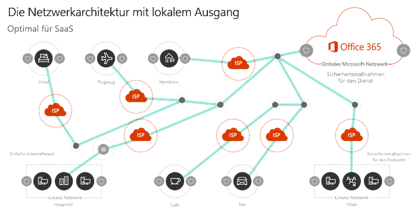

# Prinzipien von Office 365-Netzwerkverbindungen

Bevor Sie mit der Planung Ihres Netzwerks für die Netzwerkkonnektivität von Office 365 beginnen, sollten Sie sich mit den grundlegenden Prinzipien für die sichere Verwaltung von Office 365-Datenverkehr und optimale Leistung vertraut machen. Dieser Artikel hilft Ihnen, die neuesten Richtlinien für die sichere Optimierung der Office 365-Netzwerkkonnektivität zu verstehen.
  
Herkömmliche Unternehmensnetzwerke sollen Benutzern den Zugriff auf Anwendungen und Daten ermöglichen, die in Unternehmen betrieben werden, die über eine starke Perimeter-Sicherheit verfügen. Das herkömmliche Modell geht davon aus, dass Benutzer auf Anwendungen und Daten innerhalb des Unternehmensnetzwerk Perimeters, über WAN-Verbindungen von Zweigstellen oder Remote über VPN-Verbindungen zugreifen. 
  
Die Einführung von SaaS-Anwendungen wie Office 365 verschiebt eine Kombination aus Diensten und Daten außerhalb des Netzwerkperimeters. Ohne Optimierung kann der Datenverkehr zwischen Benutzern und SaaS-Anwendungen durch eine Paketprüfung, Netzwerk Haarnadeln, versehentliche Verbindungen zu geografisch entfernten Endpunkten und anderen Faktoren beeinträchtigt werden. Sie können die beste Leistung und Zuverlässigkeit von Office 365 sicherstellen, indem Sie wichtige Optimierungsrichtlinien verstehen und implementieren.
  
In diesem Artikel erfahren Sie mehr über:
  
- [Office 365-Architektur](office-365-network-connectivity-principles.md#BKMK_Architecture) für die Kundenanbindung an die Cloud
- Aktualisierte [Office 365](office-365-network-connectivity-principles.md#BKMK_Principles) -Konnektivitäts-Prinzipien und Strategien zur Optimierung des Netzwerkdatenverkehrs und der Endbenutzerumgebung
- Der [Office 365-Endpunkte-Webdienst](office-365-network-connectivity-principles.md#BKMK_WebSvc), mit dem Netzwerkadministratoren eine strukturierte Liste von Endpunkten für die Netzwerkoptimierung nutzen können
- [Neue Office 365-Endpunkt Kategorien](office-365-network-connectivity-principles.md#BKMK_Categories) und Optimierungsrichtlinien
- [Vergleichen der Netzwerkperimeter-Sicherheit mit der Endpunktsicherheit](office-365-network-connectivity-principles.md#BKMK_SecurityComparison)
- [Inkrementelle Optimierungs](office-365-network-connectivity-principles.md#BKMK_IncOpt) Optionen für Office 365-Datenverkehr

## Office 365-Architektur

Office 365 ist eine verteilte SaaS-Wolke (Software-as-a-Service), die Produktivitäts-und Zusammenarbeitsszenarien mithilfe einer Vielzahl von Mikro Diensten und Anwendungen wie Exchange Online, SharePoint Online, Skype for Business Online, Microsoft Teams, Exchange Online Protection, Office Online und viele andere. Während bestimmte Office 365-Anwendungen Ihre eindeutigen Features aufweisen können, wie Sie für das Kundennetzwerk und die Konnektivität mit der Cloud gelten, teilen Sie alle die wichtigsten Prinzipale, Ziele und Architekturmuster. Diese Prinzipale und Architekturmuster für die Konnektivität sind typisch für viele andere SaaS-Clouds und unterscheiden sich gleichzeitig von den typischen Bereitstellungsmodellen von Platt Form-as-a-Service-und Infrastruktur-as-a-Service-Clouds wie Microsoft Azure.
  
Eines der bedeutendsten Architekturfeatures von Office 365 (das von Netzwerk Planern oft verfehlt oder falsch interpretiert wird) besteht darin, dass es sich um einen wirklich globalen, verteilten Dienst handelt, der im Kontext der Verbindung von Benutzern mit der Anwendung besteht. Der Speicherort des Ziel-Office 365-Mandanten ist wichtig, um zu verstehen, wo Kundendaten in der Cloud gespeichert sind, aber die Benutzererfahrung mit Office 365 beinhaltet nicht die direkte Verbindung mit Datenträgern, die mit diesen Informationen verbunden sind. Die Benutzererfahrung mit Office 365 (einschließlich Leistung, Zuverlässigkeit und anderen wichtigen Qualitätsmerkmalen) umfasst die Konnektivität über eine hoch verteilte Dienst Front, die an Hunderten von Microsoft-Standorten weltweit skaliert wird. In den meisten Fällen wird die beste Benutzererfahrung erreicht, indem dem Kundennetzwerk ermöglicht wird, Benutzeranforderungen an den nächstgelegenen Office 365-Dienst Einstiegspunkt weiterzuleiten, statt eine Verbindung zu Office 365 über einen Ausgangspunkt an einem zentralen Standort oder einer Region herzustellen.
  
Für die meisten Kunden werden Office 365-Benutzer über viele Standorte verteilt. Um die besten Ergebnisse zu erzielen, sollten die in diesem Dokument beschriebenen Grundsätze unter dem Gesichtspunkt Scale-Out (not Scale-up) betrachtet werden, wobei der Fokus auf der Optimierung der Konnektivität zum nächstgelegenen Punkt der Anwesenheit im globalen Netzwerk von Microsoft liegt, nicht auf dem geographischen Speicherort des Office 365-Mandanten. Dies führt im Wesentlichen dazu, dass Office 365-Mandantendaten zwar an einem bestimmten geografischen Standort gespeichert werden können, die Office 365-Umgebung für diesen Mandanten jedoch weiterhin verteilt ist und sich in sehr naher (Netzwerk-) Nähe zu jedem Endbenutzer Standort befinden kann, den der Mandant hat. .
  
## Office 365-Konnektivitäts-Prinzipien

Microsoft empfiehlt die folgenden Prinzipien, um eine optimale Konnektivität und Leistung von Office 365 zu erreichen. Verwenden Sie diese Office 365-Konnektivitäts-Prinzipien, um Ihren Datenverkehr zu verwalten und die optimale Leistung beim Herstellen einer Verbindung mit Office 365 zu erzielen.
  
Das primäre Ziel des Netzwerkentwurfs sollte es sein, die Wartezeit zu minimieren, indem die Roundtripzeit (Round-Trip Time, RTT) von Ihrem Netzwerk in das globale Microsoft-Netzwerk reduziert wird, das Microsoft-Backbone für öffentliche Netzwerke, das alle Microsoft-Rechenzentren mit niedriger Latenz verbindet. und Cloud-Anwendungs Einstiegspunkte weltweit. Weitere Informationen zum globalen Netzwerk von Microsoft finden Sie unter [How Microsoft baut sein schnelles und zuverlässiges globales Netzwerk](https://azure.microsoft.com/en-us/blog/how-microsoft-builds-its-fast-and-reliable-global-network/).
  

### Identifizieren und unterscheiden von Office 365-Datenverkehr

  
Die Identifizierung von Office 365-Netzwerkdatenverkehr ist der erste Schritt, um diesen Datenverkehr vom allgemeinen Internet gebundenen Netzwerkdatenverkehr zu unterscheiden. Office 365-Konnektivität kann optimiert werden, indem eine Kombination von Methoden wie Netzwerkrouten Optimierung, Firewallregeln, Browser Proxyeinstellungen und Umgehung von Netzwerk Inspektionsgeräten für bestimmte Endpunkte implementiert wird.
  
Frühere Office 365-Optimierungs Leitlinien teilten Office 365-Endpunkte in zwei Kategorien: **erforderlich** und **optional**. Da Endpunkte zur Unterstützung neuer Office 365-Dienste und-Features hinzugefügt wurden, haben wir Office 365-Endpunkte in drei Kategorien umgegliedert: **optimize**, **Allow** und **default**. Die Richtlinien für die einzelnen Kategorien gelten für alle Endpunkte in der Kategorie, sodass Optimierungen einfacher zu verstehen und zu implementieren sind. 
  
Weitere Informationen zu Office 365-Endpunkt Kategorien und Optimierungsmethoden finden Sie im Abschnitt [neue office 365-Endpunkt Kategorien](office-365-network-connectivity-principles.md#BKMK_Categories) .
  
Microsoft veröffentlicht jetzt alle Office 365-Endpunkte als Webdienst und bietet Anleitungen zur optimalen Verwendung dieser Daten. Weitere Informationen zum Abrufen und arbeiten mit Office 365-Endpunkten finden Sie im Artikel [office 365-URLs und IP-Adressbereiche](https://support.office.com/en-us/article/office-365-urls-and-ip-address-ranges-8548a211-3fe7-47cb-abb1-355ea5aa88a2?ui=en-US&amp;rs=en-US&amp;ad=US).
  

### Lokaler Ausgang von Netzwerkverbindungen

  
Lokale DNS-und Internet Ausgänge sind von entscheidender Bedeutung, um die Verbindungswartezeit zu verringern und sicherzustellen, dass Benutzer Verbindungen zum nächstgelegenen Einstiegspunkt zu Office 365-Diensten hergestellt werden. In einer komplexen Netzwerktopologie ist es wichtig, sowohl lokale DNS-als auch lokale Internet Ausgänge zusammen zu implementieren. Weitere Informationen dazu, wie Office 365 Clientverbindungen an den nächstgelegenen Einstiegspunkt weiterleitet, finden Sie im Artikel [Client Connectivity](https://support.office.com/en-us/article/client-connectivity-4232abcf-4ae5-43aa-bfa1-9a078a99c78b).
  
Vor der Einführung von Cloud-Diensten wie Office 365 war die Endbenutzer-Internet Verbindung als Design Faktor in der Netzwerkarchitektur relativ einfach. Wenn Internet Dienste und Websites rund um den Globus verteilt werden, ist die Wartezeit zwischen den Ausgeh Punkten des Unternehmens und einem beliebigen Zielendpunkt weitgehend eine Funktion des geographischen Abstands.
  
In einer herkömmlichen Netzwerkarchitektur werden alle ausgehenden Internet Verbindungen über das Unternehmensnetzwerk übertragen und von einem zentralen Standort aus ausgehen. Da die Cloud-Angebote von Microsoft ausgereift sind, ist eine verteilte, mit dem Internet verbundene Netzwerkarchitektur für die Unterstützung von Latenz sensiblen Cloud-Diensten entscheidend. Das globale Microsoft-Netzwerk wurde entwickelt, um die Latenz Anforderungen mit der Infrastruktur für verteilte Dienste zu erfüllen, eine dynamische Struktur globaler Einstiegspunkte, die eingehende Cloud-Dienstverbindungen an den nächstgelegenen Einstiegspunkt weiterleitet. Dies soll die Länge der letzten Meile für Microsoft Cloud-Kunden reduzieren, indem die Route zwischen dem Kunden und der Cloud effektiv verkürzt wird.
  
Unternehmens-WANs sind häufig für die Backhaul des Netzwerkdatenverkehrs an eine zentrale Unternehmensleitung vorgesehen, um vor dem Ausstieg ins Internet, in der Regel über einen oder mehrere Proxy Server, zu prüfen. Das folgende Diagramm veranschaulicht eine solche Netzwerktopologie.
  

  
Da Office 365 im globalen Microsoft-Netzwerk ausgeführt wird, das Front-End-Server in der ganzen Welt umfasst, ist häufig ein Front-End-Server in der Nähe des Standorts des Benutzers vorhanden. Durch die Bereitstellung des lokalen Internet Ausstiegs und durch die Konfiguration interner DNS-Server zur Bereitstellung der lokalen Namensauflösung für Office 365-Endpunkte kann der Netzwerkdatenverkehr für Office 365 eine Verbindung zu Office 365-Front-End-Servern so weit wie möglich für den Benutzer herstellen. Das folgende Diagramm zeigt ein Beispiel für eine Netzwerktopologie, die es Benutzern ermöglicht, eine Verbindung vom Hauptsitz, von der Zweigstelle und von Remotestandorten aus durchführen zu können, um die kürzeste Route zum nächstgelegenen Office 365-Einstiegspunkt zu erhalten.
  

  
Eine verKürzung des Netzwerkpfads zu Office 365-Einstiegspunkten auf diese Weise kann die Konnektivitäts-und Endbenutzerfreundlichkeit in Office 365 verbessern und auch dazu beitragen, die Auswirkungen zukünftiger Änderungen an der Netzwerkarchitektur auf die Leistung von Office 365 zu verringern und Zuverlässigkeit.
  
Außerdem können DNS-Anforderungen eine Wartezeit einführen, wenn der antwortende DNS-serverweit entfernt oder besetzt ist. Sie können die Wartezeit bei der Namensauflösung minimieren, indem Sie lokale DNS-Server an Zweigstellen konfigurieren und sicherstellen, dass Sie für die richtige Cache-DNS-Einträge konfiguriert sind.
  
Während das regionale Ausstiegs Ziel für Office 365 gut funktionieren kann, wäre das optimale Verbindungsmodell immer das Austreten des Netzwerks am Standort des Benutzers, unabhängig davon, ob sich dieser im Unternehmensnetzwerk oder an Remotestandorten wie Home, Hotels, Coffee Shops und Flughäfen. Dieses lokale Direktausgangs Modell wird in der folgenden Abbildung dargestellt.
  

  
Unternehmen, die Office 365 eingeführt haben, können die Vorteile der Front-Door-Architektur des Microsoft Global Network nutzen, indem Sie sicherstellen, dass Benutzer Verbindungen mit Office 365 die kürzeste Route zum nächstgelegenen Microsoft Global Network-Eintrag verwenden. Punkt. Die Architektur des lokalen Ausgangs Netzwerks ermöglicht, dass der Office 365-Datenverkehr über den nächsten Ausgang geroutet werden kann, unabhängig vom Benutzerstandort.
  
Die lokale Ausgangsarchitektur bietet die folgenden Vorteile gegenüber dem herkömmlichen Modell:
  
- Bietet optimale Leistung für Office 365 durch Optimierung der Routenlänge. Endbenutzer Verbindungen werden dynamisch an den nächstgelegenen Office 365-Einstiegspunkt von der Infrastruktur für den verTeilten Dienst Haustür weitergeleitet.
- Reduziert die Auslastung der Netzwerkinfrastruktur des Unternehmens, indem lokale Ausgänge zugelassen werden.
- Sichert Verbindungen an beiden Enden durch Nutzung der Client-Endpunktsicherheit und Cloud-Sicherheitsfunktionen.

### Vermeiden von Spitzkehren für Netzwerke

  
Als Faustregelgilt, dass die kürzeste, direkteste Route zwischen dem Benutzer und dem nächsten Office 365-Endpunkt die beste Leistung bieten wird. Eine Netzwerk-Haarnadel geschieht, wenn der WAN-oder VPN-Datenverkehr, der für ein bestimmtes Ziel gebunden ist, zuerst an einen anderen Zwischenspeicherort geleitet wird (beispielsweise Sicherheits Stapel, Cloud-Zugriffs Broker, Cloud-basiertes Web-Gateway), wobei Latenz und potenzielle Umleitung zu einer geografisch entfernter Endpunkt. Netzwerk-Haarnadeln können auch durch Routing/Peering-Ineffizienzen oder suboptimale (Remote-) DNS-Lookups verursacht werden.
  
Wenn Sie sicherstellen möchten, dass die Office 365-Konnektivität auch im lokalen Ausgangsfall keinen Netzwerk-Haarnadeln unterliegt, überprüfen Sie, ob der ISP, der zum Bereitstellen des Internet Ausstiegs für den Benutzerstandort verwendet wird, eine direkte Peering-Beziehung mit dem globalen Microsoft-Netzwerk in der Nähe hat. Nähe zu diesem Speicherort. Sie können auch das Ausstiegs Routing konfigurieren, um vertrauenswürdigen Office 365-Datenverkehr direkt zu senden, im Gegensatz zu Proxy-oder Tunnel Vorgängen über einen Drittanbieter-Cloud-oder Cloud-basierten Netzwerk Sicherheitsanbieter, der Ihren Internet Datenverkehr verarbeitet. Die lokale DNS-Namensauflösung von Office 365-Endpunkten hilft sicherzustellen, dass neben dem direkten Routing die nächsten Office 365-Einstiegspunkte für Benutzer Verbindungen verwendet werden.
  
Wenn Sie Cloud-basierte Netzwerk-oder Sicherheitsdienste für Ihren Office 365-Datenverkehr verwenden, stellen Sie sicher, dass der hairpinning-Effekt ausgewertet wird und seine Auswirkungen auf die Leistung von Office 365 verstanden werden. Dies kann durch die Untersuchung der Anzahl und der Standorte von Dienstanbieter Standorten erfolgen, über die der Datenverkehr in Beziehung zur Anzahl ihrer Zweigstellen und Microsoft Global Network-Peering-Punkte weitergeleitet wird, Qualität der Netzwerk-Peering-Beziehung von der Dienstanbieter mit Ihrem INTERNETdienstanbieter und Microsoft und die Leistungsbeeinträchtigung durch das rückschleppen in der Service Provider-Infrastruktur.
  
Aufgrund der hohen Anzahl an verteilten Standorten mit Office 365-Einstiegspunkten und der Nähe zu Endbenutzern kann das Routing von Office 365-Datenverkehr zu einem beliebigen Netzwerk-oder Sicherheitsanbieter von Drittanbietern negative Auswirkungen auf die Office 365-Verbindungen haben, wenn das Anbieter Netzwerk nicht konfiguriert für optimales Office 365-Peering.
  

### Bewerten von Umgehungs Proxys, Datenverkehrs Überprüfungs Geräten und doppelten Sicherheitstechnologien

  
Unternehmenskunden sollten Ihre Netzwerksicherheit und Risiko Minderungs Methoden speziell für den Office 365-gebundenen Datenverkehr überwachen und die Sicherheitsfunktionen von Office 365 verwenden, um ihre Abhängigkeit von intrusive, Leistungseinbußen und teurer Netzwerksicherheit zu reduzieren. Technologien für Office 365-Netzwerkdatenverkehr.
  
Die meisten Unternehmensnetzwerke erzwingen Netzwerksicherheit für Internet Datenverkehr mithilfe von Technologien wie Proxys, SSL-Inspektionen, Paket Inspektionen und Datenverlust-Verhinderung. Diese Technologien bieten wichtige Risikominimierung für generische Internet Anforderungen, können jedoch die Leistung, die Skalierbarkeit und die Qualität der Endbenutzerfreundlichkeit bei der Anwendung auf Office 365-Endpunkte erheblich reduzieren.
  

#### Office 365-endPunkte-Webdienst

Office 365-Administratoren können ein Skript oder einen REST-Aufruf verwenden, um eine strukturierte Liste von Endpunkten vom Office 365-endPunkte-Webdienst zu nutzen und die Konfigurationen der Umkreisfirewalls und anderer Netzwerkgeräte zu aktualisieren. Dadurch wird sichergestellt, dass der für Office 365 gebundene Datenverkehr für generische und oft unbekannte Internet Websites identifiziert, angemessen behandelt und anders verwaltet wird als der Netzwerkdatenverkehr. Weitere Informationen zur Verwendung des Office 365-endPunkts-Webdiensts finden Sie im Artikel [office 365-URLs und IP-Adressbereiche](https://support.office.com/en-us/article/office-365-urls-and-ip-address-ranges-8548a211-3fe7-47cb-abb1-355ea5aa88a2?ui=en-US&amp;rs=en-US&amp;ad=US).
  
#### PAC (Proxy Automatic Configuration)-Skripts

Office 365 Administratoren können PAC (Proxy Automatic Configuration)-Skripts erstellen, die über WPAD oder GPO an Benutzer Computer übermittelt werden können. PAC-Skripts können zum Umgehen von Proxys für Office 365-Anforderungen von WAN-oder VPN-Benutzern verwendet werden, sodass der Office 365-Datenverkehr direkte Internet Verbindungen verwenden kann, statt das Unternehmensnetzwerk zu durchlaufen.
  
#### Office 365-Sicherheitsfeatures

Microsoft ist für die Datencenter Sicherheit, die Betriebssicherheit und die Risikominderung um Office 365-Server und die Netzwerkendpunkte, die Sie darstellen, transparent. Office 365 integrierte Sicherheitsfunktionen stehen zur Verfügung, um das Netzwerk Sicherheitsrisiko zu verringern, wie beispielsweise verHinderung von Datenverlust, virenSchutz, mehrstufige Authentifizierung, Kundensperre, erweiterter BedrohungsSchutz, Office 365 Threat Intelligence, Office 365 Secure Score, Exchange Online Protection und Network DDOS-Sicherheit.
  
Weitere Informationen zu Microsoft Datacenter und zur globalen Netzwerksicherheit finden Sie im [Microsoft Trust Center](https://www.microsoft.com/en-us/trustcenter/security).
  
## Neue Office 365-Endpunkt Kategorien

Office 365-Endpunkte stellen eine vielfältige Gruppe von Netzwerkadressen und Subnetzen dar. EndPunkte können URLs, IP-Adressen oder IP-Bereiche sein, und einige Endpunkte werden mit bestimmten TCP/UDP-Ports aufgelistet. URLs können entweder ein FQDN wie *account.office.net* oder eine platzhalter-URL wie * \*. office365.com*sein.
  
> [!NOTE]
> Die Speicherorte von Office 365-Endpunkten innerhalb des Netzwerks beziehen sich nicht direkt auf den Speicherort der Office 365-Mandantendaten. Aus diesem Grund sollten Kunden Office 365 als einen verteilten und globalen Dienst betrachten und nicht versuchen, Netzwerkverbindungen zu Office 365-Endpunkten basierend auf geographischen Kriterien zu blockieren.
  
In unserem vorherigen Handbuch zur Verwaltung von Office 365-Datenverkehr wurden Endpunkte in zwei Kategorien unterteilt: **erforderlich** und **optional**. EndPunkte innerhalb der einzelnen Kategorien erforderten abhängig von der Wichtigkeit des Diensts unterschiedliche Optimierungen, und viele Kunden hatten Schwierigkeiten, die Anwendung derselben Netzwerkoptimierungen auf die vollständige Liste der Office 365-URLs und IP-Adressen zu rechtfertigen. 
  
Im neuen Modell werden Endpunkte in drei Kategorien unterteilt: **optimize**, **Allow** und **default**, wobei ein Prioritätsbasiertes Pivot für die Ausrichtung der Netzwerk Optimierungsbemühungen zur Realisierung der besten Leistungsverbesserungen und der Rückgabe Investitionen. Die Endpunkte werden in den obigen Kategorien basierend auf der Vertraulichkeit der effektiven Benutzerfreundlichkeit für Netzwerkqualität, Volumen und Leistungs Umschlag von Szenarien und einfache Implementierung konsolidiert. Empfohlene Optimierungen können auf die gleiche Weise auf alle Endpunkte in einer bestimmten Kategorie angewendet werden.
  
- **** Endpunkte werden für die Konnektivität mit jedem Office 365-Dienst benötigt und stellen über 75% der Office 365-Bandbreite,-Verbindungen und-Datenmenge dar. Diese Endpunkte stellen Office 365-Szenarien dar, die am sensibelsten für Netzwerkleistung, Wartezeit und Verfügbarkeit sind. Alle Endpunkte werden in Microsoft-Datencentern gehostet. Die Rate der Änderungen an den Endpunkten in dieser Kategorie ist sehr viel niedriger als bei den Endpunkten in den beiden anderen Kategorien. Diese Kategorie enthält eine sehr kleine Gruppe von Schlüssel-URLs (in der Reihenfolge von ~ 10) und eine definierte Gruppe von IP-Subnetzen für die wichtigsten Office 365-Arbeitsauslastungen wie Exchange Online, SharePoint Online, Skype for Business Online und Microsoft Teams.

    Eine komprimierte Liste mit gut definierten kritischen Endpunkten soll Ihnen helfen, hochwertige Netzwerkoptimierungen für diese Ziele schneller und einfacher zu planen und zu implementieren.

    beispiele für *optimierungs* endpunkte sind *https://outlook.office365.com* *https://\<-mandanten\>. sharepoint.com* und *https://\<-mandanten\>-my.sharepoint.com* .

    Zu den Optimierungsmethoden gehört Folgendes:

  - Bypass oder Whitelist *optimieren* Sie Endpunkte auf Netzwerkgeräten und Diensten, die Datenverkehr abfangen, SSL-Entschlüsselung, Tiefe Paketprüfung und Inhaltsfilterung ausführen.
  - Umgehen Sie lokale Proxy Geräte und Cloud-basierte Proxydienste, die häufig für generisches Internet browsen verwendet werden.
  - Priorisieren der Bewertung dieser Endpunkte als voll vertrauenswürdig durch Ihre Netzwerkinfrastruktur und ihre Umkreis Systeme.
  - Priorisieren Sie die Reduzierung oder Eliminierung des WAN-Rücktransports, und vereinfachen Sie den direkten verteilten Internet basierten Ausstieg für diese Endpunkte so weit wie möglich an Benutzer/Zweigstellenstandorten.
  - Erleichtern Sie die direkte Anbindung dieser Cloud-Endpunkte für VPN-Benutzer, indem Sie Split-Tunneling implementieren.
  - Stellen Sie sicher, dass die bei der DNS-Namensauflösung zurückgegebenen IP-Adressen mit dem Ausgangspfad für diese Endpunkte übereinstimmen.
  - Priorisieren Sie diese Endpunkte für die SD-WAN-Integration für das direkte, minimale Latenz Routing in den nächstgelegenen Internet-peeringpunkt des globalen Microsoft-Netzwerks.

- **** Endpunkte sind für die Konnektivität mit bestimmten Office 365-Diensten und-Features erforderlich, sind jedoch nicht so anfällig für Netzwerkleistung und Latenz wie die in der Kategorie *optimieren* . Der allgemeine Netzwerk Footprint dieser Endpunkte aus der Sicht der Bandbreite und der Verbindungsanzahl ist ebenfalls erheblich kleiner. Diese Endpunkte sind für Office 365 dediziert und werden in Microsoft-Rechenzentren gehostet. Sie stellen eine breite Palette von Office 365-Micro-Services und ihre Abhängigkeiten (in der Reihenfolge von ~ 100-URLs) dar und werden mit höherer Geschwindigkeit als die in der Kategorie *optimieren* geändert. Nicht alle Endpunkte in dieser Kategorie sind definierten dedizierten IP-Subnetzen zugeordnet.

    Netzwerkoptimierungen für *Allow* -Endpunkte können die Office 365-Benutzerfreundlichkeit verbessern, aber einige Kunden können diese Optimierungen enger eingrenzen, um Änderungen am Netzwerk zu minimieren.

    Beispiele für *zulässige* Endpunkte sind *https://\*. Protection.Outlook.com* und. *https://accounts.accesscontrol.windows.net*

    Zu den Optimierungsmethoden gehört Folgendes:

  - Bypass oder Whitelist *lassen* Endpunkte auf Netzwerkgeräten und-Diensten zu, die Datenverkehr, SSL-Entschlüsselung, Tiefe Paketprüfung und Inhaltsfilterung ausführen.
  - Priorisieren der Bewertung dieser Endpunkte als voll vertrauenswürdig durch Ihre Netzwerkinfrastruktur und ihre Umkreis Systeme.
  - Priorisieren Sie die Reduzierung oder Eliminierung des WAN-Rücktransports, und vereinfachen Sie den direkten verteilten Internet basierten Ausstieg für diese Endpunkte so weit wie möglich an Benutzer/Zweigstellenstandorten.
  - Stellen Sie sicher, dass die bei der DNS-Namensauflösung zurückgegebenen IP-Adressen mit dem Ausgangspfad für diese Endpunkte übereinstimmen.
  - Priorisieren Sie diese Endpunkte für die SD-WAN-Integration für das direkte, minimale Latenz Routing in den nächstgelegenen Internet-peeringpunkt des globalen Microsoft-Netzwerks.

- **Standard** Endpunkte stellen Office 365-Dienste und Abhängigkeiten dar, die keine Optimierung erfordern und von Kundennetzwerken als normaler Internet gebundener Datenverkehr behandelt werden können. Beachten Sie, dass einige Endpunkte in dieser Kategorie möglicherweise nicht in Microsoft-Datencentern gehostet werden. Beispiele: *https://odc.officeapps.live.com* und *https://appexsin.stb.s-msn.com*.

Weitere Informationen zu Office 365-Netzwerk Optimierungstechniken finden Sie im Artikel [Managing office 365 Endpoint](https://support.office.com/en-us/article/managing-office-365-endpoints-99cab9d4-ef59-4207-9f2b-3728eb46bf9a#ID0EAEAAA=0._Overview).
  
## Vergleichen der Netzwerkperimeter-Sicherheit mit der Endpunktsicherheit

Das Ziel herkömmlicher Netzwerksicherheit besteht darin, den Umkreis des Unternehmensnetzwerks gegen Intrusions-und böswillige Angriffe zu schützen. Bei der Einführung von Office 365 werden einige Netzwerkdienste und-Daten teilweise oder vollständig in die Cloud migriert. Ebenso wie grundlegende Änderungen an der Netzwerkarchitektur erfordert dieser Prozess eine Neubewertung der Netzwerksicherheit, bei der neue Faktoren berücksichtigt werden:
  
- Wenn Cloud-Dienste angenommen werden, werden Netzwerkdienste und-Daten zwischen lokalen Rechenzentren und der Cloud verteilt, und die Perimeter-Sicherheit ist nicht länger ausreichend.
- Remote Benutzer verbinden sich mit Unternehmensressourcen sowohl in lokalen Rechenzentren als auch in der Cloud von unkontrollierten Standorten wie Wohnungen, Hotels und Cafés.
- Speziell entwickelte Sicherheitsfeatures werden zunehmend in Cloud-Dienste integriert und können vorhandene Sicherheitssysteme potenziell ergänzen oder ersetzen.

Microsoft bietet eine breite Palette von Office 365-Sicherheitsfeatures und bietet ausführliche Anleitungen für die Verwendung bewährter Sicherheitsmethoden, mit denen Sie die Daten-und Netzwerksicherheit für Office 365 sicherstellen können. Empfohlene bewährte Methoden:
  
- **Mehrstufige Authentifizierung (MFA)** MFA fügt eine zusätzliche Schutzebene für eine starke Kenn Wort Strategie hinzu, indem Benutzer aufgefordert werden, einen Telefonanruf, eine Textnachricht oder eine APP-Benachrichtigung auf Ihrem Smartphone zu bestätigen, nachdem Sie das Kennwort richtig eingegeben haben.

- **Verwenden von Office 365 Cloud App Security** Einrichten von Richtlinien zum Nachverfolgen von anomalen Aktivitäten und zum Ausführen von Aktionen. Richten Sie Warnungen mit Office 365 Cloud App Security ein, damit Administratoren ungewöhnliche oder riskante Benutzeraktivitäten wie das Herunterladen umfangreicher Datenmengen, mehrere fehlgeschlagene Anmeldeversuche oder Verbindungen von unbekannten oder gefährlichen IP-Adressen überwachen können.

- **Konfigurieren von Data Loss Prevention (DLP)** Mit DLP können Sie vertrauliche Daten identifizieren und Richtlinien erstellen, die verhindern, dass Ihre Benutzer versehentlich oder absichtlich die Daten freigeben. DLP funktioniert in Office 365, einschließlich Exchange Online, SharePoint Online und OneDrive, sodass Ihre Benutzer kompatibel bleiben können, ohne Ihren Workflow zu unterbrechen.

- **Kunden-lockBox verwenden** Als Office 365-Administrator können Sie mit der Customer Lockbox steuern, wie ein Microsoft-Supporttechniker während einer Hilfesitzung auf Ihre Daten zugreift. In Fällen, in denen der Techniker Zugriff auf Ihre Daten benötigt, um ein Problem zu behandeln und zu beheben, können Sie mit der Kunden-Lockbox die Zugriffsanforderung genehmigen oder ablehnen.

- **Verwenden von Office 365 Secure Score** Secure Score ist ein Sicherheitsanalysetool, das empfiehlt, was Sie tun können, um das Risiko weiter zu reduzieren. Secure Score betrachtet Ihre Office 365-Einstellungen und-Aktivitäten und vergleicht sie mit einer von Microsoft festgelegten Baseline. Sie erhalten eine Bewertung basierend darauf, wie Sie mit den besten Sicherheitsmethoden ausgerichtet sind.

Eine ganzheitliche Vorgehensweise für eine verstärkte Sicherheit sollte folgende Aspekte berücksichtigen:
  
- Verlagerung der Betonung von der Umkreis Sicherheit auf die Endpunktsicherheit durch Anwenden von Cloud-basierten und Office-Client Sicherheitsfeatures.
  - VerKleinern des Sicherheits Perimeters zum Datencenter
  - Aktivieren einer entsprechenden Vertrauensstellung für Benutzer Geräte innerhalb des Büros oder an Remotestandorten
  - Konzentrieren Sie sich auf die Sicherung des Datenspeicherorts und des Benutzerstandorts.
  - Verwaltete Benutzer Computer verfügen über eine höhere Vertrauensstellung bei der Endpunktsicherheit
- Ganzheitliche Verwaltung aller Informationssicherheit, nicht nur im Umkreis
  - Umdefinieren Sie WAN und die Sicherheit des Umkreisnetzwerks, indem Sie vertrauenswürdigen Datenverkehr erlauben, Sicherheitsgeräte zu umgehen und nicht verwaltete Geräte zu Gast-Wi-Fi-Netzwerken zu trennen.
  - Geringere Anforderungen an die Netzwerksicherheit der WAN-Peripherie des Unternehmens
  - Einige Netzwerkperimeter-Sicherheitsgeräte wie Firewalls sind weiterhin erforderlich, aber die Auslastung sinkt.
  - Gewährleistet lokalen Ausstieg für Office 365-Datenverkehr
- Verbesserungen können schrittweise adressiert werden, wie im Abschnitt [inkrementelle Optimierung](office-365-network-connectivity-principles.md#BKMK_IncOpt) beschrieben. Einige Optimierungstechniken bieten je nach Netzwerkarchitektur ein besseres Kosten-Nutzen-Verhältnis, und Sie sollten Optimierungen auswählen, die für Ihr Unternehmen am sinnvollsten sind.

Weitere Informationen zur Sicherheit und Compliance in Office 365 finden Sie im Artikel [Übersicht über Sicherheit und Compliance in office 365](https://support.office.com/en-us/article/overview-of-security-and-compliance-in-office-365-dcb83b2c-ac66-4ced-925d-50eb9698a0b2?ui=en-US&amp;rs=en-US&amp;ad=US).
  
## Inkrementelle Optimierung

Wir haben das ideale Netzwerk Verbindungsmodell für SaaS weiter oben in diesem Artikel dargestellt, aber für viele große Organisationen mit historisch komplexen Netzwerkarchitekturen ist es nicht praktikabel, alle diese Änderungen direkt vorzunehmen. In diesem Abschnitt werden eine Reihe von inkrementellen Änderungen erläutert, die zur Verbesserung der Leistung und Zuverlässigkeit von Office 365 beitragen können.
  
Welche Methoden Sie zur Optimierung von Office 365-Datenverkehr verwenden, hängt von Ihrer Netzwerktopologie und den von Ihnen implementierten Netzwerkgeräten ab. Große Unternehmen mit vielen Standorten und komplexen Netzwerk Sicherheitsmethoden müssen eine Strategie entwickeln, die die meisten oder alle im Abschnitt " [Office 365 Connectivity Principles](office-365-network-connectivity-principles.md#BKMK_Principles) " aufgeführten Prinzipien umfasst, während kleinere Organisationen nur ein oder zwei berücksichtigen.
  
Sie können die Optimierung als inkrementellen Prozess angehen, indem Sie die einzelnen Methoden nacheinander anwenden. In der folgenden Tabelle sind die wichtigsten Optimierungsmethoden in der Reihenfolge ihrer Auswirkungen auf die Wartezeit und Zuverlässigkeit für die größte Anzahl von Benutzern aufgeführt.
  
|**Optimization-Methode**|**Beschreibung**|**Auswirkung**|
|:-----|:-----|:-----|
|Lokale DNS-Auflösung und Internet Austritt    |Stellen Sie an jedem standortlokale DNS-Server bereit, und vergewissern Sie sich, dass Office 365 die Verbindung zum Internet so weit wie möglich am Standort des Benutzers abschließt.    | Minimieren der Wartezeit     Verbessern der zuverlässigen Konnektivität mit dem nächstgelegenen Office 365-Einstiegspunkt    |
|Regionale Ausgangspunkte hinzufügen    |Wenn Ihr Unternehmensnetzwerk über mehrere Standorte verfügt, aber nur einen Ausgangspunkt, fügen Sie regionale Ausstiegspunkte hinzu, um Benutzern das Herstellen einer Verbindung mit dem nächstgelegenen Office 365-Einstiegspunkt zu ermöglichen.    | Minimieren der Wartezeit     Verbessern der zuverlässigen Konnektivität mit dem nächstgelegenen Office 365-Einstiegspunkt    |
|Umgehen von Proxys und Inspektionsgeräten    |Konfigurieren Sie Browser mit PAC-Dateien, die Office 365-Anforderungen direkt an Ausgangspunkte senden.    Konfigurieren Sie Edge-Router und Firewalls, um Office 365-Datenverkehr ohne Überprüfung zuzulassen.    | Minimieren der Wartezeit     Geringere Last für Netzwerkgeräte    |
|Aktivieren der direkten Verbindung für VPN-Benutzer    |Aktivieren Sie für VPN-Benutzer Office 365-Verbindungen, um eine direkte Verbindung mit dem Netzwerk des Benutzers statt über den VPN-Tunnel herzustellen, indem Sie Split-Tunneling implementieren.    | Minimieren der Wartezeit     Verbessern der zuverlässigen Konnektivität mit dem nächstgelegenen Office 365-Einstiegspunkt    |
|Migrieren von herkömmlichem WAN zu SD-WAN    |SD-WANs (von der Software definierte WAN-Netze) vereinfachen die WAN-Verwaltung und verbessern die Leistung, indem Sie herkömmliche WANs mit virtuellen Appliances ersetzen, ähnlich wie bei der Virtualisierung von Compute-Ressourcen mithilfe virtueller Computer (VMs).    | Verbessern der Leistung und Verwaltbarkeit von WAN-Datenverkehr     Geringere Last für Netzwerkgeräte    |
