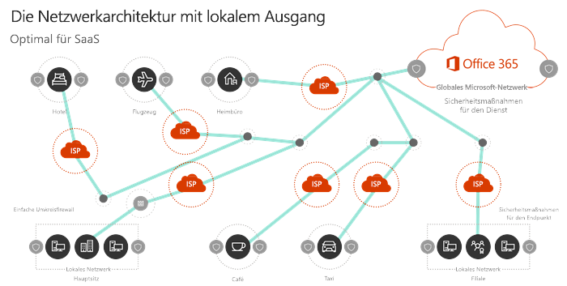

# Übersicht über die Office 365-Netzwerkkonnektivität

Office 365 ist eine verteilte SaaS-Wolke (Software-as-a-Service), die Produktivitäts-und Zusammenarbeitsszenarien mithilfe einer Vielzahl von Mikro Diensten und Anwendungen bereitstellt. Client Komponenten von Office 365 wie Outlook, Word und PowerPoint werden auf Benutzercomputern ausgeführt und stellen eine Verbindung mit anderen Komponenten von Office 365 her, die in Microsoft-Datencentern ausgeführt werden. Der wichtigste Faktor, der die Qualität der Office 365-Endbenutzererfahrung bestimmt, ist die Netzwerkzuverlässigkeit und die geringe Wartezeit zwischen Office 365-Clients und Office 365-Dienst Front Doors.

In diesem Artikel erfahren Sie mehr über die Ziele des Office 365-Netzwerks und warum Office 365-Netzwerke einen anderen Ansatz zur Optimierung als generischer Internet Datenverkehr erfordern.

## Office 365-Netzwerk Ziele

Das ultimative Ziel des Office 365-Netzwerks besteht darin, die Endbenutzerfreundlichkeit zu optimieren, indem der geringste restriktive Zugriff zwischen Clients und den am nächsten gelegenen Office 365-Endpunkten ermöglicht wird. Die Qualität der Endbenutzererfahrung hängt direkt mit der Leistung und der Reaktionsfähigkeit der vom Benutzer verwendeten Anwendung zusammen. Microsoft Teams stützt sich beispielsweise auf eine geringe Latenz, sodass Benutzer Telefonate, Konferenzen und gemeinsame Bildschirm zusammenarbeiten glitch-frei sind, und Outlook basiert auf der hervorragenden Netzwerkkonnektivität für Instant Search-Features, die die serverseitige Indizierung und AI nutzen. Funktionen.

Das primäre Ziel des Netzwerkentwurfs sollte es sein, die Wartezeit zu minimieren, indem die Roundtripzeit (Round-Trip Time, RTT) von Clientcomputern auf das globale Microsoft-Netzwerk reduziert wird, das Microsoft-Backbone für öffentliche Netzwerke, das alle Microsoft-Rechenzentren mit niedriger Latenz verbindet. , hoch verfügbare Cloud-Anwendungs Einstiegspunkte weltweit. Weitere Informationen zum globalen Netzwerk von Microsoft finden Sie unter [How Microsoft baut sein schnelles und zuverlässiges globales Netzwerk](https://azure.microsoft.com/en-us/blog/how-microsoft-builds-its-fast-and-reliable-global-network/).

Das Optimieren der Leistung von Office 365-Netzwerken muss nicht kompliziert sein. Sie können die bestmögliche Leistung erzielen, indem Sie einige wichtige Prinzipien befolgen:

- Identifizieren des Office 365-Netzwerkverkehrs
- Zulassen des Ausstiegs des ausgehenden Netzwerks von Office 365 in das Internet von jedem Standort aus, an dem Benutzer eine Verbindung mit Office 365 herstellen
- Zulassen, dass Office 365-Datenverkehr Proxys und Paket Inspektionsgeräte umgehen kann

Weitere Informationen zu den Grundprinzipien von Office 365-Netzwerkverbindungen finden Sie unter [office 365 Network Connectivity Principles](office-365-network-connectivity-principles.md).

## Herkömmliche Netzwerkarchitekturen und SaaS

Herkömmliche Netzwerkarchitektur Prinzipien für Client/Server-Arbeitsauslastungen sind darauf ausgelegt, dass der Datenverkehr zwischen Clients und Endpunkten nicht über den Umkreis des Unternehmensnetzwerks hinausgeht. In vielen Unternehmensnetzwerken werden außerdem alle ausgehenden Internet Verbindungen über das Unternehmensnetzwerk übertragen und von einem zentralen Standort aus ausgehen.

In herkömmlichen Netzwerkarchitekturen ist eine höhere Wartezeit für generischen Internetdatenverkehr ein notwendiger Kompromiss, um die Sicherheit des Netzwerkperimeters zu gewährleisten, und die Leistungsoptimierung für Internetdatenverkehr umfasst in der Regel ein Upgrade oder eine Skalierung der Geräte an Netzwerk Ausstiegs Punkten. Dieser Ansatz entspricht jedoch nicht den Anforderungen für eine optimale Netzwerkleistung von SaaS-Diensten wie Office 365.

## Identifizieren des Office 365-Netzwerkverkehrs

Wir vereinfachen die Identifizierung von Office 365-Netzwerkdatenverkehr und vereinfachen die Verwaltung der Netzwerkidentifizierung.

- Neue Kategorien von Netzwerkendpunkten zur Unterscheidung von hoch kritischem Netzwerkdatenverkehr vom Netzwerkdatenverkehr, der nicht durch Internet Latenzen beeinträchtigt wird. Es gibt nur eine Handvoll URLs und unterstützende IP-Adressen in der kritischsten Kategorie "optimieren".
- Webdienste für die Skriptverwendung oder direkte Gerätekonfiguration und Change Management der Office 365-Netzwerkidentifizierung. Änderungen sind im Webdienst oder im RSS-Format oder per e-Mail mithilfe einer Microsoft Flow-Vorlage verfügbar.
- [Office 365 Network Partner Program](http://aka.ms/Office365NPP) mit Microsoft-Partnern, die Geräte oder Dienste bereitstellen, die den Prinzipien von Office 365 Network Connectivity entsprechen und eine einfache Konfiguration aufweisen.

## Sichern von Office 365-Verbindungen

Das Ziel herkömmlicher Netzwerksicherheit besteht darin, den Umkreis des Unternehmensnetzwerks gegen Intrusions-und böswillige Angriffe zu schützen. Die meisten Unternehmensnetzwerke erzwingen Netzwerksicherheit für Internet Datenverkehr mithilfe von Technologien wie Proxyservern, Firewalls, SSL-unterbrechungs-und-Untersuchungen, tiefen Paket Inspektionen und Datenverlust-Verhinderung. Diese Technologien bieten wichtige Risikominimierung für generische Internet Anforderungen, können jedoch die Leistung, die Skalierbarkeit und die Qualität der Endbenutzerfreundlichkeit bei der Anwendung auf Office 365-Endpunkte erheblich reduzieren.

Office 365 hilft bei der Erfüllung der Anforderungen Ihrer Organisation an die Inhaltssicherheit und die Einhaltung der Datenverwendung mit integrierten Sicherheits-und Steuerungsfunktionen, die speziell für Office 365-Features und-Arbeitslasten entwickelt wurden. Weitere Informationen zu Office 365 Security and Compliance finden Sie im [office 365 Security Roadmap](https://docs.microsoft.com/en-us/office365/securitycompliance/security-roadmap). Weitere Informationen zu den Empfehlungen von Microsoft und zur Support Position bei Advanced Network Solutions, die eine weitergehende Verarbeitung auf Office 365-Datenverkehr durchführen, finden Sie unter [using Third-Party Network Devices or Solutions on office 365 Traffic](https://support.microsoft.com/en-us/help/2690045).

## Warum ist Office 365-Netzwerke unterschiedlich?

Office 365 ist für eine optimale Leistung mithilfe von Endpunktsicherheit und verschlüsselten Netzwerkverbindungen ausgelegt, wodurch die Erzwingung der Perimeter-Sicherheit reduziert wird. Office 365-Rechenzentren befinden sich auf der ganzen Welt, und der Dienst ist für die Verwendung verschiedener Methoden zum Verbinden von Clients mit den besten verfügbaren Dienstendpunkten vorgesehen. Da Benutzerdaten und-Verarbeitung zwischen vielen Microsoft-Rechenzentren verteilt sind, gibt es keinen einzelnen Netzwerkendpunkt, mit dem Clientcomputer eine Verbindung herstellen können. Tatsächlich werden Daten und Dienste in Ihrem Office 365-Mandanten vom Microsoft Global Network dynamisch zur Anpassung an die geografischen Standorte, von denen Sie von Endbenutzern zugegriffen werden, optimiert.

Bestimmte häufige Leistungsprobleme werden erstellt, wenn der Office 365-Datenverkehr einer Paketprüfung und einem zentralisierten Ausstieg unterliegt:

- Hohe Latenzzeiten können zu einer äußerst schlechten Leistung von Video-und Audiodaten strömen führen, und langsame Antwort auf das Abrufen, suchen, Echtzeitzusammenarbeit, Frei/Gebucht-Kalenderinformationen, produktbezogene Inhalte und andere Dienste
- Egressing-Verbindungen von einem zentralen Standort aus überwinden die dynamischen Routingfunktionen des globalen Office 365-Netzwerks und fügen Wartezeiten und Roundtrips hinzu.
- EntSchlüsseln von SSL-gesichertem Office 365-Netzwerkdatenverkehr und erneuter Verschlüsselung kann zu Protokollfehlern und Sicherheitsrisiken führen

Die verKürzung des Netzwerkpfads zu Office 365-Einstiegspunkten, indem der Client Datenverkehr so weit wie möglich an seinem geografischen Standort weitergegeben wird, kann die Konnektivitäts-und Endbenutzerfreundlichkeit in Office 365 verbessern. Es kann auch dazu beitragen, die Auswirkungen zukünftiger Änderungen an der Netzwerkarchitektur auf die Leistung und Zuverlässigkeit von Office 365 zu verringern. Das optimale Verbindungsmodell besteht darin, den Netzwerk Austritt stets am Standort des Benutzers bereitzustellen, unabhängig davon, ob sich dieser im Unternehmensnetzwerk oder an Remotestandorten wie Home, Hotels, Cafés und Flughäfen befindet. Generischer Internet Datenverkehr und WAN-basierter Unternehmensnetzwerk Datenverkehr würden separat geroutet und nicht das lokale Direct-Ausstieg-Modell verwenden. Dieses lokale Direktausgangs Modell wird in der folgenden Abbildung dargestellt.

Die lokale Ausgangsarchitektur bietet die folgenden Vorteile für den Office 365-Netzwerkdatenverkehr über das herkömmliche Modell:
  
- Bietet optimale Leistung für Office 365 durch Optimierung der Routenlänge. Endbenutzer Verbindungen werden dynamisch an den nächstgelegenen Office 365-Einstiegspunkt von der Infrastruktur des _VerteilTen Diensts_ des Microsoft Global-Netzwerks weitergeleitet, und der Datenverkehr wird dann intern an Daten-und Dienstendpunkte über Microsoft weitergeleitet. ultra-niedrige Wartezeit hohe Verfügbarkeit dunkle Faser.
- Reduziert die Auslastung der Netzwerkinfrastruktur des Unternehmens, indem lokale Ausgänge für Office 365-Datenverkehr ermöglicht und Proxys und Datenverkehrs Überprüfungs Geräte umgangen werden.
- Sichert Verbindungen an beiden Enden durch Nutzung von Client-Endpunktsicherheit und Cloud-Sicherheitsfunktionen, wodurch die Anwendung redundanter Netzwerksicherheitstechnologien vermieden wird.

> [!NOTE]
> Die Infrastruktur des verTeilten _Diensts für Haustür_ ist der hoch verfügbare und skalierbare Netzwerk Edge des Microsoft Global Network mit geografisch verteilten Standorten. Sie beendet Endbenutzer Verbindungen und leitet Sie effizient innerhalb des globalen Microsoft-Netzwerks weiter. Weitere Informationen zum globalen Netzwerk von Microsoft finden Sie unter [How Microsoft baut sein schnelles und zuverlässiges globales Netzwerk](https://azure.microsoft.com/en-us/blog/how-microsoft-builds-its-fast-and-reliable-global-network/).

Weitere Informationen zum verstehen und Anwenden von Office 365-Netzwerk Verbindungs Prinzipien finden Sie unter [office 365 Network Connectivity Principles](office-365-network-connectivity-principles.md).

## Schlussbemerkung

Das Optimieren der Leistung von Office 365-Netzwerken besteht darin, unnötige Hindernisse zu beseitigen. Durch die Behandlung von Office 365-Verbindungen als vertrauenswürdiger Datenverkehr können Sie verhindern, dass die Wartezeit durch die Paketprüfung und den Wettbewerb für die Proxy Bandbreite eingeführt wird. Das zulassen lokaler Verbindungen zwischen Clientcomputern und Office 365-Endpunkten ermöglicht die dynamische Weiterleitung des Datenverkehrs über das globale Microsoft-Netzwerk.

## Verwandte Themen

[Prinzipien von Office 365-Netzwerkverbindungen](office-365-network-connectivity-principles.md)

[Office 365 – IP-Adress- und URL-Webdienst](office-365-ip-web-service.md)

[Verwalten von Office 365-Endpunkten](managing-office-365-endpoints.md)

[Office 365 – IP-Adress- und URL-Webdienst](office-365-ip-web-service.md)

[Netzwerkkonnektivität mit Office 365](network-connectivity.md)

[Office 365-Netzwerk- und Leistungsoptimierung](network-planning-and-performance.md)

[Office 365-Leistungsoptimierung mit Basisplänen und Leistungsverlauf](performance-tuning-using-baselines-and-history.md)

[Plan zur Problembehandlung für Office 365](performance-troubleshooting-plan.md)

[So baut Microsoft sein schnelles und zuverlässiges globales Netzwerk auf](https://azure.microsoft.com/en-us/blog/how-microsoft-builds-its-fast-and-reliable-global-network/)
