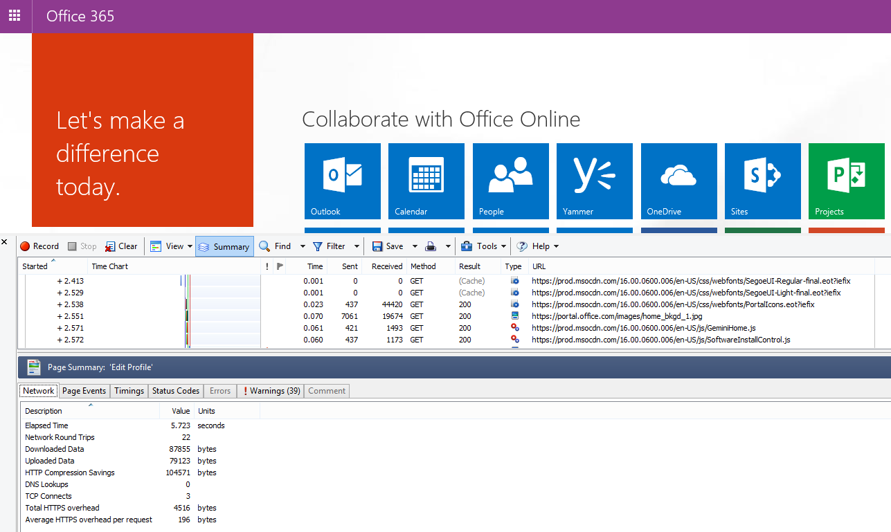
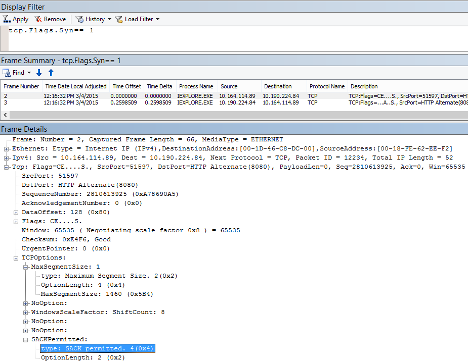

# Plan zur Problembehandlung für Office 365Performance troubleshooting plan for Office 365

Müssen Sie wissen, die Schritte zum Identifizieren und Beheben von Problemen fällt ab, hängt und langsam zwischen SharePoint Online, OneDrive for Business, Exchange Online oder Skype für Business Online und Ihrer Clientcomputer? Vor dem Aufruf der Unterstützung kann in diesem Artikel Behebung von Leistungsproblemen Office 365 und auch einige der gängigsten Probleme beheben.Do you need to know the steps to take to identify and fix lags, hangs, and slow performance between SharePoint Online, OneDrive for Business, Exchange Online, or Skype for Business Online, and your client computer? Before you call support, this article can help you troubleshoot Office 365 performance issues and even fix some of the most common issues.
  
Dieser Artikel ist tatsächlich eine Beispiel-Aktion planen, die Sie verwenden können, wertvolle Erfassen von Daten zu Leistungsproblems unverändert passiert. In diesem Artikel sind auch einige Topthemen enthalten.This article is actually a sample action plan that you can use to capture valuable data about your performance issue as it's happening. Some top issues are also included in this article.
    
Wenn Sie neu sind in Netzwerk-Leistung und einen langfristig Plan zum Überwachen der Leistung zwischen Clientcomputern und Office 365 vornehmen möchten, sehen Sie sich die [Office 365 Performance tuning und Problembehandlung - Administrator und IT-Spezialisten](performance-tuning-using-baselines-and-history.md).If you're new to network performance and want to make a long term plan to monitor performance between your client machines and Office 365, take a look at [Office 365 performance tuning and troubleshooting - Admin and IT Pro](performance-tuning-using-baselines-and-history.md).
  
## Beispiel Leistung zur Problembehandlung AktivitätsplanSample performance troubleshooting action plan

Diese Aktionsplan besteht aus zwei Teilen; eine Vorbereitungsphase und Protokollierung Phasen. Wenn Sie ein Leistungsproblem jetzt haben und Erfassung ist erforderlich, können Sie mit diesem Plan sofort starten.This action plan contains two parts; a preparation phase, and a logging phase. If you have a performance problem right now, and you need to do data collection, you can start using this plan right away.
  
 **Vorbereiten des Clientcomputers****Prepare the client computer**
  
- Hier finden Sie einen Clientcomputer, der das Leistungsproblem reproduzieren kann. Dieser Computer wird im Verlauf der Problembehandlung verwendet werden.Find a client computer that can reproduce the performance problem. This computer will be used during the course of troubleshooting.
    
- Notieren Sie die Schritte, die dazu führen, das Leistungsproblem dass erfolgen, damit Sie bereit sind, wenn es darum Zeit bis zum Testen geht.Write down the steps that cause the performance problem to happen so you're ready when it comes time to test.
    
- Installieren der Tools zum Sammeln und Aufzeichnen der Informationen:Install tools for gathering and recording information:
    
  - Installieren Sie [Netmon 3.4](https://www.microsoft.com/en-us/download/details.aspx?id=4865) (oder verwenden Sie eine entsprechende Tool zur netzwerkablaufverfolgung).Install [Netmon 3.4](https://www.microsoft.com/en-us/download/details.aspx?id=4865) (or use an equivalent network tracing tool). 
    
  - Installieren Sie die kostenlose grundlegende Edition von [HTTPWatch](https://www.httpwatch.com/download/) (oder verwenden Sie eine gleichwertige Tool zur Netzwerkablaufverfolgung).Install the free Basic Edition of [HTTPWatch](https://www.httpwatch.com/download/) (or use an equivalent network Tracing tool). 
    
  - Verwenden Sie eine Aufzeichnung Bildschirm, oder führen Sie die Schritte-Aufzeichnung (PSR.exe), die mit Windows Vista und höher enthalten ist, um die Schritte aufzeichnen, die Sie während der Tests durchführen.Use a screen recorder or run the Steps Recorder (PSR.exe) that comes with Windows Vista and later, in order to keep a record of the steps you take during testing.
    
 **Melden Sie sich das Leistungsproblem****Log the performance issue**
  
- Schließen Sie alle zusätzlichen Internetbrowser.Close all extraneous Internet browsers.
    
- Starten Sie die Schritte Aufzeichnung oder einer anderen Bildschirm Aufzeichnung.Start the Steps Recorder, or another screen recorder.
    
- Starten Sie Ihre Netmon Capture (oder ein Tool zur netzwerkablaufverfolgung).Start your Netmon capture (or network tracing tool).
    
- Löschen Sie den DNS-Cache auf dem Clientcomputer über die Befehlszeile durch Eingabe von Ipconfig/flushdns.Clear your DNS cache on the client computer from the command line by typing ipconfig /flushdns.
    
- Starten Sie eine neue Browsersitzung und HTTPWatch zu aktivieren.Start a new browser session and turn on HTTPWatch.
    
- Optional: Wenn Sie Exchange Online testen, führen Sie das Exchange-Client-Leistung Analyzer Tool in der Office 365-Verwaltungskonsole.Optional: If you are testing Exchange Online, run the Exchange Client Performance Analyzer tool from the Office 365 admin console.
    
- Reproduzieren Sie die genauen Schritte, die das Leistungsproblem verursachen.Reproduce the exact steps that cause the performance issue.
    
- Beenden der Netmon oder anderen Tool Trace.Stop your Netmon or other tool's trace.
    
- Führen Sie an der Befehlszeile eine Trace Route zu Ihrem Office 365-Abonnement, indem Sie den folgenden Befehl eingeben und dann die EINGABETASTE drücken:At the command line, run a trace route to your Office 365 subscription by typing the following command and then pressing ENTER:
    
    `tracert \< *subscriptionname*  \>.onmicrosoft.com` 
    
- Beenden Sie die Schritte Aufzeichnung, und speichern Sie das Video. Achten Sie darauf, dass Datum und Zeitpunkt der Erfassung und gibt an, ob es Leistung gut oder schlecht zeigt.Stop the Steps Recorder and save the video. Be sure to include the date and time of the capture and whether it demonstrates good or bad performance.
    
- Speichern Sie die Ablaufverfolgungsdateien. In diesem Fall müssen Sie Datum und Zeitpunkt der Erfassung und gibt an, ob es Leistung gut oder schlecht zeigt.Save the trace files. Again, be sure to include the date and time of the capture and whether it demonstrates good or bad performance.
    
Wenn Sie nicht mit der Ausführung der in diesem Artikel erwähnten Tools vertraut sind, keine Sorge, da wir die entsprechenden Schritte weiter bereitstellen. Wenn Sie mit der dieser Art von Netzwerk sammelt vertraut sind, können Sie [wie Baselines gesammelt](performance-tuning-using-baselines-and-history.md#how-to-collect-baselines), die beschreibt, Filtern und lesen die Protokolle überspringen.If you're not familiar with running the tools mentioned in this article, don't worry because we provide those steps next. If you're accustomed to doing this kind of network capturing, you can skip to [How to collect baselines](performance-tuning-using-baselines-and-history.md#how-to-collect-baselines), which describes filtering and reading the logs. 
  
## Leeren des DNS-Caches zuerstFlush the DNS Cache first

Warum? Durch den DNS-Cache leeren beginnen Sie die Tests von vorn. Durch Löschen des Caches, sind Sie den Inhalt der DNS-Auflösung auf die aktuelle Einträge zurücksetzen. Denken Sie daran, dass eine Bereinigung Einträge in der Datei HOSTs nicht entfernt werden. Wenn Sie die Datei Hosteinträge häufig verwenden, sollten Sie diese Einträge in eine Datei in ein anderes Verzeichnis kopieren und leeren Sie die HOST-Datei.Why? By flushing out the DNS cache you're starting your tests with a clean slate. By clearing the cache, you're resetting the DNS resolver contents to the most up-to-date entries. Remember that a flush does not remove HOSTs file entries. If you use HOST file entries extensively, you should copy those entries out to a file in another directory and then empty the HOST file.
  
 **Leeren Sie den DNS-Auflösungscache****Flush your DNS resolver cache**
  
1. Öffnen Sie das Eingabeaufforderungsfenster (entweder **Starten** \> **Ausführen** \> **Cmd** oder **Windows-Taste** \> **Cmd**).Open the command prompt, (either **Start** \> **Run** \> **cmd** or **Windows key** \> **cmd**).
    
2. Geben Sie den folgenden Befehl ein, und drücken Sie die EINGABETASTE:`ipconfig /flushdns`Type the following command and press ENTER: `ipconfig /flushdns`
    
## NetmonNetmon

Microsoft Netzwerk Monitoring Tool ([Netmon](https://www.microsoft.com/download/details.aspx?id=4865)) analysiert Pakete, die Datenverkehr zwischen Computern in Netzwerken übergibt. Mithilfe von Netmon verfolgen Datenverkehr mit Office 365 Sie erfassen können, anzeigen, und lesen die Paket-Headern, dazwischenliegende Geräte zu identifizieren, überprüfen Sie auf Netzwerk-Hardware wichtig für Paketverluste gesucht, und führen Sie den Fluss des Datenverkehrs zwischen Computern in Ihrem Unternehmen Netzwerk- und Office 365. Da der eigentliche Text des Datenverkehrs verschlüsselt ist, d. h., es (Reisen an Port 443 über SSL/TLS, Sie können nicht gelesen werden die Dateien gesendet werden. In diesem Fall erhalten Sie eine ungefilterte Trace des Pfads, die das Paket akzeptiert, die Sie hilfreich sein können Sie das Problem Verhalten nachverfolgen.Microsoft's Network Monitoring tool ([Netmon](https://www.microsoft.com/download/details.aspx?id=4865)) analyzes packets, that is traffic, that passes between computers on networks. By using Netmon to trace traffic with Office 365 you can capture, view, and read packet headers, identify intervening devices, check important settings on network hardware, look for dropped packets, and follow the flow of traffic between computers on your corporate network and Office 365. Because the actual body of the traffic is encrypted, that is, it(travels on port 443 via SSL/TLS, you can't read the files being sent. Instead, you get an unfiltered trace of the path that the packet takes which can help you track down the problem behavior.
  
Stellen Sie sicher, dass zu diesem Zeitpunkt keinen Filter angewendet werden. Stattdessen führen Sie die Schritte aus, und führen Sie das Problem vor, bevor Sie die Ablaufverfolgung beenden und speichern.Be sure you don't apply a filter at this time. Instead, run through the steps and demonstrate the problem before stopping the trace and saving.
  
Nach der Installation von Netmon 3.4 Öffnen Sie das Tool, und gehen Sie folgendermaßen vor:After you install Netmon 3.4, open the tool and take these steps:
  
 **Nutzen Sie Netzwerkmonitor und reproduzieren Sie das Problem****Take a Netmon trace and reproduce the issue**
  
1. Starten Sie Netmon 3.4.Launch Netmon 3.4.
    
    Es gibt drei Bereiche auf **der Startseite** : **Letzte erfasst wird**, **Wählen Sie Netzwerke**und die erste Schritte mit Microsoft Network Monitor 3.4 **. Beachten Sie**. Das Wählen Netzwerke auch erhalten eine Liste der standardmäßigen Netzwerke Sie von dem Sie erfassen können. Stellen Sie sicher, dass Netzwerkkarten hier ausgewählt sind.There are three panes on the **Start** page: **Recent Captures**, **Select Networks**, and the **Getting Started with Microsoft Network Monitor 3.4. Notice**. The Select Networks panel will also give you a list of the default networks from which you can capture. Be sure that network cards are selected here.
    
2. Klicken Sie am oberen Rand der Seite zum **Starten** **Neuer erfassen** . Dadurch wird eine neue Registerkarte neben der Registerkarte Seite **Starten** namens **erfassen 1**hinzugefügt.Click **New Capture** at the top of the **Start** page. This adds a new tab beside the **Start** page tab called **Capture 1**.
    
    
  
3. Um den einfachen aufzuzeichnen, klicken Sie auf der Symbolleiste auf **Start** .To take a simple capture, click **Start** on the toolbar. 
    
4. Reproduzieren Sie die Schritte, die ein Leistungsproblem darstellen.Reproduce the steps that present a performance issue.
    
5. Klicken Sie auf **Beenden** \> **Datei** \> **Speichern unter**. Denken Sie daran, das Datum und die Uhrzeit die Angabe einer Zeitzone zu gewähren oder um erwähnen, wenn es fehlerhaft oder eine gute Leistung veranschaulicht.Click **Stop** \> **File** \> **Save As**. Remember to give the date and time with the time zone and to mention if it demonstrates bad or good performance.
    
## HTTPWatchHTTPWatch

[HTTPWatch](https://www.httpwatch.com/download/) kommt berechnete, und eine kostenlose Edition. Die kostenlose grundlegende Edition deckt alles, was Sie für diesen Test benötigen. HTTPWatch Monitore Netzwerk-Datenverkehr und der Seite des Ladens direkt über das Browserfenster. HTTPWatch ist ein plug-in für Internet Explorer, die Leistung grafisch beschreibt. Die Analyse kann gespeichert und in HTTPWatch Studio angezeigt werden.[HTTPWatch](https://www.httpwatch.com/download/) comes in charged, and a free edition. The free Basic Edition covers everything you need for this test. HTTPWatch monitors network traffic and page load time right from your browser window. HTTPWatch is a plug-in to Internet Explorer that graphically describes performance. The analysis can be saved and viewed in HTTPWatch Studio. 
  
> [!NOTE]
> Wenn Sie einen anderen Browser, wie Firefox, Google Chrome, verwenden, oder wenn Sie HTTPWatch in Internet Explorer nicht installieren können, öffnen Sie ein neues Browserfenster, und drücken Sie F12 auf der Tastatur. Das Popup Developer-Tool sollte am unteren Rand der Browser angezeigt werden. Wenn Sie Opera verwenden, drücken Sie STRG + UMSCHALT + I für Web Inspector, klicken Sie dann klicken Sie auf der Registerkarte **Netzwerk** , und abgeschlossen Sie die unten beschriebenen Tests sind. Die Informationen werden geringfügig, aber Ladezeiten werden weiterhin in Millisekunden angezeigt werden. > HTTPWatch ist auch sehr hilfreich bei Problemen mit SharePoint Online Seitenladezeiten.If you use another browser, such as Firefox, Google Chrome, or if you can't install HTTPWatch in Internet Explorer, open a new browser window and press F12 on your keyboard. You should see the Developer Tool pop-up at the bottom of your browser. If you use Opera, press CTRL+SHIFT+I for Web Inspector, then click the **Network** tab and complete the testing outlined below. The information will be slightly different, but load times will still be displayed in milliseconds. > HTTPWatch is also very useful for issues with SharePoint Online page load times. 
  
 **Führen Sie HTTPWatch und reproduzieren Sie das Problem****Run HTTPWatch and reproduce the issue**
  
1. HTTPWatch ist ein Browser-Plug-in, das Tool im Browser Verfügbarmachen geringfügig für die einzelnen Versionen von Internet Explorer. Im Browser Internet Explorer finden Sie in der Regel HTTPWatch unter der Leiste Befehle.HTTPWatch is a browser plug-in, so exposing the tool in the browser is slightly different for each version of Internet Explorer. Typically, you can find HTTPWatch under the Commands bar in the Internet Explorer browser.  Wenn Sie die HTTPWatch-Plug-in im Browserfenster sehen, die Version des Browsers Kontrollkästchen durch Klicken Sie auf Hilfe \> zu, oder klicken Sie in späteren Versionen von Internet Explorer auf die Zahnrad-Symbol und zu Internet Explorer. Um die **Befehle** Leiste zu starten, mit der rechten Maustaste in der Menüleiste in Internet Explorer, und klicken Sie auf **Befehle Leiste**. In der Vergangenheit HTTPWatch wurde verknüpft mit den Befehlen und das Explorer-Leisten, also einmal Sie installieren, wenn das Symbol (auch nach dem Neustart) Überprüfen von **Tools**und Ihrer Symbolleisten für das Symbol nicht sofort angezeigt. Denken Sie daran, dass Symbolleisten angepasst werden können und Optionen für diese hinzugefügt werden können.If you don't see the HTTPWatch plug-in in your browser window, check the version of your browser by click Help \> About, or, in later versions of Internet Explorer, click the gear symbol and About Internet Explorer. To launch the **Commands** bar, right-click the menu bar in Internet Explorer and click **Commands bar**. In the past, HTTPWatch has been associated with both the Commands and the Explorer bars, so once you install, if you don't immediately see the icon (even after reboot) check **Tools**, and your toolbars for the icon. Remember that toolbars can be customized and options can be added to them. 
    
  
2. Starten Sie HTTPWatch in einer Internet Explorer-Browserfenster. Es wird an den Browser am unteren Rand das Fenster verankert angezeigt. Klicken Sie auf **Aufzeichnen**.Launch HTTPWatch in an Internet Explorer browser window. It will appear docked to the browser at the bottom of that window. Click **Record**.
    
3. Reproduzieren Sie die genauen Schritte das Leistungsproblem beteiligt. Klicken Sie auf die Schaltfläche **Beenden** in HTTPWatch.Reproduce the exact steps involved in the performance issue. Click the **Stop** button in HTTPWatch. 
    
4. **Speichern Sie** die HTTPWatch oder **per E-Mail senden**. Denken Sie daran, nennen Sie die Datei so, dass es enthält Datums-und Uhrzeitinformationen und der Angabe, ob Ihr Video veranschaulicht die Leistung gut oder schlecht enthält.**Save** the HTTPWatch or **Send by Email**. Remember to name the file so that it includes date and time information and an indication of whether your Watch contains a demonstration of good or bad performance.  
    Dieser Screenshot hat ihren Ursprung die Professional-Version von HTTPWatch. Sie können in der Basisversion auf einem Computer mit einem Professional-Version übernommen Spuren öffnen und Lesen sie es. Zusätzlicher Informationen kann in die durch diese Methode verfolgen verfügbar sein.This screen shot is from the Professional version of HTTPWatch. You can open traces taken in the Basic Version on a computer with a Professional version and read it there. Extra information may be available from the trace through that method.
    
## Problem Schritte AufzeichnungProblem Steps Recorder

Schritte Aufzeichnung oder PSR.exe, können Sie Probleme aufzeichnen, wie sie auftreten können. Es ist sehr nützlich und sehr einfache ausführen.Steps Recorder, or PSR.exe, allows you to record issues as they are occurring. It's a very useful tool and very simple to run.
  
 **Führen Sie Problem Schritte Aufzeichnung (PSR.exe) zum Aufzeichnen Ihrer Arbeit****Run Problem Steps Recorder (PSR.exe) to record your work**
  
1. Verwenden Sie entweder **Start** \> **Ausführen** \> geben **PSR.exe** \> **OK**, oder klicken Sie auf der **Windows-Taste** \> geben **PSR.exe** \> und drücken Sie dann die EINGABETASTE.Either use **Start** \> **Run** \> type **PSR.exe** \> **OK**, or, click the **Windows Key** \> type **PSR.exe** \> and then press ENTER. 
    
2. Wenn das kleine PSR.exe-Fenster angezeigt wird, klicken Sie auf **Start-Datensatz** und reproduzieren Sie die Schritte, die das Leistungsproblem zu reproduzieren. Bedarf durch Klicken auf **Kommentare hinzufügen**, können Sie Kommentare hinzufügen.When the small PSR.exe window appears, click **Start Record** and reproduce the steps that reproduce the performance issue. You can add comments as needed, by clicking **Add Comments**.
    
3. Klicken Sie auf **Datensatz zu beenden** , wenn Sie die Schritte ausgeführt haben. Wenn das Leistungsproblem eine Seite gerendert wird, warten Sie auf der Seite gerendert werden, bevor Sie die Aufzeichnung beenden.Click **Stop Record** when you have completed the steps. If the performance issue is a page render, wait for the page to render before you stop the recording. 
    
4. Klicken Sie auf **Speichern**.Click **Save**.
    

  
Datum und Uhrzeit wird für Sie aufgezeichnet. Dieser links und Ihre a. auf Netzwerkmonitor und HTTPWatch rechtzeitig und hilft bei der Problembehandlung mit doppelter Genauigkeit. Das Datum und die Uhrzeit im Datensatz a. anzeigen können, dass eine Minute übergeben zwischen der Anmeldung und im Browser die URL und die teilweise Rendern der Admin-Website, beispielsweise.The date and time is recorded for you. This links your PSR to your Netmon trace and HTTPWatch in time, and helps with precision troubleshooting. The date and time in the PSR record can show that a minute passed between the login and browsing of the URL and the partial render of the admin site, for example.
  
## Lesen Sie die SpurenRead your traces

Es ist nicht möglich, alles über Netzwerk und Behandlung von Leistungsproblemen zu vermitteln, die einer Person über einen Artikel wissen muss. Eine gute Leistung erste dauert Erfahrung und wissen, wie Ihr Netzwerk funktioniert und in der Regel ausgeführt wird. Es ist jedoch möglich aufrunden auf eine Liste der häufigsten Probleme und zeigen, wie Tools, die gängigsten Probleme zu beseitigen erleichtern können.It isn't possible to teach everything about network and performance troubleshooting that someone would need to know via an article. Getting good at performance takes experience, and knowledge of how your network works and usually performs. But it is possible to round up a list of top issues and show how tools can make it easier for you to eliminate the most common problems.
  
Wenn Sie wissen, lesen die netzwerkablaufverfolgung für Ihre Office 365-Websites übernehmen möchten, ist keine bessere Lehrer als Spuren von Seite lädt regelmäßig zu erstellen und erlangen Erfahrung zu lesen. Beispielsweise wenn Sie eine Chance haben, laden Sie Office 365-Dienst und verfolgen Sie des Prozesses. Filtern der Verfolgung für DNS-Datenverkehr, oder suchen Sie die FrameData für den Namen des Diensts, den Sie angegeben haben. Überprüft die Ablaufverfolgung um eine Vorstellung vom Zweck der Schritte zu erhalten, die auftreten, wenn der Dienst geladen wird. So können Sie die hier erfahren Sie, welche normalen Laden der Seite sollte wie folgt aussehen und bei der Problembehandlung, insbesondere zur Umgehung der Leistung sollte Sie fehlerhafte Spuren vergleichen kann lernen Sie die viel.If you want to pick up skills reading network traces for your Office 365 sites, there is no better teacher than creating traces of page loads regularly and gaining experience reading them. For example, when you have a chance, load an Office 365 service and trace the process. Filter the trace for DNS traffic, or search the FrameData for the name of the service you browsed. Scan the trace to get an idea of the steps that occur when the service loads. This will help you learn what normal page load should look like, and in the case of troubleshooting, particularly around performance, comparing good to bad traces can teach you a lot.
  
Netmon verwendet Microsoft Intellisense im Feld Filter anzeigen. IntelliSense oder intelligenten Code Abschluss und ist dabei, in dem Sie geben Sie in einem Punkt und alle verfügbare Optionen in ein Dropdown-Auswahlfeld angezeigt werden. Wenn beispielsweise Sie TCP-Fensterskalierung sorgen sind, finden Sie die Möglichkeit, einen Filter (z. B. `.protocol.tcp.window < 100`) über dieses Verfahren.Netmon uses Microsoft Intellisense in the Display filter field. Intellisense, or intelligent code completion, is that trick where you type in a period and all available options are displayed in a drop-down selection box. If, for example, you are worried about TCP window scaling, you can find your way to a filter (such as  `.protocol.tcp.window < 100`) by this means.
  

  
Netmon Spuren können viel Datenverkehr enthalten. Wenn Sie bereits Erfahrung mit Lesen nicht, ist es wahrscheinlich überfordert Trace beim ersten öffnen können. Der erste Schritt ist das Signal von der Hintergrundgeräusche in die Ablaufverfolgung zu trennen. Sie mit Office 365 getestet, und das ist der Datenverkehr, den Sie anzeigen möchten. Wenn Sie zum Navigieren in Spuren werden verwendet, benötigen Sie möglicherweise nicht in dieser Liste.Netmon traces can have a lot of traffic in them. If you aren't experienced with reading them, it's likely you will be overwhelmed opening the trace the first time. The first thing to do is separate the signal from the background noise in the trace. You tested against Office 365, and that's the traffic you want to see. If you are used to navigating through traces, you may not need this list.
  
Datenverkehr zwischen Client und Office 365 Grundsätze über TLS, was bedeutet, dass der Textkörper des Datenverkehrs verschlüsselte und im generischen Netzwerkmonitor nicht gelesen werden. Leistungsanalyse muss nicht die Einzelheiten Informationen in das Paket kennen. Es ist jedoch sehr Paket-Headern und die darin enthaltenen Informationen interessiert.Traffic between your client and Office 365 travels via TLS, which means that the body of the traffic will be encrypted and not readable in a generic Netmon trace. Your performance analysis doesn't need to know the specifics of the information in the packet. It is, however, very interested in packet headers and the information that they contain.
  
 **Tipps, um eine gute trace****Tips to get a good trace**
  
- Kennen Sie den Wert der IPv4 oder IPv6-Adresse des Clientcomputers. Sie können dies über die Befehlszeile abrufen, indem Sie **IPConfig** eingeben und dann die EINGABETASTE drücken. Diese Adresse kennen, können Sie die auf einen Blick erkennen, ob der Datenverkehr in der Verfolgung direkt Ihrer Clientcomputer umfasst. Wenn ein bekannter Proxy vorhanden ist, es ping, und erhalten Sie seine IP-Adresse.Know the value of the IPv4 or IPv6 address of your client computer. You can get this from the command prompt by typing **IPConfig** and then pressing ENTER. Knowing this address will let you tell at a glance whether the traffic in the trace directly involves your client computer. If there is a known proxy, ping it and get its IP address as well. 
    
- Leeren Sie den DNS-Auflösungscache und wenn möglich, beenden Sie alle Browser mit Ausnahme der in dem Sie die Tests ausgeführt werden. Wenn Sie nicht möglich sind, beispielsweise wenn Unterstützung einige browserbasiertes Tool verwendet, um den Desktop des Clientcomputers, finden Sie unter bereiten Sie Ihre Trace gefiltert.Flush your DNS resolver cache and, if possible, close all browsers except the one in which you are running your tests. If you are not able to do this, for instance, if support is using some browser-based tool to see your client computer's desktop, be prepared to filter your trace.
    
- Suchen Sie in einer Ablaufverfolgung für beschäftigt den Office 365-Dienst, den Sie verwenden. Wenn Sie des Datenverkehrs vor nie oder selten gesehen haben, ist dies ein Schritt hilfreich, die von anderen Netzwerk Noise das Leistungsproblem trennt. Es gibt einige Methoden zur Verfügung. Direkt vor der Prüfung können Ping oder PsPing, auf die URL der bestimmten Dienst ( `ping outlook.office365.com` und/oder `psping -4 microsoft-my.sharepoint.com:443`, Beispiele). Sie können auch problemlos finden, PsPing in Netzwerkmonitor (anhand des Namens des Prozesses). Die erhalten Sie eines Ort für die Suche zu starten.In a busy trace, locate the Office 365 service that you're using. If you've never or seldom seen your traffic before, this is a helpful step in separating the performance issue from other network noise. There are a few ways to do this. Directly before your test, you can use ping or, PsPing, to the URL of the specific service ( `ping outlook.office365.com` and/or  `psping -4 microsoft-my.sharepoint.com:443`, for examples) . You can also easily find that PsPing in a Netmon trace (by its process name). That will give you a place to start looking.
    
    Wenn Sie Netmon Tracing nur zum Zeitpunkt des Problems verwenden, ist das zu kein Problem. Um sich selbst auszurichten, verwenden Sie einen Filter wie `ContainsBin(FrameData, ASCII, "office")` oder `ContainsBin(FrameData, ASCII, "outlook")`. Sie können die Framenummer Ihres aus der Ablaufverfolgungsdatei aufzeichnen. Sie sollten auch im Bereich Zusammenfassung Frame ganz nach rechts Blättern und suchen Sie nach der Konversations-ID-Spalte. Es ist eine Zahl, die es für die ID des dieser bestimmten Unterhaltung, die Sie können auch aufzeichnen und sehen Sie sich später isoliert angegeben. Denken Sie daran, um diesen Filter zu entfernen, bevor alle anderen Filtern anwenden.If you're only using Netmon tracing at the time of the problem, that's okay too. To orient yourself, use a filter like  `ContainsBin(FrameData, ASCII, "office")` or  `ContainsBin(FrameData, ASCII, "outlook")`. You can record your frame number from the trace file. You may also want to scroll the Frame Summary pane all the way to the right and look for the Conversation ID column. There is a number indicated there for the ID of this specific conversation that you can also record and look at in isolation later. Remember to remove this filter before applying any other filtering.
    
> [!TIP]
> Netmon hat viele nützliche integrierte Filter. Versuchen Sie die Schaltfläche "Load Filter" am oberen Rand der Filterbereich **Anzeigen** .Netmon has a lot of helpful built-in filters. Try the "Load Filter" button at the top of the **Display** filter pane. 
  

  

  
Machen Sie sich mit Ihren Datenverkehr, und erfahren Sie mehr über die Informationen zu suchen, die Sie benötigen. Beispielsweise erfahren Sie, um zu bestimmen, welche Paket in der Verfolgung den ersten Verweis auf die Office 365-Dienst hat, den Sie verwenden (wie "Outlook").Get familiar with your traffic, and learn to locate the information you need. For example, learn to determine which packet in the trace has the first reference to the Office 365 service you're using (like "Outlook").
    
Verbunddiagramme Office 365 Outlook Online als Beispiel, beginnt der Datenverkehr etwa wie folgt:Taking Office 365 Outlook Online as an example, the traffic begins something like this:
  
- DNS-Abfragen und DNS-Antwort für outlook.office365.com mit übereinstimmenden QueryIDs. Es ist wichtig, zu beachten, dass die Uhrzeit-Offset für diese Turn-versehen, sowie Where in der ganzen Welt der Office 365 globale DNS sendet die Anforderung für namensauflösung. Im Idealfall, möglich, sondern als halb auf der ganzen Welt lokal. (Dies kann folgen einige DNS-Datenverkehr die online-Anmeldung.)DNS Standard Query and DNS Response for outlook.office365.com with matching QueryIDs. It's important to note the Time Offset for this turn-around, as well as where in the world the Office 365 Global DNS sends the request for name resolution. Ideally, as locally as possible, rather than half-way across the world. (This may be followed by some DNS traffic the online login.)
    
- Eine HTTP GET anfordern, dessen Status Berichten dauerhaft (301) verschobenA HTTP GET Request whose status report Moved Permanently (301)
    
- RWS Datenverkehr einschließlich RWS verbinden Anforderungen und Antworten verbinden. (Dies ist Remote Winsock Herstellen einer Verbindung für Sie.)RWS Traffic including RWS Connect requests and Connect replies. (This is Remote Winsock making a connection for you.)
    
- TCP SYN und TCP SYN/Bestätigung Unterhaltung. Ein Großteil der Einstellungen in dieser Unterhaltung die Leistung beeinträchtigen.A TCP SYN and TCP SYN/ACK conversation. A lot of the settings in this conversation impact your performance.
    
- Dann eine Reihe von TLS:TLS Datenverkehr ist, in denen die TLS-Handshake und TLS-Zertifikat Unterhaltungen stattfinden. (Beachten Sie, dass die Daten verschlüsselt werden, über den geschützten SSL/TLS).Then a series of TLS:TLS traffic which is where the TLS handshake and TLS certificate conversations take place. (Remember the data is encrypted via SSL/TLS.)
    
Alle Teile des Datenverkehrs wichtige und verbunden sind, aber kleiner Teile von Trace enthalten Informationen im Hinblick auf die Behandlung von Leistungsproblemen besonders wichtig, damit wir auf diese Bereiche näher erläutert wird. Darüber hinaus da wir genügend Office 365-Leistung bei Microsoft auf Kompilieren einer Top 10 Liste der häufig auftretender Probleme Problembehandlung durchgeführt haben, wir konzentrieren uns diese Probleme und wie Sie die Tools verwenden, die wir ihnen, weiter Stamm haben.All parts of the traffic are important and connected, but small portions of the trace contain information particularly important in terms of performance troubleshooting, so we'll focus on those areas. Also, since we've done enough Office 365 performance troubleshooting at Microsoft to compile a Top Ten list of common problems, we'll focus on those issues and how to use the tools we have to root them out next.
  
Wenn Sie noch nicht installiert alle bereit, die Matrix unten stellt verschiedene Tools verwenden. Sofern möglich. Der Installationspfade werden Links angezeigt. Die Liste enthält allgemeine Tracing Netzwerktools wie [Netmon](https://www.microsoft.com/en-us/download/details.aspx?id=4865) und [Wireshark](https://www.wireshark.org/)verwenden Sie eine beliebige Tracing-Tool, das Sie mit und in denen Sie vertraut sind sind Netzwerkverkehr Filtern vertraut sind. Wenn Sie testen, beachten Sie:If you haven't installed them all ready, the matrix below makes use of several tools. Where possible. Links are provided to the installation points. The list includes common network tracing tools like [Netmon](https://www.microsoft.com/en-us/download/details.aspx?id=4865) and [Wireshark](https://www.wireshark.org/), but use any tracing tool you are comfortable with, and in which you're accustomed to filtering network traffic. When you're testing, remember:
  
-  *Schließen Sie Ihre Browser und Testen mit nur ein Browser ausgeführt* – Dies reduziert den gesamten Datenverkehr Sie erfassen. Dies stellt einen weniger ausgelasteten Trace.*Close your browsers, and test with only one browser running*  - This will reduce the overall traffic you capture. It makes for a less busy trace. 
    
-  *Leeren Sie den DNS-Auflösungscache auf dem Clientcomputer* - Dadurch erhalten Sie vorn beim Starten, um Ihre aufzuzeichnen für eine Bereinigung Trace.*Flush your DNS resolver cache on the client computer*  - This will give you a clean slate when you start to take your capture, for a cleaner trace. 
    
## Einige TopthemenSome Top Issues

Einige häufig auftretende Probleme, die Sie möglicherweise stoßen und Vorgehensweise finden sie in Ihrem Netzwerk-Trace.Some common issues you may face and how to find them in your Network trace.

### TCP-Windows-SkalierungTCP Windows Scaling

Gefunden in das SYN - möglicherweise SYN/Bestätigung Legacy oder Alterung Hardware nicht TCP Windows Skalierung nutzen.  Ohne ordnungsgemäßen TCP Windows Einstellungen Skalierung füllt Puffers für den 16-Bit in TCP-Headern Millisekunden.  Datenverkehr kann nicht fortgesetzt werden, bis der Client eine Bestätigung, dass die ursprünglichen Daten eingegangen sind empfängt, wodurch Verzögerungen senden.Found in the SYN - SYN/ACK. Legacy or aging hardware may not take advantage of TCP windows scaling.  Without proper TCP windows scaling settings, the default 16-bit buffer in TCP headers fills in milliseconds.  Traffic cannot continue to send until the client receives an acknowledgment that the original data has been received, causing delays.

#### Tools:Tools:

- NetmonNetmon
- WiresharkWireshark 

#### Was Sie suchen:What you're looking for:

Suchen Sie nach der SYN - SYN/Bestätigung Datenverkehr in Ihrem Netzwerk-Trace.  Verwenden Sie einen Filter wie in Netmon, `tcp.flags.syn == 1`. Dieser Filter ist in Wireshark identisch.Look for the SYN - SYN/ACK traffic in your network trace.  In Netmon, use a filter like  `tcp.flags.syn == 1`. This filter is the same in Wireshark.  

         
Beachten Sie, dass für jede SYN eine Quelle (Quellport) Portnummer, die der Zielport (Zielport) die zugehörige Danksagung (SYN/Bestätigung) zugeordnet ist.Notice that for every SYN there is a source port (SrcPort) number that is matched in the destination port (DstPort) of the related Acknowledgment (SYN/ACK). 

Wenn den Skalierung der Windows-Wert, der durch die Verbindung zum Netzwerk verwendet wird, erweitern Sie zuerst das SYN und anschließend das zugehörige SYN/BestätigungTo see the Windows Scaling value that is used by your network connection, expand first the SYN, and then the related SYN/ACK.  

  

### TCP-Leerlaufzeit EinstellungenTCP Idle Time Settings

In der Vergangenheit sind die meisten Umkreisnetzwerke für vorübergehende Verbindungen, was bedeutet, dass Verbindungen im Leerlauf im Allgemeinen gekündigt werden konfiguriert. Im Leerlauf TCP-Sitzungen können durch Proxys und Firewalls an mehr als 100 bis 300 Sekunden beendet werden. Dies ist für Outlook Online problematisch, weil es erstellt und langfristige Verbindungen verwendet, ob sie sich im Leerlauf oder nicht befinden.Historically, most perimeter networks are configured for transient connections, meaning idle connections are generally terminated. Idle TCP sessions can be terminated by proxies and firewalls at greater than 100 to 300 seconds. This is problematic for Outlook Online because it creates and uses long-term connections, whether they are idle or not.  

Beim Verbindungen werden vom Proxy beendet oder Firewallgeräten, der Client wird nicht darüber informiert, und ein Versuch zum Verwenden von Outlook Online bedeutet einen Clientcomputer, wiederholt, versucht, die Verbindung, bevor Sie eine neue wiederaufnehmen. Möglicherweise hängt im Produkt, fordert oder geringe Leistung beim Laden der Seite angezeigt.When connections are terminated by proxy or firewall devices, the client is not informed, and an attempt to use Outlook Online will mean a client computer will try, repeatedly, to revive the connection before making a new one. You may see hangs in the product, prompts, or slow performance on page load.

#### Tools:Tools:

- NetmonNetmon
- WiresharkWireshark

#### Wonach Sie suchen:What to look for:

Betrachten Sie das Feld Uhrzeit-Offset für ein Round-Trip in Netmon aus. Ein Roundtrip ist die Zeit zwischen Client eine Anforderung an den Server gesendet und Empfangen einer Antwort zurück. Zwischen dem Client und Austritt überprüfen (z. B. Client –\> Proxy), oder der Office 365-Client (Client –\> Office 365). Sie können dies in viele andere Arten von Paketen finden Sie unter.In Netmon, look at the Time Offset field for a round-trip. A round-trip is the time between client sending a request to the server and receiving a response back. Check between the Client and the egress point (ex. Client --\> Proxy), or the Client to Office 365 (Client --\> Office 365). You can see this in many types of packets. 

Beispielsweise kann der Filter in Netmon folgendermaßen aussehen `.Protocol.IPv4.Address == 10.102.14.112 AND .Protocol.IPv4.Address == 10.201.114.12`, oder im Wireshark, `ip.addr == 10.102.14.112 &amp;&amp; ip.addr == 10.201.114.12`.As an example, the filter in Netmon may look like  `.Protocol.IPv4.Address == 10.102.14.112 AND .Protocol.IPv4.Address == 10.201.114.12`, or, in Wireshark,  `ip.addr == 10.102.14.112 &amp;&amp; ip.addr == 10.201.114.12`.  

> [!TIP]
> Weiß nicht, ob die IP-Adresse in Ihrem Trace zu Ihrem DNS-Server gehört? Versuchen Sie, Nachschlagen in der Befehlszeile. Klicken Sie auf **Start** \> **Ausführen** \> und geben Sie **cmd ein**, oder drücken Sie **Windows** \> und geben Sie **cmd ein**. Geben Sie an der Eingabeaufforderung `nslookup <the IP address from the network trace>`. Verwenden Sie Nslookup mit Ihrem eigenen Computer IP-Adresse, um zu testen. > Eine Liste der Microsoft IP-Bereichen finden Sie unter [Office 365-URLs und IP-Adressbereiche](https://technet.microsoft.com/en-us/library/hh373144.aspx).Don't know if the IP address in your trace belongs to your DNS server? Try looking it up at the command line. Click **Start** \> **Run** \> and type **cmd**, or press **Windows Key** \> and type **cmd**. At the prompt, type  `nslookup <the IP address from the network trace>`. To test, use nslookup against your own computer's IP address. > To see a list of Microsoft's IP ranges, see [Office 365 URLs and IP address ranges](https://technet.microsoft.com/en-us/library/hh373144.aspx). 

Wenn ein Fehler auftritt, insbesondere in TLS:TLS Pakete, die den Durchgang von Anwendungsdaten anzeigen erwarten lange Zeit versetzt in diesem Fall (Online Outlook) angezeigt wird (in Netmon finden Sie beispielsweise Daten Anwendungspaketen über `.Protocol.TLS AND Description == "TLS:TLS Rec Layer-1 SSL Application Data"`). Eine reibungslose Entwicklung in der Zeit sollte über die Sitzung angezeigt werden. Wenn Sie lange Verzögerung angezeigt, wenn Ihr Outlook Online aktualisieren, kann dies ein hohes Maß setzt gesendet werden Ursachen zugrunde liegen.If there is a problem, expect long Time Offsets to appear, in this case (Outlook Online), particularly in TLS:TLS packets that show the passage of Application Data (for example, in Netmon you can find application data packets via  `.Protocol.TLS AND Description == "TLS:TLS Rec Layer-1 SSL Application Data"`). You should see a smooth progression in the time across the session. If you see long delays when refreshing your Outlook Online, this could be caused by a high degree of resets being sent. 

### Wartezeit/Round ReisedauerLatency/Round Trip Time 

Wartezeit ist ein Maß, die viel je nach viele Variablen, solche Alterung Geräte aktualisieren, Hinzufügen von eine große Anzahl von Benutzern zu einem Netzwerk und den Prozentsatz der allgemeinen Bandbreite, die anderen Aufgaben auf eine Netzwerkverbindung ändern können.Latency is a measure that can change a lot depending on many variables, such upgrading aging devices, adding a large number of users to a network, and the percentage of overall bandwidth consumed by other tasks on a network connection. 

Bandbreitenrechnern für Office 365 sind auf dieser Seite [netzwerkplanung und leistungsoptimierung für Office 365](network-planning-and-performance.md) verfügbar.There are bandwidth calculators for Office 365 available from this [Network planning and performance tuning for Office 365](network-planning-and-performance.md) page.  

Messen die Geschwindigkeit der Verbindung oder die ISP-Verbindung Bandbreite erforderlich? Führen Sie diese Website (oder Websites wie es): [Speedtest offizielle Website](https://www.speedtest.net/)und [Pingtest](http://www.pingtest.net/).Need to measure the speed of your connection, or your ISP connection's bandwidth? Try this site (or sites like it): [Speedtest Official Site](https://www.speedtest.net/), and [Pingtest](http://www.pingtest.net/).

#### Tools:Tools:

- PingPing
- PsPingPsPing
- NetmonNetmon
- WiresharkWireshark

#### Wonach Sie suchen:What to look for:

Zum Nachverfolgen von Wartezeit in einer Ablaufverfolgung für profitieren Sie von IP-Adresse des Clientcomputers und die IP-Adresse des DNS-Servers in Office 365 eingetragen haben. Dies ist zum Filtern von einfacher Trace. Wenn Sie eine Verbindung herstellen, benötigen Sie Ihre Client-Computer-IP-Adresse, die Proxy/Ausgang IP-Adresse und die Office 365 DNS-IP-Adresse, um die Arbeit zu erleichtern.To track latency in a trace, you will benefit from having recorded the client computer IP address and the IP address of the DNS server in Office 365. This is for the purpose of easier trace filtering. If you connect through a proxy, you will need your client computer IP address, the proxy/egress IP address, and the Office 365 DNS IP address, to make the work easier.  

Eine Ping-Anforderung an outlook.office365.com gesendet wird der Name des Datencenters die Anforderung empfangen informieren, auch wenn Ping *kann* nicht zum Herstellen einer Verbindung mit der Marke aufeinander folgenden ICMP-Pakete senden können. Wenn Sie PsPing (ein kostenloses Tool zum Herunterladen) und den Port (443) spezifisch und vielleicht Verwendung IPv4 (-4) Sie eine durchschnittliche round-trip-Zeit für gesendeten Pakete erhalten. Dies funktioniert dies bei anderen URLs in der Office 365-Dienste wie `psping -4 yourSite.sharepoint.com:443`. Sie können sogar eine Anzahl von Ping zum Abrufen einer größeren Beispiel für die durchschnittliche, versuchen Sie es etwa wie folgt angeben: `psping -4 -n 20 yourSite-my.sharepoint.com:443`.A ping request sent to outlook.office365.com will tell you the name of the datacenter receiving the request, even if ping  *may*  not be able to connect to send the trademark consecutive ICMP packets. If you use PsPing (a free tool for download), and specific the port (443) and perhaps to use IPv4 (-4) you will get an average round-trip-time for packets sent. This will work this for other URLs in the Office 365 services, like  `psping -4 yourSite.sharepoint.com:443`. In fact, you can specify a number of pings to get a larger sample for your average, try something like:  `psping -4 -n 20 yourSite-my.sharepoint.com:443`.  

> [!NOTE]
> PsPing senden nicht ICMP-Pakete. Es Ping-Signale mit TCP-Pakete über einen bestimmten Port, sodass Sie eine, den Sie kennen verwenden können, geöffnet sein. In Office 365, den geschützten SSL/TLS verwendet wird, wiederholen Sie den Port anfügen: 443 in Ihrer PsPing.PsPing doesn't send ICMP packets. It pings with TCP packets over a specific port, so you can use any one you know to be open. In Office 365, which uses SSL/TLS, try attaching port :443 to your PsPing.

        

Wenn Sie die langsame Leistung Office 365-Seite während der Netzwerk-Trace geladen, sollten Sie eine Netmon oder Wireshark Verfolgung für filtern `DNS`. Dies ist einer der richtige IP-Adressen.If you loaded the slow performing Office 365 page while doing a network trace, you should filter a Netmon or Wireshark trace for  `DNS`. This is one of the IPs we're looking for.  

Hier sind die Schritte durchführen, um Ihre Netmon, um die IP-Adresse (und betrachten Sie DNS-Wartezeit) zu filtern. In diesem Beispiel wird outlook.office365.com verwendet, aber Sie können auch die URL einer SharePoint Online-Mandanten (beispielsweise hithere.sharepoint.com).Here are the steps to take to filter your Netmon to get the IP address (and take a look at DNS Latency). This example uses outlook.office365.com, but may also use the URL of a SharePoint Online tenant (hithere.sharepoint.com for example).  

1. Pingen Sie die URL `ping outlook.office365.com` und in den Ergebnissen, notieren Sie sich den Namen und die IP-Adresse des DNS-Servers an die Ping-Anforderung gesendet.Ping the URL `ping outlook.office365.com` and, in the results, record the name and IP address of the DNS server the ping request was sent to. 
2. Netzwerk Spur Öffnen der Seite oder erhalten Sie wie folgt der Aktion, die das Leistungsproblem oder, wenn der Ping-Befehl, selbst einen hohen Wartezeit angezeigt Netzwerk verfolgen sie.Network trace opening the page, or doing the action that gives you the performance problem, or, if you see a high latency on the ping, itself, network trace it. 
3. Öffnen Sie die Ablaufverfolgung in Netmon und Filter für DNS (dieser Filter auch in Wireshark, ist jedoch zu Fall vertrauliche `-- dns`). Da Sie den Namen des DNS-Servers aus Ihrer Ping kennen können Sie auch weitere statt in Netmon wie folgt filtern: `DNS AND ContainsBin(FrameData, ASCII, "namnorthwest")` , welche sieht wie dies im Wireshark Dns und Rahmen "Namnorthwest" enthält.Open the trace in Netmon and filter for DNS (this filter also works in Wireshark, but is sensitive to case `-- dns`). Since you know the name of the DNS server from your ping you may also filter more speedily in Netmon like this: `DNS AND ContainsBin(FrameData, ASCII, "namnorthwest")` , which looks like this in Wireshark dns and frame contains "namnorthwest". Öffnen Sie das Antwortpaket, und klicken Sie im Fenster des Netmon Frame Details auf DNS, um weitere Informationen zu erweitern. In der DNS-Informationen, die Sie die IP-Adresse des DNS-Servers, die die Anforderung zum in Office 365 – hinausgehen finden benötigen Sie diese IP-Adresse für den nächsten Schritt (das PsPing-Tool). Entfernen Sie den Filter, mit der rechten Maustaste auf die DNS-Antwort Netmons Frame sagen \> Unterhaltungen suchen \> DNS, um die DNS-Abfrage und Antwort Side-by-Side finden Sie unter.Open the response packet and, in Frame Details window of Netmon, click DNS to expand for more information. In the DNS information you'll find the IP address of the DNS server the request went to in Office 365 -- you'll need this IP address for the next step (the PsPing tool). Remove the filter, right-click on the DNS Response in Netmon's Frame Summary \> Find Conversations \> DNS to see the DNS Query and Response side-by-side. 
4. Beachten Sie außerdem in Netmon der Uhrzeit-Offset Spalte zwischen dem DNS-Anforderung und Antwort. Im nächsten Schritt, leicht zu installieren und verwenden [PsPing](https://technet.microsoft.com/en-us/sysinternals/jj729731.aspx) kommt Tool in äußerst praktisch, da ICMP häufig auf Firewalls blockiert ist und da PsPing elegante Wartezeit in Millisekunden nachverfolgt werden. PsPing schließt eine TCP-Verbindung mit einer Adresse und Port (in unseren Groß-/Kleinschreibung open Port 443) ab.In Netmon, also note the Time Offset  column between the DNS Request and Response. In the next step, the easy-to-install and use [PsPing](https://technet.microsoft.com/en-us/sysinternals/jj729731.aspx) tool comes in very handy, both because ICMP is often blocked on Firewalls, and because PsPing elegantly tracks latency in milliseconds. PsPing completes a TCP connection to an address and port (in our case open port 443). 
5. Installieren Sie PsPing.Install PsPing. 
6. Öffnen Sie ein Eingabeaufforderungsfenster (Starten \> ausführen \> Geben Sie cmd ein, oder Windows-Taste \> Geben Sie cmd ein), und wechseln Sie zu dem Verzeichnis, in dem Sie zum Ausführen des Befehls PsPing PsPing installiert. In meiner Beispielen können Sie sehen, dass ich einen Ordner 'Korrektur' auf der Stammebene der C. vorgenommen Sie können auch für den Schnellzugriff vornehmen.Open a command prompt (Start \> Run \> type cmd, or Windows Key \> type cmd) and change directory to the directory where you installed PsPing to run the PsPing command. In my examples you can see I made a 'Perf' folder on the root of C. You can do the same for quick access. 
7. Geben Sie den Befehl ein, sodass Sie Ihre PsPing für die IP-Adresse des Office 365 DNS-Servers aus der früheren Netzwerkmonitor tätigen – Denken Sie daran, die Portnummer hinzufügen.Type the command so that you're making your PsPing against the IP address of the Office 365 DNS server from your earlier Netmon trace -- remember to add the port number.  Anders ausgedrückt, `psping -n 20 132.245.24.82:445`. Dadurch Sie eine Auswahl von 20 Ping und durchschnittliche Wartezeit bei PsPing beendet.In other words, `psping -n 20 132.245.24.82:445`. This will give you a sampling of 20 pings and average the latency when PsPing stops. 

Wenn Sie über einen Proxyserver zu Office 365 Vorhaben, sind die Schritte etwas unterschiedlich. Würden Sie ersten PsPing auf den Proxyserver eine durchschnittliche Wartezeit in Millisekunden an Proxy/Ausgang und nutzen, und führen Sie dann entweder PsPing für den Proxy, oder auf einem Computer mit einer direkten Internetverbindung, um den fehlenden Wert (eine zu Office 365 und Back) abzurufen.If you're going to Office 365 through a proxy server, the steps are a little different. You would first PsPing to your proxy server to get an average latency value in milliseconds to proxy/egress and back, and then either run PsPing on the proxy, or on a computer with a direct Internet connection to get the missing value (the one to Office 365 and back).  

Wenn PsPing aus dem Proxy ausgeführt werden soll, müssen Sie zwei Millisekunde Werte: Clientcomputer Proxyserver oder Austritt und Proxy-Server zu Office 365. Und Sie fertig sind. Nun, Werte, trotzdem aufzuzeichnen.If you choose to run PsPing from the proxy, you'll have two millisecond values: Client computer to proxy server or egress point, and proxy server to Office 365. And you're done! Well, recording values, anyway.  

Wenn Sie PsPing auf einem anderen Clientcomputer, die eine direkte Verbindung mit dem Internet verfügt ausführen, d. h., ohne einen Proxy müssen Sie zwei Millisekunde Werte: Clientcomputer Proxyserver oder Austritt und Clientcomputer zu Office 365. In diesem Fall subtrahiert den Wert des Clientcomputers auf Proxy-Server oder Ausgang, zeigen Sie den Wert des Clientcomputers zu Office 365, und Sie müssen die Zeit Zahlen vom Clientcomputer auf die Proxy-Server oder Ausgang von Proxy-Server oder Ausgang zeigen Sie auf problemlos bewältigen lassen CE 365.If you run PsPing on another client computer that has a direct connection to the Internet, that is, without a proxy, you will have two millisecond values: Client computer to proxy server or egress point, and client computer to Office 365. In this case, subtract the value of client computer to proxy server or egress point from the value of client computer to Office 365, and you will have the RTT numbers from your client computer to the proxy server or egress point, and from proxy server or egress point to Office 365. 

Jedoch wenn Sie einen Clientcomputer in der betroffener Speicherort finden können, die direkt verbunden ist, oder umgeht den Proxy, können Sie auswählen, um festzustellen, ob das Problem gibt es zunächst reproduziert und testen, danach mit.However, if you can find a client computer in the impacted location that is directly connected, or bypasses the proxy, you may choose to see if the issue reproduces there to begin with, and test using it, thereafter. 

Wartezeit, können Ressourcenverfügbarkeitsdaten in Netzwerkmonitor, diese zusätzlichen Millisekunden oben, hinzufügen, wenn viele in einer bestimmten Sitzung vorhanden sind.Latency, as seen in a Netmon trace, those extra milliseconds can add up, if there are enough of them in any given session.  

> [!NOTE]
> Ihre IP-Adresse ist möglicherweise anders als die IP-Adressen hier gezeigte, beispielsweise Ihre Ping etwa Weitere 157.56.0.0/16 oder einem ähnlichen Bereich zurückgeben kann. Checken Sie eine Liste von Office 365 verwendete Bereiche [Office 365-URLs und IP-Adressbereiche](https://technet.microsoft.com/en-us/library/hh373144.aspx).Your IP address may be different than the IPs shown here, for example, your ping may return something more like 157.56.0.0/16 or a similar range. For a list of ranges used by Office 365, check out [Office 365 URLs and IP address ranges](https://technet.microsoft.com/en-us/library/hh373144.aspx). 

Denken Sie daran, die alle Knoten zu erweitern (es ist eine Schaltfläche im oberen Bereich für diese), wenn Sie für beispielsweise 132.245 suchen möchten.Remember to expand all the nodes (there's a button at the top for this) if you want to search for, for example, 132.245.

### Proxy-AuthentifizierungProxy Authentication

Dies gilt nur für Sie, wenn Sie über einen Proxyserver Vorhaben. Wenn dies nicht der Fall ist, können Sie diese Schritte überspringen. Wenn ordnungsgemäß funktioniert, sollten Proxyauthentifizierung in Millisekunden, ständig stattfinden. Sie sollten nicht zeitweilige schlechter Leistung während Spitzenzeiten (z. b) finden Sie unter.This only applies to you if you're going through a proxy server. If not, you can skip these steps. When working properly, proxy authentication should take place in milliseconds, consistently. You shouldn't see intermittent bad performance during peak usage periods (for example).  

Wenn Proxyauthentifizierung jedes Mal auf, eine neue TCP-Verbindung zu Office 365 zum Abrufen von Informationen zu erstellen ist, müssen Sie über einen Authentifizierungsprozess im Hintergrund übergeben. Ja, beispielsweise beim Wechsel vom Kalender auf E-Mail in Outlook Online, Sie authentifiziert. Und in SharePoint Online, wenn eine Seite-Medien oder der Daten aus mehreren Websites oder Speicherorte, Sie authentifiziert für jeden anderen TCP-Verbindung, die zum Rendern der Daten erforderlich ist.If Proxy authentication is on, each time you make a new TCP connection to Office 365 to get information, you need to pass through an authentication process behind the scenes. So, for example, when switching from Calendar to Mail in Outlook Online, you will authenticate. And in SharePoint Online, if a page displays media or data from multiple sites or locations, you will authenticate for each different TCP connection that is needed in order to render the data.  

In Outlook Online möglicherweise langsam Ladezeiten, wenn Sie zwischen Kalender und Ihr Postfach wechseln oder langsame Seite in SharePoint Online lädt. Es gibt jedoch auch andere nicht aufgelisteten Symptome.In Outlook Online, you may experience slow load times whenever you switch between Calendar and your mailbox, or slow page loads in SharePoint Online. However, there are other symptoms not listed here. 

Proxyauthentifizierung ist eine Einstellung auf Ihrem Ausgang Proxyserver. Wenn sie ein Leistungsproblem mit Office 365 verursacht, finden Sie in Ihrer networking-Team.Proxy authentication is a setting on your egress proxy server. If it is causing a performance issue with Office 365, you must consult your networking team.  

#### Tool:Tool: 

- NetmonNetmon
- WiresharkWireshark 

#### Wonach Sie suchen:What to look for:

Proxy-Authentifizierung findet statt, wenn eine neue Sitzung TCP häufig Dateien oder Info vom Server angefordert oder Info angeben, vorhanden sein muss. Beispielsweise können Sie Proxyauthentifizierung um HTTP GET oder HTTP POST-Anforderungen finden Sie unter. Wenn die Frames angezeigt, in dem die Anforderungen in Ihrer Trace Authentifizierung werden, soll, Netmon die Spalte 'NTLMSSP Zusammenfassung' hinzugefügt werden und Filtern `.property.NTLMSSPSummary`. Um herauszufinden, wie lange die Authentifizierung hinzugefügt wird, fügen Sie die Zeit Delta-Spalte.Proxy authentication takes place whenever a new TCP session must be spun up, commonly to request files or info from the server, or to supply info. For example, you may see proxy authentication around HTTP GET or HTTP POST requests. If you want to see the frames where you are authenticating requests in your trace, add the 'NTLMSSP Summary' column to Netmon and filter for  `.property.NTLMSSPSummary`. To see how long the authentication is taking, add the Time Delta column. 

So Netmon eine Spalte hinzu:To add a column to Netmon: 
1. Mit der rechten Maustaste auf eine Spalte wie Beschreibung.Right-click on a column such as Description. 
2. Klicken Sie auf Spalten auswählen.Click Choose Columns. 
3. Suchen Sie in der Zusammenfassung NTLMSSP und Zeitabstand, und klicken Sie auf Hinzufügen.Locate NTLMSSP Summary and Time Delta in the list and click Add. 
4. Verschieben Sie die neuen Spalten in Place vor oder hinter der Spalte Beschreibung, damit Sie sie Side-by-Side lesen können.Move the new columns into place before or behind the Description column so you can read them side-by-side.
5. Klicken Sie auf "OK".Click OK. 

Selbst wenn Sie nicht die Spalte hinzufügen, funktioniert der Netmon-Filter. Bei der Problembehandlung ist jedoch viel einfacher, wenn Sie sehen können, welche Phase der Authentifizierung in befinden.Even if you don't add the column, the Netmon filter will work. But your troubleshooting will be much easier if you can see what stage of authentication you're in. 

Wenn gesuchte Instanzen von Proxy-Authentifizierung müssen Sie alle Frames Studie ist NTLM-Abfrage oder eine Nachricht authentifizieren vorhanden ist. Falls erforderlich, mit der rechten Maustaste die bestimmte Datenverkehr und Unterhaltungen suchen \> TCP. Beachten Sie die Zeit Delta-Werte in diese Gespräche.When looking for instances of Proxy Authentication, be sure to study all frames where there is an NTLM Challenge, or an Authenticate Message is present. If necessary, right-click the specific piece of traffic and Find Conversations \> TCP. Be aware of the Time Delta values in these Conversations. 

        

Ein zweites vier Verzögerung in Proxy-Authentifizierung, wie in Wireshark dargestellt. Die Spalte **Zeit Delta aus vorherigen angezeigte Frame** wurde versucht, über das Feld mit demselben Namen in der Frame Detailbereich mit der rechten Maustaste klicken und als Spalte hinzufügen auswählen.A four second delay in proxy authentication as seen in Wireshark. The **Time delta from previous displayed frame** column was made via right-clicking the field of the same name in the frame details and selecting Add as Column.            

### DNS-LeistungDNS Performance

Name Resolution funktioniert am besten am häufigsten schnell und wann sie erreicht bald der Client Land möglichst stattfindet.Name resolution works best and most quickly when it takes place as close to the client's country as possible. 

Wenn DNS-namensauflösung Übersee stattfindet, können sie Sekunden Seite Lasten hinzufügen. Idealerweise geschieht Auflösung in unter 100 ms. Wenn Sie keinen sollten weitere Untersuchung.If DNS name resolution is taking place overseas, it can add seconds to page loads. Ideally, name resolution happens in under 100ms. If not, you should do further investigation. 

> [!TIP]
> Nicht sicher, wie in Office 365-Clientkonnektivität funktioniert? Schauen Sie sich die Client-Konnektivität Referenzdokument [hier](https://technet.microsoft.com/en-us/library/dn741250.aspx).Not sure how Client Connectivity works in Office 365? Take a look at the Client Connectivity Reference document [here](https://technet.microsoft.com/en-us/library/dn741250.aspx).           

#### Tools:Tools: 

- NetmonNetmon
- WiresharkWireshark
- PsPingPsPing

#### Wonach Sie suchen:What to look for:
Analysieren der DNS-Leistung ist in der Regel von einer anderen Aufgabe für ein Netzwerk-Trace. PsPing ist jedoch auch bei der Entscheidung ein- oder Auschecken möglicherweise hilfreich.Analyzing DNS performance is typically another job for a network trace. However, PsPing is also helpful in ruling in, or out, a possible cause. 

DNS-Datenverkehr basiert auf TCP und UDP-Anforderungen, und Antworten werden mit einer ID, die mit einer bestimmte Anforderung mit seiner bestimmte Antwort übereinstimmt helfen klar gekennzeichnet. Sehen Sie die DNS-Datenverkehr Wenn beispielsweise SharePoint Online eine Netzwerknamen oder die URL auf einer Webseite verwendet. Als Daumenregel führt die meisten dieser Datenverkehr, ausgenommen bei der Übertragung von Zonen, über UDP.DNS traffic is based on TCP and UDP requests and responses are clearly marked with an ID that will help to match a specific request with its specific response. You'll see DNS traffic when, for example, SharePoint Online uses a network name or URL on a web page. As a rule of thumb, most of this traffic, excepting when transferring Zones, runs over UDP. 

In Netmon und Wireshark, ist der einfachste Filter, mit denen Sie die DNS-Datenverkehr betrachten einfach `dns`. Achten Sie darauf, dass Kleinbuchstabe beim Angeben von des Filters verwendet werden. Denken Sie daran, um Ihre DNS-Auflösung-Cache zu leeren, bevor Sie beginnen, auf dem Clientcomputer das Problem zu reproduzieren. Beispielsweise wenn Sie eine SharePoint Online langsame Seite-Auslastung für die Homepage verfügen, sollten Sie beenden Sie alle Browser, öffnen Sie einen neuen Browser, Protokollierung starten, Ihre DNS-Auflösungscache leeren und navigieren Sie zu Ihrer SharePoint Online-Website. Nachdem die gesamte Seite aufgelöst wird, sollten Sie beenden und speichern die Ablaufverfolgung.In both Netmon and Wireshark, the most basic filter that will let you look at DNS traffic is simply  `dns`. Be sure to use lower case when specifying the filter. Remember to flush your DNS resolver cache before you begin to reproduce the issue on your client computer. For example, if you have a slow SharePoint Online page load for the Home page, you should close all browsers, open a new browser, start tracing, flush your DNS resolver cache, and browse to your SharePoint Online site. Once the entire page resolves, you should stop and save the trace.

Suchen Sie die zum Zeitpunkt der offset Hier werden soll. Und es kann hilfreich sein, die Spalte **Zeitabstand** Netmon hinzufügen Sie, indem Sie diese Schritte ausführen:You want to look at the time offset here. And it may be helpful to add the **Time Delta** column to Netmon which you can do by completing these steps: 
1. Mit der rechten Maustaste auf eine Spalte wie Beschreibung.Right-click on a column such as Description. 
2. Klicken Sie auf Spalten auswählen.Click Choose Columns. 
3. Suchen Sie Zeitabstand in der Liste, und klicken Sie auf Hinzufügen.Locate Time Delta in the list and click Add. 
4. Verschieben Sie die neue Spalte in Place vor oder hinter der Spalte Beschreibung, damit Sie sie Side-by-Side lesen können.Move the new column into place before or behind the Description column so you can read them side-by-side.
5. Klicken Sie auf "OK".Click OK. 

Wenn Sie eine Abfrage von Interesse finden, sollten Sie mit der rechten Maustaste in dieser Abfrage im Frame Detailbereich, auswählen von **Unterhaltungen suchen** zu isolieren \> **DNS**. Beachten Sie, dass die Netzwerk Unterhaltungen Systemsteuerung Recht, die bestimmte Unterhaltung in der Protokolldatei der UDP-Datenverkehr verweist.If you find a query of interest, consider isolating it by right-clicking that query in the frame details panel, choosing **Find Conversations** \> **DNS**. Notice that the Network Conversations panel jumps right to the specific conversation in its log of UDP traffic. 

        

In Wireshark können Sie eine Spalte für DNS-Zeit vornehmen. Nutzen Ihre Trace (oder öffnen Sie eine Verfolgung) in Wireshark und Filter by `dns`, oder mehr Überlegung `dns.time`. Klicken Sie auf alle DNS-Abfrage, und erweitern Sie im Bereich Details anzeigen, die `Domain Name System (response)` Details. Sehen Sie ein Feld für die Uhrzeit (z. B. ` [Time: 0.001111100 seconds] `. Mit der rechten Maustaste diesmal und wählen Sie **als Spalte anwenden**. Dadurch erhalten eine Spalte **Zeit** Sie für schnellere Sortieren Ihrer Trace. Klicken Sie auf die neue Spalte zu sortieren Werte ein, um das Aufrufen von DNS finden in absteigender benötigte die längste Zeit zum Auflösen.In Wireshark you can make a column for DNS time. Take your trace (or open a trace) in Wireshark and filter by  `dns`, or, more helpfully,  `dns.time`. Click on any DNS query, and, in the panel showing details, expand the  `Domain Name System (response)` details. You'll see a field for time (for example,  ` [Time: 0.001111100 seconds] `. Right-click this time and select **Apply as Column**. This will give you a **Time** column for quicker sorting of your trace. Click on the new column to sort by descending values to see which DNS call took the longest to resolve. 

[Durchsuchen von SharePoint Online in Wireshark gefiltert nach dns.time (in Kleinbuchstaben), wobei die Zeit aus den Details in eine Spalte übernommen und aufsteigend sortiert wurde.A browse of SharePoint Online filtered in Wireshark by (lowercase) dns.time, with the time from the details made into a column and sorted ascending.](media/1439dcc2-12ff-4ee2-9ef3-1484cf79c384.PNG)

Wenn Sie weitere Untersuchung der DNS-Auflösungszeit tun möchten, versuchen Sie es mit einer PsPing gegen den DNS-Port von TCP verwendet (z. B. `psping <IP address of DNS server>:53`). Sehen Sie noch ein Leistungsproblem? Wenn Sie dies tun, wird das Problem eher ein großes Netzwerk Problem als ein bestimmtes Problem die DNS-Anwendung, die Sie hierzu Lösung handelt. Es ist auch erwähnt, in diesem Fall, dass ein Ping an outlook.office365.com mitteilt, wo DNS-namensauflösung für Outlook Online (beispielsweise Outlook-namnorthwest.office365.com) stattfindet.If you would like to do more investigation of the DNS resolution time, try a PsPing against the DNS port used by TCP (for example,  `psping <IP address of DNS server>:53`) . Do you still see a performance issue? If you do, then the problem is more likely to be a broader network issue than an issue of specific the DNS application you're hitting to do resolution. It's also worth mentioning, again, that a ping to outlook.office365.com will tell you where DNS name resolution for Outlook Online is taking place (for example, outlook-namnorthwest.office365.com).    Wenn das Problem aussieht, um bestimmte DNS werden, kann es wenden Sie sich an Ihre IT-Abteilung DNS-Konfigurationen und DNS-Weiterleitung weiteren Untersuchung des Problems betrachten sein.If the issue looks to be DNS specific, it may be necessary to contact your IT department to look at DNS configurations and DNS Forwarders to further investigate this issue. 

### Proxy-SkalierbarkeitProxy Scalability

Dienste wie Outlook Online in Office 365 erteilen Clients mehrere langfristige Verbindungen. Daher kann jeder Benutzer weitere Verbindungen verwenden, die eine längere Lebensdauer erfordern.Services like Outlook Online in Office 365 grant clients multiple long-term connections. Therefore, each user may use more connections that require a longer life.  

> [!TIP]
> Planen für die Verwendung der Bandbreite, da Sie gerade viel Benutzer zu Office 365 hinzufügen müssen? Versuchen Sie, [Planen der internetbandbreitennutzung für Office 365](https://technet.microsoft.com/en-us/library/hh852542.aspx). Es sind bandbreitenrechnern verfügbar.Need to plan for bandwidth use because you're about to add a lot users to Office 365? Try [Plan for Internet bandwidth usage for Office 365](https://technet.microsoft.com/en-us/library/hh852542.aspx). There are bandwidth calculators available there.

#### Tool:Tool:
 
MathMath  

#### Wonach Sie suchen:What to look for: 

Es ist kein Netzwerk-Trace oder Problembehandlungstool speziell für diese. Stattdessen basiert es auf Bandbreite Berechnungen Einschränkungen und anderen Variablen zugewiesen.There is no network trace or troubleshooting tool specific to this. Instead, it's based upon bandwidth calculations given limitations and other variables.  

### Max-Segmentgröße TCPTCP Max Segment Size

In das SYN - SYN/Bestätigung gefunden  Führen Sie dieses Kontrollkästchen in eine beliebige Leistung Netzwerk-Trace, den Sie aufgenommen haben, um sicherzustellen, dass TCP-Pakete konfiguriert sind, um die maximale Datenmenge auszuführen.Found in the SYN - SYN/ACK.  Do this check in any performance network trace you've taken to ensure that TCP packets are configured to carry the maximum amount of data possible. 

Ziel ist es, eine MSS 1460 Bytes für die Übertragung von Daten finden Sie unter. Wenn Sie einen Proxyserver sind oder Sie NAT verwenden, denken Sie daran, die von Client-zu-Proxy/Ausgang/NAT und von Proxy/Ausgang/NAT zu Office 365 für optimale Ergebnisse dieser Testlauf! Dies sind verschiedene TCP-Sitzungen.The goal is to see a MSS of 1460 bytes for transmission of data. If you're behind a proxy, or you are using a NAT, remember to run this test from client to proxy/egress/NAT, and from proxy/egress/NAT to Office 365 for best results! These are different TCP sessions.

#### Tool:Tool: 

NetmonNetmon

#### Wonach Sie suchen:What to look for:

TCP Max Segmentgröße (MSS) ist eine andere Parameter des 3-Wege-Handshakes in Ihrem Netzwerk-Trace, die bedeutet, dass Sie finden die benötigten Daten in das SYN - Paket SYN/Bestätigung. MSS ist tatsächlich recht einfach zu finden.TCP Max Segment Size (MSS) is another parameter of the three-way handshake in your network trace, that means you'll find the data you need in the SYN - SYN/ACK packet. MSS is actually pretty simple to see. 

Öffnen Sie Leistung Netzwerk Spuren haben und suchen Sie nach der Verbindung, die Sie wissen möchten, oder, die das Leistungsproblem veranschaulicht.Open any performance network trace you have and find the connection you're curious about, or that demonstrates the performance problem. 

> [!NOTE]
> Wenn Sie sich eine Verfolgung sehen und den Datenverkehr an der Unterhaltung relevanten suchen müssen, Filtern Sie, indem die IP-Adresse des Clients oder der IP-Adresse des Proxyservers Austritt oder beides. Wechseln direkt, müssen Sie ping die URL, die Sie für die IP-Adresse von Office 365 in das Ablaufverfolgungsprotokoll und Filtern von dieser testen.If you are looking at a trace and need to find the traffic relevant to your conversation, filter by the IP of the Client, or the IP of the proxy server or egress point, or both. Going directly, you will need to ping the URL that you're testing for the IP address of Office 365 in the trace, and filter by it. 

Betrachten der Verfolgung gebrauchte? Verwenden Sie Filter an sich selbst orientieren. Führen Sie eine Suche basierend auf der URL, z. B. in Netmon, `Containsbin(framedata, ascii, "sphybridExample")`, beachten Sie die Framenummer.Looking at the trace second-hand? Try using filters to orient yourself. In Netmon, run a search based on the URL, such as  `Containsbin(framedata, ascii, "sphybridExample")`, take note of the frame number. 

In Wireshark verwenden, etwa `frame contains "sphybridExample"`. Wenn Sie feststellen, dass Sie Remote Winsock (RWS) Datenverkehr gefunden haben (es kann angezeigt werden als ein [PSH:, Bestätigung] in Wireshark), denken Sie daran, dass RWS verbindet kurz vor relevanten SYN - SYN/ACKs, angezeigt werden, wie weiter oben beschrieben.In Wireshark use something like  `frame contains "sphybridExample"`. If you notice that you've found Remote Winsock (RWS) traffic (it may appear as a [PSH, ACK] in Wireshark), remember that RWS connects can be seen shortly before relevant SYN - SYN/ACKs, as discussed earlier. 

Zu diesem Zeitpunkt können Sie notieren Sie die Rahmennummer, den Filter löschen, klicken Sie auf alle Nachrichten im Fenster Unterhaltungen Netzwerk von Netmon betrachten Sie die nächste SYNAt this point, you can record the frame number, drop the filter, click All Traffic in the Network Conversations window in Netmon to look at the nearest SYN. 

Wichtiger ist, dass Sie nicht die IP-Adresse Informationen zum Zeitpunkt der Trace erhalten haben, suchen die URL in der Verfolgung (Teil `sphybridExample-my.sharepoint.com`, z. B.), geben Sie zum Filtern nach dem IP-Adressen.Importantly, if you didn't receive any of the IP address information at the time of the trace, finding your URL in the trace (part of `sphybridExample-my.sharepoint.com`, for example), will give you IP addresses to filter by. 

Ermitteln Sie die Verbindung in der Verfolgung, bei denen Sie interessiert sind. Sie können dies nachholen, indem entweder die Verfolgung von Filterung durch IP-Adressen oder durch Auswählen von bestimmten Unterhaltung-IDs, die über das Netzwerk Unterhaltungen Fenster in Netmon Überprüfung. Wenn Sie das Paket SYN gefunden haben, erweitern Sie TCP (in Netmon) oder Transmission Control Protocol (in Wireshark) im Frame Detailbereich. Erweitern Sie TCP-Optionen und MaxSegementSize. Suchen Sie die zugehörige SYN-Bestätigung Frame und erweitern Sie TCP-Optionen und MaxSegmentSize. Der kleinere der beiden Werte wird die Maximalgröße des Segments sein. In diesem Bild nutzen ich die integrierte Spalte in Netmon TCP Problembehandlung aufgerufen.Locate the connection in the trace that you're interested in seeing. You may do this by either scanning the trace, by filtering by IP addresses, or by selecting specific Conversation IDs using the Network Conversations window in Netmon. Once you've found the SYN packet, expand TCP (in Netmon), or Transmission Control Protocol (in Wireshark) in the Frame Details panel. Expand TCP Options and MaxSegementSize. Locate the related SYN-ACK frame and Expand TCP Options and MaxSegmentSize. The smaller of the two values will be your Maximum Segment Size. In this picture, I make use of the built-in Column in Netmon called TCP Troubleshoot.  

Die integrierte Spalte ist im oberen Bereich des im **Frame** Detailbereich. (Um wieder auf Ihre normalen Ansicht wechseln möchten, klicken Sie erneut auf Spalten, und wählen Sie dann auf Zeitzone.)The built-in column is at the top of the **Frame Details** panel. (To switch back to your normal view, click Columns again, and then choose Time Zone.) 

                    
Es folgt ein gefilterter Trace in Wireshark. Es ist ein Filter speziell für die MSS-Wert ( `tcp.options.mss`). Die Rahmen eines SYN, SYN/Bestätigung, Bestätigung Handshake am unteren Rand der gleichbedeutend mit Frame Detailbereich Wireshark verknüpft sind (also 47 Bestätigung, Links zu 46 SYN/Bestätigung, Links zu 43 SYN eingerahmt) zu dieser Art von Arbeit zu erleichtern.Here's a filtered trace in Wireshark. There is a filter specific to the MSS value ( `tcp.options.mss`). The frames of a SYN, SYN/ACK, ACK handshake are linked at the bottom of the Wireshark equivalent to Frame Details (so frame 47 ACK, links to 46 SYN/ACK, links to 43 SYN) to make this kind of work easier. 

         
Wenn Sie selektive Bestätigung überprüfen müssen (im nächsten Thema in dieser Matrix) schließen Sie nicht die Trace!If you need to check Selective Acknowledgment (next topic in this matrix), don't close your trace!

### Selektive BestätigungSelective Acknowledgment

Gefunden in das SYN - SYN/Bestätigung müssen werden gemeldet zugelassene in SYN- und SYN/Bestätigung selektive Bestätigung (SACK) ermöglicht den reibungsloseren erneute Übertragung von Daten, wenn Sie ein Paket oder Pakete verloren gehen. Geräte können dieses Feature deaktivieren, was zu Leistungsproblemen führen kann.Found in the SYN - SYN/ACK. Must be reported as Permitted in both SYN and SYN/ACK. Selective Acknowledgment (SACK) allows for smoother retransmission of data when a packet or packets go missing. Devices can disable this feature, which can lead to performance problems. 

Wenn Sie einen Proxyserver sind oder Sie NAT verwenden, denken Sie daran, die von Client-zu-Proxy/Ausgang/NAT und von Proxy/Ausgang/NAT zu Office 365 für optimale Ergebnisse dieser Testlauf! Dies sind verschiedene TCP-Sitzungen.If you're behind a proxy, or you are using a NAT, remember to run this test from client to proxy/egress/NAT, and from proxy/egress/NAT to Office 365 for best results! These are different TCP sessions.

#### Tool:Tool: 

NetmonNetmon 

#### Wonach Sie suchen:What to look for:

Selektive Bestätigung (SACK) ist eine andere Parameter in den SYN-SYN/Bestätigung Handshake ab. Sie können Ihre Trace für SYN - SYN/Bestätigung unterschiedlichste Weise filtern.Selective Acknowledgment (SACK) is another parameter in the SYN-SYN/ACK handshake. You can filter your trace for SYN - SYN/ACK many ways. 

Ermitteln Sie die Verbindung in die Ablaufverfolgung, die Sie sehen, entweder durch die Ablaufverfolgung Scannen Filterung durch IP-Adressen oder interessieren indem Sie auf eine Gesprächs-ID, die über das Netzwerk Unterhaltungen Fenster in Netmon. Wenn Sie das Paket SYN gefunden haben, erweitern Sie in Netmon TCP oder Transmission Control Protocol in Wireshark im Frame Detailbereich. Erweitern Sie TCP-Optionen, und klicken Sie dann SACK. Suchen Sie verwandte SYN-Bestätigung Rahmen und erweitern Sie TCP-Optionen und seine SACK dar. Stellen Sie sicher, dass SACK in SYN- und SYN/Bestätigung zulässig ist Hier erhalten Sie SACK Werte wie in Netmon und Wireshark dargestellt.Locate the connection in the trace that you're interested in seeing either by scanning the trace, filtering by IP addresses, or by clicking a Conversation ID using the Network Conversations window in Netmon. Once you've found the SYN packet, expand TCP in Netmon, or Transmission Control Protocol in Wireshark in the Frame Details section. Expand TCP Options and then SACK. Locate the related SYN-ACK frame and Expand TCP Options and its SACK field. Make certain SACK is permitted in both SYN and SYN/ACK. Here are SACK values as seen in both Netmon and Wireshark.

                     

### DNS-GeolocationDNS Geolocation 

In denen Office 365 in der ganzen Welt versucht aufzulösen rufen Sie den DNS-Effekte Geschwindigkeit der Verbindung.Where in the world Office 365 tries to resolve your DNS call effects your connection speed. 

In Outlook Online nach Abschluss der ersten DNS-Lookup wird der Speicherort der diese DNS verwendet Verbindung mit der nächsten Rechenzentrum. Sie werden an einen Outlook-Online-CAS-Server verbunden, das Backbonenetzwerk mit dem Rechenzentrum (dC) herstellen, auf dem die Daten gespeichert sind. Dies ist schneller.In Outlook Online, after the first DNS lookup is completed, the location of that DNS will be used to connect to your nearest datacenter. You will be connected to an Outlook Online CAS server, which will use the backbone network to connect to the datacenter (dC) where your data is stored. This is faster.

Beim Zugreifen auf SharePoint Online, ein Benutzer im Ausland reisen zu ihren aktiven Rechenzentrum weitergeleitet werden sollen, die der Domänencontroller ist, deren Speicherort basiert auf ihre Mandanten SPO, des Home-Base (also einen dC in den USA Wenn den Benutzer, wenn der USA-basierte).When accessing SharePoint Online, a user traveling abroad will be directed to their active datacenter -- that's the dC whose location is based on their SPO tenant's home-base (so, a dC in the USA if the user if USA-based).     Lync online hat aktive Knoten in mehr als einem Domänencontroller zu einem Zeitpunkt. Wenn Anfragen werden wird gesendet für Lync online-Instanzen, Microsoft DNS bestimmen, wo in der ganzen Welt die Anforderung stammt, und Zurückgeben von IP-Adressen aus dem nächsten regionalen dC, auf dem Lync online aktiv ist.Lync online has active nodes in more than one dC at a time. When requests are sent for Lync online instances, Microsoft's DNS will determine where in the world the request came from, and return IP addresses from the nearest regional dC where Lync online is active. 

> [!TIP]
> Erfahren Sie, wie Clients mit Office 365 verbinden müssen? Sehen Sie sich die [Clientkonnektivität](https://technet.microsoft.com/en-us/library/dn741250.aspx) Referenzartikel (und dessen hilfreichen Grafiken).Need to know more about how clients connect to Office 365? Take a look at the [Client Connectivity](https://technet.microsoft.com/en-us/library/dn741250.aspx) reference article (and its helpful graphics).           
#### Tools:Tools:

- PingPing
- PsPingPsPing

#### Wonach Sie suchen:What to look for:

Anforderungen für die Auflösung von Namen aus der Client-DNS-Servern an Microsoft DNS-Server sollte in den meisten Fällen Ergebnis im Microsoft-DNS die IP-Adresse eines regionalen Datencenters (dC) zurückgeben. Was bedeutet dies für Sie? Die zentrale befinden sich in Bangalore, Indien, jedoch nicht unterwegs sind in den Vereinigten Staaten, wenn Ihr Browser eine Anforderung für Outlook Online erstellt, sollte Microsoft DNS-Server Sie IP-Adressen in Rechenzentren in den USA – ein regionales Rechenzentrum übergeben. Falls e-Mail in Outlook erforderlich ist, werden diese Daten über Microsoft quick Backbonenetzwerk zwischen den Datencentern übertragen.Requests for name resolution from the client's DNS servers to Microsoft's DNS servers should in most cases result in Microsoft DNS returning the IP address of a regional datacenter (dC). What does this mean for you? If your headquarters are in Bangalore, India, but you are traveling in the United States, when your browser makes a request for Outlook Online, Microsoft's DNS servers should hand you IP addresses to datacenters in the United States -- a regional datacenter. If mail is needed from Outlook, that data will travel across Microsoft's quick backbone network between the datacenters.

DNS funktioniert am schnellsten auf, wenn die Auflösung erreicht bald den Speicherort wie möglich vorgenommen wird. Wenn Sie sich in Europa befinden, möchten Sie wechseln zur Microsoft-DNS in Europa, und (idealerweise) befassen sich mit einem Rechenzentrum in Europa. Leistung von einem Client in Europa DNS- und einem Rechenzentrum in America sein und sollte wird langsamer sein.DNS works fastest when name resolution is done as close to the user location as possible. If you're in Europe, you want to go to a Microsoft DNS in Europe, and (ideally) deal with a datacenter in Europe. Performance from a client in Europe going to DNS and a datacenter in America will be slower.

Führen Sie das Tool Ping für outlook.office365.com, um zu bestimmen, wo in der ganzen Welt Ihrer DNS-Anforderung weitergeleitet wird. Wenn Sie in Europa sind, sollte eine Antwort von etwa Outlook-emeawest.office365.com angezeigt werden. Erwarten Sie in der amerikanischen Kontinent, etwa Outlook-namnorthwest.office365.com.Run the Ping tool against outlook.office365.com to determine where in the world your DNS request is being routed. If you are in Europe, you should see a reply from something like outlook-emeawest.office365.com. In the Americas, expect something like outlook-namnorthwest.office365.com. 

Öffnen Sie das Eingabeaufforderungsfenster auf dem Clientcomputer (über den Start \> ausführen \> Cmd oder Windows-Taste \> Geben Sie cmd ein). Geben Sie Ping outlook.office365.com ein, und drücken Sie die EINGABETASTE. Denken Sie daran,-4 angeben, wenn Sie angeben, um mit IPv4 ping möchten. Sie wird möglicherweise eine Antwort von ICMP-Pakete erhalten möchten, aber den Namen des DNS-an den die Anforderung weitergeleitet wurde sollte angezeigt werden. Wenn Sie sehen möchten versuchen Nummern Wartezeit für diese Verbindung PsPing zur IP-Adresse des Servers, der von Ping zurückgegeben wird.Open the command prompt on the client computer (via Start \> Run \> cmd or Windows key \> type cmd). Type ping outlook.office365.com and press ENTER. Remember, to specify -4 if you want to specify to ping via IPv4. You may fail to get a reply from the ICMP packets, but you should see the name of the DNS to which the request was routed. If you want to see the latency numbers for this connection try PsPing to the IP address of the server that is returned by ping.  

           
           
### Problembehandlung für Office 365 AnwendungOffice 365 Application Troubleshooting

#### Tools:Tools: 

- NetmonNetmon
- HTTPWatchHTTPWatch
- F12-Konsole im browserF12 Console in the browser

Anwendungsspezifische Problembehandlung in diesem Artikel Netzwerk-spezifischen verwendeten Tools behandelt nicht. Finden Sie Ressourcen, aber Sie *können* [auf dieser Seite](https://support.office.com/en-us/article/Network-planning-and-performance-tuning-for-Office-365-e5f1228c-da3c-4654-bf16-d163daee8848)verwenden.We don't cover tools used in application-specific troubleshooting in this network-specific article. But you'll find resources you  *can*  use [on this page](https://support.office.com/en-us/article/Network-planning-and-performance-tuning-for-Office-365-e5f1228c-da3c-4654-bf16-d163daee8848).
   
## Verwandte ThemenRelated Topics

[Verwalten von Office 365-EndpunktenManaging Office 365 endpoints](https://support.office.com/article/99cab9d4-ef59-4207-9f2b-3728eb46bf9a)
  
[Häufig gestellte Fragen zu Office 365-EndpunktenOffice 365 endpoints FAQ](https://support.office.com/article/d4088321-1c89-4b96-9c99-54c75cae2e6d)
  

