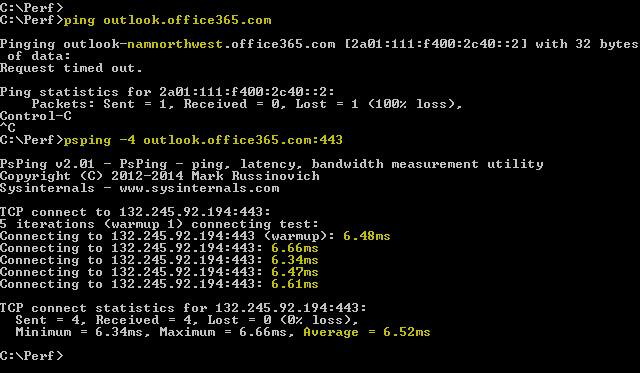

# <a name="performance-troubleshooting-plan-for-office-365"></a>Behandlung von Leistungsproblemen – Plan für Office 365

Müssen Sie die erforderlichen Schritte zum Identifizieren und Beheben von Verzögerungen, hängen und Leistungseinbußen zwischen SharePoint Online, OneDrive for Business, Exchange Online oder Skype for Business Online und Ihrem Clientcomputer kennen? Bevor Sie den Support aufrufen, kann dieser Artikel Ihnen bei der Problembehandlung von Office 365-Leistungsproblemen helfen und sogar einige der häufigsten Probleme beheben.
  
Dieser Artikel ist eigentlich ein Beispiel Aktionsplan, den Sie verwenden können, um wertvolle Daten über Ihr Leistungsproblem zu erfassen. Einige der wichtigsten Probleme sind auch in diesem Artikel enthalten.

Wenn Sie eine neue Netzwerkleistung haben und einen langfristigen Plan zur Überwachung der Leistung zwischen ihren Clientcomputern und Office 365 erstellen möchten, sehen Sie sich die [Leistungsoptimierung und Problembehandlung in Office 365 an – admin und IT pro](performance-tuning-using-baselines-and-history.md).
  
## <a name="sample-performance-troubleshooting-action-plan"></a>Beispiel für eine Leistungsproblembehandlung

Dieser Aktionsplan enthält zwei Teile; eine Vorbereitungsphase und eine Protokollierungs Phase. Wenn Sie jetzt ein Leistungsproblem haben und die Datensammlung ausführen müssen, können Sie diesen Plan sofort verwenden.
  
### <a name="prepare-the-client-computer"></a>Vorbereiten des Clientcomputers
  
- Suchen Sie nach einem Clientcomputer, der das Leistungsproblem reproduzieren kann. Dieser Computer wird während der Problembehandlung verwendet.
- Notieren Sie sich die Schritte, die das Leistungsproblem verursachen, damit Sie bereit sind, wenn es zu Testzeiten kommt.
- Installieren von Tools zum Erfassen und Aufzeichnen von Informationen:
  - Installieren Sie [Netmon 3,4](https://www.microsoft.com/en-us/download/details.aspx?id=4865) (oder verwenden Sie ein entsprechendes Tool zur Netzwerkablaufverfolgung).
  - Installieren Sie die kostenlose Basic-Edition von [HTTPWatch](https://www.httpwatch.com/download/) (oder verwenden Sie ein entsprechendes Tool zur Netzwerkablaufverfolgung).
  - Verwenden Sie eine Bildschirmaufzeichnung, oder führen Sie die Schritte Recorder (PSR. exe) aus, die in Windows Vista und höher zur Verfügung stehen, um die während der Tests ausgeführten Schritte zu protokollieren.

### <a name="log-the-performance-issue"></a>Protokollieren des Leistungsproblems
  
- Schließe alle überflüssigen Internet Browser.
- Starten Sie den Steps Recorder oder eine andere Bildschirmaufzeichnung.
- Starten Sie Ihr Netmon Capture (oder Netzwerk Ablaufverfolgungstool).
- Löschen Sie Ihren DNS-Cache auf dem Clientcomputer von der Befehlszeile aus, indem Sie ipconfig/flushdns ein.
- Starten Sie eine neue Browsersitzung, und aktivieren Sie HTTPWatch.
- Optional: Wenn Sie Exchange Online testen, führen Sie das Exchange Client Performance Analyzer-Tool über die Office 365-Verwaltungskonsole aus.
- Reproduzieren Sie die genauen Schritte, die das Leistungsproblem verursachen.
- Beenden Sie Ihre Netmon-oder andere Tool-Ablaufverfolgung.
- Führen Sie an der Befehlszeile eine Ablauf Verfolgungs Route zu Ihrem Office 365-Abonnement aus, indem Sie den folgenden Befehl eingeben und dann die EINGABETASTE drücken:

  ``` cmd
  tracert <subscriptionname>.onmicrosoft.com
  ```

- Beenden Sie den Steps Recorder, und speichern Sie das Video. Achten Sie darauf, das Datum und die Uhrzeit der Aufzeichnung einzuschließen und zu prüfen, ob die Leistung gut oder schlecht ist.
- Speichern Sie die Ablaufverfolgungsdateien. Achten Sie erneut darauf, das Datum und die Uhrzeit der Aufzeichnung einzuschließen und zu prüfen, ob eine gute oder schlechte Leistung auftritt.

Wenn Sie nicht mit dem Ausführen der in diesem Artikel erwähnten Tools vertraut sind, machen Sie sich keine Sorgen, da wir diese Schritte als nächstes bereitstellen. Wenn Sie diese Art von Netzwerkerfassung gewohnt sind, können Sie überspringen zum Sammeln von [Baselines](performance-tuning-using-baselines-and-history.md#how-to-collect-baselines), die das Filtern und Lesen der Protokolle beschreibt.
  
### <a name="flush-the-dns-cache-first"></a>Leeren des DNS-Caches

Warum? Durch das Leeren des DNS-Caches starten Sie die Tests mit einem sauberen Schiefer. Durch das Löschen des Caches werden die Inhalte der DNS-Resolver auf die aktuellsten Einträge zurückgesetzt. Denken Sie daran, dass ein Flush HOSTs-Dateieinträge nicht entfernt. Wenn Sie Host Dateieinträge ausführlich verwenden, sollten Sie diese Einträge in eine Datei in einem anderen Verzeichnis kopieren und dann die Hostdatei leeren.
  
#### <a name="flush-your-dns-resolver-cache"></a>Leeren des DNS-Resolver-Caches
  
1. Öffnen Sie die Eingabeaufforderungen (entweder **starten** \> **** \> **cmd** oder **Windows Key** \> **cmd**).
2. Geben Sie den folgenden Befehl ein, und drücken Sie die EINGABETASTE:

    ``` cmd
    ipconfig /flushdns
    ```

## <a name="netmon"></a>NetMon

Das netzwerküberwachungstool ([netmon](https://www.microsoft.com/download/details.aspx?id=4865)) von Microsoft analysiert Pakete, also Datenverkehr, der zwischen Computern in Netzwerken weitergeleitet wird. Durch die Verwendung von Netmon zum Nachverfolgen von Datenverkehr mit Office 365 können Sie Paket Kopfzeilen erfassen, anzeigen und lesen, dazwischenliegende Geräte identifizieren, wichtige Einstellungen für die Netzwerkhardware überprüfen, nach verworfenen Paketen suchen und den Datenverkehr zwischen Computern in Ihrem Unternehmen verfolgen. Netzwerk und Office 365. Da der tatsächliche Datenverkehr verschlüsselt ist, das heißt, er (fährt an der Portierung 443 über SSL/TLS, können Sie die gesendeten Dateien nicht lesen. Stattdessen erhalten Sie eine nicht gefilterte Ablaufverfolgung des Pfads, der vom Paket ausgeführt wird, um das Problemverhalten nachzuverfolgen.
  
Stellen Sie sicher, dass Sie derzeit keinen Filter anwenden. Führen Sie stattdessen die Schritte durch, und veranschaulichen Sie das Problem, bevor Sie die Ablaufverfolgung beenden und speichern.
  
Öffnen Sie nach der Installation von Netmon 3,4 das Tool, und führen Sie die folgenden Schritte aus:
  
### <a name="take-a-netmon-trace-and-reproduce-the-issue"></a>Übernehmen einer Netmon-Ablaufverfolgung und reproduzieren des Problems
  
1. Starten Sie Netmon 3,4.
Auf der **Start** Seite gibt es drei Bereiche: **aktuelle Aufzeichnungen**, **Wählen Sie Netzwerke**und die **Erste Schritte mit Microsoft Netzwerk Monitor 3,4. Hinweis**. Im Bereich Netzwerke auswählen erhalten Sie auch eine Liste der Standardnetzwerke, aus denen Sie die Erfassung durchführen können. Stellen Sie sicher, dass hier Netzwerkkarten ausgewählt sind.

2. Klicken Sie oben auf der **Start** Seite auf **neue Aufzeichnung** . Dadurch wird eine neue Registerkarte neben der Registerkarte **Start** Seite mit dem Namen **Capture 1**hinzugefügt.


3. Wenn Sie eine einfache Erfassung ausführen möchten, klicken Sie auf der Symbolleiste auf **starten** .

4. Reproduzieren Sie die Schritte, die ein Leistungsproblem darstellen.

5. Klicken Sie auf **Datei** \> **Speichern**unter **Beenden** \> . Vergessen Sie nicht, das Datum und die Uhrzeit der Zeitzone anzugeben und zu erwähnen, ob es sich um eine schlechte oder gute Leistung handelt.

## <a name="httpwatch"></a>HTTPWatch

[HTTPWatch](https://www.httpwatch.com/download/) ist in Rechnung gestellt und eine kostenlose Version. Die kostenlose Basic Edition umfasst alles, was Sie für diesen Test benötigen. HTTPWatch überwacht den Netzwerkdatenverkehr und die Seitenladezeit direkt über das Browserfenster. HTTPWatch ist ein Plug-in in Internet Explorer, das die Leistung grafisch beschreibt. Die Analyse kann in HTTPWatch Studio gespeichert und angezeigt werden.
  
> [!NOTE]
> Wenn Sie einen anderen Browser verwenden, beispielsweise Firefox, Google Chrome, oder wenn Sie HTTPWatch nicht in Internet Explorer installieren können, öffnen Sie ein neues Browserfenster, und drücken Sie F12 auf der Tastatur. Am unteren Rand des Browsers sollte das Entwickler Tool angezeigt werden. Wenn Sie Opera verwenden, drücken Sie STRG + UMSCHALT + I für Web Inspector, und klicken Sie dann auf die Registerkarte **Netzwerk** , und führen Sie die unten beschriebenen Tests aus. Die Informationen werden geringfügig unterschiedlich sein, aber Ladezeiten werden weiterhin in Millisekunden angezeigt. > HTTPWatch ist auch bei Problemen mit Seitenladezeiten für SharePoint Online sehr hilfreich.
  
### <a name="run-httpwatch-and-reproduce-the-issue"></a>Ausführen von HTTPWatch und reproduzieren des Problems
  
HTTPWatch ist ein Browser-Plug-in, sodass das Tool im Browser für jede Version von Internet Explorer etwas anders ist. In der Regel finden Sie HTTPWatch unter der Befehlsleiste in der Internet Explorer-Browser. Wenn das HTTPWatch-Plug-in in Ihrem Browserfenster nicht angezeigt wird, überprüfen Sie die Version Ihres Browsers, indem Sie auf **Hilfe** \> **zu**oder in späteren Versionen von Internet Explorer klicken, auf das Zahnradsymbol und **über Internet Explorer**. Klicken Sie zum Starten der **Befehls** Leiste mit der rechten Maustaste auf die Menüleiste in Internet Explorer, und klicken Sie auf **Befehlsleiste**.

In der Vergangenheit wurde HTTPWatch sowohl den Befehlen als auch den Explorer-Balken zugeordnet, sodass Sie nach der Installation nicht sofort das Symbol sehen (auch nach dem Neustart), und Ihre **** Symbolleisten für das Symbol. Beachten Sie, dass Symbolleisten angepasst werden können und Optionen hinzugefügt werden können.


  
1. Starten Sie HTTPWatch in einem Browserfenster von Internet Explorer. Sie wird am unteren Rand des Fensters angedockt angezeigt. Klicken Sie auf **Record**.

2. Reproduzieren Sie die genauen Schritte des Leistungsproblems. Klicken Sie in HTTPWatch auf die Schaltfläche **Beenden** .

3. **Speichern** Sie die HTTPWatch, oder senden Sie Sie per **e-Mail**. Denken Sie daran, die Datei so zu benennen, dass Sie Datums-und Uhrzeitinformationen sowie einen Hinweis darauf enthält, ob Ihre Uhr eine gute oder schlechte Leistung demonstriert.


Dieser Screenshot stammt aus der Professional-Version von HTTPWatch. Sie können die in der Basisversion auf einem Computer mit einer professionellen Version entnommenen Ablaufverfolgungen öffnen und dort lesen. Zusätzliche Informationen können über die Ablaufverfolgung über diese Methode zur Verfügung stehen.

## <a name="problem-steps-recorder"></a>Problem Schritt Rekorder

Mit Steps Recorder oder PSR. exe können Sie Probleme während des Auftretens aufzeichnen. Es ist ein sehr nützliches Tool, das sehr einfach ausgeführt werden kann.
  
### <a name="run-problem-steps-recorder-psrexe-to-record-your-work"></a>Führen Sie Problem Schritte Recorder (PSR. exe) aus, um Ihre Arbeit aufzuzeichnen
  
1. Verwenden Sie entweder **Start** \> **Run** \> Type **PSR. exe** \> **OK**, oder klicken Sie auf den **Windows** \> -Tastentyp **PSR. exe** \> , und drücken Sie dann die EINGABETASTE.

2. Wenn das kleine PSR. exe-Fenster angezeigt wird, klicken Sie auf **Record starten** , und reproduzieren Sie die Schritte, die das Leistungsproblem reproduzieren. Sie können Kommentare hinzufügen, indem Sie auf **Kommentare hinzufügen**klicken.

3. Klicken Sie auf **Datensatz beenden** , wenn Sie die Schritte abgeschlossen haben. Wenn das Leistungsproblem ein Seitenrendering ist, warten Sie, bis die Seite gerendert wurde, bevor Sie die Aufzeichnung beenden.

4. Klicken Sie auf **Speichern**.


  
Das Datum und die Uhrzeit werden für Sie aufgezeichnet. Damit wird Ihre PSR mit der Netmon-Ablaufverfolgung und HTTPWatch rechtzeitig verknüpft, und Sie hilft bei der präzisen Problembehandlung. Das Datum und die Uhrzeit im PSR-Eintrag können zeigen, dass eine Minute zwischen der Anmeldung und dem Browsen der URL und dem teilweisen Rendern der Verwaltungswebsite, zum Beispiel, verstrichen ist.
  
## <a name="read-your-traces"></a>Lesen der Ablaufverfolgungen

Es ist nicht möglich, alles über Netzwerk-und Leistungsfehler zu unterrichten, die jemand über einen Artikel wissen muss. Bei der Leistungssteigerung werden Erfahrung und Kenntnisse der Funktionsweise des Netzwerks und in der Regel ausgeführt. Es ist jedoch möglich, eine Liste der häufigsten Probleme zu erstellen und zu veranschaulichen, wie Sie mit Tools die Beseitigung der am häufigsten auftretenden Fehler vereinfachen können.
  
Wenn Sie Fähigkeiten zum Lesen von Netzwerkablaufverfolgungen für Ihre Office 365-Websites aufheben möchten, gibt es keinen besseren Lehrer als die regelmäßige Erstellung von Spuren von Seiten Ladevorgängen und das lesen. Wenn Sie beispielsweise eine Chance haben, laden Sie einen Office 365-Dienst, und verfolgen Sie den Prozess. Filtern Sie die Ablaufverfolgung für DNS-Datenverkehr, oder suchen Sie in der FrameData nach dem Namen des Diensts, den Sie durchsucht haben. Überprüfen Sie die Ablaufverfolgung, um eine Vorstellung der Schritte zu erhalten, die auftreten, wenn der Dienst geladen wird. Auf diese Weise erfahren Sie, wie die normale Seitenauslastung aussehen sollte, und im Fall einer Problembehandlung, insbesondere bei der Leistung, können Sie eine Vielzahl von guten und schlechten Ablaufverfolgungen unterrichten.
  
NetMon verwendet Microsoft IntelliSense im Feld Anzeigefilter. IntelliSense oder Intelligent Code Completion ist der Trick, bei dem Sie einen Punkt eingeben und alle verfügbaren Optionen in einem Dropdown-Auswahlfeld angezeigt werden. Wenn Sie beispielsweise über die TCP-Fensterskalierung besorgt sind, können Sie auf diese Weise zu einem Filter (wie `.protocol.tcp.window < 100`) gelangen.
  

  
Netmon-Ablaufverfolgungen können sehr viel Datenverkehr enthalten. Wenn Sie keine Erfahrung mit dem Lesen haben, ist es wahrscheinlich, dass Sie beim ersten Mal überlastet sind. Als erstes müssen Sie das Signal vom Hintergrundrauschen in der Ablaufverfolgung trennen. Sie haben mit Office 365 getestet, und das ist der gewünschte Datenverkehr. Wenn Sie zum Navigieren durch Ablaufverfolgungen verwendet werden, benötigen Sie diese Liste möglicherweise nicht.
  
Der Datenverkehr zwischen dem Client und Office 365 reist über TLS, was dazu führt, dass der Datenverkehr verschlüsselt und in einer generischen Netmon-Ablaufverfolgung nicht lesbar ist. Ihre Leistungsanalyse muss nicht die Details der Informationen im Paket kennen. Es ist jedoch sehr an Paket Kopfzeilen und den darin enthaltenen Informationen interessiert.
  
### <a name="tips-to-get-a-good-trace"></a>Tipps für eine gute Ablaufverfolgung
  
- Den Wert der IPv4-oder IPv6-Adresse des Clientcomputers kennen. Sie können dies über die Eingabeaufforderungen abrufen, indem Sie **ipconfig** eingeben und dann die EINGABETASTE drücken. Wenn Sie diese Adresse kennen, können Sie auf einen Blick erkennen, ob der Datenverkehr in der Ablaufverfolgung direkt mit dem Clientcomputer verbunden ist. Wenn ein bekannter Proxy vorhanden ist, Pingen Sie ihn, und rufen Sie auch seine IP-Adresse ab.

- Leeren Sie den DNS-Resolver-Cache, und beenden Sie nach Möglichkeit alle Browser, mit Ausnahme derjenigen, in denen Sie Ihre Tests durchführen. Wenn Sie dies nicht tun können, wenn beispielsweise die Unterstützung ein browserbasiertes Tool zum Anzeigen des Desktops Ihres Clientcomputers verwendet, müssen Sie die Ablaufverfolgung filtern.

- Suchen Sie in einer ausgelastet-Ablaufverfolgung nach dem Office 365-Dienst, den Sie verwenden. Wenn Sie Ihren Datenverkehr noch nie oder selten gesehen haben, ist dies ein hilfreicher Schritt bei der Trennung des Leistungsproblems von anderen Netzwerk Rauschen. Hierzu gibt es verschiedene Möglichkeiten. Direkt vor dem Test können Sie _Ping_ oder _PsPing_ für die URL des jeweiligen Diensts verwenden (`ping outlook.office365.com` oder `psping -4 microsoft-my.sharepoint.com:443`zum Beispiel). Sie können diesen Ping-oder PsPing auch problemlos in einer Netmon-Ablaufverfolgung (anhand des Prozess namens) finden. Damit können Sie mit der Suche beginnen.

Wenn Sie nur die NetMon-Ablaufverfolgung zum Zeitpunkt des Problems verwenden, ist das auch in Ordnung. Um sich selbst zu orientieren, verwenden Sie `ContainsBin(FrameData, ASCII, "office")` einen `ContainsBin(FrameData, ASCII, "outlook")`Filter wie oder. Sie können Ihre Framenummer aus der Ablaufverfolgungsdatei aufzeichnen. Möglicherweise möchten Sie auch den Bereich _Frame Summary_ ganz nach rechts scrollen und nach der Spalte Unterhaltungs-ID suchen. Es gibt eine Zahl, die dort für die ID dieser bestimmten Unterhaltung angegeben ist, die Sie auch später aufzeichnen und in Isolation sehen können. Denken Sie daran, diesen Filter zu entfernen, bevor Sie andere Filter anwenden.

> [!TIP]
> NetMon hat viele hilfreiche integrierte Filter. Probieren Sie die Schaltfläche **Filter laden** oben im Bereich _Anzeige_ Filter aus.
  

  

  
Machen Sie sich mit Ihrem Datenverkehr vertraut und lernen Sie, die benötigten Informationen zu finden. So können Sie beispielsweise ermitteln, welches Paket in der Ablaufverfolgung den ersten Verweis auf den Office 365-Dienst enthält, den Sie verwenden (wie "Outlook").

Unter Office 365 Outlook Online als Beispiel beginnt der Datenverkehr ungefähr wie folgt:
  
- DNS-Standard Abfrage und DNS-Antwort für Outlook.office365.com mit übereinstimmenden QueryIDs. Es ist wichtig, den Zeitabstand für dieses Turn-Around zu beachten, und wo in der Welt das Office 365 Global DNS die Anforderung zur Namensauflösung sendet. Idealerweise möglichst lokal und nicht in der Mitte der Welt.

- Eine HTTP GET-Anforderung, deren Statusbericht dauerhaft verschoben wurde (301)

- RWS-Datenverkehr einschließlich RWs Connect-Anforderungen und Connect-Antworten. (Hierbei handelt es sich um Remote WinSock, die eine Verbindung für Sie herstellen.)

- Eine TCP SYN-und TCP-SYN/ACK-Unterhaltung. Viele der Einstellungen in dieser Unterhaltung wirken sich auf Ihre Leistung aus.

- Dann eine Reihe von TLS: TLS-Datenverkehr, in dem die TLS-Handshake-und TLS-Zertifikat Unterhaltungen stattfinden. (Denken Sie daran, dass die Daten über SSL/TLS verschlüsselt werden.)

Alle Teile des Datenverkehrs sind wichtig und verbunden, aber kleine Teile der Ablaufverfolgung enthalten Informationen, die im Hinblick auf die Leistungsproblembehandlung besonders wichtig sind, daher konzentrieren wir uns auf diese Bereiche. Da wir bei Microsoft genügend Office 365-Leistungsproblembehandlung für die Erstellung einer Top-10-Liste allgemeiner Probleme durchgeführt haben, konzentrieren wir uns auf diese Probleme und wie wir Sie als nächstes ausrotten müssen.
  
Wenn Sie Sie nicht alle bereit installiert haben, werden in der folgenden Matrix mehrere Tools verwendet. Nach Möglichkeit. Links werden zu den Installations Punkten bereitgestellt. Die Liste enthält gängige Tools zur Netzwerkablaufverfolgung wie [netmon](https://www.microsoft.com/en-us/download/details.aspx?id=4865) und [wireshark](https://www.wireshark.org/), verwenden Sie jedoch ein beliebiges Ablaufverfolgungstool, mit dem Sie vertraut sind, und in dem Sie den Netzwerkdatenverkehr filtern können. Wenn Sie testen, denken Sie daran:
  
- *Beenden Sie Ihre Browser, und testen Sie mit nur einem Browser mit* -Dies reduziert den gesamten Datenverkehr, den Sie erfassen. Die Ablaufverfolgung ist kürzer.
- *Leeren Sie Ihren DNS-Resolver-Cache auf dem Clientcomputer* -Dies gibt Ihnen eine saubere Tafel, wenn Sie mit der Aufnahme beginnen, für eine sauberere Ablaufverfolgung.

## <a name="common-issues"></a>Häufig auftretende Probleme

Einige häufige Probleme, die auftreten können und wie Sie in der Netzwerkablaufverfolgung zu finden sind.

### <a name="tcp-windows-scaling"></a>TCP-Windows-Skalierung

Im SYN-SYN/ACK gefunden. Legacy-oder Alterungs Hardware nutzen die TCP-Windows-Skalierung möglicherweise nicht.  Ohne ordnungsgemäße TCP-Windows-Skalierungseinstellungen füllt sich der 16-Bit-Standardpuffer in TCP-Kopfzeilen in Millisekunden.  Datenverkehr kann nicht weitergesendet werden, bis der Client eine Bestätigung erhält, dass die ursprünglichen Daten empfangen wurden, was zu Verzögerungen führt.

#### <a name="tools"></a>Tools

- NetMon
- Wireshark

#### <a name="what-to-look-for"></a>Wonach gesucht werden soll

Suchen Sie nach dem SYN-SYN/ACK-Datenverkehr in ihrer Netzwerkablaufverfolgung.  Verwenden Sie in Netmon einen Filter wie `tcp.flags.syn == 1`. Dieser Filter ist in Wireshark identisch.  


Beachten Sie, dass für jedes SYN eine Quellportnummer (SrcPort) vorhanden ist, die im Zielport (DstPort) der zugehörigen Bestätigung (SYN/ACK) übereinstimmt.

Um den von Ihrer Netzwerkverbindung verwendeten Windows-Skalierungswert anzuzeigen, erweitern Sie zuerst den SYN und dann den zugehörigen SYN/ACK.  

  

### <a name="tcp-idle-time-settings"></a>TCP-Leerlaufzeit Einstellungen

Historisch gesehen sind die meisten Umkreisnetzwerke für vorübergehende Verbindungen konfiguriert, was bedeutet, dass Leerlaufverbindungen in der Regel beendet werden. Leerlauf-TCP-Sitzungen können durch Proxys und Firewalls mit mehr als 100 bis 300 Sekunden beendet werden. Dies ist problematisch für Outlook Online, da es langfristige Verbindungen erstellt und verwendet, unabhängig davon, ob Sie inaktiv sind oder nicht.  

Wenn Verbindungen durch Proxy-oder Firewallgeräte beendet werden, wird der Client nicht informiert, und der Versuch, Outlook online zu verwenden, bedeutet, dass ein Clientcomputer wiederholt versucht, die Verbindung wiederherzustellen, bevor eine neue hergestellt wird. Möglicherweise wird das Produkt, die Eingabeaufforderungen oder die geringe Leistung beim Laden der Seite angezeigt.

#### <a name="tools"></a>Tools

- NetMon
- Wireshark

#### <a name="what-to-look-for"></a>Wonach gesucht werden soll

Sehen Sie sich in Netmon das Feld Zeitversatz für einen Roundtrip an. Ein Roundtrip ist die Zeit zwischen dem Client, der eine Anforderung an den Server sendet und eine Antwort zurück erhält. Überprüfen Sie zwischen dem Client und dem Ausstieg Punkt (ex. Client-\> Proxy) oder der Client zu Office 365 (Client--\> Office 365). Sie können dies in vielen Pakettypen erkennen.

Der Filter in Netmon kann beispielsweise oder in Wireshark aussehen `.Protocol.IPv4.Address == 10.102.14.112 AND .Protocol.IPv4.Address == 10.201.114.12` `ip.addr == 10.102.14.112 &amp;&amp; ip.addr == 10.201.114.12`.  

> [!TIP]
> Sie wissen nicht, ob die IP-Adresse in Ihrer Ablaufverfolgung zu Ihrem DNS-Server gehört? Probieren Sie es in der Befehlszeile aus. Klicken Sie auf **Start** \> **Ausführen** \> , geben Sie **cmd**ein, oder drücken Sie die **Windows-Taste** \> , und geben Sie **cmd**ein. Geben `nslookup <the IP address from the network trace>`Sie an der Eingabeaufforderungen ein. Verwenden Sie zum Testen nslookup für die IP-Adresse Ihres eigenen Computers. > eine Liste der IP-Bereiche von Microsoft finden Sie unter [Office 365-URLs und IP-Adressbereiche](https://technet.microsoft.com/en-us/library/hh373144.aspx).

Wenn ein Problem vorliegt, rechnen Sie damit, dass lange Zeitoffsets angezeigt werden, in diesem Fall (Outlook Online), insbesondere in TLS: TLS-Pakete, die den Durchgang von Anwendungsdaten anzeigen (beispielsweise in Netmon können Anwendungs `.Protocol.TLS AND Description == "TLS:TLS Rec Layer-1 SSL Application Data"`Datenpakete über). Sie sollten einen reibungslosen Verlauf in der Zeit über die Sitzung hinwegsehen. Wenn bei der Aktualisierung von Outlook Online lange Verzögerungen angezeigt werden, kann dies durch einen hohen Grad an gesendeter Rücksetzen verursacht werden.

### <a name="latencyround-trip-time"></a>Wartezeit/Roundtrip-Zeit

Die Wartezeit ist ein Maß, das eine Menge abhängig von vielen Variablen ändern kann, wie beispielsweise Aktualisieren von Alterungs Geräten, Hinzufügen einer großen Anzahl von Benutzern zu einem Netzwerk und der prozentuale Anteil der Gesamtbandbreite, die von anderen Vorgängen in einer Netzwerkverbindung beansprucht wird.

Auf dieser Seite für die [Netzwerkplanung und Leistungsoptimierung für Office 365](network-planning-and-performance.md) stehen bandbreitenrechner für Office 365 zur Verfügung.  

Sie müssen die Geschwindigkeit der Verbindung oder die Bandbreite der ISP-Verbindung messen? Testen Sie diese Website (oder Websites wie Sie): [Speedtest Official Site](https://www.speedtest.net/)und [Pingtest](http://www.pingtest.net/).

#### <a name="tools"></a>Tools

- Ping
- PsPing
- NetMon
- Wireshark

#### <a name="what-to-look-for"></a>Wonach gesucht werden soll

Zum Nachverfolgen der Wartezeit in einer Ablaufverfolgung profitieren Sie davon, dass Sie die IP-Adresse des Clientcomputers und die IP-Adresse des DNS-Servers in Office 365 aufgezeichnet haben. Dies dient zur einfacheren Ablauf Verfolgungs Filterung. Wenn Sie sich über einen Proxy verbinden, benötigen Sie die IP-Adresse des Clientcomputers, die Proxy/Ausgangs-IP-Adresse und die Office 365-DNS-IP-Adresse, um die Arbeit zu vereinfachen.  

Eine an Outlook.office365.com gesendete Ping-Anforderung informiert Sie über den Namen des Datencenters, das die Anforderung empfängt, auch wenn ping *möglicherweise* nicht in der Lage ist, eine Verbindung zum Senden der Warenzeichen Folge-ICMP-Pakete herzustellen. Wenn Sie PsPing (ein kostenloses Tool zum herunterladen) verwenden, und spezifisch für den Anschluß (443) und vielleicht IPv4 (-4) verwenden, erhalten Sie eine durchschnittliche Roundtrip-Zeit für gesendete Pakete. Dies funktioniert für andere URLs in den Office 365-Diensten wie `psping -4 yourSite.sharepoint.com:443`. In der Tat können Sie eine Reihe von Pings angeben, um ein größeres Beispiel für Ihren Durchschnitt zu erhalten, `psping -4 -n 20 yourSite-my.sharepoint.com:443`probieren Sie etwas ähnliches aus.  

> [!NOTE]
> PsPing sendet keine ICMP-Pakete. Sie pingt TCP-Pakete über einen bestimmten Anschluß, sodass Sie alle bekannten verwenden können, die Sie kennen. Versuchen Sie in Office 365, das SSL/TLS verwendet, den Anschluss: 443 an Ihren PsPing anzufügen.



Wenn Sie die Seite Slow Performing Office 365 während einer Netzwerkablaufverfolgung geladen haben, sollten Sie eine Netmon-oder wireshark `DNS`-Ablaufverfolgung für filtern. Dies ist eine der IPS, die wir suchen.  

Nachfolgend finden Sie die erforderlichen Schritte zum Filtern von Netmon, um die IP-Adresse abzurufen (und die DNS-Latenz zu betrachten). In diesem Beispiel wird Outlook.office365.com verwendet, Sie können aber auch die URL eines SharePoint Online-Mandanten verwenden (beispielsweise HiThere.SharePoint.com).  

1. Pingen Sie `ping outlook.office365.com` die URL, und notieren Sie in den Ergebnissen den Namen und die IP-Adresse des DNS-Servers, an den die Ping-Anforderung gesendet wurde.
2. Netzwerkablaufverfolgung Öffnen der Seite oder Ausführen der Aktion, die das Leistungsproblem verursacht, oder, wenn Sie eine hohe Wartezeit für den Ping selbst erkennen, Netzwerkablaufverfolgung.
3. Öffnen Sie die Ablaufverfolgung in Netmon, und Filtern Sie nach DNS (dieser Filter funktioniert auch in Wireshark, ist `-- dns`jedoch für Groß-/Kleinschreibung anfällig). Da Sie den Namen des DNS-Servers von Ihrem Ping-Signal kennen, können Sie in Netmon wie folgt auch schneller Filtern `DNS AND ContainsBin(FrameData, ASCII, "namnorthwest")`:, wie in Wireshark DNS und Frame enthält "namnorthwest".<br/>Öffnen Sie das Antwortpaket, und klicken Sie im Fenster Netmon- **Rahmen Details** auf **DNS** , um weitere Informationen zu erhalten. In den DNS-Informationen finden Sie die IP-Adresse des DNS-Servers, an den die Anforderung in Office 365. Sie benötigen diese IP-Adresse für den nächsten Schritt (das PsPing-Tool). Entfernen Sie den Filter, klicken Sie mit der rechten Maustaste auf die DNS-Antwort in Netmon (**Frame Summary** \> **Find Conversations** \> **DNS**), um die DNS-Abfrage und-Antwort nebeneinander anzuzeigen.
4. Beachten Sie in Netmon auch die Zeit Offset-Spalte zwischen der DNS-Anforderung und-Antwort. Im nächsten Schritt ist das Tool für die einfache Installation und Verwendung von [PsPing](https://technet.microsoft.com/en-us/sysinternals/jj729731.aspx) sehr praktisch, da ICMP oft auf Firewalls blockiert ist und PsPing die Wartezeit in Millisekunden elegant nachverfolgt. PsPing vervollständigt eine TCP-Verbindung zu einer Adresse und einem Anschluss (in unserem Fall Open-443).
5. Installieren Sie PsPing.
6. Öffnen Sie eine Eingabeaufforderungen \> ( \> starten Sie den Typ cmd oder \> Windows Key type cmd), und wechseln Sie in das Verzeichnis, in dem Sie PsPing installiert haben, um den PsPing-Befehl auszuführen. In meinen Beispielen sehen Sie, dass ich einen perf-Ordner im Stammverzeichnis von C erstellt habe. Sie können das gleiche für den Schnellzugriff tun.
7. Geben Sie den Befehl so ein, dass Sie Ihre PsPing anhand der IP-Adresse des Office 365-DNS-Servers aus ihrer früheren Netmon-Ablaufverfolgung, einschließlich `psping -n 20 132.245.24.82:445`der-Nummer, wie. Dadurch erhalten Sie ein Sampling von 20 Pings und durchschnittlich die Wartezeit, wenn PsPing beendet wird.

Wenn Sie über einen Proxy Server zu Office 365 gehen, sind die Schritte etwas anders. Sie würden zunächst auf Ihren Proxy Server PsPing, um einen durchschnittlichen Wartezeit-Wert in Millisekunden zu Proxy/Ausgangs-und zurück zu erhalten, und dann entweder PsPing auf dem Proxy ausführen oder auf einem Computer mit einer direkten Internet Verbindung, um den fehlenden Wert abzurufen (der eine zu Office 365 und zurück).  

Wenn Sie PsPing über den Proxy ausführen, haben Sie zwei Millisekunden Werte: Client Computer zu Proxy Server oder Ausgangspunkt und Proxy Server zu Office 365. Und Sie sind fertig! Nun, notieren Sie sich trotzdem.  

Wenn Sie PsPing auf einem anderen Clientcomputer ausführen, der eine direkte Verbindung mit dem Internet hat, also ohne Proxy, haben Sie zwei Millisekunden Werte: Clientcomputer zu Proxy Server oder Ausgangspunkt und Clientcomputer zu Office 365. Subtrahieren Sie in diesem Fall den Wert von Clientcomputer zu Proxy Server oder Ausgangspunkt vom Wert des Clientcomputers zu Office 365, und Sie haben die RTT-Nummern vom Clientcomputer zum Proxy Server oder Ausgangspunkt und vom Proxy Server oder Ausgangspunkt an offi CE 365.

Wenn Sie jedoch einen Clientcomputer am betroffenen Standort finden, der direkt verbunden ist, oder den Proxy umgehen, können Sie feststellen, ob das Problem dort vorkommt, und danach testen.

Latenz, wie in einer Netmon-Ablaufverfolgung zu sehen ist, können diese zusätzlichen Millisekunden hinzugefügt werden, wenn Sie in einer bestimmten Sitzung ausreichend sind.  


> [!NOTE]
> Ihre IP-Adresse kann anders sein als die hier gezeigten IPS, beispielsweise kann Ihr Ping etwas mehr wie 157.56.0.0/16 oder einen ähnlichen Range zurückgeben. Eine Liste der von Office 365 verwendeten Bereiche finden Sie unter [Office 365-URLs und IP-Adressbereiche](https://technet.microsoft.com/en-us/library/hh373144.aspx).

Denken Sie daran, alle Knoten zu erweitern (dafür gibt es eine Schaltfläche oben), wenn Sie beispielsweise nach 132,245 suchen möchten.

### <a name="proxy-authentication"></a>Proxy Authentifizierung

Dies gilt nur für Sie, wenn Sie einen Proxy Server durchlaufen. Wenn dies nicht der Fall ist, können Sie diese Schritte überspringen. Bei ordnungsgemäßer Funktion sollte die Proxyauthentifizierung konsistent in Millisekunden erfolgen. Während der Spitzenauslastungszeiten (beispielsweise) sollten Sie keine zeitweiligen fehlerhaften Leistung sehen.  

Wenn die Proxy Authentifizierung eingeschaltet ist, müssen Sie jedes Mal, wenn Sie eine neue TCP-Verbindung zu Office 365 herstellen, Informationen abrufen, einen Authentifizierungsprozess hinter den Kulissen durchlaufen. Wenn Sie beispielsweise von Kalender zu e-Mail in Outlook Online wechseln, authentifizieren Sie sich. Wenn auf einer Seite Medien oder Daten von mehreren Standorten oder Orten angezeigt werden, authentifizieren Sie sich in SharePoint Online für jede TCP-Verbindung, die zum Rendern der Daten erforderlich ist.  

In Outlook Online können langsame Ladezeiten auftreten, wenn Sie zwischen Kalender und Ihrem Postfach oder langsame Seitenlasten in SharePoint Online wechseln. Es gibt jedoch auch andere Symptome, die hier nicht aufgeführt sind.

Die Proxyauthentifizierung ist eine Einstellung auf Ihrem Ausstiegs Proxy Server. Wenn ein Leistungsproblem mit Office 365 verursacht wird, müssen Sie sich an Ihr Netzwerkteam wenden.  

#### <a name="tools"></a>Tools

- NetMon
- Wireshark

#### <a name="what-to-look-for"></a>Wonach gesucht werden soll

Die Proxy Authentifizierung erfolgt immer dann, wenn eine neue TCP-Sitzung erstellt werden muss, um Dateien oder Informationen vom Server anzufordern oder um Informationen zu liefern. Beispielsweise wird die Proxyauthentifizierung rund um HTTP-GET-oder HTTP-POST-Anforderungen angezeigt. Wenn Sie die Frames anzeigen möchten, in denen Sie Anforderungen in Ihrer Ablaufverfolgung authentifizieren, fügen Sie die Spalte "NTLMSSP Summary" zu Netmon und Filter `.property.NTLMSSPSummary`for hinzu. Um zu sehen, wie lange die Authentifizierung dauert, fügen Sie die Spalte Zeit Delta hinzu.

So fügen Sie Netmon eine Spalte hinzu:

1. Klicken Sie mit der rechten Maustaste auf eine Spalte wie **Description**.
2. Klicken Sie auf **Spalten auswählen**.
3. Suchen Sie _NTLMSSP Summary_ and _time Delta_ in der Liste, und klicken Sie auf **Hinzufügen**.
4. Verschieben Sie die neuen Spalten vor oder hinter der _Beschreibungs_ Spalte, sodass Sie sie nebeneinander lesen können.
5. Klicken Sie auf **OK**.

Auch wenn Sie die Spalte nicht hinzufügen, funktioniert der Netmon-Filter. Ihre Problembehandlung ist jedoch viel einfacher, wenn Sie sehen können, in welcher Stufe der Authentifizierung Sie sich befinden.

Wenn Sie nach Instanzen der Proxy Authentifizierung suchen, müssen Sie alle Frames untersuchen, bei denen eine NTLM-Herausforderung vorliegt, oder eine Authentifizierungsmeldung. Klicken Sie bei Bedarf mit der rechten Maustaste auf einen bestimmten Datenverkehr, \> und suchen Sie TCP. Beachten Sie die Zeit Delta Werte in diesen Unterhaltungen.


Eine Verzögerung von vier Sekunden bei der Proxyauthentifizierung, wie in Wireshark zu sehen. Die **Zeit Delta aus vorheriger angezeigter Frame** -Spalte wurde durch Klicken mit der rechten Maustaste auf das Feld mit demselben Namen in der Frame Details und auswählen als Spalte hinzufügen.  <br/> 

### <a name="dns-performance"></a>DNS-Leistung

Die Namensauflösung funktioniert am besten und am schnellsten, wenn Sie so weit wie möglich am Land des Kunden stattfindet.

Wenn die DNS-Namensauflösung im Ausland stattfindet, kann Sie Sekunden zum Laden der Seite hinzufügen. Im Idealfall geschieht die Namensauflösung in unter 100M. Wenn dies nicht der Fall ist, sollten Sie weitere Untersuchungen durchführen.

> [!TIP]
> Sie wissen nicht, wie die Client Konnektivität in Office 365 funktioniert? Sehen Sie sich das Client Connectivity Reference-Dokument [hier](https://technet.microsoft.com/en-us/library/dn741250.aspx)an.

#### <a name="tools"></a>Tools

- NetMon
- Wireshark
- PsPing

#### <a name="what-to-look-for"></a>Wonach gesucht werden soll

Die Analyse der DNS-Leistung ist in der Regel ein anderer Auftrag für eine Netzwerkablaufverfolgung. PsPing ist jedoch auch hilfreich, um eine mögliche Ursache zu Regeln.

DNS-Datenverkehr basiert auf TCP, und UDP-Anforderungen und-Antworten sind eindeutig mit einer ID gekennzeichnet, mit der eine bestimmte Anforderung mit ihrer spezifischen Antwort abgeglichen werden kann. DNS-Datenverkehr wird angezeigt, wenn beispielsweise SharePoint Online einen Netzwerknamen oder eine URL auf einer Webseite verwendet. Als Faustregelgilt, dass der größte Teil des Datenverkehrs, außer beim Übertragen von Zonen, über UDP ausgeführt wird.

In Netmon und Wireshark ist der einfachste Filter, mit dem Sie DNS-Datenverkehr betrachten können, einfach `dns`. Achten Sie darauf, bei der Angabe des Filters Kleinbuchstaben zu verwenden. Denken Sie daran, Ihren DNS-Auflösungscache zu leeren, bevor Sie mit dem reproduzieren des Problems auf dem Clientcomputer beginnen. Wenn Sie beispielsweise eine langsame SharePoint Online-Seite für die Homepage laden, sollten Sie alle Browser schließen, einen neuen Browser öffnen, die Ablaufverfolgung starten, den DNS-Resolver-Cache leeren und zu Ihrer SharePoint Online-Website navigieren. Sobald die gesamte Seite aufgelöst wurde, sollten Sie die Ablaufverfolgung beenden und speichern.


Sie möchten sich den Zeit Offset hier ansehen. Außerdem kann es hilfreich sein, die Spalte **Zeit Delta** zu Netmon hinzuzufügen, indem Sie die folgenden Schritte ausführen:

1. Klicken Sie mit der rechten Maustaste auf eine Spalte wie **Description**.
2. Klicken Sie auf **Spalten auswählen**.
3. Suchen Sie in der Liste nach _Zeit Delta_ , und klicken Sie auf **Hinzufügen**.
4. Verschieben Sie die neue Spalte vor oder hinter der _Beschreibungs_ Spalte, damit Sie sie nebeneinander lesen können.
5. Klicken Sie auf **OK**.

Wenn Sie eine interessante Abfrage finden, sollten Sie sie isolieren, indem Sie im Bereich "Frame Details" mit der rechten Maustaste **** \> auf diese Abfrage klicken und dann unter Unterhaltungen **-DNS**suchen auswählen. Beachten Sie, dass der Bereich Netzwerk Unterhaltungen im Protokoll des UDP-Datenverkehrs direkt zu der jeweiligen Unterhaltung wechselt.


In Wireshark können Sie eine Spalte für die DNS-Zeit erstellen. Übernehmen Sie die Ablaufverfolgung (oder öffnen Sie eine Ablaufverfolgung) `dns`in Wireshark, und Filtern Sie nach `dns.time`oder, hilfreicher,. Klicken Sie auf eine beliebige DNS-Abfrage, und erweitern Sie im Bereich mit Details `Domain Name System (response)` die Details. Es wird ein Feld für die Zeit angezeigt (beispielsweise `[Time: 0.001111100 seconds]`. Klicken Sie mit der rechten Maustaste auf dieses Mal, und wählen Sie **als Spalte übernehmen**aus. Dadurch erhalten Sie eine **Zeit** Spalte für eine schnellere Sortierung Ihrer Ablaufverfolgung. Klicken Sie auf die neue Spalte, um nach absteigenden Werten zu sortieren, um zu sehen, welcher DNS-Anruf am längsten aufgelöst wurde.

[Ein Durchsuchen von SharePoint Online gefiltert in Wireshark by (Kleinbuchstaben) DNS. Time, mit der Zeit von den Details zu einer Spalte und sortiert Aufsteigend.](media/1439dcc2-12ff-4ee2-9ef3-1484cf79c384.PNG)

Wenn Sie die DNS-Auflösungszeit genauer untersuchen möchten, versuchen Sie es mit einem PsPing für den von TCP verwendeten DNS-Schnitt `psping <IP address of DNS server>:53`Stelle (zum Beispiel). Wird ein Leistungsproblem weiterhin angezeigt? Wenn Sie dies tun, ist das Problem mit größerer Wahrscheinlichkeit ein größeres Netzwerkproblem als ein Problem spezifisch der DNS-Anwendung, auf die Sie sich begeben, um die Lösung zu tun. Es sollte auch noch erwähnt werden, dass ein Ping an Outlook.office365.com Ihnen mitteilt, wo die DNS-Namensauflösung für Outlook Online stattfindet (beispielsweise Outlook-namnorthwest.office365.com).

Wenn das Problem mit DNS-spezifisch aussieht, kann es erforderlich sein, sich an Ihre IT-Abteilung zu wenden, um sich mit DNS-Konfigurationen und DNS-Weiterleitungen zu befassen.

### <a name="proxy-scalability"></a>Proxy Skalierbarkeit

Dienste wie Outlook online in Office 365 gewähren Clients mehrere langfristige Verbindungen. Daher kann jeder Benutzer mehr Verbindungen verwenden, die eine längere Lebensdauer erfordern.  

#### <a name="tools"></a>Tools

Mathematik  

#### <a name="what-to-look-for"></a>Wonach gesucht werden soll

Es gibt keine spezielle Netzwerkablaufverfolgung oder Problembehandlungstool. Stattdessen basiert Sie auf Bandbreiten Berechnungen, die Einschränkungen und anderen Variablen zugewiesen sind.  

### <a name="tcp-max-segment-size"></a>Maximale TCP-Segment Größe

Im SYN-SYN/ACK gefunden.  Führen Sie diese Überprüfung in jeder Leistungsnetzwerk Ablaufverfolgung durch, die Sie getroffen haben, um sicherzustellen, dass TCP-Pakete so konfiguriert sind, dass die maximal zulässige Datenmenge übertragen wird.

Das Ziel besteht darin, eine MSS von 1460 Byte für die Übertragung von Daten anzuzeigen. Wenn Sie sich hinter einem Proxy befinden oder einen NAT verwenden, denken Sie daran, diesen Test von Client zu Proxy/Ausstieg/NAT auszuführen, und von Proxy/Ausstieg/NAT zu Office 365, um optimale Ergebnisse zu erzielen. Hierbei handelt es sich um verschiedene TCP-Sitzungen.

#### <a name="tools"></a>Tools

NetMon

#### <a name="what-to-look-for"></a>Wonach gesucht werden soll

TCP max Segment Size (MSS) ist ein weiterer Parameter des dreifachen Handshakes in der Netzwerkablaufverfolgung, das heißt, Sie finden die benötigten Daten im SYN-SYN/ACK-Paket. MSS ist eigentlich ziemlich einfach zu sehen.

Öffnen Sie eine beliebige Leistungsnetzwerk Ablaufverfolgung, und suchen Sie nach der Verbindung, die Sie neugierig sind, oder die das Leistungsproblem demonstriert.

> [!NOTE]
> Wenn Sie sich eine Ablaufverfolgung ansehen und den für Ihre Unterhaltung relevanten Datenverkehr ermitteln müssen, Filtern Sie nach der IP des Clients oder der IP des Proxyservers oder des Ausgangspunkts oder beidem. Wenn Sie direkt wechseln, müssen Sie die URL, die Sie testen, auf die IP-Adresse von Office 365 in der Ablaufverfolgung pingen und nach dieser filtern.

Suchen Sie die Ablaufverfolgung aus zweiter Hand? Verwenden Sie Filter, um sich selbst zu orientieren. Führen Sie in Netmon eine Suche basierend auf der URL aus, Beispiels `Containsbin(framedata, ascii, "sphybridExample")`Weise, notieren Sie sich die Framenummer.

In Wireshark verwenden Sie etwas `frame contains "sphybridExample"`ähnliches. Wenn Sie feststellen, dass Sie Remote-WinSock (RWS)-Datenverkehr gefunden haben (er kann als [PSH, ACK] in Wireshark angezeigt werden), denken Sie daran, dass die RWs-Verbindung kurz vor dem relevanten SYN-SYN/ACKs, wie zuvor erläutert, zu sehen ist.

An diesem Punkt können Sie die Rahmennummer aufzeichnen, den Filter löschen, auf den **gesamten Datenverkehr** im Fenster Netzwerk Unterhaltungen in Netmon klicken, um das nächstgelegene SYN zu sehen.

Wichtig: Wenn Sie zum Zeitpunkt der Ablaufverfolgung keine IP-Adressinformationen erhalten haben, erhalten Sie beim Auffinden Ihrer URL in der Ablaufverfolgung ( `sphybridExample-my.sharepoint.com`zum Beispiel) die IP-Adressen, nach denen gefiltert werden kann.

Suchen Sie die Verbindung in der Ablaufverfolgung, die Sie sehen möchten. Sie können dies tun, indem Sie entweder die Ablaufverfolgung durchsuchen, indem Sie nach IP-Adressen filtern oder bestimmte Konversations-IDs mithilfe des Fensters Netzwerk Unterhaltungen in Netmon auswählen. Nachdem Sie das SYN-Paket gefunden haben, erweitern Sie TCP (in NetMon) oder Transmission Control Protocol (in Wireshark) im Fenster "Frame Details". Erweitern Sie TCP-Optionen und MaxSegmentSize. Suchen Sie den zugehörigen SYN-ACK-Frame, und erweitern Sie TCP-Optionen und MaxSegmentSize. Der kleinere der beiden Werte ist die maximale Segment Größe. In dieser Abbildung verwende ich die integrierte Spalte in Netmon, die als TCP-Problembehandlung bezeichnet wird.  


Die integrierte Spalte befindet sich am oberen Rand des Bereichs **Details** . (Klicken Sie erneut auf **Spalten** , und wählen Sie dann **Zeitzone**aus, um zur Normalansicht zurückzukehren.)


Hier ist eine gefilterte Ablaufverfolgung in Wireshark. Es gibt einen speziellen Filter für den MSS-Wert `tcp.options.mss`(). Die Frames eines SYN-, SYN/ACK-Handshakes werden am unteren Rand des Wireshark-Äquivalents mit Frame Details verknüpft (also Frame 47 ACK, Links zu 46 SYN/ACK, Links zu 43 SYN), um diese Art von Arbeit zu vereinfachen.


Wenn Sie die selektive **Bestätigung** (Nächstes Thema in dieser Matrix) überprüfen müssen, sollten Sie Ihre Ablaufverfolgung nicht abschließen!

### <a name="selective-acknowledgment"></a>Selektive Bestätigung

Im SYN-SYN/ACK gefunden. Muss sowohl in SYN als auch in SYN/ACK als zulässig gemeldet werden. Die selektive Bestätigung (Sack) ermöglicht eine reibungslose erneute Weitergabe von Daten, wenn ein Paket oder keine Pakete fehlen. Geräte können dieses Feature deaktivieren, was zu Leistungsproblemen führen kann.

Wenn Sie sich hinter einem Proxy befinden oder einen NAT verwenden, denken Sie daran, diesen Test von Client zu Proxy/Ausstieg/NAT auszuführen, und von Proxy/Ausstieg/NAT zu Office 365, um optimale Ergebnisse zu erzielen. Hierbei handelt es sich um verschiedene TCP-Sitzungen.

#### <a name="tools"></a>Tools

NetMon

#### <a name="what-to-look-for"></a>Wonach gesucht werden soll

Die selektive Bestätigung (Sack) ist ein weiterer Parameter im SYN-SYN/ACK-Handshake. Sie können die Ablaufverfolgung für SYN-SYN/ACK auf vielerlei Weise filtern.

Suchen Sie die Verbindung in der Ablaufverfolgung, die Sie anzeigen möchten, indem Sie die Ablaufverfolgung überprüfen, nach IP-Adressen filtern oder auf eine Unterhaltungs-ID im Fenster Netzwerk Unterhaltungen in Netmon klicken. Nachdem Sie das SYN-Paket gefunden haben, erweitern Sie TCP in Netmon oder Transmission Control Protocol in Wireshark im Abschnitt Frame Details. Erweitern Sie TCP-Optionen und dann Sack. Suchen Sie den zugehörigen SYN-ACK-Frame, und erweitern Sie TCP-Optionen und das Feld Sack. Stellen Sie sicher, dass ein bestimmter Sack in SYN und SYN/ACK zulässig ist. Hier sind sackwerte, die in Netmon und wireshark angezeigt werden.


### <a name="dns-geolocation"></a>DNS-geolocation

Wo im World Office 365 versucht, Ihren DNS-Anruf zu beheben, wirkt sich Ihre Verbindungsgeschwindigkeit aus.

In Outlook Online wird nach Abschluss der ersten DNS-Suche der Speicherort des DNS verwendet, um eine Verbindung mit Ihrem nächstgelegenen Datencenter herzustellen. Sie werden mit einem Outlook Online-CAS-Server verbunden, der das Backbone-Netzwerk zum Herstellen einer Verbindung mit dem Rechenzentrum (DC) verwendet, in dem Ihre Daten gespeichert werden. Dies ist schneller.

Beim Zugriff auf SharePoint Online wird ein Benutzer, der ins Ausland reist, an sein aktives Datencenter weitergeleitet – das ist der DC, dessen Standort auf der Startbasis des SpO-Mandanten basiert (also ein DC in den USA, wenn der Benutzer USA-basiert).

Lync Online verfügt über aktive Knoten in mehr als einem Domänencontroller. Wenn Anforderungen für lync Online-Instanzen gesendet werden, bestimmt der DNS von Microsoft, wo in der Welt die Anforderung stammt, und gibt IP-Adressen von der nächstgelegenen regionalen DC zurück, in der lync Online aktiv ist.

> [!TIP]
> Benötigen Sie weitere Informationen dazu, wie Clients eine Verbindung mit Office 365 herstellen? Sehen Sie sich den Referenzartikel zur [Client Konnektivität](https://technet.microsoft.com/en-us/library/dn741250.aspx) (und die hilfreichen Grafiken) an.

#### <a name="tools"></a>Tools

- Ping
- PsPing

#### <a name="what-to-look-for"></a>Wonach gesucht werden soll

Anforderungen zur Namensauflösung von den DNS-Servern des Clients zu den DNS-Servern von Microsoft sollten in den meisten Fällen dazu führen, dass Microsoft DNS die IP-Adresse eines regionalen Datencenters (DC) zurückgibt. Was bedeutet das für Sie? Wenn sich Ihr Hauptsitz in Bangalore, Indien, befindet, Sie aber in den USA unterwegs sind, wenn Ihr Browser eine Anforderung für Outlook Online stellt, sollten Sie die IP-Adressen der Microsoft-DNS-Server an Rechenzentren in den USA übergeben – ein regionales Rechenzentrum. Wenn e-Mails aus Outlook benötigt werden, werden diese Daten über das Microsoft Quick Backbone-Netzwerk zwischen den Rechenzentren übermittelt.

DNS funktioniert am schnellsten, wenn die Namensauflösung so weit wie möglich am Benutzer Speicherort erfolgt. Wenn Sie sich in Europa befinden, möchten Sie zu einem Microsoft-DNS in Europa wechseln und (idealerweise) mit einem Datacenter in Europa umgehen. Die Leistung von einem Client in Europa, der auf DNS und ein Rechenzentrum in Amerika läuft, wird langsamer.

Führen Sie das Ping-Tool gegen Outlook.office365.com aus, um zu ermitteln, wo in der Welt Ihre DNS-Anforderung geroutet wird. Wenn Sie sich in Europa befinden, sollten Sie eine Antwort von so etwas wie Outlook-emeawest.office365.com sehen. In Amerika erwarten Sie etwas wie Outlook-namnorthwest.office365.com.

Öffnen Sie die Eingabeaufforderungen auf dem Clientcomputer ( \> über \> Start cmd oder Windows \> Key type cmd). Geben Sie Ping Outlook.office365.com ein, und drücken Sie die EINGABETASTE. Denken Sie daran,-4 anzugeben, wenn Sie den Ping über IPv4 angeben möchten. Möglicherweise erhalten Sie keine Antwort von den ICMP-Paketen, aber der Name des DNS, an den die Anforderung geroutet wurde, sollte angezeigt werden. Wenn Sie die Latenz Nummern für diese Verbindung anzeigen möchten, versuchen Sie PsPing an die IP-Adresse des Servers, der von Ping zurückgegeben wird.  


### <a name="office-365-application-troubleshooting"></a>Office 365-Anwendungsproblem Behandlung

#### <a name="tools"></a>Tools

- NetMon
- HTTPWatch
- F12-Konsole im Browser

In diesem netzwerkspezifischen Artikel werden keine Tools behandelt, die bei der anwendungsspezifischen Problembehandlung verwendet werden. Sie finden jedoch Ressourcen, [die Sie auf dieser Seite](https://support.office.com/en-us/article/Network-planning-and-performance-tuning-for-Office-365-e5f1228c-da3c-4654-bf16-d163daee8848)verwenden *können* .

## <a name="related-topics"></a>Verwandte Themen

[Verwalten von Office 365-Endpunkten](https://support.office.com/article/99cab9d4-ef59-4207-9f2b-3728eb46bf9a)
  
[Häufig gestellte Fragen zu Office 365-Endpunkten](https://support.office.com/article/d4088321-1c89-4b96-9c99-54c75cae2e6d)
