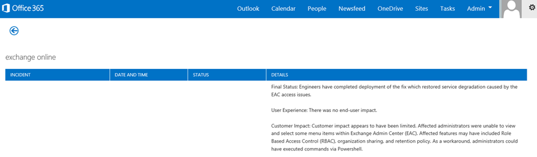
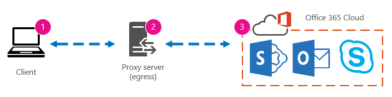
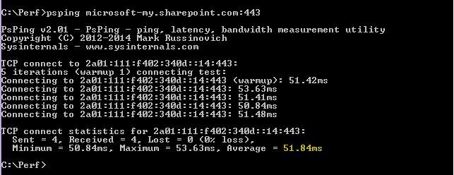

# Office 365-Leistung optimieren mit Basisplänen und Leistungsverlauf Office 365 performance tuning using baselines and performance history

Es gibt einige einfache Methoden zum Überprüfen der Verbindungsleistung zwischen Office 365 und Ihrem Unternehmen, mit denen Sie eine grobe Basis ihrer Konnektivität einrichten können.There are some simple ways to check the connection performance between Office 365 and your business that will let you establish a rough baseline of your connectivity. Wenn Sie den Leistungsverlauf ihrer Clientcomputerverbindungen kennen, können Sie Probleme frühzeitig erkennen, erkennen und Vorhersagen.Knowing the performance history of your client computer connections can help you detect emerging issues early, identify, and predict problems.
  
Wenn Sie nicht an Leistungsproblemen arbeiten, soll dieser Artikel Ihnen helfen, einige häufige Fragen zu berücksichtigen, wie Sie wissen, dass das Problem, das Sie sehen, ein Leistungsproblem und kein Office 365-Dienst Vorfall ist.If you're not used to working on performance issues, this article is designed to help you consider some common questions, like How do you know the problem you're seeing is a performance issue and not an Office 365 service incident? Wie können Sie eine gute Leistung langfristig planen?How can you plan for good performance, long term? Wie können Sie die Leistung im Auge behalten?How can you keep an eye on performance? Wenn Ihr Team oder Ihre Clients während der Verwendung von Office 365 eine langsame Leistung erkennen, und Sie sich über eine dieser Fragen wundern, lesen Sie weiter.If your team or clients are seeing slow performance while using Office 365, and you wonder about any of these questions, read on.
  
> [!IMPORTANT]
> **Haben Sie jetzt ein Leistungsproblem zwischen Ihrem Client und Office 365?****Have a performance issue between your client and Office 365 right now?** Führen Sie die im [Plan für die Leistungsproblembehandlung für Office 365](performance-troubleshooting-plan.md)beschriebenen Schritte aus.Follow the steps outlined in the [Performance troubleshooting plan for Office 365](performance-troubleshooting-plan.md). 
    
## Etwas, was Sie über die Leistung von Office 365 wissen solltenSomething you should know about Office 365 performance

Office 365 befindet sich in einem dedizierten Microsoft-Netzwerk mit hoher Kapazität, das nicht nur durch Automatisierung, sondern durch reale Personen ständig überwacht wird.Office 365 lives inside a high-capacity, dedicated Microsoft network that is steadily monitored not just by automation, but by real people. Ein Teil der Rolle der Verwaltung der Office 365-Cloud besteht darin, die Leistungsoptimierung einzurichten und dort zu straffen, wo es möglich ist.Part of the role of maintaining the Office 365 cloud is building-in performance tuning and streamlining where it's possible. Da Clients der Office 365-Cloud eine Verbindung über das Internet herstellen müssen, besteht ein kontinuierlicher Aufwand zur Optimierung der Leistung in Office 365-Diensten.Since clients of the Office 365 cloud have to connect across the Internet, there is a continuous effort to fine-tune the performance across Office 365 services too. Leistungsverbesserungen werden in der Cloud nie wirklich angehalten, und es gibt viele gesammelte Erfahrungen mit der Beibehaltung der Cloud und schnell.Performance improvements never really stop in the cloud, and there is a lot of accumulated experience with keeping the cloud healthy and quick. Wenn Sie ein Leistungsproblem bei der Verbindung von Ihrem Standort zu Office 365 haben, sollten Sie nicht mit einem Support Fall beginnen und warten.Should you experience a performance issue connecting from your location to Office 365, it's best not to start with, and wait on, a Support case. Stattdessen sollten Sie mit der Untersuchung des Problems von "innen nach außen" beginnen.Instead, you should begin investigating the problem from 'the inside out'. Das heißt, beginnen Sie innerhalb Ihres Netzwerks, und arbeiten Sie Ihren Weg zu Office 365.That is, start inside of your network, and work your way out to Office 365. Bevor Sie einen Fall mit dem Office 365-Support öffnen, können Sie Daten erfassen und Maßnahmen ergreifen, die Ihr Problem untersuchen und beheben können.Before you open a case with Office 365 Support, you can gather data and take actions that will explore, and may resolve, your problem.
  
> [!IMPORTANT]
> Berücksichtigen Sie die Kapazitätsplanung und Grenzen in Office 365.Be aware of capacity planning and limits in Office 365. Diese Informationen stellen Sie vor der Kurve, wenn Sie versuchen, ein Leistungsproblem zu beheben.That information will put you ahead of the curve when trying to resolve a performance issue. Hier finden Sie einen Link zur [Office 365-Plattformdienst Beschreibung](https://technet.microsoft.com/en-us/library/office-365-service-descriptions.aspx).Here's a link to the [Office 365 Platform Service Description](https://technet.microsoft.com/en-us/library/office-365-service-descriptions.aspx). Hierbei handelt es sich um einen zentralen Hub, und alle von Office 365 angebotenen Dienste verfügen über einen Link, der von hier aus zu den eigenen Dienstbeschreibungen wechselt.This is a central hub, and all the services offered by Office 365 have a link that goes to their own Service Descriptions from here. Wenn Sie beispielsweise die Standardgrenzwerte für SharePoint Online anzeigen möchten, klicken Sie auf [SharePoint Online-Dienstbeschreibung](https://technet.microsoft.com/en-us/library/sharepoint-online-service-description.aspx) , und suchen Sie den [Abschnitt SharePoint Online-Grenzwerte](https://go.microsoft.com/fwlink/p/?LinkID=856113).That means, should you need to see the standard limits for SharePoint Online, for example, you would click [SharePoint Online Service Description](https://technet.microsoft.com/en-us/library/sharepoint-online-service-description.aspx) and locate its [SharePoint Online Limits section](https://go.microsoft.com/fwlink/p/?LinkID=856113). 
  
Stellen Sie sicher, dass Sie in Ihre Problembehandlung eingehen, indem Sie verstehen, dass die Leistung eine gleitende Skalierung ist, dass es nicht darum geht, einen idealisierten Wert zu erreichen und ihn dauerhaft beizubehalten (wenn Sie glauben, dass dies so ist, dann gelegentliche Aufgaben mit hoher Bandbreite wie on-Boarding a große Anzahl von Benutzern oder große Datenmigrationen sind sehr belastend – also planen Sie die Leistungsbeeinträchtigungen.Make sure you go into your troubleshooting with the understanding that performance is a sliding scale, it's not about achieving an idealized value and maintaining it permanently (if you believe this is so, then occasional high-bandwidth tasks like on-boarding a large number of users, or doing large data migrations will be very stressful -- so do plan for performance impacts then). Sie können und sollten über eine ungefähre Vorstellung Ihrer Leistungsziele verfügen, aber viele Variablen werden in die Leistung eingehen, daher variiert die Leistung.You can, and should, have a rough idea of your performance targets, but a lot of variables play into performance, therefore, performance varies. Das ist die Art der Leistung.That's the nature of performance. 
  
Bei der Fehlerbehebung bei der Leistung geht es nicht darum, bestimmte Ziele zu erreichen und diese Nummern unbegrenzt beizubehalten, sondern um vorhandene Aktivitäten zu verbessern.Performance troubleshooting isn't about meeting specific goals and maintaining those numbers indefinitely, it's about improving existing activities, given all the variables. 
  
## Wie sieht ein Leistungsproblem aus?Okay, what does a performance problem look like?

Zunächst müssen Sie sicherstellen, dass das, was Sie erleben, tatsächlich ein Leistungsproblem und kein Dienst Vorfall ist.First, you need to make sure that what you are experiencing is indeed a performance issue and not a service incident. Ein Leistungsproblem unterscheidet sich von einem Servicevorfall in Office 365.A performance problem is different from a service incident in Office 365. Hier erfahren Sie, wie Sie sie auseinander halten.Here's how to tell them apart.
  
Wenn der Office 365-Dienst Probleme hat, handelt es sich um einen Servicevorfall.If the Office 365 service is having issues, that's a service incident. Sie sehen rote oder gelbe Symbole unter **aktuelle Integrität** im Office 365 Admin Center, Sie können auch feststellen, dass die Leistung auf Clientcomputern eine Verbindung mit Office 365.You will see red or yellow icons under **Current health** in the Office 365 admin center, you may also notice slow performance on client computers connecting to Office 365. Wenn die aktuelle Integrität beispielsweise ein rotes Symbol meldet und Sie neben \*\*\*\* Exchange Untersuchungen sehen, erhalten Sie möglicherweise auch eine Reihe von Anrufen von Personen in Ihrer Organisation, die sich darüber beschweren, dass Clientpostfächer, die Exchange Online verwenden, schlecht ausgeführt werden.For example, if Current health reports a red icon and you see **Investigating** beside Exchange, you might then also receive a bunch of calls from people in your organization who complain that client mailboxes that use Exchange Online are performing badly. In diesem Fall wird davon ausgegangen, dass Ihre Exchange Online-Leistung nur zu Problemen innerhalb des Diensts wurde.In that case, it's reasonable to assume that your Exchange Online performance just became a victim of issues within the Service. 
  

  
An diesem Punkt sollten Sie, der Office 365-Administrator, die **aktuelle Integrität** überprüfen und dann **Details und Verlauf häufig anzeigen**, um auf dem System auf dem Laufenden zu bleiben.At this point, you, the Office 365 admin, should check **Current health** and then **View details and history**, frequently, to keep up to date on maintenance we perform on the system. Das **aktuelle Integritäts** Dashboard wurde erstellt, um Sie über Änderungen an und die Probleme im Dienst zu informieren.The **Current health** dashboard was made to update you about changes to, and problems in, the service. Die Hinweise und Erläuterungen, die in den Gesundheits Verlauf geschrieben wurden, admin to admin, helfen Ihnen dabei, ihre Auswirkungen zu beurteilen und Sie über die laufende Arbeit zu informieren.The notes and explanations written to health history, admin to admin, are there to help you gauge your impact, and to keep you posted about ongoing work. 
  

  
Ein Leistungsproblem ist kein Dienst Vorfall, obwohl Vorfälle zu einer langsamen Leistung führen können.A performance issue isn't a service incident, even though incidents can cause slow performance. Ein Leistungsproblem sieht wie folgt aus:A performance issue looks like this:
  
- Ein Leistungsproblem tritt auf, unabhängig davon, was die **aktuelle Integrität** des Office 365 admin Centers für den Dienst meldet.A performance issue occurs no matter what the Office 365 admin center **Current health** is reporting for the service. 
    
-  Ein Verhalten, das früher relativ nahtlos war, dauert lange, oder es wird nie abgeschlossen.A behavior that used to be relatively seamless takes a long time to complete or never completes. 
    
- Sie können das Problem auch replizieren, oder zumindest wissen Sie, dass es geschieht, wenn Sie die richtigen Schritte ausführen.You can replicate the problem too, or, at least, you know it will happen if you do the right series of steps.
    
-  Wenn das Problem intermittierend ist, gibt es immer noch ein Muster, beispielsweise wissen Sie, dass von 10:00 am Sie Anrufe von Benutzern haben, die nicht zuverlässig auf Office 365 zugreifen können, und dass die Anrufe um 12.00 Uhr absterben.If the problem is intermittent, there is still a pattern, for example, you know that by 10:00 AM you will have calls from users who can't reliably access Office 365, and that the calls will die down around noon. 
    
Das klingt wohl vertraut; vielleicht zu vertraut.This probably sounds familiar; maybe too familiar. Wenn Sie wissen, dass es sich um ein Leistungsproblem handelt, wird die Frage "Was tun Sie als nächstes?".Once you know it's a performance problem, the question becomes, "What do you do next?" Mit dem Rest dieses Artikels können Sie genau feststellen, ob.The rest of this article helps you determine exactly that.
  
## Definieren und Testen des LeistungsproblemsHow to define and test the performance problem

Leistungsprobleme treten oft im Laufe der Zeit auf, daher kann es schwierig sein, das eigentliche Problem zu definieren.Performance issues often emerge over time, so it can be challenging to define the actual problem. Sie müssen eine gute Problembeschreibung und eine gute Idee des Problem Kontexts erstellen, und dann müssen Sie wiederholbare Testschritte durchführen, um den Tag zu gewinnen.You need to create a good problem statement and a good idea of issue context, and then you need to repeatable testing steps to win the day. Andernfalls können Sie ohne eigenes Verschulden verloren gehen.Otherwise, through no fault of your own, you may be lost. Warum?Why? Nun, hier sind einige Beispiele für Fehler Anweisungen, die nicht genügend Informationen enthalten:Well, here are some examples of problems statements that don't provide enough information:
  
- Der Wechsel von meinem Posteingang zu meinem Kalender war früher etwas, das ich nicht bemerkt hatte, und jetzt ist es eine Kaffeepause.Switching from my Inbox to my Calendar used to be something I didn't notice, and now it's a coffee-break. Können Sie es wie gewohnt tun?Can you make it act like it used to?
    
- Das Hochladen meiner Dateien in SharePoint Online dauert ewig.Uploading my files to SharePoint Online is taking forever. Warum ist es am Nachmittag langsam, aber zu einem anderen Zeitpunkt, ist es schnell?Why is it slow in the afternoon, but any other time, it's fast? Kann es nicht einfach sein, schnell zu sein?Can't it just be fast?
    
Die obigen Problemaussagen stellen mehrere große Herausforderungen dar.There are several large challenges posed by the problem statements above. Insbesondere gibt es eine Vielzahl von Mehrdeutigkeiten.Specifically, there are a lot of ambiguities to deal with. Beispiel:for example:
  
- Es ist unklar, wie der Wechsel zwischen Posteingang und Kalender verwendet, um auf dem Laptop zu handeln.It's unclear how switching between Inbox and Calendar used to act on the laptop.
    
- Wenn der Benutzer sagt, "kann es nicht einfach sein", was ist "schnell"?When the user says, "Can't it just be fast", what's "fast"?
    
- Wie lange ist "Forever"?How long is "forever"? Ist das mehrere Sekunden oder Minuten, oder könnte der Benutzer zu Mittagessen gehen, und es wäre noch zehn Minuten nach dem wieder einkehren des Benutzers fertig?Is that several seconds, or minutes, or could the user go to lunch and it would finish up ten minutes after the user got back?
    
All dies liegt daran, dass der Administrator und die Problembehandlung viele Details aus solchen Fehlermeldungen nicht erkennen können.All of this is without considering that the admin and troubleshooter can't be aware of many details from problem statements like these. Wenn das Problem beispielsweise begonnen hat; Dass der Benutzer von zu Hause aus arbeitet und immer nur langsames wechseln in einem Heimnetzwerk sieht; Der Benutzer muss mehrere andere RAM-intensive Anwendungen auf dem lokalen Client ausführen, oder der Benutzer führt ein älteres Betriebssystem aus oder hat keine aktuellen Updates ausgeführt.For example, when the problem started happening; That the user works from home and only ever sees slow switching while on a home network; That the user must run several other RAM intensive applications on the local client, or the user is running an older operating system or hasn't run recent updates.
  
Wenn Benutzer ein Leistungsproblem melden, gibt es viele Informationen, die erfasst werden müssen.When users report a performance problem, there's a lot of information to collect. Das Sammeln dieser Informationen ist Teil eines Prozesses, der das Problem als Scoping bezeichnet oder es untersucht.Collecting this information is part of a process called scoping the issue, or investigating it. Es folgt eine grundlegende Scoping-Liste, die Sie verwenden können, um Informationen zu Ihrem Leistungsproblem zu sammeln.The following is a basic scoping list you can use to collect information about your performance issue. Diese Liste ist nicht vollständig, aber Sie ist ein Ort, an dem Sie einen eigenen starten können:This list is not exhaustive, but it's a place to start one of your own: 
  
- Zu welchem Zeitpunkt ist das Problem aufgetreten, und um zu welcher Tageszeit?On what date did the issue happen, and around what time of day or night?
    
- Welche Art von Clientcomputer haben Sie verwendet, und wie wird eine Verbindung mit dem Unternehmensnetzwerk hergestellt (VPN, verkabelt, drahtlos)?What kind of client computer were you using, and how does it connect to the business network (VPN, Wired, Wireless)?
    
- Arbeiteten Sie Remote oder waren Sie im Büro?Were you working remotely or were you in the office?
    
- Haben Sie die gleichen Aktionen auf einem anderen Computer ausprobiert und dasselbe Verhalten festzustellen?Did you try the same actions on another computer and see the same behavior?
    
- Führen Sie die Schritte durch, die Ihnen Probleme bereiten, damit Sie die von Ihnen ausgeführten Aktionen schreiben können.Walk through the steps that are giving you the trouble so that you can write the actions you take down.
    
- Wie langsam ist die Leistung in Sekunden oder Minuten?How slow in seconds or minutes is the performance?
    
- Wo in der Welt befinden Sie sich?Where in the world are you located?
    
Einige dieser Fragen sind offensichtlicher als andere.Some of these questions are more obvious than others. Die meisten jeder verstehen eine Problembehandlung benötigt die genauen Schritte, um das Problem zu reproduzieren.Most everyone will understand a troubleshooter needs the exact steps to reproduce the issue. Wie können Sie denn sonst aufzeichnen, was falsch ist, und wie sonst können Sie testen, ob das Problem behoben ist?After all, how else can you record what's wrong, and how else can you test if the issue is fixed? Nicht so offensichtlich sind beispielsweise "welches Datum und welche Uhrzeit haben Sie das Problem angezeigt?" und "wo in der Welt befinden Sie sich?", Informationen, die im Tandem verwendet werden können.Less obvious are things like "What date and time did you see the issue?", and "Where in the world are you located?", information that can be used in tandem. Je nachdem, wann der Benutzer funktioniert hat, kann ein paar Stunden Zeitunterschied bedeuten, dass die Wartung bereits in Teilen des Unternehmensnetzwerks erfolgt.Depending on when the user was working, a few hours of time difference may mean maintenance is already underway on parts of your company's network. Wenn Ihr Unternehmen beispielsweise über eine hybride Implementierung verfügt, wie eine hybride SharePoint-Suche, die Suchindizes sowohl in SharePoint Online als auch in einer lokalen SharePoint Server 2013-Instanz Abfragen kann, werden möglicherweise Updates in der lokalen Farm ausgeführt.If, for example, your company has a hybrid implementation, like a hybrid SharePoint Search, which can query search indexes in both SharePoint Online and an On-premises SharePoint Server 2013 instance, updates may be underway in the on-premises farm. Wenn sich Ihr Unternehmen in der Cloud befindet, kann die Systemwartung das Hinzufügen oder Entfernen von Netzwerkhardware, das Bereitstellen von unternehmensweiten Updates oder das Ändern von DNS-oder anderen Kern Infrastrukturen sein.If your company is all in the cloud, system maintenance may include adding or removing network hardware, rolling out updates that are company-wide, or making changes to DNS, or other core infrastructure.
  
Wenn Sie ein Leistungsproblem beheben, ist es ein bisschen wie ein Tatort, müssen Sie präzise und aufmerksam sein, um Schlussfolgerungen aus dem Beweis zu ziehen.When you're troubleshooting a performance problem, it's a bit like a crime scene, you need to be precise and observant to draw any conclusions from the evidence. Zu diesem Zweck müssen Sie eine gute Problem Aussage erhalten, indem Sie Beweise sammeln.In order to do this, you must get a good problem statement by gathering evidence. Sie sollte den Kontext des Computers, den Kontext des Benutzers, beim Beginn des Problems und die genauen Schritte, die das Leistungsproblem offen legen, einbeziehen.It should include the computer's context, the user's context, when the problem began, and the exact steps that exposed the performance issue. Diese Problem Aussage sollte und bleiben Sie die oberste Seite in Ihren Notizen.This problem statement should be, and stay, the topmost page in your notes. Wenn Sie die Problem Anweisung erneut durchlaufen, nachdem Sie die Lösung bearbeitet haben, führen Sie die erforderlichen Schritte aus, um zu testen und zu prüfen, ob das Problem durch die von Ihnen ausgeführten Aktionen gelöst wurde.By walking through the problem statement again after you work on the resolution, you are taking the steps to test and prove whether the actions you take have resolved the issue. Dies ist wichtig, um zu wissen, wann Ihre Arbeit dort erledigt ist.This is critical to knowing when your work, there, is done.
  
## Wissen Sie, wie die Leistung früher ausschaute, als Sie gut war?Do you know how performance used to look when it was good?

Wenn Sie Pech haben, weiß niemand.If you're unlucky, nobody knows. Niemand hatte Zahlen.Nobody had numbers. Das bedeutet, dass niemand die einfache Frage beantworten kann, "wie viele Sekunden dauerte es, bis ein Posteingang in Office 365?" oder "wie lange hat es verwendet, als die Führungskräfte eine lync Online-Besprechung hatten?", die ein gängiges Szenario für viele Unternehmen ist.That means nobody can answer the simple question "About how many seconds did it used to take to bring up an Inbox in Office 365?", or "How long did it used to take when the Executives had a Lync Online meeting?", which is a common scenario for many companies.
  
Hier fehlt eine Leistungsbasis.What's missing here is a performance baseline.
  
Baselines bieten Ihnen einen Kontext für Ihre Leistung.Baselines give you a context for your performance. Je nach den Anforderungen Ihres Unternehmens sollten Sie einen Basisplan gelegentlich auf häufige Maßnahmen festlegen.You should take a baseline occasionally to frequently, depending on the needs of your company. Wenn Sie ein größeres Unternehmen sind, kann Ihr Operations-Team bereits Basispläne für Ihre lokale Umgebung erstellen.If you are a larger company, your Operations team may take baselines for your on-premises environment already. Wenn Sie beispielsweise alle Exchange-Server am ersten Montag des Monats und alle SharePoint-Server am dritten Montag Patchen, verfügt Ihr Betriebsteam wahrscheinlich über eine Liste der Aufgaben und Szenarien, die nach dem Patchen ausgeführt werden, um zu prüfen, ob kritische Funktionen Betriebs.For example, if you patch all the Exchange servers on the first Monday of the month, and all your SharePoint servers on the third Monday, your Operations team probably has a list of tasks and scenarios it runs post-patching, to prove that critical functions are operational. Öffnen Sie beispielsweise den Posteingang, klicken Sie auf senden/empfangen, und stellen Sie sicher, dass die Ordner aktualisiert werden, oder navigieren Sie in SharePoint auf der Hauptseite der Website, wechseln Sie zur Seite Unternehmenssuche, und führen Sie eine Suche aus, die Ergebnisse zurückgibt.For example, opening the Inbox, clicking Send/Receive, and making sure the folders update, or, in SharePoint, browsing the main page of the site, going into the enterprise Search page, and doing a search that returns results.
  
Wenn Ihre Anwendungen in Office 365 sind, können Sie einige der grundlegenden Baselines Messen, die Sie in Millisekunden von einem Clientcomputer innerhalb Ihres Netzwerks bis zu einem Ausgangspunkt oder dem Punkt, an dem Sie Ihr Netzwerk verlassen, und zu Office 365 ausgehen.If your applications are in Office 365, some of the most fundamental baselines you can take measure the time (in milliseconds) from a client computer inside your network, to an egress point, or the point where you leave your network and go out to Office 365. Hier sind einige hilfreiche Baselines, die Sie untersuchen und aufzeichnen können:Here are some helpful baselines that you can investigate and record:
  
- Identifizieren Sie die Geräte zwischen dem Clientcomputer und dem Ausgangspunkt, beispielsweise Ihrem Proxy Server.Identify the devices between your client computer and your egress point, for example, your proxy server.
    
  - Sie müssen Ihre Geräte kennen, damit Sie über einen Kontext (IP-Adressen, Gerätetyp usw.) für Leistungsprobleme verfügen.You need to know your devices so that you have context (IP addresses, type of device, et cetera) for performance problems that arise.
    
  - Proxy Server sind häufige Ausgangspunkte, sodass Sie überprüfen können, welcher Proxy Server für den Webbrowser festgelegt ist, falls vorhanden.Proxy servers are common egress points, so you can check your web browser to see what proxy server it is set to use, if any.
    
  - Es gibt Drittanbietertools, die Ihr Netzwerk erkennen und zuordnen können, aber die sicherste Möglichkeit, Ihre Geräte zu kennen, besteht darin, ein Mitglied Ihres Netzwerkteams zu Fragen.There are third party tools that can discover and map your network, but the safest way to know your devices is to ask a member of your network team.
    
- Identifizieren Sie Ihren Internet Dienstanbieter (ISP), notieren Sie Ihre Kontaktinformationen, und Fragen Sie, wie viele Stromkreise wie viel Bandbreite Sie haben.Identify your Internet service provider (ISP), write down their contact information, and ask how many circuits how much bandwidth you have.
    
- Identifizieren Sie innerhalb Ihres Unternehmens Ressourcen für die Geräte zwischen dem Client und dem Ausgangspunkt, oder identifizieren Sie einen Notfallkontakt, um mit Netzwerkproblemen zu sprechen.Inside your company, identify resources for the devices between your client and the egress point, or identify an emergency contact to talk to about networking issues.
    
Hier sind einige Grundlagen, die einfache Tests mit Tools für Sie berechnen können:Here are some baselines that simple testing with tools can calculate for you:
  
- Zeit vom Clientcomputer bis zum Ausgangspunkt in MillisekundenTime from your client computer to your egress point in milliseconds
    
- Zeit von Ihrem Ausstieg Punkt zu Office 365 in MillisekundenTime from your egress point to Office 365 in milliseconds
    
- Standort in der Welt des Servers, der die URLs für Office 365 beim Browsen auflöstLocation in the world of the server that resolves the URLS for Office 365 when you browse
    
- Die Geschwindigkeit der DNS-Auflösung Ihres ISP in Millisekunden, Inkonsistenzen bei der Paket Ankunft (Netzwerk Jitter), Upload-und Downloadzeiten in MillisekundenThe speed of your ISP's DNS resolution in milliseconds, inconsistencies in packet arrival (network jitter), upload and download times in milliseconds
    
Wenn Sie nicht mit der Ausführung dieser Schritte vertraut sind, werden wir in diesem Artikel ausführlicher erläutert.If you're unfamiliar with how to carry out these steps, we'll go into more detail in this article. 
  
## Was ist eine Baseline?What is a baseline?

Sie kennen die Auswirkungen, wenn es schlecht geht, aber wenn Sie Ihre historischen Leistungsdaten nicht kennen, ist es nicht möglich, einen Kontext dafür zu haben, wie schlimm es geworden ist und wann.You'll know the impact when it goes bad, but if you don't know your historical performance data, it's not possible to have a context for how bad it may have become, and when. Ohne einen Basisplan fehlt Ihnen also der Schlüssel zur Lösung des Puzzles: das Bild im Feld Puzzle.So without a baseline, you're missing the key clue to solve the puzzle: the picture on the puzzle box. Bei der Leistungsproblembehandlung benötigen Sie einen *Vergleichs* Punkt.In performance troubleshooting, you need a point of  *comparison*  . Einfache Leistungsbasislinien sind nicht schwer zu übernehmen.Simple performance baselines aren't difficult to take. Ihr Operations Team kann die Aufgabe haben, diese nach einem Zeitplan auszuführen.Your Operations team can be tasked with carrying these out on a schedule. Angenommen, Ihre Verbindung sieht wie folgt aus:For example, let's say your connection looks like this: 
  

  
Das führt dazu, dass Sie sich mit Ihrem Netzwerkteam unterhalten haben und herausgefunden haben, dass Sie Ihre Firma über einen Proxy Server für das Internet verlassen, und dass der Proxy alle Anforderungen verarbeitet, die Ihr Clientcomputer an die Cloud sendet.That means you've checked with your network team and found out that you leave your company for the Internet through a proxy server, and that proxy handles all the requests your client computer sends to the cloud. In diesem Fall sollten Sie eine vereinfachte Version der Verbindung zeichnen, in der alle dazwischenliegenden Geräte aufgeführt sind.In this case, you should draw a simplified version of your connection that lists all the intervening devices. Fügen Sie nun Tools ein, mit denen Sie die Leistung zwischen dem Client, dem Ausgangspunkt (in dem Sie Ihr Netzwerk für das Internet verlassen) und der Office 365-Cloud testen können.Now, insert tools that you can use to test the performance between the client, the egress point (where you leave your network for the Internet), and the Office 365 cloud.
  

  
Die Optionen werden aufgrund des Umfangs an Fachwissen, den Sie benötigen, um die Leistungsdaten zu finden, als **einfach** und **fortgeschritten** aufgeführt.The options are listed as **Simple** and **Advanced** because of the amount of expertise you need in order to find the performance data. Eine Netzwerkablaufverfolgung nimmt im Vergleich zu Befehlszeilentools wie PsPing und TraceTCP viel Zeit in Anspruch.A network trace will take a lot of time, compared to running command-line tools like PsPing and TraceTCP. Diese beiden Befehlszeilentools wurden ausgewählt, da Sie keine ICMP-Pakete verwenden, die von Office 365 blockiert werden, und weil Sie die Zeit in Millisekunden angeben, die erforderlich ist, um den Clientcomputer oder den Proxy Server (wenn Sie Zugriff haben) zu verlassen und an Office 365 zu gelangen.These two command-line tools were chosen because they don't use ICMP packets, which will be blocked by Office 365, and because they give the time in milliseconds that it takes to leave the client computer, or proxy server (if you have access) and arrive at Office 365. Jeder einzelne Hop von einem Computer zu einem anderen wird am Ende mit einem Zeitwert, und das ist ideal für Baselines!Each individual hop from one computer to another will end up with a time value, and that's great for baselines! Ebenso wichtig ist, dass Sie mit diesen Befehlszeilentools eine Portierung auf den Befehl hinzufügen können, dies ist nützlich, da Office 365 über den Anschluss 443 kommuniziert, der von Secure Sockets Layer und Transport Layer Security (SSL und TLS) verwendet wird.Just as importantly, these command-line tools allow you to add a port number onto the command, this is useful because Office 365 communicates over port 443, which is the port used by Secure Sockets Layer and Transport Layer Security (SSL and TLS). Andere Drittanbietertools sind jedoch möglicherweise bessere Lösungen für Ihre Situation.However, other third-party tools may be better solutions for your situation. Microsoft unterstützt nicht alle diese Tools, wenn Sie also aus irgendeinem Grund nicht PsPing und TraceTCP arbeiten können, navigieren Sie mit einem Tool wie Netmon zur Netzwerkablaufverfolgung.Microsoft doesn't support all of these tools, so if, for some reason, you can't get PsPing and TraceTCP working, move on to a network trace with a tool like Netmon. 
  
Sie können eine Baseline vor Geschäftszeiten, wieder bei starker Nutzung und dann wieder nach Stunden ablegen.You can take a baseline before business hours, again during heavy use, and then again after hours. Dies führt dazu, dass Sie eine Ordnerstruktur haben, die wie folgt aussieht:This means you may have a folder structure that looks a bit like this in the end:
  

  
Sie sollten auch eine Benennungskonvention für Ihre Dateien auswählen.You should also pick a naming convention your files. Im Folgenden finden Sie einige Beispiele:Here are some examples:
  
- Feb_09_2015_9amPST_PerfBaseline_Netmon_ClientToEgress_NormalFeb_09_2015_9amPST_PerfBaseline_Netmon_ClientToEgress_Normal
    
- Jan_10_2015_3pmCST_PerfBaseline_PsPing_ClientToO365_bypassProxy_SLOWJan_10_2015_3pmCST_PerfBaseline_PsPing_ClientToO365_bypassProxy_SLOW
    
- Feb_08_2015_2pmEST_PerfBaseline_BADPerfFeb_08_2015_2pmEST_PerfBaseline_BADPerf
    
- Feb_08_2015_8-30amEST_PerfBaseline_GoodPerfFeb_08_2015_8-30amEST_PerfBaseline_GoodPerf
    
Es gibt viele verschiedene Möglichkeiten, dies zu tun, aber die Verwendung des Formats \*\* \<DateTime\>\<, was im Test\> geschieht\*\* , ist ein guter Ausgangspunkt.There are lots of different ways to do this, but using the format **\<dateTime\>\<what's happening in the test\>** is a good place to start. Wenn Sie sich mit diesem Thema beschäftigen, werden Sie viel helfen, wenn Sie versuchen, Probleme zu einem späteren Zeitpunkt zu beheben.Being diligent about this will help a lot when you are trying to troubleshoot issues later. Später können Sie sagen: "Ich habe am 8. Februar zwei Spuren genommen, eine gute Leistung und eine schlechte, sodass wir Sie vergleichen können."Later, you'll be able to say "I took two traces on February 8th, one showed good performance and one showed bad, so we can compare them". Dies ist für die Problembehandlung äußerst hilfreich.This is extremely helpful for troubleshooting. 
  
Sie müssen über eine organisierte Methode verfügen, um Ihre Verlaufs Grundlagen beizubehalten.You need to have an organized way to keep your historical baselines. In diesem Beispiel wurden mit den einfachen Methoden drei Befehlszeilen Ausgänge erstellt, und die Ergebnisse wurden als Screenshots gesammelt, aber möglicherweise haben Sie stattdessen Netzwerk-Aufnahmedateien.In this example, the simple methods produced three command line outputs and the results were collected as screen shots, but you may have network capture files instead. Verwenden Sie die Methode, die für Sie am besten geeignet ist.Use the method that works best for you. Speichern Sie Ihre historischen Baselines, und verweisen Sie Sie an Punkten, an denen Sie Änderungen am Verhalten von Onlinediensten bemerken.Store your historical baselines and refer to them at points where you notice changes in the behavior of online services. 
  
## Gründe für die Erfassung von Leistungsdaten während eines PilotprojektsWhy collect performance data during a pilot?

Es gibt keinen besseren Zeitpunkt für die Erstellung von Baselines als während eines Pilotprojekts des Office 365-Diensts.There is no better time to start making baselines than during a pilot of the Office 365 service. Ihr Büro hat möglicherweise Tausende von Benutzern, Hunderttausende oder fünf, aber auch mit einer kleinen Anzahl von Benutzern können Sie Tests durchführen, um Leistungsschwankungen zu messen.Your office may have thousands of users, hundreds of thousands, or it may have five, but even with a small number of users, you can perform tests to measure fluctuations in performance. Bei einem Großunternehmen kann ein repräsentatives Beispiel für mehrere hundert Benutzer, die Office 365 steuern, nach außen auf mehrere Tausende projiziert werden, damit Sie wissen, wo Probleme auftreten können, bevor Sie auftreten.In the case of a large company, a representative sample of several hundred users piloting Office 365 can be projected outward to several thousands so you know where issues might arise before they happen.
  
Im Fall eines kleinen Unternehmens, bei dem das on-Boarding bedeutet, dass alle Benutzer gleichzeitig zum Dienst wechseln und kein Pilotprojekt vorhanden ist, halten Sie die Leistung so fest, dass Sie allen Personen, die möglicherweise eine Fehlerbehebung ausführen müssen, Daten zeigen.In the case of a small company, where on-boarding means that all users go to the service at the same time and there is no pilot, keep performance measures so that you have data to show to anyone who may have to troubleshoot a badly performing operation. Wenn Sie beispielsweise feststellen, dass Sie plötzlich in der Zeit, die Sie zum Hochladen einer mittelgroßen Grafik benötigen, in der es sehr schnell vorkommt, zu Fuß um Ihr Gebäude gehen können.For example, if you notice that all of a sudden you can walk around your building in the time it takes to upload a medium-sized graphic where it used to happen very quickly.
  
## Erfassen von BaselinesHow to collect baselines

Für alle Problem Behandlungspläne müssen Sie diese Dinge mindestens ermitteln:For all troubleshooting plans you need to identify these things at a minimum:
  
- Der verwendete Clientcomputer (der Computer oder das Gerät, eine IP-Adresse und die Aktionen, die das Problem verursacht haben)The client computer you're using (the type of computer or device, an IP address, and the actions that caused the issue)
    
- Wo sich der Clientcomputer in der Welt befindet (beispielsweise ob dieser Benutzer in einem VPN zum Netzwerk, Remote oder im Firmenintranet arbeitet)Where the client computer is located in the world (for example, whether this user on a VPN to the network, working remotely, or on the company intranet)
    
- Der Ausgangspunkt, den der Clientcomputer in Ihrem Netzwerk verwendet (der Punkt, an dem der Datenverkehr Ihr Unternehmen für einen ISP oder das Internet verlässt)The egress point the client computer uses from your network (the point at which traffic leaves your business for an ISP or the Internet)
    
 Sie können das Layout Ihres Netzwerks vom Netzwerkadministrator herausfinden.You can find out the layout of your network from the network administrator. Wenn Sie sich in einem kleinen Netzwerk befinden, sehen Sie sich die Geräte an, die Sie mit dem Internet verbinden, und rufen Sie Ihren ISP an, wenn Sie Fragen zum Layout haben.If you're on a small network, take a look at the devices connecting you to the Internet, and call your ISP if you have questions about the layout. Erstellen Sie eine Grafik des endgültigen Layouts als Referenz.Create a graphic of the final layout for your reference. 
  
Dieser Abschnitt gliedert sich in einfache Befehlszeilentools und-Methoden sowie weitere Optionen für erweiterte Tools.This section is broken into simple command-line tools and methods, and more advanced tools options. Wir behandeln zunächst einfache Methoden.We'll cover simple methods first. Wenn Sie im Moment ein Leistungsproblem haben, sollten Sie zu den erweiterten Methoden wechseln und den Aktionsplan zur Behandlung von Leistungsproblemen testen.But if you've got a performance problem right now, you should jump to advanced methods and try out the sample performance-troubleshooting action plan.
  
### Einfache MethodenSimple methods

Ziel dieser einfachen Methoden ist es zu lernen, einfache Leistungsbasislinien im Laufe der Zeit zu nutzen, zu verstehen und ordnungsgemäß zu speichern, damit Sie über die Leistung von Office 365 informiert werden.The objective of these simple methods is to learn to take, understand, and properly store simple performance baselines over time so that you are informed about Office 365 performance. Hier ist das sehr einfache Diagramm für einfache, wie Sie zuvor gesehen haben:Here's the very simple diagram for simple, as you've seen before:
  

  
> [!NOTE]
> TraceTCP ist in diesem Screenshot enthalten, da es ein nützliches Tool ist, um in Millisekunden zu zeigen, wie lange eine Anforderung zur Verarbeitung benötigt wird, und wie viele Netzwerkhops oder Verbindungen von einem Computer zum nächsten ausgeführt werden, die von der Anforderung benötigt werden, um ein Ziel zu erreichen.TraceTCP is included in this screen shot because it's a useful tool for showing, in milliseconds, how long a request takes to process, and how many network hops, or connections from one computer to the next, that the request takes to reach a destination. TraceTCP kann auch die Namen der Server angeben, die während des Hops verwendet werden, was für eine Microsoft Office 365-Problembehandlung hilfreich sein kann.TraceTCP can also give the names of servers used during hops, which can be useful to a Microsoft Office 365 troubleshooter in Support. > TraceTCP-Befehle können sehr einfach sein, beispielsweise: `tracetcp.exe outlook.office365.com:443`> > denken Sie daran, die Nummer der Portierung in den Befehl einzuschließen!> TraceTCP commands can be very simple, such as: >  `tracetcp.exe outlook.office365.com:443`> Remember to include the port number in the command! > [TraceTCP](http://simulatedsimian.github.io/tracetcp_download.html) ist ein kostenloser Download, aber basiert auf Wincap. > [TraceTCP](http://simulatedsimian.github.io/tracetcp_download.html) is a free download, but relies on Wincap. Wincap ist ein Tool, das auch von Netmon verwendet und installiert wird.Wincap is a tool that is also used and installed by Netmon. Wir verwenden Netmon auch im Abschnitt Erweiterte Methoden.We also use Netmon in the advanced methods section. 
  
 Wenn Sie über mehrere Büros verfügen, müssen Sie auch an jedem dieser Standorte eine Reihe von Daten von einem Client behalten.If you have multiple offices, you'll need to keep a set of data from a client in each of those locations as well. Dieser Test misst die Wartezeit, bei der es sich in diesem Fall um einen Zahlenwert handelt, der die Zeitspanne zwischen dem Senden einer Anforderung an Office 365 durch den Client und der Antwort von Office 365 auf die Anforderung beschreibt.This test measures latency, which, in this case, is a number value that describes the amount of time between a client sending a request to Office 365, and Office 365 responding to the request. Die Tests werden innerhalb Ihrer Domäne auf einem Clientcomputer durchgeführt, und es wird erwartet, dass Sie einen Roundtrip zwischen dem Netzwerk, über einen Ausstiegspunkt, über das Internet zu Office 365 und zurückführen.The testing originates inside your domain on a client computer, and looks to measure a round trip from inside your network, out through an egress point, across the Internet to Office 365, and back. 
  
Es gibt verschiedene Möglichkeiten, den Ausgangspunkt zu behandeln, in diesem Fall den Proxy Server.There are a few ways to deal with the egress point, in this case, the proxy server. Sie können eine Ablaufverfolgung zwischen 1 und 2 und dann 2 bis 3 durchführen und dann die Zahlen in Millisekunden addieren, um eine endgültige Gesamtsumme an den Rand Ihres Netzwerks zu erhalten.You can either trace from 1 to 2 and then 2 to 3, and then add the numbers in milliseconds to get a final total to the edge of your network. Sie können auch die Verbindung so konfigurieren, dass der Proxy für Office 365-Adressen umgangen wird.Or, you can configure the connection to bypass the proxy for Office 365 addresses. In einem größeren Netzwerk mit einer Firewall, einem Reverseproxy oder einer Kombination dieser beiden müssen Sie möglicherweise Ausnahmen auf dem Proxy Server vornehmen, die den Datenverkehr für viele URLs zulassen.In a larger network with a firewall, reverse proxy, or some combination of the two, you may need to make exceptions on the proxy server that will allow traffic to pass for a lot of URLs. Eine Liste der von Office 365 verwendeten Endpunkte finden Sie unter [Office 365-URLs und IP-Adressbereiche](https://support.office.com/article/8548a211-3fe7-47cb-abb1-355ea5aa88a2).For the list of endpoints used by Office 365, see [Office 365 URLs and IP address ranges](https://support.office.com/article/8548a211-3fe7-47cb-abb1-355ea5aa88a2). Wenn Sie einen Authentifizierungs Proxy haben, beginnen Sie mit dem Testen von Ausnahmen für Folgendes:If you have an authenticating proxy, begin by testing exceptions for the following:
  
- Ports 80 und 443Ports 80 and 443
    
- TCP und HTTPSTCP and HTTPs
    
- Verbindungen, die für eine dieser URLs ausgehen:Connections that are outbound to any of these URLs:
    
- \*. microsoftonline.com\*.microsoftonline.com
    
- \*. microsoftonline-p.com\*.microsoftonline-p.com
    
- \*. SharePoint.com\*.sharepoint.com
    
- \*. Outlook.com\*.outlook.com
    
- \*. lync.com\*.lync.com
    
- osub.Microsoft.comosub.microsoft.com
    
Alle Benutzer müssen ohne Proxy Interferenz oder Authentifizierung zu diesen Adressen gelangen.All users need to be allowed to get to these addresses without any proxy interference or authentication. In einem kleineren Netzwerk sollten Sie diese zu ihrer Proxyumgehungsliste in Ihrem Webbrowser hinzufügen.On a smaller network, you should add these to your proxy bypass list in your web browser. 
  
Um diese zu ihrer Proxyumgehungsliste in Internet Explorer hinzuzufügen, wechseln Sie zu **Extras** \> **Internet Options** \> **Connections** \> **LAN Settings** \> **Advanced**.To add these to your proxy bypass list in Internet Explorer, go to **Tools** \> **Internet Options** \> **Connections** \> **LAN settings** \> **Advanced**. Auf der Registerkarte Erweitert finden Sie auch den Proxy Server und den Proxy Server-Portierung.The advanced tab is also where you will find your proxy server and proxy server port. Möglicherweise müssen Sie auf das Kontrollkästchen **Proxy Server für LAN verwenden**klicken, um auf die Schaltfläche **erweitert** zuzugreifen.You may need to click the checkbox **Use a proxy server for your LAN**, to access the **Advanced** button. Sie sollten sicherstellen, dass die **Umgehung des Proxyservers für lokale Adressen** überprüft wird.You'll want to make sure that **Bypass proxy server for local addresses** is checked. Sobald Sie auf **erweitert**klicken, wird ein Textfeld angezeigt, in das Sie Ausnahmen eingeben können.Once you click **Advanced**, you'll see a text box where you can enter exceptions. Trennen Sie die oben aufgeführten Platzhalter-URLs durch Semikolons, zum Beispiel:Separate the wildcard URLs listed above with semi-colons, for example:
  
\*. microsoftonline.com; \*. SharePoint.com\*.microsoftonline.com; \*.sharepoint.com
  
Nachdem Sie Ihren Proxy umgangen haben, sollten Sie in der Lage sein, Ping oder PsPing direkt an einer Office 365-URL zu verwenden.Once you bypass your proxy, you should be able to use ping or PsPing directly on an Office 365 URL. Der nächste Schritt besteht darin, ping- **Outlook.office365.com**zu testen.The next step will be to test ping **outlook.office365.com**. Oder wenn Sie PsPing oder ein anderes Tool verwenden, mit dem Sie dem Befehl eine Portierungs Nummer geben können, PsPing gegen **Portal.microsoftonline.com:443** , um die durchschnittliche Roundtrip-Zeit in Millisekunden anzuzeigen.Or, if you're using PsPing or another tool that will let you supply a port number to the command, PsPing against **portal.microsoftonline.com:443** to see the average round trip time in milliseconds. 
  
Die Roundtrip-Zeit oder RTT ist ein Zahlenwert, der misst, wie lange es dauert, bis eine HTTP-Anforderung an einen Server wie Outlook.office365.com gesendet wird, und eine Antwort zurück erhält, die erkennt, dass der Server dies getan hat.The round trip time, or RTT, is a number value that measures how long it takes to send a HTTP request to a server like outlook.office365.com and get a response back that acknowledges the server knows that you did it. Manchmal wird dies als RTT abgekürzt.You'll sometimes see this abbreviated as RTT. Dies sollte eine relativ kurze Zeitspanne sein.This should be a relatively short amount of time.
  
Sie müssen [PSPing](https://technet.microsoft.com/en-us/sysinternals/jj729731.aspx) oder ein anderes Tool verwenden, das keine ICMP-Pakete verwendet, die von Office 365 blockiert sind, um diesen Test durchzuführen.You have to use [PSPing](https://technet.microsoft.com/en-us/sysinternals/jj729731.aspx) or another tool that does not use ICMP packets which are blocked by Office 365 in order to do this test. 
  
 **Verwenden von PsPing zum Abrufen einer allgemeinen Roundtrip-Zeit in Millisekunden direkt aus einer Office 365-URL****How to use PsPing to get an overall round trip time in milliseconds directly from an Office 365 URL**
  
1. Führen Sie die folgenden Schritte durch, um eine Eingabeaufforderungen mit erhöhten Rechten auszuführen:Run an elevated command prompt by completing these steps:
    
1. Klicken Sie auf **Start**.Click **Start**.
    
2. Geben Sie im Feld **Suche starten** den Befehl cmd ein, und drücken Sie dann STRG + UMSCHALT + EINGABETASTE.In the **Start Search** box, type cmd, and then press CTRL+SHIFT+ENTER.
    
3. Wenn das Dialogfeld **Benutzerkontensteuerung** eingeblendet wird, bestätigen Sie die angegebene Aktion und klicken dann auf **Weiter**.If the **User Account Control** dialog box appears, confirm that the action it displays is what you want, and then click **Continue**.
    
2. Navigieren Sie zu dem Ordner, in dem das Tool (in diesem Fall PsPing) installiert ist, und testen Sie diese Office 365-URLs:Navigate to the folder where the tool (in this case PsPing) is installed and test these Office 365 URLs:
    
  - psping Portal.Office.com:443psping portal.office.com:443
    
  - psping Microsoft-My.SharePoint.com:443psping microsoft-my.sharepoint.com:443
    
  - psping Outlook.office365.com:443psping outlook.office365.com:443
    
  - psping www.Yammer.com:443psping www.yammer.com:443
    
    
  
Stellen Sie sicher, dass Sie die Nummer 443 angeben.Be sure to include the port number of 443. Denken Sie daran, dass Office 365 auf einem verschlüsselten Kanal funktioniert.Remember that Office 365 works on an encrypted channel. Wenn Sie ohne die PsPing, schlägt Ihre Anforderung fehl.If you PsPing without the port number, your request will fail. Nachdem Sie Ihre kurze Liste gepingt haben, suchen Sie nach der durchschnittlichen Zeit in Millisekunden (MS).Once you've pinged your short list, look for the Average time in milliseconds (ms). Das möchten Sie aufzeichnen!That is what you want to record!
  

  
Wenn Sie mit der Proxyumgehung nicht vertraut sind und es vorziehen, die Schritte Schritt für Schritt durchzuführen, müssen Sie zuerst den Namen Ihres Proxyservers herausfinden.If you're not familiar with proxy bypass, and prefer to take things step-by-step, you need to first find out the name of your proxy server. Gehen Sie in Internet Explorer zu **Extras** \> **Internet Options** \> **Connections** \> **LAN Settings** \> **Advanced**.In Internet Explorer go to **Tools** \> **Internet Options** \> **Connections** \> **LAN settings** \> **Advanced**. Auf der Registerkarte **erweitert** sehen Sie den aufgeführten Proxy Server.The **Advanced** tab is where you will see your proxy server listed. Pingen Sie diesen Proxy Server an einer Eingabeaufforderungen, indem Sie diese Aufgabe ausführen:Ping that proxy server at a command prompt by completing this task: 
  
 **So Pingen Sie den Proxy Server an und erhalten einen Roundtrip-Wert in Millisekunden für Stufe 1 bis 2****To ping the proxy server and get a round trip value in milliseconds for stage 1 to 2**
  
1. Führen Sie die folgenden Schritte durch, um eine Eingabeaufforderungen mit erhöhten Rechten auszuführen:Run an elevated command prompt by completing these steps:
    
1. Klicken Sie auf **Start**.Click **Start**.
    
2. Geben Sie im Feld **Suche starten** den Befehl cmd ein, und drücken Sie dann STRG + UMSCHALT + EINGABETASTE.In the **Start Search** box, type cmd, and then press CTRL+SHIFT+ENTER.
    
3. Wenn das Dialogfeld **Benutzerkontensteuerung** eingeblendet wird, bestätigen Sie die angegebene Aktion und klicken dann auf **Weiter**.If the **User Account Control** dialog box appears, confirm that the action it displays is what you want, and then click **Continue**.
    
2. Geben Sie \<Ping den Namen des Proxyservers ein, den Ihr Browser verwendet, oder die IP-Adresse\> des Proxyservers, und drücken Sie dann die EINGABETASTE.Type ping \<the name of the proxy server your browser uses, or the IP address of the proxy server\> and then press ENTER. Wenn Sie PsPing oder ein anderes Tool installiert haben, können Sie dieses Tool stattdessen verwenden.If you have PsPing, or some other tool, installed, you can choose to use that tool instead. 
    
    Ihr Befehl kann wie eines dieser Beispiele aussehen:Your command may look like any of these examples: 
    
  - Ping-ourproxy.ourdomain.Industry.Business.comping ourproxy.ourdomain.industry.business.com
    
  - Ping-155.55.121.55ping 155.55.121.55
    
  - Ping-ourproxyping ourproxy
    
  - psping ourproxy.ourdomain.Industry.Business.com:80psping ourproxy.ourdomain.industry.business.com:80
    
  - psping 155.55.121.55:80psping 155.55.121.55:80
    
  - psping ourproxy: 80psping ourproxy:80
    
3. Wenn die Ablaufverfolgung beendet das Senden von Testpaketen, erhalten Sie eine kleine Zusammenfassung, die eine durchschnittliche, in Millisekunden, und das ist der Wert, den Sie suchen.When the trace stops sending test packets, you'll get a small summary that lists an average, in milliseconds, and that's the value you're after. Führen Sie einen Screenshot der Ansage aus, und speichern Sie Sie unter Verwendung Ihrer Benennungskonvention.Take a screen shot of the prompt and save it using your naming convention. An diesem Punkt kann es auch dazu beitragen, das Diagramm mit dem Wert auszufüllen.At this point it may also help to fill in the diagram with the value.
    
Vielleichthaben Sie am frühen Morgen eine Ablaufverfolgung vorgenommen, und Ihr Client kann sich schnell an den Proxy (oder was auch immer der Ausstieg Server ins Internet verlässt) gewöhnen.Maybe you've taken a trace in the early morning, and your client can get to the proxy (or whatever egress server exits to the Internet) quickly. In diesem Fall können Ihre Nummern wie folgt aussehen:In this case, your numbers may look like this:
  

  
Wenn der Clientcomputer einer der wenigen wenigen mit Zugriff auf den Proxy Server (oder-Ausstieg) ist, können Sie den nächsten Testabschnitt ausführen, indem Sie eine Remoteverbindung mit diesem Computer herstellen, indem Sie die Eingabeaufforderungen ausführen, um von dort aus an eine Office 365-URL PsPing.If your client computer is one of the select few with access to the proxy (or egress) server, you can run the next leg of the test by remotely connecting to that computer, running the command prompt to PsPing to an Office 365 URL from there. Wenn Sie keinen Zugriff auf diesen Computer haben, können Sie sich mit ihren Netzwerkressourcen in Verbindung setzen, um Hilfe zum nächsten Bein zu erhalten und genaue Zahlen auf diese Weise abzurufen.If you don't have access to that computer, you can contact your network resources for help with the next leg and get exact numbers that way. Wenn dies nicht möglich ist, nehmen Sie eine PsPing gegen die fragliche Office 365-URL, und vergleichen Sie Sie mit der PsPing-oder Ping-Zeit für Ihren Proxy Server.If that's not possible, take a PsPing against the Office 365 URL in question and compare it to the PsPing or Ping time against your proxy server. 
  
Wenn Sie beispielsweise 51,84 Millisekunden vom Client zur Office 365-URL haben und Sie 2,8 Millisekunden vom Client zum Proxy (oder Ausgangspunkt) haben, haben Sie 49,04 Millisekunden vom Ausgang zu Office 365.For example, if you have 51.84 milliseconds from the client to the Office 365 URL, and you have 2.8 milliseconds from the client to the proxy (or egress point), then you have 49.04 milliseconds from the egress to Office 365. Wenn Sie eine PsPing von 12,25 Millisekunden vom Client zum Proxy während der Höhe des Tages und 62,01 Millisekunden vom Client zur Office 365-URL haben, ist der durchschnittliche Wert für den Proxy Austritt an die Office 365-URL 49,76 Millisekunden.Likewise, if you have a PsPing of 12.25 milliseconds from the client to the proxy during the height of the day, and 62.01 milliseconds from the client to the Office 365 URL, then your average value for the proxy egress to the Office 365 URL is 49.76 milliseconds.
  

  
Im Hinblick auf die Problembehandlung finden Sie möglicherweise etwas interessantes, nur um diese Baselines beizubehalten.In terms of troubleshooting, you may find something interesting just from keeping these baselines. Wenn Sie beispielsweise feststellen, dass Sie in der Regel ungefähr 40 bis 59 Millisekunden Wartezeit vom Proxy-oder Ausstiegspunkt zur Office 365-URL haben und eine Client-zu-Proxy-oder Ausgangs Wartezeit von etwa 3 bis 7 Millisekunden haben (abhängig von der Menge des Netzwerkverkehrs, den Sie sehen g während dieser Tageszeit) dann werden Sie sicher wissen, dass etwas problematisch ist, wenn Ihre letzten drei Client-Proxy-oder Ausgangsbasis Linien eine Wartezeit von 45 Millisekunden aufweisen.For example, if you find that you generally have about 40 to 59 milliseconds of latency from the proxy or egress point to the Office 365 URL, and have a client to proxy or egress point latency of about 3 to 7 milliseconds (depending on the amount network traffic you're seeing during that time of day) then you will surely know something is problematic if your last three client to proxy or egress baselines show a latency of 45 milliseconds.
  
### Erweiterte MethodenAdvanced methods

Wenn Sie wirklich wissen möchten, was mit Ihren Internet Anfragen an Office 365 geschieht, müssen Sie sich mit Netzwerkablaufverfolgungen vertraut machen.If you really want to know what is happening with your Internet requests to Office 365, you need to become familiar with network traces. Es spielt keine Rolle, welche Tools Sie für diese Ablaufverfolgungen bevorzugen, HTTPWatch, netmon, Message Analyzer, Wireshark, Fiddler, Developer Dashboard Tool oder andere, solange dieses Tool den Netzwerkdatenverkehr erfassen und Filtern kann.It does not matter which tools you prefer for these traces, HTTPWatch, Netmon, Message Analyzer, Wireshark, Fiddler, Developer Dashboard tool or any other will do as long as that tool can capture and filter network traffic. In diesem Abschnitt wird angezeigt, dass es vorteilhaft ist, mehr als eines dieser Tools auszuführen, um ein umfassenderes Bild des Problems zu erhalten.You'll see in this section that it's beneficial to run more than one of these tools to get a more complete picture of the problem. Wenn Sie testen, fungieren einige dieser Tools auch als Proxys.When you're testing, some of these tools also act as proxies in their own right. Zu den Tools, die im Begleitartikel [Performance Troubleshooting Plan for Office 365](performance-troubleshooting-plan.md)verwendet werden, gehört [Netmon 3,4](https://www.microsoft.com/en-us/download/details.aspx?id=4865), [HTTPWatch](https://www.httpwatch.com/download/)oder [wireshark](https://www.wireshark.org/).Tools used in the companion article, [Performance troubleshooting plan for Office 365](performance-troubleshooting-plan.md), include [Netmon 3.4](https://www.microsoft.com/en-us/download/details.aspx?id=4865), [HTTPWatch](https://www.httpwatch.com/download/), or [WireShark](https://www.wireshark.org/).
  
Das Erstellen einer Leistungsbasislinie ist der einfache Teil dieser Methode, und viele der Schritte sind identisch mit der Behandlung eines Leistungsproblems.Taking a performance baseline is the simple part of this method, and many of the steps are the same as when you troubleshoot a performance issue. Die fortgeschritteneren Methoden zum Erstellen von Baselines für die Leistung erfordern, dass Sie Netzwerkablaufverfolgungen übernehmen und speichern.The more advanced methods of creating baselines for performance requires you to take and store network traces. In den meisten der Beispiele in diesem Artikel wird SharePoint Online verwendet, Sie sollten jedoch eine Liste allgemeiner Aktionen für die Office 365-Dienste entwickeln, die Sie testen und aufzeichnen möchten.Most of the examples in this article use SharePoint Online, but you should develop a list of common actions across the Office 365 services to which you subscribe to test and record. Hier ist ein Basis Beispiel:Here is a baseline example:
  
- Basisplan für SpO-\* \* Schritt 1: \* \* Durchsuchen der Homepage der SPO-Website und Ausführen einer Netzwerkablaufverfolgung.Baseline list for SPO - \*\* Step 1: \*\* Browse the home page of the SPO website and do a network trace. Speichern Sie die Ablaufverfolgung.Save the trace. 
    
- Basisplan für SpO- **Schritt 2:** suchen Sie nach einem Begriff (beispielsweise Ihrem Firmennamen) über die Unternehmenssuche, und führen Sie eine Netzwerkablaufverfolgung aus.Baseline list for SPO - **Step 2:** Search for a term (such as your company name) via Enterprise Search and do a network trace. Speichern Sie die Ablaufverfolgung.Save the trace. 
    
- Basisplan für SpO- **Schritt 3:** Hochladen einer umfangreichen Datei in eine SharePoint Online-Dokumentbibliothek und Ausführen einer Netzwerkablaufverfolgung.Baseline list for SPO - **Step 3:** Upload a large file to a SharePoint Online document library and do a network trace. Speichern Sie die Ablaufverfolgung.Save the trace. 
    
- Basisplan für SpO- **Schritt 4:** Durchsuchen der Homepage der OneDrive-Website und Ausführen einer Netzwerkablaufverfolgung.Baseline list for SPO - **Step 4:** Browse the home page of the OneDrive website and do a network trace. Speichern Sie die Ablaufverfolgung.Save the trace. 
    
Diese Liste sollte die wichtigsten allgemeinen Aktionen einbeziehen, die Benutzer für SharePoint Online ausführen.This list should include the most important common actions that users take against SharePoint Online. Beachten Sie, dass der letzte Schritt zur Ablaufverfolgung von OneDrive for Business einen Vergleich zwischen der Last der SharePoint Online-Homepage (die häufig von Unternehmen angepasst wird) und der OneDrive for Business-Startseite erstellt wird, die selten angepasst wird.Notice that the last step, to trace going to OneDrive for Business, builds-in a comparison between the load of the SharePoint Online home page (which is often customized by companies) and OneDrive for Business home page, which is seldom customized. Dies ist ein sehr grundlegender Test bei einer langsamen ladenden SharePoint Online-Website.This is a very basic test when it comes to a slow-loading SharePoint Online site. Sie können diese Unterschiede in Ihren Tests aufzeichnen.You can build a record of this difference into your testing.
  
Wenn Sie sich in einem Leistungsproblem befinden, sind viele der Schritte die gleichen wie beim Erstellen eines Basisplans.If you are in the middle of a performance problem, many of the steps are the same as when taking a baseline. Netzwerkablaufverfolgungen werden kritisch, daher behandeln \*\* wir die nächsten wichtigen Ablaufverfolgungen.Network traces become critical, so we'll handle  *how*  to take the important traces next. 
  
Um ein Leistungsproblem zu beheben, müssen Sie *gerade jetzt* eine Ablaufverfolgung zum Zeitpunkt des Leistungsproblems ausführen.To tackle a performance problem,  *right now*  , you need to be taking a trace at the time you are experiencing the performance issue. Sie müssen über die geeigneten Tools verfügen, um Protokolle zu sammeln, und Sie benötigen einen Aktionsplan, also eine Liste der Problem Behandlungs Aktionen, die Sie ausführen müssen, um die besten Informationen zu sammeln, die Sie können.You need to have the proper tools available to gather logs, and you need an action plan, that is, a list of troubleshooting actions to take to gather the best information that you can. Als erstes müssen Sie das Datum und die Uhrzeit des Tests aufzeichnen, damit die Dateien in einem Ordner gespeichert werden können, der das Timing widerspiegelt.The first thing to do is record the date and time of the test so that the files can be saved in a folder that reflect the timing. Als nächstes beschränken Sie sich auf die Problemschritte selbst.Next, narrow down to the problem steps themselves. Dies sind die genauen Schritte, die Sie zum Testen verwenden.These are the exact steps you will use for testing. Vergessen Sie nicht die Grundlagen: Wenn das Problem nur mit Outlook besteht, stellen Sie sicher, dass das Problemverhalten nur in einem Office 365-Dienst auftritt.Don't forget the basics: if the issue is only with Outlook, make sure to record that the problem behavior happens in only one Office 365 service. Wenn Sie den Umfang dieses Problems einschränken, können Sie sich auf die Lösung konzentrieren.Narrowing down the scope of this issue will help you to focus on something you can resolve. 
  
## Siehe auchSee also

[Verwalten von Office 365-EndpunktenManaging Office 365 endpoints](https://support.office.com/article/99cab9d4-ef59-4207-9f2b-3728eb46bf9a)

