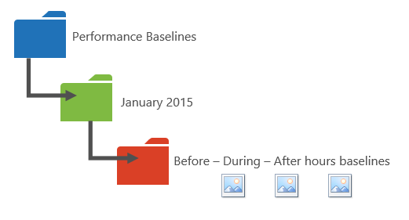

# Office 365 Performance tuning mit Baselines und Leistungsverlauf

Es gibt einige auf einfache Weise überprüfen Sie die Leistung der Verbindung zwischen Office 365 und Ihr Unternehmen, mit denen Sie eine grobe Baseline für die Verbindung festgelegt werden kann. Den Verlauf der Ihrer Client-Computer Verbindungen wissen kann Ihnen neu auftretender Probleme früh erkennen, identifizieren und Vorhersagen Probleme.
  
Wenn Sie nicht bereits auf Leistungsprobleme arbeiten, wird in diesem Artikel soll Ihnen einige häufig gestellte Fragen zu berücksichtigen, wie wie Sie wissen, dass das Problem, den, das Sie kennen, ein Leistungsproblem und nicht in einem Office 365-Dienst-Vorfall helfen? Wie können Sie planen für eine gute Leistung langfristig? Wie können Sie auf die Leistung überwachen? Wenn Ihr Team oder Clients geringe Leistung sehen bei Verwendung von Office 365 und Fragen Sie sich über eine dieser Fragen, lesen Sie auf.
  
> [!IMPORTANT]
> **Haben Sie jetzt ein Leistungsproblem zwischen Client und Office 365?** Befolgen Sie die Schritte in der [Behandlung von Leistungsproblemen Plan für Office 365](performance-troubleshooting-plan.md). 
    
## Etwas, das Sie zur Leistung von Office 365 wissen sollten

Office 365 befindet sich in einem hoher Kapazität, fest zugeordneten Microsoft-Netzwerk, die durch Automatisierung nicht nur, sondern durch echten Menschen beständig überwacht wird. Die Rolle der Verwaltung der Office 365-Cloud gehört zum Erstellen von in Performance tuning und Optimierung, wo es möglich ist. Da der Office 365-Cloud-Clients über das Internet herstellen müssen, ist ein kontinuierlicher Prozess auf die Leistung über Office 365-Dienste zu optimieren. Leistungssteigerungen nie wirklich beenden, in der Cloud, und es ist viel kumulierten Erfahrung mit die Cloud fehlerfrei und schnell zu halten. Ein Leistungsproblem Herstellen einer Verbindung mit Ihrem Standort zu Office 365 auftreten sollte, es ist am besten nicht zu, und warten Sie in einer Supportanfrage. In diesem Fall sollten Sie die Untersuchung eines Problems auf "der inside out" beginnen. D. h., in Ihrem Netzwerk starten Sie, und arbeiten Sie sich zu Office 365. Bevor Sie einen Fall mit Office 365-Support melden, können Sie sammeln Daten und Aktionen, die untersuchen und zu beheben können, ist Ihr Problem.
  
> [!IMPORTANT]
> Achten Sie darauf, dass der kapazitätsplanung und Grenzen in Office 365. Diese Informationen wird Sie vor der Kurve versetzt, bei dem Versuch, ein Leistungsproblem zu beheben. Hier ist ein Link zu [Office 365 Platform Service Description](https://technet.microsoft.com/en-us/library/office-365-service-descriptions.aspx). Hierbei handelt es sich um einen zentralen Hub, und alle Dienste von Office 365 angeboten haben einen Link, der auf ihrer eigenen Dienstbeschreibungen hier verweist. Das bedeutet, Sie sollten die standard-Grenzwerte für SharePoint Online finden Sie unter müssen, beispielsweise auf [SharePoint Online Service Description](https://technet.microsoft.com/en-us/library/sharepoint-online-service-description.aspx) und suchen Sie die [SharePoint Online-Begrenzungen-Abschnitt](https://go.microsoft.com/fwlink/p/?LinkID=856113). 
  
Stellen Sie sicher, navigieren Sie in der Problembehandlung unter der Voraussetzung, dass die Leistung ist eine Skala, es ist nicht über ein idealisierter Wert erreichen und die Beibehaltung dauerhaft (Wenn Ihrer Meinung nach ist, dass, und klicken Sie dann auf mittels Fingereingabe werden gelegentliche hoher Bandbreite Aufgaben wie ein große Anzahl von Benutzern, oder sehr anstrengend werden – also Plane für Leistung Auswirkungen klicken Sie dann wie folgt großer Datenmengen Migrationen). Sie können und sollten, eine ungefähre Vorstellung davon Ihrer Leistungsziele, aber viele Variablen wiedergeben in Leistung, daher Leistung hängt ab. Das ist die Art der Leistung. 
  
Ist nicht mit der Behandlung von Leistungsproblemen darum, bestimmte Ziele und verwalten diese Nummern auf unbestimmte Zeit, zur Verbesserung der vorhandene Aktivitäten aller Variablen zugewiesen ist. 
  
## Gut, was sieht ein Leistungsproblem?

Zunächst müssen Sie sicherstellen, dass Sie vorliegen tatsächlich ein Leistungsproblem und nicht auf einen Vorfall Service ist. Ein Leistungsproblem unterscheidet sich von einem Dienst Vorfall in Office 365. Nachfolgend finden sie feststellen auseinander.
  
Wenn auf der Office 365-Dienst Probleme auftreten, ist ein Dienst Vorfall. Sehen Sie die **aktuellen Integrität** im Office 365 Administrationscenter roten oder gelben Symbole, die Sie möglicherweise auch langsam auf Clientcomputern, die eine Verbindung mit Office 365 fest. Beispielsweise könnten, wenn ein rotes Symbol des aktuellen Integritätsberichte und **Investigating** neben Exchange angezeigt wird, klicken Sie dann auch Ihnen eine Reihe von Anrufen von Personen in Ihrer Organisation, die beschweren sich, dass Clientpostfächer, die Exchange Online verwenden nicht ordnungsgemäß ausgeführt werden. In diesem Fall ist es sinnvoll, wird davon ausgegangen, dass Ihre Exchange Online Leistung nur Opfer Probleme innerhalb des Dienstes geworden ist. 
  

  
Zu diesem Zeitpunkt die Office 365-Admin, überprüfen Sie, **aktuellen Integrität** und dann **Details anzeigen und Verlaufslisten**, häufig, halten Sie auf dem aktuellen Stand im Rahmen der Wartung vorgestellt, die wir für das System ausführen. Das **aktuellen Integrität** Dashboard wurde versucht, um Sie zu Änderungen an und Probleme im Dienst zu aktualisieren. Die Notizen und Erklärungen geschrieben Gesundheitsdaten, Admin zu Admin, gibt es hilft Ihnen Ihre Leistungsfähigkeit zu ermitteln, und behalten Sie die Informationen zum laufenden Arbeit gebucht. 
  

  
Ein Leistungsproblem keinem Vorfall Service, obwohl Vorfälle Leistungseinbußen verursachen können. Ein Leistungsproblem sieht folgendermaßen aus:
  
- Ein Leistungsproblem tritt auf, unabhängig davon, was für den Dienst im Office 365 Administrationscenter **aktuellen Integrität** gemeldet wird. 
    
-  Ein Verhalten, das verwendet, um relativ nahtlos werden dauert lange, bis zum Abschließen oder nie abgeschlossen ist. 
    
- Sie können das Problem zu replizieren, oder zumindest wissen Sie, dass es passieren soll, wenn Sie die richtigen Serie von Schritten ausführen.
    
-  Wenn das Problem nur gelegentlich auftritt, immer noch ein Muster stattgefunden hat, beispielsweise wissen Sie, dass von 10:00 Uhr Sie Anrufe von Benutzern haben, der nicht zuverlässig Office 365 zugreifen und Anrufe, aufgeschlüsselt nach unten um neinein Abbrechen werden. 
    
Das klingt wahrscheinlich vertraut; vielleicht zu vertraut. Wenn Sie wissen, dass es sich um ein Leistungsproblem handelt, wird die Frage, "Was Sie als Nächstes tun?" Der Rest dieses Artikels können Sie genau, die bestimmen.
  
## Informationen zum Definieren und testen das Leistungsproblem

Leistungsprobleme emerge oft im Laufe der Zeit, sodass es auf das tatsächliche Problem definieren eine Herausforderung sein kann. Müssen Sie eine gute Problem-Anweisung und eine gute Vorstellung von Problem Kontext zu erstellen, und klicken Sie dann müssen wiederholbare Testverfahren den Tag gewinnen. Anderenfalls möglicherweise über eigene zeigen keine Fehler an, Sie verloren. Warum? Nun, sind hier einige Beispiele für Probleme-Anweisungen, die nicht genügend Informationen liefern:
  
- Wechseln vom Posteingang in Meine Kalender verwendet, um etwas angegeben werden, die ich nicht beachten, und es ist jetzt eine Kaffee-Unterbrechung. Können Sie es als früher fungieren machen?
    
- Hochladen von Dateien in SharePoint Online dauert ewig. Warum ist langsam in den Tag, aber auf einem beliebigen späteren Zeitpunkt, es ist fast? Kann es fast nicht?
    
Es gibt mehrere große Herausforderungen Bedrohung durch die oben genannten Problem-Anweisungen. Es sind vor allem viel Mehrdeutigkeiten zu bewältigen. Zum Beispiel:
  
- Es ist nicht mehr ersichtlich ist, wie auf dem Laptop fungieren verwendet Wechseln zwischen dem Posteingang und Kalender.
    
- Wenn der Benutzer sagt "kann es nicht fast", was "fast" ist?
    
- Wie lange ist "immer"? Ist, die mehrere Sekunden oder Minuten oder, konnte der Benutzer zum Mittagessen gehen, und es würde zehn Minuten, nachdem der Benutzer haben Sie wieder beenden?
    
All dies ist ohne Berücksichtigung der, dass die Verwaltung und Problembehandlung viele Details zum Problem Aussagen wie diese beachten ist nicht möglich. Beispielsweise, wenn das Problem begann; Dass der Benutzer von zu Hause und immer nur arbeitet sieht langsame wechseln, klicken Sie auf ein privates Netzwerk; Dass der Benutzer mehrere andere intensive RAM-Anwendung auf dem lokalen Client oder der Benutzer ausführen muss ein älteren Betriebssystem ausgeführt werden oder wurde nicht die neuesten Updates ausgeführt.
  
Wenn Benutzer ein Leistungsproblem melden, ist eine Vielzahl von Informationen zu sammeln. Dieser Informationen ist Teil eines Prozesses Bereichsdefinierung das Problem, oder es Untersuchen von bezeichnet. Es folgt eine grundlegende Gültigkeitsbereichs Liste, die Sie zum Sammeln von Informationen zu Ihrem Leistungsproblem verwenden können. Diese Liste ist nicht vollständig, aber es ist ein Ausgangspunkt für eine eigene: 
  
- Welche Datum behoben geschehen und welche Zeit Tag und Nacht haben?
    
- Welche Art von Client-Computer wurden Sie verwenden, und wie werden eine Verbindung hergestellt mit dem Business-Netzwerk (VPN, kabelgebundene, Wireless)?
    
- Wurden Sie arbeitet Remote oder Waren Sie im Büro?
    
- Sie versuchen Sie dieselben Aktionen auf einem anderen Computer und finden Sie unter dasselbe Verhalten?
    
- Ausführen der Schritte, die Sie die Mühe zuweisen möchten, damit Sie die Aktionen schreiben können, mit denen Sie nach unten.
    
- Wie in Sekunden oder Minuten langsam ist die Leistung?
    
- Wo in der ganzen Welt befinden Sie?
    
Einige dieser Fragen sind deutlicher als andere. Die meisten jeder wird verstehen, dass eine Problembehandlung für die genauen Schritte, das Problem zu reproduzieren benötigt. Nachdem alle wie sonst können Sie aufzeichnen Fehlersuche, und wie sonst können Sie testen, ob das Problem behoben wurde? Weniger offensichtlich sind Elemente wie "Was Datum und Uhrzeit haben Sie finden Sie unter das Problem?", und "Wo sind in der ganzen Welt Sie sich befinden?", Informationen, die in Kombination verwendet werden kann. Je nach, wenn der Benutzer funktioniert hat können ein paar Stunden Zeitunterschied bedeuten, dass Wartung bereits ausgeführt auf Teile der im Netzwerk des Unternehmens wird. Wenn beispielsweise Ihr Unternehmen Hybrid-Implementierung, wie eine hybride SharePoint-Suche verfügt über die Abfragen können Suche indiziert in SharePoint Online und einer lokalen sharepointserver 2013-Instanz, Updates möglicherweise bereits in der lokalen Farm. Wenn Ihr Unternehmen in der Cloud ist, kann Systemwartung hinzufügen oder Entfernen von Netzwerk-Hardware, Bereitstellung von Updates, die als unternehmensweite oder machen Änderungen DNS oder andere Hauptinfrastruktur sind enthalten.
  
Bei der Behandlung von Leistungsproblemen sind etwas wie eine Szene Kriminalität ist, müssen Sie präzise und aufmerksamen die Schlussfolgerungen aus dem Beweis gezeichnet werden. Zu diesem Zweck müssen Sie eine gute Problem-Anweisung abrufen, indem Nachweis sammeln. Es sollte enthalten Kontext des Computers, dem Kontext des Benutzers, als das Problem aufgetreten und die genauen Schritte, die das Leistungsproblem verfügbar gemacht. Dieses Problem Anweisung sollten und bleiben, die oberste Seite in Ihre Notizen. Durch abgearbeitet werden die Anweisung Problem erneut aus, nachdem Sie die Auflösung arbeiten, machen Sie die Schritte zum Testen und belegen, dass die Aktionen, mit denen Sie den Fehler behoben haben. Dies ist wichtig, zu wissen, wann Ihre Arbeit vorhanden ist, erfolgt.
  
## Wissen Sie, wie Leistung sucht, wenn es eine gute wurde verwendet?

Wenn Sie ungünstigsten weiß niemand. Niemand hatte Zahlen. Das bedeutet, dass niemand kann beantworten Sie die einfachen Frage "über wie viele Sekunden verwendet wird, um einen Ordner Posteingang in Office 365 aufzurufen haben?" oder "wie lange haben verwendet werden soll, wenn die Führungskräfte einen Lync Online Besprechung hatte?", die ein häufiges Szenario für viele Unternehmen ist.
  
Was fehlt hier ist eine geplante Leistung.
  
Baselines bieten einen Kontext für die Leistung. Sie sollten einen Basisplan gelegentlich zu häufig, je nach den Anforderungen Ihres Unternehmens nutzen. Wenn Sie eine größere Unternehmen sind, kann Ihr Team Vorgänge bereits Baselines für Ihre lokale Umgebung dauern. Beispielsweise wenn Sie alle Exchange-Server am ersten Montag des Monats und die SharePoint-Server auf den dritten Montag Sicherheitspatch, Ihr Team Vorgänge wahrscheinlich verfügt über eine Liste der Aufgaben und Szenarien Ausführung nach dem Patchen nachweisen, dass sind wichtige Funktionen betriebsbereit. Beispielsweise Öffnen des Posteingangs und anschließend auf senden/empfangen, und stellen Sie sicher, die Ordner aktualisieren oder SharePoint, durchsuchen die Hauptseite der Website, wie die Enterprise-Suchseite und einer Suche ausführen, die Ergebnisse zurückgegeben werden.
  
Wenn Ihre Anwendung in Office 365 sind, messen einige der wichtigste Baselines, mit denen Sie die Zeit (in Millisekunden) von einem Client-Computer innerhalb des Netzwerks auf einen Punkt, der Ausgang oder auf den Punkt, in dem Sie Ihr Netzwerk verlassen und wechseln Sie zu Office 365. Es folgen einige nützliche Baselines, die Sie untersuchen können und Datensatz:
  
- Identifizieren Sie die Geräte zwischen dem Clientcomputer und Ihre Austritt, beispielsweise den Proxyserver.
    
  - Sie müssen Ihre Geräte kennen, damit Sie Kontext verfügen (IP-Adressen, Gerät, et cetera) für die von auftretenden Leistungsproblemen.
    
  - Proxy-Server sind allgemeine Ausgang Punkt, überprüfen Sie Ihren Webbrowser, um herauszufinden, welche Proxyserver diese Liste festgelegt ist, verwenden, sofern vorhanden.
    
  - Es gibt Tools von Drittanbietern, die erkennen und ordnen Sie Ihr Netzwerk können die sicherste Methode Ihre Geräte wissen ist ein Mitglied der Netzwerkteam aufgefordert.
    
- Identifizieren von Ihrem Internetdienstanbieter (ISP), notieren Sie ihre Kontaktinformationen und wie viele wie viel Bandbreite auslöst Sie haben Fragen.
    
- Innerhalb des Unternehmens identifizieren Sie Ressourcen für die Geräte zwischen dem Client und Austritt oder identifizieren Sie eine Kontaktperson für Notfälle darüber Netzwerkproblemen zu.
    
Hier sind einige Baselines einfach testen mit Tools für Sie berechnen können:
  
- Zeit zwischen dem Clientcomputer und Ihre Austritt in Millisekunden
    
- Zeit aus Ihrer Austritt zu Office 365 in Millisekunden
    
- Speicherort in der ganzen Welt des Servers, der die URLS für Office 365 aufgelöst wird, wenn Sie durchsuchen
    
- Die Geschwindigkeit von Ihrem Internetdienstanbieter DNS-Auflösung in Millisekunden, Inkonsistenzen im Paket hinzukommen (netzwerkjitter), hoch- und Herunterladen von Zeitangaben in Millisekunden
    
Wenn Sie mit der Verwendung, um diese Schritte auszuführen sind, gehen wir genauer in diesem Artikel. 
  
## Was ist eine Baseline?

Wissen Sie, wenn es geht fehlerhafte, jedoch wenn Sie nicht, dass Ihre zurückliegenden Leistungsdaten wissen, ist es nicht möglich, einen Kontext für wie schwerwiegend die geworden sind möglicherweise haben und die Auswirkungen. Damit ohne einen Basisplan den wichtigen Hinweis zur Lösung der Kette nicht vorhanden sind: des Bilds in das Feld Puzzle. Problembehandlung von Leistung benötigen Sie einen Punkt des *Vergleichs* . Einfache Leistung Baselines nicht schwer zu übernehmen. Ihr Team Vorgänge kann nach einem Zeitplan beauftragt diese beauftragt werden. Nehmen wir beispielsweise an, dass die Verbindung wie folgt aussieht: 
  

  
Das heißt, Sie mit Ihrem Netzwerkteam und herausgefunden, dass Sie Ihr Unternehmen für das Internet über einen Proxyserver lassen und dieses Proxys behandelt alle Anfragen, die in der Cloud Ihre Clientcomputer sendet. In diesem Fall sollten Sie eine vereinfachte Version der Verbindung gezeichnet wird, in der alle dazwischenliegende Geräte aufgelistet. Fügen Sie nun, Tools, die können Sie die Leistung zwischen dem Client, Austritt testen (wobei Sie verlassen Ihres Netzwerks für das Internet) und Office 365 cloud.
  

  
Die Optionen sind so **einfach** und **Erweitert** aufgrund der Kompetenzen aufgeführt, die Sie benötigen, um die Leistung zu finden. Netzwerk-Trace dauert viel Zeit, im Vergleich zu Befehlszeilentools wie PsPing und TraceTCP ausgeführt. Diese zwei Befehlszeilentools wurden ausgewählt wurde, da sie nicht ICMP-Pakete, die von Office 365 blockiert werden, verwenden und da sie der Zeit in Millisekunden ermöglichen benötigt wird, um den Clientcomputer oder Proxyserver lassen (Wenn Sie zugreifen) und Office 365 eintreffen. Jeder einzelnen Hop von einem Computer zu einem anderen mit einen Zeitwert beendet, und das ist hervorragend für Basispläne! Ebenso wie vor allem diese Befehlszeilentools eine Portnummer auf den Befehl hinzufügen können, ist dies hilfreich, da Office 365 über Port 443, kommuniziert den Anschluss von Secure Sockets Layer und Transport Layer Security (SSL und TLS) verwendet werden. Andere Tools von Drittanbietern können jedoch eine bessere Lösungen für Ihre Situation sein. Microsoft nicht unterstützen alle diese Tools, also wenn, aus irgendeinem Grund PsPing und TraceTCP arbeiten, nicht fahren Sie mit einer Netzwerk-Trace mit einem Tool wie Netmon. 
  
Sie können einen Basisplan vor der Geschäftszeiten bei starker Auslastung erneut übernehmen und dann erneut nach Stunden. Dies bedeutet, dass möglicherweise eine Ordnerstruktur, die am Ende etwas wie folgt aussieht:
  

  
Sie sollten einer Benennungskonvention auch Ihre Dateien auswählen. Es folgen einige Beispiele:
  
- Feb_09_2015_9amPST_PerfBaseline_Netmon_ClientToEgress_Normal
    
- Jan_10_2015_3pmCST_PerfBaseline_PsPing_ClientToO365_bypassProxy_SLOW
    
- Feb_08_2015_2pmEST_PerfBaseline_BADPerf
    
- Feb_08_2015_8 30amEST_PerfBaseline_GoodPerf
    
Es gibt viele verschiedene Arten dazu, aber mit dem Format ** \<DateTime\>\<was passiert im Test\> ** ist eine ausgezeichnete Quelle zu starten. Halten Sie davon sorgfältig wird helfen viel, wenn Sie versuchen, eine Problembehandlung weiter unten. Später, Sie werden möglicherweise sagen Sie "Ich habe zwei Spuren am 8. Februar eine gute Leistung und einen ergab ergab schlecht, sodass wir diese vergleichen können". Dies ist bei der Problembehandlung sehr hilfreich sein. 
  
Sie benötigen, organisierte Ihrer zurückliegenden Baselines beibehalten. In diesem Beispiel wird die einfachen Methoden erzeugt drei Befehlszeile Ausgaben und die Ergebnisse als Screenshots erfasst wurden, aber Capture Netzwerkdateien möglicherweise stattdessen müssen. Verwenden Sie die Methode, die für Sie am besten geeignet ist. Speichern Sie Ihre zurückliegenden Baselines und an, in dem Sie Änderungen in das Verhalten der Onlinedienste bemerken, Punkten auf sie verweisen. 
  
## Gründe für das Erfassen von Leistungsdaten während einer Pilotphase

Ist keine bessere Zeit zu tätigen Baselines als während einer Pilotphase für Office 365-Dienst zu starten. Ihre Office möglicherweise Tausende von Benutzern, Hunderte oder Tausende möglicherweise fünf, aber auch mit einer kleinen Anzahl von Benutzern, können Sie ausführen aus, um Fluktuationen Leistung gemessen. Im Fall von einem großen Unternehmen kann eine repräsentative für mehrere hundert Benutzer Pilottests für Office 365 nach außen zu mehrere Tausend hochgerechnet werden, damit Sie wissen, wo Probleme auftreten können, bevor sie auftreten.
  
Behalten Sie im Fall einer kleinen Firma, auf mittels Fingereingabe bedeutet, dass alle Benutzer wechseln Sie zu der Dienst zur selben Zeit und es kein Pilot wird, Leistungskennzahlen, damit Sie Daten für alle Benutzer angezeigt, die möglicherweise für die Problembehandlung bei einem Vorgang ausführen müssen. Beispielsweise wenn Sie plötzlich feststellen können Sie um Ihr Gebäude in der Zeit durchlaufen, die benötigt wird, um eine Grafik mittelgroße hochladen, wo Sie es zum sehr schnell geschehen verwendet.
  
## Gewusst wie: Baselines sammeln

Für alle Pläne zur Problembehandlung müssen Sie mindestens Folgendes ermitteln:
  
- Sie die Client-Computer (den Typ von Computer- oder Gerät, eine IP-Adresse und die Aktionen, die Ursache des Problems) verwenden
    
- Wo befindet sich der Client-Computer in der ganzen Welt (z. B., ob diese Benutzer auf ein VPN mit dem Netzwerk, arbeitet Remote und oder auf das Intranet des Unternehmens)
    
- Der Clientcomputer Austritt aus dem Netzwerk verwendet (der Punkt, an dem verlässt Datenverkehr Ihres Unternehmens für einen ISP oder im Internet)
    
 Sie können das Layout des Netzwerks vom Netzwerkadministrator ermitteln. Wenn Sie in einem kleinen Netzwerk befinden, sehen Sie sich die Geräte, die Sie mit dem Internet verbinden, und rufen Sie bei Ihrem Internetdienstanbieter, wenn Sie Fragen zur das Layout haben. Erstellen Sie eine Grafik des endgültigen Layouts für den Verweis. 
  
In diesem Abschnitt aufgeschlüsselt einfache Command-Line Tools und Methoden, und erweiterte Optionen. Einfache Methoden werden zuerst behandelt. Aber wenn Sie jetzt ein Leistungsproblem haben, sollten Sie wechseln zu erweiterten Methoden und Testen von Beispiel Behandlung von Leistungsproblemen Aktion planen.
  
### Einfache Methoden

Das Ziel dieser einfachen Methoden ist um machen, zu verstehen, und speichern einfache Leistung Baselines ordnungsgemäß über einen Zeitraum, damit Sie informiert sind, zur Leistung von Office 365 zu informieren. Hier ist das sehr einfache Diagramm für einfache, begegnet sind:
  

  
> [!NOTE]
> In diesem Screenshot, da es hilfreich ist für angezeigt, in Millisekunden an, wie lange eine Anforderung an den Prozess, und wie viele Netzwerkhops oder Verbindungen von einem Computer, auf die nächste benötigt, dass die Anforderung akzeptiert ein Ziel erreicht ist TraceTCP enthalten. TraceTCP kann auch Geben Sie den Namen der Server verwendet, während der Hops, die für ein Microsoft Office 365-Problembehandlung im Support nützlich sein können. > TraceTCP Befehle kann sehr einfache, z. B.: > `tracetcp.exe outlook.office365.com:443`> Denken Sie daran, die Portnummer in den Befehl! > [TraceTCP](https://simulatedsimian.github.io/tracetcp.mdl) ist kostenlos, aber Wincap nutzt. Wincap ist ein Tool, das auch verwendet werden und von Netmon installiert. Wir werden auch Netmon im Abschnitt Erweiterte Methoden verwenden. 
  
 Wenn Sie mehrere Büros verfügen, müssen Sie einen Satz von Daten von einem Client in jeder der beiden Speicherorte sowie beibehalten. Dieser Test misst Wartezeit, die in diesem Fall einen Zahlenwert ist, der die Dauer zwischen einem Client Senden einer Anforderung an den Office 365 und auf die Anforderung reagiert Office 365 beschreibt. Die Tests innerhalb Ihrer Domäne auf einem Clientcomputer stammt und sieht eine Schleife von innerhalb des Netzwerks über einen Punkt, der Ausgang, über das Internet zu Office 365, out messen und wieder. 
  
Es gibt einige Methoden für den Umgang mit Austritt, in diesem Fall des Proxy-Servers. Sie können entweder Verfolgen von 1, 2, und klicken Sie dann 2 bis 3, und fügen Sie die Zahlen in Millisekunden zum Abrufen der letzten insgesamt zum Rand des Netzwerks. Alternativ können Sie die Verbindung für die Umgehung des Proxys für Office 365-Adressen konfigurieren. In einem größeren Netzwerk mit einer Firewall, Reverseproxy oder eine Kombination aus beidem müssen Sie möglicherweise Ausnahmen auf dem Proxyserver machen, mit der Datenverkehr für viele URLs weitergeleitet werden können. Die Liste der Endpunkte, die von Office 365 verwendet finden Sie unter [Office 365-URLs und IP-Adressbereiche](https://support.office.com/article/8548a211-3fe7-47cb-abb1-355ea5aa88a2). Wenn Sie einen authentifizierenden Proxy verfügen, beginnen Sie mit dem Testen von Ausnahmen für Folgendes:
  
- Port 80 und 443
    
- TCP und HTTPs
    
- Verbindungen, die ausgehend in diese URLs sind:
    
- \*. microsoftonline.com
    
- \*.microsoftonline p.com
    
- \*. sharepoint.com
    
- \*. outlook.com
    
- \*. Lync.com herzustellen
    
- osub.Microsoft.com
    
Alle Benutzer müssen zulässig sein, um diese Adressen ohne Authentifizierung oder Proxy Störungen abzurufen. Bei einer kleineren Netzwerken sollten Sie hinzufügen, dass diese Ihren Proxy umgehen der Liste in Ihrem Webbrowser. 
  
Um diese zu Ihrer Proxyumgehungsliste in Internet Explorer hinzufügen, wechseln Sie zu den **Tools** \> **Internetoptionen** \> **Verbindungen** \> **LAN-Einstellungen** \> **Erweitert**. Die Registerkarte Erweitert ist auch, wo Sie Ihre Proxy-Server und Proxy-Server-Port finden können. Möglicherweise müssen Sie das Kontrollkästchen **Proxyserver für LAN verwenden**, greifen Sie auf die Schaltfläche **Erweitert** klicken. Sie sollten sicherstellen, dass der **Proxyserver für lokale Adressen umgehen** überprüft wird. Nachdem Sie auf **Erweitert**klicken, sehen Sie ein Textfeld, in dem Sie Ausnahmen eingeben können. Trennen Sie die Platzhalter-URLs, die oben aufgeführten mit Semikolons, beispielsweise:
  
\*. microsoftonline.com; \*. sharepoint.com
  
Nachdem Sie Ihre Proxy zu umgehen, sollten Sie Ping oder PsPing direkt auf eine Office 365-URL verwenden sein. Im nächste Schritt werden Ping **outlook.office365.com**testen. Oder wenn Sie PsPing oder ein anderes Tool verwenden, wird lassen Sie eine Portnummer ein, mit dem Befehl PsPing gegen **portal.microsoftonline.com:443** sehen Sie die durchschnittliche Roundtrip-Zeit in Millisekunden angeben. 
  
Die Roundtripzeit oder Zeit, ist ein Wert der misst, wie lange es dauert, senden Sie eine HTTP-Anforderung an einen Server wie outlook.office365.com und erhalten Sie eine Antwort zurück, die bestätigt, dass der Server weiß, dass Sie dies der Fall war. Sie sehen manchmal dies als Zeit abgekürzt. Dies sollte einer verhältnismäßig kurzen Moment sein.
  
Sie müssen verwenden [PSPing](https://technet.microsoft.com/en-us/sysinternals/jj729731.aspx) oder ein anderes Tool, das keine ICMP-Pakete verwendet die von Office 365 blockiert werden, um diesen Test durchzuführen. 
  
 **So verwenden Sie PsPing direkt aus einer Office 365-URL ein Roundtrip Zeit in Millisekunden abrufen**
  
1. Führen Sie eine Eingabeaufforderung mit erhöhten Rechten, indem Sie diese Schritte ausführen:
    
1. Klicken Sie auf **Start**.
    
2. Geben Sie in das Feld **Suche starten** cmd ein, und drücken Sie STRG + UMSCHALT + EINGABETASTE.
    
3. Wenn das Dialogfeld **Benutzerkontensteuerung** eingeblendet wird, bestätigen Sie die angegebene Aktion und klicken dann auf **Weiter**.
    
2. Navigieren Sie zu dem Ordner, in dem das Tool (in diesem Fall PsPing) installiert ist, und Testen Sie diese Office 365-URLs:
    
  - Psping portal.office.com:443
    
  - Microsoft-my.sharepoint.com:443 psping
    
  - Psping outlook.office365.com:443
    
  - Psping www.yammer.com:443
    
    
  
Achten Sie darauf, dass Sie die Portnummer 443 enthalten. Denken Sie daran, dass Office 365 für einen verschlüsselten Kanal funktioniert. Wenn Sie PsPing ohne die Portnummer an, die Anforderung nicht ausgeführt werden kann. Nachdem Sie Ihre kleine Gruppe Ping-Signal beantwortet haben, suchen Sie nach die durchschnittliche Zeit in Millisekunden (ms). Das ist, was Sie aufzeichnen möchten!
  

  
Wenn Sie nicht mit Proxy-Umgehung vertraut und Dinge schrittweise übernehmen möchten, müssen Sie zuerst um den Namen des Proxyservers zu erhalten. Wechseln Sie in Internet Explorer auf **Extras** \> **Internetoptionen** \> **Verbindungen** \> **LAN-Einstellungen** \> **Erweitert**. Die Registerkarte **Erweitert** ist, in dem Sie den Proxyserver aufgeführten angezeigt werden. Pingen Sie diesen Proxy-Server an der Befehlszeile mithilfe dieser Aufgabe: 
  
 **Pingen Sie den Proxy-Server und erhalten einen Roundtrip-Wert in Millisekunden für Phase 1 bis 2**
  
1. Führen Sie eine Eingabeaufforderung mit erhöhten Rechten, indem Sie diese Schritte ausführen:
    
1. Klicken Sie auf **Start**.
    
2. Geben Sie in das Feld **Suche starten** cmd ein, und drücken Sie STRG + UMSCHALT + EINGABETASTE.
    
3. Wenn das Dialogfeld **Benutzerkontensteuerung** eingeblendet wird, bestätigen Sie die angegebene Aktion und klicken dann auf **Weiter**.
    
2. Geben Sie Ping \<den Namen des Proxyservers Ihrem Browser verwendet oder die IP-Adresse des Proxyservers\> und drücken Sie dann die EINGABETASTE. Wenn Sie PsPing oder ein anderes Tool installiert haben, haben können Sie stattdessen das Tool verwenden. 
    
    Der Befehl kann eine der in diesen Beispielen aussehen: 
    
  - Ping ourproxy.ourdomain.industry.business.com
    
  - Ping 155.55.121.55
    
  - Ping ourproxy
    
  - Psping ourproxy.ourdomain.industry.business.com:80
    
  - Psping 155.55.121.55:80
    
  - Psping ourproxy:80
    
3. Wenn der Trace Test-Pakete zu senden mehr, erhalten Sie eine kleine Zusammenfassung auflistet durchschnittlich in Millisekunden an, und das ist der Wert, den Sie. Screenshot der Aufforderung, und speichern sie die Verwendung der Benennungskonvention. Es kann zu diesem Zeitpunkt auch helfen, füllen Sie das Diagramm mit dem Wert.
    
Vielleicht haben Sie eine Verfolgung in früher morgen weitergeleitet und Ihrer Client schnell zu den Proxy (oder jegliches Ausgang Server wird beendet, mit dem Internet) abrufen kann. In diesem Fall können die Rufnummern sieht folgendermaßen aus:
  

  
Wenn Ihre Clientcomputer eines einige ausgewählte mit Zugriff auf den Server Proxy (oder Ausgang) ist, können Sie des nächsten Abschnitts des Tests ausführen auf diesen Computer, eine Remoteverbindung herstellen mit der Befehlszeile und PsPing in eine Office 365-URL von dort aus. Wenn Sie nicht über Zugriff auf diesem Computer verfügen, Sie können Ihre Netzwerkressourcen wenden Sie Hilfe mit des nächsten Abschnitts und Get genauen Zahlen auf diese Weise. Wenn dies nicht möglich ist, nehmen Sie einen PsPing gegen die Office 365-URL fraglichen und vergleichen Sie ihn mit der Zeit PsPing oder Ping gegen den Proxyserver. 
  
Beispielsweise haben, wenn Sie 51.84 Millisekunden vom Client an den Office 365-URL verfügen, und Sie 2,8 Millisekunden vom Client zum Proxy (oder Austritt müssen), klicken Sie dann Sie 49.04 Millisekunden von der Ausgang zu Office 365. Dienstanbieter entscheidet auch, wenn Sie während des Tages und 62.01 Millisekunden vom Client an den Office 365-URL die Höhe einer PsPing 12,25 Millisekunden vom Client an den Proxy haben, ist der Mittelwert für die Proxy-Ausgang an den Office 365-URL 49.76 Millisekunden.
  

  
Im Hinblick auf die Problembehandlung, finden Sie möglicherweise interessante direkt aus dieser Baselines beibehalten. Angenommen, wenn Sie feststellen, dass Sie in der Regel zu haben 40 bis 59 Millisekunden Abfragewartezeit aus dem Proxy oder Ausgang zeigen Sie auf die Office 365-URL und haben einen Client Proxy oder Ausgang Punkt Wartezeit in Millisekunden 3 bis 7 (je nach Umfang Netzwerk Datenverkehr Sie Seein sind g während dieser Zeit des Tages) dann sicherlich etwas ist problematisch wissen wird, wenn die letzten drei Client an den Basislinien Proxy oder Ausgang eine Wartezeit in Millisekunden 45 angezeigt.
  
### Erweiterte Methoden

Wenn Sie wissen, was passiert mit Ihrer Internet-Anforderungen zu Office 365 möchten, müssen Sie mit netzwerkablaufverfolgung vertraut. Es spielt keine Rolle, welche Tools, die Sie für diese Spuren, HTTPWatch, Netmon, Nachricht Analyzer, Wireshark, Fiddler Entwicklerdashboard Tool lieber oder andere wird ausgeführt, solange dieses Tool erfassen und Netzwerkverkehr filtern kann. In diesem Abschnitt sehen Sie, dass es mehr als eines der folgenden Tools zum Abrufen eines vollständigen Bilds des Problems führen von Vorteil ist. Wenn Sie, Sie testen führen agieren einige dieser Tools auch als Proxys in ihrer eigenen rechts. Im Artikel begleitsprachen für die [Behandlung von Leistungsproblemen Plan für Office 365](performance-troubleshooting-plan.md)und verwendeten Tools gehören [Netmon 3.4](https://www.microsoft.com/en-us/download/details.aspx?id=4865), [HTTPWatch](https://www.httpwatch.com/download/)oder [WireShark](https://www.wireshark.org/).
  
Nutzen der Grundlinie Leistung der einfache Teil dieser Methode ist und viele der Schritte sind die gleichen wie bei der Problembehandlung ein Leistungsproblem. Die erweiterten Methoden zum Erstellen von Baselines für Leistung, benötigen Sie auf Übernehmen, und speichern Sie die netzwerkablaufverfolgung. Die meisten Beispiele in diesem Artikel mit SharePoint Online, doch sollten Sie eine Liste der allgemeinen Aktionen entwickeln, über die Office 365-Dienste, die Sie zum Testen und aufzeichnen abonnieren. Es folgt ein Beispiel für die Baseline:
  
- Liste der Grundlinie für SPO - ** Schritt 1: ** Durchsuchen der Homepage der Website SPO und Netzwerk-Trace. Speichern Sie die Ablaufverfolgung. 
    
- Liste der Grundlinie für SPO - **Schritt2:** Suche nach einem Begriff (beispielsweise den Namen Ihres Unternehmens) über die Suche in Unternehmen und führen Sie eine Netzwerk-Trace. Speichern Sie die Ablaufverfolgung. 
    
- Liste der Grundlinie für SPO - **Schritt 3:** Hochladen einer großen Datei zu einer SharePoint Online-Dokumentbibliothek und Ausführen einer Ablaufverfolgung für Netzwerk. Speichern Sie die Ablaufverfolgung. 
    
- Liste der Grundlinie für SPO - **Schritt 4:** Durchsuchen der Homepage der Website OneDrive und Ausführen einer Ablaufverfolgung für Netzwerk. Speichern Sie die Ablaufverfolgung. 
    
Diese Liste sollte die wichtigsten allgemeinen Aktionen enthalten, die mit SharePoint Online-Benutzer zu übernehmen. Beachten Sie, dass der letzte Schritt, verfolgen und sollte zu OneDrive for Business, Builds-einen Vergleich zwischen die Last der SharePoint Online-Startseite (die häufig von Unternehmen angepasst ist) und OneDrive for Business-Homepage in der selten angepasst ist. Dies ist eine sehr einfache Test bei einer langsamen laden SharePoint Online-Website. Sie können eine Aufzeichnung diesen Unterschied in den Tests erstellen.
  
Wenn Sie in der Mitte ein Leistungsproblem sind, sind viele der Schritte die gleichen als beim Offlineschalten von eines Basisplans. Netzwerkablaufverfolgung kritisch, damit wir *wie* um die wichtigen Spuren weiter nutzen behandelt werden. 
  
Um ein Leistungsproblem *jetzt* angehen müssen Sie eine Verfolgung zur Zeit nutzen werden Ihnen das Leistungsproblem auftritt. Benötigen Sie die richtigen Tools zur Verfügung, um Protokolle zu erfassen, und Sie einen Aktivitätsplan, d. h., eine Liste der Aktionen durchführen, um die besten Informationen zu erfassen, die Sie können Problembehandlung benötigen. Der erste Schritt ist das Datum und die Uhrzeit des Tests notieren, damit die Dateien in einem Ordner, die das Timing widerspiegeln gespeichert werden können. Im nächsten Schritt Identitätswerte zu den Schritten zum Problem selbst. Dies sind die genauen Schritte, die Sie für den Test verwendet werden. Vergessen Sie nicht die Grundlagen: Wenn das Problem nur mit Outlook ist, stellen Sie sicher,-Eintrag, der das Problem Verhalten in Office 365-Dienst nur eine geschieht. Beschränken den Umfang des Problems helfen Ihnen etwas konzentrieren, die Sie beheben können. 
  
## Siehe auch

[Verwalten von Office 365-Endpunkten](https://support.office.com/article/99cab9d4-ef59-4207-9f2b-3728eb46bf9a)

