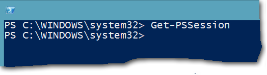

# <a name="connect-to-all-office-365-services-in-a-single-windows-powershell-window"></a>Verbinden mit allen Office 365-Diensten in einem einzigen Windows PowerShell-Fenster

 **Zusammenfassung:** Anstelle von Verwalten von verschiedenen Office 365-Diensten in separaten Fenstern von PowerShell-Konsole, können Sie eine Verbindung mit allen Office 365-Diensten und über einzelne Konsolenfenster verwalten.
  
Wenn Sie zum Verwalten von Office 365 PowerShell verwenden, ist es möglich, bis zu fünf verschiedene Windows PowerShell-Sitzungen entsprechend der Office 365 Administrationscenter, SharePoint Online, Exchange Online, Skype für Business Online und die Sicherheit &amp;Compliance Center. Mit fünf unterschiedliche Verbindungsmethoden in separaten Windows PowerShell-Sitzungen konnte Ihren Desktop sieht folgendermaßen aus:
  

  
Dies ist nicht für die Verwaltung von Office 365, da Sie Daten zwischen diesen fünf Windows for Cross-Service-Management austauschen können nicht optimal. In diesem Thema wird beschrieben, wie eine einzelne Instanz von Windows PowerShell verwenden, Sie können aus dem Office 365, Skype für Business Online, Exchange Online, SharePoint Online und die Sicherheit verwalten &amp; Compliance Center.
  
## <a name="before-you-begin"></a>Bevor Sie beginnen
<a name="BeforeYouBegin"> </a>

Bevor Sie alle von Office 365 von einer einzigen Instanz von Windows PowerShell verwalten können, sollten Sie die folgenden erforderlichen Komponenten:
  
- Office 365 arbeiten oder Schule Konto ein, das Sie für diese Verfahren Anforderungen verwenden, um ein Mitglied einer Office 365-Admin-Rolle sein. Weitere Informationen finden Sie unter [Informationen zu Office 365-Administratorrollen](https://go.microsoft.com/fwlink/p/?LinkId=532367). Diese eine Voraussetzung für Office 365 PowerShell, was nicht notwendigerweise für alle anderen Office 365-Dienste.
    
- Sie können folgende 64-Bit-Versionen von Windows verwenden:
    
  - Windows 10
    
  - Windows 8.1 oder Windows 8
    
  - Windows Server 2016
    
  - Windows Server 2012 R2 oder Windows Server 2012
    
  - Windows 7 Service Pack 1 (SP1)*
    
  - Windows Server 2008 R2 SP1*
    
    * Sie müssen Microsoft .NET Framework 4.5 zu installieren. _X_ , und klicken Sie dann entweder das Windows Management Framework 3.0 oder das Windows Management Framework 4.0. Weitere Informationen finden Sie unter [Installieren von .NET Framework](https://go.microsoft.com/fwlink/p/?LinkId=257868) und [Windows Management Framework 3.0](https://go.microsoft.com/fwlink/p/?LinkId=272757) oder [Windows Management Framework 4.0](https://go.microsoft.com/fwlink/p/?LinkId=391344).
    
    Sie müssen eine 64-Bit-Version von Windows für Business Online Modul und einen der Office 365-Module aufgrund der Anforderungen für die Skype verwenden.
    
- Sie müssen die Module installieren, die für Office 365, SharePoint Online und Skype für Business Online erforderlich sind:
    
  - [Microsoft Online Service Anmelde-Assistent für IT-Experten RTW](https://go.microsoft.com/fwlink/p/?LinkId=286152)
    
  - [Windows Azure Active Directory-Modul für Windows PowerShell (64-Bit-Version)](https://go.microsoft.com/fwlink/p/?linkid=236297)
    
  - [SharePoint Online-Verwaltungsshell](https://go.microsoft.com/fwlink/p/?LinkId=255251)
    
  - [Skype für Unternehmen Online, Windows PowerShell-Modul](https://go.microsoft.com/fwlink/p/?LinkId=532439)
    
-  Windows PowerShell zum Ausführen von signierten Skripts für Skype für Business Online, Exchange Online und die Sicherheit konfiguriert werden muss &amp; Compliance Center. Zu diesem Zweck führen Sie den folgenden Befehl in einer Windows PowerShell-Sitzung mit erhöhten Rechten (ein Windows PowerShell-Fenster Sie öffnen, indem Sie **als Administrator ausführen**auswählen).
    
  ```
  Set-ExecutionPolicy RemoteSigned
  ```

## <a name="the-short-version-instructions-without-explanations"></a>Die Kurzfassung (Anweisungen ohne Erläuterungen)
<a name="ShortVersion"> </a>

In diesem Abschnitt werden die Verbindungsschritte kurz und bündig erläutert. Wenn Sie Fragen haben oder weitere Informationen benötigen, können Sie den Rest des Themas lesen. Die Schrittnummern entsprechen den nummerierten Abschnitten im Rest des Themas:
  
1. Öffnen Sie Windows PowerShell als Administrator (verwenden Sie **als Administrator ausführen**).
    
2. Führen Sie diesen Befehl, und geben Sie Ihre Office 365 Arbeit oder Schule Kontoanmeldeinformationen.
    
  ```
  $credential = Get-Credential
  ```

3. Führen Sie diese Befehle für die Verbindung zu Office 365.
    
  ```
  Import-Module MsOnline
  Connect-MsolService -Credential $credential
  ```

4. Führen Sie diese Befehle für die Verbindung mit SharePoint Online. Ersetzen Sie _ \<Domainhost >_ durch den tatsächlichen Wert für Ihre Domäne. Beispiel für `litwareinc.onmicrosoft.com`, die _ \<Domainhost >_ Wert ist `litwareinc`.
    
  ```
  Import-Module Microsoft.Online.SharePoint.PowerShell -DisableNameChecking
  Connect-SPOService -Url https://<domainhost>-admin.sharepoint.com -credential $credential
  ```

5. Führen Sie diese Befehle zum Skype für Business Online herstellen. Eine Warnung zur Erhöhung der `WSMan NetworkDelayms` Wert wird erwartet, dass beim ersten verbinden und sollte ignoriert werden.
    
  ```
  Import-Module SkypeOnlineConnector
  $sfboSession = New-CsOnlineSession -Credential $credential
  Import-PSSession $sfboSession
  ```

6. Führen Sie diese Befehle für die Verbindung zu Exchange Online.
    
  ```
  $exchangeSession = New-PSSession -ConfigurationName Microsoft.Exchange -ConnectionUri "https://outlook.office365.com/powershell-liveid/" -Credential $credential -Authentication "Basic" -AllowRedirection
  Import-PSSession $exchangeSession -DisableNameChecking
  ```

7. Führen Sie diese Befehle für die Verbindung für die Sicherheit &amp; Compliance Center.
    
  ```
  $ccSession = New-PSSession -ConfigurationName Microsoft.Exchange -ConnectionUri https://ps.compliance.protection.outlook.com/powershell-liveid/ -Credential $credential -Authentication Basic -AllowRedirection
  Import-PSSession $ccSession -Prefix cc
  ```
> [!NOTE]
> Nach Textpräfix "cc" *Alle* Sicherheit hinzugefügt &amp; Compliance Center-Cmdlet-Namen, damit Sie Cmdlets ausführen können in Exchange Online und die Sicherheit vorhanden sind, &amp; Compliance Center in der gleichen Windows PowerShell-Sitzung. Beispielsweise wird **Get-RoleGroup** **Get-CcRoleGroup** in das Wertpapier &amp; Compliance Center.
  
Unten sehen Sie alle Befehle in einem einzigen Befehlsblock. Geben Sie den Namen Ihres Domänenhosts an, und führen Sie alle Befehle gleichzeitig aus.
  
```
$domainHost="<domain host name, such as litware for litwareinc.onmicrosoft.com>"
$credential = Get-Credential
Import-Module MsOnline
Connect-MsolService -Credential $credential
Import-Module Microsoft.Online.SharePoint.PowerShell -DisableNameChecking
Connect-SPOService -Url https://$domainHost-admin.sharepoint.com -credential $credential
Import-Module SkypeOnlineConnector
$sfboSession = New-CsOnlineSession -Credential $credential
Import-PSSession $sfboSession
$exchangeSession = New-PSSession -ConfigurationName Microsoft.Exchange -ConnectionUri "https://outlook.office365.com/powershell-liveid/" -Credential $credential -Authentication "Basic" -AllowRedirection
Import-PSSession $exchangeSession -DisableNameChecking
$ccSession = New-PSSession -ConfigurationName Microsoft.Exchange -ConnectionUri https://ps.compliance.protection.outlook.com/powershell-liveid/ -Credential $credential -Authentication Basic -AllowRedirection
Import-PSSession $ccSession -Prefix cc
```

Wenn Sie Windows PowerShell-Fenster schließen möchten, führen Sie diesen Befehl, um die aktiven Sitzungen zu Skype für Business Online, Exchange Online, SharePoint Online und die Sicherheit zu entfernen &amp; Compliance Center:
  
```
Remove-PSSession $sfboSession ; Remove-PSSession $exchangeSession ; Remove-PSSession $ccSession ; Disconnect-SPOService
```

## <a name="the-long-version-instructions-with-detailed-explanations"></a>Die Langfassung (Anweisungen mit detaillierten Erläuterungen)
<a name="LongVersion"> </a>

### <a name="step-1-open-windows-powershell-as-an-administrator"></a>Schritt 1: Öffnen von Windows PowerShell als Administrator
<a name="Step1"> </a>

Wenn Sie Windows 10, Windows 8, Windows 8.1, 2016 für Windows Server, Windows Server 2012 R2 oder Windows Server 2012 R2 ausführen, müssen Sie dies:
  
1. Verwenden Sie eine der folgenden Methoden zum Suchen von Verknüpfung für **Windows PowerShell**:
    
  - Klicken Sie auf der Startseite klicken Sie auf einen leeren Bereich, und geben Sie Windows PowerShell.
    
  - Drücken Sie die Windows-Taste + F, auf dem Desktop oder im Menü Start. Geben Sie in der Suche Charm Windows PowerShell.
    
  - Verschieben Sie den Cursor an der oberen rechten Ecke, oder führen Sie eine streifbewegung vom rechten Rand des Bildschirms, um die Charms anzuzeigen Anzeigen von links, auf dem Desktop oder im Menü Start. Wählen Sie das Charm Suche aus, und geben Sie Windows PowerShell.
    
2. In den Suchergebnissen mit der rechten Maustaste in **Windows PowerShell**, und wählen Sie **als Administrator ausführen**.
    
3. Wenn das Dialogfeld " **Benutzerkontensteuerung** " angezeigt wird, wählen Sie **Ja** , um sicherzustellen, dass Sie Windows PowerShell Administratoranmeldeinformationen ausführen möchten.
    
Wenn Sie Windows 7 SP1 (oder Windows Server 2008 R2 SP1) ausführen, müssen Sie dies:
  
1. Wählen Sie im **Startmenü** **Alle Programme** > **Zubehör** > **Windows PowerShell**. Mit der rechten Maustaste in **Windows PowerShell**, und wählen Sie dann auf **als Administrator ausführen**.
    
2. Wenn das Dialogfeld " **Benutzerkontensteuerung** " angezeigt wird, wählen Sie **Ja** , um sicherzustellen, dass Sie Windows PowerShell Administratoranmeldeinformationen ausführen möchten.
    
Sie müssen Windows PowerShell als Administrator ausführen. Wenn Sie nicht möchten, können Sie ihm eine Fehlermeldung wie die folgende erhalten, wenn Sie versuchen, eine der erforderlichen Module importieren.
  
```
The specified module 'Microsoft.Online.SharePoint.Online.PowerShell' was not loaded because no valid module file was found in any directory.
```

Die einzige Möglichkeit, Abhilfemaßnahmen ist, schließen Sie Windows PowerShell und starten Sie ihn als Administrator. Hier ist eine schnelle und einfache Möglichkeit zum feststellen, ob Sie Windows PowerShell als Administrator ausführen: die Aufforderung ist `PS C:\Windows\System32>`, nicht `PS C:\Users\YourUserName>`.

  
### <a name="step-2-create-a-windows-powershell-credentials-object"></a>Schritt 2: Erstellen eines Windows PowerShell-Anmeldeinformationsobjekts
<a name="Step2"> </a>

Das Anmeldeinformationsobjekt bietet eine verschlüsselte Möglichkeit, Ihren Benutzernamen und das Kennwort an Windows PowerShell zu übergeben. Führen Sie den folgenden Befehl in Windows PowerShell, um eine Anmeldeinformationenobjekt zu erstellen.
  
```
$credential = Get-Credential
```

> [!NOTE]
>  `$credential`ist eine Variable, die das Anmeldeinformationsobjekt gespeichert werden. Sie müssen keine nennen Sie die Variable `$credential`, aber dies vereinfacht das merken, welche Variable das Anmeldeinformationsobjekt enthält. (Und das ist wichtig, weil wir diese Variable mehrmals wieder verwendet werden.) Die auch erleichtert die für Sie unsere Beispiele, da in diesem Artikel immer verwendet `$credential` zur Darstellung des Anmeldeinformationenobjekts.
  
Windows PowerShell wird anschließend ein Dialogfeld angezeigt, die folgendermaßen aussieht.
  

  
Geben Sie Ihre Arbeit oder Schule Konto Benutzernamen in das Feld **Benutzername** das Format _username@domainname_ (beispielsweise kenmyer@litwareinc.onmicrosoft.com); Geben Sie im Feld **Kennwort** Ihr Kennwort ein; und klicken Sie dann auf **OK**:
  

  
Beachten Sie, wie häufig der Fall ist, Sie jede Art von Bestätigung nicht sehen, dass das Anmeldeinformationsobjekt erstellt wurde. (Windows PowerShell wird in der Regel bei Dinge Fehler auftreten, aber nicht immer informiert Sie Wenn Dinge rechten wechseln.) Wenn Sie möchten, um sicherzustellen, dass das Anmeldeinformationsobjekt erstellt wurde, geben Sie Folgendes in Windows PowerShell, und drücken Sie dann die EINGABETASTE.
  
```
$credential
```

Folgendes wird dann auf dem Bildschirm angezeigt.
  
```
UserName                               Password
--------                               --------
kenmyer@litwareinc.onmicrosoft.com     System.Security.SecureString
```

Eine Sache, denken Sie daran hier besteht darin, dass das Cmdlet [Get-Credential](https://go.microsoft.com/fwlink/p/?LinkId=389618) nur das Anmeldeinformationsobjekt erstellt; nicht authentifizieren oder andernfalls stellen Sie sicher, dass der Benutzername und Kennwort eingegebene richtig sind. Nehmen wir beispielsweise an, dass Sie den Benutzernamen als kenmyer@litwareinc.onmicrosoft.com falsch eingegeben. Wenn Sie dies tun, dass **Get-Credential** ein Benutzername mit Anmeldeinformationenobjekt erstellt, und ohne zu überprüfen, um festzustellen, ob das tatsächlich ein gültiger Benutzername ist. Sie werden nicht wissen, ob Sie ein Objekt tatsächlich gültige Anmeldeinformationen erstellt haben, bis Sie tatsächlich dieses Objekt verwenden, um mit den Office 365-Diensten herstellen.
  
### <a name="step-3-connect-to-office-365"></a>Schritt 3: Verbinden mit Office 365
<a name="Step3"> </a>

Wir beginnen, indem es eine Verbindung zu Office 365 selbst. 
  
Wir müssen hier Erstes ist das Office 365-Modul (die Microsoft Azure Active Directory-Modul für Windows PowerShell) zu importieren. Zu diesem Zweck führen Sie diesen Befehl in Windows PowerShell.
  
```
Import-Module MsOnline
```

Falls Sie überprüfen möchten, ob das Modul importiert wurde, führen Sie folgenden Befehl aus:
  
```
Get-Module
```

An einer beliebigen Stelle in der Liste der Module, die von diesem Befehl sollte angezeigt werden, etwas zurückgegeben werden, die folgendermaßen aussieht: `Manifest 1.0 MSOnline {Add-MsolForeignGroupToRole, Add-MsolG...}`.
  
Wenn Sie finden Sie unter `MSOnline` aufgeführt, dies bedeutet, dass alles planmäßig verlaufen.
  
Das Anmeldeinformationsobjekt erstellt (finden Sie unter [Schritt2: Erstellen einer Windows PowerShell-anmeldeinformationsobjekts](connect-to-all-office-365-services-in-a-single-windows-powershell-window.md#Step2)) und mit der `MsOnline` Modul geladen, wir können nun eine Verbindung zu Office 365 mithilfe der [Connect-MsolService](https://go.microsoft.com/fwlink/p/?LinkId=532375) -Cmdlet und den folgenden Befehl.
  
```
Connect-MsolService -Credential $credential
```

Beachten Sie, die Sie alle angeben müssen, ist das Anmeldeinformationsobjekt ( `$credential`). Basierend auf den Anmeldeinformationen, verbinden Office 365 automatisch Sie mit der richtigen Domäne. Sie müssen keinen Ihren Domänennamen angeben, wenn **Connect-MsolService**ausgeführt.
  
So überprüfen Sie, dass Sie wirklich *sind* mit Office 365 verbunden ist, führen Sie diesen Befehl.
  
```
Get-MsolDomain
```

Die Rückmeldung sollte in etwa so aussehen:
  
```
Name                         Status          Authentication
----                         ------          --------------
litwareinc.onmicrosoft.com   Verified        Managed
```

### <a name="step-4-connect-to-sharepoint-online"></a>Schritt 4: Herstellen einer Verbindung mit SharePoint Online
<a name="Step4"> </a>

Importieren Sie das SharePoint Online-Modul mit dem folgenden Befehl:
  
```
Import-Module Microsoft.Online.SharePoint.PowerShell -DisableNameChecking
```

Die _DisableNameChecking_ unterdrückt diese Warnung.
  
```
WARNING: The names of some imported commands from the module 'Microsoft.Online.SharePoint.PowerShell' include unapproved verbs that might make them less discoverable. To find the commands with unapproved verbs, run the Import-Module command again with the Verbose parameter. For a list of approved verbs, type Get-Verb.
```

Um eine Verbindung mit SharePoint Online herstellen, müssen Sie zwei Datenelemente Informationen bereitstellen: Ihre Anmeldeinformationen und die URL Ihrer SharePoint Online Admin-Website. Das Webpart Anmeldeinformationen ist einfach: Wir haben, die bereits in der Variablen gespeichert `$credential` (finden Sie unter [Schritt2: Erstellen einer Windows PowerShell-anmeldeinformationsobjekts](connect-to-all-office-365-services-in-a-single-windows-powershell-window.md#Step2)). Wie für die URL der Website, die einfach genug, um zu bestimmen, wie gut ist Admin. Angenommen, Ihre Office 365-Domänenname ist `litwareinc.onmicrosoft.com`.
  
Gehen Sie wie folgt vor, um die URL der Admin-Website zu ermitteln:
  
1. Starten Sie mit dem Präfix `https://`.
    
2. Fügen Sie den Host Domänenteil des Domänennamens hinzu. Beispiel für `litwareinc.onmicrosoft.com`, ist der Hostname der Domäne `litwareinc`. Für `contoso.onmicrosoft.com`, ist der Hostname der Domäne `contoso`.
    
3. Fügen Sie einen Bindestrich (-) gefolgt von `admin.sharepoint.com`.
    
Mit anderen Worten:
  
 `https://` + `litwareinc` + `-admin.sharepoint.com` = `https://litwareinc-admin.sharepoint.com`
  
Nachdem Sie die URL erstellt haben, klicken Sie dann können die URL und Ihre Anmeldeinformationenobjekt Sie mit SharePoint Online herstellen. Rufen Sie einfach das [Connect-SPOService](https://go.microsoft.com/fwlink/p/?LinkId=532436) -Cmdlet, mit einem Befehl wie den folgenden.
  
```
Connect-SPOService -Url https://litwareinc-admin.sharepoint.com -credential $credential
```

Um sicherzustellen, dass die Verbindung hergestellt wurde, führen Sie den folgenden Befehl in Windows PowerShell.
  
```
Get-SPOSite
```

Sie sollten eine Liste aller Ihrer SharePoint Online-Websites erhalten. Es folgt ein Beispiel:
  
```
Url                                       Owner          Storage Quota
---                                       -----          -------------
http://litwareinc-public.sharepoint.com/                 1000
https://litwareinc.sharepoint.com/                       1000
https://litwareinc.sharepoint.com/search                 1000
```

Ihre Office 365-Befehle (derjenigen, die in beschriebenen [Schritt 3: Verbinden mit Office 365](connect-to-all-office-365-services-in-a-single-windows-powershell-window.md#Step3)) wird jedoch trotzdem funktionsfähig. (Führen Sie **Get-MsolUser**und überzeugen Sie sich selbst.) Dies bedeutet, dass Sie jetzt Office 365 und SharePoint Online aus der gleichen Instanz von Windows PowerShell verwalten können.
  
### <a name="step-5-connect-to-skype-for-business-online"></a>Schritt 5: Herstellen einer Verbindung mit Skype for Business Online
<a name="Step5"> </a>

Verbinden mit Skype für Business Online (und Exchange Online oder die Sicherheit &amp; Compliance Center) unterscheidet sich eine Verbindung mit Office 365 mit SharePoint Online. Dies liegt daran die Skype für Business Online und Exchange Online-Cmdlets nicht auf Ihrem Computer installierten erhalten möchten, wie die Office 365 und SharePoint Online-Cmdlets. Stattdessen werden jedes Mal, wenn Sie sich anmelden den entsprechenden Cmdlets vorübergehend an Ihren Computer kopiert. Wenn Sie sich abmelden, werden diese Cmdlets klicken Sie dann auf Ihrem Computer entfernt.
  
Um mit Skype für Business Online verbinden, müssen Sie die Skype für Business Online Modul zu importieren. Zu diesem Zweck führen Sie diesen Befehl aus.
  
```
Import-Module SkypeOnlineConnector
```

Beim ersten Mal wird möglicherweise die folgende Warnmeldung angezeigt, die Sie ignorieren können.
  
```
WARNING: WSMan NetworkDelayms has been set to 30000 milliseconds. The previous value was 5000 milliseconds.
WARNING: To improve the performance of the Lync Online Connector, it is recommended that the network delay be set to
30000 milliseconds (30 seconds). However, you can use Set-WinRMNetworkDelayMS to change the network delay to any
integer value.
```

Nachdem Sie das Modul importiert haben, müssen Sie folgenden Befehl ausführen:
  
```
$sfboSession = New-CsOnlineSession -Credential $credential
```

Wir haben eine remote-PowerShell-Sitzung erstellt. In diesem Fall also, dass wir bei einer Instanz von Windows PowerShell eine Verbindung hergestellt haben, die auf einem der Office 365-Server ausgeführt. 
  
Obwohl es eine Verbindung zu Office 365 hergestellt haben, noch nicht wir die Skripts, Cmdlets und andere Elemente zum Verwalten von Skype für Business Online heruntergeladen. Dazu haben wir diesen Befehl ausführen.
  
```
Import-PSSession $sfboSession
```

Beim Importieren von Windows PowerShell-Sitzung sollte eine Statusanzeige ähnlich dem folgenden, eine Statusanzeige angezeigt werden, die alle Skype für Business Online Cmdlets, die zu importierenden an Ihren Computer meldet.
  

  
Sobald die Statusanzeige ausgeblendet wird, sollte die Ausgabe wie folgt aussehen:
  
```
ModuleType Version    Name               ExportedCommands
---------- -------    ----               ----------------
Script     1.0        tmp_swc5mp4v.1ck  {Copy-CsVoicePolicy, Disabl...
```

### <a name="step-6-connect-to-exchange-online"></a>Schritt 6: Herstellen einer Verbindung mit Exchange Online
<a name="Step6"> </a>

Führen Sie diesen Befehl, der eine remote Windows PowerShell-Sitzung mit Exchange Online erstellt wird.
  
```
$exchangeSession = New-PSSession -ConfigurationName Microsoft.Exchange -ConnectionUri "https://outlook.office365.com/powershell-liveid/" -Credential $credential -Authentication "Basic" -AllowRedirection
```

> [!NOTE]
> Warum ist der Befehl für die Verbindung mit Exchange Online komplizierter den Befehl zum Skype für Business Online herstellen? Es ist technisch gesehen nicht: beide Befehle führen Sie genaue das gleiche. Die Skype für Business Online Team erstellt jedoch eine eigene Cmdlet – **New CsOnlineSession** –, die ein Teil der Parameter (wie _Authentifizierung_ und _AllowRedirection_), die beim Herstellen einer Verbindung zu Exchange Online verwendet werden ausgeblendet. Anstatt Sie diese Informationen selbst eingeben, werden die _Authentifizierung_ und _AllowRedirection_ -Parameter effektiv an das Cmdlet **New-CsOnlineSession** integriert. Sie müssen diese Parameter geben Sie beim Herstellen einer Verbindung zu Exchange Online, da Exchange Online mit dem standard [New-PSSession](https://go.microsoft.com/fwlink/p/?LinkId=389621) -Cmdlet verwendet, um zu Office 365 herzustellen. Der Nachteil ist, dass Sie etwas eingeben, um Aktionen auszuführen. Der Vorteil ist, dass Sie nicht herunterladen und Installieren von Exchange Online-Modul.
  
Müssen Sie jetzt nur diese Remotesitzung importieren, genau wie haben wir mit Skype für Business Online.
  
```
Import-PSSession $exchangeSession -DisableNameChecking
```

Folgendes wird auf dem Bildschirm angezeigt.
  
```
ModuleType Version  Name             ExportedCommands
---------- -------  ----             ----------------
Script     1.0      tmp_nweiqjvl.geu {Add-AvailabilityAddressSpace...
```

Versuchen Sie nun, diesen Befehl auszuführen.
  
```
Get-AcceptedDomain
```

Wiederum sollte finden Sie Informationen über Ihre Office 365-Domänen, die in Exchange Online für e-Mail-Adressen konfiguriert sind.
  
```
Name            DomainName          DomainType      Default
----            ----------          ----------      -------
litwareinc.com  litwareinc.com      Authoritative   True
```

### <a name="step-7-connect-to-the-security-amp-compliance-center"></a>Schritt 7: Verbinden mit der Sicherheit &amp; Compliance Center
<a name="Step7"> </a>

Die Sicherheit &amp; Compliance Center ist ein Dienst in Office 365, die Sie zum Verwalten von Compliance-Funktionen von einem Speicherort können. Weitere Informationen finden Sie unter [Office 365 Compliance Center](http://technet.microsoft.com/library/fde83656-f136-448d-b250-6fa17b503e4e.aspx).
  
Die Verbindung Anweisungen für die Sicherheit &amp; Compliance Center sind sehr ähnlich wie die für Exchange Online, jedoch mit abwechselnd, die Sie in Kürze sehen werden.
  
Führen Sie diesen Befehl, der eine remote-PowerShell-Sitzung mit der Sicherheit erstellt &amp; Compliance Center.
  
```
$ccSession = New-PSSession -ConfigurationName Microsoft.Exchange -ConnectionUri https://ps.compliance.protection.outlook.com/powershell-liveid/ -Credential $credential -Authentication Basic -AllowRedirection
```

Führen Sie jetzt diesen Befehl aus:
  
```
Import-PSSession $ccSession -Prefix cc
```

Mit diesem Befehl ist erneut, den Befehl für Exchange Online sehr ähnlich. Die Option _DisableNameChecking_ ist nicht erforderlich, da es keine nicht genehmigten Verben in das Wertpapier sind &amp; Compliance Center. Aber was, dass zusätzliche `-Prefix cc` Parameter und Wert? Die abwechselnd, die wir Sie zu eingerichtet ist.
  
Exchange Online und die Sicherheit &amp; Compliance Center einige-Cmdlets, die denselben Namen haben, und geben Sie die gleiche Funktionalität freigeben. **Get-RoleGroup** ist ein Beispiel.
  
Was passiert, wenn Sie versuchen, zwei Sitzungen zu importieren, die mit dem gleichen Namen Cmdlets enthalten? Sie kollidieren. Sie erhalten eine große gelbe Warnung angezeigt, die besagt, `WARNING: Proxy creation has been skipped for the following command:` gefolgt von der Liste der miteinander in Konflikt stehende Cmdlets, die konnte nicht importiert werden. Das Ergebnis? **Get-RoleGroup** kann in Exchange Online ausgeführt werden, da Sie es zuerst verbunden, aber **Get-RoleGroup** nicht werden, in das Wertpapier ausgeführt kann &amp; Compliance Center, da Sie verbunden es zuletzt und die miteinander in Konflikt stehende Cmdlets importieren abgelehnt.
  
Die einfachste Möglichkeit für den Umgang mit diesem Problem wird die importierten Sicherheit ein Präfix für den beliebiger Text hinzugefügt &amp; Compliance Center-Cmdlets. Wir haben, mit dem _Präfix_ Parameter mit dem Wert "cc" der **Import-PSSession** -Cmdlet. Was, die für uns? Es Konflikte durch (etwas) Ändern der Sicherheits entfernt &amp; Compliance Center-Cmdlet-Namen für diese Sitzung. Alle importierten &amp; Compliance Center-Cmdlets mit "cc" jetzt im Substantiv Teil des Cmdlet-Namen starten (rechts neben der "-"). Beispielsweise wird mit dem strittigen **Get-RoleGroup** -Cmdlet **Get-CcRoleGroup** für die Sicherheit &amp; Compliance Center für Exchange Online mit **Get-RoleGroup** Konflikt nicht.
  
Der Nachteil?  *Alle*  Sicherheit &amp; Compliance Center-Cmdlet-Namen, erhalten das Präfix "cc" – sogar eindeutige Cmdlets aufgeführt, die sie benötigen. **Get-ComplianceSearch** wird beispielsweise **Get-CcComplianceSearch** , obwohl es keine solche Cmdlet in Exchange Online ist. Es ist ein Bit für eine Probleme jedoch nicht allzu sehr, wenn Sie die Vorteile der Verwaltung von allen Office 365-Diensten in einer einzigen Windows PowerShell-Sitzung berücksichtigen. Denken Sie die Cmdlet-Namen für alle Prozeduren in das Wertpapier hinzufügen "cc" &amp; Compliance Center.
  
Es sollte dann in etwa Folgendes angezeigt werden:
  
```
ModuleType Version  Name             ExportedCommands
---------- -------  ----             ----------------
Script     1.0      tmp_xbbx5exr.ehm {Add-ccRoleGroupMember, Get-ccAdminAuditLogConfig, Get-ccA...
```

Nun können Sie alle Office 365-Diensten in einer einzigen Windows PowerShell-Sitzung zu verwalten.
  
### <a name="step-8-gracefully-end-your-powershell-sessions"></a>Schritt 8: Problemloses Beenden Ihrer PowerShell-Sitzungen
<a name="Step8"> </a>

Wenn Sie nur das Windows PowerShell-Fenster schließen, wird Ihre Skype für Business Online Remoteverbindung für die nächsten 15 Minuten aktiv bleiben. Da Skype für Business Online einer Person oder einer beliebigen eine Domäne geöffnet haben, kann die Anzahl gleichzeitiger Verbindungen beschränkt ist, konnte die ein Problem sein. Mit Skype für Business Online kann ein einzelner Administrator, höchstens drei offene Verbindungen gleichzeitig, und eine Domäne kann maximal neun offenen Verbindungen haben. Wenn Sie bei Skype für Business Online anmelden, und klicken Sie dann zu beenden, ohne die Sitzung ordnungsgemäß schließen, bleibt dieser Sitzung für die nächsten 15 Minuten geöffnet. Daher ist eine weniger Verbindung können Sie oder andere Administratoren in Ihrer Domäne.
  
Stattdessen für Skype für Business Online, Exchange Online und die Sicherheit die remote-Sitzungen wir schließen &amp; Compliance Center ordnungsgemäß. Bevor wir dies tun, führen Sie diesen Befehl aus.
  
```
Get-PSSession
```

Das Cmdlet [Get-PSSession](https://go.microsoft.com/fwlink/p/?LinkId=532437) sollte zeigen Sie, dass Sie über mindestens drei Remotesitzungen öffnen, eine für Skype für Business Online, eine für Exchange Online und eine für die Sicherheit verfügen &amp; Compliance Center (es ist möglich möglicherweise mehr als drei Remote Sitzungen ausgeführt, je nachdem, ob Sie diese Instanz von Windows PowerShell zum Verbinden mit etwas anderes neben der Office 365-Dienste verwendet haben). Sie sollte etwa wie folgt angezeigt werden.
  
```
Id Name     ComputerName     State   ConfigurationName    Availability
-- ----     ------------     -----   -----------------    ------------
 1 Session1 webdir0a.onl...  Opened  Microsoft.PowerShell    Available
 2 Session2 outlook.offi...  Opened  Microsoft.Exchange      Available
 3 Session3 ps.complianc...  Opened  Microsoft.Exchange      Available
```

Schließen Sie diese drei Sitzungen, führen Sie diese Befehle jeweils einzeln. Der erste Befehl schließt die Skype für Business Online-Sitzung, die zweite schließt die Exchange Online-Sitzung, und die dritte schließt die Sicherheit &amp; Compliance Center-Sitzung.
  
```
Remove-PSSession $sfboSession
Remove-PSSession $exchangeSession
Remove-PSSession $ccSession
```

Wenn Sie nun das **Get-PSSession** -Cmdlet ausführen, sollte Sie nichts überhaupt angezeigt werden (es sei denn, Sie andere Remotesitzungen dargelegten verwenden).
  

  
> [!NOTE]
> Wenn Sie alle remote-Sitzungen gleichzeitig schließen möchten, können Sie diesen Befehl verwenden: >`Get-PSSession | Remove-PSSession`
  
Wenn Sie jetzt versuchen, das ein Cmdlet aus einer dieser geschlossen Sitzungen (beispielsweise **Get-CsMeetingConfiguration** in Skype für Business Online) erhalten Sie eine Fehlermeldung, die diese ähnlich ist.
  
```
Get-CsMeetingConfiguration : The term 'Get-CsMeetingConfiguration' is not recognized as the name of a cmdlet, function, script file, or operable program. Check the spelling of the name, or if a path was included, verify that the path is correct and try again.
```

Wir erhalten diese Fehlermeldung, da die Cmdlets für Skype für Business Online, Exchange Online und die Sicherheit &amp; Compliance Center gelöscht wurden, wenn wir die remote-Sitzungen geschlossen.
  
Geben Sie folgenden Befehl, um die SharePoint Online-Sitzung zu schließen.
  
```
Disconnect-SPOService
```

Wenn Sie versuchen Sie nun das **Get-SPOSite** -Cmdlet ausführen, erhalten Sie eine Fehlermeldung wie folgt.
  
```
get-sposite : No connection available. Use Connect-SPOService before running this CmdLet.
```

Sie können keine Websiteinformationen abrufen, da Sie nicht mehr mit SharePoint Online verbunden sind.
  
Wie bei der Verbindung zu Office 365 Obwohl es ein **Connect-MsolService** -Cmdlet ist besteht keine entsprechende **Disconnect-MsolService** -Cmdlet. So für Office 365, schließen Sie einfach das Windows PowerShell-Fenster. Dennoch ist weiterhin empfiehlt sich, diese Schritte durchführen, damit Sie ordnungsgemäß von SharePoint Online, Skype für Business Online, Exchange Online und die Sicherheit zu trennen können der letzten &amp; Compliance Center.
  
## <a name="new-to-office-365"></a>Neu bei Office 365?
<a name="LongVersion"> </a>

[!INCLUDE [LinkedIn Learning Info](../common/office/linkedin-learning-info.md)]

## <a name="see-also"></a>Siehe auch

#### 

[Verwalten von Office 365 mit Office 365 PowerShell](manage-office-365-with-office-365-powershell.md)
  
[Erste Schritte mit Office 365 PowerShell](getting-started-with-office-365-powershell.md)
  
[Verwalten von SharePoint Online mit Office 365 PowerShell](manage-sharepoint-online-with-office-365-powershell.md)
  
[Verwalten von Benutzerkonten und Lizenzen mit Office 365 PowerShell](manage-user-accounts-and-licenses-with-office-365-powershell.md)
  
[Verwenden der Windows PowerShell zum Erstellen von Berichten in Office 365](use-windows-powershell-to-create-reports-in-office-365.md)

