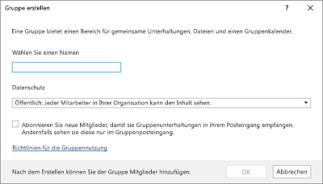
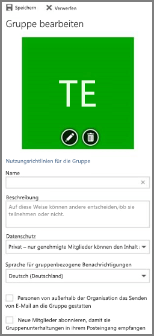
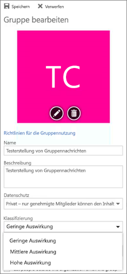

# <a name="manage-office-365-groups-with-powershell"></a>Verwalten von Office 365-Gruppen mit PowerShell

 *Letzte aktualisierte 18-April, 2018* 
  
In diesem Artikel werden die Schritte für allgemeine Verwaltungsaufgaben für Gruppen in Microsoft PowerShell ausführen. Außerdem werden die PowerShell-Cmdlets für Gruppen aufgelistet. Info zum Verwalten von SharePoint-Websites finden Sie unter [Verwalten von SharePoint Online-Websites mithilfe von PowerShell](https://docs.microsoft.com/sharepoint/manage-team-and-communication-sites-in-powershell).

## <a name="link-to-your-office-365-groups-usage-guidelines"></a>Link zu Ihrer Richtlinien für die Verwendung von Office 365-Gruppen
<a name="BK_LinkToGuideLines"> </a>

Wenn können Benutzer [Erstellen oder bearbeiten eine Gruppe in Outlook](https://support.office.com/article/04d0c9cf-6864-423c-a380-4fa858f27102.aspx), Sie sie einen Link zu Richtlinien für die Verwendung Ihrer Organisation anzeigen. Angenommen, Sie benötigen ein spezielles Präfix oder suffix, das auf den Namen einer Gruppe hinzugefügt werden soll.
  
Verwenden Sie die Benutzer Ihrer Organisation Verwendungsrichtlinien für für Office 365-Gruppen auf Azure Active Directory PowerShell. Auschecken von [Azure Active Directory-Cmdlets zum Konfigurieren von Einstellungen für die Gruppe](https://go.microsoft.com/fwlink/?LinkID=827484) , und führen Sie die Schritte in den **Einstellungen auf Verzeichnisebene erstellen** auf den Verwendung Leitlinie Hyperlink definieren möchten. Einmal führen Sie das Cmdlet AAD des Benutzers sehen Sie, den Link, um Ihre Richtlinien beim Erstellen und bearbeiten Sie eine Gruppe in Outlook. 
  

  

  
## <a name="allow-users-to-send-as-the-office-365-group"></a>Zulassen, dass Benutzer senden als der Office 365-Gruppe
<a name="BK_LinkToGuideLines"> </a>
  
Wenn Sie Ihre Office 365-Gruppen "Senden als" aktivieren möchten, verwenden Sie die [Add-recipientpermission können](https://docs.microsoft.com/powershell/module/exchange/mailboxes/Add-RecipientPermission) und die Cmdlets [Get-recipientpermission können](https://docs.microsoft.com/powershell/module/exchange/users-and-groups/Get-Recipient) , um dies zu konfigurieren. Nachdem Sie diese Einstellung aktivieren, können Office 365-Benutzer Outlook oder Outlook im Web zum Senden und Antworten auf e-Mail, wie die Office 365-Gruppe. Benutzer können wechseln, erstellen eine neue e-Mail-Adresse der Gruppe, und ändern Sie das Feld "Senden als" in e-Mail-Adresse der Gruppe. 

([Sie können hierzu auch in der Exchange-Verwaltungskonsole](https://docs.microsoft.com/en-us/office365/admin/create-groups/allow-members-to-send-as-or-send-on-behalf-of-group)).
  
Verwenden Sie das folgende Skript ersetzen * \<GroupAlias\> * mit dem Alias der Gruppe, die Sie aktualisieren möchten, und * \<Useraliascontoso\johndoe\> * mit dem Alias des Benutzers, der Sie Berechtigungen erteilen möchten. Zum Ausführen dieses Skripts [Connect to Exchange Online PowerShell](https://docs.microsoft.com/powershell/exchange/exchange-online/connect-to-exchange-online-powershell/connect-to-exchange-online-powershell) .

```PowerShell
$groupAlias = "<GroupAlias>"

$userAlias = "<UserAlias>"


$groupsRecipientDetails = Get-Recipient -RecipientTypeDetails groupmailbox -Identity $groupAlias

Add-RecipientPermission -Identity $groupsRecipientDetails.Name -Trustee $userAlias -AccessRights SendAs
```

Sobald das Cmdlet ausgeführt wird, können Benutzer, wie die Gruppe zu senden, indem Sie die Gruppe e-Mail-Adresse in das Feld **aus** Outlook oder Outlook im Web wechseln. 

## <a name="create-classifications-for-office-groups-in-your-organization"></a>Erstellen von Klassifikationen für Office-Gruppen in Ihrer Organisation

Sie können Klassifikationen erstellen, die die Benutzer in Ihrer Organisation beim Erstellen einer Gruppe von Office 365 festlegen können. Beispielsweise können Sie Benutzern "Standard", "Geheim" und "Top Secret" Festlegen von für Gruppen, die sie erstellen. Klassifikationen in der Gruppe werden nicht standardmäßig festgelegt, und Sie müssen beim Erstellen, damit Ihre Benutzer festgelegt. Verwenden Sie Azure Active Directory PowerShell, um Ihre Benutzer zu Ihrer Organisation Verwendungsrichtlinien für für Office 365 Gruppen verweisen.
  
Auschecken von [Azure Active Directory-Cmdlets zum Konfigurieren von Einstellungen für die Gruppe](https://docs.microsoft.com/azure/active-directory/users-groups-roles/groups-settings-cmdlets) , und führen Sie die Schritte in den **Einstellungen auf Verzeichnisebene erstellen** die Klassifikation für Office 365 Gruppen definieren. 
  
```
$setting["ClassificationList"] = "Low Impact, Medium Impact, High Impact"
```

Eine Beschreibung, die jeder Klassifizierung zuordnen, den Sie verwenden können, um das Attribut der Einstellungen *ClassificationDescriptions* definieren.
  
```
$setting["ClassificationDescriptions"] ="Classification:Description,Classification:Description"
```

Klassifikation entspricht, in dem die Zeichenfolgen in der ClassificationList.

Beispiel:
  
```
$setting["ClassificationDescriptions"] = "Low Impact: General communication, Medium Impact: Company internal data , High Impact: Data that has regulatory requirements"
```

Führen Sie das Cmdlet [Set-UnifiedGroup](https://docs.microsoft.com/powershell/module/exchange/users-and-groups/Set-UnifiedGroup) nach der Ausführung des oben genannten Azure Active Directory-Cmdlets, um die Klassifikation festzulegen Wenn Sie die Klassifizierung für eine bestimmte Gruppe festlegen möchten. 
  
```
Set-UnifiedGroup <LowImpactGroup@constoso.com> -Classification <LowImpact> 
```

Oder erstellen Sie eine neue Gruppe mit einer Klassifikation.
  
```
New-UnifiedGroup <HighImpactGroup@constoso.com> -Classification <HighImpact> -AccessType <Public> 
```

Weitere Informationen zur Verwendung von Exchange Online PowerShell finden Sie unter [Verwenden von PowerShell mit Exchange Online](https://docs.microsoft.com/powershell/exchange/exchange-online/exchange-online-powershell) und [Herstellen einer Verbindung mit Exchange Online PowerShell](https://docs.microsoft.com/powershell/exchange/exchange-online/connect-to-exchange-online-powershell/connect-to-exchange-online-powershell). 
  
Nachdem diese Einstellungen aktiviert sind, werden den Besitzer der Gruppe wählen eine Klassifizierung aus dem Dropdown-Menü in Outlook im Web und Outlook, und speichern Sie es von der Gruppenseite **Bearbeiten** können. 
  

  
## <a name="hide-office-365-groups-from-gal"></a>Office 365-Gruppen aus der globalen Adressliste ausblenden
<a name="BKMK_CreateClassification"> </a>

Sie können angeben, ob eine Office 365-Gruppe in der globalen Adressliste (GAL) und andere Listen in Ihrer Organisation angezeigt. Wenn Sie eine Gruppe rechtsabteilung, die nicht in der Adressliste angezeigt haben werden sollen, können Sie diese Gruppe aus der Anzeige im GAL beenden. Führen Sie das Cmdlet Set-Unified Gruppe blenden Sie die Gruppe aus der Adressliste wie folgt aus:
  
```
Set-UnifiedGroup -Identity "Legal Department" -HiddenFromAddressListsEnabled $true
```

## <a name="allow-only-internal-users-to-send-message-to-office-365-group"></a>Zulassen, dass nur interne Benutzer Nachricht an Office 365-Gruppe senden
<a name="BKMK_CreateClassification"> </a>

Wenn Sie nicht, dass Benutzer aus einer anderen Organisation zum Senden von e-Mail an eine Gruppe von Office 365 möchten, können Sie die Einstellungen für diese Gruppe ändern. Es können nur interne Benutzer eine e-Mail an Ihre Gruppe senden. Wenn externer Benutzer zum Senden von Nachrichten an diese Gruppe versuchen werden sie abgelehnt.
  
Führen Sie das Cmdlet Set-UnifiedGroup aktualisieren Sie diese Einstellung an, wie folgt aus:

```
Set-UnifiedGroup -Identity "Internal senders only" - RequireSenderAuthenticationEnabled $true
```

## <a name="add-mailtips-to-the-office-365-groups"></a>Hinzufügen von e-Mail-Infos zu den Office 365-Gruppen
<a name="BKMK_CreateClassification"> </a>

Wenn der Absender versucht, eine e-Mail an eine Gruppe von Office 365 senden, kann eine e-Mail-Info für diese angezeigt werden.
  
Führen Sie das Cmdlet Set-Unified Group, um eine e-Mail-Info zur Gruppe hinzufügen möchten:

```
Set-UnifiedGroup -Identity "MailTip Group" -MailTip "This group has a MailTip"
```

Zusammen mit e-Mail-Info können Sie auch MailTipTranslations, festlegen, der zusätzliche Sprachen für die e-Mail-Info angibt. Angenommen Sie, Sie haben die spanische Übersetzung, und klicken Sie dann den folgenden Befehl ausführen möchten:
  
```
Set-UnifiedGroup -Identity "MailaTip Group" -MailTip "This group has a MailTip" -MailTipTranslations "@{Add="ES:Esta caja no se supervisa."
```

## <a name="change-display-name-of-the-office-365-group"></a>Ändern des Anzeigenamens der Gruppe der Office 365

Angezeigter Name Gibt den Namen der Gruppe der Office 365. Sie können diesen Namen in der Exchange-Verwaltungskonsole oder Office 365-Verwaltungsportal sehen. Sie können den Anzeigenamen der Gruppe bearbeiten oder einen Anzeigenamen zu einer vorhandenen Office 365-Gruppe durch Ausführen des Befehls Set-UnifiedGroup zuweisen:

```
Set-UnifiedGroup -Identity "mygroup@contoso.com" -DisplayName "My new group"
```

## <a name="change-the-default-setting-of-office-365-groups-for-outlook-to-public-or-private"></a>Ändern Sie die Standardeinstellung der Office 365-Gruppen für Outlook in öffentlich oder privat
<a name="BKMK_CreateClassification"> </a>

Office 365 werden Gruppen in Outlook als privat standardmäßig erstellt werden. Wenn Ihre Organisation Office 365 Gruppen als öffentliches erstellt werden möchte, in der Standardeinstellung (oder wieder auf Private), verwenden Sie diese Syntax der PowerShell-Cmdlet:
  
 `Set-OrganizationConfig -DefaultGroupAccessType Public`
  
So legen Sie auf Private fest:
  
 `Set-OrganizationConfig -DefaultGroupAccessType Private`
  
So überprüfen die Einstellung: 
  
 `Get-OrganizationConfig | ft DefaultGroupAccessType`
  
Weitere Informationen finden Sie unter [Set-OrganizationConfig](https://docs.microsoft.com/powershell/module/exchange/organization/set-organizationconfig) und [Get-OrganizationConfig](https://docs.microsoft.com/powershell/module/exchange/organization/Get-OrganizationConfig).
  
## <a name="office-365-groups-cmdlets"></a>Cmdlets für Office 365-Gruppen

Die folgenden Cmdlets können mit Office 365-Gruppen verwendet werden.
  
|**Name des Cmdlets**|**Beschreibung**|
|:-----|:-----|
|[Get-UnifiedGroup](https://go.microsoft.com/fwlink/p/?LinkId=616182) <br/> |Verwenden Sie dieses Cmdlet zum Nachschlagen von vorhandenen Office 365-Gruppen, und klicken Sie zum Anzeigen der Eigenschaften des Group-Objekts  <br/> |
|[Set-UnifiedGroup](https://go.microsoft.com/fwlink/p/?LinkId=616189) <br/> |Aktualisieren Sie die Eigenschaften einer bestimmten Gruppe von Office 365  <br/> |
|[New-UnifiedGroup](https://go.microsoft.com/fwlink/p/?LinkId=616183) <br/> |Erstellen einer neuen Office 365-Gruppe an. Dieses Cmdlet bietet einen minimalen Satz von Parametern, für die Einstellung Werte für erweiterte Eigenschaften Set-UnifiedGroup nach dem Erstellen der neuen Gruppe verwenden  <br/> |
|[Remove-UnifiedGroup](https://go.microsoft.com/fwlink/p/?LinkId=616186) <br/> |Löschen einer vorhandenen Office 365-Gruppe  <br/> |
|[Get-UnifiedGroupLinks](https://go.microsoft.com/fwlink/p/?LinkId=616194) <br/> |Abrufen von Informationen für Mitgliedschafts- und Besitzer für die Gruppe ein Office 365  <br/> |
|[Add-UnifiedGroupLinks](https://go.microsoft.com/fwlink/p/?LinkId=616191) <br/> |Hinzufügen von hundert oder Tausende von Benutzern oder neue Besitzer einer vorhandenen Office 365-Gruppe  <br/> |
|[Remove-UnifiedGroupLinks](https://go.microsoft.com/fwlink/p/?LinkId=616195) <br/> |Entfernen Sie Besitzer und Mitglieder aus einer vorhandenen Office 365-Gruppe  <br/> |
|[Get-UserPhoto](https://go.microsoft.com/fwlink/p/?LinkId=536510) <br/> |Dient zum Anzeigen von Informationen zum benutzerfoto ein Konto zugeordnet. Benutzerfotos werden in Active Directory gespeichert.  <br/> |
|[Set-UserPhoto](https://go.microsoft.com/fwlink/p/?LinkId=536511) <br/> |Verwendet, um ein benutzerfoto mit einem Konto zuzuordnen. Benutzerfotos werden in Active Directory gespeichert.  <br/> |
|[Remove-UserPhoto](https://go.microsoft.com/fwlink/p/?LinkId=536512) <br/> |Entfernen Sie das Foto für eine Gruppe von Office 365  <br/> |

## <a name="related-topics"></a>Verwandte Themen

[Upgrade Verteilerlisten zu Office 365-Gruppen](https://docs.microsoft.com/en-us/office365/admin/manage/upgrade-distribution-lists)

[Verwalten von Personen, die Office 365-Gruppen erstellen können](https://docs.microsoft.com/en-us/office365/admin/create-groups/manage-creation-of-groups)

[Verwalten des Gastzugriffs auf Office 365-Gruppen](https://support.office.com/article/bfc7a840-868f-4fd6-a390-f347bf51aff6)

[Statische Gruppenmitgliedschaft in dynamischen ändern](https://docs.microsoft.com/azure/active-directory/users-groups-roles/groups-change-type)
