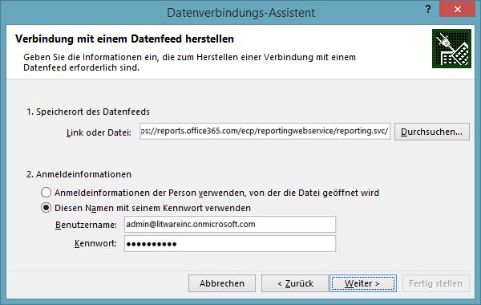
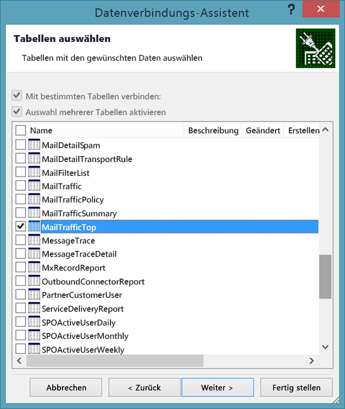
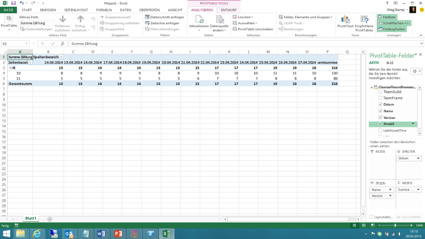

# <a name="using-excel-to-retrieve-office-365-reporting-data"></a>Verwenden von Excel zum Abrufen von Office 365-Berichterstellungsdaten

 **Zusammenfassung:** Verwenden Sie das oData-Feature in Microsoft Excel, um ausführliche Berichte Informationen für die Bereitstellung von Office 365 abzurufen
  
Die Berichterstellung ist ein wichtiger Bestandteil der Systemverwaltung. Das Office 365 Admin Center enthält eine Reihe an vordefinierten Berichten, auf die Sie im linken Navigationsbereich im Abschnitt **Berichte** zugreifen können. Es stehen Verwendungsberichte und Sicherheits- und Kompatibilitätsberichte zur Verfügung.
  
Die Berichte, die Ihnen zur Verfügung stehen, sind davon abhängig, welche Version von Office 365 Sie verwenden und welche Office 365-Dienste Sie aktiviert haben. Weitere Informationen finden Sie unter [Berichte](https://technet.microsoft.com/en-us/library/office-365-reports.aspx).
  
Die vordefinierten Admin Center-Berichte sind eine exzellente Ressource, mit der sich solche Dinge wie die Postfachnutzung oder die Anzahl an Minuten, die Ihre Benutzer in Onlinekonferenzen verbracht haben, einfach prüfen lassen. Bei der detaillierten Analyse Ihrer Office 365-Domäne haben die Berichte jedoch ihre Beschränkungen.
  
Eine Problemumgehung in Bezug auf diese Beschränkungen besteht darin, die Windows PowerShell oder eine andere Bereitstellungssprache zu verwenden, um auf den Office 365-Berichterstellungsdienst zuzugreifen und benutzerdefinierte Berichte zu erstellen. Mit benutzerdefinierten Berichten können Sie vorgeben, welche (und wie viele) Daten aus dem Office 365-Berichterstellungsdienst zurückgegeben werden. Durch das Schreiben von benutzerdefinierten Berichten können Sie auch angeben, wie die Daten sortiert und gruppiert werden sollen und, sofern verfügbar, wie die Daten gespeichert werden sollen. Beispielsweise können Sie Daten im XML- oder im CSV-Format speichern, das einfach in Excel importiert werden kann. 
  
Zusätzlich ermöglichen Ihnen benutzerdefinierte Skripts/Anwendungen, auf Berichte zuzugreifen, die im Office 365 Admin Center nicht verfügbar sind. Beispielsweise kann das Admin Center anzeigen, über wie viele "alte" Postfächer Sie verfügen, aber es kann nicht anzeigen, auf welche Postfächer in den letzten 30 Tagen zugegriffen wurde. Ein benutzerdefiniertes PowerShell-Skript kann Ihnen jedoch genau dies anzeigen. In Anbetracht des Schreibens eines kurzen und relativ einfachen Windows PowerShell-Skripts stellt dies zusammen eine Menge an Flexibilität dar.
  
> [!VISUAL BASIC NOTE] Weitere Informationen über den Office 365-Berichterstellungsdienst finden Sie unter [Office 365-Berichterstattungswebdienst](https://msdn.microsoft.com/en-us/library/office/jj984325%28v=office.15%29.aspx).
  
Zum Abrufen dieser Daten müssen Sie allerdings einigen Code schreiben. Das ist es wert, wenn Sie eine größere Organisation sind, die die Menge und den Typ der Informationen begrenzen muss, die zurückgegeben werden. Wenn Sie jedoch eine kleinere Organisation sind und die Menge und den Typ der Informationen, die zurückgegeben werden, nicht begrenzen müssen, sollten Sie in Erwägung ziehen, die Office 365-Berichte direkt in Excel zu öffnen.
  
Es gibt dabei jedoch einige Beschränkungen. Die wichtigste lautet wie folgt: Sie können die Daten nicht erst filtern, sortieren, auswählen oder anderweitig ändern, nachdem sie zurückgegeben wurden. Vielmehr erhalten Sie einfach den vom Bericht zurückgegebenen standardmäßigen Satz an Daten zurück. In einigen Fällen sind das möglicherweise nicht genügend Daten: Beispielsweise gibt der Bericht möglicherweise nur Daten für den vorherigen Monat und nicht für das gesamte Jahr zurück. Umgekehrt werden in anderen Fällen zu viele Daten zurückgegeben: Es werden möglicherweise Daten für das gesamte Jahr zurückgegeben, obwohl Sie nur Daten für den vorherigen Monat haben möchten.
  
Um einen Office 365-direkt in Excel zu öffnen, gehen Sie folgendermaßen vor:
  
1. Öffnen Sie zunächst ein neues Arbeitsblatt in Excel. Klicken Sie in diesem Arbeitsblatt auf **Daten**, auf **Aus anderen Quellen** und dann auf **Aus OData-Datenfeed**. Dadurch wird das Dialogfeld **Datenverbindungs-Assistent** angezeigt:
    
     
  
2. Geben Sie auf der Seite **Verbindung mit einem Datenfeed herstellen** **https://reports.office365.com/ecp/reportingwebservice/reporting.svc/** als den Speicherort des Datenfeeds ein. Beachten Sie, dass Sie nur die Basis-URL wie angezeigt eingeben können. Sie können keine „Select"-, „Filter"- oder „Format"-Anweisungen hinzufügen. Wenn Sie etwas eingeben, was von der Basis-URL abweicht, werden keine Daten zurückgegeben. Es wird nur folgende Fehlermeldung angezeigt:
    
     
  
3. Wählen Sie nach der Eingabe der Berichterstellungsdienst-URL **Diesen Namen mit seinem Kennwort verwenden** unter **Anmeldeinformationen** aus. Geben Sie im Feld **Benutzername** Ihren Office 365-Anmeldenamen (beispielsweise "admin@litwareinc.onmicrosoft.com") ein. Geben Sie im Feld **Kennwort** Ihr Office 365-Anmeldekennwort ein, und klicken Sie dann auf **Weiter**. Excel versucht dann, mit den angegebenen Anmeldeinformationen eine Verbindung zum Berichterstellungsdienst herzustellen.
    
4. Nach der Authentifizierung wird die Seite **Tabellen auswählen** angezeigt. Wählen Sie den anzuzeigenden Bericht aus (beispielsweise **MailTrafficTop** ), und klicken Sie dann auf **Weiter**:
    
     
  
    > [!NOTE]
    > Es ist möglich, mehrere Berichte auszuwählen, was zur Folge hat, dass mehrere Tabellen/Diagramme zu Ihrer Excel-Tabelle hinzugefügt werden. Es ist sogar möglich, eine einzelne Tabelle bzw. ein einzelnes Diagramm zu erstellen, die bzw. das Daten aus mehreren Berichten kombiniert. Dies wird in diesem Einführungsartikel jedoch nicht erläutert. 
  
5. Nach dem Klicken auf **Weiter** wird die Seite **Datenverbindungsdatei speichern und fertig stellen** angezeigt:
    
     
  
    Hier müssen Sie keine Informationen eingeben. Sie müssen nur auf **Fertig stellen** klicken, um Ihre Daten abzurufen. Beachten Sie jedoch, dass Excel Informationen über jede von Ihnen vorgenommene Datenverbindung speichert. Diese Daten werden in Ihrem Ordner **Meine Datenquellen** gespeichert:
    
     
  
    Daher umfasst das Dialogfeld Textfelder mit Bezeichnungen wie **Anzeigename** und **Stichwörter der Suche**. Diese Optionen geben Ihnen die Möglichkeit, diese Datenverbindungen anzupassen. So müssen Sie sich nicht mit einer ganzen Reihe an Datenquellen herumschlagen, die so aussehen:
    
  ```
  DataFeed_1_reports-office365-com ClientSoftwareBrowserDetail.odc
DataFeed_1_reports-office365-com MailTrafficTop.odc
DataFeed_1_reports-office365-com Multiple Tables.odc
DataFeed_2_reports-office365-com MailboxActivityWeekly.odc
DataFeed_2_reports-office365-com MailTrafficTop.odc
DataFeed_3_reports-office365-com ClientSoftwareBrowserDetail.odc
  ```

Wenn Sie das Kontrollkästchen **Kennwort in Datei speichern** aktivieren, können Sie diese Datenfeeds erneut verwenden. Angenommen, Sie speichern eine Datenverbindung als **Clientbrowserbericht**. Wenn Sie das nächste Mal Informationen über den für den Zugriff auf Ihre Office 365-Domäne verwendeten Webbrowser benötigen, müssen Sie den Datenverbindungs-Assistenten nicht durchlaufen. Vielmehr müssen Sie nur Excel öffnen, auf **Daten** und dann auf **Vorhandene Quellen** klicken. Wählen Sie die gewünschte Datenverbindung im Dialogfeld **Vorhandene Verbindungen** aus, und klicken Sie dann auf **OK**:
    

  
Nun stellt Excel die Verbindung her, um die Daten abzurufen.
    
Beachten Sie, dass es sich bei diesen ODC-Dateien um Nur-Text-XML-Dateien handelt. In diesen Dateien sind Ihr Office 365-Benutzername und Kennwort enthalten:
    
\<ODC:ConnectionString > Data Source = https://reports.office365.com/ecp/reportingwebservice/reporting.svc/; Namespaces Einbeziehung = *; Maximale Nachrichtengröße empfangen = 4398046511104; Integrated Security = Basic; **Benutzer ID=admin@litwareinc.onmicrosoft.com; Kennwort = MYpassw0rd!**; Sicherheitsinformationen = False; Dienst Dokument Url = https://reports.office365.com/ecp/reportingwebservice/reporting.svc/\</odc:ConnectionString >
    
Sie sollten das Kontrollkästchen **Kennwort in Datei speichern** nicht aktivieren, wenn Sie nicht möchten, dass Ihr Name und Ihr Kennwort in einer Nur-Text-Datei gespeichert werden. Wenn Sie dies vornehmen, müssen Sie jedoch berücksichtigen, dass Sie diese Datenverbindungen nicht wiederverwenden können. Ohne Benutzername und Kennwort kann Office 365 Ihren Anmeldeversuch bei dem Dienst nicht authentifizieren.
    
6. Klicken Sie auf **Fertig stellen** auf der Seite **Datenverbindungsdatei speichern und fertig stellen**. Das Dialogfeld **Daten importieren** wird angezeigt:
    
     
  
7. Wählen Sie Ihre Anzeigeoptionen aus (beispielsweise **PivotTable-Bericht** ), und klicken Sie dann auf **OK**. Wenn alles normal läuft, werden Ihre Daten importiert und anhand der von Ihnen ausgewählten Anzeigeoption dargestellt:
    
     
  
Was Sie mit diesen Daten machen, ist Ihnen überlassen. Einige Empfehlungen finden Sie im Artikel [Erstellen eines Excel Services-Dashboards mithilfe eines OData-Datenfeeds](https://technet.microsoft.com/en-us/library/jj873965%28v=office.15%29.aspx). Auch wenn in diesem Artikel der Office 365-Berichterstellungsdienst nicht verwendet wird, bietet er einige praktische Hinweise für das Erledigen von Dingen wie das Hinzufügen von Filtern und Slicern zu Ihrem neuen Dashboard.
  
## <a name="see-also"></a>See also

#### 

[Verwalten von Office 365 mit Office 365 PowerShell](manage-office-365-with-office-365-powershell.md)
  
[Erste Schritte mit Office 365 PowerShell](getting-started-with-office-365-powershell.md)
  
[Verwenden der Windows PowerShell zum Erstellen von Berichten in Office 365](use-windows-powershell-to-create-reports-in-office-365.md)

