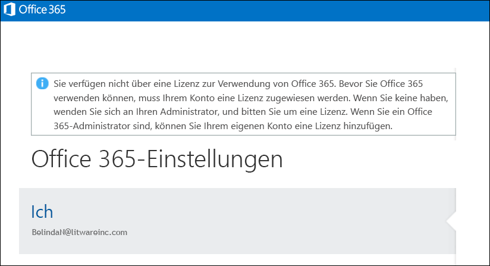

# <a name="view-licensed-and-unlicensed-users-with-office-365-powershell"></a>Anzeigen lizenzierter und nicht lizenzierter Benutzer mit Office 365 PowerShell

**Zusammenfassung:** Erläutert das Verwenden von Office 365 PowerShell zum Anzeigen von lizenzierten und nicht lizenzierten Benutzerkonten.
  
Benutzerkonten in Ihrer Office 365-Organisation sind möglicherweise einige, alle oder keine der verfügbaren Lizenzen aus den Lizenzierungsplänen zugewiesen, die in Ihrer Organisation verfügbar sind. Mit Office 365 PowerShell können Sie lizenzierte und nicht lizenzierte Benutzer in Ihrer Organisation schnell finden.
  
## <a name="before-you-begin"></a>Bevor Sie beginnen:

- Für die Verfahren in diesem Thema müssen Sie eine Verbindung mit Office 365 PowerShell herstellen. Weitere Anweisungen finden Sie unter [Verbinden mit Office 365 PowerShell](connect-to-office-365-powershell.md).
    
- Bei Verwendung des **Get-MsolUser**-Cmdlets ohne den _-All_-Parameter werden nur die ersten 500 Konten zurückgegeben.
    
## <a name="the-short-version-instructions-without-explanations"></a>Die Kurzfassung (Anweisungen ohne Erläuterungen)

In diesem Abschnitt werden die Verfahren kurz und bündig erläutert. Wenn Sie Fragen haben oder weitere Informationen benötigen, können Sie den Rest des Themas lesen.
  
Führen Sie den folgenden Befehl in Office 365 PowerShell aus, um die Liste aller Benutzerkonten mit ihrem Lizenzierungsstatus in Ihrer Organisation anzuzeigen:
  
```
Get-MsolUser -All
```

Führen Sie den folgenden Befehl aus, um die Liste aller nicht lizenzierten Benutzerkonten in Ihrer Organisation anzuzeigen:
  
```
Get-MsolUser -All -UnlicensedUsersOnly
```

Führen Sie den folgenden Befehl aus, um die Liste aller lizenzierten Benutzerkonten in Ihrer Organisation anzuzeigen:
  
```
Get-MsolUser -All | where {$_.isLicensed -eq $true}
```

## <a name="the-long-version-instructions-with-detailed-explanations"></a>Die Langfassung (Anweisungen mit detaillierten Erläuterungen)

Office 365-Benutzerkonten und Lizenzen für Office 365 müssen keine 1: 1-Beziehung aufweisen: Es ist möglich, die Office 365-Benutzer haben, die nicht über Office 365-Lizenz verfügen, und es ist möglich, dass Office 365-Lizenzen, die einem Benutzer zugewiesen wurden noch nicht. (Tatsächlich kann ein einzelnes Benutzerkonto auch *mehrere* Office 365 Lizenzen haben.) Beim Erstellen ein neues Office 365-Benutzers beifügen (Siehe den Artikel [Zuweisen von Lizenzen, um die Benutzerkonten mit Office 365 PowerShell](assign-licenses-to-user-accounts-with-office-365-powershell.md) finden Sie weitere Informationen) Sie keinen der Benutzer eine Lizenz zuweisen: der neue Benutzer muss ein gültiges Konto, aber er nicht möglich Sig n in Office 365. Wenn sie versuchen, melden Sie sich, sehen sie dann in etwa so:
  

  
Ebenso können Sie einen Benutzer haben, der sich längere Zeit frei nimmt, beispielsweise für ein Sabbatjahr oder die Elternzeit. In einem solchen Fall könnten Sie die Lizenz des Benutzers entfernen, das Benutzerkonto aber intakt lassen (das heißt, alle Eigenschaftswerte wie Adresse und Telefonnummer beibehalten). So können Sie dessen Lizenz einem anderen Benutzer zuweisen (beispielsweise dem temporären Mitarbeiter, der die Aufgaben des abwesenden Mitarbeiters übernimmt). Wenn der Benutzer an seinen Arbeitsplatz zurückkehrt, können Sie ihm eine neue Lizenz ausstellen, und dann kann er seine Arbeit wieder aufnehmen, als wäre er nie fort gewesen.
  
Was einfach bedeutet, ja, Sie können Benutzer haben, die über ein Konto verfügen, aber keine Lizenzen haben. Oder umgekehrt.
  
Im Artikel [Anzeigen von Lizenzen und Diensten mit Office 365 PowerShell](view-licenses-and-services-with-office-365-powershell.md) wird erklärt, wie Sie feststellen können, wie viele Office 365-Lizenzen Ihre Organisation erworben hat und wie viele dieser Lizenzen Benutzern zugewiesen wurden. Dies sind wichtige Informationen. Genauso wichtig ist es jedoch, zu wissen, welchen Benutzern diese Lizenzen zugewiesen wurden. In diesem Artikel erfahren Sie, wie Sie genau das herausfinden.
  
Wie Sie vielleicht wissen, gibt das **Get-MsolUser** -Cmdlet Informationen über alle Office 365-Benutzerkonten zurück. Brauchen Sie schnell Informationen zu Ihren Office 365-Benutzern? Dann führen Sie diesen Befehl in Office 365 PowerShell aus:
  
```
Get-MsolUser
```

"Get-MsolUser" gibt wiederum Daten wie die folgenden zurück:
  
```
UserPrincipalName           DisplayName                     isLicensed
-----------------           -----------                     ----------
ZrinkaM@litwareinc.com      Zrinka Makovac                  True
BelindaN@litwareinc.com     Belinda Newman                  False
BonnieK@litwareinc.com      Bonnie Kearney                  True
FabriceC@litwareinc.com     Fabrice Canel                   True
AnneW@litwareinc.com        Anne Wallace                    True
AlexD@litwareinc.com        Alex Darrow                     True
```

Wie Sie sehen, bezieht sich einer der zurückgegebenen Eigenschaftswerte auf die **isLicensed** -Eigenschaft. Wenn **isLicensed** gleich `False` ist, hat dieser Benutzer keine Lizenz für Office 365. Das heißt, wenn Sie möchten, können Sie einfach durch die Liste Ihrer Benutzer blättern und diejenigen heraussuchen, bei denen die **isLicensed** -Eigenschaft den Wert `False` hat.
  
Wie auch immer, das Durchblättern einer Liste von Benutzern in dem Versuch, nicht lizenzierte Benutzer herauszusuchen, funktioniert, solange die Anzahl der Benutzer relativ klein ist. Wenn Sie viele Benutzer haben, ist das Durchblättern dieser Liste aber, im besten Fall, äußerst mühevoll. (Und je nach Konfiguration von Windows PowerShell vielleicht sogar geradezu unmöglich. Das liegt daran, dass die Anzahl der Ausgabezeilen, die auf der Windows PowerShell-Konsole auf einmal angezeigt werden können, begrenzt ist.)
  
Mit diesen Fakten im Hinterkopf ist es viel besser, Ihre nicht lizenzierten Benutzer stattdessen mit dem folgenden Befehl aufzulisten:
  
```
Get-MsolUser -UnlicensedUsersOnly
```

Mit diesem Befehl werden nur die Benutzer zurückgegeben, die keine Lizenz für Office 365 haben. Mit anderen Worten:
  
```
UserPrincipalName           DisplayName                     isLicensed
-----------------           -----------                     ----------
BelindaN@litwareinc.com     Belinda Newman                  False
```

Wie Sie sehen können, haben wir einen nicht lizenzierten Benutzer. Und was würden wir tun, wenn wir nur eine Liste der  *lizenzierten*  Benutzer haben wollten? Das ist etwas komplizierter, aber nur ein wenig:
  
```
Get-MsolUser | Where-Object {$_.isLicensed -eq $true}
```

Dieser Befehl, der nach allen Benutzerkonten sucht, deren **isLicensed** -Eigenschaft den Wert `True` hat, gibt Informationen ähnlich den folgenden zurück:
  
```
UserPrincipalName           DisplayName                     isLicensed
-----------------           -----------                     ----------
ZrinkaM@litwareinc.com      Zrinka Makovac                  True
BonnieK@litwareinc.com      Bonnie Kearney                  True
FabriceC@litwareinc.com     Fabrice Canel                   True
AnneW@litwareinc.com        Anne Wallace                    True
AlexD@litwareinc.com        Alex Darrow                     True
```

Wie Sie sehen, werden keine Informationen für Belinda Newman zurückgegeben. Warum nicht? Richtig: weil die **isLicensed** -Eigenschaft für Belindas Konto nicht auf `True` festgelegt wurde.
  
## <a name="see-also"></a>Siehe auch

Weitere Informationen zu den in diesen Verfahren Thema verwendeten Cmdlets finden Sie unter den folgenden Themen:
  
- [Get-MsolUser](https://go.microsoft.com/fwlink/p/?LinkId=691547)
    
- [Where-Object](https://go.microsoft.com/fwlink/p/?LinkId=113423)
    

