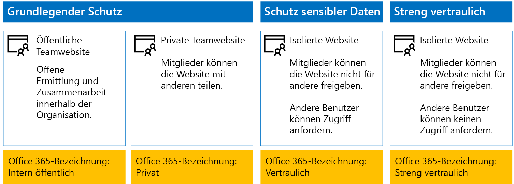
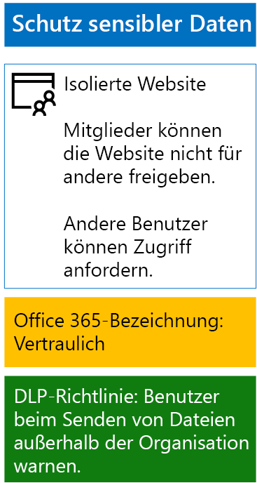

# <a name="protect-sharepoint-online-files-with-office-365-labels-and-dlp"></a>Schützen von SharePoint Online-Dateien mit Office 365 Etiketten und DLP

 **Zusammenfassung:** Gelten Sie Office 365 Etiketten und Daten Richtlinien von Datenverlust (DLP) für SharePoint Online Teamwebsites mit verschiedenen Schutzebenen Informationen.
  
Verwenden Sie die Schritte in diesem Artikel zum Entwerfen und Bereitstellen von Office 365 Etiketten und DLP-Richtlinien für geplante, empfindlich und streng vertraulich SharePoint Online Teamwebsites. Weitere Informationen zu diesen drei Ebenen des Schutzes finden Sie unter [Secure SharePoint Online-Websites und Dateien](secure-sharepoint-online-sites-and-files.md).
  
## <a name="office-365-labels-for-your-sharepoint-online-sites"></a>Office 365-Bezeichnungen für Ihre SharePoint Online-Websites

Es gibt drei Phasen beim Erstellen und anschließenden Zuweisen von Office 365-Bezeichnungen zu SharePoint Online-Teamwebsites.
  
### <a name="phase-1-determine-the-office-365-label-names"></a>Phase 1: Festlegen der Office 365-Bezeichnungsnamen

In dieser Phase legen Sie die Namen der Office 365-Bezeichnungen für die vier Ebenen des Informationsschutzes fest, der auf SharePoint Online-Teamwebsites angewendet werden soll. In der folgenden Tabelle sind die vier empfohlenen Bezeichnungen für die einzelnen Ebenen aufgeführt.
  
|**SharePoint Online Team Site-Schutzstufe**|**Bezeichnungsname**|
|:-----|:-----|
|Basisschutz-Öffentlich  <br/> |Intern öffentlich  <br/> |
|Basisschutz-Privat  <br/> |Privat  <br/> |
|Vertraulich  <br/> |Vertraulich  <br/> |
|Streng vertraulich  <br/> |Streng vertraulich  <br/> |
   
### <a name="phase-2-create-the-office-365-labels"></a>Phase 2: Erstellen von Office 365-Bezeichnungen

In dieser Phase erstellen Sie die von Ihnen festgelegten Bezeichnungen für die verschiedenen Ebenen des Informationsschutzes und veröffentlichen sie.
  
Zum Erstellen der Bezeichnungen können Sie das Office 365 Admin Center oder Microsoft PowerShell.
  
### <a name="create-office-365-labels-with-the-office-365-admin-center"></a>Erstellen von Office 365-Bezeichnungen mit dem Office 365 Admin Center

1. Melden Sie sich mit einem Konto beim Office 365-Portal an, das über die Rolle „Sicherheitsadministrator" oder Unternehmensadministrator" verfügt. Hilfe finden Sie unter [Wo kann ich mich bei Office 365 Business anmelden?](https://support.office.com/Article/Where-to-sign-in-to-Office-365-e9eb7d51-5430-4929-91ab-6157c5a050b4).
    
2. Klicken Sie auf der Registerkarte **Microsoft Office Home** auf die Kachel **Admin**.
    
3. Klicken Sie auf der neuen Registerkarte **Office Admin Center** im Browser auf **Admin Center > Security &amp; Compliance**.
    
4. Klicken Sie auf der neuen Registerkarte **Start - Security &amp; Compliance** im Browser auf **Klassifizierungen > Bezeichnungen**.
    
5. Klicken Sie im Bereich **Start > Bezeichnungen** auf **Bezeichnung erstellen**.
    
6. Klicken Sie im Bereich **Name die Bezeichnung** Geben Sie den Namen der Beschriftung, und klicken Sie dann auf **Weiter**.
    
7. Klicken Sie im Bereich **Bezeichnungseinstellungen** auf **Weiter**.
    
8. Klicken Sie im Bereich **Einstellungen überprüfen** auf **Bezeichnung erstellen**, und klicken Sie dann auf **Schließen**.
    
9. Wiederholen Sie die Schritte 5 bis 8 für weitere Bezeichnungen.
    
### <a name="create-office-365-labels-with-powershell"></a>Erstellen von Office 365-Bezeichnungen mit PowerShell

1. [Verbinden auf die Office 365-Sicherheit &amp; Compliance Center mit remote-PowerShell](http://go.microsoft.com/fwlink/?LinkID=799771&amp;clcid=0x409) und geben Sie die Anmeldeinformationen eines Kontos, das die Rolle Sicherheitsadministrator oder Unternehmensadministrator hat.
    
2. Füllen Sie die Liste der Bezeichnungsnamen aus, und führen Sie dann die folgenden Befehle in der PowerShell-Eingabeaufforderung aus:
    
  ```
  $labelNames=@(<list of label names, each enclosed in quotes and separated by commas>)
ForEach ($element in $labelNames){ New-ComplianceTag -Name $element }
  ```

Gehen Sie als Nächstes wie folgt vor, um die neuen Office 365 Bezeichnungen zu veröffentlichen.
  
1. Aus der **Home > Etiketten** im Bereich der Sicherheit &amp; Compliance Center, klicken Sie auf **Veröffentlichen Etiketten**.
    
2. Klicken Sie im Bereich **Zu veröffentlichende Bezeichnungen wählen** auf **Zu veröffentlichende Bezeichnungen wählen**
    
3. Klicken Sie im Bereich **Bezeichnungen wählen** auf **Hinzufügen**, und wählen Sie alle vier Bezeichnungen aus.
    
4. Klicken Sie auf **Fertig**.
    
5. Klicken Sie im Bereich **Zu veröffentlichende Bezeichnungen wählen** auf **Weiter**.
    
6. Klicken Sie im Bereich **Speicherorte auswählen** auf **Weiter**.
    
7. Klicken Sie im Bereich **Name der Richtlinie** Geben Sie im **Feld Name**einen Namen für den Satz von Etiketten, und klicken Sie dann auf **Weiter**.
    
8. Klicken Sie im Bereich **Einstellungen überprüfen** auf **Bezeichnungen veröffentlichen**, und klicken Sie dann auf **Schließen**.
    
### <a name="phase-3-apply-the-office-365-labels-to-your-sharepoint-online-sites"></a>Phase 3: Anwenden der Office 365-Bezeichnungen auf SharePoint Online-Websites

Gehen Sie wie folgt vor, um die Office 365-Bezeichnungen auf die Dokumentenordner der SharePoint Online-Teamwebsites anzuwenden.
  
1. Klicken Sie auf die Kachel " **SharePoint** ", aus der **Microsoft Office Home** Registerkarte Ihres Browsers.
    
2. Klicken Sie auf der neuen Registerkarte **SharePoint** in Ihrem Browser auf einer Website, die eine Office 365-Beschriftung zugewiesen.
    
3. Klicken Sie in der neuen SharePoint-Website Registerkarte Ihres Browsers auf **Dokumente**.
    
4. Klicken Sie auf das Symbol für Einstellungen und anschließend auf **Bibliothekeinstellungen**.
    
5. Klicken Sie unter **Berechtigungen und Verwaltung** auf **Bezeichnung auf Elemente in dieser Bibliothek anwenden**.
    
6. **Bezeichnung Einstellungen anwenden**wählen Sie die entsprechende Beschriftung, und klicken Sie dann auf **Speichern**.
    
7. Schließen Sie die Registerkarte für die SharePoint Online-Website.
    
8. Wiederholen Sie die Schritte 3 bis 8, um weiteren SharePoint Online-Websites Office 365-Bezeichnungen zuzuweisen.
    
Nachfolgend sehen Sie die daraus resultierende Konfiguration.
  

  
## <a name="dlp-policies-for-your-sharepoint-online-sites"></a>DLP-Richtlinien für SharePoint Online-Websites

Verwenden Sie folgende Schritte aus, um einer DLP-Richtlinie konfigurieren, die Benutzer darüber informiert werden, wenn sie ein Dokument auf einer SharePoint Online vertrauliche Teamwebsite außerhalb der Organisation freigeben.
  
1. Klicken Sie auf der Registerkarte **Microsoft Office-Homepage** im Browser auf die Kachel **Security &amp; Compliance**.
    
2. Klicken Sie auf der Registerkarte **Security &amp; Compliance** in Ihrem Browser auf **Verhinderung von Datenverlust > Richtlinie**.
    
3. Klicken Sie im Bereich **Verhinderung von Datenverlust** auf **+ Richtlinie erstellen**.
    
4. Klicken Sie im Bereich **Mit einer Vorlage beginnen oder eine benutzerdefinierte Richtlinie erstellen** auf **Benutzerdefiniert**, und klicken Sie dann auf **Weiter**.
    
5. Klicken Sie im **Namen der Richtlinie** Geben Sie den Namen für die Ebene vertrauliche DLP-Richtlinie im **Feld Name**ein, und klicken Sie dann auf **Weiter**.
    
6. Klicken Sie im Bereich **Speicherorte auswählen** auf **Bestimmte Speicherorte auswählen**, und klicken Sie dann auf **Weiter**.
    
7. Deaktivieren Sie in der Liste der Speicherorte **Exchange-E-Mail** und **OneDrive-Konten**, und klicken Sie dann auf **Weiter**.
    
8. Klicken Sie im Bereich **Typen von vertraulichen Informationen anpassen, die geschützt werden sollen** auf **Bearbeiten**.
    
9. In der **wählen Sie die Typen der Inhalte zum Schutz** Bereich, klicken Sie auf **hinzufügen** im Dropdown-Listenfeld, und klicken Sie dann auf **Etiketten**.
    
10. Klicken Sie im Bereich **Bezeichnungen** auf **+ Hinzufügen**, wählen Sie die Bezeichnung **Vertraulich** aus, klicken Sie auf **Hinzufügen**, und klicken Sie dann auf **Fertig**.
    
11. Klicken Sie im Bereich **Typen des zu schützenden Inhalts auswählen** auf **Speichern**.
    
12. Klicken Sie im Bereich **Typen von vertraulichen Informationen anpassen, die geschützt werden sollen** auf **Weiter**.
    
13. Klicken Sie im Bereich **Was möchten Sie tun, wenn vertrauliche Informationen erkannt werden?** auf **Richtlinientipptext anpassen**.
    
14. Klicken Sie im Fenster **Richtlinientipps und E-Mail-Benachrichtigungen anpassen** auf **Richtlinientipptext anpassen**.
    
15. Geben Sie Folgendes in das Textfeld ein, oder fügen Sie es ein:
    
  - Wenn Sie eine Datei für einen Benutzer außerhalb der Organisation freigeben möchten, laden Sie die Datei herunter, und öffnen Sie sie. Klicken Sie auf „Datei" > „Dokument schützen" > „Mit Kennwort verschlüsseln", und geben Sie dann ein sicheres Kennwort ein. Senden Sie das Kennwort in einer separaten E-Mail oder auf andere Weise.
    
    Sie können auch einen eigenen Tipp in Bezug auf die Richtlinie eingeben oder einfügen, der den Benutzern erläutert, wie sie Dateien außerhalb der Organisation freigeben.
    
16. Klicken Sie auf **OK**.
    
17. Deaktivieren Sie im Fenster **Was möchten Sie tun, wenn vertrauliche Informationen erkannt werden?** das Kontrollkästchen **Freigeben blockieren und Zugriff auf freigegebene Inhalte einschränken**, und klicken Sie dann auf **Weiter**.
    
18. Klicken Sie im Bereich **Möchten Sie die Richtlinie aktivieren oder zunächst testen?** auf **Ja, Richtlinie aktivieren**, und klicken Sie dann auf **Weiter**.
    
19. Klicken Sie im Bereich **Einstellungen überprüfen** auf **Erstellen**, und klicken Sie dann auf **Schließen**.
    
Nachfolgend ist die hieraus resultierende Konfiguration für vertrauliche SharePoint Online-Teamwebsites aufgeführt.
  

  
Gehen Sie als Nächstes wie folgt vor, um eine DLP-Richtlinie zu konfigurieren, die Benutzer blockiert, wenn sie ein Dokument auf einer streng vertraulichen SharePoint Online-Teamwebsite mit Benutzern außerhalb der Organisation teilen.
  
1. Klicken Sie auf der Registerkarte **Microsoft Office-Homepage** im Browser auf die Kachel **Security &amp; Compliance**.
    
2. Klicken Sie auf der Registerkarte **Security &amp; Compliance** in Ihrem Browser auf **Verhinderung von Datenverlust > Richtlinie**.
    
3. Klicken Sie im Bereich **Verhinderung von Datenverlust** auf **+ Richtlinie erstellen**.
    
4. Klicken Sie im Bereich **Mit einer Vorlage beginnen oder eine benutzerdefinierte Richtlinie erstellen** auf **Benutzerdefiniert**, und klicken Sie dann auf **Weiter**.
    
5. Klicken Sie im **Namen der Richtlinie** Geben Sie den Namen für die äußerst vertraulich Ebene DLP-Richtlinie im **Feld Name**ein, und klicken Sie dann auf **Weiter**.
    
6. Klicken Sie im Bereich **Speicherorte auswählen** auf **Bestimmte Speicherorte auswählen**, und klicken Sie dann auf **Weiter**.
    
7. Deaktivieren Sie in der Liste der Speicherorte **Exchange-E-Mail** und **OneDrive-Konten**, und klicken Sie dann auf **Weiter**.
    
8. Klicken Sie im Bereich **Typen von vertraulichen Informationen anpassen, die geschützt werden sollen** auf **Bearbeiten**.
    
9. In der **wählen Sie die Typen der Inhalte zum Schutz** Bereich, klicken Sie auf **hinzufügen** im Dropdown-Listenfeld, und klicken Sie dann auf **Etiketten**.
    
10. Klicken Sie im Bereich **Bezeichnungen** auf **+ Hinzufügen**, wählen Sie die Bezeichnung **Streng vertraulich** aus, klicken Sie auf **Hinzufügen**, und klicken Sie dann auf **Fertig**.
    
11. Klicken Sie im Bereich **Typen des zu schützenden Inhalts auswählen** auf **Speichern**.
    
12. Klicken Sie im Bereich **Typen von vertraulichen Informationen anpassen, die geschützt werden sollen** auf **Weiter**.
    
13. Klicken Sie im Bereich **Was möchten Sie tun, wenn vertrauliche Informationen erkannt werden?** auf **Richtlinientipptext anpassen**.
    
14. Klicken Sie im Fenster **Richtlinientipps und E-Mail-Benachrichtigungen anpassen** auf **Richtlinientipptext anpassen**.
    
15. Geben Sie Folgendes in das Textfeld ein, oder fügen Sie es ein:
    
  - Wenn Sie eine Datei für einen Benutzer außerhalb der Organisation freigeben möchten, laden Sie die Datei herunter, und öffnen Sie sie. Klicken Sie auf „Datei" > „Dokument schützen" > „Mit Kennwort verschlüsseln", und geben Sie dann ein sicheres Kennwort ein. Senden Sie das Kennwort in einer separaten E-Mail oder auf andere Weise.
    
    Sie können auch einen eigenen Tipp in Bezug auf die Richtlinie eingeben oder einfügen, der den Benutzern erläutert, wie sie Dateien außerhalb der Organisation freigeben.
    
16. Klicken Sie auf **OK**.
    
17. Wählen Sie im Bereich **Was möchten Sie tun, wenn vertrauliche Informationen erkannt werden?** die Option **Begründung für Außerkraftsetzung erforderlich**, und klicken Sie dann auf **Weiter**.
    
18. Klicken Sie im Bereich **Möchten Sie die Richtlinie aktivieren oder zunächst testen?** auf **Ja, Richtlinie aktivieren**, und klicken Sie dann auf **Weiter**.
    
19. Klicken Sie im Bereich **Einstellungen überprüfen** auf **Erstellen**, und klicken Sie dann auf **Schließen**.
    
Nachfolgend ist die hieraus resultierende Konfiguration für streng vertrauliche SharePoint Online-Teamwebsites aufgeführt.
  

  
## <a name="next-step"></a>Nächster Schritt

[Schützen von SharePoint Online-Dateien mit Azure Information Protection](protect-sharepoint-online-files-with-azure-information-protection.md)
    
## <a name="see-also"></a>See Also

[Sichern von SharePoint Online-Websites und -Dateien](secure-sharepoint-online-sites-and-files.md)
  
[Sichern von SharePoint Online-Websites in einer Entwicklungs-/Testumgebung](secure-sharepoint-online-sites-in-a-dev-test-environment.md)
  
[Microsoft-Sicherheitsleitfaden für politische Kampagnen, gemeinnützigen Organisationen und andere agile Organisationen](microsoft-security-guidance-for-political-campaigns-nonprofits-and-other-agile-o.md)
  
[Cloudakzeptanz und Hybridlösungen](cloud-adoption-and-hybrid-solutions.md)


