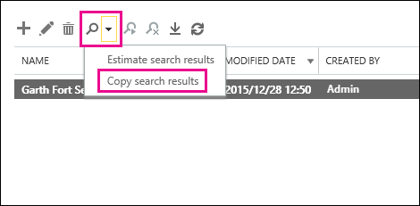
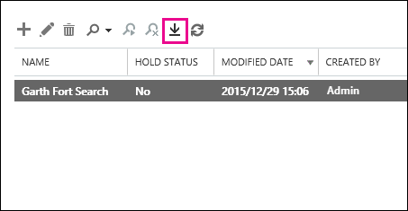
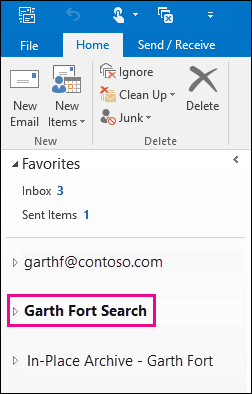

# Wiederherstellen gelöschter Elemente in einem Benutzerpostfach – Hilfe für AdministratorenRecover deleted items in a user mailbox - Admin Help

**Dieser Artikel richtet sich an Administratoren. Versuchen Sie, gelöschte Elemente in Ihrem eigenen Postfach wiederherzustellen?****This article is for administrators. Are you trying to recover deleted items in your own mailbox?** Führen Sie einen der folgenden Schritte durch: Try one of the following:
- [Wiederherstellen gelöschter Elemente in Outlook für WindowsRecover deleted items in Outlook for Windows](https://support.office.com/article/49e81f3c-c8f4-4426-a0b9-c0fd751d48ce)
- [Wiederherstellen gelöschter Elemente oder E-Mails in Outlook OnlineRecover deleted items or email in Outlook Web App](https://support.office.com/article/c3d8fc15-eeef-4f1c-81df-e27964b7edd4)
- [Wiederherstellen gelöschter e-Mail-Nachrichten in Outlook im WebRestore deleted email messages in Outlook on the web](https://support.office.com/article/a8ca78ac-4721-4066-95dd-571842e9fb11)
- [Outlook.comOutlook.com](https://go.microsoft.com/fwlink/p/?LinkID=623435)
   
Löscht ein Benutzer endgültig Elemente aus seinem Outlook-Postfach?Did a user permanently delete items from their Outlook mailbox? Der Benutzer möchte Sie zurück, kann Sie aber nicht wiederherstellen.The user wants them back but can't recover them. Möglicherweise können Sie die gelöschten Elemente wiederherstellen, wenn Sie nicht dauerhaft aus dem Postfach des Benutzers entfernt wurden.You may be able recover the purged items if they haven't been permanently removed from the user's mailbox. Hierzu verwenden Sie das in-Place-eDiscovery-Tool in Exchange Online, um nach gelöschten e-Mails und anderen Elementen wie Kontakten, Kalenderterminen und Aufgaben im Postfach eines Benutzers zu suchen.You do this by using the In-Place eDiscovery tool in Exchange Online to search for deleted email and other items—and such as contacts, calendar appointments, and tasks—in a user's mailbox. Wenn Sie die gelöschten Elemente finden, können Sie Sie in eine PST-Datei exportieren (auch als Outlook-Datendatei bezeichnet), die der Benutzer dann zum Wiederherstellen der Elemente in seinem Postfach verwenden kann.If you find the deleted items, you can export them to a PST file (also called an Outlook Data File), which the user can then use to restore the items back to their mailbox.
  
Im folgenden finden Sie die Schritte zum Wiederherstellen gelöschter Elemente im Postfach eines Benutzers.Here are the steps for recovering deleted items in a user's mailbox. Wie lange dauert es?How long will this take? Je nachdem, wie viele Elemente Sie wiederherstellen möchten, dauert es zum ersten Mal 20 oder 30 Minuten, bis alle Schritte ausgeführt wurden.The first time might take 20 or 30 minutes to complete all the steps, depending on how many items you're trying to recover.
  
> [!NOTE]
> Sie müssen ein Exchange- **Administrator** oder ein **globaler Administrator** in Office 365 oder Mitglied der Rollengruppe "Organisationsverwaltung" in Exchange Online sein, um die Schritte in diesem Artikel ausführen zu können.You have to be an **Exchange administrator** or **Global administrator** in Office 365 or be a member of the Organization Management role group in Exchange Online to perform the steps in this article. Weitere Informationen finden Sie unter [Informationen zu Office 365-Administratorrollen](https://support.office.com/article/da585eea-f576-4f55-a1e0-87090b6aaa9d).For more information, see [About Office 365 admin roles](https://support.office.com/article/da585eea-f576-4f55-a1e0-87090b6aaa9d). 
  
## Schritt 1: Zuweisen von eDiscovery-Berechtigungen für sich selbstStep 1: Assign yourself eDiscovery permissions

Der erste Schritt besteht darin, sich selbst die erforderlichen Berechtigungen in Exchange Online zuzuweisen, damit Sie das in-Place-eDiscovery-Tool verwenden können, um das Postfach eines Benutzers zu durchsuchen.The first step is to assign yourself the necessary permissions in Exchange Online so you can use the In-Place eDiscovery tool to search a user's mailbox. Sie müssen dies nur einmal tun.You only have to do this once. Wenn Sie in Zukunft ein anderes Postfach durchsuchen müssen, können Sie diesen Schritt überspringen.If you have to search another mailbox in the future, you can skip this step.
  
1. [Where to sign in to Office 365 for business](https://support.office.com/article/e9eb7d51-5430-4929-91ab-6157c5a050b4) mit Ihrem Firmen- oder Schulkonto an.[Where to sign in to Office 365 for business](https://support.office.com/article/e9eb7d51-5430-4929-91ab-6157c5a050b4) with your work or school account. 
    
2. Wählen Sie das App-  des App-Start Symbols in Office 365 aus, und klicken Sie auf **Admin**.Select the app launcher icon  in the upper-left and click **Admin**.
    
3. Erweitern Sie im linken Navigationsbereich des Office 365 Admin Center den Knoten **Admin**Center, und klicken Sie dann auf **Exchange**.In the left navigation in the Office 365 admin center, expand **Admin centers**, and then click **Exchange**.
    
    
  
4. Klicken Sie im Exchange Admin Center auf **Berechtigungen**, und klicken Sie dann auf **Administratorrollen**.In the Exchange admin center, click **Permissions**, and then click **Admin roles**.
    
5. Wählen Sie in der Listenansicht **Ermittlungsverwaltung**aus, und klicken \*\*\*\*Bearbeitungssymbol bearbeiten.In the list view, select **Discovery Management**, and then click **Edit**.
    
    
  
6. Klicken Sie in **Rollengruppe**unter **Mitglieder**auf \*\*\*\*hinzufügen.In **Role Group**, under **Members**, click **Add**.
    
7. Wählen Sie in **Elemente auswählen**aus der Liste der Namen aus, klicken Sie auf **Hinzufügen**, und klicken Sie dann auf **OK**.In **Select Members**, select yourself from the list of names, click **Add**, and then click **OK**.
    
    > [!NOTE]
    > Sie können auch eine Gruppe hinzufügen, von der Sie ein Mitglied sind, beispielsweise Organisationsverwaltung oder TenantAdmins.You can also add a group that you are a member of, such as Organization Management or TenantAdmins. Wenn Sie eine Gruppe hinzufügen, werden anderen Mitgliedern der Gruppe die erforderlichen Berechtigungen zum Ausführen des in-Place-eDiscovery-Tools zugewiesen.If you add a group, other members of the group will be assigned the necessary permissions to run the In-Place eDiscovery tool. 
  
8. Klicken Sie in **Rollengruppe**auf **Speichern**.In **Role Group**, click **Save**.
    
9. Abmelden von Office 365.Sign out of Office 365.
    
    Sie müssen sich abmelden, bevor Sie den nächsten Schritt starten, damit die neuen Berechtigungen wirksam werden.You have to sign out before you start the next step so the new permissions will take effect.
    
> [!CAUTION]
> Mitglieder der Rollengruppe "Discoveryverwaltung" können auf vertrauliche Nachrichteninhalte zugreifen.Members of the Discovery Management role group can access sensitive message content. Dazu gehört das Durchsuchen aller Postfächer in Ihrer Organisation, die Vorschau der Suchergebnisse (und andere Postfachelemente), das Kopieren der Ergebnisse in ein Discovery-Postfach und das Exportieren der Suchergebnisse in eine PST-Datei.This includes searching all mailboxes in your organization, previewing the search results (and other mailbox items), copying the results to a discovery mailbox, and exporting the search results to a PST file. 
  
[Return to topReturn to top](recover-deleted-items-in-a-mailbox.md#__top)
  
## Schritt 2: Durchsuchen des Postfachs des Benutzers nach gelöschten ElementenStep 2: Search the user's mailbox for deleted items

Wenn Sie eine in-Place-eDiscovery-Suche ausführen, wird der Ordner "Wiederherstellbare Elemente" im Postfach, den Sie durchsuchen, automatisch in die Suche eingeschlossen.When you run an In-Place eDiscovery search, the Recoverable Items folder in the mailbox that you search is automatically included in the search. Im Ordner "Wiederherstellbare Elemente" werden endgültig gelöschte Elemente gespeichert, bis Sie aus dem Postfach gelöscht werden.The Recoverable Items folder is where permanently deleted items are stored until they're purged (permanently removed) from the mailbox. Wenn ein Element also nicht bereinigt wurde, sollte es mithilfe des in-Place eDiscovery-Tools gefunden werden können.So, if an item hasn't been purged, you should be able to find it by using the In-Place eDiscovery tool.
  
1. [Where to sign in to Office 365 for business](https://support.office.com/article/e9eb7d51-5430-4929-91ab-6157c5a050b4) mit Ihrem Firmen- oder Schulkonto an.[Where to sign in to Office 365 for business](https://support.office.com/article/e9eb7d51-5430-4929-91ab-6157c5a050b4) with your work or school account. 
    
2. Wählen Sie das App-  des App-Start Symbols in Office 365 aus, und klicken Sie auf **Admin**.Select the app launcher icon  in the upper-left and click **Admin**.
    
3. Erweitern Sie im linken Navigationsbereich des Office 365 Admin Center **Administrator**, und klicken Sie dann auf **Exchange**.In the left navigation in the Office 365 admin center, expand **Admin**, and then click **Exchange**.
    
4. Klicken Sie im Exchange Admin Center auf **Compliance-Verwaltung**, klicken Sie **in- &amp; situ-eDiscovery-Aufbewahrung**, und klicken](media/8ee52980-254b-440b-99a2-18d068de62d3.gif)Sie dann auf **Neues**.
    
    
  
5. Geben Sie auf der Seite **Name und Beschreibung** einen Namen für die Suche ein (beispielsweise den Namen des Benutzers, für den Sie e-Mails wiederherstellen), eine optionale Beschreibung, und klicken Sie dann auf **weiter**.On the **Name and description** page, type a name for the search (such as the name of the user you're recovering email for), an optional description, and then click **Next**.
    
6. Klicken Sie auf der Seite **Postfächer** auf **zu durchsuchende Postfächer angeben**, und klicken](media/8ee52980-254b-440b-99a2-18d068de62d3.gif)Sie dann auf Add-Symbol **Hinzufügen**.
    
    
  
7. Suchen Sie den Namen des Benutzers, für den Sie die gelöschten e-Mails wiederherstellen, und wählen Sie ihn aus, klicken Sie auf **Hinzufügen**, und klicken Sie dann auf **OK**.Find and select the name of the user that you're recovering the deleted email for, click **Add**, and then click **OK**.
    
8. Klicken Sie auf **Weiter**.Click **Next**.
    
    Die Seite **Suchabfrage** wird angezeigt.The **Search query** page is displayed. Hier definieren Sie die Suchkriterien, die Ihnen helfen, die fehlenden Elemente im Postfach des Benutzers zu finden.This is where you define the search criteria that will help you find the missing items in user's mailbox. 
    
9. Füllen Sie auf der Seite **Suchabfrage** die folgenden Felder aus:On the **Search query** page, complete the following fields: 
    
  - **Alle Inhalte einbeziehen** Wählen Sie diese Option aus, um den gesamten Inhalt des Postfachs des Benutzers in die Suchergebnisse einzubeziehen.**Include all content** Select this option to include all content in the user's mailbox in the search results. Wenn Sie diese Option auswählen, können Sie keine weiteren Suchkriterien angeben.If you select this option, you can't specify additional search criteria. 
    
  - **Filtern basierend auf Kriterien** Wählen Sie diese Option aus, um die Suchkriterien anzugeben, einschließlich Schlüsselwörter, Start-und Enddaten, Absender-und Empfängeradressen sowie Nachrichtentypen.**Filter based on criteria** Select this option to specify the search criteria, including keywords, start and end dates, sender and recipient addresses, and message types. 
    
    
  
|**Feld****Field**|**Verwenden Sie dies, um...****Use this to...**|
|:-----|:-----|
|             |Angeben von Schlüsselwörtern, Datumsbereichen, Empfängern und Nachrichtentypen.Specify keywords, date range, recipients, and message types.    |
|             |Suchen Sie nach Nachrichten mit Schlüsselwörtern oder Phrasen, und verwenden Sie logische Operatoren wie **und** oder **oder**.Search for messages with keywords or phrases, and use logical operators such as **AND** or **OR**.    |
|             |Sucht nach Nachrichten, die in einem Datumsbereich gesendet oder empfangen wurden.Search for messages sent or received within a date range.    |
|             |Suchen Sie nach Nachrichten, die von bestimmten Personen empfangen oder gesendet wurden.Search for messages received from or sent to specific people.    |
|             |Suchen Sie nach allen Nachrichtentypen, oder wählen Sie bestimmte aus.Search for all message types or select specific ones.    |
   
    > [!TIP]
    >  Here's a few tips about how to build a search query to find missing items. Try to get as much information from the user to help you create a search query so you can find what you're looking for. >  If you not sure how to find a missing message, consider using the **Include all content** option. The search results will include all items in the user's Recoverable Items folder, including the hidden folder (called the Purges folder) that contain items that have been purged by the user. Then you can go to Step 3, copy the results to a discovery mailbox, and look at the message in the hidden folder. >  If you know approximately when the missing message was originally sent or received by the user, use the **Specify start date** and **Specify end date** options to provide a date range. This will return all messages sent or received by the user within that date range. Specifying a date range is a really good way to narrow the search results. >  If you know who sent the missing email, use the **From** box to specify this sender. >  If you want to narrow the search results to different types of mailbox items, click **Select message types**, click **Select the message types to search**, and then choose a specific message type to search for. For example, you can search only for calendar items or contacts. Here's a screenshot of the different message types you can search for; the default is to search for all message types. 
  
    Click **Next** when you've completed the **Search query** page. 
    
10. Klicken Sie auf der Seite Einstellungen für die **direkte Aufbewahrung** auf **Fertig stellen** , um die Suche zu starten.On the **In-Place Hold settings** page, click **Finish** to start the search. Zum Wiederherstellen gelöschter e-Mails gibt es keinen Grund, das Postfach des Benutzers zu halten.To recover deleted email, there's no reason to place the user's mailbox on hold. 
    
    Nachdem Sie die Suche gestartet haben, zeigt Exchange eine Schätzung der Gesamtgröße und Anzahl der Elemente an, die von der Suche basierend auf den von Ihnen angegebenen Kriterien zurückgegeben werden.After you start the search, Exchange will display an estimate of the total size and number of items that will be returned by the search based on the criteria you specified.
    
11. Wählen Sie die soeben erstellte Suche aus, \*\*\*\* Sie auf aktualisieren, um die im Detailbereich angezeigten Informationen zu aktualisieren.Select the search you just created and click **Refresh** to update the information displayed in the details pane. Der Status **Estimate succeeded** gibt an, dass die Suche abgeschlossen ist.The status of **Estimate Succeeded** indicates that the search has finished. In Exchange wird außerdem eine Schätzung der Gesamtanzahl der Elemente (und deren Größe) angezeigt, die bei der Suche basierend auf den in Schritt 9 angegebenen Suchkriterien gefunden wurden.Exchange also displays an estimate of the total number of items (and their size) found by the search based on the search criteria you specified in step 9. 
    
12. Klicken Sie im Detailbereich auf **Vorschau der Suchergebnisse** , um die gefundenen Elemente anzuzeigen.In the details pane, click **Preview search results** to view the items that were found. Dies kann Ihnen helfen, die gesuchten Elemente zu identifizieren.This might help you identify the item(s) that you're looking for. Wenn Sie feststellen, welche Elemente Sie wiederherstellen möchten, fahren Sie mit Schritt 4 fort, um die Suchergebnisse in eine PST-Datei zu exportieren.If you find the item(s) you're trying to recover, go to step 4 to export the search results to a PST file. 
    
    
  
13. Wenn Sie nicht finden, wonach Sie suchen, können Sie Ihre Suchkriterien überarbeiten, indem Sie die Suche auswählen, \*\*\*\*bearbeiten und dann auf **Suchabfrage**klicken.If you don't find what you're looking for, you can revise your search criteria by selecting the search, clicking **Edit**, and then clicking **Search query**. Ändern Sie die Suchkriterien, und führen Sie die Suche erneut aus.Change the search criteria and then rerun the search.
    
[Return to topReturn to top](recover-deleted-items-in-a-mailbox.md#__top)
  
## Optional Schritt 3: Kopieren der Suchergebnisse in ein Discovery-Postfach(Optional) Step 3: Copy the search results to a discovery mailbox

Wenn Sie keine Elemente finden können, indem Sie eine Vorschau der Suchergebnisse anzeigen, oder wenn Sie sehen möchten, welche Elemente im Ordner "Wiederherstellbare Elemente" des Benutzers vorhanden sind, können Sie die Suchergebnisse in ein spezielles Postfach (als Discovery-Postfach bezeichnet) kopieren und dieses Postfach dann in Outlook im Web t öffnen. o zeigen Sie die tatsächlichen Elemente an.If you can't find an items by previewing the search results or if you want to see which items are in the user's Recoverable Items folder, then you can copy the search results to a special mailbox (called a discovery mailbox) and then open that mailbox in Outlook on the web to view the actual items. Der beste Grund zum Kopieren der Suchergebnisse ist, dass Sie die Elemente im Ordner "Wiederherstellbare Elemente" des Benutzers anzeigen können.The best reason to copy the search results is so you can view the items in the user's Recoverable Items folder. Wahrscheinlich befindet sich das Element, das Sie wiederherstellen möchten, im Unterordner purges.More than likely, the item you're trying to recover is located in the Purges subfolder. 
  
1. Wechseln Sie im Exchange Admin Center zu **Compliance Management** \> **in-situ-eDiscovery &amp; -** Speicher.In the Exchange admin center, go to **Compliance management** \> **In-Place eDiscovery &amp; Hold**.
    
2. Wählen Sie in der Liste der Suchvorgänge die Suche aus, die Sie in Schritt 2 erstellt haben.In the list of searches, select the search that you created in Step 2.
    
3. Klicken Sie auf](media/c94e8591-7044-4650-a0d1-c57c0633ab4f.png)Such Suche, und klicken Sie dann in der Dropdownliste auf **Suchergebnisse kopieren** . \*\*\*\*, and then click **Copy search results** from the drop-down list. 
    
    
  
4. Klicken Sie auf der Seite **Suchergebnisse kopieren** auf **Durchsuchen**.On the **Copy Search Results** page, click **Browse**.
    
    
  
5. Klicken Sie unter **Anzeige Name**auf **Discovery-Such Postfach**, und klicken Sie dann auf **OK**.Under **Display Name**, click **Discovery Search Mailbox**, and then click **OK**.
    
    
  
    > [!NOTE]
    > Das Discovery-Such Postfach ist ein Standardmäßiges Ermittlungspostfach, das automatisch in Ihrer Office 365-Organisation erstellt wird.The Discovery Search Mailbox is a default discovery mailbox that is automatically created in your Office 365 organization. 
  
6. Klicken Sie auf der Seite **Suchergebnisse kopieren** auf **Kopieren** , um den Prozess zum Kopieren der Suchergebnisse in das Such Postfach für die Suche zu starten.Back on the **Copy Search Results** page, click **Copy** to start the process to copy the search results to the Discovery Search Mailbox. 
    
    
  
7. Klicken Sie auf](media/165fb3ad-38a8-4dd9-9e76-296aefd96334.png) aktualisieren, um die Informationen über den Kopierstatus zu aktualisieren, die im Detailbereich angezeigt werden. \*\*\*\* to update the information about the copying status that is displayed in the details pane. 
    
8. Klicken Sie nach Abschluss des Kopiervorgangs auf **Öffnen** , um das Such Postfach für die Suche zu öffnen, um die Suchergebnisse anzuzeigen.When the copying is complete, click **Open** to open the Discovery Search Mailbox to view the search results. 
    
    
  
    Die Suchergebnisse, die in das Such Postfach der Suche kopiert werden, werden in einem Ordner mit demselben Namen wie die in-Place-eDiscovery-Suche abgelegt.The search results copied to the Discovery Search Mailbox are placed in a folder that has the same name as the In-Place eDiscovery search. Sie können auf einen Ordner klicken, um die Elemente in diesem Ordner anzuzeigen.You can click a folder to display the items in that folder.
    
    
  
    Wenn Sie eine Suche ausführen, wird auch der Ordner "Wiederherstellbare Elemente" des Benutzers durchsucht.When you run a search, the user's Recoverable Items folder is also searched. Das ist der Fall, wenn Elemente im Ordner "Wiederherstellbare Elemente" die Suchkriterien erfüllen, Sie in den Suchergebnissen enthalten sind.That means if items in the Recoverable Items folder meet the search criteria, they are included in the search results. Elemente im Ordner "Löschungen" sind Elemente, die der Benutzer dauerhaft gelöscht hat (durch Löschen eines Elements aus dem Ordner "Gelöschte Elemente" oder durch auswählen und drücken von **UMSCHALT + ENTF**.Items in the Deletions folder are items that the user permanently deleted (by deleting an item from the Deleted Items folder or by selecting it and pressing **Shift+Delete**. Ein Benutzer kann das Tool gelöschte Elemente wiederherstellen in Outlook oder Outlook im Web verwenden, um Elemente im Lösch Ordner wiederherzustellen.A user can use the Recover Deleted Items tool in Outlook or Outlook on the web to recover items in the Deletions folder. Elemente im Ordner "purges" sind Elemente, die der Benutzer mithilfe des Tools "Gelöschte Elemente wiederherstellen" gelöscht hat, oder Elemente, die Sie automatisch durch eine auf das Postfach angewendete Richtlinie gelöscht haben.Items in the Purges folder are items that the user purged by using the Recover Deleted Items tool or items they were automatically purged by a policy applied to the mailbox. In beiden Fällen kann nur ein Administrator Elemente im Ordner "Purge" wiederherstellen.In either case, only an admin can recover items in the Purges folder. 
    
    > [!TIP]
    > Wenn ein Benutzer ein gelöschtes Element nicht mithilfe des Tools "Wiederherstellbare Elemente" finden kann, aber dieses Element ist noch wiederherstellbar (was bedeutet, dass es nicht dauerhaft aus dem Postfach entfernt wurde), befindet es sich mehr als wahrscheinlich im Ordner "purges".If a user can't find a deleted item using the Recoverable Items tool, but that item is still recoverable (meaning that it hasn't been permanently removed from the mailbox), it's more than likely located in the Purges folder. Achten Sie also darauf, im Ordner purges nach dem gelöschten Element zu suchen, das Sie für einen Benutzer wiederherstellen möchten.So, be sure to look in the Purges folder for the deleted item you're trying to recover for a user. 
  
[Return to topReturn to top](recover-deleted-items-in-a-mailbox.md#__top)
  
## Schritt 4: Exportieren der Suchergebnisse in eine PST-DateiStep 4: Export the search results to a PST file

Nachdem Sie das Element gefunden haben, das Sie für einen Benutzer wiederherstellen möchten, müssen Sie im nächsten Schritt die Ergebnisse aus der in Schritt 2 ausgeführten Suche in eine PST-Datei exportieren.After you find the item you're trying to recover for a user, the next step is to export the results from the search you ran in Step 2 to a PST file. Der Benutzer verwendet diese PST-Datei im nächsten Schritt, um das gelöschte Element in seinem Postfach wiederherzustellen.The user will use this PST file in the next step to restore the deleted item to their mailbox.
  
1. Wechseln Sie im Exchange Admin Center zu **Compliance Management** \> **in-situ-eDiscovery &amp; -** Speicher.In the Exchange admin center, go to **Compliance management** \> **In-Place eDiscovery &amp; Hold**.
    
2. Wählen Sie in der Liste der Suchvorgänge die Suche aus, die Sie in Schritt 2 erstellt haben.In the list of searches, select the search that you created in Step 2.
    
3. Klicken Sie auf **in eine PST-Datei exportieren**.Click **Export to a PST file**.
    
    
  
4. Wenn Sie aufgefordert werden, das eDiscovery-Export Tool zu installieren, klicken Sie auf **Ausführen**.If you're prompted to install the eDiscovery Export Tool, click **Run**.
    
5. Klicken Sie im eDiscovery-PST-Export Tool auf **Durchsuchen** , um den Speicherort für die PST-Datei anzugeben.In the eDiscovery PST Export Tool, click **Browse** to specify the location where you want to download the PST file. 
    
    
  
    Sie können die Optionen zum Aktivieren der Deduplizierung ignorieren und nicht durchsuchbare Elemente einbeziehen.You can ignore the options to enable deduplication and include unsearchable items.
    
6. Klicken Sie auf **starten** , um die PST-Datei auf Ihren Computer herunterzuladen.Click **Start** to download the PST file to your computer. 
    
    Das **eDiscovery-PST-Export Tool** zeigt Statusinformationen zum Exportvorgang an.The **eDiscovery PST Export Tool** displays status information about the export process. Nach Abschluss des Exports können Sie auf die Datei an dem Speicherort zugreifen, an dem Sie heruntergeladen wurde.When the export is complete, you can access the file in the location where it was downloaded. 
    
[Return to topReturn to top](recover-deleted-items-in-a-mailbox.md#__top)
  
## Schritt 5: Wiederherstellen der wiederhergestellten Elemente im Postfach des BenutzersStep 5: Restore the recovered items to the user's mailbox

Im letzten Schritt wird die in Schritt 4 exportierte PST-Datei verwendet, um die wiederhergestellten Elemente im Postfach des Benutzers wiederherzustellen.The final step is to use the PST file that was exported in step 4 to restore the recovered items to the user's mailbox. Nachdem Sie die PST-Datei an den Benutzer gesendet haben, wird im weiteren Verlauf dieses Schritts der Benutzer zum Öffnen der PST-Datei und zum Verschieben der wiederhergestellten Elemente in einen anderen Ordner in Ihrem Postfach ausgeführt.After you send the PST file to the user, the remainder of this step is performed by the user to open the PST file and then move the recovered items to another folder in their mailbox. Schrittweise Anweisungen können Sie dem Benutzer auch einen Link zu diesem Thema senden: [Öffnen und Schließen von Outlook-Datendateien (PST)](https://support.office.com/article/381b776d-7511-45a0-953a-0935c79d24f2).For step-by-step instructions, you can also send the user a link to this topic: [Open and close Outlook Data Files (.pst)](https://support.office.com/article/381b776d-7511-45a0-953a-0935c79d24f2). Oder Sie können dem Benutzer einen Link zum Abschnitt [Wiederherstellen gelöschter Elemente in ein Postfach mithilfe einer PST-Datei](recover-deleted-items-in-a-mailbox.md#restoredeleteditems) weiter unten senden und Sie bitten, diese Schritte auszuführen.Or you can send the user a link to the [Restore deleted items to a mailbox using a PST file](recover-deleted-items-in-a-mailbox.md#restoredeleteditems) section below and ask them to perform these steps. 
  
 **Senden der PST-Datei an den Benutzer****Send the PST file to the user**
  
Der letzte Schritt, den Sie ausführen müssen, ist das Senden der PST-Datei, die in Schritt 4 für den Benutzer exportiert wurde.The final step that you need to perform is sending the PST file that was exported in step 4 to the user. Hierzu gibt es verschiedene Möglichkeiten:There are a few ways to do this:
  
- Fügen Sie die PST-Datei an eine e-Mail-Nachricht an.Attach the PST file to an email message. Wenn Outlook so konfiguriert ist, dass PST-Dateien blockiert werden, müssen Sie die Datei komprimieren und dann an die Nachricht anfügen.If Outlook is configured to block PST files, then you will have to zip the file and then attach it to the message. Dazu gehen Sie so vor:Here's how:
    
1. Navigieren Sie in Windows Explorer oder im Datei-Explorer zur PST-Datei.In Windows Explorer or File Explorer, browse to the PST file.
    
2. Klicken Sie mit der rechten Maustaste auf die Datei, und wählen Sie dann **in** \> **komprimierten Ordner (gezippt)** senden aus.Right-click the file, and then select **Send to** \> **Compressed (zipped) folder**. Windows erstellt eine neue ZIP-Datei und gibt ihr einen identischen Namen wie die PST-Datei.Windows creates a new zip file and gives it an identical name as the PST file.
    
3. Fügen Sie die komprimierte PST-Datei an eine e-Mail-Nachricht an, und senden Sie Sie an den Benutzer, der dann die Datei dekomprimieren kann, indem Sie darauf klickt.Attach the compressed PST file to an email message and send it to the user, who can then decompress the file just by clicking it.
    
- Kopieren Sie die PST-Datei in einen freigegebenen Ordner, auf den der Benutzer zugreifen und diesen abrufen kann.Copy the PST file to a shared folder that the user can access and retrieve it.
    
Die Schritte im nächsten Abschnitt werden vom Benutzer ausgeführt, um die gelöschten Elemente in Ihrem Postfach wiederherzustellen.The steps in the next section are performed by the user to restore the deleted items to their mailbox.
  
 **Wiederherstellen gelöschter Elemente in einem Postfach mithilfe einer PST-Datei****Restore deleted items to a mailbox using a PST file**
  
Sie müssen die Outlook-Desktop-App verwenden, um ein gelöschtes Element mithilfe einer PST-Datei wiederherzustellen.You have to use the Outlook desktop app to restore a deleted item by using a PST file. Sie können Outlook Web App oder Outlook im Web nicht verwenden, um eine PST-Datei zu öffnen.You can't use Outlook Web App or Outlook on the web to open a PST file.
  
1. Klicken Sie in Outlook 2013 oder Outlook 2016 auf die Registerkarte **Datei** .In Outlook 2013 or Outlook 2016, click the **File** tab. 
    
2. Klicken Sie auf \*\*Export öffnen &amp; \*\*, und klicken Sie dann auf **Outlook-Datendatei öffnen**.Click **Open &amp; Export**, and then click **Open Outlook Data File**.
    
3. Navigieren Sie zu dem Speicherort, an dem Sie die PST-Datei gespeichert haben, die Ihr Administrator gesendet hat.Browse to the location where you saved the PST file that your administrator sent.
    
4. Wählen Sie die PST-Datei aus, und klicken Sie dann auf **Öffnen**.Select the PST and then click **Open**.
    
    Die PST-Datei wird in der linken Navigationsleiste in Outlook angezeigt.The PST file appears in the left-nav bar in Outlook.
    
    
  
5. Klicken Sie auf die Pfeile, um die PST-Datei und die darunter liegenden Ordner zu erweitern, um das Element zu suchen, das Sie wiederherstellen möchten.Click the arrows to expand the PST file and the folders under it to locate the item you want to recover.
    
    
  
    > [!TIP]
    > Suchen Sie im Ordner purges nach dem Element, das Sie wiederherstellen möchten.Look in the Purges folder for the item you want to recover. Dies ist ein ausgeblendeter Ordner, in den gelöschte Elemente verschoben werden.This is a hidden folder that purged items are moved to. Wahrscheinlich ist das Element, das Ihr Administrator wiederhergestellt hat, in diesem Ordner.It's likely the item that your administrator recovered is in this folder. 
  
6. Klicken Sie mit der rechten Maustaste auf das Element, das Sie wiederherstellen möchten, und klicken Sie dann auf **anderen Ordner** **verschieben** \> .Right-click the item you want to recover and then click **Move** \> **Other Folder**.
    
    
  
7. Klicken Sie auf **Posteingang**, und klicken Sie dann auf **OK**, um das Element in Ihren Posteingang zu verschieben.To move the item to your inbox, click **Inbox**, and then click **OK**.
    
    **Tipp:** Führen Sie eine der folgenden Aktionen aus, um andere Elementtypen wiederherzustellen:**Tip:** To recover other types of items, do one of the following: 
    
  - Klicken Sie zum Wiederherstellen eines Kalenderelements mit der rechten Maustaste darauf, und klicken Sie dann auf **anderen Ordner** \> **Kalender** **verschieben** \> .To recover a calendar item, right-click it, and then click **Move** \> **Other Folder** \> **Calendar**.
    
  - Klicken Sie zum Wiederherstellen eines Kontakts mit der rechten Maustaste darauf, und klicken Sie dann auf **andere Ordner** \> **Kontakte** **verschieben** \> .To recover a contact, right-click it, and then click **Move** \> **Other Folder** \> **Contacts**.
    
  - Klicken Sie zum Wiederherstellen einer Aufgabe mit der rechten Maustaste darauf, und klicken Sie dann auf **andere Ordner** \> **Aufgaben** **verschieben** \> .To recover a task, right-click it, and then click **Move** \> **Other Folder** \> **Tasks**.
    

  
    Note that calendar items, contacts, and tasks are located directly in the Purges folder, and not in a Calendar, Contacts, or Tasks subfolder. However, you can sort by **Type** to group similar types of items. 
    
8. Wenn Sie die Wiederherstellung gelöschter Elemente abgeschlossen haben, klicken Sie in der linken Navigationsleiste mit der rechten Maustaste auf die PST-Datei, und wählen Sie **"Namen der PST-Datei"** aus.When you're finished recovering deleted items, right-click the PST file in the left-nav bar and select **Close "name of PST file"**.
    
[Return to topReturn to top](recover-deleted-items-in-a-mailbox.md#__top)
  
## Weitere InformationenMore information

- Möglicherweise kann ein Benutzer ein dauerhaft gelöschtes Element wiederherstellen, wenn der Aufbewahrungszeitraum für gelöschte Elemente für das Element nicht abgelaufen ist.It might be possible for a user to recover a permanently deleted item if the deleted item retention period for the item hasn't expired. Als Administrator haben Sie möglicherweise angegeben, wie lange Elemente im Ordner "Wiederherstellbare Elemente" für die Recovery zur Verfügung stehen.As an admin you may have specified how long items in the Recoverable Items folder are available for recovery. Es kann beispielsweise eine Richtlinie geben, mit der alle Elemente im Ordner "Gelöschte Elemente" eines Benutzers 30 Tage lang gelöscht werden, und eine andere Richtlinie, mit deren Hilfe Benutzer im Ordner "Wiederherstellbare Elemente" bis zu 14 Tage wiederhergestellt werden können.For example, there might be a policy that deletes anything that's been in a user's Deleted Items folder for 30 days, and another policy that lets users recover items in the Recoverable Items folder for up to another 14 days. Nach Ablauf dieser 14 Tage können Sie jedoch mithilfe der Verfahren in diesem Thema möglicherweise ein Element im Postfach eines Benutzers wiederherstellen.However, after this 14 days, you may still be able to recover an item in a user's mailbox by using the procedures in this topic.
    
- Benutzer können ein gelöschtes Element wiederherstellen, wenn es nicht gelöscht wurde und wenn die Aufbewahrungsdauer für das gelöschte Element nicht abgelaufen ist.Users can recover a deleted item if it hasn't been purged and if the deleted item retention period for that item hasn't expired. Damit Benutzer gelöschte Elemente im Postfach wiederherstellen können, verweisen Sie auf eines der folgenden Themen:To help users recover deleted items in their mailbox, point them to one of the following topics:
    
  - [Wiederherstellen gelöschter Elemente in Outlook für WindowsRecover deleted items in Outlook for Windows](https://support.office.com/article/49e81f3c-c8f4-4426-a0b9-c0fd751d48ce)
    
  - [Wiederherstellen gelöschter Elemente in Outlook 2010Recover deleted items in Outlook 2010](https://support.office.com/article/cd9dfe12-8e8c-4a21-bbbf-4bd103a3f1fe)
    
  - [Wiederherstellen gelöschter Elemente oder E-Mails in Outlook OnlineRecover deleted items or email in Outlook Web App](https://support.office.com/article/c3d8fc15-eeef-4f1c-81df-e27964b7edd4)
    
  - [Wiederherstellen gelöschter e-Mail-Nachrichten in Outlook im WebRestore deleted email messages in Outlook on the web](https://support.office.com/article/a8ca78ac-4721-4066-95dd-571842e9fb11)
    
  - [Wiederherstellen eines gelöschten Kontakts in OutlookRecover a deleted contact in Outlook](https://support.office.com/article/51c83288-6888-4dcd-8c99-4932daabf643)
    
  - [Wiederherstellen gelöschter e-Mail-Nachrichten in Outlook.comRestore deleted email messages in Outlook.com](https://go.microsoft.com/fwlink/p/?LinkID=623435)
    
[Nach obenReturn to top](recover-deleted-items-in-a-mailbox.md#__top)
  

