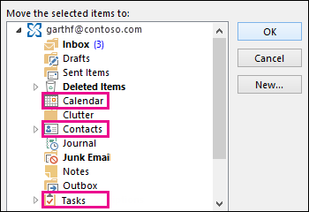

# Wiederherstellen gelöschter Elemente in einem Benutzerpostfach - Admin-Hilfe

**Ist in diesem Artikel für Administratoren. Versuchen Sie zum Wiederherstellen von gelöschten Elemente in Ihrem Postfach?** Führen Sie eine der folgenden:
- [Wiederherstellen gelöschter Elemente in Outlook für Windows](https://support.office.com/article/49e81f3c-c8f4-4426-a0b9-c0fd751d48ce)
- [Wiederherstellen gelöschter Elemente oder E-Mails in Outlook Online](https://support.office.com/article/c3d8fc15-eeef-4f1c-81df-e27964b7edd4)
- [Wiederherstellen gelöschter e-Mail-Nachrichten in Outlook im Web](https://support.office.com/article/a8ca78ac-4721-4066-95dd-571842e9fb11)
- [Outlook.com](https://go.microsoft.com/fwlink/p/?LinkID=623435)
   
Entfernen ein Benutzer Elemente dauerhaft aus ihrem Outlook-Postfach? Der Benutzer sie wieder möchte jedoch nicht wiederherstellen. Möglicherweise können die gelöschten Elemente wiederherstellen, wenn sie dauerhaft aus dem Postfach des Benutzers entfernt wurde noch nicht. Dazu verwenden das Compliance-eDiscovery-Tool in Exchange Online zum Suchen nach gelöschten e-Mail und anderen Elementen – und wie Kontakte, Termine im Kalender und Aufgaben – im Postfach eines Benutzers. Wenn Sie die gelöschten Elemente finden, können Sie diese in eine PST-Datei (auch als Outlook-Datendatei bezeichnet), exportieren die der Benutzer dann verwenden können, die Elemente an ihr Postfach wiederherstellen.
  
Hier werden die Schritte zum Wiederherstellen von gelöschten Objekten im Postfach des Benutzers. Wie lange dauert dies? Beim ersten möglicherweise 20 oder 30 Minuten dauern alle, die Schritte aus, je nachdem, wie viele Elemente wiederherstellen möchten.
  
> [!NOTE]
> Sie müssen ein **Exchange-Administrator** oder ein **globaler Administrator** in Office 365 oder ein Mitglied der Rollengruppe "Organisationsverwaltung" im Exchange Online zum Ausführen der Schritte in diesem Artikel. Weitere Informationen finden Sie unter [Informationen zu Office 365-Administratorrollen](https://support.office.com/article/da585eea-f576-4f55-a1e0-87090b6aaa9d). 
  
## Schritt 1: Erteilen Sie sich selbst eDiscovery-Berechtigungen

Der erste Schritt besteht darin selbst die erforderlichen Berechtigungen in Exchange Online zuweisen, damit Sie das Compliance-eDiscovery-Tool verwenden können, um dem Postfach eines Benutzers zu suchen. Sie müssen nur einmal erforderlich. Wenn Sie ein anderes Postfach in der Zukunft zu suchen müssen, können Sie diesen Schritt überspringen.
  
1. [Where zur Anmeldung bei Office 365 für Unternehmen](https://support.office.com/article/e9eb7d51-5430-4929-91ab-6157c5a050b4) mit Ihrem Konto arbeiten oder Schule. 
    
2. Wählen Sie das Symbol der app-Start  in der linken oberen und klicken Sie auf **Administrator**.
    
3. Im linken Navigationsbereich in Office 365 Administrationscenter erweitern Sie **Admin centers**, und klicken Sie dann auf **Exchange**.
    
    
  
4. Klicken Sie in der Exchange-Verwaltungskonsole auf **Berechtigungen**, und klicken Sie dann auf **Administratorrollen**.
    
5. In der Listenansicht **Discoveryverwaltung**wählen Sie aus, und klicken Sie dann auf **Bearbeiten**.
    
    
  
6. Klicken Sie in der **Rollengruppe**, klicken Sie unter **Mitglieder**auf **Hinzufügen**.
    
7. Wählen Sie in **Elemente auswählen**selbst aus der Liste der Namen, klicken Sie auf **Hinzufügen**, und klicken Sie dann auf **OK**.
    
    > [!NOTE]
    > Sie können auch eine Gruppe hinzufügen, dass Sie Mitglied der, wie Organisationsverwaltung oder TenantAdmins sind. Wenn Sie eine Gruppe hinzufügen, werden anderen Mitglieder der Gruppe die erforderlichen Berechtigungen zum Ausführen des In-Place eDiscovery-Tools zugewiesen werden. 
  
8. Klicken Sie in **Rollengruppe** auf **Speichern**.
    
9. Melden Sie bei Office 365 ab.
    
    Sie müssen sich abmelden, bevor Sie im nächsten Schritt starten, damit die neuen Berechtigungen wirksam werden.
    
> [!CAUTION]
> Mitglieder der Rollengruppe "Discoveryverwaltung" können vertrauliche Nachrichteninhalt zugreifen. Dazu gehören alle Postfächer in Ihrer Organisation suchen, Anzeigen einer Vorschau der Suchergebnisse (und anderen Postfachelemente), die Ergebnisse in ein discoverypostfach kopieren und die Suchergebnisse in eine PST-Datei exportieren. 
  
[Zurück zum Seitenanfang](recover-deleted-items-in-a-mailbox.md#__top)
  
## Schritt 2: Suchen Sie das Postfach des Benutzers für gelöschte Elemente

Beim Ausführen einer Compliance-eDiscovery-Suche ist "wiederherstellbare Elemente" im Postfach, das gesucht werden automatisch in die Suche enthalten. Ordner "wiederherstellbare Elemente" werden endgültig gelöschte Elemente gespeichert, bis sie gelöscht sind (dauerhaft entfernt) aus dem Postfach. So, wenn ein Element noch nicht gelöscht wurden, sollten Sie mithilfe des In-Place eDiscovery Tools finden können.
  
1. [Where zur Anmeldung bei Office 365 für Unternehmen](https://support.office.com/article/e9eb7d51-5430-4929-91ab-6157c5a050b4) mit Ihrem Konto arbeiten oder Schule. 
    
2. Wählen Sie das Symbol der app-Start  in der linken oberen und klicken Sie auf **Administrator**.
    
3. Klicken Sie im linken Navigationsbereich in Office 365 Administrationscenter erweitern Sie **Admin**, und klicken Sie dann auf **Exchange**.
    
4. Klicken Sie in der Exchange-Verwaltungskonsole, klicken Sie auf **Verwaltung der Richtlinientreue** **Compliance-eDiscovery &amp; halten**, und klicken Sie dann auf **New**.
    
    
  
5. Geben Sie auf der Seite **Name und Beschreibung** einen Namen für die Suche (beispielsweise den Namen des Benutzers, die Sie bei der Wiederherstellung von e-Mail), optional eine Beschreibung, und klicken Sie dann auf **Weiter**.
    
6. Klicken Sie auf der Seite **Postfächer** , klicken Sie auf **Geben Sie Postfächer zu suchen**, und klicken Sie dann auf **Hinzufügen**.
    
    
  
7. Suchen Sie und wählen Sie den Namen des Benutzers, die Sie für die gelöschte e-Mail wiederherstellen möchten, klicken Sie auf **Hinzufügen**und klicken Sie dann auf **OK**.
    
8. Klicken Sie auf **Weiter**.
    
    Die Seite **Suchabfrage** wird angezeigt. Dies ist, in dem Sie die Suchkriterien definieren, mit denen Sie die fehlenden Elemente im Postfach des Benutzers zu finden. 
    
9. Füllen Sie auf der Seite **Suchabfrage** die folgenden Felder aus: 
    
  - **Schließen Sie alle Inhalte** Wählen Sie diese Option, um alle Inhalte im Postfach des Benutzers in den Suchergebnissen enthalten. Wenn Sie diese Option auswählen, können nicht Sie zusätzliche Suchkriterien angeben. 
    
  - **Filter basierend auf Kriterien** Wählen Sie diese Option, um anzugeben, dass die Suchkriterien, einschließlich Schlüsselwörter, starten und beenden Sie Datumsangaben, Absender und Empfängeradressen und Nachrichtentypen aus. 
    
    
  
|**Feld**|**Verwenden Sie diese Option, um...**|
|:-----|:-----|
|             |Geben Sie Schlüsselwörter, Datumsbereich, Empfänger und Nachrichtentypen.    |
|             |Nachrichten mit Schlüsselwörtern oder Ausdrücken suchen und Verwenden von logischen Operatoren wie **AND** oder **OR**.    |
|             |Suchen Sie nach Nachrichten, die innerhalb eines Datumsbereichs gesendet oder empfangen.    |
|             |Suchen Sie nach Nachrichten, die an bestimmte Personen gesendet oder empfangen aus.    |
|             |Für alle Nachrichtentypen suchen Sie, oder wählen Sie das Domänenkennwort.    |
   
    > [!TIP]
    >  Here's a few tips about how to build a search query to find missing items. Try to get as much information from the user to help you create a search query so you can find what you're looking for. >  If you not sure how to find a missing message, consider using the **Include all content** option. The search results will include all items in the user's Recoverable Items folder, including the hidden folder (called the Purges folder) that contain items that have been purged by the user. Then you can go to Step 3, copy the results to a discovery mailbox, and look at the message in the hidden folder. >  If you know approximately when the missing message was originally sent or received by the user, use the **Specify start date** and **Specify end date** options to provide a date range. This will return all messages sent or received by the user within that date range. Specifying a date range is a really good way to narrow the search results. >  If you know who sent the missing email, use the **From** box to specify this sender. >  If you want to narrow the search results to different types of mailbox items, click **Select message types**, click **Select the message types to search**, and then choose a specific message type to search for. For example, you can search only for calendar items or contacts. Here's a screenshot of the different message types you can search for; the default is to search for all message types. 
  
    Click **Next** when you've completed the **Search query** page. 
    
10. Klicken Sie auf der Seite **Einstellungen für die Compliance-Archiv** auf **Fertig stellen** , um die Suche zu starten. Zum Wiederherstellen von gelöschten e-Mail, gibt es keinen Grund das Postfach des Benutzers in der Warteschleife platziert. 
    
    Nachdem Sie die Suche starten, werden Exchange eine Schätzung der Gesamtgröße sowie die Anzahl der Elemente, die zurückgegeben werden, indem die Suche anhand der angegebenen Kriterien angezeigt.
    
11. Wählen Sie die Suche, die Sie gerade erstellt haben, und klicken Sie auf **Aktualisieren** zum Aktualisieren der Informationen im Detailbereich angezeigt. Der Status der **Schätzung erfolgreich** gibt an, dass die Suche abgeschlossen wurde. Exchange zeigt auch eine Schätzung der Gesamtzahl der Elemente (und ihre Größe) bei der Suche basierend auf den in Schritt 9 angegebenen Suchkriterien gefunden. 
    
12. Klicken Sie im Detailbereich auf **Vorschau der Suchergebnisse** , um die Elemente anzuzeigen, die gefunden wurden. Dadurch können Sie die Elemente zu identifizieren, die Sie benötigen. Wenn Sie die Elemente, die Sie wiederherstellen möchten finden, gehen Sie zu Schritt 4, um die Suchergebnisse in eine PST-Datei zu exportieren. 
    
    
  
13. Wenn Sie nicht finden, wonach Sie suchen, Sie können überarbeiten Suchkriterien, indem Sie die Suche auswählen auf **Bearbeiten**klicken, und klicken Sie dann auf **die Suchabfrage**. Ändern Sie die Suchkriterien ein, und führen Sie die Suche erneut aus.
    
[Zurück zum Seitenanfang](recover-deleted-items-in-a-mailbox.md#__top)
  
## (Optional) Schritt 3: Kopieren Sie die Suchergebnisse in ein discoverypostfach.

Wenn Sie ein Elemente nicht finden können, indem Sie eine Vorschau der Suchergebnisse oder angezeigt, welche Elemente in den Ordner des Benutzers wiederherstellbare Elemente werden sollen, können klicken Sie dann Sie copy die Suchergebnisse an eine bestimmte Mailbox (ein discoverypostfach genannt) und öffnen Sie das Postfach in Outlook im Web t o die tatsächliche Elemente anzeigen. Der bewährte Grund, kopieren Sie die Suchergebnisse ist, sodass die Elemente in den Ordner des Benutzers wiederherstellbare Elemente angezeigt werden können. Das Element, das Sie wiederherstellen möchten befindet sich mehr als wahrscheinlich im Unterordner "bereinigt". 
  
1. Navigieren Sie in der Exchange-Verwaltungskonsole zu **Verwaltung der Richtlinientreue** \> **Compliance-eDiscovery &amp; halten**.
    
2. Wählen Sie in der Liste der Suchvorgänge die Suche, die Sie in Schritt2 erstellt haben.
    
3. Klicken Sie auf **Suche**, und klicken Sie dann auf **Kopieren der Suchergebnisse** aus der Dropdown-Liste. 
    
    
  
4. Klicken Sie auf der Seite **Suchergebnisse kopieren** auf **Durchsuchen**.
    
    
  
5. Klicken Sie unter **Anzeigename den Namen**auf **Discoverysuchpostfach**, und klicken Sie dann auf **OK**.
    
    
  
    > [!NOTE]
    > Die Discoverysuchpostfach ist eine standarddiscoverypostfach, die in Office 365-Organisation automatisch erstellt wird. 
  
6. Wieder auf der Seite **Suchergebnisse kopieren** klicken Sie auf **Kopieren** , um den Vorgang, um die Suchergebnisse in die Discoverysuchpostfach kopieren zu starten. 
    
    
  
7. Klicken Sie auf **Aktualisieren** , die Informationen zu den kopieren Status aktualisieren, die im Detailbereich angezeigt wird. 
    
8. Wenn der Kopiervorgang abgeschlossen ist, klicken Sie auf **Öffnen** , um dem Discoverysuchpostfach zum Anzeigen der Suchergebnisse zu öffnen. 
    
    
  
    Die Suchergebnisse in die Discoverysuchpostfach kopiert befinden sich in einem Ordner, die den gleichen Namen wie die Compliance-eDiscovery-Suche hat. Sie können einen Ordner, um die Elemente in diesem Ordner anzeigen klicken.
    
    
  
    Wenn Sie eine Suche ausführen, wird der Ordner wiederherstellbare Elemente des Benutzers auch durchsucht. Das bedeutet, dass sie Elemente im Ordner "wiederherstellbare Elemente" nicht die Suchkriterien erfüllen, in den Suchergebnissen enthalten sind. Elemente im Ordner Gelöschte werden Elemente, die der Benutzer endgültig (durch Löschen eines Elements aus dem Ordner Gelöschte Objekte oder durch auswählen und drücken **UMSCHALT + ENTF**. gelöscht Ein Benutzer kann das Tool gelöschte Elemente wiederherstellen in Outlook oder Outlook im Web verwenden, im Ordner Gelöschte Elemente wiederherstellen. Elemente im Ordner Benutzerkontenverwaltung sind Elemente, die der Benutzer mithilfe des Tools Wiederherstellen gelöschter Elemente gelöscht oder Elemente, die sie durch eine Richtlinie auf das Postfach angewendeten automatisch gelöscht wurden. In beiden Fällen kann nur ein Administrator Elemente im Ordner Benutzerkontenverwaltung wiederherstellen. 
    
    > [!TIP]
    > Wenn ein Benutzer ein gelöschtes Element mit dem Tool wiederherstellbare Elemente kann nicht gefunden werden, aber dieses Element ist noch wiederhergestellt (d. h., dass es nicht dauerhaft aus dem Postfach entfernt wurde), es höchstwahrscheinlich in den Ordner Benutzerkontenverwaltung befindet. Daher müssen Sie den Benutzerkontenverwaltung Ordner für gelöschte Elemente anzuzeigen, die Sie für einen Benutzer wiederherstellen möchten. 
  
[Zurück zum Seitenanfang](recover-deleted-items-in-a-mailbox.md#__top)
  
## Schritt 4: Exportieren der Suchergebnisse in eine PST-Datei

Nachdem Sie das Element, das Sie für einen Benutzer wiederherstellen möchten finden, besteht der nächste Schritt die Ergebnisse von der Suche, den Sie in Schritt2 ausgeführt, in eine PST-Datei haben zu exportieren. Der Benutzer wird in PST-Datei im nächsten Schritt verwenden, um das gelöschte Element mit ihrem Postfach wiederherzustellen.
  
1. Navigieren Sie in der Exchange-Verwaltungskonsole zu **Verwaltung der Richtlinientreue** \> **Compliance-eDiscovery &amp; halten**.
    
2. Wählen Sie in der Liste der Suchvorgänge die Suche, die Sie in Schritt2 erstellt haben.
    
3. Klicken Sie auf **Exportieren in eine PST-Datei**.
    
    
  
4. Wenn Sie aufgefordert werden, die eDiscovery-Exporttool installieren, klicken Sie auf **Ausführen**.
    
5. Klicken Sie in der eDiscovery-PST-Exporttool auf **Durchsuchen** , um den Speicherort angeben, wo Sie die PST-Datei herunterladen möchten. 
    
    
  
    Sie können die Optionen zum Aktivieren der Deduplizierung und nicht durchsuchbare Elemente einschließen ignorieren.
    
6. Klicken Sie auf **Starten** , um die PST-Datei auf Ihren Computer herunterladen. 
    
    Die **eDiscovery-PST-Exporttool** zeigt Statusinformationen über den Exportvorgang anzeigt. Wenn der Exportvorgang abgeschlossen ist, können Sie die Datei am Speicherort zugreifen, in dem sie heruntergeladen wurde. 
    
[Zurück zum Seitenanfang](recover-deleted-items-in-a-mailbox.md#__top)
  
## Schritt 5: Wiederherstellen der wiederhergestellten Elemente in das Postfach des Benutzers

Der letzte Schritt ist die Verwendung die PST-Datei, die in Schritt 4, um die wiederhergestellte Elemente in das Postfach des Benutzers wiederherstellen exportiert wurde. Nachdem Sie die PST-Datei an die Benutzer senden, wird der Rest dieses Schritts vom Benutzer öffnen Sie die PST-Datei und anschließend die wiederhergestellten Elemente in einen anderen Ordner in ihrem Postfach verschieben ausgeführt. Können Sie dem Benutzer auch einen Link zu diesem Thema senden, für eine schrittweise Anleitung: [Öffnen und schließen Sie Outlook-Datendateien (PST)](https://support.office.com/article/381b776d-7511-45a0-953a-0935c79d24f2). Oder Sie können Benutzer einen Link zu den Abschnitt [Wiederherstellen gelöschter Elemente mit einem Postfach über eine PST-Datei](recover-deleted-items-in-a-mailbox.md#restoredeleteditems) senden und bitten, diese Schritte auszuführen. 
  
 **Die PST-Datei an den Benutzer senden**
  
Der letzte Schritt, die Sie ausführen müssen ist die PST-Datei, die exportiert wurde in Schritt 4 an den Benutzer gesendet. Es gibt einige Methoden zur Verfügung:
  
- Fügen Sie die PST-Datei an eine e-Mail-Nachricht. Wenn Outlook auf Block PST-Dateien konfiguriert ist, müssen Sie zip-Datei, und klicken Sie dann auf die Nachricht anfügen. Hier ist wie:
    
1. Navigieren Sie in Windows Explorer oder Datei-Explorer die PST-Datei.
    
2. Mit der rechten Maustaste in der Datei, und wählen Sie dann auf **Senden an** \> **komprimierte ZIP-Ordner**. Windows erstellt eine neue Zipdatei und weist ihm einen identischen Namen wie die PST-Datei.
    
3. Fügen Sie die komprimierte PST-Datei an eine e-Mail-Nachricht, und senden Sie sie an die Benutzer dann die Datei entpacken kann, indem Sie darauf klicken.
    
- Kopieren Sie die PST-Datei in einen freigegebenen Ordner, dass der Benutzer zugreifen und diese abrufen kann.
    
Die Schritte im nächsten Abschnitt werden vom Benutzer gelöschte Elemente in ihrem Postfach wiederherstellen ausgeführt.
  
 **Wiederherstellen gelöschter Elemente mit einem Postfach über eine PST-Datei**
  
Sie müssen die Outlook-desktop-app verwenden, um ein gelöschtes Element wiederherstellen mithilfe einer PST-Datei. Sie können nicht Outlook Web App oder Outlook im Web verwenden, um eine PST-Datei zu öffnen.
  
1. Klicken Sie in Outlook 2013 oder Outlook 2016 auf der Registerkarte **Datei** . 
    
2. Klicken Sie auf **Open &amp; exportieren**, und klicken Sie dann auf **Outlook-Datendatei öffnen**.
    
3. Navigieren Sie zum Speicherort, in dem Sie die PST-Datei gespeichert, die der Administrator gesendet.
    
4. Wählen Sie die PST-Datei aus, und klicken Sie dann auf **Öffnen**.
    
    Die PST-Datei wird in der linken Navigationsleiste in Outlook angezeigt.
    
    
  
5. Klicken Sie auf die Pfeile, um die PST-Datei zu erweitern, und die Ordner unter, um das Element zu suchen, die Sie wiederherstellen möchten.
    
    
  
    > [!TIP]
    > Suchen Sie in den Ordner Benutzerkontenverwaltung für das Element, den, das Sie wiederherstellen möchten. Hierbei handelt es sich um einen versteckten Ordner die gelöschten Elemente werden in verschoben. Es ist wahrscheinlich das Element, das in diesem Ordner Systemadministrator wiederhergestellt wird. 
  
6. Mit der rechten Maustaste in des Elements, die Sie wiederherstellen, und klicken Sie dann auf **Verschieben** möchten \> **Anderer Ordner**.
    
    
  
7. Wenn das Element an Ihren Posteingang verschieben möchten, klicken Sie auf **Posteingang**, und klicken Sie dann auf **OK**.
    
    **Tipp:** Um anderen Elementtypen wiederherzustellen, führen Sie einen der folgenden Aktionen aus: 
    
  - Um ein Kalenderelement wiederherzustellen, der rechten Maustaste darauf, und klicken Sie dann auf **Verschieben** \> **Anderer Ordner** \> **Kalender**.
    
  - Zum Wiederherstellen eines Kontakts Maustaste darauf, und klicken Sie dann auf **Verschieben** \> **Anderer Ordner** \> **Kontakte**.
    
  - Zum Wiederherstellen einer Aufgabe Maustaste darauf, und klicken Sie dann auf **Verschieben** \> **Anderer Ordner** \> **Aufgaben**.
    

  
    Note that calendar items, contacts, and tasks are located directly in the Purges folder, and not in a Calendar, Contacts, or Tasks subfolder. However, you can sort by **Type** to group similar types of items. 
    
8. Wenn Sie nach Abschluss des Vorgangs Wiederherstellen gelöschter Elemente der rechten Maustaste auf die PST-Datei in den Links-Navigationsleiste, und wählen Sie **Schließen "Name der PST-Datei"**.
    
[Zurück zum Seitenanfang](recover-deleted-items-in-a-mailbox.md#__top)
  
## Weitere Informationen

- Möglicherweise kann ein Benutzer einen endgültig gelöschten Elemente wiederherstellen, wenn die Aufbewahrungszeit für das Element abgelaufen ist. Als Administrator, die Sie möglicherweise sind bestimmte wie lange Elemente im Ordner "wiederherstellbare Elemente" für die Wiederherstellung verfügbar. Beispielsweise möglicherweise eine Richtlinie, die nichts gelöscht, die im Ordner Gelöschte Objekte des Benutzers 30 Tage wurde und eine andere Richtlinie, mit denen Benutzer Elemente im Ordner "wiederherstellbare Elemente" für bis zu einer anderen 14 Tage wiederherstellen kann. Möglicherweise zum Wiederherstellen eines Elements im Postfach eines Benutzers mithilfe der Verfahren in diesem Thema können Sie nach dieser 14 Tagen weiterhin aus.
    
- Benutzer können ein gelöschtes Element wiederherstellen, wenn er noch nicht gelöscht wurden und die Aufbewahrungszeit für dieses Element abgelaufen ist. Damit Benutzer Wiederherstellen gelöschter Objekte in ihrem Postfach gewährleistet ist, zeigen sie auf eine der in den folgenden Themen:
    
  - [Wiederherstellen gelöschter Elemente in Outlook für Windows](https://support.office.com/article/49e81f3c-c8f4-4426-a0b9-c0fd751d48ce)
    
  - [Wiederherstellen gelöschter Elemente in Outlook 2010](https://support.office.com/article/cd9dfe12-8e8c-4a21-bbbf-4bd103a3f1fe)
    
  - [Wiederherstellen gelöschter Elemente oder E-Mails in Outlook Online](https://support.office.com/article/c3d8fc15-eeef-4f1c-81df-e27964b7edd4)
    
  - [Wiederherstellen gelöschter e-Mail-Nachrichten in Outlook im Web](https://support.office.com/article/a8ca78ac-4721-4066-95dd-571842e9fb11)
    
  - [Wiederherstellen eines gelöschten Kontakts in Outlook](https://support.office.com/article/51c83288-6888-4dcd-8c99-4932daabf643)
    
  - [Wiederherstellen gelöschter e-Mail-Nachrichten in Outlook.com](https://go.microsoft.com/fwlink/p/?LinkID=623435)
    
[Zurück zum Seitenanfang](recover-deleted-items-in-a-mailbox.md#__top)
  

