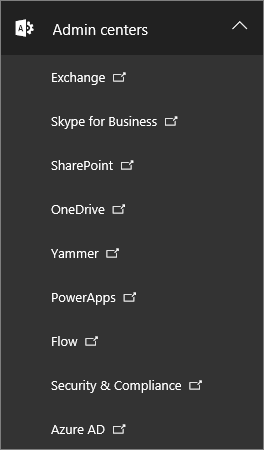
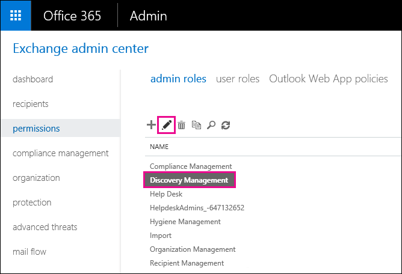
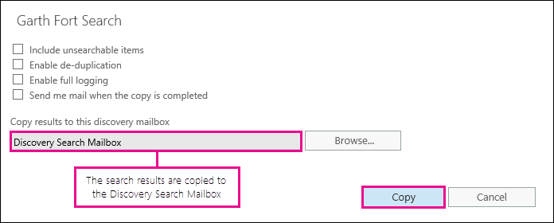
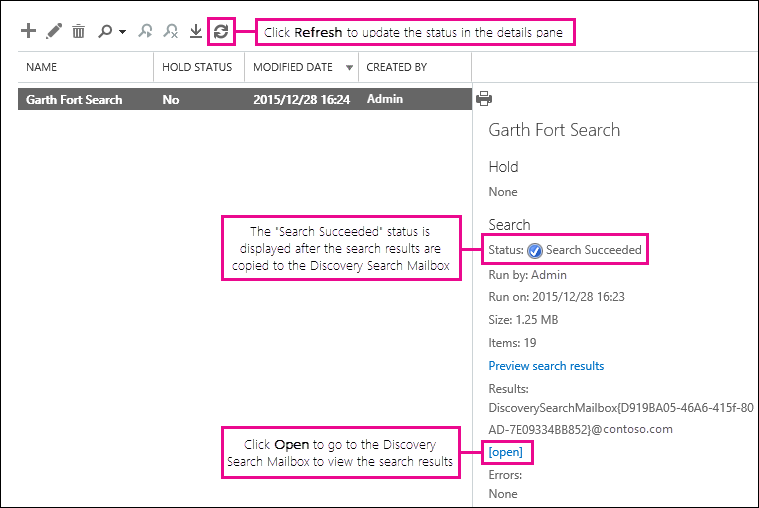

# Wiederherstellen gelöschter Elemente in einem Benutzerpostfach - Admin-HilfeRecover deleted items in a user mailbox - Admin Help

**Ist in diesem Artikel für Administratoren. Versuchen Sie zum Wiederherstellen von gelöschten Elemente in Ihrem Postfach?** Führen Sie eine der folgenden:**This article is for administrators. Are you trying to recover deleted items in your own mailbox?** Try one of the following:
- [Wiederherstellen gelöschter Elemente in Outlook für WindowsRecover deleted items in Outlook for Windows](https://support.office.com/article/49e81f3c-c8f4-4426-a0b9-c0fd751d48ce)
- [Wiederherstellen gelöschter Elemente oder E-Mails in Outlook OnlineRecover deleted items or email in Outlook Web App](https://support.office.com/article/c3d8fc15-eeef-4f1c-81df-e27964b7edd4)
- [Wiederherstellen gelöschter e-Mail-Nachrichten in Outlook im WebRestore deleted email messages in Outlook on the web](https://support.office.com/article/a8ca78ac-4721-4066-95dd-571842e9fb11)
- [Outlook.comOutlook.com](https://go.microsoft.com/fwlink/p/?LinkID=623435)
   
Entfernen ein Benutzer Elemente dauerhaft aus ihrem Outlook-Postfach? Der Benutzer sie wieder möchte jedoch nicht wiederherstellen. Möglicherweise können die gelöschten Elemente wiederherstellen, wenn sie dauerhaft aus dem Postfach des Benutzers entfernt wurde noch nicht. Dazu verwenden das Compliance-eDiscovery-Tool in Exchange Online zum Suchen nach gelöschten e-Mail und anderen Elementen – und wie Kontakte, Termine im Kalender und Aufgaben – im Postfach eines Benutzers. Wenn Sie die gelöschten Elemente finden, können Sie diese in eine PST-Datei (auch als Outlook-Datendatei bezeichnet), exportieren die der Benutzer dann verwenden können, die Elemente an ihr Postfach wiederherstellen.Did a user permanently delete items from their Outlook mailbox? The user wants them back but can't recover them. You may be able recover the purged items if they haven't been permanently removed from the user's mailbox. You do this by using the In-Place eDiscovery tool in Exchange Online to search for deleted email and other items—and such as contacts, calendar appointments, and tasks—in a user's mailbox. If you find the deleted items, you can export them to a PST file (also called an Outlook Data File), which the user can then use to restore the items back to their mailbox.
  
Hier werden die Schritte zum Wiederherstellen von gelöschten Objekten im Postfach des Benutzers. Wie lange dauert dies? Beim ersten möglicherweise 20 oder 30 Minuten dauern alle, die Schritte aus, je nachdem, wie viele Elemente wiederherstellen möchten.Here are the steps for recovering deleted items in a user's mailbox. How long will this take? The first time might take 20 or 30 minutes to complete all the steps, depending on how many items you're trying to recover.
  
> [!NOTE]
> Sie müssen ein **Exchange-Administrator** oder ein **globaler Administrator** in Office 365 oder ein Mitglied der Rollengruppe "Organisationsverwaltung" im Exchange Online zum Ausführen der Schritte in diesem Artikel. Weitere Informationen finden Sie unter [Informationen zu Office 365-Administratorrollen](https://support.office.com/article/da585eea-f576-4f55-a1e0-87090b6aaa9d).You have to be an **Exchange administrator** or **Global administrator** in Office 365 or be a member of the Organization Management role group in Exchange Online to perform the steps in this article. For more information, see [About Office 365 admin roles](https://support.office.com/article/da585eea-f576-4f55-a1e0-87090b6aaa9d). 
  
## Schritt 1: Erteilen Sie sich selbst eDiscovery-BerechtigungenStep 1: Assign yourself eDiscovery permissions

Der erste Schritt besteht darin selbst die erforderlichen Berechtigungen in Exchange Online zuweisen, damit Sie das Compliance-eDiscovery-Tool verwenden können, um dem Postfach eines Benutzers zu suchen. Sie müssen nur einmal erforderlich. Wenn Sie ein anderes Postfach in der Zukunft zu suchen müssen, können Sie diesen Schritt überspringen.The first step is to assign yourself the necessary permissions in Exchange Online so you can use the In-Place eDiscovery tool to search a user's mailbox. You only have to do this once. If you have to search another mailbox in the future, you can skip this step.
  
1. [Where zur Anmeldung bei Office 365 für Unternehmen](https://support.office.com/article/e9eb7d51-5430-4929-91ab-6157c5a050b4) mit Ihrem Konto arbeiten oder Schule.[Where to sign in to Office 365 for business](https://support.office.com/article/e9eb7d51-5430-4929-91ab-6157c5a050b4) with your work or school account. 
    
2. Wählen Sie das Symbol der app-Start  in der linken oberen und klicken Sie auf **Administrator**.Select the app launcher icon  in the upper-left and click **Admin**.
    
3. Im linken Navigationsbereich in Office 365 Administrationscenter erweitern Sie **Admin centers**, und klicken Sie dann auf **Exchange**.In the left navigation in the Office 365 admin center, expand **Admin centers**, and then click **Exchange**.
    
    
  
4. Klicken Sie in der Exchange-Verwaltungskonsole auf **Berechtigungen**, und klicken Sie dann auf **Administratorrollen**.In the Exchange admin center, click **Permissions**, and then click **Admin roles**.
    
5. In der Listenansicht **Discoveryverwaltung**wählen Sie aus, und klicken Sie dann auf **Bearbeiten**.In the list view, select **Discovery Management**, and then click **Edit**.
    
    
  
6. Klicken Sie in der **Rollengruppe**, klicken Sie unter **Mitglieder**auf **Hinzufügen**.In **Role Group**, under **Members**, click **Add**.
    
7. Wählen Sie in **Elemente auswählen**selbst aus der Liste der Namen, klicken Sie auf **Hinzufügen**, und klicken Sie dann auf **OK**.In **Select Members**, select yourself from the list of names, click **Add**, and then click **OK**.
    
    > [!NOTE]
    > Sie können auch eine Gruppe hinzufügen, dass Sie Mitglied der, wie Organisationsverwaltung oder TenantAdmins sind. Wenn Sie eine Gruppe hinzufügen, werden anderen Mitglieder der Gruppe die erforderlichen Berechtigungen zum Ausführen des In-Place eDiscovery-Tools zugewiesen werden.You can also add a group that you are a member of, such as Organization Management or TenantAdmins. If you add a group, other members of the group will be assigned the necessary permissions to run the In-Place eDiscovery tool. 
  
8. Klicken Sie in **Rollengruppe** auf **Speichern**.In **Role Group**, click **Save**.
    
9. Melden Sie bei Office 365 ab.Sign out of Office 365.
    
    Sie müssen sich abmelden, bevor Sie im nächsten Schritt starten, damit die neuen Berechtigungen wirksam werden.You have to sign out before you start the next step so the new permissions will take effect.
    
> [!CAUTION]
> Mitglieder der Rollengruppe "Discoveryverwaltung" können vertrauliche Nachrichteninhalt zugreifen. Dazu gehören alle Postfächer in Ihrer Organisation suchen, Anzeigen einer Vorschau der Suchergebnisse (und anderen Postfachelemente), die Ergebnisse in ein discoverypostfach kopieren und die Suchergebnisse in eine PST-Datei exportieren.Members of the Discovery Management role group can access sensitive message content. This includes searching all mailboxes in your organization, previewing the search results (and other mailbox items), copying the results to a discovery mailbox, and exporting the search results to a PST file. 
  
[Zurück zum SeitenanfangReturn to top](recover-deleted-items-in-a-mailbox.md#__top)
  
## Schritt 2: Suchen Sie das Postfach des Benutzers für gelöschte ElementeStep 2: Search the user's mailbox for deleted items

Beim Ausführen einer Compliance-eDiscovery-Suche ist "wiederherstellbare Elemente" im Postfach, das gesucht werden automatisch in die Suche enthalten. Ordner "wiederherstellbare Elemente" werden endgültig gelöschte Elemente gespeichert, bis sie gelöscht sind (dauerhaft entfernt) aus dem Postfach. So, wenn ein Element noch nicht gelöscht wurden, sollten Sie mithilfe des In-Place eDiscovery Tools finden können.When you run an In-Place eDiscovery search, the Recoverable Items folder in the mailbox that you search is automatically included in the search. The Recoverable Items folder is where permanently deleted items are stored until they're purged (permanently removed) from the mailbox. So, if an item hasn't been purged, you should be able to find it by using the In-Place eDiscovery tool.
  
1. [Where zur Anmeldung bei Office 365 für Unternehmen](https://support.office.com/article/e9eb7d51-5430-4929-91ab-6157c5a050b4) mit Ihrem Konto arbeiten oder Schule.[Where to sign in to Office 365 for business](https://support.office.com/article/e9eb7d51-5430-4929-91ab-6157c5a050b4) with your work or school account. 
    
2. Wählen Sie das Symbol der app-Start  in der linken oberen und klicken Sie auf **Administrator**.Select the app launcher icon  in the upper-left and click **Admin**.
    
3. Klicken Sie im linken Navigationsbereich in Office 365 Administrationscenter erweitern Sie **Admin**, und klicken Sie dann auf **Exchange**.In the left navigation in the Office 365 admin center, expand **Admin**, and then click **Exchange**.
    
4. Klicken Sie in der Exchange-Verwaltungskonsole, klicken Sie auf **Verwaltung der Richtlinientreue** **Compliance-eDiscovery &amp; halten**, und klicken Sie dann auf **New**.In the Exchange admin center, click **Compliance management**, click **In-Place eDiscovery &amp; Hold**, and then click **New**.
    
    
  
5. Geben Sie auf der Seite **Name und Beschreibung** einen Namen für die Suche (beispielsweise den Namen des Benutzers, die Sie bei der Wiederherstellung von e-Mail), optional eine Beschreibung, und klicken Sie dann auf **Weiter**.On the **Name and description** page, type a name for the search (such as the name of the user you're recovering email for), an optional description, and then click **Next**.
    
6. Klicken Sie auf der Seite **Postfächer** , klicken Sie auf **Geben Sie Postfächer zu suchen**, und klicken Sie dann auf **Hinzufügen**.On the **Mailboxes** page, click **Specify mailboxes to search**, and then click **Add**.
    
    
  
7. Suchen Sie und wählen Sie den Namen des Benutzers, die Sie für die gelöschte e-Mail wiederherstellen möchten, klicken Sie auf **Hinzufügen**und klicken Sie dann auf **OK**.Find and select the name of the user that you're recovering the deleted email for, click **Add**, and then click **OK**.
    
8. Klicken Sie auf **Weiter**.Click **Next**.
    
    Die Seite **Suchabfrage** wird angezeigt. Dies ist, in dem Sie die Suchkriterien definieren, mit denen Sie die fehlenden Elemente im Postfach des Benutzers zu finden.The **Search query** page is displayed. This is where you define the search criteria that will help you find the missing items in user's mailbox. 
    
9. Füllen Sie auf der Seite **Suchabfrage** die folgenden Felder aus:On the **Search query** page, complete the following fields: 
    
  - **Schließen Sie alle Inhalte** Wählen Sie diese Option, um alle Inhalte im Postfach des Benutzers in den Suchergebnissen enthalten. Wenn Sie diese Option auswählen, können nicht Sie zusätzliche Suchkriterien angeben.**Include all content** Select this option to include all content in the user's mailbox in the search results. If you select this option, you can't specify additional search criteria. 
    
  - **Filter basierend auf Kriterien** Wählen Sie diese Option, um anzugeben, dass die Suchkriterien, einschließlich Schlüsselwörter, starten und beenden Sie Datumsangaben, Absender und Empfängeradressen und Nachrichtentypen aus.**Filter based on criteria** Select this option to specify the search criteria, including keywords, start and end dates, sender and recipient addresses, and message types. 
    
    
  
|**Feld****Field**|**Verwenden Sie diese Option, um...****Use this to...**|
|:-----|:-----|
|             |Geben Sie Schlüsselwörter, Datumsbereich, Empfänger und Nachrichtentypen.Specify keywords, date range, recipients, and message types.    |
|             |Nachrichten mit Schlüsselwörtern oder Ausdrücken suchen und Verwenden von logischen Operatoren wie **AND** oder **OR**.Search for messages with keywords or phrases, and use logical operators such as **AND** or **OR**.    |
|             |Suchen Sie nach Nachrichten, die innerhalb eines Datumsbereichs gesendet oder empfangen.Search for messages sent or received within a date range.    |
|             |Suchen Sie nach Nachrichten, die an bestimmte Personen gesendet oder empfangen aus.Search for messages received from or sent to specific people.    |
|             |Für alle Nachrichtentypen suchen Sie, oder wählen Sie das Domänenkennwort.Search for all message types or select specific ones.    |
   
    > [!TIP]
    >  Here's a few tips about how to build a search query to find missing items. Try to get as much information from the user to help you create a search query so you can find what you're looking for. >  If you not sure how to find a missing message, consider using the **Include all content** option. The search results will include all items in the user's Recoverable Items folder, including the hidden folder (called the Purges folder) that contain items that have been purged by the user. Then you can go to Step 3, copy the results to a discovery mailbox, and look at the message in the hidden folder. >  If you know approximately when the missing message was originally sent or received by the user, use the **Specify start date** and **Specify end date** options to provide a date range. This will return all messages sent or received by the user within that date range. Specifying a date range is a really good way to narrow the search results. >  If you know who sent the missing email, use the **From** box to specify this sender. >  If you want to narrow the search results to different types of mailbox items, click **Select message types**, click **Select the message types to search**, and then choose a specific message type to search for. For example, you can search only for calendar items or contacts. Here's a screenshot of the different message types you can search for; the default is to search for all message types. 
  
    Click **Next** when you've completed the **Search query** page. 
    
10. Klicken Sie auf der Seite **Einstellungen für die Compliance-Archiv** auf **Fertig stellen** , um die Suche zu starten. Zum Wiederherstellen von gelöschten e-Mail, gibt es keinen Grund das Postfach des Benutzers in der Warteschleife platziert.On the **In-Place Hold settings** page, click **Finish** to start the search. To recover deleted email, there's no reason to place the user's mailbox on hold. 
    
    Nachdem Sie die Suche starten, werden Exchange eine Schätzung der Gesamtgröße sowie die Anzahl der Elemente, die zurückgegeben werden, indem die Suche anhand der angegebenen Kriterien angezeigt.After you start the search, Exchange will display an estimate of the total size and number of items that will be returned by the search based on the criteria you specified.
    
11. Wählen Sie die Suche, die Sie gerade erstellt haben, und klicken Sie auf **Aktualisieren** zum Aktualisieren der Informationen im Detailbereich angezeigt. Der Status der **Schätzung erfolgreich** gibt an, dass die Suche abgeschlossen wurde. Exchange zeigt auch eine Schätzung der Gesamtzahl der Elemente (und ihre Größe) bei der Suche basierend auf den in Schritt 9 angegebenen Suchkriterien gefunden.Select the search you just created and click **Refresh** to update the information displayed in the details pane. The status of **Estimate Succeeded** indicates that the search has finished. Exchange also displays an estimate of the total number of items (and their size) found by the search based on the search criteria you specified in step 9. 
    
12. Klicken Sie im Detailbereich auf **Vorschau der Suchergebnisse** , um die Elemente anzuzeigen, die gefunden wurden. Dadurch können Sie die Elemente zu identifizieren, die Sie benötigen. Wenn Sie die Elemente, die Sie wiederherstellen möchten finden, gehen Sie zu Schritt 4, um die Suchergebnisse in eine PST-Datei zu exportieren.In the details pane, click **Preview search results** to view the items that were found. This might help you identify the item(s) that you're looking for. If you find the item(s) you're trying to recover, go to step 4 to export the search results to a PST file. 
    
    
  
13. Wenn Sie nicht finden, wonach Sie suchen, Sie können überarbeiten Suchkriterien, indem Sie die Suche auswählen auf **Bearbeiten**klicken, und klicken Sie dann auf **die Suchabfrage**. Ändern Sie die Suchkriterien ein, und führen Sie die Suche erneut aus.If you don't find what you're looking for, you can revise your search criteria by selecting the search, clicking **Edit**, and then clicking **Search query**. Change the search criteria and then rerun the search.
    
[Zurück zum SeitenanfangReturn to top](recover-deleted-items-in-a-mailbox.md#__top)
  
## (Optional) Schritt 3: Kopieren Sie die Suchergebnisse in ein discoverypostfach.(Optional) Step 3: Copy the search results to a discovery mailbox

Wenn Sie ein Elemente nicht finden können, indem Sie eine Vorschau der Suchergebnisse oder angezeigt, welche Elemente in den Ordner des Benutzers wiederherstellbare Elemente werden sollen, können klicken Sie dann Sie copy die Suchergebnisse an eine bestimmte Mailbox (ein discoverypostfach genannt) und öffnen Sie das Postfach in Outlook im Web t o die tatsächliche Elemente anzeigen. Der bewährte Grund, kopieren Sie die Suchergebnisse ist, sodass die Elemente in den Ordner des Benutzers wiederherstellbare Elemente angezeigt werden können. Das Element, das Sie wiederherstellen möchten befindet sich mehr als wahrscheinlich im Unterordner "bereinigt".If you can't find an items by previewing the search results or if you want to see which items are in the user's Recoverable Items folder, then you can copy the search results to a special mailbox (called a discovery mailbox) and then open that mailbox in Outlook on the web to view the actual items. The best reason to copy the search results is so you can view the items in the user's Recoverable Items folder. More than likely, the item you're trying to recover is located in the Purges subfolder. 
  
1. Navigieren Sie in der Exchange-Verwaltungskonsole zu **Verwaltung der Richtlinientreue** \> **Compliance-eDiscovery &amp; halten**.In the Exchange admin center, go to **Compliance management** \> **In-Place eDiscovery &amp; Hold**.
    
2. Wählen Sie in der Liste der Suchvorgänge die Suche, die Sie in Schritt2 erstellt haben.In the list of searches, select the search that you created in Step 2.
    
3. Klicken Sie auf **Suche**, und klicken Sie dann auf **Kopieren der Suchergebnisse** aus der Dropdown-Liste.Click **Search**, and then click **Copy search results** from the drop-down list. 
    
    
  
4. Klicken Sie auf der Seite **Suchergebnisse kopieren** auf **Durchsuchen**.On the **Copy Search Results** page, click **Browse**.
    
    
  
5. Klicken Sie unter **Anzeigename den Namen**auf **Discoverysuchpostfach**, und klicken Sie dann auf **OK**.Under **Display Name**, click **Discovery Search Mailbox**, and then click **OK**.
    
    
  
    > [!NOTE]
    > Die Discoverysuchpostfach ist eine standarddiscoverypostfach, die in Office 365-Organisation automatisch erstellt wird.The Discovery Search Mailbox is a default discovery mailbox that is automatically created in your Office 365 organization. 
  
6. Wieder auf der Seite **Suchergebnisse kopieren** klicken Sie auf **Kopieren** , um den Vorgang, um die Suchergebnisse in die Discoverysuchpostfach kopieren zu starten.Back on the **Copy Search Results** page, click **Copy** to start the process to copy the search results to the Discovery Search Mailbox. 
    
    
  
7. Klicken Sie auf **Aktualisieren** , die Informationen zu den kopieren Status aktualisieren, die im Detailbereich angezeigt wird.Click **Refresh** to update the information about the copying status that is displayed in the details pane. 
    
8. Wenn der Kopiervorgang abgeschlossen ist, klicken Sie auf **Öffnen** , um dem Discoverysuchpostfach zum Anzeigen der Suchergebnisse zu öffnen.When the copying is complete, click **Open** to open the Discovery Search Mailbox to view the search results. 
    
    
  
    Die Suchergebnisse in die Discoverysuchpostfach kopiert befinden sich in einem Ordner, die den gleichen Namen wie die Compliance-eDiscovery-Suche hat. Sie können einen Ordner, um die Elemente in diesem Ordner anzeigen klicken.The search results copied to the Discovery Search Mailbox are placed in a folder that has the same name as the In-Place eDiscovery search. You can click a folder to display the items in that folder.
    
    
  
    Wenn Sie eine Suche ausführen, wird der Ordner wiederherstellbare Elemente des Benutzers auch durchsucht. Das bedeutet, dass sie Elemente im Ordner "wiederherstellbare Elemente" nicht die Suchkriterien erfüllen, in den Suchergebnissen enthalten sind. Elemente im Ordner Gelöschte werden Elemente, die der Benutzer endgültig (durch Löschen eines Elements aus dem Ordner Gelöschte Objekte oder durch auswählen und drücken **UMSCHALT + ENTF**. gelöscht Ein Benutzer kann das Tool gelöschte Elemente wiederherstellen in Outlook oder Outlook im Web verwenden, im Ordner Gelöschte Elemente wiederherstellen. Elemente im Ordner Benutzerkontenverwaltung sind Elemente, die der Benutzer mithilfe des Tools Wiederherstellen gelöschter Elemente gelöscht oder Elemente, die sie durch eine Richtlinie auf das Postfach angewendeten automatisch gelöscht wurden. In beiden Fällen kann nur ein Administrator Elemente im Ordner Benutzerkontenverwaltung wiederherstellen.When you run a search, the user's Recoverable Items folder is also searched. That means if items in the Recoverable Items folder meet the search criteria, they are included in the search results. Items in the Deletions folder are items that the user permanently deleted (by deleting an item from the Deleted Items folder or by selecting it and pressing **Shift+Delete**. A user can use the Recover Deleted Items tool in Outlook or Outlook on the web to recover items in the Deletions folder. Items in the Purges folder are items that the user purged by using the Recover Deleted Items tool or items they were automatically purged by a policy applied to the mailbox. In either case, only an admin can recover items in the Purges folder. 
    
    > [!TIP]
    > Wenn ein Benutzer ein gelöschtes Element mit dem Tool wiederherstellbare Elemente kann nicht gefunden werden, aber dieses Element ist noch wiederhergestellt (d. h., dass es nicht dauerhaft aus dem Postfach entfernt wurde), es höchstwahrscheinlich in den Ordner Benutzerkontenverwaltung befindet. Daher müssen Sie den Benutzerkontenverwaltung Ordner für gelöschte Elemente anzuzeigen, die Sie für einen Benutzer wiederherstellen möchten.If a user can't find a deleted item using the Recoverable Items tool, but that item is still recoverable (meaning that it hasn't been permanently removed from the mailbox), it's more than likely located in the Purges folder. So, be sure to look in the Purges folder for the deleted item you're trying to recover for a user. 
  
[Zurück zum SeitenanfangReturn to top](recover-deleted-items-in-a-mailbox.md#__top)
  
## Schritt 4: Exportieren der Suchergebnisse in eine PST-DateiStep 4: Export the search results to a PST file

Nachdem Sie das Element, das Sie für einen Benutzer wiederherstellen möchten finden, besteht der nächste Schritt die Ergebnisse von der Suche, den Sie in Schritt2 ausgeführt, in eine PST-Datei haben zu exportieren. Der Benutzer wird in PST-Datei im nächsten Schritt verwenden, um das gelöschte Element mit ihrem Postfach wiederherzustellen.After you find the item you're trying to recover for a user, the next step is to export the results from the search you ran in Step 2 to a PST file. The user will use this PST file in the next step to restore the deleted item to their mailbox.
  
1. Navigieren Sie in der Exchange-Verwaltungskonsole zu **Verwaltung der Richtlinientreue** \> **Compliance-eDiscovery &amp; halten**.In the Exchange admin center, go to **Compliance management** \> **In-Place eDiscovery &amp; Hold**.
    
2. Wählen Sie in der Liste der Suchvorgänge die Suche, die Sie in Schritt2 erstellt haben.In the list of searches, select the search that you created in Step 2.
    
3. Klicken Sie auf **Exportieren in eine PST-Datei**.Click **Export to a PST file**.
    
    
  
4. Wenn Sie aufgefordert werden, die eDiscovery-Exporttool installieren, klicken Sie auf **Ausführen**.If you're prompted to install the eDiscovery Export Tool, click **Run**.
    
5. Klicken Sie in der eDiscovery-PST-Exporttool auf **Durchsuchen** , um den Speicherort angeben, wo Sie die PST-Datei herunterladen möchten.In the eDiscovery PST Export Tool, click **Browse** to specify the location where you want to download the PST file. 
    
    
  
    Sie können die Optionen zum Aktivieren der Deduplizierung und nicht durchsuchbare Elemente einschließen ignorieren.You can ignore the options to enable deduplication and include unsearchable items.
    
6. Klicken Sie auf **Starten** , um die PST-Datei auf Ihren Computer herunterladen.Click **Start** to download the PST file to your computer. 
    
    Die **eDiscovery-PST-Exporttool** zeigt Statusinformationen über den Exportvorgang anzeigt. Wenn der Exportvorgang abgeschlossen ist, können Sie die Datei am Speicherort zugreifen, in dem sie heruntergeladen wurde.The **eDiscovery PST Export Tool** displays status information about the export process. When the export is complete, you can access the file in the location where it was downloaded. 
    
[Zurück zum SeitenanfangReturn to top](recover-deleted-items-in-a-mailbox.md#__top)
  
## Schritt 5: Wiederherstellen der wiederhergestellten Elemente in das Postfach des BenutzersStep 5: Restore the recovered items to the user's mailbox

Der letzte Schritt ist die Verwendung die PST-Datei, die in Schritt 4, um die wiederhergestellte Elemente in das Postfach des Benutzers wiederherstellen exportiert wurde. Nachdem Sie die PST-Datei an die Benutzer senden, wird der Rest dieses Schritts vom Benutzer öffnen Sie die PST-Datei und anschließend die wiederhergestellten Elemente in einen anderen Ordner in ihrem Postfach verschieben ausgeführt. Können Sie dem Benutzer auch einen Link zu diesem Thema senden, für eine schrittweise Anleitung: [Öffnen und schließen Sie Outlook-Datendateien (PST)](https://support.office.com/article/381b776d-7511-45a0-953a-0935c79d24f2). Oder Sie können Benutzer einen Link zu den Abschnitt [Wiederherstellen gelöschter Elemente mit einem Postfach über eine PST-Datei](recover-deleted-items-in-a-mailbox.md#restoredeleteditems) senden und bitten, diese Schritte auszuführen.The final step is to use the PST file that was exported in step 4 to restore the recovered items to the user's mailbox. After you send the PST file to the user, the remainder of this step is performed by the user to open the PST file and then move the recovered items to another folder in their mailbox. For step-by-step instructions, you can also send the user a link to this topic: [Open and close Outlook Data Files (.pst)](https://support.office.com/article/381b776d-7511-45a0-953a-0935c79d24f2). Or you can send the user a link to the [Restore deleted items to a mailbox using a PST file](recover-deleted-items-in-a-mailbox.md#restoredeleteditems) section below and ask them to perform these steps. 
  
 **Die PST-Datei an den Benutzer senden****Send the PST file to the user**
  
Der letzte Schritt, die Sie ausführen müssen ist die PST-Datei, die exportiert wurde in Schritt 4 an den Benutzer gesendet. Es gibt einige Methoden zur Verfügung:The final step that you need to perform is sending the PST file that was exported in step 4 to the user. There are a few ways to do this:
  
- Fügen Sie die PST-Datei an eine e-Mail-Nachricht. Wenn Outlook auf Block PST-Dateien konfiguriert ist, müssen Sie zip-Datei, und klicken Sie dann auf die Nachricht anfügen. Hier ist wie:Attach the PST file to an email message. If Outlook is configured to block PST files, then you will have to zip the file and then attach it to the message. Here's how:
    
1. Navigieren Sie in Windows Explorer oder Datei-Explorer die PST-Datei.In Windows Explorer or File Explorer, browse to the PST file.
    
2. Mit der rechten Maustaste in der Datei, und wählen Sie dann auf **Senden an** \> **komprimierte ZIP-Ordner**. Windows erstellt eine neue Zipdatei und weist ihm einen identischen Namen wie die PST-Datei.Right-click the file, and then select **Send to** \> **Compressed (zipped) folder**. Windows creates a new zip file and gives it an identical name as the PST file.
    
3. Fügen Sie die komprimierte PST-Datei an eine e-Mail-Nachricht, und senden Sie sie an die Benutzer dann die Datei entpacken kann, indem Sie darauf klicken.Attach the compressed PST file to an email message and send it to the user, who can then decompress the file just by clicking it.
    
- Kopieren Sie die PST-Datei in einen freigegebenen Ordner, dass der Benutzer zugreifen und diese abrufen kann.Copy the PST file to a shared folder that the user can access and retrieve it.
    
Die Schritte im nächsten Abschnitt werden vom Benutzer gelöschte Elemente in ihrem Postfach wiederherstellen ausgeführt.The steps in the next section are performed by the user to restore the deleted items to their mailbox.
  
 **Wiederherstellen gelöschter Elemente mit einem Postfach über eine PST-Datei****Restore deleted items to a mailbox using a PST file**
  
Sie müssen die Outlook-desktop-app verwenden, um ein gelöschtes Element wiederherstellen mithilfe einer PST-Datei. Sie können nicht Outlook Web App oder Outlook im Web verwenden, um eine PST-Datei zu öffnen.You have to use the Outlook desktop app to restore a deleted item by using a PST file. You can't use Outlook Web App or Outlook on the web to open a PST file.
  
1. Klicken Sie in Outlook 2013 oder Outlook 2016 auf der Registerkarte **Datei** .In Outlook 2013 or Outlook 2016, click the **File** tab. 
    
2. Klicken Sie auf **Open &amp; exportieren**, und klicken Sie dann auf **Outlook-Datendatei öffnen**.Click **Open &amp; Export**, and then click **Open Outlook Data File**.
    
3. Navigieren Sie zum Speicherort, in dem Sie die PST-Datei gespeichert, die der Administrator gesendet.Browse to the location where you saved the PST file that your administrator sent.
    
4. Wählen Sie die PST-Datei aus, und klicken Sie dann auf **Öffnen**.Select the PST and then click **Open**.
    
    Die PST-Datei wird in der linken Navigationsleiste in Outlook angezeigt.The PST file appears in the left-nav bar in Outlook.
    
    
  
5. Klicken Sie auf die Pfeile, um die PST-Datei zu erweitern, und die Ordner unter, um das Element zu suchen, die Sie wiederherstellen möchten.Click the arrows to expand the PST file and the folders under it to locate the item you want to recover.
    
    
  
    > [!TIP]
    > Suchen Sie in den Ordner Benutzerkontenverwaltung für das Element, den, das Sie wiederherstellen möchten. Hierbei handelt es sich um einen versteckten Ordner die gelöschten Elemente werden in verschoben. Es ist wahrscheinlich das Element, das in diesem Ordner Systemadministrator wiederhergestellt wird.Look in the Purges folder for the item you want to recover. This is a hidden folder that purged items are moved to. It's likely the item that your administrator recovered is in this folder. 
  
6. Mit der rechten Maustaste in des Elements, die Sie wiederherstellen, und klicken Sie dann auf **Verschieben** möchten \> **Anderer Ordner**.Right-click the item you want to recover and then click **Move** \> **Other Folder**.
    
    
  
7. Wenn das Element an Ihren Posteingang verschieben möchten, klicken Sie auf **Posteingang**, und klicken Sie dann auf **OK**.To move the item to your inbox, click **Inbox**, and then click **OK**.
    
    **Tipp:** Um anderen Elementtypen wiederherzustellen, führen Sie einen der folgenden Aktionen aus:**Tip:** To recover other types of items, do one of the following: 
    
  - Um ein Kalenderelement wiederherzustellen, der rechten Maustaste darauf, und klicken Sie dann auf **Verschieben** \> **Anderer Ordner** \> **Kalender**.To recover a calendar item, right-click it, and then click **Move** \> **Other Folder** \> **Calendar**.
    
  - Zum Wiederherstellen eines Kontakts Maustaste darauf, und klicken Sie dann auf **Verschieben** \> **Anderer Ordner** \> **Kontakte**.To recover a contact, right-click it, and then click **Move** \> **Other Folder** \> **Contacts**.
    
  - Zum Wiederherstellen einer Aufgabe Maustaste darauf, und klicken Sie dann auf **Verschieben** \> **Anderer Ordner** \> **Aufgaben**.To recover a task, right-click it, and then click **Move** \> **Other Folder** \> **Tasks**.
    

  
    Note that calendar items, contacts, and tasks are located directly in the Purges folder, and not in a Calendar, Contacts, or Tasks subfolder. However, you can sort by **Type** to group similar types of items. 
    
8. Wenn Sie nach Abschluss des Vorgangs Wiederherstellen gelöschter Elemente der rechten Maustaste auf die PST-Datei in den Links-Navigationsleiste, und wählen Sie **Schließen "Name der PST-Datei"**.When you're finished recovering deleted items, right-click the PST file in the left-nav bar and select **Close "name of PST file"**.
    
[Zurück zum SeitenanfangReturn to top](recover-deleted-items-in-a-mailbox.md#__top)
  
## Weitere InformationenMore information

- Möglicherweise kann ein Benutzer einen endgültig gelöschten Elemente wiederherstellen, wenn die Aufbewahrungszeit für das Element abgelaufen ist. Als Administrator, die Sie möglicherweise sind bestimmte wie lange Elemente im Ordner "wiederherstellbare Elemente" für die Wiederherstellung verfügbar. Beispielsweise möglicherweise eine Richtlinie, die nichts gelöscht, die im Ordner Gelöschte Objekte des Benutzers 30 Tage wurde und eine andere Richtlinie, mit denen Benutzer Elemente im Ordner "wiederherstellbare Elemente" für bis zu einer anderen 14 Tage wiederherstellen kann. Möglicherweise zum Wiederherstellen eines Elements im Postfach eines Benutzers mithilfe der Verfahren in diesem Thema können Sie nach dieser 14 Tagen weiterhin aus.It might be possible for a user to recover a permanently deleted item if the deleted item retention period for the item hasn't expired. As an admin you may have specified how long items in the Recoverable Items folder are available for recovery. For example, there might be a policy that deletes anything that's been in a user's Deleted Items folder for 30 days, and another policy that lets users recover items in the Recoverable Items folder for up to another 14 days. However, after this 14 days, you may still be able to recover an item in a user's mailbox by using the procedures in this topic.
    
- Benutzer können ein gelöschtes Element wiederherstellen, wenn er noch nicht gelöscht wurden und die Aufbewahrungszeit für dieses Element abgelaufen ist. Damit Benutzer Wiederherstellen gelöschter Objekte in ihrem Postfach gewährleistet ist, zeigen sie auf eine der in den folgenden Themen:Users can recover a deleted item if it hasn't been purged and if the deleted item retention period for that item hasn't expired. To help users recover deleted items in their mailbox, point them to one of the following topics:
    
  - [Wiederherstellen gelöschter Elemente in Outlook für WindowsRecover deleted items in Outlook for Windows](https://support.office.com/article/49e81f3c-c8f4-4426-a0b9-c0fd751d48ce)
    
  - [Wiederherstellen gelöschter Elemente in Outlook 2010Recover deleted items in Outlook 2010](https://support.office.com/article/cd9dfe12-8e8c-4a21-bbbf-4bd103a3f1fe)
    
  - [Wiederherstellen gelöschter Elemente oder E-Mails in Outlook OnlineRecover deleted items or email in Outlook Web App](https://support.office.com/article/c3d8fc15-eeef-4f1c-81df-e27964b7edd4)
    
  - [Wiederherstellen gelöschter e-Mail-Nachrichten in Outlook im WebRestore deleted email messages in Outlook on the web](https://support.office.com/article/a8ca78ac-4721-4066-95dd-571842e9fb11)
    
  - [Wiederherstellen eines gelöschten Kontakts in OutlookRecover a deleted contact in Outlook](https://support.office.com/article/51c83288-6888-4dcd-8c99-4932daabf643)
    
  - [Wiederherstellen gelöschter e-Mail-Nachrichten in Outlook.comRestore deleted email messages in Outlook.com](https://go.microsoft.com/fwlink/p/?LinkID=623435)
    
[Zurück zum SeitenanfangReturn to top](recover-deleted-items-in-a-mailbox.md#__top)
  

