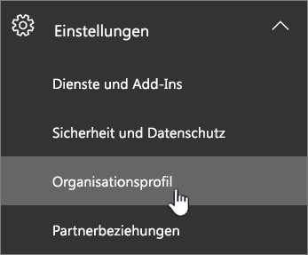

# Anfordern der Datenverschiebung

> [!NOTE]
> Die Informationen auf dieser Seite betrifft nur Kunden, die vorhandenen Office 365-Mandanten vor die neuen Rechenzentren in ihre Geo gestartet. 
  
Office 365-Kunden müssen vor dem Termin für ihres Landes beantragen, um die Kundendaten ihrer teilnehmenden Office 365-Dienste in ihre neuen Geo verschoben haben. 
  
Wir können nicht annehmen nach dem Termin in jedem Geo verschoben werden soll. 
  
## Anfordern ich kann beim Verschieben eines?

|**Kunden mit Adresse im Abrechnung**|**Anforderung Frist beginnt mit**|**Anforderung Stichtag**|
|:-----|:-----|:-----|
|Japan    |1. August 2016    |31 Oktober 2016    |
|Australien, Neuseeland, Fidschi    |1. August 2016    |31 Oktober 2016    |
|Indien    |1. August 2016    |31 Oktober 2016    |
|Kanada    |1. August 2016    |31 Oktober 2016    |
|Vereinigtes Königreich    |15 März 2017    |15 September 2017    |
|Südkorea    |1 Mai 2017    |31 Oktober 2017    |
|Frankreich    |14 März 2018    |15 September 2018    |
   
## Gewusst wie: Verschieben ein anfordern

> [!NOTE]
> Diese Option ist nur verfügbar, auf das Office 365 Administrationscenter Preview. Anweisungen zum Zugriff auf diese finden Sie unter [Office 365 für Unternehmen - Admin-Hilfe](https://aka.ms/365admin). Alle Anforderungen für das Verschieben, müssen Sie über das Office 365 Administrationscenter erfolgen. Unterstützung ist nicht möglich, stellen Sie die Auswahl dieser Option für Sie oder außer Kraft setzen Ihre Auswahl. 
  
Zugelassene Kunden werden eine Seite in ihrem [Office 365 Admin Center](https://aka.ms/365admin)angezeigt, die sie ihre Core Kundendaten in ihre neuen Bereich im Rechenzentrum verschoben haben anfordern können.  
  
Zum Aufrufen der Seite in der Office 365-Verwaltungskonsole im Navigationsbereich auf der linken Seite erweitern Sie **Einstellungen**und klicken Sie dann auf **Profil des Unternehmens**.
  

  
Führen Sie auf der Seite **Profil des Unternehmens** einen Bildlauf nach unten zum Abschnitt **Daten vor-Ort-Option** . 
  

  
**In diesem Abschnitt möglicherweise nicht angezeigt, wenn eine der folgenden anwenden**:
- Ihres Mandanten gilt nicht für die Move-Anwendung. 
- Alle Ihre Daten befindet sich bereits in der neuen Geo (siehe Abschnitt Datenspeicherort auf der Seite). 
  
> [!IMPORTANT]
> **Sie möchten für Ihre Organisation eine wichtige Auswahl treffen. Nach unten die Option bestätigt, kann es nicht rückgängig gemacht. Unterstützung kann dieser Entscheidung sowie umgekehrte.**
  
Wenn Ihre Organisation Daten vor-Ort-Anforderungen, und Sie eine Verschiebung anfordern müssen, klicken Sie auf **Bearbeiten** in der oberen rechten des Abschnitts. Auf der rechten Seite des Bildschirms erläutert die Details des Programms verschieben wird ein neuer Abschnitt angezeigt. Wählen Sie die Umschaltfläche neben den Text **Ja, Meine Organisation hat Daten vor-Ort-Anforderungen**aus. Klicken Sie auf **Speichern**.
  

  
Den Text sollte angezeigt werden, auf die **Daten vor-Ort-Option** Abschnitt Änderung an, dass **Ihrer Organisation hat seine Core Kundendaten verschieben angefordert.** Sie müssen in Ihrer Nachrichtencenter auch eine Meldung zur Bestätigung. Dadurch wird bestätigt, dass Sie erfolgreich eine Verschiebung angefordert haben. 

  
## Was geschieht nach Anforderung einer Verschiebung?

Nach Anforderung einer Verschiebung, werden wir Sie schnell für unsere operativen Integritätsregeln können verschieben möchten. Aufgrund der unvorhersehbare Art von vielen der Nebenbedingungen können wir ein bestimmtes Datum oder Zeitrahmen für die wechselt nicht freigeben. Wenn die Verschiebung abgeschlossen ist, sehen Sie eine Benachrichtigung.
  
Verschiebt können bis zu 24 Monate aus der Anforderung Stichtag für Ihr Land für die Durchführung dauern.
  
Nach Anforderung einer Verschiebung, ist es nicht möglich, Ihre Auswahl zu ändern, wie wir beginnen die hingegen verarbeitet, nachdem Sie die Anforderung vorgenommen haben.
  
## Microsoft Teams

Microsoft-Teams unterstützt noch keine Migration von Kunden Inhalt im Ruhezustand von in Region Rechenzentren in Land, in dem Daten vor-Ort-für Microsoft-Teams zur Verfügung steht.  Aus diesem Grund müssen nur neue Kunden alle ihre Daten in die neue Regionen unterstützt, auf dem Microsoft-Teams, die Daten vor-Ort-Land gespeichert.  Erfahren Sie mehr über Office 365 Daten vor-Ort-für Ihren Standort Unternehmen unter [, wo wird Ihre Daten befinden?](https://office/com/datamaps)   

## Optionale Vorgänge, bevor Sie eine Verschiebung anfordern

Führen Sie die folgenden Schritte nach Bedarf.
  
### Wenn Sie eine IP-basierte Firewall verwenden, fügen Sie Regeln für die neuen IP-Adressen zulassen

Es wird empfohlen, bei Verwendung des DNS-Filterung für Firewalls anstelle der IP-Adressen. Es sind keine neuen DNS-Einträge erforderlich.
  
Wenn Sie eine IP-basierte Firewall für Internetkonnektivität verwenden, müssen Sie Regeln für die neuen IP-Adressen für das Ziel Datacenter Geo zulassen hinzufügen. [Office 365-URLs und IP-Adresse Bereiche](https://go.microsoft.com/fwlink/p/?LinkId=229631)werden ständig IP-Adressen für neue Datacenter Geos zusätzlich zu den neuen Server hinzugefügt.
  
Konsultieren zulassen der Firewalldokumentation für Informationen zum Hinzufügen von Regeln (auch bekannt als mithilfe.)
  
Nach der IP-Adressen hinzugefügt haben, sollten Sie testen der Verbindung mit der neuen Datacenter Geo. Zu diesem Zweck wird empfohlen, einen [neuen 30-Tage-Testversion](https://go.microsoft.com/fwlink/?LinkId=522463) Mandanten erstellen, wie die neuen Datacenter Geo verfügbar ist. 
  
### Testen Sie einen neuen Mandanten

Wenn Sie zum Testen der Konnektivität vor dem verschieben möchten, können Sie einen [neuen kostenlose 30-tägige Testversion Mandanten](https://go.microsoft.com/fwlink/?LinkId=522463) einrichten, nachdem die neue Datacenter Geo verfügbar ist, und verwenden Sie es in die neue Datacenter Geo gehosteten Office 365-Umgebung zu bieten. 
  
Studien Mandanten kann nicht mit Ihren vorhandenen Mandanten kombiniert werden:
  
- Benutzer müssen eine separate Testkonto für diese Tests verwenden.
    
- Es besteht keine Möglichkeit zum Verschieben von Daten zwischen Mandanten.
    
### Benachrichtigen Sie Benutzer zum Aktualisieren von veralteter Exchange-Einstellungen auf mobilen Geräten

Wenn Benutzer ein mobiles Geräts mit dem Exchange-Server auf **m.outlook.com** oder **podxxxxx.outlook.com**festgelegt haben, wird empfohlen, dass Benutzer **outlook.office365.com**, umschalten Befolgen der Anweisungen in [Set up ein mobiles Gerät synchronisieren mit Ihrem Konto](https://support.office.com/article/c9139caf-01ab-41a0-827c-3c06ee569ed3).

## Verwandte Themen

[Verschieben von Core Daten zur neuen Office 365 Datacenter geos](moving-data-to-new-datacenter-geos.md)

[Allgemeine häufig gestellte Fragen zur Datenverschiebung](data-move-faq.md)

[Neue Datacenter Geos für Microsoft Dynamics CRM Online](https://go.microsoft.com/fwlink/p/?Linkid=615924)
  
[Azure-Diensten nach region](https://azure.microsoft.com/en-us/regions/)
  

