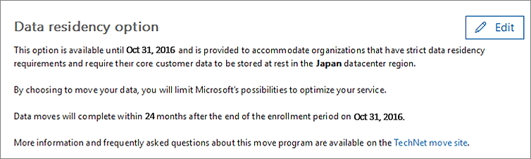

# Anfordern der DatenverschiebungHow to request your data move

> [!NOTE]
> Die Informationen auf dieser Seite betrifft nur Kunden, die vorhandenen Office 365-Mandanten vor die neuen Rechenzentren in ihre Geo gestartet.The information on this page only applies to customers who had existing Office 365 tenants before the new datacenters in their geo launched. 
  
Office 365-Kunden müssen vor dem Termin für ihres Landes beantragen, um die Kundendaten ihrer teilnehmenden Office 365-Dienste in ihre neuen Geo verschoben haben.Existing Office 365 customers will need to submit a request before the deadline for their country in order to have the customer data of their participating Office 365 services moved to their new geo. 
  
Wir können nicht annehmen nach dem Termin in jedem Geo verschoben werden soll.We are unable to accept requests to be moved after the deadline in each geo. 
  
## Anfordern ich kann beim Verschieben eines?When can I request a move?

|**Kunden mit Adresse im Abrechnung****Customers with billing address in**|**Anforderung Frist beginnt mit****Request period begins**|**Anforderung Stichtag****Request deadline**|
|:-----|:-----|:-----|
|JapanJapan    |1. August 2016August 1, 2016    |31 Oktober 2016October 31, 2016    |
|Australien, Neuseeland, FidschiAustralia, New Zealand, Fiji    |1. August 2016August 1, 2016    |31 Oktober 2016October 31, 2016    |
|IndienIndia    |1. August 2016August 1, 2016    |31 Oktober 2016October 31, 2016    |
|KanadaCanada    |1. August 2016August 1, 2016    |31 Oktober 2016October 31, 2016    |
|Vereinigtes KönigreichUnited Kingdom    |15 März 2017March 15, 2017    |15 September 2017September 15, 2017    |
|SüdkoreaSouth Korea    |1 Mai 2017May 1, 2017    |31 Oktober 2017October 31, 2017    |
|FrankreichFrance    |14 März 2018March 14, 2018    |15 September 2018September 15, 2018    |
   
## Gewusst wie: Verschieben ein anfordernHow to request a move

> [!NOTE]
> Diese Option ist nur verfügbar, auf das Office 365 Administrationscenter Preview. Anweisungen zum Zugriff auf diese finden Sie unter [Office 365 für Unternehmen - Admin-Hilfe](https://aka.ms/365admin). Alle Anforderungen für das Verschieben, müssen Sie über das Office 365 Administrationscenter erfolgen. Unterstützung ist nicht möglich, stellen Sie die Auswahl dieser Option für Sie oder außer Kraft setzen Ihre Auswahl.This option is only available on the Office 365 admin center Preview. For instructions on how to access this, see [Office 365 for business - Admin Help](https://aka.ms/365admin). All requests for moves need to be done through the Office 365 admin center. Support will not be able to make this selection for you or override your selection. 
  
Zugelassene Kunden werden eine Seite in ihrem [Office 365 Admin Center](https://aka.ms/365admin)angezeigt, die sie ihre Core Kundendaten in ihre neuen Bereich im Rechenzentrum verschoben haben anfordern können.Eligible customers will see a page in their [Office 365 Admin Center](https://aka.ms/365admin), which will allow them to request to have their core customer data moved to their new datacenter region.  
  
Zum Aufrufen der Seite in der Office 365-Verwaltungskonsole im Navigationsbereich auf der linken Seite erweitern Sie **Einstellungen**und klicken Sie dann auf **Profil des Unternehmens**.To access the page in the Office 365 admin center, in the navigation pane on the left, expand **Settings**, and then click **Organization Profile**.
  

  
Führen Sie auf der Seite **Profil des Unternehmens** einen Bildlauf nach unten zum Abschnitt **Daten vor-Ort-Option** .On the **Organization Profile** page, scroll down to the **Data Residency Option** section. 
  

  
**In diesem Abschnitt möglicherweise nicht angezeigt, wenn eine der folgenden anwenden**:**You may not see this section if one of the following apply**:
- Ihres Mandanten gilt nicht für die Move-Anwendung.Your tenant is not eligible for the move program. 
- Alle Ihre Daten befindet sich bereits in der neuen Geo (siehe Abschnitt Datenspeicherort auf der Seite).All of your data is already located in the new geo (see Data Location section of the page). 
  
> [!IMPORTANT]
> **Sie möchten für Ihre Organisation eine wichtige Auswahl treffen. Nach unten die Option bestätigt, kann es nicht rückgängig gemacht. Unterstützung kann dieser Entscheidung sowie umgekehrte.****You are about to make an important choice for your organization. After confirming the option below, you cannot undo it. Support is unable to reverse this decision as well.**
  
Wenn Ihre Organisation Daten vor-Ort-Anforderungen, und Sie eine Verschiebung anfordern müssen, klicken Sie auf **Bearbeiten** in der oberen rechten des Abschnitts. Auf der rechten Seite des Bildschirms erläutert die Details des Programms verschieben wird ein neuer Abschnitt angezeigt. Wählen Sie die Umschaltfläche neben den Text **Ja, Meine Organisation hat Daten vor-Ort-Anforderungen**aus. Klicken Sie auf **Speichern**.If your organization has data residency requirements, and you need to request a move, click **Edit** on the top right of the section. A new section will appear on the right side of your screen explaining the details of the move program. Select the toggle button next to the text that says **Yes, my organization has data residency requirements**. Then, click **Save**.
  

  
Den Text sollte angezeigt werden, auf die **Daten vor-Ort-Option** Abschnitt Änderung an, dass **Ihrer Organisation hat seine Core Kundendaten verschieben angefordert.** Sie müssen in Ihrer Nachrichtencenter auch eine Meldung zur Bestätigung. Dadurch wird bestätigt, dass Sie erfolgreich eine Verschiebung angefordert haben.You should see the text on the **Data Residency Option** section change to indicate **Your organization has requested to move its core customer data.** You'll also have a confirmation message in your message center. This confirms that you have successfully requested a move. 

  
## Was geschieht nach Anforderung einer Verschiebung?What happens after requesting a move?

Nach Anforderung einer Verschiebung, werden wir Sie schnell für unsere operativen Integritätsregeln können verschieben möchten. Aufgrund der unvorhersehbare Art von vielen der Nebenbedingungen können wir ein bestimmtes Datum oder Zeitrahmen für die wechselt nicht freigeben. Wenn die Verschiebung abgeschlossen ist, sehen Sie eine Benachrichtigung.After requesting a move, we will plan to move you as quickly as our operational constraints allow for. Due to the unpredictable nature of many of the constraints, we cannot share a specific date or timeframe for the moves. You will see a notification after the move has completed.
  
Verschiebt können bis zu 24 Monate aus der Anforderung Stichtag für Ihr Land für die Durchführung dauern.Moves may take up to 24 months from the request deadline for your country to complete.
  
Nach Anforderung einer Verschiebung, ist es nicht möglich, Ihre Auswahl zu ändern, wie wir beginnen die hingegen verarbeitet, nachdem Sie die Anforderung vorgenommen haben.After requesting a move, it is not possible to change your selection as we begin to process the moves once you have made the request.
  
## Microsoft TeamsMicrosoft Teams

Microsoft-Teams unterstützt noch keine Migration von Kunden Inhalt im Ruhezustand von in Region Rechenzentren in Land, in dem Daten vor-Ort-für Microsoft-Teams zur Verfügung steht.  Aus diesem Grund müssen nur neue Kunden alle ihre Daten in die neue Regionen unterstützt, auf dem Microsoft-Teams, die Daten vor-Ort-Land gespeichert.  Erfahren Sie mehr über Office 365 Daten vor-Ort-für Ihren Standort Unternehmen unter [, wo wird Ihre Daten befinden?](https://office/com/datamaps)Microsoft Teams does not yet support migration of customer content at rest from in-region to in-country data centers where data residency for Microsoft Teams is available.  Therefore, only new customers will have all of their data stored within country in the new regions where Microsoft Teams supports data residency.  Learn more about Office 365 data residency for your company location at [Where is your data located?](https://office/com/datamaps)   

## Optionale Vorgänge, bevor Sie eine Verschiebung anfordernOptional actions before you request a move

Führen Sie die folgenden Schritte nach Bedarf.Perform the following steps as appropriate.
  
### Wenn Sie eine IP-basierte Firewall verwenden, fügen Sie Regeln für die neuen IP-Adressen zulassenIf you use an IP-based firewall, add allow rules for the new IP addresses

Es wird empfohlen, bei Verwendung des DNS-Filterung für Firewalls anstelle der IP-Adressen. Es sind keine neuen DNS-Einträge erforderlich.We recommend using DNS filtering for firewalls instead of IP addresses. There are no new DNS entries required.
  
Wenn Sie eine IP-basierte Firewall für Internetkonnektivität verwenden, müssen Sie Regeln für die neuen IP-Adressen für das Ziel Datacenter Geo zulassen hinzufügen. [Office 365-URLs und IP-Adresse Bereiche](https://go.microsoft.com/fwlink/p/?LinkId=229631)werden ständig IP-Adressen für neue Datacenter Geos zusätzlich zu den neuen Server hinzugefügt.If you use an IP-based firewall for Internet connectivity, you must add allow rules for the new IP addresses for the destination datacenter geo. IP addresses for new datacenter geos in addition to new servers are continuously added to [Office 365 URLs and IP Address Ranges](https://go.microsoft.com/fwlink/p/?LinkId=229631).
  
Konsultieren zulassen der Firewalldokumentation für Informationen zum Hinzufügen von Regeln (auch bekannt als mithilfe.)Consult your firewall documentation for information about how to add allow rules (also known as whitelisting.)
  
Nach der IP-Adressen hinzugefügt haben, sollten Sie testen der Verbindung mit der neuen Datacenter Geo. Zu diesem Zweck wird empfohlen, einen [neuen 30-Tage-Testversion](https://go.microsoft.com/fwlink/?LinkId=522463) Mandanten erstellen, wie die neuen Datacenter Geo verfügbar ist.After adding IP addresses, you may want to test connectivity to the new datacenter geo. To do this, we recommend creating a [new free 30-day trial](https://go.microsoft.com/fwlink/?LinkId=522463) tenant as soon as the new datacenter geo is available. 
  
### Testen Sie einen neuen MandantenTest using a new tenant

Wenn Sie zum Testen der Konnektivität vor dem verschieben möchten, können Sie einen [neuen kostenlose 30-tägige Testversion Mandanten](https://go.microsoft.com/fwlink/?LinkId=522463) einrichten, nachdem die neue Datacenter Geo verfügbar ist, und verwenden Sie es in die neue Datacenter Geo gehosteten Office 365-Umgebung zu bieten.If you'd like to test connectivity prior to the move, you can set up a [new free 30-day trial tenant](https://go.microsoft.com/fwlink/?LinkId=522463) after the new datacenter geo is available, and use it to experience Office 365 hosted in the new datacenter geo. 
  
Studien Mandanten kann nicht mit Ihren vorhandenen Mandanten kombiniert werden:The trial tenant can't be combined with your existing tenant:
  
- Benutzer müssen eine separate Testkonto für diese Tests verwenden.Users must use a separate trial account for their testing.
    
- Es besteht keine Möglichkeit zum Verschieben von Daten zwischen Mandanten.There is no way to move data between tenants.
    
### Benachrichtigen Sie Benutzer zum Aktualisieren von veralteter Exchange-Einstellungen auf mobilen GerätenNotify users to update out-of-date Exchange settings on mobile devices

Wenn Benutzer ein mobiles Geräts mit dem Exchange-Server auf **m.outlook.com** oder **podxxxxx.outlook.com**festgelegt haben, wird empfohlen, dass Benutzer **outlook.office365.com**, umschalten Befolgen der Anweisungen in [Set up ein mobiles Gerät synchronisieren mit Ihrem Konto](https://support.office.com/article/c9139caf-01ab-41a0-827c-3c06ee569ed3).If users have a mobile device with the Exchange Server set to **m.outlook.com** or **podxxxxx.outlook.com**, we recommend that they switch to **outlook.office365.com**, following the instructions in [Set up a mobile device to synchronize with your account](https://support.office.com/article/c9139caf-01ab-41a0-827c-3c06ee569ed3).

## Verwandte ThemenRelated topics

[Verschieben von Core Daten zur neuen Office 365 Datacenter geosMoving core data to new Office 365 datacenter geos](moving-data-to-new-datacenter-geos.md)

[Allgemeine häufig gestellte Fragen zur DatenverschiebungData move general FAQ](data-move-faq.md)

[Neue Datacenter Geos für Microsoft Dynamics CRM OnlineNew datacenter geos for Microsoft Dynamics CRM Online](https://go.microsoft.com/fwlink/p/?Linkid=615924)
  
[Azure-Diensten nach regionAzure services by region](https://azure.microsoft.com/en-us/regions/)
  

