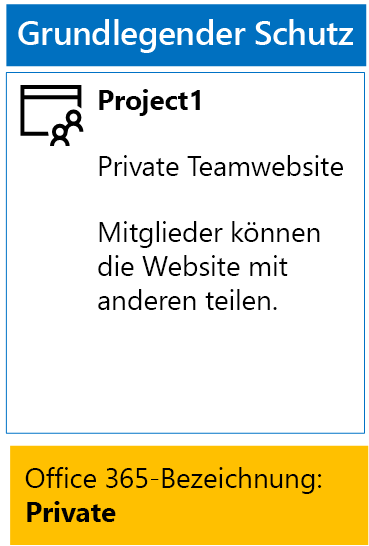

# <a name="secure-sharepoint-online-sites-in-a-devtest-environment"></a><span data-ttu-id="2a878-103">Sichern von SharePoint Online-Websites in einer Entwicklungs-/Testumgebung</span><span class="sxs-lookup"><span data-stu-id="2a878-103">Secure SharePoint Online sites in a dev/test environment</span></span>

 <span data-ttu-id="2a878-104">**Zusammenfassung:** Informationen zum Erstellen von öffentlichen, privaten, vertraulichen und streng vertraulichen SharePoint Online-Teamwebsites in einer Entwicklungs-/Testumgebung.</span><span class="sxs-lookup"><span data-stu-id="2a878-104">**Summary:** Create public, private, sensitive, and highly confidential SharePoint Online team sites in a dev/test environment.</span></span>
  
<span data-ttu-id="2a878-105">In diesem Artikel finden Sie Schritt-für-Schritt-Anleitungen zum Erstellen einer Entwicklungs-/Testumgebung, die vier verschiedene Typen von SharePoint Online-Teamwebsites für die [Sichern von SharePoint Online-Websites und -Dateien](secure-sharepoint-online-sites-and-files.md)-Lösung enthält.</span><span class="sxs-lookup"><span data-stu-id="2a878-105">This article provides step-by-step instructions to create a dev/test environment that includes the four different types of SharePoint Online team sites for the [Secure SharePoint Online sites and files](secure-sharepoint-online-sites-and-files.md) solution.</span></span>
  

  
<span data-ttu-id="2a878-107">Verwenden Sie diese Entwicklungs-/Testumgebung zum Experimentieren mit den Verhaltensweisen beim Schutz von Informationen und zur Feinabstimmung der Einstellungen für Ihre spezifischen Anforderungen vor der Bereitstellung von SharePoint Online-Teamwebsites in der Produktion.</span><span class="sxs-lookup"><span data-stu-id="2a878-107">Use this dev/test environment to experiment with the information protection behaviors and fine-tune settings for your specific needs before deploying SharePoint Online team sites in production.</span></span>
  
## <a name="phase-1-create-your-devtest-environment"></a><span data-ttu-id="2a878-108">Phase 1: Erstellen Ihrer Entwicklungs-/Testumgebung</span><span class="sxs-lookup"><span data-stu-id="2a878-108">Phase 1: Create your dev/test environment</span></span>

<span data-ttu-id="2a878-109">In dieser Phase erhalten Sie Testabonnements für Office 365 und Enterprise Mobility + Security für eine fiktive Organisation.</span><span class="sxs-lookup"><span data-stu-id="2a878-109">In this phase, you obtain trial subscriptions for Office 365 and Enterprise Mobility + Security for a fictional organization.</span></span>
  
<span data-ttu-id="2a878-110">Folgen Sie zunächst den Anweisungen in **Phase 2** des Artikels [Office 365-Entwicklungs-/Testumgebung](office-365-dev-test-environment.md).</span><span class="sxs-lookup"><span data-stu-id="2a878-110">First, follow the instructions in **Phase 2** of the [Office 365 dev/test environment](office-365-dev-test-environment.md).</span></span>
  
<span data-ttu-id="2a878-111">Als Nächstes registrieren Sie sich für das EMS-Testabonnement und fügen es derselben Organisation wie Ihr Office 365-Testabonnement hinzu.</span><span class="sxs-lookup"><span data-stu-id="2a878-111">Next, sign up for the EMS trial subscription and add it to the same organization as your Office 365 trial subscription.</span></span>
  
1. <span data-ttu-id="2a878-p101">Falls erforderlich, melden Sie sich mit den Anmeldeinformationen des globalen Administratorkontos für Ihr Testabonnement beim Office 365-Portal an. Hilfe finden Sie unter [Wo kann ich mich bei Office 365 Business anmelden?]((https://support.office.com/Article/Where-to-sign-in-to-Office-365-e9eb7d51-5430-4929-91ab-6157c5a050b4)).</span><span class="sxs-lookup"><span data-stu-id="2a878-p101">If needed, sign in to the Office 365 portal with the credentials of the global administrator account of your trial subscription. For help, see [Where to sign in to Office 365]((https://support.office.com/Article/Where-to-sign-in-to-Office-365-e9eb7d51-5430-4929-91ab-6157c5a050b4)).</span></span>
    
2. <span data-ttu-id="2a878-114">Klicken Sie auf die Kachel **Admin**.</span><span class="sxs-lookup"><span data-stu-id="2a878-114">Click the **Admin** tile.</span></span>
    
3. <span data-ttu-id="2a878-115">Klicken Sie auf der Registerkarte **Office Admin Center** in Ihrem Browser im linken Navigationsbereich auf **Abrechnung > Dienste kaufen**.</span><span class="sxs-lookup"><span data-stu-id="2a878-115">On the **Office Admin center** tab in your browser, in the left navigation, click **Billing > Purchase services**.</span></span>
    
4. <span data-ttu-id="2a878-p102">Suchen Sie auf der Seite **Dienste kaufen** den Artikel **Enterprise Mobility + Security E5**. Platzieren Sie den Mauszeiger auf dem Artikelnamen, und klicken Sie auf **Start free trial**.</span><span class="sxs-lookup"><span data-stu-id="2a878-p102">On the **Purchase services** page, find the **Enterprise Mobility + Security E5** item. Hover your mouse pointer over it and click **Start free trial**.</span></span>
    
5. <span data-ttu-id="2a878-118">Klicken Sie auf der Seite für die **Bestätigung Ihrer Bestellung** auf **Jetzt versuchen**.</span><span class="sxs-lookup"><span data-stu-id="2a878-118">On the **Confirm your order** page, click **Try now**.</span></span>
    
6. <span data-ttu-id="2a878-119">Klicken Sie auf der Seite **Bestellbestätigung** auf **Weiter**.</span><span class="sxs-lookup"><span data-stu-id="2a878-119">On the **Order receipt** page, click **Continue**.</span></span>
    
<span data-ttu-id="2a878-120">Als Nächstes aktivieren Sie die Enterprise Mobility + Security E5-Lizenz für Ihr globales Administratorkonto.</span><span class="sxs-lookup"><span data-stu-id="2a878-120">Next, enable the Enterprise Mobility + Security E5 license for your global administrator account.</span></span>
  
1. <span data-ttu-id="2a878-121">Klicken Sie auf der Registerkarte **Office 365 Admin Center** in Ihrem Browser im linken Navigationsbereich auf **Benutzer > Aktive Benutzer**.</span><span class="sxs-lookup"><span data-stu-id="2a878-121">On the **Office 365 Admin center** tab in your browser, in the left navigation, click **Users > Active users**.</span></span>
    
2. <span data-ttu-id="2a878-122">Klicken Sie auf Ihr globales Administratorkonto und dann auf **Bearbeiten**, um die **Produktlizenzen** anzuzeigen.</span><span class="sxs-lookup"><span data-stu-id="2a878-122">Click your global administrator account, and then click **Edit** for **Product licenses**.</span></span>
    
3. <span data-ttu-id="2a878-123">Setzen Sie im Bereich **Product licenses** die Produktlizenz für **Enterprise Mobility + Security E5** auf **On**. Klicken Sie auf **Speichern** und dann auf **Schließen**.</span><span class="sxs-lookup"><span data-stu-id="2a878-123">On the **Product licenses** pane, turn the product license for **Enterprise Mobility + Security E5** to **On**, click **Save,** and then click **Close** twice.</span></span>
    
## <a name="phase-2-create-and-configure-your-azure-active-directory-ad-groups-and-users"></a><span data-ttu-id="2a878-124">Phase 2: Erstellen und Konfigurieren der Azure Active Directory(AD)-Gruppen und -Benutzer</span><span class="sxs-lookup"><span data-stu-id="2a878-124">Phase 2: Create and configure your Azure Active Directory (AD) groups and users</span></span>

<span data-ttu-id="2a878-125">In dieser Phase werden die Azure AD-Gruppen und -Benutzer für Ihre fiktionale Organisation erstellt und konfiguriert.</span><span class="sxs-lookup"><span data-stu-id="2a878-125">In this phase, you create and configure the Azure AD groups and users for your fictional organization.</span></span>
  
<span data-ttu-id="2a878-126">Erstellen Sie zuerst eine Reihe von Gruppen für eine typische Organisation mit dem Azure-Portal.</span><span class="sxs-lookup"><span data-stu-id="2a878-126">First, create a set of groups for a typical organization with the Azure portal.</span></span>
  
1. <span data-ttu-id="2a878-127">Erstellen Sie eine neue Registerkarte im Browser, und wechseln Sie dann zum Azure-Portal unter [(https://portal.azure.com)]((https://portal.azure.com)). Falls erforderlich, melden Sie sich mit den Anmeldeinformationen des globalen Administratorkontos für Ihr Office 365 E5-Testabonnement an.</span><span class="sxs-lookup"><span data-stu-id="2a878-127">Create a separate tab in your browser, and then go to the Azure portal at [(https://portal.azure.com)]((https://portal.azure.com)). If needed, sign in with the credentials of the global administrator account for your Office 365 E5 trial subscription.</span></span>
    
2. <span data-ttu-id="2a878-128">Klicken Sie im Azure-Portal auf **Azure Active Directory > Benutzer und Gruppen > Alle Gruppen**.</span><span class="sxs-lookup"><span data-stu-id="2a878-128">In the Azure portal, click **Azure Active Directory > Users and groups > All groups**.</span></span>
    
3. <span data-ttu-id="2a878-129">Klicken Sie auf dem Blatt **Alle Gruppen** auf **+ Neue Gruppe**.</span><span class="sxs-lookup"><span data-stu-id="2a878-129">On the **All groups** blade, click **+ New group**.</span></span>
    
4. <span data-ttu-id="2a878-130">Auf dem Blatt **Gruppe**:</span><span class="sxs-lookup"><span data-stu-id="2a878-130">On the **Group** blade:</span></span>
    
  - <span data-ttu-id="2a878-131">Geben **C-Suite** unter **Name** ein.</span><span class="sxs-lookup"><span data-stu-id="2a878-131">Type **C-Suite** in **Name**.</span></span>
    
  - <span data-ttu-id="2a878-132">Wählen Sie **Zugewiesen** unter **Mitgliedschaft** aus.</span><span class="sxs-lookup"><span data-stu-id="2a878-132">Select **Assigned** in **Membership**.</span></span>
    
  - <span data-ttu-id="2a878-133">Klicken Sie auf **Ja** für **Office-Features aktivieren**.</span><span class="sxs-lookup"><span data-stu-id="2a878-133">Click **Yes** for **Enable Office features**.</span></span>
    
5. <span data-ttu-id="2a878-134">Klicken Sie auf **Erstellen**, und schließen Sie dann das Blatt **Gruppe**.</span><span class="sxs-lookup"><span data-stu-id="2a878-134">Click **Create**, and then close the **Group** blade.</span></span>
    
6. <span data-ttu-id="2a878-135">Wiederholen Sie die Schritte 3 bis 5 für die folgenden Gruppennamen:</span><span class="sxs-lookup"><span data-stu-id="2a878-135">Repeat steps 3-5 for the following group names:</span></span>
    
  - <span data-ttu-id="2a878-136">IT-Mitarbeiter</span><span class="sxs-lookup"><span data-stu-id="2a878-136">IT staff</span></span>
    
  - <span data-ttu-id="2a878-137">Forschungsmitarbeiter</span><span class="sxs-lookup"><span data-stu-id="2a878-137">Research staff</span></span>
    
  - <span data-ttu-id="2a878-138">Normale Mitarbeiter</span><span class="sxs-lookup"><span data-stu-id="2a878-138">Regular staff</span></span>
    
  - <span data-ttu-id="2a878-139">Marketingmitarbeiter</span><span class="sxs-lookup"><span data-stu-id="2a878-139">Marketing staff</span></span>
    
  - <span data-ttu-id="2a878-140">Vertriebsmitarbeiter</span><span class="sxs-lookup"><span data-stu-id="2a878-140">Sales staff</span></span>
    
7. <span data-ttu-id="2a878-141">Lassen Sie die Registerkarte für das Azure-Portal in Ihrem Browser geöffnet.</span><span class="sxs-lookup"><span data-stu-id="2a878-141">Keep the Azure portal tab in your browser open.</span></span>
    
<span data-ttu-id="2a878-142">Im nächsten Schritt wird die automatische Lizenzierung konfiguriert, sodass Mitgliedern von Gruppen automatisch Lizenzen für Ihre Office 365- und EMS-Abonnements zugewiesen werden.</span><span class="sxs-lookup"><span data-stu-id="2a878-142">Next, you configure automatic licensing so that members of your groups are automatically assigned licenses for your Office 365 and EMS subscriptions.</span></span>
  
1. <span data-ttu-id="2a878-143">Klicken Sie im Azure-Portal auf **Azure Active Directory > Lizenzen > Alle Produkte**.</span><span class="sxs-lookup"><span data-stu-id="2a878-143">In the Azure portal, click **Azure Active Directory > Licenses > All products**.</span></span>
    
2. <span data-ttu-id="2a878-144">Wählen Sie in der Liste **Enterprise Mobility + Security E5** und **Office 365 Enterprise E5** aus, und klicken Sie dann auf **Zuweisen**.</span><span class="sxs-lookup"><span data-stu-id="2a878-144">In the list, select **Enterprise Mobility + Security E5** and **Office 365 Enterprise E5**, and then click **Assign**.</span></span>
    
3. <span data-ttu-id="2a878-145">Klicken Sie auf dem Blatt **Lizenz zuweisen** auf **Benutzer und Gruppen**.</span><span class="sxs-lookup"><span data-stu-id="2a878-145">In the **Assign license** blade, click **Users and groups**.</span></span>
    
4. <span data-ttu-id="2a878-146">Wählen Sie in der Liste der Gruppen Folgendes aus:</span><span class="sxs-lookup"><span data-stu-id="2a878-146">In the list of groups, select the following:</span></span>
    
  - <span data-ttu-id="2a878-147">C-Suite</span><span class="sxs-lookup"><span data-stu-id="2a878-147">C-Suite</span></span>
    
  - <span data-ttu-id="2a878-148">IT-Mitarbeiter</span><span class="sxs-lookup"><span data-stu-id="2a878-148">IT staff</span></span>
    
  - <span data-ttu-id="2a878-149">Forschungsmitarbeiter</span><span class="sxs-lookup"><span data-stu-id="2a878-149">Research staff</span></span>
    
  - <span data-ttu-id="2a878-150">Normale Mitarbeiter</span><span class="sxs-lookup"><span data-stu-id="2a878-150">Regular staff</span></span>
    
  - <span data-ttu-id="2a878-151">Marketingmitarbeiter</span><span class="sxs-lookup"><span data-stu-id="2a878-151">Marketing staff</span></span>
    
  - <span data-ttu-id="2a878-152">Vertriebsmitarbeiter</span><span class="sxs-lookup"><span data-stu-id="2a878-152">Sales staff</span></span>
    
5. <span data-ttu-id="2a878-153">Klicken Sie auf **Auswählen** und dann auf **Zuweisen**.</span><span class="sxs-lookup"><span data-stu-id="2a878-153">Click **Select**, and then click **Assign**.</span></span>
    
6. <span data-ttu-id="2a878-154">Schließen Sie die Registerkarte für das Azure Portal in Ihrem Browser.</span><span class="sxs-lookup"><span data-stu-id="2a878-154">Close the Azure portal tab in your browser.</span></span>
    
<span data-ttu-id="2a878-155">Danach müssen Sie [eine Verbindung mit dem Azure Active Directory V2 PowerShell-Modul herstellen](https://go.microsoft.com/fwlink/?linkid=842218).</span><span class="sxs-lookup"><span data-stu-id="2a878-155">Next, you [Connect with the Azure Active Directory V2 PowerShell module](https://go.microsoft.com/fwlink/?linkid=842218).</span></span>
  
<span data-ttu-id="2a878-156">Geben Sie den Namen Ihrer Organisation, Ihren Standort und ein gemeinsames Kennwort ein, und führen Sie dann die folgenden Befehle über die PowerShell-Eingabeaufforderung oder in der ISE-Umgebung (Integrated Script Environment) aus, um Benutzerkonten zu erstellen und sie zu den Gruppen hinzuzufügen:</span><span class="sxs-lookup"><span data-stu-id="2a878-156">Fill in your organization name, your location, and a common password, and then run these commands from the PowerShell command prompt or Integrated Script Environment (ISE) to create user accounts and add them to their groups:</span></span>
  
```
$orgName="<organization name, such as contoso for the contoso.onmicrosoft.com trial subscription domain name>"
$location="<the ISO ALPHA2 country code, such as US for the United States>"
$commonPassword="<common password for all the new accounts>"

$PasswordProfile=New-Object -TypeName Microsoft.Open.AzureAD.Model.PasswordProfile
$PasswordProfile.Password=$commonPassword

$groupName="C-Suite"
$userNames=@("CEO","CFO","CIO") 
$groupID=(Get-AzureADGroup | Where { $_.DisplayName -eq $groupName }).ObjectID
ForEach ($element in $userNames){ 
New-AzureADUser -DisplayName $element -PasswordProfile $PasswordProfile -UserPrincipalName ($element + "@" + $orgName + ".onmicrosoft.com") -AccountEnabled $true -MailNickName $element -UsageLocation $location 
Add-AzureADGroupMember -RefObjectId (Get-AzureADUser | Where { $_.DisplayName -eq $element }).ObjectID -ObjectId $groupID
}
$groupName="IT staff"
$userNames=@("ITAdmin1","ITAdmin2") 
$groupID=(Get-AzureADGroup | Where { $_.DisplayName -eq $groupName }).ObjectID
ForEach ($element in $userNames){ 
New-AzureADUser -DisplayName $element -PasswordProfile $PasswordProfile -UserPrincipalName ($element + "@" + $orgName + ".onmicrosoft.com") -AccountEnabled $true -MailNickName $element -UsageLocation $location 
Add-AzureADGroupMember -RefObjectId (Get-AzureADUser | Where { $_.DisplayName -eq $element }).ObjectID -ObjectId $groupID
}
$groupName="Research staff"
$userNames=@("Researcher1") 
$groupID=(Get-AzureADGroup | Where { $_.DisplayName -eq $groupName }).ObjectID
ForEach ($element in $userNames){ 
New-AzureADUser -DisplayName $element -PasswordProfile $PasswordProfile -UserPrincipalName ($element + "@" + $orgName + ".onmicrosoft.com") -AccountEnabled $true -MailNickName $element -UsageLocation $location 
Add-AzureADGroupMember -RefObjectId (Get-AzureADUser | Where { $_.DisplayName -eq $element }).ObjectID -ObjectId $groupID
}
$groupName="Regular staff"
$userNames=@("Regular1", "Regular2") 
$groupID=(Get-AzureADGroup | Where { $_.DisplayName -eq $groupName }).ObjectID
ForEach ($element in $userNames){ 
New-AzureADUser -DisplayName $element -PasswordProfile $PasswordProfile -UserPrincipalName ($element + "@" + $orgName + ".onmicrosoft.com") -AccountEnabled $true -MailNickName $element -UsageLocation $location 
Add-AzureADGroupMember -RefObjectId (Get-AzureADUser | Where { $_.DisplayName -eq $element }).ObjectID -ObjectId $groupID
}
$groupName="Marketing staff"
$userNames=@("Marketing1", "Marketing2") 
$groupID=(Get-AzureADGroup | Where { $_.DisplayName -eq $groupName }).ObjectID
ForEach ($element in $userNames){ 
New-AzureADUser -DisplayName $element -PasswordProfile $PasswordProfile -UserPrincipalName ($element + "@" + $orgName + ".onmicrosoft.com") -AccountEnabled $true -MailNickName $element -UsageLocation $location 
Add-AzureADGroupMember -RefObjectId (Get-AzureADUser | Where { $_.DisplayName -eq $element }).ObjectID -ObjectId $groupID
}
$groupName="Sales staff"
$userNames=@("SalesPerson1") 
$groupID=(Get-AzureADGroup | Where { $_.DisplayName -eq $groupName }).ObjectID
ForEach ($element in $userNames){ 
New-AzureADUser -DisplayName $element -PasswordProfile $PasswordProfile -UserPrincipalName ($element + "@" + $orgName + ".onmicrosoft.com") -AccountEnabled $true -MailNickName $element -UsageLocation $location 
Add-AzureADGroupMember -RefObjectId (Get-AzureADUser | Where { $_.DisplayName -eq $element }).ObjectID -ObjectId $groupID
}
```

> [!NOTE]
> <span data-ttu-id="2a878-p103">Die Verwendung eines gemeinsamen Kennworts an dieser Stelle dient der Automatisierung und einfacher Konfiguration für eine Entwicklungs-/Testumgebung. Für die Verwendung in Produktionsabonnements wird dies nicht empfohlen.</span><span class="sxs-lookup"><span data-stu-id="2a878-p103">The use of a common password here is for automation and ease of configuration for a dev/test environment. This is not recommended for production subscriptions.</span></span> 
  
<span data-ttu-id="2a878-159">Gehen Sie folgendermaßen vor, um sicherzustellen, dass die gruppenbasierte Lizenzierung ordnungsgemäß funktioniert.</span><span class="sxs-lookup"><span data-stu-id="2a878-159">Use these steps to verify that group-based licensing is working correctly.</span></span>
  
1. <span data-ttu-id="2a878-160">Klicken Sie auf der Registerkarte **Microsoft Office Home** in Ihrem Browser auf die Kachel **Admin**.</span><span class="sxs-lookup"><span data-stu-id="2a878-160">From the **Microsoft Office Home** tab of your browser, click the **Admin** tile.</span></span>
    
2. <span data-ttu-id="2a878-161">Klicken Sie auf der Registerkarte **Office Admin Center** im Browser auf **Benutzer**.</span><span class="sxs-lookup"><span data-stu-id="2a878-161">From the new **Office Admin center** tab of your browser, click **Users**.</span></span>
    
3. <span data-ttu-id="2a878-162">Klicken Sie in der Benutzerliste auf **CEO**.</span><span class="sxs-lookup"><span data-stu-id="2a878-162">In the list of users, click **CEO**.</span></span>
    
4. <span data-ttu-id="2a878-163">Stellen Sie im Bereich mit den Eigenschaften des Benutzerkontos **CEO** sicher, dass es den Lizenzen **Enterprise Mobility + Security E5** und **Office 365 Enterprise E5** zugewiesen wurde (bei **Produktlizenzen**).</span><span class="sxs-lookup"><span data-stu-id="2a878-163">In the pane that lists the properties of the **CEO** user account, verify that it has been assigned the **Enterprise Mobility + Security E5** and **Office 365 Enterprise E5** licenses (in **Product licenses**).</span></span>
    
## <a name="phase-3-create-office-365-labels"></a><span data-ttu-id="2a878-164">Phase 3: Erstellen von Office 365-Bezeichnungen</span><span class="sxs-lookup"><span data-stu-id="2a878-164">Phase 3: Create Office 365 labels</span></span>

<span data-ttu-id="2a878-165">In dieser Phase erstellen Sie die Bezeichnungen für die verschiedenen Sicherheitsstufen für Dokumentordner für SharePoint Online-Teamwebsites.</span><span class="sxs-lookup"><span data-stu-id="2a878-165">In this phase, you create the labels for the different levels of security for SharePoint Online team site documents folders.</span></span>
  
1. <span data-ttu-id="2a878-p104">Melden Sie sich bei Bedarf mithilfe einer privaten Instanz Ihres Internetbrowsers mit dem globalen Administratorkonto Ihres Office 365 E5-Testabonnements beim Office 365-Portal an. Hilfe finden Sie unter [Wo kann ich mich bei Office 365 Business anmelden?]((https://support.office.com/Article/Where-to-sign-in-to-Office-365-e9eb7d51-5430-4929-91ab-6157c5a050b4)).</span><span class="sxs-lookup"><span data-stu-id="2a878-p104">If needed, use a private instance of your Internet browser and sign in to the Office 365 portal with the global administrator account of your Office 365 E5 trial subscription. For help, see [Where to sign in to Office 365]((https://support.office.com/Article/Where-to-sign-in-to-Office-365-e9eb7d51-5430-4929-91ab-6157c5a050b4)).</span></span>
    
2. <span data-ttu-id="2a878-168">Klicken Sie auf der Registerkarte **Microsoft Office Home** auf die Kachel **Admin**.</span><span class="sxs-lookup"><span data-stu-id="2a878-168">From the **Microsoft Office Home** tab, click the **Admin** tile.</span></span>
    
3. <span data-ttu-id="2a878-169">Klicken Sie auf der neuen Registerkarte **Office Admin Center** im Browser auf **Admin Center > Security &amp; Compliance**.</span><span class="sxs-lookup"><span data-stu-id="2a878-169">From the new **Office Admin center** tab of your browser, click **Admin centers > Security &amp; Compliance**.</span></span>
    
4. <span data-ttu-id="2a878-170">Klicken Sie auf der neuen Registerkarte **Start - Security &amp; Compliance** im Browser auf **Klassifizierungen > Bezeichnungen**.</span><span class="sxs-lookup"><span data-stu-id="2a878-170">From the new **Home - Security &amp; Compliance** tab of your browser, click **Classifications > Labels**.</span></span>
    
5. <span data-ttu-id="2a878-171">Klicken Sie im Bereich **Start > Bezeichnungen** auf **Bezeichnung erstellen**.</span><span class="sxs-lookup"><span data-stu-id="2a878-171">From the **Home > Labels** pane, click **Create a label**.</span></span>
    
6. <span data-ttu-id="2a878-172">Geben Sie im Bereich **Name für Bezeichnung** **Intern Öffentlich** ein, und klicken Sie dann auf **Weiter**.</span><span class="sxs-lookup"><span data-stu-id="2a878-172">On the **Name your label** pane, type **Internal Public**, and then click **Next**.</span></span>
    
7. <span data-ttu-id="2a878-173">Klicken Sie im Bereich **Bezeichnungseinstellungen** auf **Weiter**.</span><span class="sxs-lookup"><span data-stu-id="2a878-173">On the **Label settings** pane, click **Next**.</span></span>
    
8. <span data-ttu-id="2a878-174">Klicken Sie im Bereich **Einstellungen überprüfen** auf **Bezeichnung erstellen**, und klicken Sie dann auf **Schließen**.</span><span class="sxs-lookup"><span data-stu-id="2a878-174">On the **Review your settings** pane, click **Create this label**, and then click **Close**.</span></span>
    
9. <span data-ttu-id="2a878-175">Wiederholen Sie die Schritte 5 bis 8 für diese zusätzlichen Bezeichnungen:</span><span class="sxs-lookup"><span data-stu-id="2a878-175">Repeat steps 5-8 for these additional labels:</span></span>
    
  - <span data-ttu-id="2a878-176">Privat</span><span class="sxs-lookup"><span data-stu-id="2a878-176">Private</span></span>
    
  - <span data-ttu-id="2a878-177">Vertraulich</span><span class="sxs-lookup"><span data-stu-id="2a878-177">Sensitive</span></span>
    
  - <span data-ttu-id="2a878-178">Streng vertraulich</span><span class="sxs-lookup"><span data-stu-id="2a878-178">Highly Confidential</span></span>
    
10. <span data-ttu-id="2a878-179">Klicken Sie im Bereich **Start > Bezeichnungen** auf **Bezeichnungen veröffentlichen**.</span><span class="sxs-lookup"><span data-stu-id="2a878-179">From the **Home > Labels** pane, click **Publish labels**.</span></span>
    
11. <span data-ttu-id="2a878-180">Klicken Sie im Bereich **Zu veröffentlichende Bezeichnungen wählen** auf **Zu veröffentlichende Bezeichnungen wählen**</span><span class="sxs-lookup"><span data-stu-id="2a878-180">On the **Choose labels to publish** pane, click **Choose labels to publish**.</span></span>
    
12. <span data-ttu-id="2a878-181">Klicken Sie im Bereich **Bezeichnungen wählen** auf **Hinzufügen**, und wählen Sie alle vier Bezeichnungen aus.</span><span class="sxs-lookup"><span data-stu-id="2a878-181">On the **Choose labels** pane, click **Add** and select all four labels.</span></span>
    
13. <span data-ttu-id="2a878-182">Klicken Sie auf **Fertig**.</span><span class="sxs-lookup"><span data-stu-id="2a878-182">Click **Done**.</span></span>
    
14. <span data-ttu-id="2a878-183">Klicken Sie im Bereich **Zu veröffentlichende Bezeichnungen wählen** auf **Weiter**.</span><span class="sxs-lookup"><span data-stu-id="2a878-183">On the **Choose labels to publish** pane, click **Next**.</span></span>
    
15. <span data-ttu-id="2a878-184">Klicken Sie im Bereich **Speicherorte auswählen** auf **Weiter**.</span><span class="sxs-lookup"><span data-stu-id="2a878-184">On the **Choose locations** pane, click **Next**.</span></span>
    
16. <span data-ttu-id="2a878-185">Geben Sie im Bereich **Richtlinie benennen** **Beispielorganisation** unter **Name** ein, und klicken Sie dann auf **Weiter**.</span><span class="sxs-lookup"><span data-stu-id="2a878-185">On the **Name your policy** pane, type **Example organization** in **Name**, and then click **Next**.</span></span>
    
17. <span data-ttu-id="2a878-186">Klicken Sie im Bereich **Einstellungen überprüfen** auf **Bezeichnungen veröffentlichen**, und klicken Sie dann auf **Schließen**.</span><span class="sxs-lookup"><span data-stu-id="2a878-186">On the **Review your settings** pane, click **Publish labels**, and then click **Close**.</span></span>
    
## <a name="phase-4-create-your-sharepoint-online-team-sites"></a><span data-ttu-id="2a878-187">Phase 4: Erstellen von SharePoint Online-Teamwebsites</span><span class="sxs-lookup"><span data-stu-id="2a878-187">Phase 4: Create your SharePoint Online team sites</span></span>

<span data-ttu-id="2a878-188">In dieser Phase werden die vier Typen von SharePoint Online-Teamwebsites für Ihre Beispielorganisation erstellt und konfiguriert.</span><span class="sxs-lookup"><span data-stu-id="2a878-188">In this phase, you create and configure the four types of SharePoint Online team sites for your example organization.</span></span>
  
### <a name="organization-wide-team-site"></a><span data-ttu-id="2a878-189">Organisationsweite Teamwebsite</span><span class="sxs-lookup"><span data-stu-id="2a878-189">Organization wide team site</span></span>

<span data-ttu-id="2a878-190">Führen Sie folgende Schritte aus, um eine öffentliche SharePoint Online-Basis-Teamwebsite zu erstellen:</span><span class="sxs-lookup"><span data-stu-id="2a878-190">To create a baseline public SharePoint Online team site, do the following:</span></span>
  
1. <span data-ttu-id="2a878-p105">Verwenden Sie, falls erforderlich, einen Browser auf Ihrem lokalen Computer, und melden Sie sich mit Ihrem globalen Administratorkonto beim Office 365-Portal an. Hilfe finden Sie unter [Wo kann ich mich bei Office 365 Business anmelden?]((https://support.office.com/Article/Where-to-sign-in-to-Office-365-e9eb7d51-5430-4929-91ab-6157c5a050b4)).</span><span class="sxs-lookup"><span data-stu-id="2a878-p105">If needed, use a browser on your local computer and sign in to the Office 365 portal using your global administrator account. For help, see [Where to sign in to Office 365]((https://support.office.com/Article/Where-to-sign-in-to-Office-365-e9eb7d51-5430-4929-91ab-6157c5a050b4)).</span></span>
    
2. <span data-ttu-id="2a878-193">Klicken Sie in der Liste von Kacheln auf **SharePoint**.</span><span class="sxs-lookup"><span data-stu-id="2a878-193">In the list of tiles, click **SharePoint**.</span></span>
    
3. <span data-ttu-id="2a878-194">Klicken Sie auf der neuen **SharePoint**-Registerkarte in Ihrem Browser auf **+ Website erstellen**.</span><span class="sxs-lookup"><span data-stu-id="2a878-194">On the new **SharePoint** tab in your browser, click **+ Create site**.</span></span>
    
4. <span data-ttu-id="2a878-195">Klicken Sie auf der Seite **Website erstellen** auf **Teamwebsite**.</span><span class="sxs-lookup"><span data-stu-id="2a878-195">On the **Create a site** page, click **Team site**.</span></span>
    
5. <span data-ttu-id="2a878-196">Geben Sie unter **Websitename** den Namen **Organisationsweit** ein.</span><span class="sxs-lookup"><span data-stu-id="2a878-196">In **Site name**, type **Organization wide**.</span></span> 
    
6. <span data-ttu-id="2a878-197">Geben Sie unter **Beschreibung der Teamwebsite** den Text **SharePoint-Website für die gesamte Organisation** ein.</span><span class="sxs-lookup"><span data-stu-id="2a878-197">In **Team site description**, type **SharePoint site for the entire organization**.</span></span>
    
7. <span data-ttu-id="2a878-198">Wählen Sie unter **Datenschutzeinstellungen** die Option **Öffentlich - Alle Benutzer in der Organisation können auf diese Website zugreifen** aus, und klicken Sie dann auf **Weiter**.</span><span class="sxs-lookup"><span data-stu-id="2a878-198">In **Privacy settings**, select **Public - anyone in the organization can access this site**, and then click **Next**.</span></span>
    
8. <span data-ttu-id="2a878-199">Klicken Sie im Bereich **Wer soll hinzugefügt werden?** auf **Fertig stellen**.</span><span class="sxs-lookup"><span data-stu-id="2a878-199">On the **Who do you want to add?** pane, click **Finish**.</span></span>
    
<span data-ttu-id="2a878-200">Konfigurieren Sie anschließend den Ordner „Dokumente“ der organisationsweiten Teamwebsite für die Bezeichnung „Intern Öffentlich“.</span><span class="sxs-lookup"><span data-stu-id="2a878-200">Next, configure the documents folder of the Organization wide team site for the Internal Public label.</span></span>
  
1. <span data-ttu-id="2a878-201">Klicken Sie auf der Registerkarte **Organisationsweit - Startseite** in Ihrem Browser auf **Dokumente**.</span><span class="sxs-lookup"><span data-stu-id="2a878-201">In the **Organization wide-Home** tab of your browser, click **Documents**.</span></span>
    
2. <span data-ttu-id="2a878-202">Klicken Sie auf das Symbol für Einstellungen und anschließend auf **Bibliothekeinstellungen**.</span><span class="sxs-lookup"><span data-stu-id="2a878-202">Click the settings icon, and then click **Library settings**.</span></span>
    
3. <span data-ttu-id="2a878-203">Klicken Sie unter **Berechtigungen und Verwaltung** auf **Bezeichnung auf Elemente in dieser Bibliothek anwenden**.</span><span class="sxs-lookup"><span data-stu-id="2a878-203">Under **Permissions and Management**, click **Apply label to items in this library**.</span></span>
    
4. <span data-ttu-id="2a878-204">Wählen Sie unter **Einstellungen -Bezeichnung anwenden** die Option **Intern Öffentlich**, und klicken Sie dann auf **Speichern**.</span><span class="sxs-lookup"><span data-stu-id="2a878-204">In **Settings-Apply Label**, select **Internal Public**, and then click **Save**.</span></span>
    
<span data-ttu-id="2a878-205">Nachfolgend sehen Sie die daraus resultierende Konfiguration.</span><span class="sxs-lookup"><span data-stu-id="2a878-205">Here is your resulting configuration.</span></span>
  

  
### <a name="project-1-team-site"></a><span data-ttu-id="2a878-207">Teamwebsite für Projekt 1</span><span class="sxs-lookup"><span data-stu-id="2a878-207">Project 1 team site</span></span>

<span data-ttu-id="2a878-208">Führen Sie die folgenden Schritte durch, um eine private SharePoint Online-Basis-Teamwebsite für ein Projekt innerhalb der Organisation zu erstellen:</span><span class="sxs-lookup"><span data-stu-id="2a878-208">To create a baseline private SharePoint Online team site for a project within the organization, do the following:</span></span>
  
1. <span data-ttu-id="2a878-p106">Verwenden Sie, falls erforderlich, einen Browser auf Ihrem lokalen Computer, und melden Sie sich mit Ihrem globalen Administratorkonto beim Office 365-Portal an. Hilfe finden Sie unter [Wo kann ich mich bei Office 365 Business anmelden?]((https://support.office.com/Article/Where-to-sign-in-to-Office-365-e9eb7d51-5430-4929-91ab-6157c5a050b4)).</span><span class="sxs-lookup"><span data-stu-id="2a878-p106">If needed, use a browser on your local computer and sign in to the Office 365 portal using your global administrator account. For help, see [Where to sign in to Office 365]((https://support.office.com/Article/Where-to-sign-in-to-Office-365-e9eb7d51-5430-4929-91ab-6157c5a050b4)).</span></span>
    
2. <span data-ttu-id="2a878-211">Klicken Sie in der Liste von Kacheln auf **SharePoint**.</span><span class="sxs-lookup"><span data-stu-id="2a878-211">In the list of tiles, click **SharePoint**.</span></span>
    
3. <span data-ttu-id="2a878-212">Klicken Sie auf der neuen **SharePoint**-Registerkarte in Ihrem Browser auf **+ Website erstellen**.</span><span class="sxs-lookup"><span data-stu-id="2a878-212">On the new **SharePoint** tab in your browser, click **+ Create site**.</span></span>
    
4. <span data-ttu-id="2a878-213">Klicken Sie auf der Seite **Website erstellen** auf **Teamwebsite**.</span><span class="sxs-lookup"><span data-stu-id="2a878-213">On the **Create a site** page, click **Team site**.</span></span>
    
5. <span data-ttu-id="2a878-214">Geben Sie unter **Websitename** den Namen **Projekt 1** ein.</span><span class="sxs-lookup"><span data-stu-id="2a878-214">In **Site name**, type **Project 1**.</span></span> 
    
6. <span data-ttu-id="2a878-215">Geben Sie unter **Beschreibung der Teamwebsite** den Text **SharePoint-Website für das Projekt 1** ein.</span><span class="sxs-lookup"><span data-stu-id="2a878-215">In **Team site description,** type **SharePoint site for Project 1**.</span></span>
    
7. <span data-ttu-id="2a878-216">Wählen Sie unter **Datenschutzeinstellungen** die Option **Privat - nur Mitglieder können auf diese Website zugreifen** aus, und klicken Sie dann auf **Weiter**.</span><span class="sxs-lookup"><span data-stu-id="2a878-216">In **Privacy settings**, select **Private - only members can access this site**, and then click **Next**.</span></span>
    
8. <span data-ttu-id="2a878-217">Klicken Sie im Bereich **Wer soll hinzugefügt werden?** auf **Fertig stellen**.</span><span class="sxs-lookup"><span data-stu-id="2a878-217">On the **Who do you want to add?** pane, click **Finish**.</span></span>
    
<span data-ttu-id="2a878-218">Konfigurieren Sie anschließend den Ordner „Dokumente“ der Teamwebsite für Projekt 1 für die Bezeichnung „Privat“.</span><span class="sxs-lookup"><span data-stu-id="2a878-218">Next, configure the documents folder of the Project 1 team site for the Private label.</span></span>
  
1. <span data-ttu-id="2a878-219">Klicken Sie auf der Registerkarte **Projekt 1 - Startseite** in Ihrem Browser auf **Dokumente**.</span><span class="sxs-lookup"><span data-stu-id="2a878-219">In the **Project 1-Home** tab of your browser, click **Documents**.</span></span>
    
2. <span data-ttu-id="2a878-220">Klicken Sie auf das Symbol für Einstellungen und anschließend auf **Bibliothekeinstellungen**.</span><span class="sxs-lookup"><span data-stu-id="2a878-220">Click the settings icon, and then click **Library settings**.</span></span>
    
3. <span data-ttu-id="2a878-221">Klicken Sie unter **Berechtigungen und Verwaltung** auf **Bezeichnung auf Elemente in dieser Bibliothek anwenden**.</span><span class="sxs-lookup"><span data-stu-id="2a878-221">Under **Permissions and Management**, click **Apply label to items in this library**.</span></span>
    
4. <span data-ttu-id="2a878-222">Wählen Sie unter **Einstellungen -Bezeichnung anwenden** die Option **Privat**, und klicken Sie dann auf **Speichern**.</span><span class="sxs-lookup"><span data-stu-id="2a878-222">In **Settings-Apply Label**, select **Private**, and then click **Save**.</span></span>
    
<span data-ttu-id="2a878-223">Nachfolgend sehen Sie die daraus resultierende Konfiguration.</span><span class="sxs-lookup"><span data-stu-id="2a878-223">Here is your resulting configuration.</span></span>
  

  
### <a name="marketing-campaigns-team-site"></a><span data-ttu-id="2a878-225">Marketingkampagnen – Teamwebsite</span><span class="sxs-lookup"><span data-stu-id="2a878-225">Marketing campaigns team site</span></span>

<span data-ttu-id="2a878-226">Führen Sie die folgenden Schritte durch, um eine isolierte, vertrauliche SharePoint Online-Teamwebsite für Marketingkampagnenressourcen zu erstellen:</span><span class="sxs-lookup"><span data-stu-id="2a878-226">To create a sensitive-level isolated SharePoint Online team site for marketing campaign resources, do the following:</span></span>
  
1. <span data-ttu-id="2a878-p107">Melden Sie sich über einen Browser auf Ihrem lokalen Computer mit Ihrem globalen Administratorkonto beim Office 365-Portal an. Hilfe finden Sie unter [Wo kann ich mich bei Office 365 Business anmelden?]((https://support.office.com/Article/Where-to-sign-in-to-Office-365-e9eb7d51-5430-4929-91ab-6157c5a050b4)).</span><span class="sxs-lookup"><span data-stu-id="2a878-p107">Using a browser on your local computer, sign in to the Office 365 portal using your global administrator account. For help, see [Where to sign in to Office 365]((https://support.office.com/Article/Where-to-sign-in-to-Office-365-e9eb7d51-5430-4929-91ab-6157c5a050b4)).</span></span>
    
2. <span data-ttu-id="2a878-229">Klicken Sie in der Liste von Kacheln auf **SharePoint**.</span><span class="sxs-lookup"><span data-stu-id="2a878-229">In the list of tiles, click **SharePoint**.</span></span>
    
3. <span data-ttu-id="2a878-230">Klicken Sie auf der neuen **SharePoint**-Registerkarte in Ihrem Browser auf **+ Website erstellen**.</span><span class="sxs-lookup"><span data-stu-id="2a878-230">On the new **SharePoint** tab in your browser, click **+ Create site**.</span></span>
    
4. <span data-ttu-id="2a878-231">Klicken Sie auf der Seite **Website erstellen** auf **Teamwebsite**.</span><span class="sxs-lookup"><span data-stu-id="2a878-231">On the **Create a site** page, click **Team site**.</span></span>
    
5. <span data-ttu-id="2a878-232">Geben Sie unter **Name der Teamwebsite** den Namen **Marketingkampagnen** ein.</span><span class="sxs-lookup"><span data-stu-id="2a878-232">In **Team site name**, type **Marketing campaigns**.</span></span>
    
6. <span data-ttu-id="2a878-233">Geben Sie unter **Beschreibung der Teamwebsite** den Text **SharePoint-Website für Marketingkampagnenressourcen (vertraulich)** ein.</span><span class="sxs-lookup"><span data-stu-id="2a878-233">In **Team site description**, type **SharePoint site for marketing campaign resources (sensitive)**.</span></span>
    
7.  <span data-ttu-id="2a878-234">Wählen Sie unter **Datenschutzeinstellungen** die Option **Privat - nur Mitglieder können auf diese Website zugreifen** aus, und klicken Sie dann auf **Weiter**.</span><span class="sxs-lookup"><span data-stu-id="2a878-234">In **Privacy settings**, select **Private - only members can access this site**, and then click **Next**.</span></span>
    
8. <span data-ttu-id="2a878-235">Klicken Sie im Bereich **Wer soll hinzugefügt werden?** auf **Fertig stellen**.</span><span class="sxs-lookup"><span data-stu-id="2a878-235">On the **Who do you want to add?** pane, click **Finish**.</span></span>
    
9. <span data-ttu-id="2a878-236">Klicken Sie auf der neuen Registerkarte **Marketingkampagnen** in Ihrem Browser auf der Symbolleiste auf das Symbol „Einstellungen", und klicken Sie dann auf **Websiteberechtigungen**.</span><span class="sxs-lookup"><span data-stu-id="2a878-236">On the new **Marketing campaigns** tab in your browser, in the tool bar, click the settings icon, and then click **Site permissions**.</span></span>
    
10. <span data-ttu-id="2a878-237">Klicken Sie im Bereich **Websiteberechtigungen** auf **Erweiterte Berechtigungseinstellungen**.</span><span class="sxs-lookup"><span data-stu-id="2a878-237">In the **Site permissions** pane, click **Advanced permissions settings**.</span></span>
    
11. <span data-ttu-id="2a878-238">Klicken Sie auf der neuen Registerkarte **Berechtigungen** in Ihrem Browser auf **Einstellungen für Zugriffsrechteanforderungen**.</span><span class="sxs-lookup"><span data-stu-id="2a878-238">In the new **Permissions** tab in your browser, click **Access Request Settings**.</span></span>
    
12. <span data-ttu-id="2a878-239">Deaktivieren Sie im Dialogfeld **Einstellungen für Zugriffsrechteanforderungen** die Kontrollkästchen **Mitgliedern das Freigeben der Website sowie einzelner Dateien und Ordner erlauben** und **Mitgliedern das Einladen von anderen zur Websitemitglieder-Gruppe erlauben**, geben Sie **ITAdmin1@**\<Name Ihrer Organisation>**.onmicrosoft.com** unter **Alle Zugriffsanforderungen an die folgende E-Mail-Adresse senden:** ein, und klicken Sie dann auf **OK**.</span><span class="sxs-lookup"><span data-stu-id="2a878-239">In the **Access Request Settings** dialog box, clear the **Allow members to share the site and individual files and folders** and **Allow members to invite others to the site members group** check boxes, type **ITAdmin1@**\<your organization name>**.onmicrosoft.com** in **Send all requests for access**, and then click **OK**.</span></span>
    
13. <span data-ttu-id="2a878-240">Klicken Sie in der Liste auf **Marketingkampagnenmitglieder**.</span><span class="sxs-lookup"><span data-stu-id="2a878-240">Click **Marketing campaigns Members** in the list.</span></span>
    
14. <span data-ttu-id="2a878-241">Klicken Sie auf der Seite **Benutzer und Gruppen** auf **Neu**.</span><span class="sxs-lookup"><span data-stu-id="2a878-241">On the **People and Groups** page, click **New**.</span></span>
    
15. <span data-ttu-id="2a878-242">Geben Sie im Dialogfeld **Freigeben** **Marketing-Mitarbeiter** ein, wählen Sie die Option aus, und klicken Sie dann auf **Freigeben**.</span><span class="sxs-lookup"><span data-stu-id="2a878-242">In the **Share** dialog box, type **Marketing staff**, select it, and then click **Share**.</span></span>
    
16. <span data-ttu-id="2a878-243">Wiederholen Sie die Schritte 14 und 15 für das Benutzerkonto **Researcher1**.</span><span class="sxs-lookup"><span data-stu-id="2a878-243">Repeat steps 14 and 15 for the **Researcher1** user account.</span></span>
    
17. <span data-ttu-id="2a878-244">Klicken Sie auf die Schaltfläche „Zurück“ in Ihrem Browser.</span><span class="sxs-lookup"><span data-stu-id="2a878-244">Click the back button on your browser.</span></span>
    
18. <span data-ttu-id="2a878-245">Klicken Sie in der Liste auf **Marketingkampagnen - Besitzer**.</span><span class="sxs-lookup"><span data-stu-id="2a878-245">Click **Marketing campaigns Owners** in the list.</span></span>
    
19. <span data-ttu-id="2a878-246">Klicken Sie auf der Seite **Benutzer und Gruppen** auf **Neu**.</span><span class="sxs-lookup"><span data-stu-id="2a878-246">On the **People and Groups** page, click **New**.</span></span>
    
20. <span data-ttu-id="2a878-247">Geben Sie im Dialogfeld **Freigeben** **IT-Mitarbeiter** ein, wählen Sie die Option aus, und klicken Sie dann auf **Freigeben**.</span><span class="sxs-lookup"><span data-stu-id="2a878-247">In the **Share** dialog box, type **IT staff**, select it, and then click **Share**.</span></span>
    
21. <span data-ttu-id="2a878-248">Klicken Sie auf die Schaltfläche „Zurück“ in Ihrem Browser.</span><span class="sxs-lookup"><span data-stu-id="2a878-248">Click the back button on your browser.</span></span>
    
22. <span data-ttu-id="2a878-249">Schließen Sie die Registerkarte **Benutzer und Gruppen** in Ihrem Browser, klicken Sie auf die Registerkarte **Marketingkampagnen - Startseite** in Ihrem Browser, und schließen Sie dann den Bereich **Websiteberechtigungen**.</span><span class="sxs-lookup"><span data-stu-id="2a878-249">Close the **People and Groups** tab in your browser, click the **Marketing campaigns-Home** tab in your browser, and then close the **Site permissions** pane.</span></span>
    
<span data-ttu-id="2a878-250">Ergebnisse der Konfiguration von Berechtigungen:</span><span class="sxs-lookup"><span data-stu-id="2a878-250">Here are the results of configuring permissions:</span></span>
  
- <span data-ttu-id="2a878-251">Die SharePoint-Gruppe **Marketingkampagnen - Mitglieder** enthält nur die Gruppe **Marketingkampagnen** (mit dem globalen Administratorkonto), die Gruppe **Marketing-Mitarbeiter** (mit den Benutzerkonten Marketing1 und Marketing2 und das Benutzerkonto **Researcher1**.</span><span class="sxs-lookup"><span data-stu-id="2a878-251">The **Marketing campaigns-Members** SharePoint group contains only the **Marketing campaigns** group (which contains the global administrator user account), the **Marketing staff** group (which contains the Marketing1 and Marketing2 user accounts), and the **Researcher1** user account.</span></span>
    
- <span data-ttu-id="2a878-252">Die SharePoint-Gruppe **Marketingkampagnen - Besitzer** enthält nur die Gruppe **IT-Mitarbeiter** (nur mit den ITAdmin1- und ITAdmin2-Benutzerkonten).</span><span class="sxs-lookup"><span data-stu-id="2a878-252">The **Marketing campaigns-Owners** SharePoint group contains only the **IT staff** group (which contains only the ITAdmin1 and ITAdmin2 user accounts).</span></span>
    
- <span data-ttu-id="2a878-253">Die SharePoint-Gruppe **Marketingkampagnen - Besucher** enthält keine Gruppen oder Benutzerkonten.</span><span class="sxs-lookup"><span data-stu-id="2a878-253">The **Marketing campaigns-Visitors** SharePoint group contains no groups or user accounts.</span></span>
    
- <span data-ttu-id="2a878-254">Mitglieder können keine Berechtigungen auf Websiteebene ändern (dies kann nur von Mitgliedern der Gruppe **Marketingkampagnen - Besitzer** ausgeführt werden).</span><span class="sxs-lookup"><span data-stu-id="2a878-254">Members cannot modify site-level permissions (this can only be done by members of the **Marketing campaigns-Owners** group).</span></span>
    
- <span data-ttu-id="2a878-255">Andere Benutzerkonten können nicht auf die Website oder die zugehörigen Ressourcen zugreifen, Sie können jedoch Zugriff auf die Website anfordern. Dabei wird eine E-Mail an das Postfach des ITAdmin1-Benutzerkontos gesendet.</span><span class="sxs-lookup"><span data-stu-id="2a878-255">Other user accounts cannot access the site or its resources, but can request access to the site, which will send an email to the ITAdmin1 user account mailbox.</span></span>
    
<span data-ttu-id="2a878-256">Konfigurieren Sie anschließend den Ordner „Dokumente“ der Marketingkampagnen-Teamwebsite für die Bezeichnung „Vertraulich“.</span><span class="sxs-lookup"><span data-stu-id="2a878-256">Next, configure the documents folder of the Marketing campaigns team site for the Sensitive label.</span></span>
  
1. <span data-ttu-id="2a878-257">Klicken Sie auf der Registerkarte **Marketingkampagnen - Startseite** in Ihrem Browser auf **Dokumente**.</span><span class="sxs-lookup"><span data-stu-id="2a878-257">In the **Marketing campaigns-Home** tab of your browser, click **Documents**.</span></span>
    
2. <span data-ttu-id="2a878-258">Klicken Sie auf das Symbol für Einstellungen und anschließend auf **Bibliothekeinstellungen**.</span><span class="sxs-lookup"><span data-stu-id="2a878-258">Click the settings icon, and then click **Library settings**.</span></span>
    
3. <span data-ttu-id="2a878-259">Klicken Sie unter **Berechtigungen und Verwaltung** auf **Bezeichnung auf Elemente in dieser Bibliothek anwenden**.</span><span class="sxs-lookup"><span data-stu-id="2a878-259">Under **Permissions and Management**, click **Apply label to items in this library**.</span></span>
    
4. <span data-ttu-id="2a878-260">Wählen Sie unter **Einstellungen -Bezeichnung anwenden** die Option **Vertraulich**, und klicken Sie dann auf **Speichern**.</span><span class="sxs-lookup"><span data-stu-id="2a878-260">In **Settings-Apply Label**, select **Sensitive**, and then click **Save**.</span></span>
    
<span data-ttu-id="2a878-261">Konfigurieren Sie als Nächstes eine Richtlinie zur Verhinderung von Datenverlust (Data Loss Prevention, DLP), die Benutzer benachrichtigt, wenn sie ein Dokument auf einer SharePoint Online-Teamwebsite mit der Bezeichnung „Vertraulich“ freigeben, die die Marketingkampagnenwebsite enthält (außerhalb der Organisation).</span><span class="sxs-lookup"><span data-stu-id="2a878-261">Next, configure a data loss prevention (DLP) policy that notifies users when they share a document on a SharePoint Online team site with the Sensitive label, which includes the Marketing campaigns site, outside the organization.</span></span>
  
1. <span data-ttu-id="2a878-262">Klicken Sie auf der Registerkarte **Microsoft Office-Homepage** im Browser auf die Kachel **Security &amp; Compliance**.</span><span class="sxs-lookup"><span data-stu-id="2a878-262">From the **Microsoft Office Home** tab in your browser, click the **Security &amp; Compliance** tile.</span></span>
    
2. <span data-ttu-id="2a878-263">Klicken Sie auf der Registerkarte **Security &amp; Compliance** in Ihrem Browser auf **Verhinderung von Datenverlust > Richtlinie**.</span><span class="sxs-lookup"><span data-stu-id="2a878-263">On the new **Security &amp; Compliance** tab in your browser, click **Data loss prevention > Policy**.</span></span>
    
3. <span data-ttu-id="2a878-264">Klicken Sie im Bereich **Verhinderung von Datenverlust** auf **+ Richtlinie erstellen**.</span><span class="sxs-lookup"><span data-stu-id="2a878-264">In the **Data loss prevention** pane, click **+ Create a policy**.</span></span>
    
4. <span data-ttu-id="2a878-265">Klicken Sie im Bereich **Mit einer Vorlage beginnen oder eine benutzerdefinierte Richtlinie erstellen** auf **Benutzerdefiniert**, und klicken Sie dann auf **Weiter**.</span><span class="sxs-lookup"><span data-stu-id="2a878-265">In the **Start with a template or create a custom policy** pane, click **Custom**, and then click **Next**.</span></span>
    
5. <span data-ttu-id="2a878-266">Geben Sie im Bereich **Ihre Richtlinie benennen** den Namen **Bezeichnung „Vertraulich" - SharePoint Online-Teamwebsites** bei **Name** ein, und klicken Sie dann auf **Weiter**</span><span class="sxs-lookup"><span data-stu-id="2a878-266">In the **Name your policy** pane, type **Sensitive label SharePoint Online team sites** in **Name**, and then click **Next**.</span></span>
    
6. <span data-ttu-id="2a878-267">Klicken Sie im Bereich **Speicherorte auswählen** auf **Bestimmte Speicherorte auswählen**, und klicken Sie dann auf **Weiter**.</span><span class="sxs-lookup"><span data-stu-id="2a878-267">In the **Choose locations** pane, click **Let me choose specific locations**, and then click **Next**.</span></span>
    
7. <span data-ttu-id="2a878-268">Deaktivieren Sie in der Liste der Speicherorte **Exchange-E-Mail** und **OneDrive-Konten**, und klicken Sie dann auf **Weiter**.</span><span class="sxs-lookup"><span data-stu-id="2a878-268">In the list of locations, disable the **Exchange email** and **OneDrive accounts** locations, and then click **Next**.</span></span>
    
8. <span data-ttu-id="2a878-269">Klicken Sie im Bereich **Typen von vertraulichen Informationen anpassen, die geschützt werden sollen** auf **Bearbeiten**.</span><span class="sxs-lookup"><span data-stu-id="2a878-269">In the **Customize the types of sensitive info you want to protect** pane, click **Edit**.</span></span>
    
9. <span data-ttu-id="2a878-270">In der **wählen Sie die Typen der Inhalte zum Schutz** Bereich, klicken Sie auf **hinzufügen** im Dropdown-Listenfeld, und klicken Sie dann auf **Etiketten**.</span><span class="sxs-lookup"><span data-stu-id="2a878-270">In the **Choose the types of content to protect** pane, click **Add** in the drop-down box, and then click **Labels**.</span></span>
    
10. <span data-ttu-id="2a878-271">Klicken Sie im Bereich **Bezeichnungen** auf **+ Hinzufügen**, wählen Sie die Bezeichnung **Vertraulich** aus, klicken Sie auf **Hinzufügen**, und klicken Sie dann auf **Fertig**.</span><span class="sxs-lookup"><span data-stu-id="2a878-271">In the **Labels** pane, click **+ Add**, select the **Sensitive** label, click **Add**, and then click **Done**.</span></span>
    
11. <span data-ttu-id="2a878-272">Klicken Sie im Bereich **Typen des zu schützenden Inhalts auswählen** auf **Speichern**.</span><span class="sxs-lookup"><span data-stu-id="2a878-272">In the **Choose the types of content to protect** pane, click **Save**.</span></span>
    
12. <span data-ttu-id="2a878-273">Klicken Sie im Bereich **Typen von vertraulichen Informationen anpassen, die geschützt werden sollen** auf **Weiter**.</span><span class="sxs-lookup"><span data-stu-id="2a878-273">In the **Customize the types of sensitive info you want to protect** pane, click **Next**.</span></span>
    
13. <span data-ttu-id="2a878-274">Klicken Sie im Bereich **Was möchten Sie tun, wenn vertrauliche Informationen erkannt werden?** auf **Richtlinientipptext anpassen**.</span><span class="sxs-lookup"><span data-stu-id="2a878-274">In the **What do you want to do if we detect sensitive info?** pane, click **Customize the tip and email**.</span></span>
    
14. <span data-ttu-id="2a878-275">Klicken Sie im Fenster **Richtlinientipps und E-Mail-Benachrichtigungen anpassen** auf **Richtlinientipptext anpassen**.</span><span class="sxs-lookup"><span data-stu-id="2a878-275">In the **Customize policy tips and email notifications** pane, click **Customize the policy tip text**.</span></span>
    
15. <span data-ttu-id="2a878-276">Geben Sie Folgendes in das Textfeld ein, oder fügen Sie es ein:</span><span class="sxs-lookup"><span data-stu-id="2a878-276">In the text box, type or paste in the following:</span></span>
    
  - <span data-ttu-id="2a878-p108">Wenn Sie eine Datei für einen Benutzer außerhalb der Organisation freigeben möchten, laden Sie die Datei herunter, und öffnen Sie sie. Klicken Sie auf „Datei“ > „Dokument schützen“ > „Mit Kennwort verschlüsseln“, und geben Sie dann ein sicheres Kennwort ein. Senden Sie das Kennwort in einer separaten E-Mail oder auf andere Weise.</span><span class="sxs-lookup"><span data-stu-id="2a878-p108">To share with a user outside the organization, download the file and then open it. Click File, then Protect Document, and then Encrypt with Password, and then specify a strong password. Send the password in a separate email or other means of communication.</span></span>
    
16. <span data-ttu-id="2a878-280">Klicken Sie auf **OK**.</span><span class="sxs-lookup"><span data-stu-id="2a878-280">Click **OK**.</span></span>
    
17. <span data-ttu-id="2a878-281">Deaktivieren Sie im Fenster **Was möchten Sie tun, wenn vertrauliche Informationen erkannt werden?** das Kontrollkästchen **Freigeben blockieren und Zugriff auf freigegebene Inhalte einschränken**, und klicken Sie dann auf **Weiter**.</span><span class="sxs-lookup"><span data-stu-id="2a878-281">In the **What do you want to do if we detect sensitive info?** pane, clear the **Block people from sharing, and restrict access to shared content** check box, and then click **Next**.</span></span>
    
18. <span data-ttu-id="2a878-282">Klicken Sie im Bereich **Möchten Sie die Richtlinie aktivieren oder zunächst testen?** auf **Ja, Richtlinie aktivieren**, und klicken Sie dann auf **Weiter**.</span><span class="sxs-lookup"><span data-stu-id="2a878-282">In the **Do you want to turn on the policy or test things out first?** pane, click **Yes, turn it on right away**, and then click **Next**.</span></span>
    
19. <span data-ttu-id="2a878-283">Klicken Sie im Bereich **Einstellungen überprüfen** auf **Erstellen**, und klicken Sie dann auf **Schließen**.</span><span class="sxs-lookup"><span data-stu-id="2a878-283">In the **Review your settings** pane, click **Create**, and then click **Close**.</span></span>
    
<span data-ttu-id="2a878-284">Nachfolgend sehen Sie die daraus resultierende Konfiguration.</span><span class="sxs-lookup"><span data-stu-id="2a878-284">Here is your resulting configuration.</span></span>
  

  
### <a name="company-strategy-team-site"></a><span data-ttu-id="2a878-286">Teamwebsite für Unternehmensstrategie</span><span class="sxs-lookup"><span data-stu-id="2a878-286">Company strategy team site</span></span>

<span data-ttu-id="2a878-287">Führen Sie die folgenden Schritte durch, um eine isolierte, streng vertrauliche SharePoint Online-Teamwebsite für strategische Unternehmensressourcen der Geschäftsführer der Organisation zu erstellen:</span><span class="sxs-lookup"><span data-stu-id="2a878-287">To create an isolated SharePoint Online team site at the highly confidential level for strategic company resources of the chief executives of the organization, do the following:</span></span>
  
1. <span data-ttu-id="2a878-p109">Verwenden Sie, falls erforderlich, einen Browser auf Ihrem lokalen Computer, und melden Sie sich mit Ihrem globalen Administratorkonto beim Office 365-Portal an. Hilfe finden Sie unter [Wo kann ich mich bei Office 365 Business anmelden?]((https://support.office.com/Article/Where-to-sign-in-to-Office-365-e9eb7d51-5430-4929-91ab-6157c5a050b4)).</span><span class="sxs-lookup"><span data-stu-id="2a878-p109">If needed, use a browser on your local computer and sign in to the Office 365 portal using your global administrator account. For help, see [Where to sign in to Office 365]((https://support.office.com/Article/Where-to-sign-in-to-Office-365-e9eb7d51-5430-4929-91ab-6157c5a050b4)).</span></span>
    
2. <span data-ttu-id="2a878-290">Klicken Sie in der Liste von Kacheln auf **SharePoint**.</span><span class="sxs-lookup"><span data-stu-id="2a878-290">In the list of tiles, click **SharePoint**.</span></span>
    
3. <span data-ttu-id="2a878-291">Klicken Sie auf der neuen **SharePoint**-Registerkarte in Ihrem Browser auf **+ Website erstellen**.</span><span class="sxs-lookup"><span data-stu-id="2a878-291">On the new **SharePoint** tab in your browser, click **+ Create site**.</span></span>
    
4. <span data-ttu-id="2a878-292">Klicken Sie auf der Seite **Website erstellen** auf **Teamwebsite**.</span><span class="sxs-lookup"><span data-stu-id="2a878-292">On the **Create a site** page, click **Team site**.</span></span>
    
5. <span data-ttu-id="2a878-293">Geben Sie unter **Name der Teamwebsite** den Namen **Unternehmensstrategie** ein.</span><span class="sxs-lookup"><span data-stu-id="2a878-293">In **Team site name**, type **Company strategy**.</span></span>
    
6. <span data-ttu-id="2a878-294">Geben Sie unter **Beschreibung der Teamwebsite** den Text **SharePoint-Website für Unternehmensstrategie (streng vertraulich)** ein.</span><span class="sxs-lookup"><span data-stu-id="2a878-294">In **Team site description**, type **SharePoint site for company strategy (highly confidential)**.</span></span>
    
7.  <span data-ttu-id="2a878-295">Wählen Sie unter **Datenschutzeinstellungen** die Option **Privat - nur Mitglieder können auf diese Website zugreifen** aus, und klicken Sie dann auf **Weiter**.</span><span class="sxs-lookup"><span data-stu-id="2a878-295">In **Privacy settings**, select **Private - only members can access this site**, and then click **Next**.</span></span>
    
8. <span data-ttu-id="2a878-296">Klicken Sie im Bereich **Wer soll hinzugefügt werden?** auf **Fertig stellen**.</span><span class="sxs-lookup"><span data-stu-id="2a878-296">On the **Who do you want to add?** pane, click **Finish**.</span></span>
    
9. <span data-ttu-id="2a878-297">Klicken Sie auf der neuen Registerkarte **Unternehmensstrategie** in Ihrem Browser auf der Symbolleiste auf das Symbol „Einstellungen", und klicken Sie dann auf **Websiteberechtigungen**.</span><span class="sxs-lookup"><span data-stu-id="2a878-297">On the new **Company strategy** tab in your browser, in the tool bar, click the settings icon, and then click **Site permissions**.</span></span>
    
10. <span data-ttu-id="2a878-298">Klicken Sie im Bereich **Websiteberechtigungen** auf **Erweiterte Berechtigungseinstellungen**.</span><span class="sxs-lookup"><span data-stu-id="2a878-298">In the **Site permissions** pane, click **Advanced permissions settings**.</span></span>
    
11. <span data-ttu-id="2a878-299">Klicken Sie auf der neuen Registerkarte **Berechtigungen** in Ihrem Browser auf **Einstellungen für Zugriffsrechteanforderungen**.</span><span class="sxs-lookup"><span data-stu-id="2a878-299">In the new **Permissions** tab in your browser, click **Access Request Settings**.</span></span>
    
12. <span data-ttu-id="2a878-300">Deaktivieren Sie im Dialogfeld **Einstellungen für Zugriffsrechteanforderungen** die Optionen **Mitgliedern das Freigeben der Website sowie einzelner Dateien und Ordner erlauben** und **Mitgliedern das Einladen von anderen zur Websitemitglieder-Gruppe erlauben** (sodass alle drei Kontrollkästchen deaktiviert sind), und klicken Sie dann auf **OK**.</span><span class="sxs-lookup"><span data-stu-id="2a878-300">In the **Access Request Settings** dialog box, clear **Allow members to share the site and individual files and folders** and **Allow members to invite others to the site members group** (so that all three check boxes are cleared), and then click **OK**.</span></span>
    
13. <span data-ttu-id="2a878-301">Klicken Sie in der Liste auf **Unternehmensstrategiemitglieder**.</span><span class="sxs-lookup"><span data-stu-id="2a878-301">Click **Company strategy Members** in the list.</span></span>
    
14. <span data-ttu-id="2a878-302">Klicken Sie auf der Seite **Benutzer und Gruppen** auf **Neu**.</span><span class="sxs-lookup"><span data-stu-id="2a878-302">On the **People and Groups** page, click **New**.</span></span>
    
15. <span data-ttu-id="2a878-303">Geben Sie im Dialogfeld **Freigeben** **C-Suite** ein, wählen Sie die Option aus, und klicken Sie dann auf **Freigeben**.</span><span class="sxs-lookup"><span data-stu-id="2a878-303">In the **Share** dialog box, type **C-Suite**, select it, and then click **Share**.</span></span>
    
16. <span data-ttu-id="2a878-304">Klicken Sie in der Liste auf **Unternehmensstrategie - Besitzer**.</span><span class="sxs-lookup"><span data-stu-id="2a878-304">Click **Company strategy Owners** in the list.</span></span>
    
17. <span data-ttu-id="2a878-305">Klicken Sie auf der Seite **Benutzer und Gruppen** auf **Neu**.</span><span class="sxs-lookup"><span data-stu-id="2a878-305">On the **People and Groups** page, click **New**.</span></span>
    
18. <span data-ttu-id="2a878-306">Geben Sie im Dialogfeld **Freigeben** **IT-Mitarbeiter** ein, wählen Sie die Option aus, und klicken Sie dann auf **Freigeben**.</span><span class="sxs-lookup"><span data-stu-id="2a878-306">In the **Share** dialog box, type **IT staff**, select it, and then click **Share**.</span></span>
    
19. <span data-ttu-id="2a878-307">Klicken Sie auf die Schaltfläche „Zurück“ in Ihrem Browser.</span><span class="sxs-lookup"><span data-stu-id="2a878-307">Click the back button on your browser.</span></span>
    
20. <span data-ttu-id="2a878-308">Schließen Sie die Registerkarte **Benutzer und Gruppen** in Ihrem Browser, klicken Sie auf die Registerkarte **Unternehmensstrategie - Startseite** in Ihrem Browser, und schließen Sie dann den Bereich **Websiteberechtigungen**.</span><span class="sxs-lookup"><span data-stu-id="2a878-308">Close the **People and Groups** tab in your browser, click the **Company strategy-Home** tab in your browser, and then close the **Site permissions** pane.</span></span>
    
<span data-ttu-id="2a878-309">Ergebnisse der Konfiguration von Berechtigungen:</span><span class="sxs-lookup"><span data-stu-id="2a878-309">Here are the results of configuring permissions:</span></span>
  
- <span data-ttu-id="2a878-310">Die SharePoint-Gruppe **Unternehmensstrategie - Mitglieder** enthält nur die Gruppe **C-Suite** (mit den Benutzerkonten CEO, CFO und CIO) und die Gruppe **Unternehmensstrategie** (mit dem globalen Administratorkonto).</span><span class="sxs-lookup"><span data-stu-id="2a878-310">The **Company strategy-Members** SharePoint group contains only the **C-Suite** group (which contains only the CEO, CFO, and CIO user accounts) and the **Company strategy** group (which contains only the global administrator user account).</span></span>
    
- <span data-ttu-id="2a878-311">Die SharePoint-Gruppe **Unternehmensstrategie - Besitzer** enthält nur die Gruppe **IT-Mitarbeiter** (nur mit den ITAdmin1- und ITAdmin2-Benutzerkonten).</span><span class="sxs-lookup"><span data-stu-id="2a878-311">The **Company strategy-Owners** SharePoint group contains only the **IT staff** group (which contains only the ITAdmin1 and ITAdmin2 user accounts).</span></span>
    
- <span data-ttu-id="2a878-312">Die SharePoint-Gruppe **Unternehmensstrategie - Besucher** enthält keine Gruppen oder Benutzerkonten.</span><span class="sxs-lookup"><span data-stu-id="2a878-312">The **Company strategy-Visitors** SharePoint group contains no groups or user accounts.</span></span>
    
- <span data-ttu-id="2a878-313">Mitglieder können keine Berechtigungen auf Websiteebene ändern (dies kann nur von Mitgliedern der Gruppe **Unternehmensstrategie - Besitzer** ausgeführt werden).</span><span class="sxs-lookup"><span data-stu-id="2a878-313">Members cannot modify site-level permissions (this can only be done by members of the **Company strategy-Owners** group).</span></span>
    
- <span data-ttu-id="2a878-p110">Andere Benutzerkonten können nicht auf die Website oder ihre Ressourcen zugreifen oder Zugriff auf die Website anfordern. Zusätzliche Berechtigungen für die Website müssen vom globalen Administrator oder von einem Mitglied der Gruppe **Unternehmensstrategie - Besitzer** gewährt werden.</span><span class="sxs-lookup"><span data-stu-id="2a878-p110">Other user accounts cannot access the site or its resources or request access to the site. Additional permissions to the site must be done by the global administrator or by a member of the **Company strategy-Owners** group.</span></span>
    
<span data-ttu-id="2a878-316">Konfigurieren Sie anschließend den Ordner „Dokumente“ der Unternehmensstrategie-Teamwebsite für die Bezeichnung „Streng vertraulich“.</span><span class="sxs-lookup"><span data-stu-id="2a878-316">Next, configure the documents folder of the Company strategy team site for the Highly Confidential label.</span></span>
  
1. <span data-ttu-id="2a878-317">Klicken Sie auf der Registerkarte **Unternehmensstrategie - Startseite** in Ihrem Browser auf **Dokumente**.</span><span class="sxs-lookup"><span data-stu-id="2a878-317">In the **Company strategy-Home** tab of your browser, click **Documents**.</span></span>
    
2. <span data-ttu-id="2a878-318">Klicken Sie auf das Symbol für Einstellungen und anschließend auf **Bibliothekeinstellungen**.</span><span class="sxs-lookup"><span data-stu-id="2a878-318">Click the settings icon, and then click **Library settings**.</span></span>
    
3. <span data-ttu-id="2a878-319">Klicken Sie unter **Berechtigungen und Verwaltung** auf **Bezeichnung auf Elemente in dieser Bibliothek anwenden**.</span><span class="sxs-lookup"><span data-stu-id="2a878-319">Under **Permissions and Management**, click **Apply label to items in this library**.</span></span>
    
4. <span data-ttu-id="2a878-320">Wählen Sie unter **Einstellungen -Bezeichnung anwenden** die Option **Streng vertraulich**, und klicken Sie dann auf **Speichern**.</span><span class="sxs-lookup"><span data-stu-id="2a878-320">In **Settings-Apply Label**, select **Highly Confidential**, and then click **Save**.</span></span>
    
<span data-ttu-id="2a878-321">Konfigurieren Sie als Nächstes eine DLP-Richtlinie, die Benutzer blockiert, wenn sie ein Dokument auf einer SharePoint Online-Teamwebsite mit der Bezeichnung „Streng vertraulich" freigeben, die die Unternehmensstrategiewebsite enthält (außerhalb der Organisation).</span><span class="sxs-lookup"><span data-stu-id="2a878-321">Next, configure a DLP policy that blocks users when they share a document on a SharePoint Online team site with the Highly Confidential label, which includes the Company strategy site, outside the organization.</span></span>
  
1. <span data-ttu-id="2a878-p111">Falls erforderlich, verwenden Sie einen Browser auf Ihrem lokalen Computer und melden Sie sich mit einem Konto beim Office 365-Portal an, das über die Rolle „Sicherheitsadministrator" oder Unternehmensadministrator" verfügt. Hilfe finden Sie unter [Wo kann ich mich bei Office 365 Business anmelden?]((https://support.office.com/Article/Where-to-sign-in-to-Office-365-e9eb7d51-5430-4929-91ab-6157c5a050b4)).</span><span class="sxs-lookup"><span data-stu-id="2a878-p111">If needed, use a browser on your local computer and sign in to the Office 365 portal with an account that has the Security Administrator or Company Administrator role. For help, see [Where to sign in to Office 365]((https://support.office.com/Article/Where-to-sign-in-to-Office-365-e9eb7d51-5430-4929-91ab-6157c5a050b4)).</span></span>
    
2. <span data-ttu-id="2a878-324">Klicken Sie auf der Registerkarte **Microsoft Office-Homepage** im Browser auf die Kachel **Security &amp; Compliance**.</span><span class="sxs-lookup"><span data-stu-id="2a878-324">From the **Microsoft Office Home** tab in your browser, click the **Security &amp; Compliance** tile.</span></span>
    
3. <span data-ttu-id="2a878-325">Klicken Sie auf der Registerkarte **Security &amp; Compliance** in Ihrem Browser auf **Verhinderung von Datenverlust > Richtlinie**.</span><span class="sxs-lookup"><span data-stu-id="2a878-325">On the new **Security &amp; Compliance** tab in your browser, click **Data loss prevention > Policy**.</span></span>
    
4. <span data-ttu-id="2a878-326">Klicken Sie im Bereich **Verhinderung von Datenverlust** auf **+ Richtlinie erstellen**.</span><span class="sxs-lookup"><span data-stu-id="2a878-326">In the **Data loss prevention** pane, click **+ Create a policy**.</span></span>
    
5. <span data-ttu-id="2a878-327">Klicken Sie im Bereich **Mit einer Vorlage beginnen oder eine benutzerdefinierte Richtlinie erstellen** auf **Benutzerdefiniert**, und klicken Sie dann auf **Weiter**.</span><span class="sxs-lookup"><span data-stu-id="2a878-327">In the **Start with a template or create a custom policy** pane, click **Custom**, and then click **Next**.</span></span>
    
6. <span data-ttu-id="2a878-328">Geben Sie im Bereich **Ihre Richtlinie benennen** den Namen **Bezeichnung „Streng vertraulich" - SharePoint Online-Teamwebsites** bei **Name** ein, und klicken Sie dann auf **Weiter**</span><span class="sxs-lookup"><span data-stu-id="2a878-328">In the **Name your policy** pane, type **Highly Confidential label SharePoint Online team sites** in **Name**, and then click **Next**.</span></span>
    
7. <span data-ttu-id="2a878-329">Klicken Sie im Bereich **Speicherorte auswählen** auf **Bestimmte Speicherorte auswählen**, und klicken Sie dann auf **Weiter**.</span><span class="sxs-lookup"><span data-stu-id="2a878-329">In the **Choose locations** pane, click **Let me choose specific locations**, and then click **Next**.</span></span>
    
8. <span data-ttu-id="2a878-330">Deaktivieren Sie in der Liste der Speicherorte **Exchange-E-Mail** und **OneDrive-Konten**, und klicken Sie dann auf **Weiter**.</span><span class="sxs-lookup"><span data-stu-id="2a878-330">In the list of locations, disable the **Exchange email** and **OneDrive accounts** locations, and then click **Next**.</span></span>
    
9. <span data-ttu-id="2a878-331">Klicken Sie im Bereich **Typen von vertraulichen Informationen anpassen, die geschützt werden sollen** auf **Bearbeiten**.</span><span class="sxs-lookup"><span data-stu-id="2a878-331">In the **Customize the types of sensitive info you want to protect** pane, click **Edit**.</span></span>
    
10. <span data-ttu-id="2a878-332">In der **wählen Sie die Typen der Inhalte zum Schutz** Bereich, klicken Sie auf **hinzufügen** im Dropdown-Listenfeld, und klicken Sie dann auf **Etiketten**.</span><span class="sxs-lookup"><span data-stu-id="2a878-332">In the **Choose the types of content to protect** pane, click **Add** in the drop-down box, and then click **Labels**.</span></span>
    
11. <span data-ttu-id="2a878-333">Klicken Sie im Bereich **Bezeichnungen** auf **+ Hinzufügen**, wählen Sie die Bezeichnung **Streng vertraulich** aus, klicken Sie auf **Hinzufügen**, und klicken Sie dann auf **Fertig**.</span><span class="sxs-lookup"><span data-stu-id="2a878-333">In the **Labels** pane, click **+ Add**, select the **Highly Confidential** label, click **Add**, and then click **Done**.</span></span>
    
12. <span data-ttu-id="2a878-334">Klicken Sie im Bereich **Typen des zu schützenden Inhalts auswählen** auf **Speichern**.</span><span class="sxs-lookup"><span data-stu-id="2a878-334">In the **Choose the types of content to protect** pane, click **Save**.</span></span>
    
13. <span data-ttu-id="2a878-335">Klicken Sie im Bereich **Typen von vertraulichen Informationen anpassen, die geschützt werden sollen** auf **Weiter**.</span><span class="sxs-lookup"><span data-stu-id="2a878-335">In the **Customize the types of sensitive info you want to protect** pane, click **Next**.</span></span>
    
14. <span data-ttu-id="2a878-336">Klicken Sie im Bereich **Was möchten Sie tun, wenn vertrauliche Informationen erkannt werden?** auf **Richtlinientipptext anpassen**.</span><span class="sxs-lookup"><span data-stu-id="2a878-336">In the **What do you want to do if we detect sensitive info?** pane, click **Customize the tip and email**.</span></span>
    
15. <span data-ttu-id="2a878-337">Klicken Sie im Fenster **Richtlinientipps und E-Mail-Benachrichtigungen anpassen** auf **Richtlinientipptext anpassen**.</span><span class="sxs-lookup"><span data-stu-id="2a878-337">In the **Customize policy tips and email notifications** pane, click **Customize the policy tip text**.</span></span>
    
16. <span data-ttu-id="2a878-338">Geben Sie Folgendes in das Textfeld ein, oder fügen Sie es ein:</span><span class="sxs-lookup"><span data-stu-id="2a878-338">In the text box, type or paste in the following:</span></span>
    
  - <span data-ttu-id="2a878-p112">Wenn Sie eine Datei für einen Benutzer außerhalb der Organisation freigeben möchten, laden Sie die Datei herunter, und öffnen Sie sie. Klicken Sie auf „Datei“ > „Dokument schützen“ > „Mit Kennwort verschlüsseln“, und geben Sie dann ein sicheres Kennwort ein. Senden Sie das Kennwort in einer separaten E-Mail oder auf andere Weise.</span><span class="sxs-lookup"><span data-stu-id="2a878-p112">To share with a user outside the organization, download the file and then open it. Click File, then Protect Document, and then Encrypt with Password, and then specify a strong password. Send the password in a separate email or other means of communication.</span></span>
    
17. <span data-ttu-id="2a878-342">Klicken Sie auf **OK**.</span><span class="sxs-lookup"><span data-stu-id="2a878-342">Click **OK**.</span></span>
    
18. <span data-ttu-id="2a878-343">Wählen Sie im Bereich **Was möchten Sie tun, wenn vertrauliche Informationen erkannt werden?** die Option **Begründung für Außerkraftsetzung erforderlich**, und klicken Sie dann auf **Weiter**.</span><span class="sxs-lookup"><span data-stu-id="2a878-343">In the **What do you want to do if we detect sensitive info?** pane, select **Require a business justification to override**, and then click **Next**.</span></span>
    
19. <span data-ttu-id="2a878-344">Klicken Sie im Bereich **Möchten Sie die Richtlinie aktivieren oder zunächst testen?** auf **Ja, Richtlinie aktivieren**, und klicken Sie dann auf **Weiter**.</span><span class="sxs-lookup"><span data-stu-id="2a878-344">In the **Do you want to turn on the policy or test things out first?** pane, click **Yes, turn it on right away**, and then click **Next**.</span></span>
    
20. <span data-ttu-id="2a878-345">Klicken Sie im Bereich **Einstellungen überprüfen** auf **Erstellen**, und klicken Sie dann auf **Schließen**.</span><span class="sxs-lookup"><span data-stu-id="2a878-345">In the **Review your settings** pane, click **Create**, and then click **Close**.</span></span>
    
<span data-ttu-id="2a878-346">Befolgen Sie als Nächstes die Anweisungen unter [Aktivieren von Azure Rights Management über Office 365 Admin Center]((https://docs.microsoft.com/information-protection/deploy-use/activate-office365)).</span><span class="sxs-lookup"><span data-stu-id="2a878-346">Next, follow the instructions in [Activate Azure RMS with the Office 365 admin center]((https://docs.microsoft.com/information-protection/deploy-use/activate-office365)).</span></span>
  
<span data-ttu-id="2a878-347">Konfigurieren Sie als Nächstes Azure Information Protection mit einer neuen bereichsbezogenen Richtlinie und einer untergeordneten Bezeichnung für Schutz und Berechtigungen, indem Sie die folgenden Schritte ausführen:</span><span class="sxs-lookup"><span data-stu-id="2a878-347">Next, configure Azure Information Protection with a new scoped policy and sub-label for protection and permissions with the following steps:</span></span>
  
1. <span data-ttu-id="2a878-p113">Melden Sie sich mit einem Konto beim Office 365-Portal an, das über die Rolle „Sicherheitsadministrator" oder Unternehmensadministrator" verfügt. Hilfe finden Sie unter [Wo kann ich mich bei Office 365 Business anmelden?]((https://support.office.com/Article/Where-to-sign-in-to-Office-365-e9eb7d51-5430-4929-91ab-6157c5a050b4)).</span><span class="sxs-lookup"><span data-stu-id="2a878-p113">Sign in to the Office 365 portal with an account that has the Security Administrator or Company Administrator role. For help, see [Where to sign in to Office 365]((https://support.office.com/Article/Where-to-sign-in-to-Office-365-e9eb7d51-5430-4929-91ab-6157c5a050b4)).</span></span>
    
2. <span data-ttu-id="2a878-350">Wechseln Sie auf einer separaten Registerkarte im Browser zum Azure-Portal unter [(https://portal.azure.com)]((https://portal.azure.com)).</span><span class="sxs-lookup"><span data-stu-id="2a878-350">In a separate tab of your browser, go to the Azure portal ([(https://portal.azure.com)]((https://portal.azure.com))).</span></span>
    
3. <span data-ttu-id="2a878-351">Wenn Sie Azure Information Protection zum ersten Mal konfigurieren, befolgen Sie diese [Anweisungen](https://docs.microsoft.com/information-protection/deploy-use/configure-policy#to-access-the-azure-information-protection-blade-for-the-first-time).</span><span class="sxs-lookup"><span data-stu-id="2a878-351">If this is the first time you are configuring Azure Information Protection, see these [instructions](https://docs.microsoft.com/information-protection/deploy-use/configure-policy#to-access-the-azure-information-protection-blade-for-the-first-time).</span></span>
    
4. <span data-ttu-id="2a878-352">Klicken Sie im Listenbereich auf **Weitere Dienste**, geben Sie **Information** ein, und klicken Sie dann auf **Azure Information Protection**.</span><span class="sxs-lookup"><span data-stu-id="2a878-352">In the list pane, click **More services**, type **information**, and then click **Azure Information Protection**.</span></span>
    
5. <span data-ttu-id="2a878-353">Klicken Sie auf dem Blatt **Azure Information Protection** auf **Bereichsbezogene Richtlinien > + Neue Richtlinie hinzufügen**.</span><span class="sxs-lookup"><span data-stu-id="2a878-353">On the **Azure Information protection** blade, , click **Scoped policies > + Add a new policy**.</span></span>
    
6. <span data-ttu-id="2a878-354">Geben Sie unter **Richtlinienname** **CompanyStrategy** und unter **Beschreibung** **Bezeichnung für Dokumente in der Teamwebsite für Kampagnenstrategie** ein.</span><span class="sxs-lookup"><span data-stu-id="2a878-354">Type **CompanyStrategy** in **Policy name** and **Label for documents in the Company strategy team site** in **Description**.</span></span>
    
7. <span data-ttu-id="2a878-355">Klicken Sie auf **Wählen Sie aus, welche Benutzer oder Gruppen diese Richtlinie erhalten. > Benutzer/Gruppen** und wählen Sie dann **C-Suite**.</span><span class="sxs-lookup"><span data-stu-id="2a878-355">Click **Select which users or groups get this policy > User/Groups**, and then select **C-Suite**.</span></span>
    
8. <span data-ttu-id="2a878-356">Klicken Sie auf **Auswählen > OK**.</span><span class="sxs-lookup"><span data-stu-id="2a878-356">Click **Select > OK**.</span></span>
    
9. <span data-ttu-id="2a878-357">Klicken Sie für die Bezeichnung **Streng vertraulich** auf die Auslassungspunkte (...), und klicken Sie dann auf **Unterbezeichnung hinzufügen**.</span><span class="sxs-lookup"><span data-stu-id="2a878-357">For the **Highly Confidential** label, click the ellipses (…), and then click **Add a sub-label**.</span></span>
    
10. <span data-ttu-id="2a878-358">Geben Sie unter **Name** einen Namen für die Unterbezeichnung und unter **Beschreibung** eine Beschreibung für die Bezeichnung ein.</span><span class="sxs-lookup"><span data-stu-id="2a878-358">Type a name for the sub-label in **Name** and a description of the label in **Description**.</span></span>
    
11. <span data-ttu-id="2a878-359">Klicken Sie unter **Berechtigungen für Dokumente und E-Mails mit dieser Bezeichnung festlegen** auf **Schützen**.</span><span class="sxs-lookup"><span data-stu-id="2a878-359">In **Set permissions for documents and emails containing this label**, click **Protect**.</span></span>
    
12. <span data-ttu-id="2a878-360">Klicken Sie im Abschnitt **Schutz** auf **Azure (Cloudschlüssel)**.</span><span class="sxs-lookup"><span data-stu-id="2a878-360">In the **Protection** section, click **Azure (cloud key)**.</span></span>
    
13. <span data-ttu-id="2a878-361">Klicken Sie auf dem Blatt **Schutz** unter **Schutzeinstellungen** auf **+ Berechtigungen hinzufügen**.</span><span class="sxs-lookup"><span data-stu-id="2a878-361">On the **Protection** blade, under **Protection settings**, click **+ Add permissions**.</span></span>
    
14. <span data-ttu-id="2a878-362">Klicken Sie auf dem Blatt **Berechtigungen hinzufügen** unter **Benutzer und Gruppen angeben** auf **+ Verzeichnis durchsuchen**.</span><span class="sxs-lookup"><span data-stu-id="2a878-362">On the **Add permissions** blade, under **Specify users and groups**, click **+ Browse directory**.</span></span>
    
15. <span data-ttu-id="2a878-363">Wählen Sie im Bereich **AAD-Benutzer und -Gruppen** die Option **C-Suite**, und klicken Sie dann auf **Auswählen**.</span><span class="sxs-lookup"><span data-stu-id="2a878-363">On the **AAD Users and Groups** pane, select **C-Suite**, and then click **Select**.</span></span>
    
16. <span data-ttu-id="2a878-364">Deaktivieren Sie unter **Aus voreingestellten Berechtigungen wählen** die Kontrollkästchen **Drucken**, **Inhalte kopieren und extrahieren** und **Weiterleiten**.</span><span class="sxs-lookup"><span data-stu-id="2a878-364">Under **Choose permissions from the preset**, clear the **Print**, **Copy and extract content**, and **Forward** check boxes.</span></span>
    
17. <span data-ttu-id="2a878-365">Klicken Sie zweimal auf **OK**.</span><span class="sxs-lookup"><span data-stu-id="2a878-365">Click **OK** twice.</span></span>
    
18. <span data-ttu-id="2a878-366">Klicken Sie auf dem Blatt **Untergeordnete Bezeichnung** auf **Speichern**.</span><span class="sxs-lookup"><span data-stu-id="2a878-366">On the **Sub-label** blade, click **Save**.</span></span>
    
19. <span data-ttu-id="2a878-367">Schließen Sie das Blatt für die neue bereichsbezogene Richtlinie.</span><span class="sxs-lookup"><span data-stu-id="2a878-367">Close the new scoped policy blade.</span></span>
    
20. <span data-ttu-id="2a878-368">Klicken Sie auf dem Blatt **Azure Information Protection - Bereichsbezogene Richtlinien** auf **Veröffentlichen** und dann auf **Ja**.</span><span class="sxs-lookup"><span data-stu-id="2a878-368">On the **Azure Information protection - Scoped policies** blade, click **Publish**, and then click **Yes**.</span></span>
    
<span data-ttu-id="2a878-369">Um ein Dokument mit Azure Information Protection und mit dieser neuen Bezeichnung zu schützen, müssen Sie [den Azure Information Protection-Client]((https://docs.microsoft.com/information-protection/rms-client/install-client-app)) auf einem Testcomputer installieren, Office vom Office 365-Portal installieren und sich dann aus Microsoft Word mit einem Konto in der Gruppe **C-Suite** Ihres Testabonnements anmelden.</span><span class="sxs-lookup"><span data-stu-id="2a878-369">To protect a document with Azure Information Protection and this new label, you must [install the Azure Information Protection client]((https://docs.microsoft.com/information-protection/rms-client/install-client-app)) on a test machine, install Office from the Office 365 portal, and then sign in from Microsoft Word with an account in the **C-Suite** group of your trial subscription.</span></span>
  
<span data-ttu-id="2a878-370">Nachfolgend sehen Sie die daraus resultierende Konfiguration.</span><span class="sxs-lookup"><span data-stu-id="2a878-370">Here is your resulting configuration.</span></span>
  

  
<span data-ttu-id="2a878-372">Sie können jetzt mit dem Erstellen von Dokumenten in diesen vier Websites beginnen und den Zugriff mit verschiedenen Benutzerkonten in Ihrem Testabonnement testen.</span><span class="sxs-lookup"><span data-stu-id="2a878-372">You are now ready to create documents in these four sites and test access to them with various user accounts in your trial subscription.</span></span>
  
<span data-ttu-id="2a878-373">Nachfolgend sehen Sie die gesamte Konfiguration für alle vier SharePoint Online-Teamwebsites.</span><span class="sxs-lookup"><span data-stu-id="2a878-373">Here is the overall configuration for all four SharePoint Online team sites.</span></span>
  

  
## <a name="next-step"></a><span data-ttu-id="2a878-375">Nächster Schritt</span><span class="sxs-lookup"><span data-stu-id="2a878-375">Next step</span></span>

<span data-ttu-id="2a878-376">Wenn Sie für die Produktionsbereitstellung sicherer SharePoint Online-Websites bereit sind, erhalten Sie unter [Sichern von SharePoint Online-Websites und -Dateien](secure-sharepoint-online-sites-and-files.md) detaillierte Informationen und Links zu Schritt-für-Schritt-Bereitstellungsartikeln.</span><span class="sxs-lookup"><span data-stu-id="2a878-376">When you are ready for production deployment of secure SharePoint Online sites, see [Secure SharePoint Online sites and files](secure-sharepoint-online-sites-and-files.md) for detailed information and links to step-by-step deployment articles.</span></span>
  
## <a name="see-also"></a><span data-ttu-id="2a878-377">Weitere Artikel</span><span class="sxs-lookup"><span data-stu-id="2a878-377">See Also</span></span>

[<span data-ttu-id="2a878-378">Sichern von SharePoint Online-Websites und -Dateien</span><span class="sxs-lookup"><span data-stu-id="2a878-378">Secure SharePoint Online sites and files</span></span>](secure-sharepoint-online-sites-and-files.md)
  
[<span data-ttu-id="2a878-379">Sicherheitslösungen</span><span class="sxs-lookup"><span data-stu-id="2a878-379">Security solutions</span></span>](security-solutions.md)
  
[<span data-ttu-id="2a878-380">Cloudakzeptanz und Hybridlösungen</span><span class="sxs-lookup"><span data-stu-id="2a878-380">Cloud adoption and hybrid solutions</span></span>](cloud-adoption-and-hybrid-solutions.md)
  
[<span data-ttu-id="2a878-381">Microsoft-Sicherheitsleitfaden für politische Kampagnen, gemeinnützigen Organisationen und andere agile Organisationen</span><span class="sxs-lookup"><span data-stu-id="2a878-381">Microsoft Security Guidance for Political Campaigns, Nonprofits, and Other Agile Organizations</span></span>](microsoft-security-guidance-for-political-campaigns-nonprofits-and-other-agile-o.md)


