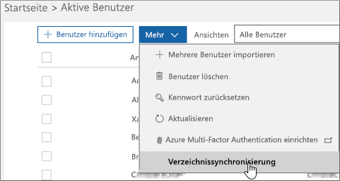

# Planen der Verzeichnissynchronisierung für Office 365
Office 365 verwendet Benutzer Cloud-basierten Identity Management Service Azure Active Directory zum Verwalten von Benutzern. Sie können auch die lokale Active Directory mit Azure AD integrieren, durch die Synchronisierung Ihrer lokalen Umgebung mit Office 365. Nach dem Synchronisierung einrichten können Sie haben ihre Benutzerauthentifizierung in Azure AD oder in Ihrem lokalen Verzeichnis stattfinden soll.
  
## Office 365 Directory-Synchronisierung
Sie können entweder synchronisierten Identität oder Identitätsverbund zwischen Ihrer lokalen Organisation und Office 365 verwenden. Mit synchronisierten Identität Sie Ihre lokalen Benutzer verwalten, und sie werden von Azure Active Directory, wenn sie das gleiche Kennwort in der Cloud als lokale verwenden, authentifiziert. Dies ist die am häufigsten verwendeten Directory Synchronization Szenario. Pass-Through-Authentifizierung oder Federated Identity, können Sie Ihre lokalen Benutzer zu verwalten, und sie von Ihrem lokalen Verzeichnis authentifiziert werden. Identitätsverbund erfordert eine zusätzliche Konfiguration und ermöglicht es Benutzern nur einmal anmelden. Weitere Informationen finden Sie [Grundlegendes zu Office 365-Identität und Azure Active Directory](about-office-365-identity.md).
  
## Upgrade von Windows Azure Active Directory-Synchronisierung (DirSync) auf Azure Active Directory verbinden möchten?
Wenn Sie derzeit DirSync verwenden und aktualisieren möchten, head über auf [azure.com](https://azure.com) für [Aktualisierungsinformationen zu erhalten](https://go.microsoft.com/fwlink/p/?LinkId=733240).
  
## Erforderliche Komponenten für Azure Active Directory verbinden
Sie erhalten eine Testversion zu Azure AD mit Ihrem Office 365-Abonnement. Wenn Sie verzeichnissynchronisierung einrichten, werden Sie Azure Active Directory verbinden auf einem lokalen Servern installieren.
  
Für Office 365 benötigen Sie:
  
- Überprüfen Sie Ihre lokale Domäne (das Verfahren führt Sie durch diese).
- Haben Sie [Administratorrollen in Office 365 für Unternehmen zuweisen](https://support.office.com/article/EAC4D046-1AFD-4F1A-85FC-8219C79E1504) von Berechtigungen für Ihre Office 365-Mandanten, und klicken Sie mit der lokalen Active Directory. 
    
Für den lokalen Server, den Azure AD-Connect-Installation, benötigen Sie die folgende Software:
  
|**Betriebssystem des Servers**|**Weitere Software**|
|:-----|:-----|
|**Windows Server 2012 R2** | -PowerShell standardmäßig installiert ist, ist keine Aktion erforderlich.    -Net 4.5.1 und spätere Versionen werden über Windows Update angeboten. Stellen Sie sicher, dass Sie die neuesten Updates auf Windows Server in der Systemsteuerung installiert haben. |
|**Windows Server 2008 R2 mit Service Pack 1 (SP1)** oder **WindowsServer 2012** | -Die neueste Version von PowerShell ist in Windows Management Framework 4.0 verfügbar. Suchen sie im [Microsoft Download Center](https://go.microsoft.com/fwlink/p/?LinkId=717996).  -.net 4.5.1 und spätere Versionen stehen im [Microsoft Download Center](https://go.microsoft.com/fwlink/p/?LinkId=717996). |
|**Windows Server 2008** | -Die neueste unterstützte Version von PowerShell steht in Windows Management Framework 3.0, [Microsoft Download](https://go.microsoft.com/fwlink/p/?LinkId=717996)Center zur Verfügung.    -.net 4.5.1 und spätere Versionen stehen im [Microsoft Download Center](https://go.microsoft.com/fwlink/p/?LinkId=717996). |
   
> [!NOTE]
> Wenn Sie Azure Active Directory DirSync verwenden, ist die maximale Anzahl Mitglieder einer Verteilergruppe, die aus der lokalen Active Directory mit Azure Active Directory synchronisiert werden können 15.000. Für Azure Active Directory verbinden wird diese Nummer 50.000. 
  
Lesen Sie [erforderlichen Komponenten für Azure Active Directory verbinden](https://go.microsoft.com/fwlink/p/?LinkId=716896), sorgfältiger Hardware, Software, Konto und erforderliche Berechtigungen, Anforderungen an SSL-Zertifikate und Objekt Grenzwerte für Azure Active Directory verbinden um zu überprüfen.
  
Sie können ferner den Azure AD-Connect [Version Versionsgeschichte](https://go.microsoft.com/fwlink/p/?LinkId=733238) um finden Sie unter Was ist enthalten und in jeder Version behobenen. 

## Directory-Synchronisierung einrichten
1. Melden Sie sich bei Office 365 Administrationscenter, und wählen Sie **Benutzer** \> **Aktive Benutzer** in der linken Navigationsleiste. 
2. Wählen Sie in der Office 365 Administrationscenter auf der Seite **aktive Benutzer** ** mehr ** \> **Directory-Synchronisierung**.
    
    
  
3. Wählen Sie auf der Seite **Vorbereitung von Active Directory** **Tool herunterladen Microsoft Azure Active Directory Connect** -Link für den Einstieg. Weitere Informationen zu den Installationsvorgang Azure Active Directory verbinden finden Sie unter [Azure AD-Connect und Azure Active Directory verbinden Health Installationsübersicht](https://docs.microsoft.com/azure/active-directory/hybrid/how-to-connect-install-roadmap).
    
## Synchronisierte Benutzern Lizenzen zuweisen
Nachdem Sie Ihre Benutzer zu Office 365 synchronisiert haben, sie erstellt werden, aber Sie müssen für diese Lizenzen zuweisen, sodass diese Office 365-Features, wie Mail verwenden können. Anweisungen finden Sie unter [Zuweisen von Lizenzen für Benutzer in Office 365 für Unternehmen](https://support.office.com/article/997596b5-4173-4627-b915-36abac6786dc).
    
## Einrichtung Domänen fertig gestellt
Führen Sie die Schritte in [Erstellen von DNS-Einträge für Office 365 beim Verwalten Ihrer DNS-Einträge](https://support.office.com/article/b0f3fdca-8a80-4e8e-9ef3-61e8a2a9ab23) auf Fertig stellen, wie Sie Ihre Domänen einrichten.