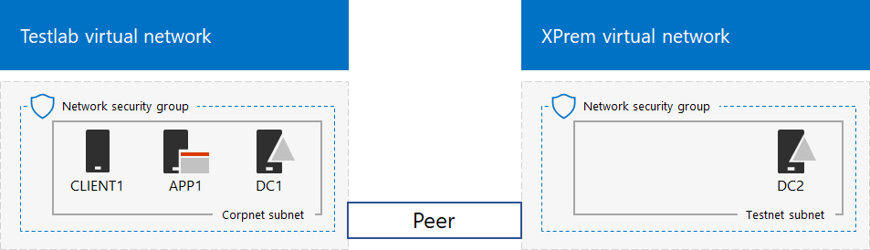
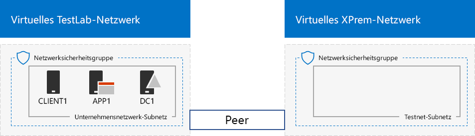

# <a name="simulated-cross-premises-virtual-network-in-azure"></a>Simuliertes standortübergreifendes virtuelles Netzwerk in Azure

 **Zusammenfassung:** Erstellen Sie ein simuliertes standortübergreifendes virtuelles Netzwerk in Microsoft Azure als Entwicklungs-/Testumgebung.
  
Dieser Artikel führt Sie schrittweise durch das Erstellen einer simulierten Hybrid-Cloudumgebung mit Microsoft Azure unter Verwendung von zwei virtuellen Azure-Netzwerken. Nachfolgend sehen Sie die daraus resultierende Konfiguration. 
  

  
Dies simuliert eine Hybrid Cloud-Produktionsumgebung in Azure IaaS und besteht aus Folgendem:
  
- Einem simulierten und vereinfachten lokalen Netzwerk, das in einem virtuellen Azure-Netzwerk (dem virtuellen TestLab-Netzwerk) gehostet wird.
    
- Einem simuliertem standortübergreifenden virtuellen Netzwerk, das in Azure gehostet wird (XPrem).
    
- Einer VNet-Peeringbeziehung zwischen den beiden virtuellen Netzwerken.
    
- Einem sekundären Domänencontroller im virtuellen XPrem-Netzwerk.
    
Dies liefert eine Grundlage und einen Einstiegspunkt für Folgendes: 
  
- Entwickeln und Testen von Anwendungen in einer simulierten Hybrid Cloud-Umgebung in Azure IaaS.
    
- Erstellen von Testkonfigurationen von Computer, einige innerhalb des virtuellen TestLab-Netzwerks und einige innerhalb des virtuellen XPrem-Netzwerks, um Hybrid Cloud-basierte IT-Arbeitslasten zu simulieren.
    
Es gibt drei Hauptphasen bei der Einrichtung dieser Entwicklungs-/Testumgebung:
  
1. Konfigurieren des virtuellen TestLab-Netzwerks
    
2. Erstellen des standortübergreifenden virtuellen Netzwerks
    
3. Konfigurieren von DC2
    
> [!NOTE]
> Diese Konfiguration erfordert ein kostenpflichtiges Abonnement für Azure. 
  

  
> [!TIP]
> Klicken Sie [hier](http://aka.ms/catlgstack), um eine visuelle Darstellung aller Artikel im Stapel der Testumgebungsanleitungen in der Microsoft Cloud zu erhalten.
  
## <a name="phase-1-configure-the-testlab-virtual-network"></a>Phase 1: Konfigurieren des virtuellen TestLab-Netzwerks

Verwenden Sie die Anweisungen unter [Basiskonfiguration der Entwicklungs-/Testumgebung](base-configuration-dev-test-environment.md), um die Computer DC1, APP1 und CLIENT1 im virtuellen Azure-Netzwerk mit dem Namen „TestLab“ zu konfigurieren. 
  
Dies ist Ihre aktuelle Konfiguration. 
  

  
## <a name="phase-2-create-the-xprem-virtual-network"></a>Phase 2: Erstellen des virtuellen XPrem-Netzwerks

In dieser Phase erstellen und konfigurieren Sie das neue virtuelle XPrem-Netzwerk und verbinden es dann über VNet-Peering mit dem virtuellen TestLab-Netzwerk.
  
Starten Sie zunächst eine Azure PowerShell-Eingabeaufforderung auf dem lokalen Computer.
  
> [!NOTE]
> In den folgenden Befehlssätzen wird die aktuelle Version von Azure PowerShell verwendet. Informationen dazu finden Sie unter [Erste Schritte mit Azure PowerShell-Cmdlets](https://docs.microsoft.com/de-DE/powershell/azureps-cmdlets-docs/). 
  
Melden Sie sich bei Ihrem Azure-Konto mit diesem Befehl an.
  
```
Login-AzureRMAccount
```

> [!TIP]
> Klicken Sie [hier](https://gallery.technet.microsoft.com/PowerShell-commands-for-7844edd0), um eine Textdatei zu erhalten, die alle PowerShell-Befehle in diesem Artikel enthält.
  
Rufen Sie den Namen Ihres Abonnements mithilfe des folgenden Befehls ab.
  
```
Get-AzureRMSubscription | Sort Name | Select Name
```

Tragen Sie Ihr Azure-Abonnement ein. Ersetzen Sie alles innerhalb der Anführungszeichen, einschließlich der Zeichen „\<“ und „>“, durch den entsprechenden Namen.
  
```
$subscrName="<subscription name>"
Get-AzureRmSubscription -SubscriptionName $subscrName | Select-AzureRmSubscription
```

Erstellen Sie als Nächstes das virtuelle XPrem-Netzwerk, und schützen Sie es mithilfe dieser Befehle mit einer Netzwerksicherheitsgruppe.
  
```
$rgName="<name of the resource group that you used for your TestLab virtual network>"
$locName=(Get-AzureRmResourceGroup -Name $rgName).Location
$Testnet=New-AzureRMVirtualNetworkSubnetConfig -Name "Testnet" -AddressPrefix 192.168.0.0/24
New-AzureRMVirtualNetwork -Name "XPrem" -ResourceGroupName $rgName -Location $locName -AddressPrefix 192.168.0.0/16 -Subnet $Testnet -DNSServer 10.0.0.4
$rule1=New-AzureRMNetworkSecurityRuleConfig -Name "RDPTraffic" -Description "Allow RDP to all VMs on the subnet" -Access Allow -Protocol Tcp -Direction Inbound -Priority 100 -SourceAddressPrefix Internet -SourcePortRange * -DestinationAddressPrefix * -DestinationPortRange 3389
New-AzureRMNetworkSecurityGroup -Name "Testnet" -ResourceGroupName $rgName -Location $locName -SecurityRules $rule1
$vnet=Get-AzureRMVirtualNetwork -ResourceGroupName $rgName -Name XPrem
$nsg=Get-AzureRMNetworkSecurityGroup -Name "Testnet" -ResourceGroupName $rgName
Set-AzureRMVirtualNetworkSubnetConfig -VirtualNetwork $vnet -Name "Testnet" -AddressPrefix 192.168.0.0/24 -NetworkSecurityGroup $nsg
```

Anschließend erstellen Sie mit diesen Befehlen die VNet-Peeringbeziehung zwischen dem virtuellen TestLab- und XPrem-Netzwerk.
  
```
$rgName="<name of the resource group that you used for your TestLab virtual network>"
$vnet1=Get-AzureRmVirtualNetwork -ResourceGroupName $rgName -Name TestLab
$vnet2=Get-AzureRmVirtualNetwork -ResourceGroupName $rgName -Name XPrem
Add-AzureRmVirtualNetworkPeering -Name TestLab2XPrem -VirtualNetwork $vnet1 -RemoteVirtualNetworkId $vnet2.Id
Add-AzureRmVirtualNetworkPeering -Name XPrem2TestLab -VirtualNetwork $vnet2 -RemoteVirtualNetworkId $vnet1.Id
```

Dies ist Ihre aktuelle Konfiguration. 
  

  
## <a name="phase-3-configure-dc2"></a>Phase 3: Konfigurieren von DC2

In dieser Phase erstellen Sie den virtuellen Computer DC2 im virtuellen XPrem-Netzwerk und konfigurieren ihn dann als Replikatdomänencontroller.
  
Erstellen Sie zunächst einen virtuellen Computer für DC2. Führen Sie diese Befehle an der Azure PowerShell-Eingabeaufforderung auf dem lokalen Computer aus.
  
```
$rgName="<your resource group name>"
$locName=(Get-AzureRmResourceGroup -Name $rgName).Location
$vnet=Get-AzureRMVirtualNetwork -Name XPrem -ResourceGroupName $rgName
$pip=New-AzureRMPublicIpAddress -Name DC2-PIP -ResourceGroupName $rgName -Location $locName -AllocationMethod Dynamic
$nic=New-AzureRMNetworkInterface -Name DC2-NIC -ResourceGroupName $rgName -Location $locName -SubnetId $vnet.Subnets[0].Id -PublicIpAddressId $pip.Id -PrivateIpAddress 192.168.0.4
$vm=New-AzureRMVMConfig -VMName DC2 -VMSize Standard_A1
$cred=Get-Credential -Message "Type the name and password of the local administrator account for DC2."
$vm=Set-AzureRMVMOperatingSystem -VM $vm -Windows -ComputerName DC2 -Credential $cred -ProvisionVMAgent -EnableAutoUpdate
$vm=Set-AzureRMVMSourceImage -VM $vm -PublisherName MicrosoftWindowsServer -Offer WindowsServer -Skus 2016-Datacenter -Version "latest"
$vm=Add-AzureRMVMNetworkInterface -VM $vm -Id $nic.Id
$vm=Set-AzureRmVMOSDisk -VM $vm -Name "DC2-OS" -DiskSizeInGB 128 -CreateOption FromImage -StorageAccountType "Standard_LRS"
$diskConfig=New-AzureRmDiskConfig -AccountType "Standard_LRS" -Location $locName -CreateOption Empty -DiskSizeGB 20
$dataDisk1=New-AzureRmDisk -DiskName "DC2-DataDisk1" -Disk $diskConfig -ResourceGroupName $rgName
$vm=Add-AzureRmVMDataDisk -VM $vm -Name "DC2-DataDisk1" -CreateOption Attach -ManagedDiskId $dataDisk1.Id -Lun 1
New-AzureRMVM -ResourceGroupName $rgName -Location $locName -VM $vm
```

Stellen Sie dann über das [Azure-Portal](https://portal.azure.com) unter Verwendung des lokalen Administratorkontonamens und Kennworts eine Verbindung zu dem neuen virtuellen Compter DC2 her. 
  
Konfigurieren Sie als Nächstes eine Window-Firewallregel, um Verkehr für grundlegende Konnektivitätstests zuzulassen. Führen Sie diese Befehle an einer Windows PowerShell-Eingabeaufforderung auf Administratorebene für DC2 aus. 
  
```
Set-NetFirewallRule -DisplayName "File and Printer Sharing (Echo Request - ICMPv4-In)" -enabled True
ping dc1.corp.contoso.com
```

Der Ping-Befehl sollte zu vier erfolgreichen Antworten von IP-Adresse 10.0.0.4 führen. Dies ist ein Test für Datenverkehr über die VNet-Peeringbeziehung. 
  
Im nächsten Schritt führen Sie diesen Befehl über die Windows PowerShell-Eingabeaufforderung auf DC2 aus, um das zusätzliche Datenlaufwerk als neues Volume mit dem Laufwerkbuchstaben „F:“ hinzuzufügen.
  
```
Get-Disk | Where PartitionStyle -eq "RAW" | Initialize-Disk -PartitionStyle MBR -PassThru | New-Partition -AssignDriveLetter -UseMaximumSize | Format-Volume -FileSystem NTFS -NewFileSystemLabel "WSAD Data"
```

Konfigurieren Sie als Nächstes DC2 als Replikatdomänencontroller für die Domäne „corp.contoso.com“. Führen Sie diese Befehle an der Windows PowerShell-Eingabeaufforderung auf Administratorebene für DC2 aus.
  
```
Install-WindowsFeature AD-Domain-Services -IncludeManagementTools
Install-ADDSDomainController -Credential (Get-Credential CORP\User1) -DomainName "corp.contoso.com" -InstallDns:$true -DatabasePath "F:\NTDS" -LogPath "F:\Logs" -SysvolPath "F:\SYSVOL"
```

Beachten Sie, dass Sie aufgefordert werden, sowohl das Kennwort für CORP\\CORPUser1 als auch ein DSRM-Kennwort (Directory Services Restore Mode) anzugeben und DC2 neu zu starten.  
  
Da das virtuelle XPrem-Netzwerk nun über seinen eigenen DNS-Server (DC2) verfügt, müssen Sie das virtuelle XPrem-Netzwerk so konfigurieren, dass dieser DNS-Server verwendet wird. Führen Sie diese Befehle an der Azure PowerShell-Eingabeaufforderung auf dem lokalen Computer aus.
  
```
$vnet=Get-AzureRmVirtualNetwork -ResourceGroupName $rgName -name "XPrem"
$vnet.DhcpOptions.DnsServers="192.168.0.4" 
Set-AzureRmVirtualNetwork -VirtualNetwork $vnet
Restart-AzureRmVM -ResourceGroupName $rgName -Name "DC2"
```

Stellen Sie über das Azure-Portal auf dem lokalen Computer eine Verbindung mit DC1 mit den Anmeldeinformationen für CORP\\CORPUser1 her. Um die Domäne CORP so zu konfigurieren, dass Computer und Benutzer ihre lokalen Domänencontroller für die Authentifizierung verwenden, führen Sie diese Befehle an einer Windows PowerShell-Befehlszeile auf Administratorebene für DC1 aus.
  
```
New-ADReplicationSite -Name "TestLab" 
New-ADReplicationSite -Name "XPrem"
New-ADReplicationSubnet -Name "10.0.0.0/8" -Site "TestLab"
New-ADReplicationSubnet -Name "192.168.0.0/16" -Site "XPrem"
```

Dies ist Ihre aktuelle Konfiguration. 
  

  
Ihre simulierte Hybrid Cloud-Umgebung für Azure kann nun getestet werden.
  
## <a name="next-step"></a>Nächster Schritt

Verwenden Sie diese Entwicklungs-/Testumgebung, um eine [in Azure gehostete SharePoint Server 2016-Intranetfarm](https://technet.microsoft.com/library/mt806351%28v=office.16%29.aspx) zu simulieren.
  
## <a name="see-also"></a>Siehe auch

[Basiskonfiguration der Entwicklungs-/Testumgebung](base-configuration-dev-test-environment.md)
  
[Office 365-Entwicklungs-/Testumgebung](office-365-dev-test-environment.md)
  
[DirSync für die Office 365-Entwicklungs-/Testumgebung](dirsync-for-your-office-365-dev-test-environment.md)
  
[Cloud App Security für Ihre Office 365-Entwicklungs-/Testumgebung](cloud-app-security-for-your-office-365-dev-test-environment.md)
  
[Advanced Threat Protection für die Office 365-Entwicklungs-/Testumgebung](advanced-threat-protection-for-your-office-365-dev-test-environment.md)
  
[Cloudakzeptanz und Hybridlösungen](cloud-adoption-and-hybrid-solutions.md)


