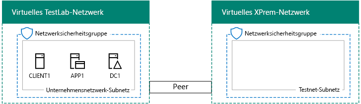

# <a name="simulated-cross-premises-virtual-network-in-azure"></a><span data-ttu-id="b4e9a-103">Simuliertes standortübergreifendes virtuelles Netzwerk in Azure</span><span class="sxs-lookup"><span data-stu-id="b4e9a-103">Simulated cross-premises virtual network in Azure</span></span>

 <span data-ttu-id="b4e9a-104">**Zusammenfassung:** Erstellen eines virtuellen Netzwerks simulierten standortübergreifenden in Microsoft Azure als Test-/Umgebung.</span><span class="sxs-lookup"><span data-stu-id="b4e9a-104">**Summary:** Create a simulated cross-premises virtual network in Microsoft Azure as a dev/test environment.</span></span>
  
<span data-ttu-id="b4e9a-p101">Dieser Artikel führt Sie schrittweise durch das Erstellen einer simulierten Hybrid-Cloudumgebung mit Microsoft Azure unter Verwendung von zwei virtuellen Azure-Netzwerken. Nachfolgend sehen Sie die daraus resultierende Konfiguration.  </span><span class="sxs-lookup"><span data-stu-id="b4e9a-p101">This article steps you through creating a simulated hybrid cloud environment with Microsoft Azure using two Azure virtual networks. Here is the resulting configuration.</span></span> 
  

  
<span data-ttu-id="b4e9a-108">Dies simuliert eine Hybrid Cloud-Produktionsumgebung in Azure IaaS und besteht aus Folgendem:</span><span class="sxs-lookup"><span data-stu-id="b4e9a-108">This simulates an Azure IaaS hybrid cloud production environment and consists of:</span></span>
  
- <span data-ttu-id="b4e9a-109">	Einem simulierten und vereinfachten lokalen Netzwerk, das in einem virtuellen Azure-Netzwerk (dem virtuellen TestLab-Netzwerk) gehostet wird.</span><span class="sxs-lookup"><span data-stu-id="b4e9a-109">A simulated and simplified on-premises network hosted in an Azure virtual network (the TestLab virtual network).</span></span>
    
- <span data-ttu-id="b4e9a-110">	Einem simuliertem standortübergreifenden virtuellen Netzwerk, das in Azure gehostet wird (XPrem).</span><span class="sxs-lookup"><span data-stu-id="b4e9a-110">A simulated cross-premises virtual network hosted in Azure (XPrem).</span></span>
    
- <span data-ttu-id="b4e9a-111">	Einer VNet-Peeringbeziehung zwischen den beiden virtuellen Netzwerken.</span><span class="sxs-lookup"><span data-stu-id="b4e9a-111">A VNet peering relationship between the two virtual networks.</span></span>
    
- <span data-ttu-id="b4e9a-112">	Einem sekundären Domänencontroller im virtuellen XPrem-Netzwerk.</span><span class="sxs-lookup"><span data-stu-id="b4e9a-112">A secondary domain controller in the XPrem virtual network.</span></span>
    
<span data-ttu-id="b4e9a-113">Dies liefert eine Grundlage und einen Einstiegspunkt für Folgendes: </span><span class="sxs-lookup"><span data-stu-id="b4e9a-113">This provides a basis and common starting point from which you can:</span></span> 
  
- <span data-ttu-id="b4e9a-114">	Entwickeln und Testen von Anwendungen in einer simulierten Hybrid Cloud-Umgebung in Azure IaaS.</span><span class="sxs-lookup"><span data-stu-id="b4e9a-114">Develop and test applications in a simulated Azure IaaS hybrid cloud environment.</span></span>
    
- <span data-ttu-id="b4e9a-115">	Erstellen von Testkonfigurationen von Computer, einige innerhalb des virtuellen TestLab-Netzwerks und einige innerhalb des virtuellen XPrem-Netzwerks, um Hybrid Cloud-basierte IT-Arbeitslasten zu simulieren.</span><span class="sxs-lookup"><span data-stu-id="b4e9a-115">Create test configurations of computers, some within the TestLab virtual network and some within the XPrem virtual network, to simulate hybrid cloud-based IT workloads.</span></span>
    
<span data-ttu-id="b4e9a-116">Es gibt drei Hauptphasen bei der Einrichtung dieser Entwicklungs-/Testumgebung:</span><span class="sxs-lookup"><span data-stu-id="b4e9a-116">There are three major phases to setting up this dev/test environment:</span></span>
  
1. <span data-ttu-id="b4e9a-117">	Konfigurieren des virtuellen TestLab-Netzwerks</span><span class="sxs-lookup"><span data-stu-id="b4e9a-117">Configure the TestLab virtual network.</span></span>
    
2. <span data-ttu-id="b4e9a-118">Erstellen des standortübergreifenden virtuellen Netzwerks</span><span class="sxs-lookup"><span data-stu-id="b4e9a-118">Create the cross-premises virtual network.</span></span>
    
3. <span data-ttu-id="b4e9a-119">Konfigurieren von DC2</span><span class="sxs-lookup"><span data-stu-id="b4e9a-119">Configure DC2.</span></span>
    
> [!NOTE]
> <span data-ttu-id="b4e9a-120">Diese Konfiguration erfordert ein kostenpflichtiges Abonnement für Azure.</span><span class="sxs-lookup"><span data-stu-id="b4e9a-120">This configuration requires a paid Azure subscription.</span></span> 
  

  
> [!TIP]
> <span data-ttu-id="b4e9a-122">Klicken Sie [hier](http://aka.ms/catlgstack), um eine visuelle Darstellung aller Artikel im Stapel der Testumgebungsanleitungen in der Microsoft Cloud zu erhalten.</span><span class="sxs-lookup"><span data-stu-id="b4e9a-122">Click [here](http://aka.ms/catlgstack) for a visual map to all the articles in the One Microsoft Cloud Test Lab Guide stack.</span></span>
  
## <a name="phase-1-configure-the-testlab-virtual-network"></a><span data-ttu-id="b4e9a-123">Phase 1: Konfigurieren des virtuellen TestLab-Netzwerks</span><span class="sxs-lookup"><span data-stu-id="b4e9a-123">Phase 1: Configure the TestLab virtual network</span></span>

<span data-ttu-id="b4e9a-124">Verwenden Sie die Anweisungen in [Basiskonfiguration Test-/Umgebung](base-configuration-dev-test-environment.md) so konfigurieren Sie die Computer DC1, APP1 und CLIENT1 in der Azure-virtuelles Netzwerk mit dem Namen Testlabor.</span><span class="sxs-lookup"><span data-stu-id="b4e9a-124">Use the instructions in [Base Configuration dev/test environment](base-configuration-dev-test-environment.md) to configure the DC1, APP1, and CLIENT1 computers in the Azure virtual network named TestLab.</span></span>
  
<span data-ttu-id="b4e9a-125">Dies ist Ihre aktuelle Konfiguration.</span><span class="sxs-lookup"><span data-stu-id="b4e9a-125">This is your current configuration.</span></span> 
  

  
## <a name="phase-2-create-the-xprem-virtual-network"></a><span data-ttu-id="b4e9a-127">Phase 2: Erstellen des virtuellen XPrem-Netzwerks</span><span class="sxs-lookup"><span data-stu-id="b4e9a-127">Phase 2: Create the XPrem virtual network</span></span>

<span data-ttu-id="b4e9a-128">In dieser Phase erstellen und konfigurieren Sie das neue virtuelle XPrem-Netzwerk und verbinden es dann über VNet-Peering mit dem virtuellen TestLab-Netzwerk.</span><span class="sxs-lookup"><span data-stu-id="b4e9a-128">In this phase, you create and configure the new XPrem virtual network and then connect it to the TestLab virtual network with VNet peering.</span></span>
  
<span data-ttu-id="b4e9a-129">Starten Sie zunächst eine Azure PowerShell-Eingabeaufforderung auf dem lokalen Computer.</span><span class="sxs-lookup"><span data-stu-id="b4e9a-129">First, start an Azure PowerShell prompt on your local computer.</span></span>
  
> [!NOTE]
> <span data-ttu-id="b4e9a-p102">[!HINWEIS] In den folgenden Befehlssätzen wird die aktuelle Version von Azure PowerShell verwendet. Informationen dazu finden Sie unter [Get started with Azure PowerShell cmdlets](https://docs.microsoft.com/en-us/powershell/azureps-cmdlets-docs/).</span><span class="sxs-lookup"><span data-stu-id="b4e9a-p102">The following command sets use the latest version of Azure PowerShell. See [Get started with Azure PowerShell cmdlets](https://docs.microsoft.com/en-us/powershell/azureps-cmdlets-docs/).</span></span> 
  
<span data-ttu-id="b4e9a-132">Melden Sie sich mit dem folgenden Befehl bei Ihrem Azure-Konto an.</span><span class="sxs-lookup"><span data-stu-id="b4e9a-132">Sign in to your Azure account with the following command.</span></span>
  
```
Login-AzureRMAccount
```

> [!TIP]
> <span data-ttu-id="b4e9a-133">[!TIPP] Klicken Sie [hier](https://gallery.technet.microsoft.com/PowerShell-commands-for-7844edd0), um eine Textdatei zu erhalten, die alle PowerShell-Befehle in diesem Artikel enthält.</span><span class="sxs-lookup"><span data-stu-id="b4e9a-133">Click [here](https://gallery.technet.microsoft.com/PowerShell-commands-for-7844edd0) to get a text file that contains all of the PowerShell commands in this article.</span></span>
  
<span data-ttu-id="b4e9a-134">Rufen Sie den Namen Ihres Abonnements mithilfe des folgenden Befehls ab.</span><span class="sxs-lookup"><span data-stu-id="b4e9a-134">Get your subscription name using the following command.</span></span>
  
```
Get-AzureRMSubscription | Sort Name | Select Name
```

<span data-ttu-id="b4e9a-p103">Legen Sie Ihre Azure-Abonnement. Ersetzen Sie alles innerhalb der Anführungszeichen, einschließlich der \< und > Zeichen, mit den richtigen Namen.</span><span class="sxs-lookup"><span data-stu-id="b4e9a-p103">Set your Azure subscription. Replace everything within the quotes, including the \< and > characters, with the correct names.</span></span>
  
```
$subscrName="<subscription name>"
Get-AzureRmSubscription -SubscriptionName $subscrName | Select-AzureRmSubscription
```

<span data-ttu-id="b4e9a-137">Erstellen Sie als Nächstes das virtuelle XPrem-Netzwerk, und schützen Sie es mithilfe dieser Befehle mit einer Netzwerksicherheitsgruppe.</span><span class="sxs-lookup"><span data-stu-id="b4e9a-137">Next, create the XPrem virtual network and protect it with a network security group with these commands.</span></span>
  
```
$rgName="<name of the resource group that you used for your TestLab virtual network>"
$locName=(Get-AzureRmResourceGroup -Name $rgName).Location
$Testnet=New-AzureRMVirtualNetworkSubnetConfig -Name "Testnet" -AddressPrefix 192.168.0.0/24
New-AzureRMVirtualNetwork -Name "XPrem" -ResourceGroupName $rgName -Location $locName -AddressPrefix 192.168.0.0/16 -Subnet $Testnet -DNSServer 10.0.0.4
$rule1=New-AzureRMNetworkSecurityRuleConfig -Name "RDPTraffic" -Description "Allow RDP to all VMs on the subnet" -Access Allow -Protocol Tcp -Direction Inbound -Priority 100 -SourceAddressPrefix Internet -SourcePortRange * -DestinationAddressPrefix * -DestinationPortRange 3389
New-AzureRMNetworkSecurityGroup -Name "Testnet" -ResourceGroupName $rgName -Location $locName -SecurityRules $rule1
$vnet=Get-AzureRMVirtualNetwork -ResourceGroupName $rgName -Name XPrem
$nsg=Get-AzureRMNetworkSecurityGroup -Name "Testnet" -ResourceGroupName $rgName
Set-AzureRMVirtualNetworkSubnetConfig -VirtualNetwork $vnet -Name "Testnet" -AddressPrefix 192.168.0.0/24 -NetworkSecurityGroup $nsg
```

<span data-ttu-id="b4e9a-138">Anschließend erstellen Sie mit diesen Befehlen die VNet-Peeringbeziehung zwischen dem virtuellen TestLab- und XPrem-Netzwerk.</span><span class="sxs-lookup"><span data-stu-id="b4e9a-138">Next, you create the VNet peering relationship between the TestLab and XPrem VNets with these commands.</span></span>
  
```
$rgName="<name of the resource group that you used for your TestLab virtual network>"
$vnet1=Get-AzureRmVirtualNetwork -ResourceGroupName $rgName -Name TestLab
$vnet2=Get-AzureRmVirtualNetwork -ResourceGroupName $rgName -Name XPrem
Add-AzureRmVirtualNetworkPeering -Name TestLab2XPrem -VirtualNetwork $vnet1 -RemoteVirtualNetworkId $vnet2.Id
Add-AzureRmVirtualNetworkPeering -Name XPrem2TestLab -VirtualNetwork $vnet2 -RemoteVirtualNetworkId $vnet1.Id
```

<span data-ttu-id="b4e9a-139">Dies ist Ihre aktuelle Konfiguration.</span><span class="sxs-lookup"><span data-stu-id="b4e9a-139">This is your current configuration.</span></span> 
  

  
## <a name="phase-3-configure-dc2"></a><span data-ttu-id="b4e9a-141">Phase 3: Konfigurieren von DC2</span><span class="sxs-lookup"><span data-stu-id="b4e9a-141">Phase 3: Configure DC2</span></span>

<span data-ttu-id="b4e9a-142">In dieser Phase erstellen Sie den virtuellen Computer DC2 im virtuellen XPrem-Netzwerk und konfigurieren ihn dann als Replikatdomänencontroller.</span><span class="sxs-lookup"><span data-stu-id="b4e9a-142">In this phase, you create the DC2 virtual machine in the XPrem virtual network and then configure it as a replica domain controller.</span></span>
  
<span data-ttu-id="b4e9a-p104">Erstellen Sie zunächst einen virtuellen Computer für DC2. Führen Sie diese Befehle an der Azure PowerShell-Eingabeaufforderung auf dem lokalen Computer aus.</span><span class="sxs-lookup"><span data-stu-id="b4e9a-p104">First, create a virtual machine for DC2. Run these commands at the Azure PowerShell command prompt on your local computer.</span></span>
  
```
$rgName="<your resource group name>"
$locName=(Get-AzureRmResourceGroup -Name $rgName).Location
$vnet=Get-AzureRMVirtualNetwork -Name XPrem -ResourceGroupName $rgName
$pip=New-AzureRMPublicIpAddress -Name DC2-PIP -ResourceGroupName $rgName -Location $locName -AllocationMethod Dynamic
$nic=New-AzureRMNetworkInterface -Name DC2-NIC -ResourceGroupName $rgName -Location $locName -SubnetId $vnet.Subnets[0].Id -PublicIpAddressId $pip.Id -PrivateIpAddress 192.168.0.4
$vm=New-AzureRMVMConfig -VMName DC2 -VMSize Standard_A1
$cred=Get-Credential -Message "Type the name and password of the local administrator account for DC2."
$vm=Set-AzureRMVMOperatingSystem -VM $vm -Windows -ComputerName DC2 -Credential $cred -ProvisionVMAgent -EnableAutoUpdate
$vm=Set-AzureRMVMSourceImage -VM $vm -PublisherName MicrosoftWindowsServer -Offer WindowsServer -Skus 2016-Datacenter -Version "latest"
$vm=Add-AzureRMVMNetworkInterface -VM $vm -Id $nic.Id
$vm=Set-AzureRmVMOSDisk -VM $vm -Name "DC2-OS" -DiskSizeInGB 128 -CreateOption FromImage -StorageAccountType "StandardLRS"
$diskConfig=New-AzureRmDiskConfig -AccountType "StandardLRS" -Location $locName -CreateOption Empty -DiskSizeGB 20
$dataDisk1=New-AzureRmDisk -DiskName "DC2-DataDisk1" -Disk $diskConfig -ResourceGroupName $rgName
$vm=Add-AzureRmVMDataDisk -VM $vm -Name "DC2-DataDisk1" -CreateOption Attach -ManagedDiskId $dataDisk1.Id -Lun 1
New-AzureRMVM -ResourceGroupName $rgName -Location $locName -VM $vm
```

<span data-ttu-id="b4e9a-145">Schließen Sie dann den neuen DC2 virtuellen Computer über das [Portal Azure](https://portal.azure.com) mithilfe von dessen lokaler Administrator-Kontonamen und das Kennwort.</span><span class="sxs-lookup"><span data-stu-id="b4e9a-145">Next, connect to the new DC2 virtual machine from the [Azure portal](https://portal.azure.com) using its local administrator account name and password.</span></span>
  
<span data-ttu-id="b4e9a-p105">Konfigurieren Sie als Nächstes eine Window-Firewallregel, um Verkehr für grundlegende Konnektivitätstests zuzulassen. Führen Sie diese Befehle an einer Windows PowerShell-Eingabeaufforderung auf Administratorebene für DC2 aus. </span><span class="sxs-lookup"><span data-stu-id="b4e9a-p105">Next, configure a Windows Firewall rule to allow traffic for basic connectivity testing. From an administrator-level Windows PowerShell command prompt on DC2, run these commands.</span></span> 
  
```
Set-NetFirewallRule -DisplayName "File and Printer Sharing (Echo Request - ICMPv4-In)" -enabled True
ping dc1.corp.contoso.com
```

<span data-ttu-id="b4e9a-p106">Der Ping-Befehl sollte zu vier erfolgreichen Antworten von IP-Adresse 10.0.0.4 führen. Dies ist ein Test für Datenverkehr über die VNet-Peeringbeziehung. </span><span class="sxs-lookup"><span data-stu-id="b4e9a-p106">The ping command should result in four successful replies from IP address 10.0.0.4. This is a test of traffic across the VNet peering relationship.</span></span> 
  
<span data-ttu-id="b4e9a-150">Fügen Sie als Nächstes den Datenträger zusätzlicher Daten als neue Volume mit dem Laufwerkbuchstaben F: mit diesem Befehl über die Windows PowerShell-Eingabeaufforderung auf dem Computer DC2.</span><span class="sxs-lookup"><span data-stu-id="b4e9a-150">Next, add the extra data disk as a new volume with the drive letter F: with this command from the Windows PowerShell command prompt on DC2.</span></span>
  
```
Get-Disk | Where PartitionStyle -eq "RAW" | Initialize-Disk -PartitionStyle MBR -PassThru | New-Partition -AssignDriveLetter -UseMaximumSize | Format-Volume -FileSystem NTFS -NewFileSystemLabel "WSAD Data"
```

<span data-ttu-id="b4e9a-p107">Konfigurieren Sie als Nächstes DC2 als Replikatdomänencontroller für die Domäne „corp.contoso.com“. Führen Sie diese Befehle an der Windows PowerShell-Eingabeaufforderung auf Administratorebene für DC2 aus.</span><span class="sxs-lookup"><span data-stu-id="b4e9a-p107">Next, configure DC2 as a replica domain controller for the corp.contoso.com domain. Run these commands from the Windows PowerShell command prompt on DC2.</span></span>
  
```
Install-WindowsFeature AD-Domain-Services -IncludeManagementTools
Install-ADDSDomainController -Credential (Get-Credential CORP\User1) -DomainName "corp.contoso.com" -InstallDns:$true -DatabasePath "F:\NTDS" -LogPath "F:\Logs" -SysvolPath "F:\SYSVOL"
```

<span data-ttu-id="b4e9a-153">Beachten Sie, dass Sie aufgefordert werden, geben Sie sowohl die CORP\\User1 Kennwort und Kennwort Directory Services wiederherstellen Modus (Verzeichnisdienst-Wiederherstellungsmodus) und DC2 neu zu starten.</span><span class="sxs-lookup"><span data-stu-id="b4e9a-153">Note that you are prompted to supply both the CORP\\User1 password and a Directory Services Restore Mode (DSRM) password, and to restart DC2.</span></span> 
  
<span data-ttu-id="b4e9a-p108">Da das virtuelle XPrem-Netzwerk nun über seinen eigenen DNS-Server (DC2) verfügt, müssen Sie das virtuelle XPrem-Netzwerk so konfigurieren, dass dieser DNS-Server verwendet wird. Führen Sie diese Befehle an der Azure PowerShell-Eingabeaufforderung auf dem lokalen Computer aus.</span><span class="sxs-lookup"><span data-stu-id="b4e9a-p108">Now that the XPrem virtual network has its own DNS server (DC2), you must configure the XPrem virtual network to use this DNS server. Run these commands from the Azure PowerShell command prompt on your local computer.</span></span>
  
```
$vnet=Get-AzureRmVirtualNetwork -ResourceGroupName $rgName -name "XPrem"
$vnet.DhcpOptions.DnsServers="192.168.0.4" 
Set-AzureRmVirtualNetwork -VirtualNetwork $vnet
Restart-AzureRmVM -ResourceGroupName $rgName -Name "DC2"
```

<span data-ttu-id="b4e9a-p109">Über das Portal Azure auf Ihrem lokalen Computer Herstellen einer Verbindung mit der CORP DC1 mit\\User1 Anmeldeinformationen. Führen Sie diese Befehle aus, um die Domäne CORP so konfigurieren, dass Computer und Benutzer ihre lokalen Domänencontroller für die Authentifizierung verwenden, eine Windows PowerShell-Eingabeaufforderung auf Administratorebene, auf DC1.</span><span class="sxs-lookup"><span data-stu-id="b4e9a-p109">From the Azure portal on your local computer, connect to DC1 with the CORP\\User1 credentials. To configure the CORP domain so that computers and users use their local domain controller for authentication, run these commands from an administrator-level Windows PowerShell command prompt on DC1.</span></span>
  
```
New-ADReplicationSite -Name "TestLab" 
New-ADReplicationSite -Name "XPrem"
New-ADReplicationSubnet -Name "10.0.0.0/8" -Site "TestLab"
New-ADReplicationSubnet -Name "192.168.0.0/16" -Site "XPrem"
```

<span data-ttu-id="b4e9a-158">Dies ist Ihre aktuelle Konfiguration.</span><span class="sxs-lookup"><span data-stu-id="b4e9a-158">This is your current configuration.</span></span> 
  

  
<span data-ttu-id="b4e9a-160">Ihre simulierte Hybrid Cloud-Umgebung für Azure kann nun getestet werden.</span><span class="sxs-lookup"><span data-stu-id="b4e9a-160">Your simulated Azure hybrid cloud environment is now ready for testing.</span></span>
  
## <a name="next-step"></a><span data-ttu-id="b4e9a-161">Nächster Schritt</span><span class="sxs-lookup"><span data-stu-id="b4e9a-161">Next step</span></span>

<span data-ttu-id="b4e9a-162">Verwenden Sie diese Test-/-Umgebung, können Sie das einer [SharePoint Server 2016 intranetfarm in Azure gehostet](https://technet.microsoft.com/library/mt806351%28v=office.16%29.aspx).</span><span class="sxs-lookup"><span data-stu-id="b4e9a-162">Use this dev/test environment to simulate a [SharePoint Server 2016 intranet farm hosted in Azure](https://technet.microsoft.com/library/mt806351%28v=office.16%29.aspx).</span></span>
  
## <a name="see-also"></a><span data-ttu-id="b4e9a-163">Siehe auch</span><span class="sxs-lookup"><span data-stu-id="b4e9a-163">See Also</span></span>

[<span data-ttu-id="b4e9a-164">Basiskonfiguration der Entwicklungs-/Testumgebung</span><span class="sxs-lookup"><span data-stu-id="b4e9a-164">Base Configuration dev/test environment</span></span>](base-configuration-dev-test-environment.md)
  
[<span data-ttu-id="b4e9a-165">Office 365-Entwicklungs-/Testumgebung</span><span class="sxs-lookup"><span data-stu-id="b4e9a-165">Office 365 dev/test environment</span></span>](office-365-dev-test-environment.md)
  
[<span data-ttu-id="b4e9a-166">DirSync für die Office 365-Entwicklungs-/Testumgebung</span><span class="sxs-lookup"><span data-stu-id="b4e9a-166">DirSync for your Office 365 dev/test environment</span></span>](dirsync-for-your-office-365-dev-test-environment.md)
  
[<span data-ttu-id="b4e9a-167">Cloud App Security für Ihre Office 365-Entwicklungs-/Testumgebung</span><span class="sxs-lookup"><span data-stu-id="b4e9a-167">Cloud App Security for your Office 365 dev/test environment</span></span>](cloud-app-security-for-your-office-365-dev-test-environment.md)
  
[<span data-ttu-id="b4e9a-168">Advanced Threat Protection für die Office 365-Entwicklungs-/Testumgebung</span><span class="sxs-lookup"><span data-stu-id="b4e9a-168">Advanced Threat Protection for your Office 365 dev/test environment</span></span>](advanced-threat-protection-for-your-office-365-dev-test-environment.md)
  
[<span data-ttu-id="b4e9a-169">Cloudakzeptanz und Hybridlösungen</span><span class="sxs-lookup"><span data-stu-id="b4e9a-169">Cloud adoption and hybrid solutions</span></span>](cloud-adoption-and-hybrid-solutions.md)


