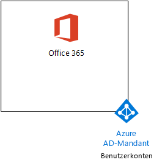
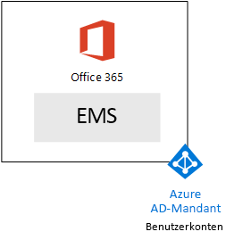
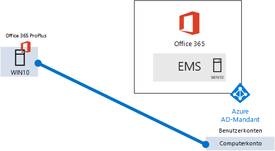

# <a name="the-microsoft-365-enterprise-devtest-environment"></a>Die Microsoft 365 Enterprise-Entwicklungs-/Testumgebung

 **Zusammenfassung:** Verwenden Sie in diesem Test Lab Guide eine Test-/Umgebung erstellen, die Office 365 E5, Enterprise Mobilität + Sicherheit (zur Abstimmung) E5 und einem Computer mit Windows 10 Enterprise enthält.
  
Dieser Artikel enthält eine schrittweise Anleitung zum Erstellen einer vereinfachten-Umgebung um die Features und Funktionen von [Microsoft 365 Enterprise](https://www.microsoft.com/microsoft-365/enterprise)zu testen.
  
## <a name="phase-1-create-your-office-365-e5-subscription"></a>Phase 1: Erstellen des Office 365 E5-Abonnements

Führen Sie die Schritte in Phase 2 und Phase 3 des [Office 365 Dev/Test-Umgebung](office-365-dev-test-environment.md) von einer Test-/Lightweight Office 365-Umgebung erstellen, wie in Abbildung 1 dargestellt.
  
**Abbildung 1: Ihr Office 365 E5-Abonnement mit der Mandanten und Benutzerkonten von Azure Active Directory (AD)**


  
## <a name="phase-2-add-ems"></a>Phase 2: Hinzufügen von EMS

In dieser Phase registrieren Sie sich für das EMS E5-Testabonnement und fügen es derselben Organisation wie Ihr Office 365 E5-Testabonnement hinzu.
  
Zunächst fügen Sie Test zur Abstimmung E5-Abonnement hinzu, und weisen Sie eine Lizenz zur Abstimmung Ihrer globale Administratorkonto ein.
  
1. Mit einer privaten Instanz eines Internetbrowsers melden Sie sich bei Office 365-Portal mit den Anmeldeinformationen Ihres globaler Administrator an. Hilfe finden Sie unter [Where zur Anmeldung bei Office 365](https://support.office.com/Article/Where-to-sign-in-to-Office-365-e9eb7d51-5430-4929-91ab-6157c5a050b4).
    
2. Klicken Sie auf die Kachel **Admin**.
    
3. Klicken Sie auf der Registerkarte **Office Admin Center** in Ihrem Browser im linken Navigationsbereich auf **Abrechnung > Dienste kaufen**.
    
4. Suchen Sie auf der Seite **Dienste kaufen** den Artikel **Enterprise Mobility + Security E5**. Platzieren Sie den Mauszeiger auf dem Artikelnamen, und klicken Sie auf **Start free trial**.
    
5. Klicken Sie auf der Seite für die **Bestätigung Ihrer Bestellung** auf **Jetzt versuchen**.
    
6. Klicken Sie auf der Seite **Bestellbestätigung** auf **Weiter**.
    
7. Klicken Sie auf der Registerkarte **Office 365 Admin Center** in Ihrem Browser im linken Navigationsbereich auf **Benutzer > Aktive Benutzer**.
    
8. Klicken Sie auf Ihr globales Administratorkonto und dann auf **Bearbeiten**, um die **Produktlizenzen** anzuzeigen.
    
9. Setzen Sie im Bereich **Product licenses** die Produktlizenz für **Enterprise Mobility + Security E5** auf **On**. Klicken Sie auf **Speichern** und dann auf **Schließen**.
    
> [!NOTE]
> Das Testabonnement für Enterprise Mobility + Security E5 ist 90 Tage gültig. Für eine dauerhafte Entwicklungs-/Testumgebung erstellen Sie ein neues bezahltes Abonnement mit einer kleinen Anzahl von Lizenzen. 
  
 ***Wenn Sie mit Phase 3 des abgeschlossen*** [Office 365 Dev/Test-Umgebung](office-365-dev-test-environment.md) , wiederholen Sie die Schritte 8 und 9 des vorherigen Verfahrens für alle anderen Konten (Benutzer 2, 3 für Benutzer, Benutzer 4 und 5 Benutzer).
  
Ihre Entwicklungs-/Testumgebung verfügt nun über Folgendes:
  
- Office 365 E5 Enterprise- und EMS-Testabonnements mit derselben Organisation und demselben Azure AD-Mandanten mit Ihrer Liste von Benutzerkonten.
    
- Alle Ihre entsprechenden Benutzerkonten (globaler Administrator oder alle fünf Benutzerkonten) werden von Office 365 E5 und zur Abstimmung E5 aktiviert.
    
Abbildung 2 zeigt die Konfiguration nach dem Hinzufügen von EMS.
  
**Abbildung 2: Hinzufügen des Test zur Abstimmung-Abonnements**


  
## <a name="phase-3-create-a-windows-10-enterprise-computer"></a>Phase 3: Erstellen eines Computers mit Windows 10 Enterprise

In dieser Phase erstellen Sie einen eigenständigen Computer, auf dem Windows 10 Enterprise ausgeführt wird.
  
### <a name="physical-computer"></a>Physischer Computer

Beziehen Sie einen privaten Computer und installieren Sie Windows 10 Enterprise darauf. Sie können das Windows 10 Enterprise Testversion [hier](https://www.microsoft.com/evalcenter/evaluate-windows-10-enterprise)herunterladen.
  
### <a name="virtual-machine"></a>Virtueller Computer

Erstellen Sie einen virtuellen Computer mit dem Hypervisor Ihrer Wahl, und installieren Sie Windows 10 Enterprise auf ihn. Sie können das Windows 10 Enterprise Testversion [hier](https://www.microsoft.com/evalcenter/evaluate-windows-10-enterprise)herunterladen.
  
### <a name="virtual-machine-in-azure"></a>Virtueller Computer in Azure

Zum Erstellen eines virtuellen Computers von Windows 10 in Microsoft Azure, ***benötigen Sie ein Visual Studio-basierte Abonnement***, die Zugriff auf das Bild für Windows 10 Enterprise hat. Andere Arten von Azure-Abonnements, wie etwa Testversionen und kostenpflichtigen Abonnements keinen Zugriff auf dieses Bild.
  
> [!NOTE]
> Im folgenden Befehl wird verwenden Te neueste Version von Azure PowerShell. Finden Sie unter [Erste Schritte mit Azure PowerShell-Cmdlets](https://docs.microsoft.com/powershell/azureps-cmdlets-docs/). Dieser Befehl legt Build einen Windows 10 Enterprise virtuellen Computer mit dem Namen WIN10 und alle seine notwendige Infrastruktur, einschließlich einer Ressourcengruppe, Speicher-Konto und ein virtuelles Netzwerk. Wenn Sie bereits mit Azure Infrastructure Services vertraut sind, wenden Sie sich passen Sie diese Anweisungen der aktuell bereitgestellten Infrastruktur entsprechend an. 
  
Starten Sie zuerst eine Microsoft PowerShell-Eingabeaufforderung.
  
Melden Sie sich mit dem folgenden Befehl bei Ihrem Azure-Konto an.
  
```
Login-AzureRMAccount
```

Rufen Sie den Namen Ihres Abonnements mithilfe des folgenden Befehls ab.
  
```
Get-AzureRMSubscription | Sort Name | Select Name
```

Legen Sie Ihre Azure-Abonnement. Ersetzen Sie alles innerhalb der Anführungszeichen, einschließlich der \< und > Zeichen, mit dem korrekten Namen.
  
```
$subscr="<subscription name>"
Get-AzureRmSubscription -SubscriptionName $subscr | Select-AzureRmSubscription
```

Im nächsten Schritt wird eine neue Ressourcengruppe erstellt. Verwenden Sie zum Ermitteln eines eindeutigen Ressourcengruppennamens diesen Befehl, mit dem die vorhandenen Ressourcengruppen aufgeführt werden.
  
```
Get-AzureRMResourceGroup | Sort ResourceGroupName | Select ResourceGroupName
```

Erstellen Sie Ihre neue Ressourcengruppe mit diesen Befehlen. Ersetzen Sie alles innerhalb der Anführungszeichen, einschließlich der \< und > Zeichen, mit den richtigen Namen.
  
```
$rgName="<resource group name>"
$locName="<location name, such as West US>"
New-AzureRMResourceGroup -Name $rgName -Location $locName
```

Ressourcen-Manager-basierten virtuellen Maschinen erfordern eine Ressourcen-Manager-basierten Speicher-Konto. Sie müssen einen global eindeutigen Namen für Ihre Speicher Dienstkonto *, enthält nur Kleinbuchstaben und Zahlen* auswählen. Sie können diesen Befehl verwenden, um die vorhandenen Speicherkonten aufzulisten.
  
```
Get-AzureRMStorageAccount | Sort StorageAccountName | Select StorageAccountName
```

Verwenden Sie diesen Befehl, um zu testen, ob ein vorgeschlagener Speicherkontoname eindeutig ist.
  
```
Get-AzureRmStorageAccountNameAvailability "<proposed name>"
```

Erstellen Sie ein neues Speicherkonto für Ihre neue Testumgebung mit diesen Befehlen.
  
```
$rgName="<your new resource group name>"
$saName="<storage account name>"
$locName=(Get-AzureRmResourceGroup -Name $rgName).Location
New-AzureRMStorageAccount -Name $saName -ResourceGroupName $rgName -Type Standard_LRS -Location $locName
```

Im nächsten Schritt erstellen Sie ein neues virtuelles Netzwerk und den virtuellen WIN10-Computer mit den folgenden Befehlen. Wenn Sie dazu aufgefordert werden, geben Sie den Namen und das Kennwort des lokalen Administratorkontos für WIN10 an, und bewahren Sie dieses an einem sicheren Ort auf.
  
```
$corpnetSubnet=New-AzureRMVirtualNetworkSubnetConfig -Name Corpnet -AddressPrefix 10.0.0.0/24
New-AzureRMVirtualNetwork -Name "M365Ent-TestLab" -ResourceGroupName $rgName -Location $locName -AddressPrefix 10.0.0.0/8 -Subnet $corpnetSubnet
$rule1=New-AzureRMNetworkSecurityRuleConfig -Name "RDPTraffic" -Description "Allow RDP to all VMs on the subnet" -Access Allow -Protocol Tcp -Direction Inbound -Priority 100 -SourceAddressPrefix Internet -SourcePortRange * -DestinationAddressPrefix * -DestinationPortRange 3389
New-AzureRMNetworkSecurityGroup -Name Corpnet -ResourceGroupName $rgName -Location $locName -SecurityRules $rule1
$vnet=Get-AzureRMVirtualNetwork -ResourceGroupName $rgName -Name "M365Ent-TestLab"
$nsg=Get-AzureRMNetworkSecurityGroup -Name Corpnet -ResourceGroupName $rgName
Set-AzureRMVirtualNetworkSubnetConfig -VirtualNetwork $vnet -Name Corpnet -AddressPrefix "10.0.0.0/24" -NetworkSecurityGroup $nsg
$pip=New-AzureRMPublicIpAddress -Name WIN10-PIP -ResourceGroupName $rgName -Location $locName -AllocationMethod Dynamic
$nic=New-AzureRMNetworkInterface -Name WIN10-NIC -ResourceGroupName $rgName -Location $locName -SubnetId $vnet.Subnets[0].Id -PublicIpAddressId $pip.Id
$vm=New-AzureRMVMConfig -VMName WIN10 -VMSize Standard_D1_V2
$storageAcc=Get-AzureRMStorageAccount -ResourceGroupName $rgName -Name $saName
$cred=Get-Credential -Message "Type the name and password of the local administrator account for WIN10."
$vm=Set-AzureRMVMOperatingSystem -VM $vm -Windows -ComputerName WIN10 -Credential $cred -ProvisionVMAgent -EnableAutoUpdate
$vm=Set-AzureRMVMSourceImage -VM $vm -PublisherName MicrosoftVisualStudio -Offer Windows -Skus Windows-10-N-x64 -Version "latest"
$vm=Add-AzureRMVMNetworkInterface -VM $vm -Id $nic.Id
$osDiskUri=$storageAcc.PrimaryEndpoints.Blob.ToString() + "vhds/WIN10-TestLab-OSDisk.vhd"
$vm=Set-AzureRMVMOSDisk -VM $vm -Name WIN10-TestLab-OSDisk -VhdUri $osDiskUri -CreateOption fromImage
New-AzureRMVM -ResourceGroupName $rgName -Location $locName -VM $vm
```

## <a name="phase-4-join-your-windows-10-computer-to-azure-ad"></a>Phase 4: Einbinden des Windows 10-Computers in Azure AD

Nachdem Sie den physischen oder virtuellen Computer erstellt und mit Windows 10 Enterprise konfiguriert haben und er ausgeführt wird, melden Sie sich mit einem lokalen Administratorkonto an.
  
> [!NOTE]
> Für einen virtuellen Computer in Azure eine Verbindung damit herzustellen Sie anhand der [folgenden Schritte](https://docs.microsoft.com/azure/virtual-machines/windows/connect-logon). Melden Sie sich mit den Anmeldeinformationen des lokalen Administratorkontos. 
  
Als Nächstes fügen Sie den WIN10-Computer dem Azure AD-Mandanten Ihrer Office 365- und EMS-Abonnements hinzu.
  
1. Klicken Sie auf dem Desktop des Computers WIN10 **starten > Einstellungen > Konten > Access Arbeit "oder" Schule > Connect**.
    
2. Klicken Sie auf **dieses Gerät zu Azure Active Directory teilnehmen**, klicken Sie im Dialogfeld **Einrichten eines Kontos arbeiten oder Schule** .
    
3. In **Arbeit oder Schule Konto**, geben Sie den Kontonamen globaler Administrator Ihres Office 365-Abonnements, und klicken Sie dann auf **Weiter**.
    
4. Geben Sie im Feld **Kennwort eingeben**das Kennwort für das globale Administratorkonto ein, und klicken Sie dann auf **Anmelden**.
    
5. Wenn Sie aufgefordert werden, um sicherzustellen, dass dies Ihrer Organisation ist, klicken Sie auf **teilnehmen**, und klicken Sie dann auf **Fertig**.
    
6. Schließen Sie das Fenster mit den Einstellungen.
    
Installieren Sie im nächsten Schritt Office 2016 auf dem WIN10-Computer.
  
1. Öffnen Sie den Microsoft-Edge-Browser, und melden Sie sich mit den Anmeldeinformationen Ihres globaler Administrator Office 365-Portal. Hilfe finden Sie unter [Where zur Anmeldung bei Office 365](https://support.office.com/Article/Where-to-sign-in-to-Office-365-e9eb7d51-5430-4929-91ab-6157c5a050b4).
    
2. Klicken Sie auf der Registerkarte **Start von Microsoft Office** auf **Office 2016 installieren**.
    
3. Klicken Sie mit dem, was tun Sie bei entsprechender Aufforderung auf **Ausführen**, und klicken Sie dann für die **Benutzerkontensteuerung**auf **Ja** .
    
4. Warten Sie Office, um die Installation abzuschließen. Wenn Sie finden Sie unter **Sie alle festgelegt sind!**, klicken Sie zweimal auf **Schließen** .
    
Abbildung 3 zeigt die erstellte Umgebung mit dem WIN10-Computer, der dem Azure AD-Mandanten Ihrer Office 365- und EMS-Abonnements beigetreten ist.
  
**Abbildung 3: Das Computerkonto WIN10, die dem Azure AD-Mandanten hinzufügen**


  
Sie sind jetzt bereit, Experimentieren mit zusätzlichen Features von [Microsoft 365 Enterprise](https://www.microsoft.com/microsoft-365/enterprise).
  
## <a name="next-steps"></a>Nächste Schritte

Anhand der folgenden weiteren Artikel erfahren Sie mehr über die Funktionen von Microsoft 365 Enterprise:
  
- [Hinzufügen von Informationsverwaltungsrichtlinien (MAM) für die mobile Anwendung](https://technet.microsoft.com/library/mt764059.aspx)
    
- [Registrieren Sie iOS und Android-Geräte](https://technet.microsoft.com/library/mt743077.aspx)
    
- [Konfigurieren und Testen von Advanced Security Management](https://technet.microsoft.com/library/mt757250.aspx)
    
- [Konfigurieren und Testen der erweiterte Schutz](https://technet.microsoft.com/library/mt490479.aspx)
    
## <a name="see-also"></a>Weitere Artikel

[Eine Microsoft-Cloud Dev/testumgebung](the-one-microsoft-cloud-dev-test-environment.md)

[Dokumentation zu Microsoft 365 Enterprise](https://docs.microsoft.com/microsoft-365-enterprise/)


