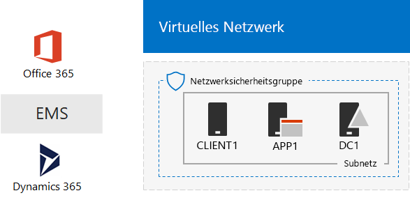
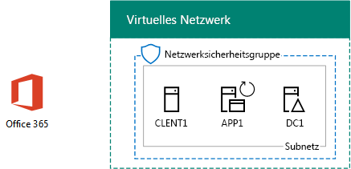
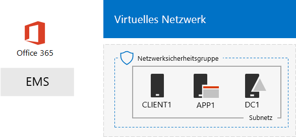

# Die One Microsoft Cloud-Entwicklungs-/TestumgebungThe One Microsoft Cloud dev/test environment

 **Zusammenfassung:** Verwenden Sie diese Test Lab Guide eine Test-/Umgebung erstellen, die alle Cloudlösungen von Microsoft enthält.**Summary:** Use this Test Lab Guide to create a dev/test environment that includes all of Microsoft's cloud offerings.
  
Mit den Anweisungen in diesem Artikel erstellen Sie ein simuliertes Intranet in Microsoft Azure-Infrastrukturdiensten und fügen dann Abonnements für Microsoft Office 365, Microsoft Enterprise Mobility + Security (EMS) und Microsoft Dynamics 365 hinzu. Das Ergebnis ist eine vereinfachte Organisation, die alle Microsoft-Cloudangebote gleichzeitig in einer einzigen Entwicklungs-/Testumgebung nutzt. With the instructions in this article, you create a simulated intranet in Microsoft Azure infrastructure services and then add Microsoft Office 365, Microsoft Enterprise Mobility + Security (EMS), and Microsoft Dynamics 365 subscriptions. The result is a simplified organization that uses all Microsoft's cloud offerings at the same time in a single dev/test environment. 
  

  
Die daraus resultierende Konfiguration bietet Ihnen die folgenden Möglichkeiten:You can use the resulting configuration to:
  
- Erleben Sie die Integration in den Microsoft-Cloudangeboten, z. B. die gemeinsame Identitätsinfrastruktur, die von Azure Active Directory (AD) bereitgestellt wird.Experience the integration across Microsoft's cloud offerings, such as the common identity infrastructure provided by Azure Active Directory (AD).
    
- Werten Sie End-to-End-Szenarios aus, die mehrere Microsoft-Cloudangebote umfassen.Evaluate end-to-end scenarios that include multiple Microsoft Cloud offerings.
    
- Erstellen Sie eine Demo, Machbarkeitsstudie oder Entwicklungs-/Testkonfiguration, die mehrere Microsoft-Cloudangebote nutzt.Create a demo, proof-of-concept, or dev/test configuration that uses multiple Microsoft Cloud offerings.
    
- Bauen Sie Ihre Qualifikation in Bezug auf die Microsoft Cloud zur beruflichen Weiterentwicklung aus.Build your Microsoft Cloud skills for professional development.
    
## Phase 1: Erstellen eines simulierten Intranets und Hinzufügen von Office 365Phase 1: Create a simulated intranet and add Office 365

Befolgen Sie die Anweisungen in [DirSync für Ihre Office 365 Dev/Test-Umgebung](dirsync-for-your-office-365-dev-test-environment.md).Follow the instructions in [DirSync for your Office 365 dev/test environment](dirsync-for-your-office-365-dev-test-environment.md).
  
Abbildung 1 zeigt die resultierende Konfiguration, einschließlich Office 365 und einem simulierten Intranet in Azure Infrastructure Services und verzeichnissynchronisierung aus einer lokalen Windows Server Active Directory (AD)-Gesamtstruktur ausgeführt.Figure 1 shows your resulting configuration, which includes Office 365 and a simulated intranet running in Azure infrastructure services and directory synchronization from an on-premises Windows Server Active Directory (AD) forest.
  
**Abbildung 1: Die simulierten Intranet in Azure mit Office 365****Figure 1: The simulated intranet in Azure with Office 365**

  
> [!NOTE]
> Die Azure-Testversion beträgt 30 Tage. Das Abonnement E5 Testversion von Office 365 Enterprise ist 30 Tagen auf einfache Weise für weitere 30 Tage verlängert werden können. Erstellen Sie für eine permanente Test-/-Umgebung ein neues bezahlt Azure-Abonnement und ein neues kostenpflichtigen Office 365 Enterprise E5 Abonnement mit einer kleinen Anzahl von Lizenzen.The Azure trial is 30 days. The Office 365 Enterprise E5 Trial subscription is 30 days, which can be easily extended for another 30 days. For a permanent dev/test environment, create a new paid Azure subscription and a new paid Office 365 Enterprise E5 subscription with a small number of licenses. 
  
## Phase 2: Hinzufügen von EMSPhase 2: Add EMS

In dieser Phase registrieren Sie sich für das EMS-Testabonnement und fügen es derselben Organisation wie Ihr Office 365-Testabonnement hinzu.In this phase, you sign up for the EMS trial subscription and add it to the same organization as your Office 365 trial subscription.
  
1. Mit einem Browser auf einem Desktopcomputer oder von CLIENT1, melden Sie sich bei Office 365-Portal unter [https://portal.office.com](https://portal.office.com) mit den Anmeldeinformationen Ihres Kontos globaler Administrator.With a browser on either your desktop computer or from CLIENT1, sign in to the Office 365 portal at [https://portal.office.com](https://portal.office.com) with the credentials of your global administrator account.
    
2. Klicken Sie auf die Kachel **Admin**.Click the **Admin** tile.
    
3. Klicken Sie auf der Registerkarte **Office Admin Center** in Ihrem Browser im linken Navigationsbereich auf **Abrechnung > Dienste kaufen**.On the **Office Admin center** tab in your browser, in the left navigation, click **Billing > Purchase services**.
    
4. Suchen Sie auf der Seite **Dienste kaufen** den Artikel **Enterprise Mobility + Security E5**. Platzieren Sie den Mauszeiger auf dem Artikelnamen, und klicken Sie auf **Start free trial**.On the **Purchase services** page, find the **Enterprise Mobility + Security E5** item. Hover your mouse pointer over it and click **Start free trial**.
    
5. Klicken Sie auf der Seite für die **Bestätigung Ihrer Bestellung** auf **Jetzt versuchen**.On the **Confirm your order** page, click **Try now**.
    
6. Klicken Sie auf der Seite **Bestellbestätigung** auf **Weiter**.On the **Order receipt** page, click **Continue**.
    
> [!NOTE]
> Das Testabonnement für Enterprise Mobility + Security E5 ist 90 Tage gültig. Für eine dauerhafte Entwicklungs-/Testumgebung erstellen Sie ein neues bezahltes Abonnement mit einer kleinen Anzahl von Lizenzen.The Enterprise Mobility + Security E5 trial subscription is 90 days. For a permanent dev/test environment, create a new paid subscription with a small number of licenses. 
  
Als Nächstes aktivieren Sie die Enterprise Mobility + Security E5-Lizenz für alle Benutzerkonten.Next, enable the Enterprise Mobility + Security E5 license for all user accounts.
  
1. Klicken Sie auf der Registerkarte **Office 365 Admin Center** in Ihrem Browser im linken Navigationsbereich auf **Benutzer > Aktive Benutzer**.On the **Office 365 Admin center** tab in your browser, in the left navigation, click **Users > Active users**.
    
2. Klicken Sie auf Ihr globales Administratorkonto und dann auf **Bearbeiten**, um die **Produktlizenzen** anzuzeigen.Click your global administrator account, and then click **Edit** for **Product licenses**.
    
3. Setzen Sie im Bereich **Product licenses** die Produktlizenz für **Enterprise Mobility + Security E5** auf **On**. Klicken Sie auf **Speichern** und dann auf **Schließen**.On the **Product licenses** pane, turn the product license for **Enterprise Mobility + Security E5** to **On**, click **Save,** and then click **Close** twice.
    
4. Führen Sie die Schritte 2 und 3 für alle Ihre anderen Konten aus (Benutzer1, Benutzer 2, Benutzer 3, Benutzer 4 und Benutzer 5).For all of your other accounts (User1, User 2, User 3, User 4, and User 5), do steps 2 and 3.
    
Ihre Entwicklungs-/Testumgebung verfügt nun über Folgendes:Your dev/test environment now has:
  
- Ein simuliertes Intranet, das in Azure-Infrastrukturdiensten ausgeführt wird.A simulated intranet running in Azure infrastructure services.
    
- Office 365 E5 Enterprise- und EMS-Testabonnements mit derselben Organisation und demselben Azure AD-Mandanten mit Ihrer Liste von Benutzerkonten.Office 365 E5 Enterprise and EMS trial subscriptions sharing the same organization and the same Azure AD tenant with your list of user accounts.
    
- Alle Ihre Benutzerkonten, aktiviert für die Verwendung von Office 365 E5 Enterprise und EMS.All of your user accounts enabled to use Office 365 E5 Enterprise and EMS.
    
Abbildung 2 zeigt die resultierende Konfiguration nach dem Hinzufügen von EMS.Figure 2 shows your resulting configuration, which adds EMS.
  
**Abbildung 2: Die simulierten Intranet in Azure mit Office 365 und zur Abstimmung****Figure 2: The simulated intranet in Azure with Office 365 and EMS**

  
## Phase 3: Hinzufügen des Dynamics 365Phase 3: Add Dynamics 365

In dieser Phase registrieren Sie sich für das Dynamics 365-Testabonnement und fügen es derselben Organisation wie Ihre Office 365- und EMS-Testabonnements hinzu.In this phase, you sign up for the Dynamics 365 trial subscription and add it to the same organization as your Office 365 and EMS trial subscriptions.
  
1. Mithilfe eines Browsers auf einem Desktopcomputer oder von CLIENT1, melden Sie sich bei Office 365-Portal unter [https://portal.office.com](https://portal.office.com) mit den Anmeldeinformationen Ihres Kontos globaler Administrator.Using a browser on either your desktop computer or from CLIENT1, sign in to the Office 365 portal at [https://portal.office.com](https://portal.office.com) with the credentials of your global administrator account.
    
2. Klicken Sie auf die Kachel **Admin**.Click the **Admin** tile.
    
3. Klicken Sie auf der Registerkarte **Office-Verwaltungskonsole** im linken Navigationsbereich auf **Abrechnung > Dienste erwerben**.On the **Office admin center** tab, in the left navigation, click **Billing > Purchase services**.
    
4. Suchen Sie auf der Seite **Dienste erwerben** des **Dynamics 365 planen 1 Enterprise Edition** -Elements. Bewegen Sie den Mauszeiger über dieses, und klicken Sie auf **Start kostenlose Testversion**.On the **Purchase services** page, find the **Dynamics 365 Plan 1 Enterprise Edition** item. Hover your mouse pointer over it and click **Start free trial**.
    
5. Klicken Sie auf der Seite für die **Bestätigung Ihrer Bestellung** auf **Jetzt versuchen**.On the **Confirm your order** page, click **Try now**.
    
6. Klicken Sie auf der Seite **Bestellbestätigung** auf **Weiter**.On the **Order receipt** page, click **Continue**.
    
> [!NOTE]
> Das Testabonnement für Dynamics 365 Plan 1 Enterprise Edition läuft über 30 Tage. Sie können das Testabonnement einfach um weitere 30 Tage verlängern. Für eine dauerhafte Entwicklungs-/Testumgebung erstellen Sie ein neues bezahltes Abonnement mit einer kleinen Anzahl von Lizenzen.The Dynamics 365 Plan 1 Enterprise Edition trial subscription is 30 days. You can easily extend the trail subscription for another 30 days. For a permanent dev/test environment, create a new paid subscription with a small number of licenses. 
  
Führen Sie diese Schritte aus, um den Konten des globalen Administrators sowie den Konten von Benutzer 2 und Benutzer 3 Dynamics 365-Lizenzen zuzuweisen und sie zu Systemadministratoren zu machen.Use these steps to assign Dynamics 365 licenses to the global administrator, User 2, and User 3 accounts and make them system administrators.
  
1. Klicken Sie auf die Registerkarte **Office Administrationscenter** auf **Benutzer > aktive Benutzer**.On the **Office admin center** tab, click **Users > Active users**.
    
2. Klicken Sie in der Liste der aktiven Benutzer auf die globale Administratorkonto ein, und klicken Sie dann auf **Bearbeiten** , für die **Lizenzen**.In the list of active users, click your global administrator account, and then click **Edit** for **Product licenses**.
    
3. Klicken Sie im Bereich **Lizenzen** deaktivieren Sie die-Lizenz für **Dynamics 365 planen 1 Enterprise Edition** können Sie **auf**, klicken Sie auf **Speichern,** und klicken Sie dann zweimal auf **Schließen** .On the **Product licenses** pane, turn the product license for **Dynamics 365 Plan 1 Enterprise Edition** to **On**, click **Save,** and then click **Close** twice.
    
4. Führen Sie die Schritte 2 und 3 für Benutzer 2- und Benutzer 3-Konten durch.Perform steps 2 and 3 for the User 2 and User 3 accounts.
    
5. Schließen Sie die Registerkarte **Office-Verwaltungskonsole** .Close the **Office admin center** tab.
    
Konfigurieren Sie anhand dieser Schritte die Benutzer 2- und Benutzer 3-Konten als Dynamics 365-Systemadministratoren.Use these steps to configure the User 2 and User 3 accounts as Dynamics 365 system administrators.
  
1. Klicken Sie auf der Registerkarte **Office Admin Center** in Ihrem Browser im linken Navigationsbereich klicken Sie auf **Admin centers**, und klicken Sie dann auf **Dynamics 365**.On the **Office Admin center** tab in your browser, in the left navigation, click **Admin centers**, and then click **Dynamics 365**.
    
    Möglicherweise müssen Sie warten, bis die Bereitstellung von Dynamics 365 abgeschlossen ist, damit Dynamics 365 im Menü angezeigt wird.You may need to wait for Dynamics 365 to finish provisioning before Dynamics 365 appears in the menu.
    
2. Klicken Sie auf der Registerkarte Dynamics 365 klicken Sie auf **Alle diese**, und klicken Sie dann auf **Setup abzuschließen.**On the Dynamics 365 tab, click **All of these**, and then click **Complete Setup.**
    
    Warten Sie, bis die Einrichtung abgeschlossen ist.Wait for setup to complete.
    
    Wenn Setup abgeschlossen ist, wird ein Sales Aktivität Dashboard basierend auf Beispieldaten, die Teil des Abonnements im Überwachungsprotokoll ist. Nehmen Sie einen Moment, zum Anzeigen der **Willkommen bei der Testversion** video. Schließen Sie das Videofenster nach Abschluss des Vorgangs.When setup completes, it displays a Sales Activity Dashboard based on sample data that is part of the trail subscription. Take a few moments to view the **Welcome to your trial** video. Close the video window when complete.
    
3. Klicken Sie auf der Symbolleiste oben klicken Sie auf den Pfeil nach unten neben **Sales**, klicken Sie auf **Einstellungen**, und klicken Sie dann auf **Sicherheit**.On the toolbar at the top, click the down arrow next to **Sales**, click **Settings**, and then click **Security**.
    
4. Klicken Sie auf der Seite **Sicherheit** auf **Benutzer**.On the **Security** page, click **Users**.
    
5. Klicken Sie in der Liste der Benutzer auf **Benutzer 2**.In the list of users, click **User 2**.
    
6. Klicken Sie auf der Symbolleiste auf **Rollen verwalten**.In the tool bar, click **Manage Roles**.
    
7. Klicken Sie auf **Systemadministrator** **Rollen verwalten**und klicken Sie dann auf **OK**.In **Manage Roles**, click **System Administrator**, and then click **OK**.
    
8. Klicken Sie auf der Symbolleiste oben auf **Sicherheit**.In the tool bar at the top click **Security**.
    
9. Wiederholen Sie die Schritte 5 bis 8 für das Konto „Benutzer 3“.Repeat steps 5-8 for the User 3 account.
    
10. Schließen der **Benutzer: User3** Registerkarte.Close the **User: User3** tab.
    
> [!NOTE]
> Ihrem globalen Office 365-Administratorkonto wurde automatisch die Rolle des Dynamics 365-Systemadministrators zugewiesen.Your Office 365 global administrator account was automatically assigned the Dynamics 365 system administrator role. 
  
Ihre Entwicklungs-/Testumgebung verfügt nun über Folgendes:Your dev/test environment now has:
  
- Ein simuliertes Intranet, das in Azure-Infrastrukturdiensten ausgeführt wird.A simulated intranet running in Azure infrastructure services.
    
- Office 365 E5 Enterprise-, EMS- und Dynamics 365-Testabonnements mit derselben Organisation und demselben Azure AD-Mandanten wie Ihre Liste von Benutzerkonten.Office 365 E5 Enterprise, EMS, and Dynamics 365 trial subscriptions sharing the same organization and the same Azure AD tenant with your list of user accounts.
    
- Alle Ihre Benutzerkonten, aktiviert für die Verwendung von Office 365 E5 Enterprise und EMS.All of your user accounts enabled to use Office 365 E5 Enterprise and EMS.
    
- Die Konten des globalen Unternehmensadministrators und der Benutzer 2 und Benutzer 3 dürfen Dynamics 365 verwenden und sind Dynamics 365-Systemadministratoren.Your global enterprise administrator, User 2, and User 3 accounts are enabled to use Dynamics 365 and are Dynamics 365 system administrators.
    
Abbildung 3 zeigt die resultierende Konfiguration.Figure 3 shows your resulting configuration.
  
**Abbildung 3: Simulierten Intranet in Azure mit Office 365 und zur Abstimmung Dynamics 365****Figure 3: The simulated intranet in Azure with Office 365, EMS, and Dynamics 365**

  
## Nächste SchritteNext steps

Sie können jetzt mit Ihrer One Microsoft Cloud-Entwicklungs-/Testumgebung experimentieren. Hier sind einige Ideen zum Ausprobieren mit Anleitung:You can now experiment with your One Microsoft Cloud dev/test environment. Here are some ideas for guided experiences:
  
- [Konfigurieren von Informationsverwaltungsrichtlinien (MAM) für die mobile Anwendung in zur Abstimmung für Office 365-AnwendungenConfigure mobile application management (MAM) policies in EMS for Office 365 applications](https://technet.microsoft.com/library/mt764059.aspx)
    
- [Führen Sie vor, Exchange Online in Office 365-Integration in Dynamics 365 KontakteDemonstrate Exchange Online in Office 365 integration with Dynamics 365 contacts](https://technet.microsoft.com/library/mt798313.aspx)
    
- [Erstellen Sie ein Netzwerk simulierten standortübergreifenden in Azure Infrastructure Services für das Hosten von Server-basierten ArbeitslastenCreate a simulated cross-premises network in Azure infrastructure services for hosting server-based workloads](https://technet.microsoft.com/library/mt745150.aspx)
    
## See AlsoSee Also

[Testumgebungsanleitungen (TLGs) zur CloudakzeptanzCloud adoption Test Lab Guides (TLGs)](cloud-adoption-test-lab-guides-tlgs.md)
  
[Ressourcen zur Cloud-IT-Architektur von MicrosoftMicrosoft Cloud IT architecture resources](microsoft-cloud-it-architecture-resources.md)
  
[HybridlösungenHybrid solutions](hybrid-solutions.md)
  
[SicherheitslösungenSecurity solutions](security-solutions.md)

