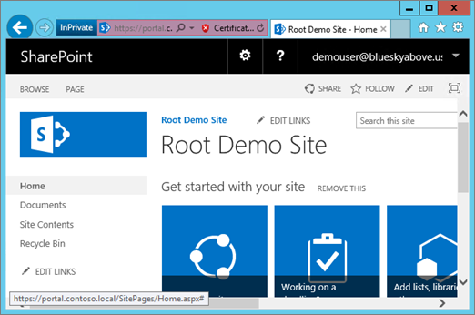

# <a name="using-azure-ad-for-sharepoint-server-authentication"></a><span data-ttu-id="b2962-103">Verwenden von Azure AD für SharePoint Server-Authentifizierung</span><span class="sxs-lookup"><span data-stu-id="b2962-103">Using Azure AD for SharePoint Server Authentication</span></span>

 <span data-ttu-id="b2962-104">**Zusammenfassung:** Hier erfahren Sie, wie Sie Ihre SharePoint Server 2016 Benutzer mit Azure Active Directory authentifiziert.</span><span class="sxs-lookup"><span data-stu-id="b2962-104">**Summary:** Learn how to authenticate your SharePoint Server 2016 users with Azure Active Directory.</span></span>
  
> [!NOTE]
> <span data-ttu-id="b2962-105">Dieser Artikel basiert auf der Arbeit der Kirk Evans, einem Prinzipal Program Manager bei Microsoft.</span><span class="sxs-lookup"><span data-stu-id="b2962-105">This article is based on the work of Kirk Evans, a Microsoft Principal Program Manager.</span></span> 

<blockquote>
<p><span data-ttu-id="b2962-p101">Dieser Artikel bezieht sich auf Codebeispiele für die Interaktion mit Azure Active Directory-Diagramm. Sie können die folgenden Codebeispiele herunterladen [hier](https://github.com/kaevans/spsaml11/tree/master/scripts).</span><span class="sxs-lookup"><span data-stu-id="b2962-p101">This article refers to code samples for interacting with Azure Active Directory Graph. You can download the code samples [here](https://github.com/kaevans/spsaml11/tree/master/scripts).</span></span></p>
</blockquote>

<span data-ttu-id="b2962-p102">SharePoint Server 2016 bietet die Möglichkeit zur Authentifizierung von Benutzern mithilfe der anspruchsbasierten Authentifizierung erleichtern das Verwalten von Benutzern mit unterschiedlichen Identitätsanbieter angezeigt, die Sie als vertrauenswürdig, sondern eine andere Person verwaltet authentifizieren. Anstelle der Benutzerauthentifizierung über Active Directory-Domänendienste (AD DS) verwalten, aktivieren Sie Benutzer für die Authentifizierung mithilfe von Azure Active Directory (AD Azure). Auf diese Weise können die Authentifizierung für nur-Cloud-Benutzer mit dem Suffix "onmicrosoft.com" in ihren Benutzernamen, Benutzer mit einem lokalen Verzeichnis synchronisiert, und Gastbenutzer aus anderen Verzeichnissen eingeladen. Darüber hinaus können Sie Azure AD-Features wie mehrstufige Authentifizierung und erweiterte reporting-Funktionen nutzen.</span><span class="sxs-lookup"><span data-stu-id="b2962-p102">SharePoint Server 2016 provides the ability to authenticate users using claims-based authentication, making it easy to manage your users by authenticating them with different identity providers that you trust but someone else manages. For example, instead of managing user authentication through Active Directory Domain Services (AD DS), you could enable users to authenticate using Azure Active Directory (Azure AD). This enables authentication for cloud-only users with the onmicrosoft.com suffix in their username, users synchronized with an on-premises directory, and invited guest users from other directories. It also enables you to take advantage of Azure AD features such as multi-factor authentication and advanced reporting capabilities.</span></span>

> [!IMPORTANT]
> <span data-ttu-id="b2962-p103">Die in diesem Artikel beschriebene Lösung kann auch mit SharePoint Server 2013 verwendet werden. Beachten Sie, dass SharePoint Server 2013 Ende des mainstream-Support nähert jedoch beibehalten. Weitere Informationen finden Sie unter [Microsoft Lifecycle-Richtlinie](https://support.microsoft.com/en-us/lifecycle/search?alpha=SharePoint%20Server%202013) und [Aktualisiert Produkt – Wartung Richtlinie für SharePoint 2013](https://technet.microsoft.com/library/684173bb-e90a-4eb7-b268-b8d7458bc802(v=office.16).aspx).</span><span class="sxs-lookup"><span data-stu-id="b2962-p103">The solution described in this article can also be used with SharePoint Server 2013; however, keep in mind that SharePoint Server 2013 is nearing the end of mainstream support. For more information, see [Microsoft Lifecycle Policy](https://support.microsoft.com/en-us/lifecycle/search?alpha=SharePoint%20Server%202013) and [Updated Product Servicing Policy for SharePoint 2013](https://technet.microsoft.com/library/684173bb-e90a-4eb7-b268-b8d7458bc802(v=office.16).aspx).</span></span>

<span data-ttu-id="b2962-p104">In diesem Artikel erläutert, wie Sie Azure AD können für Ihre Benutzer erfolgen soll, anstatt Ihre lokale AD DS. In dieser Konfiguration wird Azure AD einem vertrauenswürdigen Identitätsanbieter für SharePoint Server 2016. Diese Konfiguration Fügt eine Methode zur Benutzerauthentifizierung, die von der AD DS-Authentifizierung verwendet, die nach der Installation von SharePoint Server 2016 selbst getrennt ist. Um in diesem Artikel nutzen zu können, sollten Sie sich mit WS-Federation vertraut machen. Weitere Informationen finden Sie unter [Grundlegendes zu WS-Verbund](https://go.microsoft.com/fwlink/p/?linkid=188052).</span><span class="sxs-lookup"><span data-stu-id="b2962-p104">This article explains how you can use Azure AD to authenticate your users instead of your on-premises AD DS. In this configuration, Azure AD becomes a trusted identity provider for SharePoint Server 2016. This configuration adds a user authentication method that is separate from the AD DS authentication used by the SharePoint Server 2016 installation itself. To benefit from this article, you should be familiar with WS-Federation. For more information, see [Understanding WS-Federation](https://go.microsoft.com/fwlink/p/?linkid=188052).</span></span>


<span data-ttu-id="b2962-p105">In früheren Versionen würde dieser Konfiguration einem Verbunddienst wie Azure Access Control Service (ACS) in der Cloud oder in einer Umgebung, die Active Directory-Verbunddienste (AD FS) 2.0 SAML-Token, die SAML 1.1 umgewandelt hostet erforderlich haben. Diese Transformation ist nicht mehr erforderlich, da nun Azure AD ausstellende SAML 1.1-Token ermöglicht. Das Diagramm oben zeigt die Funktionsweise der Authentifizierung für SharePoint 2016 Benutzer in dieser Konfiguration veranschaulichen, dass eine Voraussetzung für die Vermittlung diese Umwandlung ist nicht mehr.</span><span class="sxs-lookup"><span data-stu-id="b2962-p105">Previously, this configuration would have required a federation service such as Azure Access Control Service (ACS) in the cloud or an environment that hosts Active Directory Federation Services (AD FS) to transform tokens from SAML 2.0 to SAML 1.1. This transformation is no longer required as Azure AD now enables issuing SAML 1.1 tokens. The diagram above shows how authentication works for SharePoint 2016 users in this configuration, demonstrating that there is no longer a requirement for an intermediary to perform this transformation.</span></span>

> [!NOTE]
> <span data-ttu-id="b2962-p106">Diese Konfiguration funktioniert, ob die SharePoint-Farm in Azure-virtuelle Computer oder lokalen gehostet wird. Es erfordert nicht, dass zusätzliche Firewallports als sicherstellen, dass Benutzer öffnen Azure Active Directory aus ihrem Browser zugreifen kann.</span><span class="sxs-lookup"><span data-stu-id="b2962-p106">This configuration works whether the SharePoint farm is hosted in Azure virtual machines or on-premises. It does not require opening additional firewall ports other than ensuring users can access Azure Active Directory from their browser.</span></span>

<span data-ttu-id="b2962-125">Informationen zu SharePoint 2016 Eingabehilfen finden Sie unter [Richtlinien für Eingabehilfen in SharePoint Server 2016](https://go.microsoft.com/fwlink/p/?LinkId=393123).</span><span class="sxs-lookup"><span data-stu-id="b2962-125">For information about SharePoint 2016 accessibility, see [Accessibility Guidelines in SharePoint Server 2016](https://go.microsoft.com/fwlink/p/?LinkId=393123).</span></span>

## <a name="configuration-overview"></a><span data-ttu-id="b2962-126">Übersicht über die Konfiguration</span><span class="sxs-lookup"><span data-stu-id="b2962-126">Configuration overview</span></span>

<span data-ttu-id="b2962-127">Führen Sie die folgenden allgemeinen Schritte zum Einrichten Ihrer Umgebung Azure AD als einen SharePoint Server 2016 Identitätsanbieter verwendet.</span><span class="sxs-lookup"><span data-stu-id="b2962-127">Follow these general steps to set up your environment to use Azure AD as a SharePoint Server 2016 identity provider.</span></span>

1. <span data-ttu-id="b2962-128">Erstellen Sie eine neue Azure AD-Verzeichnis oder Ihr vorhandene Verzeichnis verwenden.</span><span class="sxs-lookup"><span data-stu-id="b2962-128">Create a new Azure AD directory or use your existing directory.</span></span>
2. <span data-ttu-id="b2962-129">Stellen Sie sicher, dass die Zone für die Webanwendung, die Sie mit Azure AD absichern möchten für die Verwendung von SSL konfiguriert ist.</span><span class="sxs-lookup"><span data-stu-id="b2962-129">Ensure the zone for the web application that you want to secure with Azure AD is configured to use SSL.</span></span>
3. <span data-ttu-id="b2962-130">Erstellen Sie eine neue enterpriseanwendung in Azure Active Directory.</span><span class="sxs-lookup"><span data-stu-id="b2962-130">Create a new enterprise application in Azure AD.</span></span>
4. <span data-ttu-id="b2962-131">Konfigurieren eines neuen vertrauenswürdigen Identitätsanbieters in SharePoint Server 2016.</span><span class="sxs-lookup"><span data-stu-id="b2962-131">Configure a new trusted identity provider in SharePoint Server 2016.</span></span>
5. <span data-ttu-id="b2962-132">Legen Sie die Berechtigungen für die Webanwendung.</span><span class="sxs-lookup"><span data-stu-id="b2962-132">Set the permissions for the web application.</span></span>
6. <span data-ttu-id="b2962-133">Fügen Sie eine SAML 1.1 tokenausstellung Richtlinie in Azure Active Directory hinzu.</span><span class="sxs-lookup"><span data-stu-id="b2962-133">Add a SAML 1.1 token issuance policy in Azure AD.</span></span>
7. <span data-ttu-id="b2962-134">Überprüfen Sie den neuen Anbieter.</span><span class="sxs-lookup"><span data-stu-id="b2962-134">Verify the new provider.</span></span>

<span data-ttu-id="b2962-135">In den folgenden Abschnitten wird beschrieben, wie Sie zum Ausführen dieser Aufgaben.</span><span class="sxs-lookup"><span data-stu-id="b2962-135">The following sections describe how to perform these tasks.</span></span>

## <a name="step-1-create-a-new-azure-ad-directory-or-use-your-existing-directory"></a><span data-ttu-id="b2962-136">Schritt 1: Erstellen Sie eine neue Azure AD-Verzeichnis oder Ihr vorhandene Verzeichnis verwenden</span><span class="sxs-lookup"><span data-stu-id="b2962-136">Step 1: Create a new Azure AD directory or use your existing directory</span></span>

<span data-ttu-id="b2962-p107">In der Azure-Verwaltungsportal ([https://portal.azure.com](https://portal.azure.com)), erstellen Sie ein neues Verzeichnis. Geben Sie den Namen der Organisation, ersten Domänennamen und Land oder Region.</span><span class="sxs-lookup"><span data-stu-id="b2962-p107">In the Azure Portal ([https://portal.azure.com](https://portal.azure.com)), create a new directory. Provide the organization name, initial domain name, and the country or region.</span></span>

 

 <span data-ttu-id="b2962-p108">Wenn Sie bereits ein Verzeichnis wie für Microsoft Office 365 oder Ihr Microsoft Azure-Abonnement verfügen, können Sie stattdessen das Verzeichnis verwenden. Sie müssen Berechtigungen zum Registrieren von Anwendungen in das Verzeichnis verfügen.</span><span class="sxs-lookup"><span data-stu-id="b2962-p108">If you already have a directory such as the one used for Microsoft Office 365 or your Microsoft Azure subscription, you can use that directory instead. You must have permissions to register applications in the directory.</span></span>

## <a name="step-2-ensure-the-zone-for-the-web-application-that-you-want-to-secure-with-azure-ad-is-configured-to-use-ssl"></a><span data-ttu-id="b2962-142">Schritt 2: Stellen Sie sicher, dass die Zone für die Webanwendung, die Sie mit Azure AD absichern möchten konfiguriert ist, um die Verwendung von SSL</span><span class="sxs-lookup"><span data-stu-id="b2962-142">Step 2: Ensure the zone for the web application that you want to secure with Azure AD is configured to use SSL</span></span>

<span data-ttu-id="b2962-p109">Dieser Artikel wurde mit der Referenzarchitektur in [eine hohe Verfügbarkeit 2016 für SharePoint Server-Farm in Azure ausgeführt](https://docs.microsoft.com/en-us/azure/architecture/reference-architectures/sharepoint)geschrieben. Im Artikel zugehörigen Skripts verwendet, um die in [diesem Artikel](https://docs.microsoft.com/en-us/azure/architecture/reference-architectures/sharepoint) beschriebene Lösung bereitzustellen Erstellen einer Website, die nicht SSL verwendet.</span><span class="sxs-lookup"><span data-stu-id="b2962-p109">This article was written using the reference architecture in [Run a high availability SharePoint Server 2016 farm in Azure](https://docs.microsoft.com/en-us/azure/architecture/reference-architectures/sharepoint). The article’s accompanying scripts used to deploy the solution described in [this article](https://docs.microsoft.com/en-us/azure/architecture/reference-architectures/sharepoint) create a site that does not use SSL.</span></span>  

<span data-ttu-id="b2962-p110">Verwendung von SAML erfordert die Anwendung zur Verwendung von SSL konfiguriert werden. Wenn Ihrer SharePoint-Webanwendung nicht für die Verwendung von SSL konfiguriert ist, verwenden Sie die folgenden Schritte zum Erstellen eines neuen selbstsignierten Zertifikats zum Konfigurieren der Webanwendung für SSL. Diese Konfiguration ist nur für eine Lab-Umgebung gedacht und sollte nicht für die Produktion. Produktionsumgebungen sollten ein signiertes Zertifikat verwenden.</span><span class="sxs-lookup"><span data-stu-id="b2962-p110">Using SAML requires the application be configured to use SSL. If your SharePoint web application is not configured to use SSL, use the following steps to create a new self-signed certificate to configure the web application for SSL. This configuration is only meant for a lab environment and is not intended for production. Production environments should use a signed certificate.</span></span>

1. <span data-ttu-id="b2962-p111">Wechseln Sie zur **Zentraladministration** > **Anwendungsverwaltung** > **Manage Web Applications**, und wählen Sie die Webanwendung, die zur Verwendung von SSL erweitert werden muss. Wählen Sie die Webanwendung aus, und klicken Sie auf die Schaltfläche **Erweitern** . Erweitern der Webanwendung an Port 443 SSL verwenden jedoch verwenden dieselbe URL.</span><span class="sxs-lookup"><span data-stu-id="b2962-p111">Go to **Central Administration** > **Application Management** > **Manage Web Applications**, and choose the web application that needs to be extended to use SSL. Select the web application and click the **Extend ribbon** button. Extend the web application to use the same URL but use SSL with port 443.</span></span></br><span data-ttu-id="b2962-152"></span><span class="sxs-lookup"><span data-stu-id="b2962-152"></span></span></br>
2. <span data-ttu-id="b2962-153">Doppelklicken Sie in IIS-Manager auf **Serverzertifikate**.</span><span class="sxs-lookup"><span data-stu-id="b2962-153">In IIS Manager, double-click **Server Certificates**.</span></span>
3. <span data-ttu-id="b2962-p112">Klicken Sie im Bereich **Aktionen** auf **Selbstsigniertes Zertifikat erstellen**. Geben Sie einen Anzeigenamen für das Zertifikat angeben einen Anzeigenamen für das Zertifikat, und klicken Sie dann auf **OK**.</span><span class="sxs-lookup"><span data-stu-id="b2962-p112">In the **Actions** pane, click **Create Self-Signed Certificate**. Type a friendly name for the certificate in the Specify a friendly name for the certificate box, and then click **OK**.</span></span>
4. <span data-ttu-id="b2962-156">Im Dialogfeld **Sitebindung bearbeiten** stellen Sie sicher, dass der Hostname ist identisch mit den Anzeigenamen wie in der folgenden Abbildung dargestellt.</span><span class="sxs-lookup"><span data-stu-id="b2962-156">From the **Edit Site Binding** dialog box, ensure the host name is the same as the friendly name, as illustrated in the following image.</span></span></br><span data-ttu-id="b2962-157"></span><span class="sxs-lookup"><span data-stu-id="b2962-157"></span></span></br>

<span data-ttu-id="b2962-158">Jeder Front-End-Webserver in der SharePoint-Farm ist erforderlich, konfigurieren das Zertifikat für die websitebindung in IIS.</span><span class="sxs-lookup"><span data-stu-id="b2962-158">Each of the web front end servers in the SharePoint farm will require configuring the certificate for the site binding in IIS.</span></span>


## <a name="step-3-create-a-new-enterprise-application-in-azure-ad"></a><span data-ttu-id="b2962-159">Schritt 3: Erstellen einer neuen enterpriseanwendung in Azure AD</span><span class="sxs-lookup"><span data-stu-id="b2962-159">Step 3: Create a new enterprise application in Azure AD</span></span>

1. <span data-ttu-id="b2962-p113">In der Azure-Verwaltungsportal ([https://portal.azure.com](https://portal.azure.com)), öffnen Sie Ihre Azure AD-Verzeichnis. Klicken Sie auf **Enterpriseanwendungen**, und klicken Sie auf **neue Anwendung**. Wählen Sie **nicht-Galerie für die Anwendung**. Geben Sie einen Namen wie beispielsweise *SharePoint SAML-Integration* , und klicken Sie auf **Hinzufügen**.</span><span class="sxs-lookup"><span data-stu-id="b2962-p113">In the Azure Portal ([https://portal.azure.com](https://portal.azure.com)), open your Azure AD directory. Click **Enterprise Applications**, then click **New application**. Choose **Non-gallery application**. Provide a name such as *SharePoint SAML Integration* and click **Add**.</span></span></br><span data-ttu-id="b2962-164"></span><span class="sxs-lookup"><span data-stu-id="b2962-164"></span></span></br>
2. <span data-ttu-id="b2962-p114">Klicken Sie auf den einzelnen anmelden Link im Navigationsbereich, um die Anwendung zu konfigurieren. Ändern der Dropdownliste **Single Sign-on-Mode** auf **SAML-basierten anmelden** um die Konfigurationseigenschaften SAML für die Anwendung anzuzeigen. Mit den folgenden Eigenschaften konfigurieren:</span><span class="sxs-lookup"><span data-stu-id="b2962-p114">Click the Single sign-on link in the navigation pane to configure the application. Change the **Single Sign-on Mode** dropdown to **SAML-based Sign-on** to reveal the SAML configuration properties for the application. Configure with the following properties:</span></span></br>
    - <span data-ttu-id="b2962-168">Bezeichner:`urn:sharepoint:portal.contoso.local`</span><span class="sxs-lookup"><span data-stu-id="b2962-168">Identifier: `urn:sharepoint:portal.contoso.local`</span></span>
    - <span data-ttu-id="b2962-169">Antwort-URL:`https://portal.contoso.local/_trust/default.aspx`</span><span class="sxs-lookup"><span data-stu-id="b2962-169">Reply URL: `https://portal.contoso.local/_trust/default.aspx`</span></span>
    - <span data-ttu-id="b2962-170">Sign-on-URL:`https://portal.contoso.local/_trust/default.aspx`</span><span class="sxs-lookup"><span data-stu-id="b2962-170">Sign-on URL: `https://portal.contoso.local/_trust/default.aspx`</span></span>
    - <span data-ttu-id="b2962-171">Benutzer-ID:`user.userprincipalname`</span><span class="sxs-lookup"><span data-stu-id="b2962-171">User Identifier: `user.userprincipalname`</span></span></br>
    - <span data-ttu-id="b2962-172">Hinweis: Denken Sie daran, ändern Sie die URLs durch Ersetzen *portal.contoso.local* durch die URL der SharePoint-Website, den, die Sie sichern möchten.</span><span class="sxs-lookup"><span data-stu-id="b2962-172">Note: Remember to change the URLs by replacing *portal.contoso.local* with the URL of the SharePoint site you want to secure.</span></span></br>
3. <span data-ttu-id="b2962-173">Richten Sie eine Tabelle (ähnlich wie unten in Tabelle 1) enthält, die folgenden Zeilen:</span><span class="sxs-lookup"><span data-stu-id="b2962-173">Set up a table (similar to Table 1 below) that includes the following rows:</span></span></br> 
    - <span data-ttu-id="b2962-174">Bereich</span><span class="sxs-lookup"><span data-stu-id="b2962-174">Realm</span></span>
    - <span data-ttu-id="b2962-175">Vollständiger Pfad zur SAML-Zertifikatsdatei signieren</span><span class="sxs-lookup"><span data-stu-id="b2962-175">Full path to SAML signing certificate file</span></span>
    - <span data-ttu-id="b2962-176">SAML-Single-Sign-On Dienst-URL (ersetzt */saml2* */wsfed*)</span><span class="sxs-lookup"><span data-stu-id="b2962-176">SAML Single Sign-On service URL (replacing */saml2* with */wsfed*)</span></span>
    - <span data-ttu-id="b2962-177">Application-Objekt-ID.</span><span class="sxs-lookup"><span data-stu-id="b2962-177">Application Object ID.</span></span> </br>
<span data-ttu-id="b2962-178">Kopieren Sie den *ID* -Wert in den *Realm* -Eigenschaft in einer Tabelle (siehe Tabelle 1 unten).</span><span class="sxs-lookup"><span data-stu-id="b2962-178">Copy the *Identifier* value into the *Realm* property into a table  (See Table 1 below.)</span></span>
4. <span data-ttu-id="b2962-179">Speichern Sie Ihre Änderungen.</span><span class="sxs-lookup"><span data-stu-id="b2962-179">Save your changes.</span></span>
5. <span data-ttu-id="b2962-180">Klicken Sie auf den Link **konfigurieren (app-Name)** für den Zugriff die anmelden Seite konfigurieren.</span><span class="sxs-lookup"><span data-stu-id="b2962-180">Click the **Configure (app name)** link to access the Configure sign-on page.</span></span></br><span data-ttu-id="b2962-181"></span><span class="sxs-lookup"><span data-stu-id="b2962-181"></span></span></br> 
    -  <span data-ttu-id="b2962-p115">Klicken Sie auf den Link **SAML-Signaturzertifikat - Rohdaten** SAML-Signaturzertifikat als die CER-Datei herunterladen. Kopieren Sie und fügen Sie den vollständigen Pfad zu der heruntergeladenen Datei in der Tabelle.</span><span class="sxs-lookup"><span data-stu-id="b2962-p115">Click the **SAML Signing Certificate - Raw** link to download the SAML Signing Certificate as a file with the .cer extension. Copy and paste the full path to the downloaded file into your table.</span></span>
    - <span data-ttu-id="b2962-184">Kopieren und fügen Sie den Link SAML einmaliges Anmelden Dienst-URL in Ihrer, und Ersetzen Sie den */saml2* Teil der URL durch */wsfed*.</span><span class="sxs-lookup"><span data-stu-id="b2962-184">Copy and paste the SAML Single Sign-On Service URL link into your, replacing the */saml2* portion of the URL with */wsfed*.</span></span></br>
6.  <span data-ttu-id="b2962-p116">Navigieren Sie zu **der Eigenschaftenbereich für die Anwendung** . Kopieren Sie und fügen Sie des Objekt-ID-Werts in der Tabelle, die Sie in Schritt 3 eingerichtet.</span><span class="sxs-lookup"><span data-stu-id="b2962-p116">Navigate to the **Properties** pane for the application. Copy and paste the Object ID value into the table you set up in Step 3.</span></span></br><span data-ttu-id="b2962-187"></span><span class="sxs-lookup"><span data-stu-id="b2962-187"></span></span></br>
7. <span data-ttu-id="b2962-188">Verwenden die Werte für die erfassten, stellen Sie sicher, dass die Tabelle, die Sie in Schritt 3 eingerichtet ähnlich wie in Tabelle 1 unten zeigen.</span><span class="sxs-lookup"><span data-stu-id="b2962-188">Using the values you captured, make sure the table you set up in Step 3 resembles Table 1 below.</span></span>


| <span data-ttu-id="b2962-189">Tabelle 1: Werte erfasst</span><span class="sxs-lookup"><span data-stu-id="b2962-189">Table 1: Values captured</span></span>  |  |
|---------|---------|
|<span data-ttu-id="b2962-190">Bereich</span><span class="sxs-lookup"><span data-stu-id="b2962-190">Realm</span></span> | `urn:sharepoint:portal.contoso.local` |
|<span data-ttu-id="b2962-191">Vollständiger Pfad zur SAML-Zertifikatsdatei signieren</span><span class="sxs-lookup"><span data-stu-id="b2962-191">Full path to SAML signing certificate file</span></span> | `C:/temp/SharePoint SAML Integration.cer`  |
|<span data-ttu-id="b2962-192">URL der SAML-Dienst für einmaliges Anmelden (ersetzen Sie /saml2 durch /wsfed)</span><span class="sxs-lookup"><span data-stu-id="b2962-192">SAML single sign-on service URL (replace /saml2 with /wsfed)</span></span> | `https://login.microsoftonline.com/b1726649-b616-460d-8d20-defab80d476c/wsfed` |
|<span data-ttu-id="b2962-193">Application-Objekt-ID</span><span class="sxs-lookup"><span data-stu-id="b2962-193">Application Object ID</span></span> | `a812f48b-d1e4-4c8e-93be-e4808c8ca3ac` |

> [!IMPORTANT]
> <span data-ttu-id="b2962-p117">Ersetzen Sie den Wert des */saml2* in der URL, mit */wsfed*. Der Endpunkt */saml2* verarbeitet 2.0 SAML-Token. Der Endpunkt */wsfed* ermöglicht Verarbeitung SAML 1.1-Token und ist für den Verbund SharePoint 2016 SAML erforderlich.</span><span class="sxs-lookup"><span data-stu-id="b2962-p117">Replace the */saml2* value in the URL with */wsfed*. The */saml2* endpoint will process SAML 2.0 tokens. The */wsfed* endpoint enables processing SAML 1.1 tokens and is required for SharePoint 2016 SAML federation.</span></span>

## <a name="step-4-configure-a-new-trusted-identity-provider-in-sharepoint-server-2016"></a><span data-ttu-id="b2962-197">Schritt 4: Konfigurieren eines neuen vertrauenswürdigen Identitätsanbieters in SharePoint Server 2016</span><span class="sxs-lookup"><span data-stu-id="b2962-197">Step 4: Configure a new trusted identity provider in SharePoint Server 2016</span></span>

<span data-ttu-id="b2962-p118">Melden Sie sich bei dem Server für SharePoint Server 2016, und öffnen Sie die SharePoint-2016-Verwaltungsshell. Füllen Sie die Werte der $realm, $wsfedurl und $filepath von Tabelle 1 ein, und führen Sie die folgenden Befehle zum Konfigurieren eines neuen vertrauenswürdigen Identitätsanbieters.</span><span class="sxs-lookup"><span data-stu-id="b2962-p118">Sign into the SharePoint Server 2016 server and open the SharePoint 2016 Management Shell. Fill in the values of $realm, $wsfedurl, and $filepath from Table 1 and run the following commands to configure a new trusted identity provider.</span></span>

> [!TIP]
> <span data-ttu-id="b2962-200">Wenn Sie Erfahrung mit PowerShell oder erfahren mehr über die Funktionsweise von PowerShell möchten, finden Sie unter [SharePoint PowerShell](https://docs.microsoft.com/en-us/powershell/sharepoint/overview?view=sharepoint-ps).</span><span class="sxs-lookup"><span data-stu-id="b2962-200">If you're new to using PowerShell or want to learn more about how PowerShell works, see [SharePoint PowerShell](https://docs.microsoft.com/en-us/powershell/sharepoint/overview?view=sharepoint-ps).</span></span> 

```
$realm = "<Realm from Table 1>"
$wsfedurl="<SAML single sign-on service URL from Table 1>"
$filepath="<Full path to SAML signing certificate file from Table 1>"
$cert = New-Object System.Security.Cryptography.X509Certificates.X509Certificate2($filepath)
New-SPTrustedRootAuthority -Name "AzureAD" -Certificate $cert
$map = New-SPClaimTypeMapping -IncomingClaimType "http://schemas.xmlsoap.org/ws/2005/05/identity/claims/name" -IncomingClaimTypeDisplayName "name" -LocalClaimType "http://schemas.xmlsoap.org/ws/2005/05/identity/claims/upn"
$map2 = New-SPClaimTypeMapping -IncomingClaimType "http://schemas.xmlsoap.org/ws/2005/05/identity/claims/givenname" -IncomingClaimTypeDisplayName "GivenName" -SameAsIncoming
$map3 = New-SPClaimTypeMapping -IncomingClaimType "http://schemas.xmlsoap.org/ws/2005/05/identity/claims/surname" -IncomingClaimTypeDisplayName "SurName" -SameAsIncoming
$ap = New-SPTrustedIdentityTokenIssuer -Name "AzureAD" -Description "SharePoint secured by Azure AD" -realm $realm -ImportTrustCertificate $cert -ClaimsMappings $map,$map2,$map3 -SignInUrl $wsfedurl -IdentifierClaim "http://schemas.xmlsoap.org/ws/2005/05/identity/claims/name"
```

<span data-ttu-id="b2962-201">Im nächsten Schritt folgendermaßen Sie vor, um den vertrauenswürdigen Identitätsanbieter für Ihre Anwendung zu aktivieren:</span><span class="sxs-lookup"><span data-stu-id="b2962-201">Next, follow these steps to enable the trusted identity provider for your application:</span></span>
1. <span data-ttu-id="b2962-202">Navigieren Sie in der Zentraladministration zum **Verwalten von Web Application** , und wählen Sie die Webanwendung, die Sie mit Azure AD sichern möchten.</span><span class="sxs-lookup"><span data-stu-id="b2962-202">In Central Administration, navigate to **Manage Web Application** and select the web application that you wish to secure with Azure AD.</span></span> 
2. <span data-ttu-id="b2962-203">Klicken Sie im Menüband auf **Authentifizierungsanbieter** und wählen Sie die Zone, die Sie verwenden möchten.</span><span class="sxs-lookup"><span data-stu-id="b2962-203">In the ribbon, click **Authentication Providers** and choose the zone that you wish to use.</span></span>
3. <span data-ttu-id="b2962-204">Option **vertrauenswürdiger Identitätsanbieter** aus, und wählen Sie den identifizieren Anbieter, den Sie gerade registrierten *AzureAD*.</span><span class="sxs-lookup"><span data-stu-id="b2962-204">Select **Trusted Identity provider** and select the identify provider you just registered named *AzureAD*.</span></span>  
4. <span data-ttu-id="b2962-205">Klicken Sie auf der Anmeldeseite URL-Einstellung wählen Sie **benutzerdefinierte Anmeldeseite** , und geben Sie den Wert "/ _trust /".</span><span class="sxs-lookup"><span data-stu-id="b2962-205">On the sign-in page URL setting, select **Custom sign in page** and provide the value “/_trust/”.</span></span> 
5. <span data-ttu-id="b2962-206">Klicken Sie auf **OK**.</span><span class="sxs-lookup"><span data-stu-id="b2962-206">Click **OK**.</span></span>


## <a name="step-5-set-the-permissions"></a><span data-ttu-id="b2962-208">Schritt 5: Festlegen der Berechtigungen</span><span class="sxs-lookup"><span data-stu-id="b2962-208">Step 5: Set the permissions</span></span>

<span data-ttu-id="b2962-209">Die Benutzer aus, melden Sie sich bei Azure AD und Zugriff auf SharePoint, müssen Zugriff auf die Anwendung erteilt werden.</span><span class="sxs-lookup"><span data-stu-id="b2962-209">The users who will log into Azure AD and access SharePoint must be granted access to the application.</span></span> 

1. <span data-ttu-id="b2962-p119">Öffnen Sie in der Azure-Verwaltungsportal das Azure AD-Verzeichnis. Klicken Sie auf **Unternehmensanwendungen**und dann auf **Alle Programme**. Klicken Sie auf die Anwendung, die Sie zuvor erstellt haben (SharePoint SAML-Integration).</span><span class="sxs-lookup"><span data-stu-id="b2962-p119">In the Azure Portal, open the Azure AD directory. Click **Enterprise Applications**, then click **All applications**. Click the application that you created previously (SharePoint SAML Integration).</span></span>
2. <span data-ttu-id="b2962-213">Klicken Sie auf **Benutzer und Gruppen**.</span><span class="sxs-lookup"><span data-stu-id="b2962-213">Click **Users and Groups**.</span></span> 
3. <span data-ttu-id="b2962-214">Klicken Sie auf **Benutzer hinzufügen** , um einen Benutzer oder eine Gruppe, die Berechtigung zum Anmelden an SharePoint mithilfe von Azure AD wird hinzuzufügen.</span><span class="sxs-lookup"><span data-stu-id="b2962-214">Click **Add user** to add a user or group who will have permissions to log into SharePoint using Azure AD.</span></span>
4. <span data-ttu-id="b2962-215">Wählen Sie den Benutzer oder die Gruppe aus, und klicken Sie auf **zuweisen**.</span><span class="sxs-lookup"><span data-stu-id="b2962-215">Select the user or group then click **Assign**.</span></span>
 
<span data-ttu-id="b2962-p120">Der Benutzer in Azure AD Berechtigung erteilt wurde, aber auch muss die Berechtigung erteilt werden in SharePoint. Verwenden Sie die folgenden Schritte aus, um die Zugriffsberechtigungen für die Webanwendung festzulegen.</span><span class="sxs-lookup"><span data-stu-id="b2962-p120">The user has been granted permission in Azure AD, but also must be granted permission in SharePoint. Use the following steps to set the permissions to access the web application.</span></span>

1. <span data-ttu-id="b2962-218">Klicken Sie in der Zentraladministration auf **Anwendungsverwaltung**.</span><span class="sxs-lookup"><span data-stu-id="b2962-218">In Central Administration, click **Application Management**.</span></span>
2. <span data-ttu-id="b2962-219">Klicken Sie auf der Seite **Anwendungsverwaltung** im Abschnitt **Webanwendungen** auf **Webanwendungen verwalten**.</span><span class="sxs-lookup"><span data-stu-id="b2962-219">On the **Application Management** page, in the **Web Applications** section, click **Manage web applications**.</span></span>
3. <span data-ttu-id="b2962-220">Klicken Sie auf die entsprechende Webanwendung und anschließend auf **Benutzerrichtlinie**.</span><span class="sxs-lookup"><span data-stu-id="b2962-220">Click the appropriate web application, and then click **User Policy**.</span></span>
4. <span data-ttu-id="b2962-221">Klicken Sie unter Richtlinie für Webanwendung auf **Benutzer hinzufügen**.</span><span class="sxs-lookup"><span data-stu-id="b2962-221">In Policy for Web Application, click **Add Users**.</span></span></br><span data-ttu-id="b2962-222"></span><span class="sxs-lookup"><span data-stu-id="b2962-222"></span></span></br>
5. <span data-ttu-id="b2962-223">Klicken Sie im Dialogfeld **Benutzer hinzufügen** in **Zonen** auf die entsprechende Zone, und klicken Sie dann auf **Weiter**.</span><span class="sxs-lookup"><span data-stu-id="b2962-223">In the **Add Users** dialog box, click the appropriate zone in **Zones**, and then click **Next**.</span></span>
6. <span data-ttu-id="b2962-224">Klicken Sie im Dialogfeld **Richtlinie für Webanwendung** im Abschnitt **Benutzer auswählen** auf das Symbol **Durchsuchen** .</span><span class="sxs-lookup"><span data-stu-id="b2962-224">In the **Policy for Web Application** dialog box, in the **Choose Users** section, click the **Browse** icon.</span></span>
7. <span data-ttu-id="b2962-225">Geben Sie in das Textfeld **Suchen** den Namen-Anmeldung für einen Benutzer in Ihrem Verzeichnis aus, und klicken Sie auf **Suchen**.</span><span class="sxs-lookup"><span data-stu-id="b2962-225">In the **Find** textbox, type the sign-in name for a user in your directory and click **Search**.</span></span> </br><span data-ttu-id="b2962-226">Beispiel: *demouser@blueskyabove.onmicrosoft.com*.</span><span class="sxs-lookup"><span data-stu-id="b2962-226">Example: *demouser@blueskyabove.onmicrosoft.com*.</span></span>
8. <span data-ttu-id="b2962-227">Unter der Überschrift AzureAD in der Listenansicht die Name-Eigenschaft, und klicken Sie auf **Hinzufügen** klicken Sie auf **OK** , um das Dialogfeld zu schließen.</span><span class="sxs-lookup"><span data-stu-id="b2962-227">Under the AzureAD heading in the list view, select the name property and click **Add** then click **OK** to close the dialog.</span></span>
9. <span data-ttu-id="b2962-228">Klicken Sie unter Berechtigungen auf **Vollzugriff**.</span><span class="sxs-lookup"><span data-stu-id="b2962-228">In Permissions, click **Full Control**.</span></span></br><span data-ttu-id="b2962-229"></span><span class="sxs-lookup"><span data-stu-id="b2962-229"></span></span></br>
10. <span data-ttu-id="b2962-230">Klicken Sie auf **Fertig stellen** und anschließend auf **OK**.</span><span class="sxs-lookup"><span data-stu-id="b2962-230">Click **Finish**, and then click **OK**.</span></span>

## <a name="step-6-add-a-saml-11-token-issuance-policy-in-azure-ad"></a><span data-ttu-id="b2962-231">Schritt 6: Hinzufügen einer SAML 1.1 tokenausstellung Richtlinie in Azure AD</span><span class="sxs-lookup"><span data-stu-id="b2962-231">Step 6: Add a SAML 1.1 token issuance policy in Azure AD</span></span>

<span data-ttu-id="b2962-p121">Wenn die Azure AD-Anwendung im Portal erstellt wird, wird standardmäßig mit SAML 2.0. SharePoint Server 2016 erfordert das token SAML 1.1-Format. Das folgende Skript entfernt die Standardrichtlinie SAML 2.0 und Hinzufügen einer neuen Richtlinie mit Problem SAML 1.1-Token verwendet. Dieser Code erfordert die zugehörige [Beispiele Interaktion mit Azure Active Directory-Diagramm](https://github.com/kaevans/spsaml11/tree/master/scripts)herunterladen.</span><span class="sxs-lookup"><span data-stu-id="b2962-p121">When the Azure AD application is created in the portal, it defaults to using SAML 2.0. SharePoint Server 2016 requires the SAML 1.1 token format. The following script will remove the default SAML 2.0 policy and add a new policy to issue SAML 1.1 tokens. This code requires downloading the accompanying [samples demonstrating interacting with Azure Active Directory Graph](https://github.com/kaevans/spsaml11/tree/master/scripts).</span></span> 


```
Import-Module <file path of Initialize.ps1> 
$objectid = "<Application Object ID from Table 1>"
$saml2policyid = Get-PoliciesAssignedToServicePrincipal -servicePrincipalId $objectid | ?{$_.displayName -EQ "TokenIssuancePolicy"} | select objectId
Remove-PolicyFromServicePrincipal -policyId $saml2policyid -servicePrincipalId $objectid
$policy = Add-TokenIssuancePolicy -DisplayName SPSAML11 -SigningAlgorithm "http://www.w3.org/2001/04/xmldsig-more#rsa-sha256" -TokenResponseSigningPolicy TokenOnly -SamlTokenVersion "1.1"
Set-PolicyToServicePrincipal -policyId $policy.objectId -servicePrincipalId $objectid
```
> <span data-ttu-id="b2962-p122">Beachten Sie, dass es wichtig ist, führen Sie die `Import-Module` Befehl wie im folgenden Beispiel dargestellt. Dadurch wird ein abhängigen Modul zu laden, das mit den Befehlen enthält. Möglicherweise müssen Sie eine Eingabeaufforderung mit erhöhten Rechten, damit Sie diese Befehle erfolgreich ausgeführt zu öffnen.</span><span class="sxs-lookup"><span data-stu-id="b2962-p122">Note that it is important to run the `Import-Module` command as shown in this example. This will load a dependent module that contains the commands shown. You may need to open an elevated command prompt to successfully execute these commands.</span></span>

<span data-ttu-id="b2962-p123">Diese Beispiel PowerShell-Befehle sind Beispiele dafür, wie Sie Abfragen für das Diagramm-API ausführen. Weitere Informationen zu Token ausgegebenen Richtlinien mit Azure AD finden Sie unter den [Diagramm-API-Referenz für Vorgänge auf Richtlinie](https://msdn.microsoft.com/en-us/library/azure/ad/graph/api/policy-operations#create-a-policy).</span><span class="sxs-lookup"><span data-stu-id="b2962-p123">These sample PowerShell commands are examples of how to execute queries against the Graph API. For more details on Token Issuance Policies with Azure AD, see the [Graph API reference for operations on policy](https://msdn.microsoft.com/en-us/library/azure/ad/graph/api/policy-operations#create-a-policy).</span></span>

## <a name="step-7-verify-the-new-provider"></a><span data-ttu-id="b2962-241">Schritt 7: Überprüfen des neuen Anbieters</span><span class="sxs-lookup"><span data-stu-id="b2962-241">Step 7: Verify the new provider</span></span>

<span data-ttu-id="b2962-p124">Öffnen Sie einen Browser auf die URL der Webanwendung, die Sie in den vorherigen Schritten konfiguriert haben. Sie werden zum Anmelden bei Azure AD umgeleitet.</span><span class="sxs-lookup"><span data-stu-id="b2962-p124">Open a browser to the URL of the web application that you configured in the previous steps. You are redirected to sign into Azure AD.</span></span>


<span data-ttu-id="b2962-245">Sie werden aufgefordert, wenn angemeldet bleiben soll.</span><span class="sxs-lookup"><span data-stu-id="b2962-245">You are asked if you want to stay signed in.</span></span>


<span data-ttu-id="b2962-247">Schließlich können Sie die Website als einen Benutzer aus Ihrem Mandanten Azure Active Directory angemeldet zugreifen.</span><span class="sxs-lookup"><span data-stu-id="b2962-247">Finally, you can access the site logged in as a user from your Azure Active Directory tenant.</span></span>



## <a name="managing-certificates"></a><span data-ttu-id="b2962-249">Verwalten von Zertifikaten</span><span class="sxs-lookup"><span data-stu-id="b2962-249">Managing certificates</span></span>
<span data-ttu-id="b2962-p125">Es ist wichtig zu verstehen, dass das Signaturzertifikat, das für den vertrauenswürdigen Identitätsanbieter oben in Schritt 4 konfiguriert wurde, verfügt über ein Ablaufdatum und erneuert werden muss. Finden Sie Informationen im Artikel [Verwalten von Zertifikaten für Verbundpartner einmaliges Anmelden in Azure Active Directory](https://docs.microsoft.com/en-us/azure/active-directory/active-directory-sso-certs) auf Erneuerung von Zertifikaten. Nachdem das Zertifikat in Azure AD erneuert wurde, in eine lokale Datei herunterladen Sie und verwenden Sie das folgende Skript so konfigurieren Sie den vertrauenswürdigen Identitätsanbieter mit dem erneuerte Signaturzertifikat.</span><span class="sxs-lookup"><span data-stu-id="b2962-p125">It is important to understand that the signing certificate that was configured for the trusted identity provider in step 4 above has an expiration date and must be renewed. See the article [Manage certificates for federated single sign-on in Azure Active Directory](https://docs.microsoft.com/en-us/azure/active-directory/active-directory-sso-certs) for information on certificate renewal. Once the certificate has been renewed in Azure AD, download to a local file and use the following script to configure the trusted identity provider with the renewed signing certificate.</span></span> 

```
$filepath="<Full path to renewed SAML signing certificate file>"
$cert= New-Object System.Security.Cryptography.X509Certificates.X509Certificate2($filePath)
New-SPTrustedRootAuthority -Name "AzureAD" -Certificate $cert
Get-SPTrustedIdentityTokenIssuer "AzureAD" | Set-SPTrustedIdentityTokenIssuer -ImportTrustCertificate $cert
```
## <a name="configuring-one-trusted-identity-provider-for-multiple-web-applications"></a><span data-ttu-id="b2962-253">Konfigurieren von einem vertrauenswürdigen Identitätsanbieter für mehrere Webanwendungen</span><span class="sxs-lookup"><span data-stu-id="b2962-253">Configuring one trusted identity provider for multiple web applications</span></span>
<span data-ttu-id="b2962-p126">Die Konfiguration für eine einzelne Webanwendung funktioniert, aber zusätzliche Konfiguration erforderlich, wenn Sie den gleichen vertrauenswürdigen Identitätsanbieter für mehrere Webanwendungen verwenden möchten. Nehmen wir beispielsweise an, die wir hatte erweiterte so verwenden Sie die URL eine Webanwendung `https://portal.contoso.local` und möchten nun die Benutzer zu authentifizieren `https://sales.contoso.local` sowie. Zu diesem Zweck müssen wir aktualisieren den Identitätsanbieter Parameters WReply berücksichtigt und aktualisieren die Registrierung der Anwendung in Azure Active Directory eine Antwort-URL hinzufügen.</span><span class="sxs-lookup"><span data-stu-id="b2962-p126">The configuration works for a single web application, but needs additional configuration if you intend to use the same trusted identity provider for multiple web applications. For example, assume we had extended a web application to use the URL `https://portal.contoso.local` and now want to authenticate the users to `https://sales.contoso.local` as well. To do this, we need to update the identity provider to honor the WReply parameter and update the application registration in Azure AD to add a reply URL.</span></span>

1. <span data-ttu-id="b2962-p127">Öffnen Sie in der Azure-Verwaltungsportal das Azure AD-Verzeichnis. Klicken Sie auf **App Registrierungen**und dann auf **Alle Programme anzeigen**. Klicken Sie auf die Anwendung, die Sie zuvor erstellt haben (SharePoint SAML-Integration).</span><span class="sxs-lookup"><span data-stu-id="b2962-p127">In the Azure Portal, open the Azure AD directory. Click **App registrations**, then click **View all applications**. Click the application that you created previously (SharePoint SAML Integration).</span></span>
2. <span data-ttu-id="b2962-260">Klicken Sie auf **Einstellungen**.</span><span class="sxs-lookup"><span data-stu-id="b2962-260">Click **Settings**.</span></span>
3. <span data-ttu-id="b2962-261">Klicken Sie in das Blade Einstellungen auf **Antwort URLs**.</span><span class="sxs-lookup"><span data-stu-id="b2962-261">In the settings blade, click **Reply URLs**.</span></span> 
4. <span data-ttu-id="b2962-262">Hinzufügen der URL für die zusätzlichen Webservern-Anwendung (z. B. `https://sales.contoso.local`), und klicken Sie auf **Speichern**.</span><span class="sxs-lookup"><span data-stu-id="b2962-262">Add the URL for the additional web application (such as `https://sales.contoso.local`) and click **Save**.</span></span> 
5. <span data-ttu-id="b2962-263">Öffnen Sie die **SharePoint 2016-Verwaltungsshell** und führen Sie die folgenden Befehle, mit dem Namen eines der vertrauenswürdigen identitätstokenherausgeber, die Sie zuvor verwendet, auf dem SharePoint-Server.</span><span class="sxs-lookup"><span data-stu-id="b2962-263">On the SharePoint server, open the **SharePoint 2016 Management Shell** and execute the following commands, using the name of the trusted identity token issuer that you used previously.</span></span>

```
$t = Get-SPTrustedIdentityTokenIssuer "AzureAD"
$t.UseWReplyParameter=$true
$t.Update()
```
6. <span data-ttu-id="b2962-p128">In der Zentraladministration wechseln Sie zu der Anwendung, und aktivieren Sie den vorhandenen vertrauenswürdigen Identitätsanbieter. Denken Sie daran, konfigurieren die URL der Anmeldeseite auch als einer benutzerdefinierten Anmeldeseite `/_trust/`.</span><span class="sxs-lookup"><span data-stu-id="b2962-p128">In Central Administration, go to the web application and enable the existing trusted identity provider. Remember to also configure the sign-in page URL as a custom sign in page `/_trust/`.</span></span>
7. <span data-ttu-id="b2962-p129">Klicken Sie in der Zentraladministration klicken Sie auf die Webanwendung aus, und wählen Sie **Benutzerrichtlinie**. Hinzufügen eines Benutzers mit den entsprechenden Berechtigungen an, wie zuvor in diesem Artikel veranschaulicht.</span><span class="sxs-lookup"><span data-stu-id="b2962-p129">In Central Administration, click the web application and choose **User Policy**. Add a user with the appropriate permissions as demonstrated previously in this article.</span></span>

## <a name="fixing-people-picker"></a><span data-ttu-id="b2962-268">Beheben von der Personenauswahl</span><span class="sxs-lookup"><span data-stu-id="b2962-268">Fixing People Picker</span></span>
<span data-ttu-id="b2962-p130">Benutzer können jetzt melden Sie sich von Identitäten von Azure AD SharePoint 2016, aber es sind noch Möglichkeiten zur Verbesserung der benutzerfreundlichkeit. Suchen nach einem Benutzer werden beispielsweise mehrere Suchergebnisse in der Personenauswahl. Es ist ein Suchergebnis für jede der 3 Anspruchstypen, die in der forderungszuordnung erstellt wurden. Um einen Benutzer mithilfe der Personenauswahl auszuwählen, müssen Sie genau Geben Sie ihren Benutzernamen und wählen Sie den **Namen** dem Anspruch das Ergebnis.</span><span class="sxs-lookup"><span data-stu-id="b2962-p130">Users can now log into SharePoint 2016 using identities from Azure AD, but there are still opportunities for improvement to the user experience. For instance, searching for a user presents multiple search results in the people picker. There is a search result for each of the 3 claim types that were created in the claim mapping. To choose a user using the people picker, you must type their user name exactly and choose the **name** claim result.</span></span>


<span data-ttu-id="b2962-p131">Es ist keine Validierung auf den Werten die Suche nach, was zu Rechtschreibfehlern führen kann oder der Forderung Benutzer versehentlich auswählen die falsche Anspruchstyp wie die **SurName** zuweisen. Dadurch kann verhindern, dass Benutzer erfolgreich auf Ressourcen zugreifen.</span><span class="sxs-lookup"><span data-stu-id="b2962-p131">There is no validation on the values you search for, which can lead to misspellings or users accidentally choosing the wrong claim type to assign such as the **SurName** claim. This can prevent users from successfully accessing resources.</span></span>

<span data-ttu-id="b2962-p132">Zur Erleichterung der in diesem Szenario ist eine Open-Source-Lösung bezeichnet [AzureCP](https://yvand.github.io/AzureCP/) , die einen benutzerdefinierten Anspruchsanbieter für SharePoint 2016 bereitstellt. Es werden im Azure AD-Diagramm verwenden, um zu beheben, was Benutzer eingeben, und führen Sie Überprüfung. Weitere Informationen finden Sie unter [AzureCP](https://yvand.github.io/AzureCP/).</span><span class="sxs-lookup"><span data-stu-id="b2962-p132">To assist with this scenario, there is an open-source solution called [AzureCP](https://yvand.github.io/AzureCP/) that provides a custom claims provider for SharePoint 2016. It will use the Azure AD Graph to resolve what users enter and perform validation. Learn more at [AzureCP](https://yvand.github.io/AzureCP/).</span></span> 

## <a name="additional-resources"></a><span data-ttu-id="b2962-279">Zusätzliche Ressourcen</span><span class="sxs-lookup"><span data-stu-id="b2962-279">Additional resources</span></span>

[<span data-ttu-id="b2962-280">Grundlegendes zu WS-Federation</span><span class="sxs-lookup"><span data-stu-id="b2962-280">Understanding WS-Federation</span></span>](https://go.microsoft.com/fwlink/p/?linkid=188052)
  
[<span data-ttu-id="b2962-281">Cloudakzeptanz und Hybridlösungen</span><span class="sxs-lookup"><span data-stu-id="b2962-281">Cloud adoption and hybrid solutions</span></span>](cloud-adoption-and-hybrid-solutions.md)
  
## <a name="join-the-discussion"></a><span data-ttu-id="b2962-282">An der Diskussion teilnehmen</span><span class="sxs-lookup"><span data-stu-id="b2962-282">Join the discussion</span></span>

|<span data-ttu-id="b2962-283">**Kontakt**</span><span class="sxs-lookup"><span data-stu-id="b2962-283">**Contact us**</span></span>|<span data-ttu-id="b2962-284">**Beschreibung**</span><span class="sxs-lookup"><span data-stu-id="b2962-284">**Description**</span></span>|
|:-----|:-----|
|<span data-ttu-id="b2962-285">**Welche Lösungen benötigen Sie?**</span><span class="sxs-lookup"><span data-stu-id="b2962-285">**What cloud adoption content do you need?**</span></span> <br/> |<span data-ttu-id="b2962-p133">Wir entwickeln Inhalte für Lösungen auf Grundlage mehrerer Microsoft-Produkte und -Dienste. Lassen Sie uns wissen, was Sie von unseren serverübergreifenden Lösungen halten, oder fordern Sie spezifische Lösungen an, indem Sie eine E-Mail an [MODAcontent@microsoft.com](mailto:cloudadopt@microsoft.com?Subject=[Cloud%20Adoption%20Content%20Feedback]:%20) senden.</span><span class="sxs-lookup"><span data-stu-id="b2962-p133">We are creating content for cloud adoption that spans multiple Microsoft cloud platforms and services. Let us know what you think about our cloud adoption content, or ask for specific content by sending email to [cloudadopt@microsoft.com](mailto:cloudadopt@microsoft.com?Subject=[Cloud%20Adoption%20Content%20Feedback]:%20).  </span></span><br/> |
|<span data-ttu-id="b2962-288">**An der Diskussion über Lösungen teilnehmen**</span><span class="sxs-lookup"><span data-stu-id="b2962-288">**Join the cloud adoption discussion**</span></span> <br/> |<span data-ttu-id="b2962-p134">Wenn Sie sich für Cloud-basierte Lösungen interessieren, werden Sie Teil des Cloud Adoption Advisory Board (CAAB), um Zugriff auf eine größere, dynamische Community aus Microsoft-Inhaltsentwicklern, Branchenexperten und Kunden aus aller Welt zu haben. Um beizutreten, fügen Sie sich selbst als Mitglied des [CAAB (Cloud Adoption Advisory Board)-Bereichs](https://aka.ms/caab) der Microsoft Tech Community hinzu, und senden Sie uns eine E-Mail an [CAAB@microsoft.com](mailto:caab@microsoft.com?Subject=I%20just%20joined%20the%20Cloud%20Adoption%20Advisory%20Board!). Communityinhalte stehen allen Personen im [CAAB-Blog](https://blogs.technet.com/b/solutions_advisory_board/) zur Verfügung. CAAB-Mitglieder erhalten jedoch Einladungen zu privaten Webinaren, die neue Ressourcen und Lösungen für den Cloud-Einsatz beschreiben.</span><span class="sxs-lookup"><span data-stu-id="b2962-p134">If you are passionate about cloud-based solutions, consider joining the Cloud Adoption Advisory Board (CAAB) to connect with a larger, vibrant community of Microsoft content developers, industry professionals, and customers from around the globe. To join, add yourself as a member of the [CAAB (Cloud Adoption Advisory Board) space](https://aka.ms/caab) of the Microsoft Tech Community and send us a quick email at [CAAB@microsoft.com](mailto:caab@microsoft.com?Subject=I%20just%20joined%20the%20Cloud%20Adoption%20Advisory%20Board!). Anyone can read community-related content on the [CAAB blog](https://blogs.technet.com/b/solutions_advisory_board/). However, CAAB members get invitations to private webinars that describe new cloud adoption resources and solutions.  </span></span><br/> |
|<span data-ttu-id="b2962-292">**Die hier gezeigte Grafik abrufen**</span><span class="sxs-lookup"><span data-stu-id="b2962-292">**Get the art you see here**</span></span> <br/> |<span data-ttu-id="b2962-p135">Wenn Sie eine bearbeitbare Kopie der Grafik wünschen, die Sie in disem Artikel sehen, senden wir Sie Ihnen gerne zu. Senden Sie eine E-Mail mit der Anforderung einschließlich der URL und dem Titel der Grafik an [cloudadopt@microsoft.com](mailto:cloudadopt@microsoft.com?subject=[Art%20Request]:%20).  </span><span class="sxs-lookup"><span data-stu-id="b2962-p135">If you want an editable copy of the art you see in this article, we'll be glad to send it to you. Email your request, including the URL and title of the art, to [cloudadopt@microsoft.com](mailto:cloudadopt@microsoft.com?subject=[Art%20Request]:%20).  </span></span><br/> |
   

