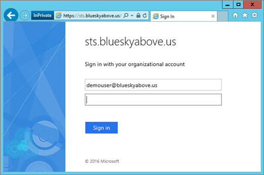
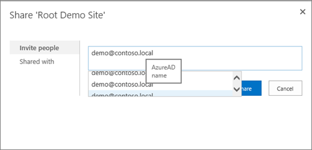

# <a name="using-azure-ad-for-sharepoint-server-authentication"></a>Verwenden von Azure AD für die SharePoint Server-Authentifizierung

 **Zusammenfassung:** Hier erfahren Sie, wie Sie Ihre SharePoint Server 2016 Benutzer mit Azure Active Directory authentifiziert. 

<blockquote>
<p>Dieser Artikel bezieht sich auf Codebeispiele für die Interaktion mit Azure Active Directory-Diagramm. Sie können die folgenden Codebeispiele herunterladen [hier](https://github.com/kaevans/spsaml11/tree/master/scripts).</p>
</blockquote>

SharePoint Server 2016 bietet die Möglichkeit zur Authentifizierung von Benutzern mithilfe der anspruchsbasierten Authentifizierung erleichtern das Verwalten von Benutzern mit unterschiedlichen Identitätsanbieter angezeigt, die Sie als vertrauenswürdig, sondern eine andere Person verwaltet authentifizieren. Anstelle der Benutzerauthentifizierung über Active Directory-Domänendienste (AD DS) verwalten, aktivieren Sie Benutzer für die Authentifizierung mithilfe von Azure Active Directory (AD Azure). Auf diese Weise können die Authentifizierung für nur-Cloud-Benutzer mit dem Suffix "onmicrosoft.com" in ihren Benutzernamen, Benutzer mit einem lokalen Verzeichnis synchronisiert, und Gastbenutzer aus anderen Verzeichnissen eingeladen. Darüber hinaus können Sie Azure AD-Features wie mehrstufige Authentifizierung und erweiterte reporting-Funktionen nutzen.

> [!IMPORTANT]
> Die in diesem Artikel beschriebene Lösung kann auch mit SharePoint Server 2013 verwendet werden. Beachten Sie, dass SharePoint Server 2013 Ende des mainstream-Support nähert jedoch beibehalten. Weitere Informationen finden Sie unter [Microsoft Lifecycle-Richtlinie](https://support.microsoft.com/en-us/lifecycle/search?alpha=SharePoint%20Server%202013) und [Aktualisiert Produkt – Wartung Richtlinie für SharePoint 2013](https://technet.microsoft.com/library/684173bb-e90a-4eb7-b268-b8d7458bc802(v=office.16).aspx).

In diesem Artikel erläutert, wie Sie Azure AD können für Ihre Benutzer erfolgen soll, anstatt Ihre lokale AD DS. In dieser Konfiguration wird Azure AD einem vertrauenswürdigen Identitätsanbieter für SharePoint Server 2016. Diese Konfiguration Fügt eine Methode zur Benutzerauthentifizierung, die von der AD DS-Authentifizierung verwendet, die nach der Installation von SharePoint Server 2016 selbst getrennt ist. Um in diesem Artikel nutzen zu können, sollten Sie sich mit WS-Federation vertraut machen. Weitere Informationen finden Sie unter [Grundlegendes zu WS-Verbund](https://go.microsoft.com/fwlink/p/?linkid=188052).


In früheren Versionen würde dieser Konfiguration einem Verbunddienst wie Azure Access Control Service (ACS) in der Cloud oder in einer Umgebung, die Active Directory-Verbunddienste (AD FS) 2.0 SAML-Token, die SAML 1.1 umgewandelt hostet erforderlich haben. Diese Transformation ist nicht mehr erforderlich, da nun Azure AD ausstellende SAML 1.1-Token ermöglicht. Das Diagramm oben zeigt die Funktionsweise der Authentifizierung für SharePoint 2016 Benutzer in dieser Konfiguration veranschaulichen, dass eine Voraussetzung für die Vermittlung diese Umwandlung ist nicht mehr.

> [!NOTE]
> Diese Konfiguration funktioniert, ob die SharePoint-Farm in Azure-virtuelle Computer oder lokalen gehostet wird. Es erfordert nicht, dass zusätzliche Firewallports als sicherstellen, dass Benutzer öffnen Azure Active Directory aus ihrem Browser zugreifen kann.

Informationen zu SharePoint 2016 Eingabehilfen finden Sie unter [Richtlinien für Eingabehilfen in SharePoint Server 2016](https://go.microsoft.com/fwlink/p/?LinkId=393123).

## <a name="configuration-overview"></a>Übersicht über die Konfiguration

Führen Sie die folgenden allgemeinen Schritte zum Einrichten Ihrer Umgebung Azure AD als einen SharePoint Server 2016 Identitätsanbieter verwendet.

1. Erstellen Sie eine neue Azure AD-Verzeichnis oder Ihr vorhandene Verzeichnis verwenden.
2. Stellen Sie sicher, dass die Zone für die Webanwendung, die Sie mit Azure AD absichern möchten für die Verwendung von SSL konfiguriert ist.
3. Erstellen Sie eine neue enterpriseanwendung in Azure Active Directory.
4. Konfigurieren eines neuen vertrauenswürdigen Identitätsanbieters in SharePoint Server 2016.
5. Legen Sie die Berechtigungen für die Webanwendung.
6. Fügen Sie eine SAML 1.1 tokenausstellung Richtlinie in Azure Active Directory hinzu.
7. Überprüfen Sie den neuen Anbieter.

In den folgenden Abschnitten wird beschrieben, wie Sie zum Ausführen dieser Aufgaben.

## <a name="step-1-create-a-new-azure-ad-directory-or-use-your-existing-directory"></a>Schritt 1: Erstellen Sie eine neue Azure AD-Verzeichnis oder Ihr vorhandene Verzeichnis verwenden

In der Azure-Verwaltungsportal ([https://portal.azure.com](https://portal.azure.com)), erstellen Sie ein neues Verzeichnis. Geben Sie den Namen der Organisation, ersten Domänennamen und Land oder Region.

 

 Wenn Sie bereits ein Verzeichnis wie für Microsoft Office 365 oder Ihr Microsoft Azure-Abonnement verfügen, können Sie stattdessen das Verzeichnis verwenden. Sie müssen Berechtigungen zum Registrieren von Anwendungen in das Verzeichnis verfügen.

## <a name="step-2-ensure-the-zone-for-the-web-application-that-you-want-to-secure-with-azure-ad-is-configured-to-use-ssl"></a>Schritt 2: Stellen Sie sicher, dass die Zone für die Webanwendung, die Sie mit Azure AD absichern möchten konfiguriert ist, um die Verwendung von SSL

Dieser Artikel wurde mit der Referenzarchitektur in [eine hohe Verfügbarkeit 2016 für SharePoint Server-Farm in Azure ausgeführt](https://docs.microsoft.com/en-us/azure/architecture/reference-architectures/sharepoint)geschrieben. Im Artikel zugehörigen Skripts verwendet, um die in [diesem Artikel](https://docs.microsoft.com/en-us/azure/architecture/reference-architectures/sharepoint) beschriebene Lösung bereitzustellen Erstellen einer Website, die nicht SSL verwendet.  

Verwendung von SAML erfordert die Anwendung zur Verwendung von SSL konfiguriert werden. Wenn Ihrer SharePoint-Webanwendung nicht für die Verwendung von SSL konfiguriert ist, verwenden Sie die folgenden Schritte zum Erstellen eines neuen selbstsignierten Zertifikats zum Konfigurieren der Webanwendung für SSL. Diese Konfiguration ist nur für eine Lab-Umgebung gedacht und sollte nicht für die Produktion. Produktionsumgebungen sollten ein signiertes Zertifikat verwenden.

1. Wechseln Sie zur **Zentraladministration** > **Anwendungsverwaltung** > **Manage Web Applications**, und wählen Sie die Webanwendung, die zur Verwendung von SSL erweitert werden muss. Wählen Sie die Webanwendung aus, und klicken Sie auf die Schaltfläche **Erweitern** . Erweitern der Webanwendung an Port 443 SSL verwenden jedoch verwenden dieselbe URL.</br></br>
2. Doppelklicken Sie in IIS-Manager auf **Serverzertifikate**.
3. Klicken Sie im Bereich **Aktionen** auf **Selbstsigniertes Zertifikat erstellen**. Geben Sie in das Feld Anzeigename für das Zertifikat einen Anzeigenamen ein, und klicken Sie auf **OK**.
4. Im Dialogfeld **Sitebindung bearbeiten** stellen Sie sicher, dass der Hostname ist identisch mit den Anzeigenamen wie in der folgenden Abbildung dargestellt.</br></br>

Jeder Front-End-Webserver in der SharePoint-Farm ist erforderlich, konfigurieren das Zertifikat für die websitebindung in IIS.


## <a name="step-3-create-a-new-enterprise-application-in-azure-ad"></a>Schritt 3: Erstellen einer neuen enterpriseanwendung in Azure AD

1. In der Azure-Verwaltungsportal ([https://portal.azure.com](https://portal.azure.com)), öffnen Sie Ihre Azure AD-Verzeichnis. Klicken Sie auf **Enterpriseanwendungen**, und klicken Sie auf **neue Anwendung**. Wählen Sie **nicht-Galerie für die Anwendung**. Geben Sie einen Namen wie beispielsweise *SharePoint SAML-Integration* , und klicken Sie auf **Hinzufügen**.</br></br>
2. Klicken Sie auf den einzelnen anmelden Link im Navigationsbereich, um die Anwendung zu konfigurieren. Ändern der Dropdownliste **Single Sign-on-Mode** auf **SAML-basierten anmelden** um die Konfigurationseigenschaften SAML für die Anwendung anzuzeigen. Mit den folgenden Eigenschaften konfigurieren:</br>
    - Bezeichner:`urn:sharepoint:portal.contoso.local`
    - Antwort-URL:`https://portal.contoso.local/_trust/default.aspx`
    - Sign-on-URL:`https://portal.contoso.local/_trust/default.aspx`
    - Benutzer-ID:`user.userprincipalname`</br>
    - Hinweis: Denken Sie daran, ändern Sie die URLs durch Ersetzen *portal.contoso.local* durch die URL der SharePoint-Website, den, die Sie sichern möchten.</br>
3. Richten Sie eine Tabelle (ähnlich wie unten in Tabelle 1) enthält, die folgenden Zeilen:</br> 
    - Realm
    - Vollständiger Pfad zur SAML-Zertifikatsdatei signieren
    - SAML-Single-Sign-On Dienst-URL (ersetzt */saml2* */wsfed*)
    - Application-Objekt-ID. </br>
Kopieren Sie den *ID* -Wert in den *Realm* -Eigenschaft in einer Tabelle (siehe Tabelle 1 unten).
4. Speichern Sie Ihre Änderungen.
5. Klicken Sie auf den Link **konfigurieren (app-Name)** für den Zugriff die anmelden Seite konfigurieren.</br></br> 
    -  Klicken Sie auf den Link **SAML-Signaturzertifikat - Rohdaten** SAML-Signaturzertifikat als die CER-Datei herunterladen. Kopieren Sie und fügen Sie den vollständigen Pfad zu der heruntergeladenen Datei in der Tabelle.
    - Kopieren und fügen Sie den Link SAML einmaliges Anmelden Dienst-URL in Ihrer, und Ersetzen Sie den */saml2* Teil der URL durch */wsfed*.</br>
6.  Navigieren Sie zu **der Eigenschaftenbereich für die Anwendung** . Kopieren Sie und fügen Sie des Objekt-ID-Werts in der Tabelle, die Sie in Schritt 3 eingerichtet.</br></br>
7. Verwenden die Werte für die erfassten, stellen Sie sicher, dass die Tabelle, die Sie in Schritt 3 eingerichtet ähnlich wie in Tabelle 1 unten zeigen.


| Tabelle 1: Werte erfasst  |  |
|---------|---------|
|Realm | `urn:sharepoint:portal.contoso.local` |
|Vollständiger Pfad zur SAML-Zertifikatsdatei signieren | `C:/temp/SharePoint SAML Integration.cer`  |
|URL der SAML-Dienst für einmaliges Anmelden (ersetzen Sie /saml2 durch /wsfed) | `https://login.microsoftonline.com/b1726649-b616-460d-8d20-defab80d476c/wsfed` |
|Application-Objekt-ID | `a812f48b-d1e4-4c8e-93be-e4808c8ca3ac` |

> [!IMPORTANT]
> Ersetzen Sie den Wert des */saml2* in der URL, mit */wsfed*. Der Endpunkt */saml2* verarbeitet 2.0 SAML-Token. Der Endpunkt */wsfed* ermöglicht Verarbeitung SAML 1.1-Token und ist für den Verbund SharePoint 2016 SAML erforderlich.

## <a name="step-4-configure-a-new-trusted-identity-provider-in-sharepoint-server-2016"></a>Schritt 4: Konfigurieren eines neuen vertrauenswürdigen Identitätsanbieters in SharePoint Server 2016

Melden Sie sich bei dem Server für SharePoint Server 2016, und öffnen Sie die SharePoint-2016-Verwaltungsshell. Füllen Sie die Werte der $realm, $wsfedurl und $filepath von Tabelle 1 ein, und führen Sie die folgenden Befehle zum Konfigurieren eines neuen vertrauenswürdigen Identitätsanbieters.

> [!TIP]
> Wenn Sie Erfahrung mit PowerShell oder erfahren mehr über die Funktionsweise von PowerShell möchten, finden Sie unter [SharePoint PowerShell](https://docs.microsoft.com/en-us/powershell/sharepoint/overview?view=sharepoint-ps). 

```
$realm = "<Realm from Table 1>"
$wsfedurl="<SAML single sign-on service URL from Table 1>"
$filepath="<Full path to SAML signing certificate file from Table 1>"
$cert = New-Object System.Security.Cryptography.X509Certificates.X509Certificate2($filepath)
New-SPTrustedRootAuthority -Name "AzureAD" -Certificate $cert
$map = New-SPClaimTypeMapping -IncomingClaimType "http://schemas.xmlsoap.org/ws/2005/05/identity/claims/name" -IncomingClaimTypeDisplayName "name" -LocalClaimType "http://schemas.xmlsoap.org/ws/2005/05/identity/claims/upn"
$map2 = New-SPClaimTypeMapping -IncomingClaimType "http://schemas.xmlsoap.org/ws/2005/05/identity/claims/givenname" -IncomingClaimTypeDisplayName "GivenName" -SameAsIncoming
$map3 = New-SPClaimTypeMapping -IncomingClaimType "http://schemas.xmlsoap.org/ws/2005/05/identity/claims/surname" -IncomingClaimTypeDisplayName "SurName" -SameAsIncoming
$ap = New-SPTrustedIdentityTokenIssuer -Name "AzureAD" -Description "SharePoint secured by Azure AD" -realm $realm -ImportTrustCertificate $cert -ClaimsMappings $map,$map2,$map3 -SignInUrl $wsfedurl -IdentifierClaim "http://schemas.xmlsoap.org/ws/2005/05/identity/claims/name"
```

Im nächsten Schritt folgendermaßen Sie vor, um den vertrauenswürdigen Identitätsanbieter für Ihre Anwendung zu aktivieren:
1. Navigieren Sie in der Zentraladministration zum **Verwalten von Web Application** , und wählen Sie die Webanwendung, die Sie mit Azure AD sichern möchten. 
2. Klicken Sie im Menüband auf **Authentifizierungsanbieter** und wählen Sie die Zone, die Sie verwenden möchten.
3. Option **vertrauenswürdiger Identitätsanbieter** aus, und wählen Sie den identifizieren Anbieter, den Sie gerade registrierten *AzureAD*.  
4. Klicken Sie auf der Anmeldeseite URL-Einstellung wählen Sie **benutzerdefinierte Anmeldeseite** , und geben Sie den Wert "/ _trust /". 
5. Klicken Sie auf **OK**.


> [!IMPORTANT]
> Es ist wichtig, führen alle Schritte, einschließlich die benutzerdefinierten anmelden auf "/ _trust /" festlegen, wie dargestellt. Die Konfiguration funktioniert ordnungsgemäß nur, wenn alle Schritte ausgeführt werden.

## <a name="step-5-set-the-permissions"></a>Schritt 5: Festlegen der Berechtigungen

Die Benutzer aus, melden Sie sich bei Azure AD und Zugriff auf SharePoint, müssen Zugriff auf die Anwendung erteilt werden. 

1. Öffnen Sie in der Azure-Verwaltungsportal das Azure AD-Verzeichnis. Klicken Sie auf **Unternehmensanwendungen**und dann auf **Alle Programme**. Klicken Sie auf die Anwendung, die Sie zuvor erstellt haben (SharePoint SAML-Integration).
2. Klicken Sie auf **Benutzer und Gruppen**. 
3. Klicken Sie auf **Benutzer hinzufügen** , um einen Benutzer oder eine Gruppe, die Berechtigung zum Anmelden an SharePoint mithilfe von Azure AD wird hinzuzufügen.
4. Wählen Sie den Benutzer oder die Gruppe aus, und klicken Sie auf **zuweisen**.
 
Der Benutzer in Azure AD Berechtigung erteilt wurde, aber auch muss die Berechtigung erteilt werden in SharePoint. Verwenden Sie die folgenden Schritte aus, um die Zugriffsberechtigungen für die Webanwendung festzulegen.

1. Klicken Sie in der Zentraladministration auf **Anwendungsverwaltung**.
2. Klicken Sie auf der Seite **Anwendungsverwaltung** im Abschnitt **Webanwendungen** auf **Webanwendungen verwalten**.
3. Klicken Sie auf die entsprechende Webanwendung und anschließend auf **Benutzerrichtlinie**.
4. Klicken Sie unter Richtlinie für Webanwendung auf **Benutzer hinzufügen**.</br></br>
5. Klicken Sie im Dialogfeld **Benutzer hinzufügen** in **Zonen** auf die entsprechende Zone, und klicken Sie dann auf **Weiter**.
6. Klicken Sie im Dialogfeld **Richtlinie für Webanwendung** im Abschnitt **Benutzer auswählen** auf das Symbol **Durchsuchen** .
7. Geben Sie in das Textfeld **Suchen** den Namen-Anmeldung für einen Benutzer in Ihrem Verzeichnis aus, und klicken Sie auf **Suchen**. </br>Beispiel: *demouser@blueskyabove.onmicrosoft.com*.
8. Unter der Überschrift AzureAD in der Listenansicht die Name-Eigenschaft, und klicken Sie auf **Hinzufügen** klicken Sie auf **OK** , um das Dialogfeld zu schließen.
9. Klicken Sie unter Berechtigungen auf **Vollzugriff**.</br></br>
10. Klicken Sie auf **Fertig stellen**, und klicken Sie dann auf **OK**.

## <a name="step-6-add-a-saml-11-token-issuance-policy-in-azure-ad"></a>Schritt 6: Hinzufügen einer SAML 1.1 tokenausstellung Richtlinie in Azure AD

Wenn die Azure AD-Anwendung im Portal erstellt wird, wird standardmäßig mit SAML 2.0. SharePoint Server 2016 erfordert das token SAML 1.1-Format. Das folgende Skript entfernt die Standardrichtlinie SAML 2.0 und Hinzufügen einer neuen Richtlinie mit Problem SAML 1.1-Token verwendet. 

> Dieser Code erfordert die zugehörige [Beispiele Interaktion mit Azure Active Directory-Diagramm](https://github.com/kaevans/spsaml11/tree/master/scripts)herunterladen. Wenn Sie die Skripts als ZIP-Datei aus GitHub auf einem Windows-Desktop herunterladen, stellen Sie sicher, dass Sie die Blockierung aufheben der `MSGraphTokenLifetimePolicy.psm1` Modul Skriptdatei und die `Initialize.ps1` Script-Datei (mit der rechten Maustaste Eigenschaften, wählen Sie zulassen, klicken Sie auf OK). 

Nachdem das Beispielskript heruntergeladen wird, erstellen Sie ein neues Powershellskript, mit dem folgenden Code, und Ersetzen Sie den Platzhalter durch den Dateipfad der heruntergeladenen `Initialize.ps1` auf dem lokalen Computer. Ersetzen Sie die Objekt-ID Anwendungsplatzhalter mit-ID der Anwendung, die Sie in Tabelle 1 eingegeben haben. Nachdem erstellt, führen Sie das PowerShell-Skript. 

```
function AssignSaml11PolicyToAppPrincipal
{
    Param(
        [Parameter(Mandatory=$true)]
        [string]$pathToInitializeScriptFile, 
        [Parameter(Mandatory=$true)]
        [string]$appObjectid
    )

    $folder = Split-Path $pathToInitializeScriptFile
    Push-Location $folder

    #Loads the dependent ADAL module used to acquire tokens
    Import-Module $pathToInitializeScriptFile 

    #Gets the existing token issuance policy
    $existingTokenIssuancePolicy = Get-PoliciesAssignedToServicePrincipal -servicePrincipalId $appObjectid | ?{$_.type -EQ "TokenIssuancePolicy"} 
    Write-Host "The following TokenIssuancePolicy policies are assigned to the service principal." -ForegroundColor Green
    Write-Host $existingTokenIssuancePolicy -ForegroundColor White
    $policyId = $existingTokenIssuancePolicy.objectId

    #Removes existing token issuance policy
    Write-Host "Only a single policy can be assigned to the service principal. Removing the existing policy with ID $policyId" -ForegroundColor Green
    Remove-PolicyFromServicePrincipal -policyId $policyId -servicePrincipalId $appObjectid

    #Creates a new token issuance policy and assigns to the service principal
    Write-Host "Adding the new SAML 1.1 TokenIssuancePolicy" -ForegroundColor Green
    $policy = Add-TokenIssuancePolicy -DisplayName SPSAML11 -SigningAlgorithm "http://www.w3.org/2001/04/xmldsig-more#rsa-sha256" -TokenResponseSigningPolicy TokenOnly -SamlTokenVersion "1.1"
    Write-Host "Assigning the new SAML 1.1 TokenIssuancePolicy $policy.objectId to the service principal $appObjectid" -ForegroundColor Green
    Set-PolicyToServicePrincipal -policyId $policy.objectId -servicePrincipalId $appObjectid
    Pop-Location
}

#Only edit the following two variables
$pathToInitializeScriptFile = "<file path of Initialize.ps1>"
$appObjectid = "<Application Object ID from Table 1>"

AssignSaml11PolicyToAppPrincipal $pathToInitializeScriptFile $appObjectid
```
> [!IMPORTANT]
> PowerShell-Skripts sind nicht angemeldet, und Sie möglicherweise aufgefordert, die Ausführungsrichtlinie festgelegt. Weitere Informationen zu Ausführungsrichtlinien finden Sie unter [Informationen zu Ausführungsrichtlinien](http://go.microsoft.com/fwlink/?LinkID=135170). Darüber hinaus müssen Sie möglicherweise eine Eingabeaufforderung mit erhöhten Rechten in den Beispielskripts enthaltenen Befehle erfolgreich ausgeführt zu öffnen.

Diese Beispiel PowerShell-Befehle sind Beispiele dafür, wie Sie Abfragen für das Diagramm-API ausführen. Weitere Informationen zu Token ausgegebenen Richtlinien mit Azure AD finden Sie unter den [Diagramm-API-Referenz für Vorgänge auf Richtlinie](https://msdn.microsoft.com/en-us/library/azure/ad/graph/api/policy-operations#create-a-policy).

## <a name="step-7-verify-the-new-provider"></a>Schritt 7: Überprüfen des neuen Anbieters

Öffnen Sie einen Browser auf die URL der Webanwendung, die Sie in den vorherigen Schritten konfiguriert haben. Sie werden zum Anmelden bei Azure AD umgeleitet.



Sie werden aufgefordert, wenn angemeldet bleiben soll.


Schließlich können Sie die Website als einen Benutzer aus Ihrem Mandanten Azure Active Directory angemeldet zugreifen.


## <a name="managing-certificates"></a>Verwalten von Zertifikaten
Es ist wichtig zu verstehen, dass das Signaturzertifikat, das für den vertrauenswürdigen Identitätsanbieter oben in Schritt 4 konfiguriert wurde, verfügt über ein Ablaufdatum und erneuert werden muss. Finden Sie Informationen im Artikel [Verwalten von Zertifikaten für Verbundpartner einmaliges Anmelden in Azure Active Directory](https://docs.microsoft.com/en-us/azure/active-directory/active-directory-sso-certs) auf Erneuerung von Zertifikaten. Nachdem das Zertifikat in Azure AD erneuert wurde, in eine lokale Datei herunterladen Sie und verwenden Sie das folgende Skript so konfigurieren Sie den vertrauenswürdigen Identitätsanbieter mit dem erneuerte Signaturzertifikat. 

```
$filepath="<Full path to renewed SAML signing certificate file>"
$cert= New-Object System.Security.Cryptography.X509Certificates.X509Certificate2($filePath)
New-SPTrustedRootAuthority -Name "AzureAD" -Certificate $cert
Get-SPTrustedIdentityTokenIssuer "AzureAD" | Set-SPTrustedIdentityTokenIssuer -ImportTrustCertificate $cert
```
## <a name="configuring-one-trusted-identity-provider-for-multiple-web-applications"></a>Konfigurieren von einem vertrauenswürdigen Identitätsanbieter für mehrere Webanwendungen
Die Konfiguration für eine einzelne Webanwendung funktioniert, aber zusätzliche Konfiguration erforderlich, wenn Sie den gleichen vertrauenswürdigen Identitätsanbieter für mehrere Webanwendungen verwenden möchten. Nehmen wir beispielsweise an, die wir hatte erweiterte so verwenden Sie die URL eine Webanwendung `https://portal.contoso.local` und möchten nun die Benutzer zu authentifizieren `https://sales.contoso.local` sowie. Zu diesem Zweck müssen wir aktualisieren den Identitätsanbieter Parameters WReply berücksichtigt und aktualisieren die Registrierung der Anwendung in Azure Active Directory eine Antwort-URL hinzufügen.

1. Öffnen Sie in der Azure-Verwaltungsportal das Azure AD-Verzeichnis. Klicken Sie auf **App Registrierungen**und dann auf **Alle Programme anzeigen**. Klicken Sie auf die Anwendung, die Sie zuvor erstellt haben (SharePoint SAML-Integration).
2. Klicken Sie auf **Einstellungen**.
3. Klicken Sie in das Blade Einstellungen auf **Antwort URLs**. 
4. Fügen Sie die URL für diese zusätzlichen Webservern mit `/_trust/default.aspx` an die URL angehängt (z. B. `https://sales.contoso.local/_trust/default.aspx`), und klicken Sie auf **Speichern**. 
5. Öffnen Sie die **SharePoint 2016-Verwaltungsshell** und führen Sie die folgenden Befehle, mit dem Namen eines der vertrauenswürdigen identitätstokenherausgeber, die Sie zuvor verwendet, auf dem SharePoint-Server.

```
$t = Get-SPTrustedIdentityTokenIssuer "AzureAD"
$t.UseWReplyParameter=$true
$t.Update()
```
6. In der Zentraladministration wechseln Sie zu der Anwendung, und aktivieren Sie den vorhandenen vertrauenswürdigen Identitätsanbieter. Denken Sie daran, konfigurieren die URL der Anmeldeseite auch als einer benutzerdefinierten Anmeldeseite `/_trust/`.
7. Klicken Sie in der Zentraladministration klicken Sie auf die Webanwendung aus, und wählen Sie **Benutzerrichtlinie**. Hinzufügen eines Benutzers mit den entsprechenden Berechtigungen an, wie zuvor in diesem Artikel veranschaulicht.

## <a name="fixing-people-picker"></a>Beheben von der Personenauswahl
Benutzer können jetzt melden Sie sich von Identitäten von Azure AD SharePoint 2016, aber es sind noch Möglichkeiten zur Verbesserung der benutzerfreundlichkeit. Suchen nach einem Benutzer werden beispielsweise mehrere Suchergebnisse in der Personenauswahl. Es ist ein Suchergebnis für jede der 3 Anspruchstypen, die in der forderungszuordnung erstellt wurden. Um einen Benutzer mithilfe der Personenauswahl auszuwählen, müssen Sie genau Geben Sie ihren Benutzernamen und wählen Sie den **Namen** dem Anspruch das Ergebnis.



Es ist keine Validierung auf den Werten die Suche nach, was zu Rechtschreibfehlern führen kann oder der Forderung Benutzer versehentlich auswählen die falsche Anspruchstyp wie die **SurName** zuweisen. Dadurch kann verhindern, dass Benutzer erfolgreich auf Ressourcen zugreifen.

Zur Erleichterung der in diesem Szenario ist eine Open-Source-Lösung bezeichnet [AzureCP](https://yvand.github.io/AzureCP/) , die einen benutzerdefinierten Anspruchsanbieter für SharePoint 2016 bereitstellt. Es werden im Azure AD-Diagramm verwenden, um zu beheben, was Benutzer eingeben, und führen Sie Überprüfung. Weitere Informationen finden Sie unter [AzureCP](https://yvand.github.io/AzureCP/). 

## <a name="additional-resources"></a>Zusätzliche Ressourcen

[Grundlegendes zu WS-Federation](https://go.microsoft.com/fwlink/p/?linkid=188052)
  
[Cloudakzeptanz und Hybridlösungen](cloud-adoption-and-hybrid-solutions.md)
  
## <a name="join-the-discussion"></a>An der Diskussion teilnehmen

|**Kontakt**|**Beschreibung**|
|:-----|:-----|
|**Welche Lösungen benötigen Sie?** <br/> |Wir entwickeln Inhalte für Lösungen auf Grundlage mehrerer Microsoft-Produkte und -Dienste. Lassen Sie uns wissen, was Sie von unseren serverübergreifenden Lösungen halten, oder fordern Sie spezifische Lösungen an, indem Sie eine E-Mail an [MODAcontent@microsoft.com](mailto:cloudadopt@microsoft.com?Subject=[Cloud%20Adoption%20Content%20Feedback]:%20) senden.<br/> |
|**An der Diskussion über Lösungen teilnehmen** <br/> |Wenn Sie sich für Cloud-basierte Lösungen interessieren, werden Sie Teil des Cloud Adoption Advisory Board (CAAB), um Zugriff auf eine größere, dynamische Community aus Microsoft-Inhaltsentwicklern, Branchenexperten und Kunden aus aller Welt zu haben. Um beizutreten, fügen Sie sich selbst als Mitglied des [CAAB (Cloud Adoption Advisory Board)-Bereichs](https://aka.ms/caab) der Microsoft Tech Community hinzu, und senden Sie uns eine E-Mail an [CAAB@microsoft.com](mailto:caab@microsoft.com?Subject=I%20just%20joined%20the%20Cloud%20Adoption%20Advisory%20Board!). Communityinhalte stehen allen Personen im [CAAB-Blog](https://blogs.technet.com/b/solutions_advisory_board/) zur Verfügung. CAAB-Mitglieder erhalten jedoch Einladungen zu privaten Webinaren, die neue Ressourcen und Lösungen für den Cloud-Einsatz beschreiben.<br/> |
|**Die hier gezeigte Grafik abrufen** <br/> |Wenn Sie eine bearbeitbare Kopie der Grafik wünschen, die Sie in disem Artikel sehen, senden wir Sie Ihnen gerne zu. Senden Sie eine E-Mail mit der Anforderung einschließlich der URL und dem Titel der Grafik an [cloudadopt@microsoft.com](mailto:cloudadopt@microsoft.com?subject=[Art%20Request]:%20).  <br/> |
   

