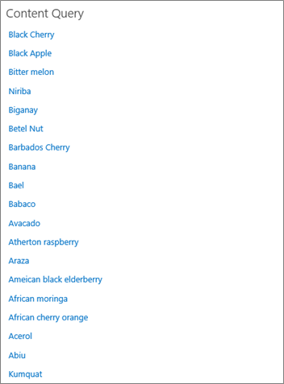

# Über Inhaltssuche-Webpart anstatt Webpart für Inhaltsabfragen zum Verbessern der Leistung in SharePoint OnlineUsing Content Search Web Part instead of Content Query Web Part to improve performance in SharePoint Online

In diesem Artikel wird beschrieben, wie auf die Leistung zu erhöhen, indem Sie das Webpart für Inhaltsabfragen durch das Inhaltssuche-Webpart in SharePoint Server 2013 und SharePoint Online ersetzen.This article describes how to increase performance by replacing the Content Query Web Part with the Content Search Web Part in SharePoint Server 2013 and SharePoint Online.
  
Eine effizienteste neue Features von SharePoint Server 2013 und SharePoint Online ist das Content Search Web Part (CSWP). Dieses Webpart verwendet den Suchindex schnell Ergebnisse abgerufen, die dem Benutzer angezeigt werden. Verwenden Sie das Inhaltssuche-Webpart anstelle der Content Abfrage Web Part (CQWP) auf den Seiten zum Verbessern der Leistung für Ihre Benutzer.One of the most powerful new features of SharePoint Server 2013 and SharePoint Online is the Content Search Web Part (CSWP). This Web Part uses the search index to quickly retrieve results which are shown to the user. Use the Content Search Web Part instead of the Content Query Web Part (CQWP) in your pages to improve performance for your users.
  
Verwenden ein Inhaltssuche-Webpart über ein Webpart für Inhaltsabfragen wird deutlich besser seitenladeleistung SharePoint Online fast immer führen. Es ist eine wenig zusätzliche Konfiguration die richtige Abfrage abgerufen, aber die verbesserte Leistung und happier Benutzer sind.Using a Content Search Web Part over a Content Query Web Part will almost always result in significantly better page load performance on SharePoint Online. There is a little additional configuration to get the right query, but the rewards are improved performance and happier users.
  
## Der Leistungsgewinn vergleichen, die aus der Inhaltssuche-Webpart verwenden, anstatt Webpart für InhaltsabfragenComparing the performance gain you get from using Content Search Web Part instead of Content Query Web Part

Die folgenden Beispiele zeigen die relative Leistungsgewinnen, die möglicherweise angezeigt wird, wenn Sie ein Inhaltssuche-Webpart anstelle von einem Webpart für Inhaltsabfragen verwenden. Die Effekte sind deutlicher mit einer komplexen Websitestruktur und sehr große Content-Abfragen.The following examples show the relative performance gains you may receive when you use a Content Search Web Part instead of a Content Query Web Part. The effects are more obvious with a complex site structure and very broad content queries.
  
In diesem Beispiel Website weist folgende Merkmale auf:This example site has the following characteristics:
  
- 8 Ebenen von Unterwebsites.8 levels of subsites.
    
- Enthält einen benutzerdefinierten "Obst" Inhaltstyp verwenden.Lists using a custom "fruit" content type.
    
- Im Webpart ist das Inhaltsabfrage umfassende, alle Elemente mit dem Inhaltstyp "Frucht" zurückgeben.In the Web Part, the content query is broad, returning all items with the content type of "fruit".
    
- Im Beispiel wird nur 50 Elemente 8 Standorten verwendet. Die Effekte werden auch für Websites mit Weitere Inhalte zu deutlicher.The example only uses 50 items across the 8 sites. The effects will be even more pronounced for sites with more content.
    
Es folgt ein Screenshot der Ergebnisse der das Webpart für Inhaltsabfragen.Here is a screen shot of the results of the Content Query Web Part.
  

  
Verwenden Sie in Internet Explorer die Registerkarte **Netzwerk** der F12-Entwicklertools betrachten Sie die Details für den Antwortheader. Im folgenden Screenshot ist der Wert für die **SPRequestDuration** für diese Seite Last 924 Millisekunden.In Internet Explorer, use the **Network** tab of the F12 developer tools to look at the details for the response header. In the following screen shot, the value for the **SPRequestDuration** for this page load is 924 milliseconds. 
  

  
 **SPRequestDuration** gibt den Zeitraum der Arbeit, ausgeführt wird, auf dem Server auf die Seite vorbereiten. Ändern des Inhalts von Webparts für Inhaltsabfragen mit Inhalt von Suchwebparts erheblich verringert den Zeitaufwand zum Rendern der Seite. Im Gegensatz dazu hat eine Seite mit einer gleichwertigen Inhaltssuche-Webpart, die gleiche Anzahl von Ergebnissen zurückgeben **SPRequestDuration** Wert 106 Millisekunden wie in diesem Screenshot dargestellt:**SPRequestDuration** indicates the amount of work that is done on the server to prepare the page. Switching Content by Query Web Parts with Content by Search Web Parts dramatically reduces the time it takes to render the page. By contrast, a page with an equivalent Content Search Web Part, returning the same number of results has an **SPRequestDuration** value of 106 milliseconds as shown in this screen shot: 
  

  
## Hinzufügen eines Inhaltssuche-Webparts in SharePoint OnlineAdding a Content Search Web Part in SharePoint Online

Hinzufügen einer Inhaltssuche-Webpart ist sehr ähnlich einer regulären Webpart für Inhaltsabfragen. Finden Sie im Abschnitt *"Hinzufügen eines Inhaltssuche-Webpart"* unter [Configure ein Inhaltssuche-Webpart in SharePoint](https://support.office.com/article/Configure-a-Content-Search-Web-Part-in-SharePoint-0dc16de1-dbe4-462b-babb-bf8338c36c9a).Adding a Content Search Web Part is very similar to a regular Content Query Web Part. See the section  *"Add a Content Search Web Part"*  in [Configure a Content Search Web Part in SharePoint](https://support.office.com/article/Configure-a-Content-Search-Web-Part-in-SharePoint-0dc16de1-dbe4-462b-babb-bf8338c36c9a).
  
## Erstellen die richtigen Suchabfrage für die Inhaltssuche-WebpartCreating the right search query for your Content Search Web Part

Nachdem Sie ein Inhaltssuche-Webpart hinzugefügt haben, können Sie verfeinern die Suche und die gewünschten Elemente zurückgeben. Ausführliche Informationen hierzu finden Sie im Abschnitt, *"Content durch Konfigurieren einer erweiterten Abfrage in ein Inhaltssuche-Webpart anzeigen"* unter [Konfigurieren eines Inhalts-Webparts in SharePoint](https://support.office.com/article/Configure-a-Content-Search-Web-Part-in-SharePoint-0dc16de1-dbe4-462b-babb-bf8338c36c9a).Once you have added a Content Search Web Part, you can refine the search and return the items you want. For detailed instructions on how to do this, see the section,  *"Display content by configuring an advanced query in a Content Search Web Part"*  in [Configure a Content Search Web Part in SharePoint](https://support.office.com/article/Configure-a-Content-Search-Web-Part-in-SharePoint-0dc16de1-dbe4-462b-babb-bf8338c36c9a).
  
## Entwickeln und Testen von Tool AbfragenQuery building and testing tool

Ein Tool zum Erstellen und Testen komplexe Abfragen finden Sie unter dem [Search-Abfrage-Tool](https://sp2013searchtool.codeplex.com/) bei Codeplex.For a tool to build and test complex queries, see the [Search Query Tool](https://sp2013searchtool.codeplex.com/) on Codeplex. 
  

