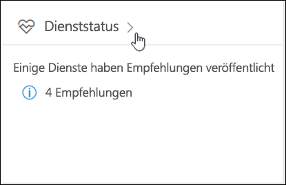
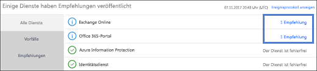
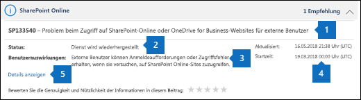
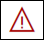
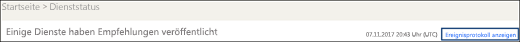
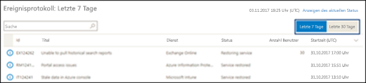

# Gewusst wie: Überprüfen von Office 365-Dienststatus

Sie können die Integrität der Office 365, Yammer, Microsoft Dynamics CRM und Microsoft Intune Cloud-Dienste auf der Seite Office 365 **Dienststatus** im Administrationscenter anzeigen. Wenn Sie Probleme mit einer Cloud-Dienst sind, können Sie den Dienststatus, um zu bestimmen, ob dies ein bekanntes Problem mit einer Auflösung ausgeführt, ist bevor Sie Support anrufen oder Zeit zur Problembehandlung ausgeben überprüfen. 
  
### Gewusst wie: Überprüfen des Dienststatus

1. Wechseln Sie zu [https://portal.office.com/adminportal/home](https://portal.office.com/adminportal/home#/homepage) und melden Sie sich mit einem Konto des Farmadministrators ein. 
    
    > [!NOTE]
    > Personen, die der Administratorrolle oder globaler Administrator zugewiesen sind, können Dienststatus anzeigen. Damit Exchange, SharePoint und Skype für Business-Admins Dienststatus anzeigen können, müssen sie auch die Dienst-Administratorrolle zugewiesen werden. 
  
2. Um Dienststatus, im Administrationscenter zu öffnen, wechseln Sie zur **Integrität** > **Dienststatus**, oder klicken Sie auf den **Dienst Health Karte** im **Home-Dashboard**. Die Karte Dashboard gibt an, ob es ein Problem Active-Dienst und Links zu der Seite Detaillierte Health ist.
    
    
  
3. Der Zustand der einzelnen Cloud-Dienste wird in einem Tabellenformat mit einem Symbol an, dass möglichen Zuständen angezeigt.
    
> [!TIP]
> Sie können auch die [Office 365 Admin app](https://go.microsoft.com/fwlink/p/?linkid=627216) auf dem mobilen Gerät Dienststatus, anzeigen, eine hervorragende Möglichkeit zum mit Push-Benachrichtigungen auf dem laufenden ist. 
  
### Anzeigen der Details gebuchten Dienststatus

In der Standardansicht werden alle Dienste und deren aktuellem Integritätsanalyse Status angezeigt. Wählen Sie zum Filtern der Ansicht zu Diensten, die derzeit einen Vorfall auftritt **Vorfälle** aus der schattierten häufig verwendete Hyperlinks auf der linken Seite. Auswählen von **Ratschläge** werden nur die Dienste angezeigt, die derzeit eine Empfehlung veröffentlicht haben. Aus der Ansicht **alle Dienste** wird durch Klicken auf den angezeigten Dienststatus eine Zusammenfassungsansicht der Empfehlung oder Vorfall geöffnet. 
  

  
Die Empfehlung oder Zusammenfassung des Vorfalls bietet die folgende Informationen: 
  

  
1. Ein Problem-ID und Zusammenfassung-Anweisung des Problems.
    
2. Der aktuelle Status. Finden Sie unter Statusdefinitionen in diesem Artikel finden Sie eine Erläuterung der einzelnen möglichen Status.
    
3. Eine Beschreibung des wie dieses Problem Benutzer auswirken kann.
    
4. Die Zeit, die das Problem gestartet wurde und dem Zeitpunkt der letzten, die die Dienst Health Nachricht aktualisiert wurde. Im Verlauf des ein Problem bereitstellen wir häufige Nachrichten, damit Sie den Fortschritt zu wissen, den wir vornehmen, bei der Anwendung einer Lösung.
    
5. Wählen Sie den Link **Details anzeigen** , finden weitere Informationen zu dem Problem, einschließlich des Verlaufs aller Nachrichten veröffentlicht wurden, während wir an einer Lösung arbeiten. 
    
### Übersetzen von Dienstdetails Integrität

Da Service Health Erklärungen in Echtzeit gebucht, sie werden nicht automatisch in Ihrer Sprache übersetzt, und die Details eines Ereignisses Service nur in Englisch sind. Um die Erklärung zu übersetzen, gehen Sie folgendermaßen vor:
  
1. Wechseln Sie zur [Übersetzer](https://www.bing.com/translator/).
    
2. Wählen Sie auf der Seite **Dienststatus** eine Vorfall oder Empfehlung aus. Kopieren Sie den Text zu dem Problem, klicken Sie unter **Details anzeigen**.
    
3. Klicken Sie im Translator fügen Sie den Text, und wählen Sie **Übersetzen**.
    
### Definitionen

Die meisten Dienste Zeit werden ohne weitere Informationen wie fehlerfrei angezeigt. Wenn ein Dienst ein Problem aufgetreten ist, wird das Problem wird als eine Empfehlung oder ein Vorfall identifiziert und zeigt den aktuellen Status.
  
> [!TIP]
> Geplante Wartung Ereignisse in Dienststatus nicht angezeigt werden. Sie können geplante Wartung Ereignisse verfolgen, indem Sie mit der **Nachrichtencenter**Stand bleiben. Filtern von Nachrichten als Änderung planen, um zu ermitteln, wann die Änderung erfolgen soll, dessen Effekt und wie es bei der Vorbereitung kategorisiert. Einzelheiten finden Sie unter [Nachrichtencenter in Office 365](https://support.office.com/article/38fb3333-bfcc-4340-a37b-deda509c2093) . 
  
### Vorfälle und Ratschläge

|||
|:-----|:-----|
||Wenn ein Dienst eine Empfehlung angezeigt wurde, sollten Sie ein Problem, das einige Benutzer beeinflusst werden, aber der Dienst ist weiterhin verfügbar. In einer Empfehlung ist häufig eine Abhilfe für dieses Problem, und das Problem möglicherweise zeitweilig oder wird im Bereich und Benutzer Auswirkungen begrenzt.    |
||Weist ein Dienst auf einen aktiven Vorfall dargestellt, es ist ein kritisches Problem, und der Dienst oder eine der Hauptfunktionen des Diensts ist nicht verfügbar. Beispielsweise Benutzer möglicherweise keine e-Mails senden und empfangen oder -Anmeldung nicht möglich Vorfälle müssen bedeutende Auswirkung auf Benutzer. Wenn ein Vorfall in Bearbeitung vorhanden ist, bieten wir Updates bezüglich der Untersuchung, Abhilfemaßnahmen und Bestätigung der Lösung im Dashboard Health Service.    |
   
### Statusdefinitionen

|**Status**|**Definition**|
|:-----|:-----|
|**Untersuchen von** | Wir wissen, ein potenzielles Problem und Weitere Informationen über was passiert, und der Bereich der Auswirkungen gesammelt werden. |
|**Dienstbeeinträchtigung** | Wir haben bestätigt, dass ein Problem, die Verwendung des Diensts oder einer Funktion beeinflussen können. Dieser Status wird möglicherweise angezeigt, wenn ein Dienst langsamer als gewöhnlich durchführt, stehen Ihnen zeitweilige unterbrochen wird, oder wenn ein Feature funktionsfähig ist. |
|**Unterbrechung des Dienstes** | Dieser Status wird angezeigt, wenn Sie also feststellen, dass ein Problem wirkt sich die Möglichkeit für Benutzer den Zugriff auf Dienste auf. In diesem Fall das Problem ist von Bedeutung und durchgängig reproduzieren kann. |
|**Wiederherstellen von Diensten** | Die Ursache des Problems wurde erkannt, wir wissen, welche Maßnahmen zum Erfassen, und es werden gerade verwenden aus der Dienst wieder in einem fehlerfreien Status befinden. |
|**Erweiterte Wiederherstellung** | Dieser Status gibt an, dass die Maßnahme ist noch in Arbeit wiederherstellen Service für die meisten Benutzer jedoch dauert einige Zeit in allen betroffenen Systemen zu erreichen. Dieser Status wird möglicherweise auch angezeigt, wenn wir eine temporäre Auswirkungen verringern, während eine endgültige Lösung anwenden gewartet beheben vorgenommen haben. |
|**Untersuchung angehalten** | Wenn eine Anforderung für zusätzliche Informationen von Kunden an uns weiter untersuchen ermöglichen die detaillierte Untersuchung auf ein potenzielles Problem führt, wird dieser Status wird angezeigt. Wenn wir fungieren sollen, müssen wir Sie wissen, welche Daten oder Protokolle wir benötigen lassen. |
|**Dienst wiederhergestellt** | Wir haben bestätigt, dass Maßnahme aufgelöst wurde das zugrunde liegende Problem und den Dienst in einem fehlerfreien Zustand wiederhergestellt wurde. Um herauszufinden, welche Fehler aufgetreten sind, können zeigen Sie das Problemdetails an. |
|**Nach dem schadensbericht veröffentlicht** | Wir haben einen Post Vorfall-Bericht nach einem bestimmten Problem veröffentlicht, die umfasst Stamm Ursache Informationen und nächste Schritte, um sicherzustellen, dass ein ähnliches Problem nicht mehr auftritt. |
   
## „Verlauf“

Dienststatus können Sie sehen Sie sich den aktuellen Status und Anzeigen des Verlaufs von Dienst Ratschläge und Vorfälle in den letzten 30 Tagen. Um die letzten Integrität aller Dienste anzuzeigen, wählen Sie auf der Seite **Dienststatus** **Historie anzeigen** aus. 
  

  
Eine Liste aller Service Health Nachrichten in der ausgewählten Zeitrahmen gebucht wird angezeigt, wie unten dargestellt:
  

  
Sie können die Gesundheitsdaten für die letzten 7 Tage oder der letzten 30 Tagen anzeigen. Wählen Sie eine Zeile aus, um weitere Informationen zu diesem Problem anzuzeigen.
  
Weitere Informationen zu unserem Engagement für Betriebszeit finden Sie unter [Transparent Vorgänge von Office 365](https://go.microsoft.com/fwlink/?linkid=848695).
  
## Lassen Sie feedback

Unser Ziel besteht darin, sicherzustellen, dass die Informationen, die wir Ihnen zu einer laufenden Problem bereitstellen rechtzeitige, genauer und hilfreicher ist. Um uns mitzuteilen wie wir tun, wählen Sie eine Bewertung Stern. Nachdem Sie uns eine Bewertung von 1 auf 5 Sterne gewähren möchten, können Sie auf eine beliebige spezifische Details Feedback. Ihr Feedback verwenden wir um unser Service Health System zu optimieren.
  

  
## Siehe auch

[Berichte im Office 365 Administrationscenter](https://support.office.com/article/0d6dfb17-8582-4172-a9a9-aed798150263)

